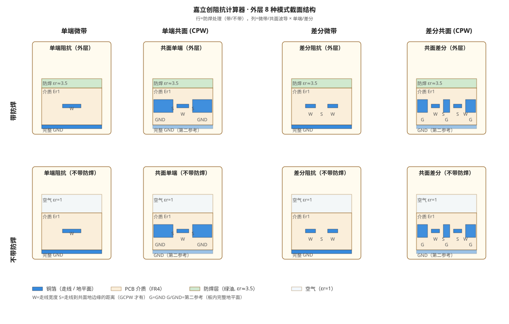
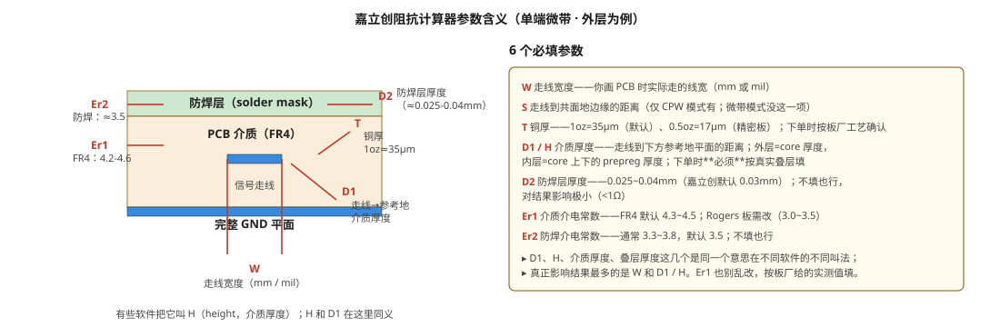

# 嘉立创阻抗计算器详解：8 种模式怎么选

嘉立创阻抗计算器顶部下拉里默认给的是 **"外层"** 8 种模式（带/不带防焊 × 微带/共面 × 单端/差分）。打开一看一头雾水——「共面」「单端」「外层」「带防焊」到底啥区别？这篇帮你把每一项拆开看，再对应到自己的工程实际。

> 适用版本：嘉立创阻抗计算器网页版（2026 年版式）；**嘉立创的工艺能力与计价会调整**，下单前看官方说明。
> 关联阅读：[射频传输线：微带与共面波导](../../硬件与半导体/射频与天线/射频传输线-微带与共面波导.md)（共面波导结构）、[特征阻抗与阻抗匹配](../../硬件与半导体/射频与天线/特征阻抗与阻抗匹配.md)（Z₀ 只看截面）、[CH582M 2.4G 天线：阻抗计算与 FR4 板材完整方案](../../硬件与半导体/射频与天线/CH582M%202.4G天线阻抗与FR4方案.md)（实际项目落地）。

## 一、先看 4 个维度——8 种模式 = 4 个维度的笛卡尔积

外层 8 种模式不是随手列的，而是下面 4 个维度各自二选一的组合：

| 维度 | 二选一 | 物理含义 |
|---|---|---|
| **位置** | 外层 vs 内层 | 走线在板子的哪一面。外层 = Top/Bottom 表层，参考地在另一面；内层 = 信号夹在两个地平面之间（带状线，嘉立创下拉里另开一组 8 个） |
| **共面性** | 微带 vs 共面（CPW） | 微带：参考地只在走线**下方**；CPW：走线**两边也有地**（GND），共同决定阻抗 |
| **类型** | 单端 vs 差分 | 单端：1 条走线，目标 50 Ω；差分：2 条耦合走线，目标 90/100 Ω |
| **防焊** | 带防焊 vs 不带防焊 | 带防焊：走线上方覆盖绿油（εr≈3.5）；不带防焊：走线裸露空气（εr=1） |

组合：**位置=外层固定** × **共面性（2）× 类型（2）× 防焊（2）= 2×2×2 = 8 种**——就是下拉里看到的全部条目。

---

## 二、四个维度逐一拆解

### 1. 位置：外层 vs 内层

- **外层**：走线在 Top 或 Bottom 表层，下方一整块参考地。**默认首选**——射频、微波、绝大多数高速走线都在外层。
- **内层**：信号夹在两个参考地平面之间（带状线 Stripline）。**损耗比外层小**（被参考地全包，辐射少），但**走线到两地的距离之和 = 介质厚度，叠层难调**。嘉立创默认不展开，需在下拉顶部切到「内层」。

> **射频天线馈线禁止走内层**——内层介质完全包覆走线，辐射损耗、天线效率会变差。蓝牙/2.4G 馈线一律**表层微带**或**表层 CPW**。

### 2. 共面性：微带（Microstrip） vs 共面波导（Coplanar Waveguide, CPW）

- **微带**：信号走线 + **下方**一整块完整地。上方是空气（带防焊时上方是绿油）。
- **共面波导（CPW）**：信号走线 + **下方**地 + **两侧**也有共面地。多了两侧地的并联电容，**同样目标阻抗下线宽可以更窄**，并且对参考地完整性要求更宽容（CPW 的电流主要在两侧共面地回流，不强依赖下方完整地）。

> 完整解释见 [射频传输线：微带与共面波导](../../硬件与半导体/射频与天线/射频传输线-微带与共面波导.md)。
> **嘉立创选择**：射频 / 高频优先 CPW；普通数字信号（USB / HDMI 等差分）通常选微带就够。

### 3. 类型：单端 vs 差分

- **单端**：1 条信号线对地阻抗，目标 **50 Ω**（最常见，RF、时钟、单端高速）。
- **差分**：2 条耦合信号线，差分阻抗 **90 Ω（USB）/ 100 Ω（以太网、RS422、LVDS）/ 85 Ω（HDMI）** 等。

> 差分模式**线宽 W** + **线间距 S** 一起决定阻抗；S 越窄耦合越强、Z_diff 越低。
> **CH582M 射频口是单端 50 Ω**，不是差分——别选错。

### 4. 防焊：带防焊 vs 不带防焊

- **带防焊（默认）**：表层走线上覆盖绿油（solder mask），上方介质 εr≈3.3~3.8（绿油本身）。
- **不带防焊**：走线**裸露**或局部开窗，上方是空气 εr=1。

> **物理直觉**：绿油盖在走线上方会抬高"有效介电常数"，同等线宽下 Z₀ 会**略微降低**；「不带防焊」假设走线直接面对空气（εr=1），有效 Er 更低，所以同等目标阻抗下计算器会**自动把线宽加宽**。这就是为什么「不带防焊」算出来的 W 通常比「带防焊」大几 mil。

⚠️ **致命误区：「选了『不带防焊』≠ 板厂自动给你开窗」**。计算器只是按"裸铜对空气"的模型算线宽；**你必须在 PCB 的阻焊层（Solder Mask）上真的画开窗（去掉绿油）**，实物才会是裸铜。如果你只选了「不带防焊」、却忘了画开窗，实物仍然盖着绿油 → 算出的线宽完全失效，实测阻抗严重偏离目标！

工程上**绝大多数 PCB 选「带防焊」**——因为绿油是 PCB 表面工艺的一部分，走线裸露空气的几乎只有"局部开窗的金手指""键合焊盘""芯片天线辐射振子"等极少数情况。**2.4G 蓝牙频段留绿油影响很小（仅几 Ω），没必要为馈线强行开窗**；开窗主要用于 5G/WiFi、毫米波，或天线辐射本体裸露。下单时如果没特殊理由，**默认选带防焊**。

---

## 三、8 种模式结构与适用场景



> 上图：4 列 = 微带 / CPW × 单端 / 差分；2 行 = 带防焊 / 不带防焊。走线用蓝色铜箔、介质用米色 FR4、防焊用浅绿、空气用淡蓝。

| 序号 | 嘉立创名称 | 结构 | 典型应用 |
|---|---|---|---|
| 1 | 单端阻抗（外层） | 微带 + 带防焊 | **默认首选**：单端 50 Ω 高速信号（时钟、SPI、低速 USB） |
| 2 | 单端阻抗（不带防焊） | 微带 + 裸露空气 | 几乎不用；仅键合 / 局部开窗的金手指天线 |
| 3 | 差分阻抗（外层） | 微带差分 + 带防焊 | **90/100 Ω 差分**：USB 2.0、RS422、以太网、HDMI（外层） |
| 4 | 差分阻抗（不带防焊） | 微带差分 + 裸露空气 | 几乎不用 |
| 5 | 共面单端（外层） | CPW + 带防焊 | **射频首选**：2.4G / 5G / Sub-1G 馈线；CH582M BLE 用这种 |
| 6 | 共面单端（不带防焊） | CPW + 裸露空气 | 极少见；芯片天线 / 局部净空的开窗走线 |
| 7 | 共面差分（外层） | CPW 差分 + 带防焊 | 射频差分：USB 3.0 在 RF 板、毫米波差分对 |
| 8 | 共面差分（不带防焊） | CPW 差分 + 裸露空气 | 几乎不用 |

**快速决策**：

- 普通 50 Ω 时钟 / SPI / 单端高速 → **单端阻抗（外层）**
- USB 2.0 / RS422 / 以太网差分对 → **差分阻抗（外层）**
- 蓝牙 / 2.4G / WiFi / 433M 馈线、天线 π 匹配段 → **共面单端（外层）**
- 其它没特殊理由 → **别选「不带防焊」**

---

## 四、和你的 CH582M 怎么对得上

你在做 [CH582M 2.4G BLE 天线](../../硬件与半导体/射频与天线/CH582M%202.4G天线阻抗与FR4方案.md)，RF 馈线用的是 **GCPW（共面波导带地平面）W=26 mil / S=8 mil**。对应到嘉立创模式：

| 你的实际 | 选这个 |
|---|---|
| CH582M RF 馈线（GCPW，单端 50 Ω，表层走线） | **共面单端（外层）** ← 截图里那个高亮的就是它 |
| 如果你给板子加了 USB 2.0（D+/D- 差分 90 Ω） | 差分阻抗（外层） |
| 如果你打算走 4 层板，射频走内层（L3） | 内层 8 种模式里选「单端阻抗 / 内层」 |

参数填法（GCPW 共面单端，1.2 mm 双层 FR4 1oz 铜）：

```
模式：共面单端（外层）
W（走线宽）：26 mil = 0.6604 mm
S（走线到共面地）：8 mil = 0.2032 mm
T（铜厚）：1oz = 0.035 mm
D1（H，走线到参考地介质厚度）：1.2mm - 1oz 铜 - 防焊 ≈ 1.13 mm
    （或者按你下单的 core 厚度填，例如 1.0 mm）
D2（防焊厚）：0.03 mm
Er1（FR4）：4.3
Er2（防焊）：3.5
目标阻抗：50 Ω
```

> 嘉立创的 GCPW 算法不算「带地平面」版本（下方完整地作为第二参考），实际更接近纯 CPW。如果你下面挖空了地，计算结果会偏小——**馈线下方一定要保留完整地**！

---

## 五、参数含义（单端微带为例）



> 上图：6 个必填参数 W / S / T / D1 / D2 / Er1 / Er2 在计算器界面里的位置和单位说明。

| 参数 | 含义 | 影响大小 |
|---|---|---|
| **W** 走线宽度 | PCB 上实际画的线宽 | ⭐⭐⭐ 影响最大 |
| **S** 走线到共面地的距离 | 仅 CPW 模式有 | ⭐⭐ |
| **T** 铜厚 | 1oz=35μm，0.5oz=17μm | ⭐ 精修用 |
| **D1 / H** 介质厚度 | 走线到下方参考地的距离 | ⭐⭐⭐ 影响最大（和 W 同量级） |
| **D2** 防焊层厚度 | ≈0.025-0.04mm | 几乎不影响（&lt;1Ω） |
| **Er1** 介质介电常数 | FR4=4.2-4.6，Rogers 板 3.0-3.5 | ⭐⭐ |
| **Er2** 防焊介电常数 | ≈3.3-3.8 | 几乎不影响 |

> **D1、H、core 厚度、介质厚度、叠层厚度**——这几个名字在不同软件里指同一个东西。嘉立创叫 **D1**，JLCPCB 的叠层管理器叫 **core/prepreg 厚度**，Saturn 里叫 **H**。下单前一定**按真实叠层填**，不要乱估。

---

## 六、选型决策树

```
开始
 ├─ 你要走什么信号？
 │   ├─ 射频（2.4G / WiFi / 433M / BLE）──→ 共面单端（外层）  ← CH582M
 │   ├─ 差分对（USB / HDMI / 以太网 / RS422）──→ 差分阻抗（外层）
 │   ├─ 单端高速（时钟 / SPI / SDRAM）──→ 单端阻抗（外层）
 │   └─ 普通低速（UART / GPIO）──→ 不算阻抗，线宽满足载流即可
 │
 ├─ 走线在表层还是内层？
 │   ├─ 表层（Top/Bottom）──→ 外层 8 种
 │   └─ 内层（带状线）──→ 切到内层 8 种（嘉立创下拉里另开一组）
 │
 ├─ 有没有特殊结构？
 │   ├─ 走线两边有共面地 ──→ CPW（共面）
 │   └─ 没有 ──→ 微带（默认）
 │
 └─ 防焊默认带 / 不带？
     └─ 默认「带防焊」（除非局部开窗/键合/裸露天线）
```

---

## 七、常见误区

1. **「阻抗神器算出 50 Ω 走线就能匹配」**
   错。算出的是**特征阻抗**——只保证走线全程 Z₀ 连续。**源阻抗**（驱动端输出阻抗）和**负载阻抗**（天线/接收端）还要单独匹配（π 型 LC 网络），用 VNA 调 S11 才能算闭环。
2. **「我把馈线下方地挖空，阻抗就算不准」**
   错。挖空 = 破坏参考地平面，**结构本身被改**，特征阻抗概念都不再适用。馈线下方必须保留完整地。
3. **「天线净空越大越好」**
   错。净空只针对**天线辐射本体**（如倒 F 天线的折弯辐射段）；**馈线（芯片→天线那段）下方要保留完整地**，否则阻抗崩塌。
4. **「嘉立创单层板也能控制阻抗」**
   单层板下方没有地参考平面，特征阻抗几乎不可控；要做阻抗控制**至少 2 层**。
5. **「嘉立创双层板就会管控 ±5% 阻抗」**
   错。嘉立创标准双层板**不做阻抗管控**（按几何蚀刻 ±15% 波动）。要做管控得选"阻抗板"选项、加钱，且仅四层板可控；双层板务必留 π 匹配用 VNA 调。
6. **「线宽算出来就一成不变」**
   实际板厂蚀刻 ±0.5 mil 公差 + 介质厚度公差，**双层 ±15%、四层 ±10%** 是常态；务必留 **π 型匹配焊盘**后期调。
7. **「选了『不带防焊』板厂就会自动开窗」**
   错。计算器只按裸铜模型算线宽，开窗是你自己的 PCB 设计动作（在阻焊层画开窗）。只选模式、不画开窗 → 实物仍盖绿油，线宽失效、阻抗严重偏离。
8. **「射频线两边铺了地，还按普通微带算」**
   错。信号线两侧有共面地 = 结构已变成 GCPW（接地共面波导），**必须选共面模型（共面单端 / 共面差分）并严格遵守算出的缝宽 S**。模型与实物不匹配，阻抗直接不准。反过来，若你清掉两侧地做纯微带，就要用「单端阻抗（外层）」模型并重新算更宽的线宽。

**极简记忆口诀：**

> 射频长线馈线，下方有地、两侧无地 → **单端阻抗（外层）**（纯微带）
> 信号线左右紧贴铺 GND 铜皮 → 选 **共面单端（外层）**（GCPW）
> 走线开窗裸露铜皮 → 勾选 **不带防焊**（且务必真画开窗）
> USB 差分信号 → **差分阻抗（外层）**

---

## 八、实操清单

按你的 CH582M 板下单时，下面这个备注模板可以直接复制粘贴到嘉立创订单备注：

```
阻抗控制要求：
- 模式：共面单端（外层）
- 走线层：L1（Top）
- 参考地：L2 完整地平面（馈线下方严禁挖空）
- 走线宽 W：26 mil
- 共面缝宽 S：8 mil（走线到两侧共面地边缘）
- 铜厚：1 oz（35 μm）
- 介质厚度（D1）：按实际叠层填（约 1.0~1.13 mm）
- 板材：FR4，Er1=4.3~4.5
- 目标阻抗：50 Ω ±10%
- 公差：±15% 内可接受；出货附阻抗实测报告

补充：
- 天线辐射本体区域净空（禁止铺地、走线、过孔），≥5 mm
- 馈线总长度 < 15 mm，越短越好
- 馈线全程 50 Ω，宽度不变；打过孔需重新评估
```

---

## 九、下一步

- 看共面波导的物理原理、与微带的工程取舍 → [射频传输线：微带与共面波导](../../硬件与半导体/射频与天线/射频传输线-微带与共面波导.md)
- 理解"为什么阻抗计算器只算线宽不算线长" → [特征阻抗与阻抗匹配](../../硬件与半导体/射频与天线/特征阻抗与阻抗匹配.md)
- 你的 CH582M 完整 FR4 双层 / 四层方案 → [CH582M 2.4G 天线：阻抗计算与 FR4 板材完整方案](../../硬件与半导体/射频与天线/CH582M%202.4G天线阻抗与FR4方案.md)
- 嘉立创下单流程、PCB / SMT 选项 → [实战下单流程](实战下单流程.md)
- 嘉立创 EDA 整体取舍、什么时候用它什么时候用 Altium → [嘉立创 EDA 总览](index.md)