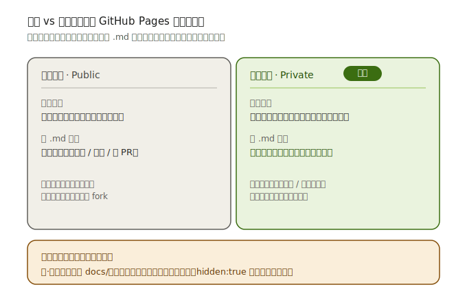
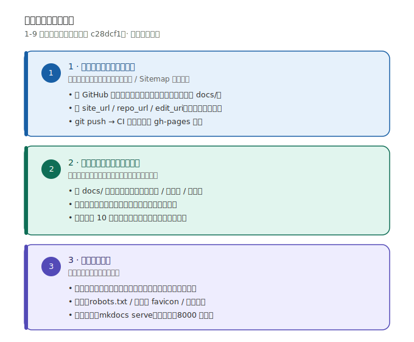

# 改造全记录（1-9）

这是一篇总账式日志，把最近对知识库站点做的改造全部串起来。前面 1-6 已在之前的迭代里完成；7-9 是本次新增；第 1 项仍待你在 GitHub 侧完成。

> **本地仓库**：`D:\WorkSpace\Note\wiki`  
> **构建环境**：`C:\Users\1\.workbuddy\binaries\python\envs\wiki`  
> **站点生成器**：MkDocs + Material 9.7.6

## 前情提要

一开始这个 Vault 只是 Obsidian 本地笔记；后来想用 MkDocs 把它变成类似 [Power's Wiki](https://wiki-power.com) 的干净文档站。于是做了这些大改动：

- 主题底座：本地 Noto 字体、`extra.css` 视觉签名、`roamlinks` 自动转 Obsidian 链接、最后更新时间、minify、mermaid、数学公式等。
- 配色与导航：把默认的紫色改成白底 + 蓝强调，顶部 `navigation.tabs` + 左侧 `navigation.sections`，一级分类都用 `index.md` 做分区首页。
- 内容：首页做成 landing page，加 shields.io static badge，从 Power's Wiki 搬运了若干硬件设计基础知识（MIT 授权并署名），并写了 static badge 的详细教程。

到上一条消息时，还有 9 件事想排清楚。下面就是它们。

---

## 1. 建 GitHub 仓库 + 配置 `site_url` / `repo_url` / `edit_uri`

**状态：已完成 ✅。** 仓库：`wild-civil/civil_wiki`，主分支 `main`。

把静态网页放到互联网的最简单方案是 **GitHub Pages** + GitHub Actions：

1. 在 GitHub 新建**私有**仓库 `civil_wiki`（私有即可，渲染页仍会公开，见下）。
2. 本地仓库绑定远端并推送（注意分支是 `main`，不是 `master`）：

   ```bash
   cd D:\WorkSpace\Note\wiki
   git remote add origin https://github.com/wild-civil/civil_wiki.git
   git branch -M main
   git push -u origin main
   ```

3. `mkdocs.yml` 里的地址已换成真的：

   ```yaml
   site_url: https://wiki.hanvon.top/
   repo_url: https://github.com/wild-civil/civil_wiki
   edit_uri: edit/main/docs
   ```

4. 仓库 `Settings → Pages → Source` 选 **"Deploy from a branch"**，然后选 `gh-pages` / `(root)`。推送后 `.github/workflows/ci.yml` 会自动 `mkdocs gh-deploy` 到 `gh-pages` 分支，Pages 即上线。

**公开 / 私有仓库到底差在哪？** 看这张对比图——结论：**仓库公私只影响源码 `.md` 是否可见，渲染出的网站始终全网公开**：



**隐私提醒**：GitHub Pages 发布出来的网页是全网公开的，即使仓库设为私有也一样（私有只隐藏 `.md` 源文件，不隐藏渲染页）。所以工作/私人笔记要斟酌后再上 Pages。

---

## 2. 示例随笔、收件箱指南移出导航

**状态：已完成。**

仓库里有两个占位文件，不打算对公开站点展示：

- `docs/博客/2026-07-17-示例随笔.md`
- `docs/Inbox/把待整理笔记放这里.md`

做法是：在 front matter 中加 `hidden: true`。

```yaml
---
title: 示例随笔
date: 2026-07-17
hidden: true   # 不进入导航、搜索、标签聚合
---
```

这样它们不会出现在左侧导航、搜索结果和标签云中，但保留在仓库里当模板/说明。

---

## 3. 挑拣或打码怎么操作？

**状态：已完成，并整理成操作口径。**

准备公开笔记时，常见三种粒度：

| 粒度 | 操作 | 适用场景 |
| --- | --- | --- |
| **整篇移出** | 把敏感 `.md` 从 `docs/` 移到 Vault 其他目录（例如 `Private/` 或 `Inbox/` 之外），并加入 `.gitignore` | 全文不适合公开 |
| **局部打码** | 在正文里用占位符替换敏感信息，例如 `10.x.x.x` → `10.0.0.0`，人名 → `张**` | 只有一小段敏感 |
| **只移出导航** | 保留在 `docs/` 但加 `hidden: true` | 暂时不想展示，但未来会公开 |

**关键原则**：如果你放在 `docs/` 里且提交到 git，即便 MkDocs 导航没显示，它仍然可能通过 URL 直接访问（MkDocs 会复制所有文件）。真正要保密，必须把它**物理移出 `docs/`**。

---

## 4. MathJax 本地化

**状态：已完成。**

之前的 `extra_javascript` 引用了 cdnjs 的 MathJax。为了国内网络更稳，我把 `tex-mml-svg.js` 下载到 `docs/javascripts/mathjax/`，然后：

```yaml
extra_javascript:
  - javascripts/mathjax.js
  - javascripts/mathjax/tex-mml-svg.js
```

`mathjax.js` 使用 SVG 输出，不需要额外字体，配合本地字体策略完全零外部依赖。

---

## 5. 启用 `material.tags`

**状态：已完成。**

在 `mkdocs.yml` 的 `plugins` 里加一行：

```yaml
plugins:
  - search
  - ...
  - tags   # 标签聚合
```

然后新建 `docs/标签.md`，正文里放这个标记：

```markdown
<!-- material/tags -->
```

Material 会自动把所有页面 front matter 里的 `tags:` 汇总成标签云。注意：这一页 **不要** 在 front matter 里写 `tags: true`，否则构建会报错。

---

## 6. 404 页面

**状态：已完成。**

新建 `docs/404.md`，并隐藏导航和目录：

```yaml
---
title: 404
hide:
  - navigation
  - toc
---

# 页面未找到 :material-file-search-outline:

抱歉，你访问的页面不存在，或已被移动。

- 返回 [知识库首页](README.md)
```

MkDocs Material 会自动识别 `404.md` 作为站点 404 页面。

---

## 7. 导航校验脚本

**状态：本次新增 ✅。**

文件：`Scripts/check_nav.py`

随着手动维护的 `nav:` 越来越复杂，很容易出现 "导航指向了一个不存在的文件" 或 "某篇笔记没被导航引用" 的问题。这个脚本会：

1. 解析 `mkdocs.yml` 的 `nav` 配置；
2. 检查每个引用的 `.md` 文件是否真实存在；
3. 列出所有未被引用的文件，并自动识别 `hidden: true` 的页面；
4. 发现缺失文件时返回非 0 退出码，方便接入 CI 或提交前检查。

用法：

```bash
python Scripts/check_nav.py           # 宽松模式：只报错缺失文件
python Scripts/check_nav.py --strict  # 严格模式：未纳入导航的非 hidden 文件也报错
```

当前运行结果：

```text
[✓] 导航引用的 31 个本地文件全部存在。
[ℹ] 未被导航引用但故意隐藏（hidden:true）的页面 2 个。
[✓] 没有遗漏的（非隐藏）Markdown 文件。
结果：PASS
```

---

## 8. 社交分享卡片

**状态：本次新增 ✅。**

为了让别人把链接贴到微信、Twitter、Discord 时能显示漂亮的卡片，需要：

1. **生成一张 1200 × 630 的预览图**：`docs/assets/images/social.png`。
2. **在网页 `<head>` 注入 Open Graph / Twitter Card meta 标签**。

我没有用 Material 自带的 `social` 插件（它在 Windows 环境需要 cairosvg + GTK，容易失败），而是用 **Pillow** 纯脚本生成 PNG，再用模板覆盖注入 meta：

- 生成脚本：`Scripts/make_social_card.py`
- 模板覆盖：`overrides/main.html`

生成的卡片效果：


> 注意：因为图片上写了站点名，如果你改了 `site_name`，记得重跑 `python Scripts/make_social_card.py`。

---

## 9. Sitemap / SEO

**状态：本次新增 ✅。**

为了 SEO 和搜索引擎收录，需要 `sitemap.xml`。由于当前环境镜像没有 `mkdocs-sitemap-plugin`，我改用一个 **原生 MkDocs hook**：

- Hook 文件：`Scripts/sitemap_hook.py`
- 注册方式（`mkdocs.yml` 顶层）：

  ```yaml
  hooks:
    - Scripts/sitemap_hook.py
  ```

这个 hook 在 `mkdocs build` 完成后自动扫描 `docs/` 下所有非 hidden 的 `.md`，按 MkDocs 默认目录 URL 规则生成 `sitemap.xml` 到 `site/` 根目录。优点是零第三方依赖、自动识别 `hidden: true`、可继续扩展（例如按优先级给首页加权）。

配合 `site_url` 占位，构建时会输出：

```text
[sitemap] 已生成 D:\WorkSpace\Note\wiki\site\sitemap.xml，包含 33 个 URL
```

> MkDocs Material 在配置 `site_url` 后还会自动注入 `<link rel="canonical">`，对 SEO 也有帮助。

---

## 下一步

部署已经打通，接下来按这张路线图推进：



1. **填充内容（最该做的）**：后续真实笔记按 `docs/领域/主题/标题.md` 放入，导航和标签会自动变得饱满。
2. **延续改造日志**：再有改造时，直接新增 `docs/博客/博客改造日志/YYYY-MM-DD-标题.md`。
3. **恢复每日自动分类**：之前暂停的自动化（`automation-1783502814920`）可在确认 `Scripts/classify.py` 仍适配新结构后恢复。
4. 站点上线后访问 `https://wiki.hanvon.top/`（本仓库已设独立自定义域名，覆盖账号用户站点 `blog2.hanvon.top` 的默认继承），确认 GitHub Actions 构建成功。
5. **多站点域名规划**：知识库 / 博客 / 书摘 / 作品 四个站点统一收在 `hanvon.top` 下各用独立子域名，详见《域名规划与部署》。

---

**本地构建命令备忘**：

```bash
cd D:\WorkSpace\Note\wiki
python Scripts/check_nav.py
python Scripts/make_social_card.py
CODEBUDDY_SAFE_DELETE_SANDBOX=0 mkdocs build
# 或本地预览
mkdocs serve
```
