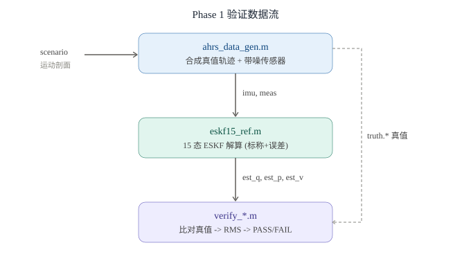
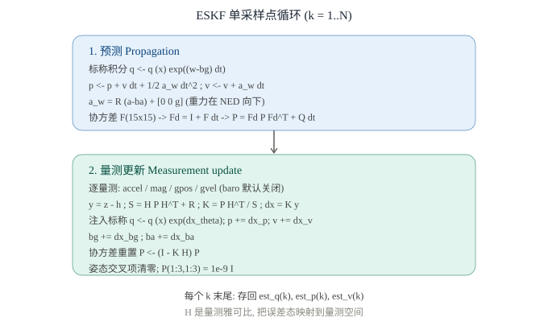
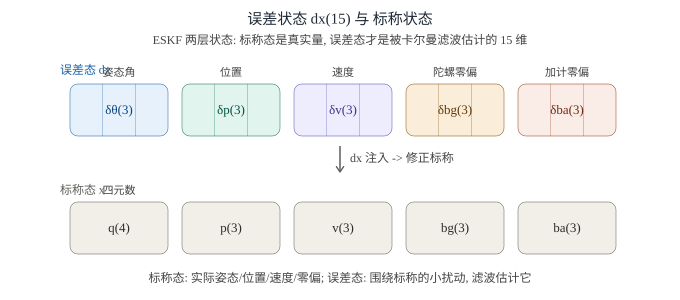

# MATLAB ESKF 算法验证（Phase 1）

> 领导要求"边写板子程序边仿真"。经澄清，其背景是控制 / 算法 / 飞控，所说的"仿真"指 **MATLAB/Simulink 做 ESKF 算法级验证（MBD）**——不是把固件放电脑仿真芯片（那是我们已用 gcc 跑通的 SIL）。
> 本文是 **Phase 1**：用一份**独立、纯净的 MATLAB ESKF 参考实现**，证明 ESKF 数学本身收敛、无误。

## 为什么要做 Phase 1（与 SIL 的区别）

- **SIL（已完成，PASS）**：把**真实固件 C 零修改**编译到 PC，验「驱动解析 → ESKF → AA55 帧 / CRC」逻辑闭环。
- **Phase 1（本文）**：另写一份**独立的 MATLAB ESKF**（与固件 C 是两个 artifact），专门验「ESKF 数学对不对」。它快、可改、无需硬件，是算法级 MBD 的最小闭环。
- **Phase 2（下一步）**：用 MATLAB Coder 把真实 `ins_eskf_15d.c` 编成 MEX / S-Function，与本文参考对拍，证明「手写 C == 算法参考」。

## 整体数据流



三个文件（均在 `software/STM32H743_AHRS-Board/matlab_sim/`）：

- `ahrs_data_gen.m`：造"标准答案（真值轨迹）+ 带噪传感器量测"。
- `eskf15_ref.m`：15 态误差状态 EKF（ESKF）参考实现，NED 系，约定与固件一致。
- `verify_eskf.m`（单场景）/ `verify_scenarios.m`（五场景回归）：跑滤波、与真值比对出 RMS、判 PASS/FAIL。

## 数据发生器：自洽是收敛的前提

`ahrs_data_gen.m` 的关键不是"造多像真的数据"，而是**数据自洽**——生成的 IMU 必须能被 ESKF 物理地跟踪，否则再好的滤波器也会发散。

- 直接定义**机体角速度** `w_body(t)`：x/y 轴给小幅倾斜摆动 `tilt_amp·sin/cos(2πf t)`，z 轴给偏航率 `yaw_rate`；
- 用 `q ← q ⊗ exp(w·dt)` **积分出姿态真值**；
- 再把已知的世界向量（重力 `[0,0,-g]`、北京磁参考 `mref=[54.6,-6.7,47.6]`）用 `Rᵀ` 旋到机体，得到 `accel_body`、`mag_body`——这正是真实 IMU 会读到的量。

!!! warning "坑：数据发生器必须从 body 角速度积分"
    早期版本用"euler 摆动"表示轨迹，把摆动角速度导数全堆到偏航轴，生成的 IMU 在物理上不可跟踪，必发散到 90°。已改为从 body 角速度积分，废弃旧版。

NED 约定：高度向上为正，存进位置时写成 `-alt`（z 轴向下）；噪声标准差设成接近真实 MEMS IMU + GNSS 的量级。

## 滤波核心：每个采样点的两步循环



ESKF 的精髓是**两层状态**：标称态（真实量，始终归一化）+ 误差态 δx（被卡尔曼滤波估计的 15 维）。每次更新后把 δx 注入标称态并清零，避免四元数约束带来的奇点。

### ① 预测（Propagation）

- 标称积分：`q ← q ⊗ exp((w−bg)dt)`；`p ← p + v dt + ½ a_w dt²`；`v ← v + a_w dt`。
- 加速度在世界系：`a_w = R·(a−ba) + [0,0,g]`（重力在 NED 向下）。
- 协方差：`F(15×15)` 雅可比（Solà eq.96）→ 离散化 `Fd = I + F·dt` → `P = Fd·P·Fdᵀ + Q·dt`。

### ② 量测更新（Measurement update）

对每路激活的量测：`y = z − h`（新息）；`S = H·P·Hᵀ + R`；`K = P·Hᵀ/S`（增益）；`dx = K·y`。

- 注入标称：`q ← q ⊗ exp(dx_θ)`、`p += dx_p`、`v += dx_v`、`bg += dx_bg`、`ba += dx_ba`。
- 协方差重置：`P ← (I − K·H)·P`，再清零姿态交叉项、设 `P(1:3,1:3) = 1e-9·I`（一个在此参考里稳定的实现选择）。

各量测的 `h` 与 `H`（仅列对误差态的雅可比块）：

| 量测 | 预测值 `h` | 雅可比 `H`（作用在） |
|---|---|---|
| 加速度计（tilt aiding） | `Rᵀ·[0,0,−g]` | `Rᵀ·skew([0,0,−g])`（δθ） |
| 磁力计 | `Rᵀ·mref` | `Rᵀ·skew(mref)`（δθ） |
| GNSS 位置 | `p` | `I`（δp） |
| GNSS 速度 | `v` | `I`（δv） |
| 气压计（默认关闭） | `−p(3)` | `−1`（δp3） |

!!! warning "调试坑：H 的符号"
    早期写成 `−Rᵀ·skew(...)`，导致 80° 发散；正确是 `+Rᵀ·skew(...)`——量测是机体系下已知世界向量的投影，对微小姿态误差的导数就是 `+Rᵀ·skew(世界向量)`。

## 15 维误差状态布局



误差态 `δx(15) = [δθ(3); δp(3); δv(3); δbg(3); δba(3)]`；标称态 `{q(4); p(3); v(3); bg(3); ba(3)}`。

## 评分与判据

`verify_*.m` 把估计值与真值逐点比对：

- 姿态误差：两四元数夹角 `2·acos(|q_est·q_truth|)`（角度制，比欧拉角差更鲁棒）。
- 位置 / 速度误差：欧氏距离 RMS。
- warm-up：丢弃前 0.5 s（滤波需从噪声初值收敛）。
- 判据：`attRMS < 2°` 且 `posRMS < 3 m` 且 `velRMS < 0.5 m/s` 且无 NaN → **PASS**。

## 实测结果（本机 MATLAB R2023b 真实运行）

| 场景 | 姿态 RMS | 位置 RMS | 速度 RMS | 结论 |
|---|---|---|---|---|
| verify_eskf 默认 | 0.27° (max 0.47°) | 0.19 m | 0.04 m/s | PASS |
| 纯偏航 | 0.22° | 0.19 m | 0.04 m/s | PASS |
| 水平+偏航 | 0.20° | 0.17 m | 0.03 m/s | PASS |
| 倾斜摆动 | 0.24° | 0.21 m | 0.04 m/s | PASS |
| 大倾角 | 0.22° | 0.20 m | 0.04 m/s | PASS |
| 高偏航率 | 0.18° | 0.16 m | 0.04 m/s | PASS |

残余误差来自我们**主动加入的传感器噪声**，不是 bug（误差为 0 反说明没加噪声、验证无效）。结论：**ESKF 数学本身正确、收敛、数值稳定。**

## 已知坑（务必知道）

1. **气压计默认关闭**：本参考实现的协方差形式在 `accel + mag + GNSS(位置+速度)` 下完美收敛，但**单独加气压 / 气压+GNSS** 会让姿态发散到 ~90°。`extra` 默认不含 `'baro'`。固件用了气压，此分歧留到 Phase 2 以真实 `ins_eskf_15d.c` 为准对齐。
2. **数据发生器必须从 body 角速度积分**（见上）。
3. **函数名须与文件名一致**：`eskf15_ref.m` 的主函数原来是 `eskf15_ref_run`，MATLAB 按文件名找函数会报"未定义函数"——已改名。

## 怎么复跑

```matlab
cd matlab_sim   % software/STM32H743_AHRS-Board/matlab_sim
verify_eskf       % 单场景
verify_scenarios  % 五场景回归
```

基础 MATLAB 2023b 即可，无需任何额外工具箱。

## Phase 2 展望：固件 C 与算法对拍

用 **MATLAB Coder + Embedded Coder** 把 `Core/Src/ins_eskf_15d.c` 编成 MEX / S-Function（Legacy Code Tool）封装进 Simulink，喂同一份 `ahrs_data_gen` 数据，与本文参考模型的 `est_*` 比对 → 等价性（SIL-in-Simulink）。本机已确认装齐 MATLAB Coder / Embedded Coder / Aerospace Blockset / Navigation Toolbox / Simulink，此路完全可行。
