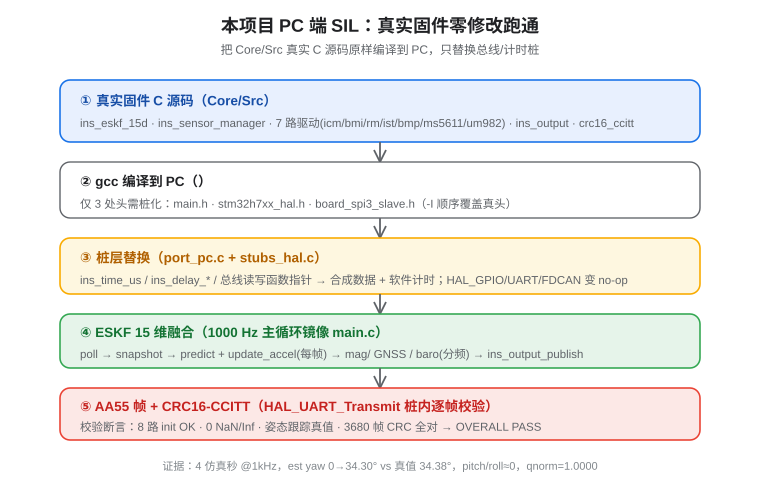

# PC 端 SIL 实战（真实固件零修改跑通）

> 把 `Core/Src` 下的**真实固件 C 源码一字未改**编译到 PC 运行（SIL / Software-In-the-Loop），只替换总线层。
> 这是 [验证策略总览](验证策略总览.md) 里 L1 的落地版——零硬件就能把「驱动解析 → ESKF → 协议帧」逻辑闭环验掉。

## 1. 架构与数据流



### 接缝在哪：平台抽象层（PAL）

`ins_port.h` 用函数指针把 HAL 隔离成天然接缝：

- `ins_bus_t` 含 `read_reg` / `write_reg` / `uart_read` 函数指针；
- `ins_time_us` / `ins_delay_ms` / `ins_delay_us` 计时与延时。

PC 移植**只需重写这层 .c 实现**，其余 `ins_*`、7 个传感器驱动、`crc16_ccitt` 均 HAL 无关，原样编译即可忠实执行固件逻辑。

### 桩化范围（只有 3 处头拉 HAL）

| 头文件 | 桩里做什么 |
|---|---|
| `main.h` | 真头拉 `stm32h7xx_hal.h` + 外设句柄；PC 桩只留类型占位 |
| `stm32h7xx_hal.h` | 桩化 `HAL_GPIO_*` / `HAL_UART_*` / `HAL_FDCAN_*` / `__HAL_*` 宏为 no-op 或桩函数 |
| `board_spi3_slave.h` | `ins_spi3_slave_init` / `ins_spi3_slave_publish` 变 no-op |

编译时用 `-Isim_pc/include -ICore/Inc` 让桩头**顺序优先**覆盖真头，并定义 `-DSIM_PC`。

### 合成数据源（port_pc.c）

按各驱动**真实寄存器 / WHO_AM_I** 造数，保证走的是真实解析路径：

- ICM-42688P 读 `0x75`→`0x47`、`0x1F`→14B 大端（Z 轴重力≈9.81，陀螺≈0）
- IIM-42652 读 `0x75`→`0x6D`
- BMI088 加速 `0x00`→`0x1E`、陀螺 `0x00`→`0x0F`
- RM3100 `0x36`→`0x22`、`0x24`→9B 大端
- IST8310 `0x00`→`0x10`、`0x02`→`0x01(DRDY)`、`0x03`→6B 小端
- BMP581 `0x01`→`0x50`、`0x20/0x1D`→24 位小端
- MS5611 读 PROM(8 字) + 合成 D1/D2（自洽）
- UM982 提供合成 `$GNRMC` / `$GNGGA`

### CRC 校验桩（stubs_hal.c）

在桩化的 `HAL_UART_Transmit` 内部**逐帧校验 AA55 的 CRC16-CCITT**（poly 0x1021, init 0x0000，算 VER..payload），统计 `crc_ok / crc_bad`。

## 2. 主循环镜像（main_sim.c）

忠实镜像 `main.c` 的 ESKF 分支（`USE_ESKF=1`）：

- 算 dt → `ins_sensor_manager_poll` → 取 snapshot
- `eskf15_predict` + `update_accel`（每帧，重力归一化 r=0.1）
- `update_mag`（每 10 次）→ `update_gnss_pos/vel`（每 50 次，首次 fix≥3 设原点）→ `update_baro`（每 20 次）
- `ins_output_publish`
- 内置断言：NaN/Inf 检测、姿态跟踪真值、AA55 CRC 统计

## 3. 运行结果（PASS）

场景：水平板 + 绕 Z 轴恒偏航 0.15 rad/s，**4 仿真秒 @ 1 kHz**。

| 检查项 | 结果 |
|---|---|
| 8 路传感器 init | 全 OK（err_mask = 0） |
| NaN/Inf 样本 | **0** |
| 姿态跟踪真值 | est yaw 0 → **34.30°** vs 真值 34.38°；pitch/roll ≈ 0；qnorm = 1.0000 |
| AA55 帧 CRC | 3680 帧全部 `crc_ok`，`crc_bad = 0` |
| **OVERALL** | **PASS — 固件逻辑在 PC 上干净跑通** |

这证明固件「**驱动寄存器解析 → ESKF 融合 → AA55 帧/CRC 协议**」整条逻辑闭环无错。

## 4. 能抓 / 不能抓（边界要心里有数）

!!! success "SIL 能抓（已验）"
    - 算法/逻辑/协议层：ESKF 收敛、NaN、增益与噪声协方差、AA55/CRC、多源更新顺序。

!!! warning "SIL 抓不到（必须上真硅）"
    - 真实 **DMA / D-Cache 缓存一致性**
    - **SPI 时序裕量**
    - **1000 Hz 实时性 / 栈深度 / 负载**
    - **HardFault**（指令级问题归 L2 Renode / Keil Simulator 与 L3 实板）

## 5. 一键复跑

```bash
cd software/STM32H743_AHRS-Board
gcc -std=c11 -O2 -Isim_pc/include -ICore/Inc -DSIM_PC -o sim_pc/sim_firmware \
  Core/Src/ins_sensor_manager.c Core/Src/ins_eskf_15d.c Core/Src/ins_mahony_ahrs.c \
  Core/Src/ins_output.c Core/Src/crc16_ccitt.c Core/Src/tdk_icm426xx.c \
  Core/Src/bosch_bmi088.c Core/Src/ist_ist8310.c Core/Src/pni_rm3100.c \
  Core/Src/bosch_bmp581.c Core/Src/te_ms5611.c Core/Src/unicore_um982.c \
  sim_pc/port_pc.c sim_pc/stubs_hal.c sim_pc/main_sim.c -lm
./sim_pc/sim_firmware
```

> 注：本机 Git Bash 里 `make` 未识别，故直接用 gcc 命令；脚手架文件在 `sim_pc/`（`include/` 桩头、`port_pc.c`、`stubs_hal.c`、`main_sim.c`、`Makefile`）。

## 6. 下一步（按「先跑固件 → 再深入仿真」路线）

1. **L2 全固件仿真**：用 Renode 建模 STM32H743 + 7 个外设，跑真实 `.elf`，抓 HardFault/IRQ/初始化顺序（无需真硬件，但要写外设模型）。
2. **L3 实板 / HIL**：拿到开发板/样片后，把 `sim_pc` 的「合成数据源」换成真实总线，验证 D-Cache 一致性等硬件特有坑（参考 `验证清单_Keil全量编译烧录.md`）。
3. **SIL 回归测试化**：在 `port_pc.c` 里加「回放真实采数」模式，替换当前合成运动，作为长期回归基线。
4. **Simulink/MBD 对照**（可选）：把 ESKF 建模成模型 + Embedded Coder，与手写 C 做 SIL 比对，详见 [验证策略总览 §4](验证策略总览.md)。
