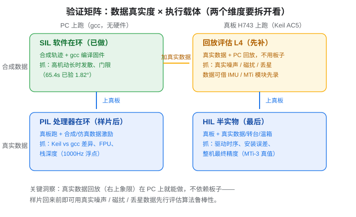

# 验证矩阵与真实数据回放（L4）

> 承接《[验证策略总览](验证策略总览.md)》的 MIL/SIL/PIL/HIL 阶梯，本篇补上总览里缺失的关键维度：**数据真实度 × 执行载体** 的二维矩阵，以及矩阵里性价比最高的空档——**真实数据回放评估（L4）**。
> 核心结论：**SIL 全过 ≠ 可以直接上真机**。合成数据太干净（白噪声、无磁扰、GNSS 不丢星），它验证的是"代码对不对"；"数据真了还稳不稳"必须用真实数据回答，而这层**不需要等板子**。

## 1. 为什么 SIL 之后不能直接跳半实物

SIL（PC 上用 gcc 编译真实固件、跑合成轨迹）能抓"算法错、移植错、门限错"这类纯逻辑问题，但它喂的是 `ahrs_data_gen` 造的合成数据，对真实世界的几个杀手毫无感知：

| 合成数据假设 | 真实世界 | 可能后果 |
|---|---|---|
| 白噪声、参数恒定 | MEMS 有色噪声 + 温漂 | 门限（如 accel 幅值门限 `gf=0.3`）误触发/漏触发 |
| 磁环境理想 | 电机/金属机架/电流环磁干扰 | 磁力计有效性检查失效、yaw 被污染 |
| GNSS 始终有效 | 丢星 / 多径 / fix 等级切换 | 丢星处理逻辑从未被验证 |
| 传感器时间戳完美同步 | 驱动时序抖动、总线争用 | 数据同步误差未验 |
| 振动可忽略 | 复合翼 5~20g 振动 | 加速度计饱和、陀螺 g 敏感未验 |

这些在合成数据里**根本不存在**，所以 SIL 的收敛结论不能外推到真机。

## 2. 数据真实度 × 执行载体：把"验证手段"拆成两个维度

很多人把"真实数据"和"真板"绑在一起想（"等板子回来用真实数据仿真"），其实它们是**两个独立的维度**：



| | PC 上跑（gcc） | 真板 H743 上跑（Keil AC5） |
|---|---|---|
| **合成数据** | **SIL**：验证算法/移植/门限（已做） | **PIL**：验证编译器差异/FPU/栈深度（样片后） |
| **真实数据** | **回放评估 L4**：验证真实噪声/磁扰/丢星下的鲁棒性（★ 现在可做） | **HIL**：验证驱动时序/安装误差/整机精度（样片+转台） |

关键洞察：**右上象限（真实数据 + PC）不需要板子**。借一块现成 IMU 模块（或 MTi 开发板）录数据，转成标准格式，喂给现有的 PC 验证链就能跑——样片回来前即可回答"真实环境下算法还灵不灵"。

## 3. 完整验证链路（七步，不能跳）

```
① MATLAB 算法参考（oracle）→ ② C 移植 + 等价性对拍 → ③ SIL（gcc 全轨迹）
→ ④ 真实数据回放评估（L4）→ ⑤ PIL（真板+仿真数据）→ ⑥ HIL（真板+真实数据/转台）
→ ⑦ 地面/装机试验 + 与原飞控或商用模块并行比对 → 保守首飞
```

每一步验证的对象不同：

| 步 | 手段 | 验证对象 | 能抓的典型问题 |
|---|---|---|---|
| ① | MATLAB `eskf15_ref.m` 参考实现 | 算法设计 | F/H 不自洽、协方差坍缩（见[踩坑实录](ESKF验证与踩坑实录.md)） |
| ② | MEX / Simulink S-Function 包 C 逐拍对拍 | 代码移植 | 索引错、符号错、单双精度差 |
| ③ | gcc 编固件跑合成轨迹 | 长时收敛 | 高机动发散、门限参数 |
| ④ | 真实数据 + PC 回放 | 数据鲁棒性 | 真实噪声下门限不适配、磁干扰、丢星 |
| ⑤ | 真板 + 仿真数据 | 编译器/CPU | Keil vs gcc 浮点差异、硬件 FPU、栈溢出 |
| ⑥ | 真板 + 真实激励/转台/温箱 | 整机 | 驱动时序、IMU 安装误差、最终精度 |
| ⑦ | 地面/装机试验 + 并行比对 | 装机集成 | 与既有航姿源交叉验证，保守切换 |

## 4. L4 回放评估工具链（本项目落地）

三段式：**板载记录 → 格式转换 → PC 回放**。

```
① ins_logger（固件，HAL-free）→ ② raw2sim.py → ③ replay_eval.m
   帧=magic+t_us+25×float32      CSV/帧流 → sim_data.bin 同款    MATLAB 参考回放+指标
   25 float 布局与 sim_data.bin   缺真值自动进自洽性模式          有真值→RMS 判定
   行完全同构，导出即转换                                       无真值→自洽性指标
```

- **ins_logger**（`Core/Src|Inc/ins_logger.c|h`）：线性缓冲满即停，帧布局与 PC SIL 的 `sim_data.bin` 行**逐列同构**，因此录出来的数据无需中间格式直接进转换层。默认关闭，`main.c` 挂两处钩子即可。
- **raw2sim.py**：接受任意 IMU 模块导出的 CSV，或 ins_logger 二进制流；输出 `sim_data.bin` 同款布局（`int32 N + float32 dt + N×25`）；可选气压通道单独出 `.baro.bin`。缺真值时数据被标记为"自洽性模式"。
- **replay_eval.m**：
  - 有真值（转台/MTi-3/已知运动）→ 标准 RMS 判定（att<2°、pos<3m、vel<0.5m/s）；
  - 无真值（手晃/装机盲采）→ 5 项自洽性指标：

| 指标 | 含义 | 关注点 |
|---|---|---|
| accel gate 触发率 | `|‖a‖−g|>0.3` 的占比 | 过高→机动段多/门限不适配 |
| mag 有效通过率 | 幅值±30% + 磁倾角检查 | 过低→磁干扰环境，需重标定或加 gate |
| GNSS innovation RMS | gpos vs 估计位置 | 过高→丢星/坐标系不一致 |
| 静止段漂移 | 静止时姿态变化率 | 应 <0.5°/s 量级 |
| NaN 计数 | 数值健康 | 必须为 0 |

录制姿势建议（从便宜到贵）：静止 30~60s → 手晃/绕轴慢转 → 装机地面推油门 → 转台/已知运动。

## 5. 相关阅读

- 《[验证策略总览](验证策略总览.md)》：MIL/SIL/PIL/HIL 概念与仿真工具谱系（金字塔视角）
- 《[PC 端 SIL 实战](SIL_PC实战.md)》：gcc 零修改跑通真实固件
- 《[ESKF 验证与踩坑实录](ESKF验证与踩坑实录.md)》：发散根因、baro 消融、float/double 假阴性等实战坑
- 《[板级 Bring-up 与验证清单](板级BringUp与验证清单.md)》：样片回来后的落地流程
