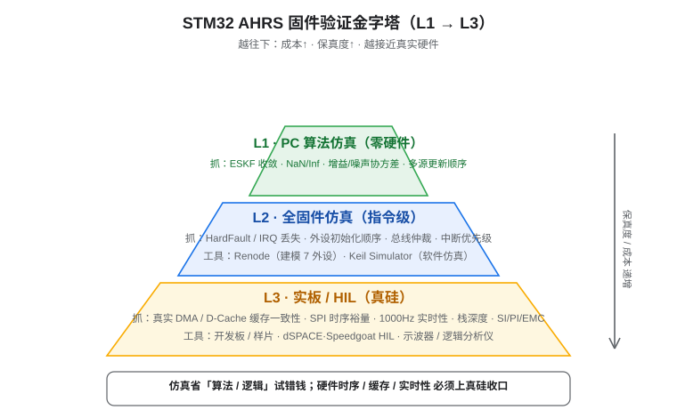
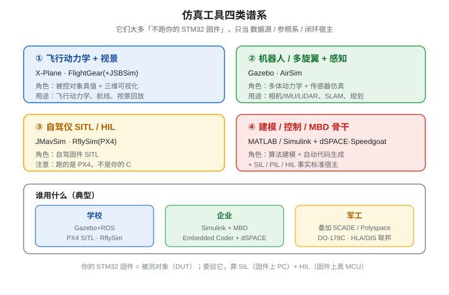
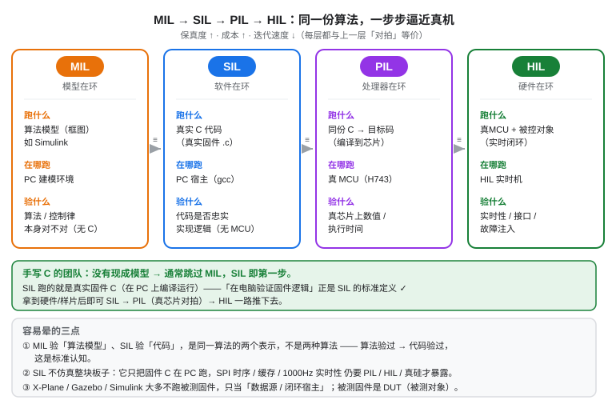

# 验证策略总览（MIL/SIL/PIL/HIL 与仿真工具谱系）

> 一句话：**仿真工具大多不跑你的固件，它们只当「数据源 / 参照系 / 闭环宿主」。**
> 要验你自己的固件，靠的是 SIL（固件上 PC）+ HIL（固件上真 MCU）。

## 1. 三层验证金字塔



| 层 | 名称 | 成本 | 抓得到的错误 | 工具 |
|---|---|---|---|---|
| **L1** | PC 算法仿真（零硬件） | 几乎为零 | 算法收敛、NaN/Inf、增益与噪声协方差、多源更新顺序、通信协议正确性 | gcc 把真实 C 编到 PC（例：某 STM32H7 航姿板项目已落地，见 [SIL 实战](SIL_PC实战.md)） |
| **L2** | 全固件仿真（指令级） | 中（要建模外设） | HardFault / IRQ 丢失、外设初始化顺序、总线仲裁、中断优先级 | Renode（建模多个外设）· ⚠️ Keil 内置 Simulator 对部分 MCU（如 STM32H7）不可用（见 [踩坑实录](仿真踩坑实录_KeilSimulator对H7不可用.md)） |
| **L3** | 实板 / HIL（真硅） | 高（要硬件） | 真实 DMA / D-Cache 缓存一致性、SPI 时序裕量、实时性、栈深度、SI/PI/EMC | 开发板/样片 · dSPACE·Speedgoat HIL · 示波器/逻辑分析仪 |

**关键判断**：仿真省「算法 / 逻辑」试错钱；硬件时序 / 缓存 / 实时性 必须上真硅收口。

!!! tip "以某 STM32H7 航姿板项目为例"
    硬件设计完成、样片尚未回板时，**L1（PC 算法仿真/SIL）仍是成本最低、最先见效的一步**——零硬件就把「驱动解析 → 融合算法 → 通信协议」整条逻辑闭环验掉；拿到样片后即可 SIL → PIL（真芯片对拍）→ HIL 一路推下去。

## 2. MIL / SIL / PIL / HIL 一把尺

- **MIL（Model-In-the-Loop，模型在环）**：算法以「模型」形式跑（如 Simulink 框图），作为 golden reference。
- **SIL（Software-In-the-Loop，软件在环）**：**把真实 C 代码**（如手写固件 `.c`）编到 PC/主机上跑，验证代码与模型/预期一致。
- **PIL（Processor-In-the-Loop，处理器在环）**：把代码编译到**目标 MCU** 上跑，但由 PC 提供激励、回收结果，验证「同一份代码在真芯片上的数值/执行时间」。
- **HIL（Hardware-In-the-Loop，硬件在环）**：代码跑在真 MCU + 真实/模拟被控对象（dSPACE/Speedgoat 等实时机）构成闭环，验实时性、接口、故障注入。

> 顺序大致是 MIL → SIL → PIL → HIL，保真度与成本同步上升。

## 3. 仿真工具四类谱系



1. **飞行动力学 + 视景**：X-Plane、FlightGear（+JSBSim）。给你「被控对象真值」和三维可视化，适合飞行动力学、航线、视景回放。
2. **机器人 / 多旋翼 + 感知**：Gazebo、AirSim。多体动力学 + 传感器（相机/IMU/LiDAR）仿真，适合 SLAM、规划、感知算法。
3. **自驾仪 SITL/HIL**：JMavSim、RflySim（PX4）。能跑自驾固件 SITL，但跑的是 **PX4**，不是你的固件 C。
4. **建模 / 控制 / MBD 骨干**：MATLAB/Simulink + dSPACE/Speedgoat。算法建模 + 自动代码生成，并且是 SIL/PIL/HIL 的事实标准宿主。

!!! note "它们跟你的固件啥关系"
    上述工具**都不是为了跑你的固件**而存在的。你的固件是「被测对象（DUT）」；这些工具最多当**数据源**（给真值姿态/轨迹）、**参照系**（和 PX4 比行为）或**闭环宿主**（在 Simulink/Gazebo 里把你的固件当控制器接进去）。

**谁用什么（典型）**：

- **学校**：Gazebo + ROS、PX4 SITL、RflySim——开源、教学、论文友好。
- **企业**：Simulink + MBD + Embedded Coder + dSPACE——产品级、可自动生成产品代码、有支持。
- **军工**：在上面叠加 SCADE / Polyspace、DO-178C、HLA/DIS 联邦——形式化/高可靠/联合仿真。

## 4. MATLAB / Simulink 到底怎么用？C 代码要不要进仿真？

这是最容易卡住的一步，单独讲清楚。

### 4.1 Simulink 不会「直接运行」你的 .c

Simulink 不是个能「双击打开固件.elf 就跑」的模拟器。它和你的手写 C 之间有**两条路**：

!!! tip "路线 A — MBD 正路（企业最常用）"
    1. 把 ESKF / 控制算法用 Simulink **模块重新建模**（相当于把 C 翻译成框图）。
    2. 用 **Embedded Coder** 自动生成 C 代码。
    3. 用 **SIL** 比对「模型」与「生成的代码」是否 bit-exact；再用 **PIL/HIL**（dSPACE/Speedgoat）跑真实目标。
    
    优点：自动代码生成、自带覆盖率/执行时间 profiling、自动回归、可视化强。
    代价：要把算法「翻译」成模型（工作量大），生成代码风格与你手写不同，且通常要求你**接受生成代码作为产品代码**。

!!! tip "路线 B — 保留手写 C"
    用 **Legacy Code Tool / C Caller / S-Function** 把现有固件 C（如 ESKF 算法文件）封装成 Simulink 模块，再跑 SIL/PIL。
    
    优点：复用已验证的真实 C，不必重写算法。
    代价：封装层要写；而且 SIL 比对的「模型参考」仍是你手写的另一份，参考意义会变小——除非你用 Simulink 模型当 golden reference。

### 4.2 gcc-SIL 是 Simulink SIL 的「免费轻量平替」

| 维度 | Simulink SIL | gcc-SIL（固件 C 直接 gcc 编到 PC） |
|---|---|---|
| 跑的是不是真实 C | 是（生成或封装） | **是（手写原样，零修改）** |
| 新工具/学习成本 | 高（Simulink + 工具箱） | 几乎为零（就一个 gcc） |
| 可视化 / plotting | 强（Scope / 数据洞察） | 自己写（打印+断言） |
| 覆盖率 / 执行时间 | 自带 | 需自己接（gcov / 计时桩） |
| 自动回归 | 强 | 手动（harness 可重复跑） |

**结论**：如果目的是「先把真实固件逻辑跑通、确认可行性、减小实物试错」，gcc-SIL 当下足够，且零新工具。Simulink 的价值在**更进一步**时显现（见下）。

### 4.3 什么时候才值得上 Simulink

- 想做**控制律 MBD + 自动代码生成**（产品级；军工/汽车 DO-178C / ISO 26262 要求）。
- 想接 **Gazebo / 真实动力学** 做闭环 HIL——Simulink 是事实标准的「控制器宿主」。
- 想要**自动回归 + 覆盖率 + 执行时间分析**，而不想自己搭测试台。

### 4.4 仿真「得到什么样的结果才算好」

- **SIL 层（算法/逻辑）**：
  - 姿态误差 RMS 小于阈值（如几度以内，取决于运动激励）；
  - **零 NaN / Inf**；
  - 协议帧（如 AA55）**CRC 100% 通过**；
  - （Simulink 还能给）代码覆盖率、最差执行时间 ≤ 预算。
- **HIL 层（实时/接口）**：
  - 闭环跟踪误差在容限内；
  - 实时性达标（如 1000 Hz 不掉帧）、抖动可控；
  - 故障注入（断传感器、错误 CRC）下行为符合预期。

> 以某 STM32H7 航姿板项目为例，其 gcc-SIL 已拿到 SIL 层全部「好结果」：8 路 init 全过、4000 步 0 NaN/Inf、姿态精确跟踪合成真值、3680 帧 AA55 CRC 全对。详见 [SIL 实战](SIL_PC实战.md)。

## 5. 常见误解辨析：MIL 验算法、SIL 验代码，矛盾吗？



初学者最容易混淆的一点是：既然 MIL 是「验证算法模型」、SIL 是「在 PC 上验证固件逻辑」，那两者是不是在验不同的东西、甚至相互矛盾？

**答案：不矛盾，而且「SIL 是在电脑上验证编译好的固件能否正常实现逻辑」这一理解本身就是 SIL 的标准定义。** MIL 与 SIL 验的是同一份算法的两种表示——模型与代码，是对拍关系，而非两套算法。下面把三个最容易卡住的点讲清楚。

### 5.1 三个关键澄清

1. **MIL 验「算法模型」、SIL 验「代码」—— 是同一算法的两个表示，不是两种算法。**
   - **MIL**：算法以「模型」形式存在（如 Simulink 框图），验的是「这个算法 / 控制律本身对不对」。此时还没有 C 代码（或 C 是从模型自动生成的）。
   - **SIL**：**把真实 C 代码编到 PC 上跑**，验的是「这份代码有没有忠实实现算法逻辑」。
   - 正确的顺序是「算法验过 → 代码跟它对拍」：MIL 充当 golden reference，SIL 用相同的测试用例与之比对一致性。

2. **「SIL 是在电脑上验证编译好的固件能否正常实现逻辑」—— 这就是 SIL 的标准定义。**
   - 它跑的就是真实的固件 `.c`（即把固件 C 直接在 PC 上零修改编译运行），只是**运行环境是 PC 宿主、不是 MCU**。它**不仿真整块板子**，也不验 SPI 时序 / 缓存 / 实时性。
   - 常见误区是以为 SIL 必须配合被控对象模型、或必须跑在嵌入式环境里。其实 SIL 的核心是「把代码挪到 PC 上、和模型比一致性」，与是否带被控对象无关。

3. **手写 C 的团队通常没有 MIL 这一环，这不是「跳过」，而是起点不同。**
   - MIL 存在的前提是「有一份模型当参照物」。若直接手写 C，C 本身就是第一份 artifact，于是 **SIL 即这类团队的第一步**，谈不上「跳过」——只是没有现成模型可跟它对拍而已（等价性靠手写保证，或后续用 Simulink 建模补一份参照）。

### 5.2 等价链（每步跟上一层对拍）

```
MIL(模型) ≡ SIL(同算法, C 代码) ≡ PIL(同代码, 真芯片) ≡ HIL(真芯片 + 被控对象)
```

保真度、成本、迭代耗时都沿箭头递增。越往下越像真机，也越慢越贵。这也解释了为什么「先跑固件（SIL）再深入其他仿真」是性价比最高的路线：先把便宜的、能抓逻辑错误的环节做掉，再往上堆硬件。

### 5.3 各阶段「在哪跑 / 跑什么 / 验什么」一览

| 阶段 | 跑什么 | 在哪跑 | 验什么 | 典型落地（示例） |
|---|---|---|---|---|
| **MIL** | 算法模型（框图） | PC 建模环境 | 算法 / 控制律本身 | 可选（先建模才做） |
| **SIL** | 真实 C 代码（手写 `.c`） | PC 宿主（gcc） | 代码忠实实现逻辑 | ✅ 常见（PC 编译运行固件 C） |
| **PIL** | 同份 C → 目标码 | 真 MCU（如 H743） | 真芯片数值 / 执行时间 | 待硬件（Renode 可顶指令级） |
| **HIL** | 真 MCU + 被控对象 | HIL 实时机 | 实时性 / 接口 / 故障注入 | 规划中 |

> **一句话收尾**：MIL/SIL/PIL/HIL 不是「四种不同仿真」，而是「同一份算法，从模型到真机、保真度逐级爬升」的四个检查点。对手写 C 的团队，SIL 既是该阶梯的第二步、也是其第一步——它已经把最该先抓的逻辑闭环抓完了。

---

## 参考文献

本文关于 MIL/SIL/PIL/HIL 的概念辨析，参考了以下公开资料（V 模型验证流程、各阶段目标与工具链）：

| 来源 | 标题/说明 | 关键信息 |
|------|-----------|----------|
| [汽车测试网](https://www.auto-testing.net/news/show-125912.html) | 【一文讲解】新能源汽车测试中的 MiL、SiL、PiL、HiL、道路测试 | 新能源汽车控制器遵循 **V 模型**验证流程；逐节拆解 MIL/SIL/PIL/HIL/道路测试的核心目标、实施方法、工具链（MATLAB/Simulink、Keil MDK、IAR、ControlDesk 等）与相互关系 |
| [知乎专栏](https://zhuanlan.zhihu.com/p/615794501) | MIL、SIL、PIL、HIL 是个啥，你搞懂了吗？ | 基于 MBD 的软件开发视角，厘清四者的定义、闭环示意与适用场景（HIL 在 MBD 与非 MBD 下都可能需要） |
| [MathWorks MATLAB Central](https://ww2.mathworks.cn/matlabcentral/answers/440277-what-are-mil-sil-pil-and-hil-and-how-do-they-integrate-with-the-model-based-design-approach) | What are MIL, SIL, PIL, and HIL and how do they integrate with the Model-Based Design approach | MathWorks 官方解答，从 Model-Based Design 工作流角度说明四者与 MBD 的集成关系（Simulink 中 MIL→SIL→PIL→HIL 的位置与衔接） |
| [博客园](https://www.cnblogs.com/zhjblogs/p/13773571.html) | MiL → SiL → PiL → HiL 是什么？ | 详述四者定义、常见误区（是否需闭环 / 被控对象模型 / 定点浮点）及 HIL 三层级（ECU / EPP / System 级） |
