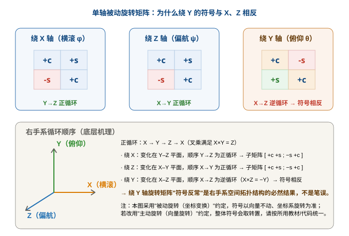

# 坐标变换与旋转矩阵（推导入门）

> 一句话：姿态的本质是一个 3×3 旋转矩阵。本篇从"坐标系怎么转"的第一性原理出发，把**单个轴的旋转矩阵**、**旧系→新系的"搬家"含义**、**三个角怎么合成**、以及**主动/被动旋转的区别**一次讲清楚。

!!! note "来源与可靠性说明"
    本篇素材整理自一次与 AI（DeepSeek）的问答对话（`坐标变换和选转矩阵.md`），并由我独立做了数值交叉核对：单轴被动旋转矩阵、合成矩阵 $C_n^b=R_xR_yR_z$、转置互逆 $C_b^n=(C_n^b)^T$、以及"反着转倒着乘"公式 $C_b^n=R_z(-\psi)R_y(-\theta)R_x(-\phi)$ 均用 Python 数值验证完全一致。
    ⚠️ **关键提醒**：被动旋转 / 主动旋转的符号约定在不同教材、不同代码里**不统一**。本篇全程采用"被动旋转（向量不动、坐标系旋转）"约定；落地到具体工程（如本项目 NED+body、PSINS）时，请以该工程的约定为准，不要直接照搬符号。

---

## 一、先把单个轴的旋转矩阵讲清楚

设 $c_\alpha=\cos\alpha,\ s_\alpha=\sin\alpha$。在**被动旋转**约定下，绕各轴的单轴矩阵为：

绕 X 轴（横滚 $\phi$）：

$$
R_x(\phi)=\begin{bmatrix}1&0&0\\0&c_\phi&s_\phi\\0&-s_\phi&c_\phi\end{bmatrix}
$$

绕 Y 轴（俯仰 $\theta$）：

$$
R_y(\theta)=\begin{bmatrix}c_\theta&0&-s_\theta\\0&1&0\\s_\theta&0&c_\theta\end{bmatrix}
$$

绕 Z 轴（偏航 $\psi$）：

$$
R_z(\psi)=\begin{bmatrix}c_\psi&s_\psi&0\\-s_\psi&c_\psi&0\\0&0&1\end{bmatrix}
$$

**这些矩阵是怎么来的？** 旋转只发生在"垂直于旋转轴的那个平面"里，该平面内 2×2 的投影子块就是 $\begin{bmatrix}c&s\\-s&c\end{bmatrix}$（被动形式；很多教材的主动形式是它的转置 $\begin{bmatrix}c&-s\\s&c\end{bmatrix}$）。X、Y、Z 轴的不同，只在于"旋转发生在哪两根轴之间"。

### 为什么绕 X、Z 的符号一致，绕 Y 的子块却像是被"转置"了？

这是本篇最该记住的一点。对比上面三个矩阵的 2×2 子块：

- 绕 **X**：变化在 **Y–Z** 平面，子块 $\begin{bmatrix}c&s\\-s&c\end{bmatrix}$
- 绕 **Z**：变化在 **X–Y** 平面，子块 $\begin{bmatrix}c&s\\-s&c\end{bmatrix}$
- 绕 **Y**：变化在 **X–Z** 平面，子块 $\begin{bmatrix}c&-s\\s&c\end{bmatrix}$ ← **中间那对符号反了**

**底层机理 = 右手系的循环顺序；而且三轴其实遵守同一条规则。** 正循环是 $X \rightarrow Y \rightarrow Z \rightarrow X$（叉乘满足 $X\times Y=Z,\ Y\times Z=X,\ Z\times X=Y$）。绕任意轴旋转时，垂直平面里的 2×2 子块，只要按"循环正方向（下一轴 → 上一轴）"来排，都是同一个样子 $\begin{bmatrix}c&s\\-s&c\end{bmatrix}$（被动形式）：

- 绕 X：垂直平面 Y–Z，循环正方向 Y→Z → $\begin{bmatrix}c&s\\-s&c\end{bmatrix}$
- 绕 Z：垂直平面 X–Y，循环正方向 X→Y → $\begin{bmatrix}c&s\\-s&c\end{bmatrix}$
- 绕 Y：垂直平面 Z–X，循环正方向 Z→X → 按 (Z,X) 顺序写本来也是 $\begin{bmatrix}c&s\\-s&c\end{bmatrix}$

**那为什么 Y 写出来像被转置了？** 因为矩阵按 [X,Y,Z] 的**列顺序**排，Y 是中间那根轴，它的垂直平面 (Z,X) 被拆到了矩阵的**两个对角 (1,3) 和 (3,1)**，而不是像 X、Z 那样落在一个连续的 2×2 块里。于是"下一轴→上一轴"的正向符号（+s）出现在左下角 (3,1)，视觉上就和 X、Z 的"右下角 (2,3)/(1,2) 是 +s"左右镜像了——**本质是同一条规则，只是被矩阵的列书写顺序"扭"了一下**。

> **结论**：绕 Y 的符号不是写错，也不是特例，更不是"X→Z 逆循环"。三根轴都遵守同一条右手系循环规则；Y 的子块之所以看着像转置，纯粹是因为 Y 是中间轴、它的 2×2 块被摊到了矩阵的两个对角。配图把三张子矩阵并排摆出来，一眼就能看出 Y 是"那个不同的"。

---

## 二、"旧系 → 新系"：这就是坐标变换（被动旋转的含义）

上面每个单轴矩阵，描述的其实是同一件事：**向量原地不动，坐标系转了一个角，然后读出这个向量在新坐标系下的坐标**。这就是"旧系 → 新系"的搬家公式。

记旧坐标系为 1、新坐标系为 2，被动旋转矩阵 $C_1^2$ 的含义就是：

$$
\mathbf{v}^{(2)} = C_1^2 \, \mathbf{v}^{(1)}
$$

即"把**旧系坐标** $\mathbf{v}^{(1)}$ 左乘 $C_1^2$，得到**新系坐标** $\mathbf{v}^{(2)}$"。

> 直觉例子：绕 Z 把坐标系逆时针转 $+\theta$。旧系里一个在 $\phi$ 方向的向量，在新系里"看起来"夹角变成了 $\phi-\theta$（因为坐标系自己转走了）。这正是上面 $R_z$ 矩阵在做的运算。

**所以第一章的三个单矩阵，本质就是"绕某轴转 θ 时，旧坐标→新坐标"的投影算子。** 被动旋转 = 坐标轴在动、世界没动；我们只是换了一副"眼镜"看同一个向量。

---

## 三、三个角合起来：乘法顺序与 $C_n^b$ 等式

单轴解决了，怎么把横滚、俯仰、偏航三个角合成一个完整的姿态矩阵？

惯导里最常见的约定是 **Z–Y–X 外禀（固定轴）顺序**：先偏航 $\psi$（绕 Z）、再俯仰 $\theta$（绕 Y）、最后横滚 $\phi$（绕 X）。写成矩阵**左乘**：

$$
C_n^b = R_x(\phi)\,R_y(\theta)\,R_z(\psi)
$$

> **记忆口诀**：矩阵**从右往左读**，对应旋转从先到后。最先发生的旋转（Z）放在最右边。

把三个单矩阵乘开（已数值验证）就是：

$$
C_n^b=
\begin{bmatrix}
c_\theta c_\psi & c_\theta s_\psi & -s_\theta \\
s_\phi s_\theta c_\psi - c_\phi s_\psi & s_\phi s_\theta s_\psi + c_\phi c_\psi & s_\phi c_\theta \\
c_\phi s_\theta c_\psi + s_\phi s_\psi & c_\phi s_\theta s_\psi - s_\phi c_\psi & c_\phi c_\theta
\end{bmatrix}
$$

$C_n^b$ 读作"导航系 n → 载体系 b"：把导航系下的向量，投影到载体系下。**这就是把第一章的"旧系→新系"逻辑，连做三次（旧 n 依次转成新 b）的结果。**

---

## 四、主动旋转 vs 被动旋转（正式对比 + 交互演示）

前面全程用"被动旋转"，但很多人符号搞混，根子就在**没分清主动和被动**。这里正式对比一下。

| | 主动旋转（alibi） | 被动旋转（alias / 坐标变换） |
|---|---|---|
| 谁在动 | **向量**转，坐标系不动 | **坐标系**转，向量不动 |
| 物理画面 | "把这根箭头转 30°" | "换个姿态的坐标系重新读同一个点" |
| 同一 θ 的矩阵 | $R(\theta)=\begin{bmatrix}c&-s\\s&c\end{bmatrix}$ | $C(\theta)=R(\theta)^T=\begin{bmatrix}c&s\\-s&c\end{bmatrix}$ |
| 惯导里 | 较少直接出现 | **坐标变换默认用这个** |

**关键关系：对同一旋转角 θ，主动矩阵与被动矩阵互为转置。** 这也回扣了第一章——你看到的"被动形式的子块"，正是主动形式的转置。

为了把这件事"看"明白，我做了一个可拖拽的交互演示（强烈建议打开玩两下）：

👉 [主动 vs 被动旋转 · 交互演示](../assets/active_vs_passive_rotation.html){:target="_blank"}

它用左右两图对比：左图**向量转**（主动），右图**坐标系转**（被动），并实时联动矩阵。**重点看矩阵第 1 列（绿框）**——它永远等于"旧 X 轴单位向量 $[1,0,0]^T$ 喂进矩阵的结果"：

- 主动时，旧 X 轴转到 $+\theta$ 处 → 第一列 $[\cos\theta,\ \sin\theta]^T$；
- 被动时，旧 X 轴相对新系落在 $-\theta$ 处 → 第一列 $[\cos\theta,\ -\sin\theta]^T$。

这正是"主动矩阵 = 被动矩阵转置"的几何来源，也是第一章里"绕 Y 子块像被转置"的同一套逻辑在 2D 上的体现。

---

## 五、反过来：从载体系到导航系 $C_b^n$

已知 $C_n^b$，要回到反向变换 $C_b^n$，有两种完全等价、结果一致的求法（已数值验证每个元素都相同）：

**方法一：转置（最省事）** —— 旋转矩阵是正交矩阵，逆等于转置：

$$
C_b^n = (C_n^b)^T
$$

**方法二："反着转、倒着乘"（最有物理美感，不用碰转置）** —— 既然 $C_n^b$ 是把 n 系按 Z→Y→X 顺序转过去，回到 n 系就是"**按完全相反的顺序、转相反的角度**"：

$$
C_b^n = R_z(-\psi)\,R_y(-\theta)\,R_x(-\phi)
$$

把单矩阵角度取反（$\sin(-\alpha)=-\sin\alpha,\ \cos(-\alpha)=\cos\alpha$）直接乘开，得到：

$$
C_b^n=
\begin{bmatrix}
c_\theta c_\psi & s_\phi s_\theta c_\psi - c_\phi s_\psi & c_\phi s_\theta c_\psi + s_\phi s_\psi \\
c_\theta s_\psi & s_\phi s_\theta s_\psi + c_\phi c_\psi & c_\phi s_\theta s_\psi - s_\phi c_\psi \\
-s_\theta & s_\phi c_\theta & c_\phi c_\theta
\end{bmatrix}
$$

> 工程上我们通常用 $C_b^n$（机体→导航）把机载加速度计、磁力计数据投影到水平系；它也常被称为"姿态矩阵 / 方向余弦矩阵（DCM）"。

---

## 六、延伸铺垫：矢量叉乘与反对称矩阵

（本节只点题；完整定义、性质、数字验证与惯导联系已单独成篇 → [矢量叉乘与反对称矩阵](矢量叉乘与反对称矩阵.md)）

**矢量叉乘** $\mathbf{a}\times\mathbf{b}$ 给出一个**同时垂直于 a、b** 的新向量，方向由右手定则决定；惯导里科氏项、姿态运动学里的 $\boldsymbol\omega\times$ 项都源于它。为把叉乘写进矩阵运算，引入**反对称矩阵** $[\mathbf{a}]_\times$，其核心性质是：

$$
\mathbf{a}\times\mathbf{b} = [\mathbf{a}]_\times\,\mathbf{b}
$$

> 后面你会在 ESKF 的雅可比、姿态误差方程里反复见到 $[\boldsymbol\omega]_\times$——它就是"叉乘的矩阵写法"。双重反对称恒等式与各性质的数值验证，请移步上方链接的专篇。

---

## 七、常见坑（提前标出来）

!!! danger "坐标变换相关的经典翻车"
    - **被动 / 主动没分清**：本篇用被动。若参考的书是主动约定，单矩阵整体是本文的**转置**，合成符号也会跟着反。先看清楚对方约定（见第四节交互演示）。
    - **乘法顺序搞反**：多轴合成时矩阵**从右往左读**（先做的在右）。Z–Y–X 要写成 $R_zR_yR_x$ 的连乘顺序，不是把 $R_xR_yR_z$ 的顺序读反。
    - **取反角度时只反了 sin 没反 cos**：$\cos(-\alpha)=\cos\alpha$（不变），只有 $\sin$ 变号。
    - **以为绕 Y 的符号是写错了**：不是。那是右手系循环顺序决定的，见第一节。

---

## 八、自测题（合上能答才算懂）

1. 单轴被动旋转矩阵里，绕 X、Z 的子块是 $\begin{bmatrix}c&s\\-s&c\end{bmatrix}$，绕 Y 是 $\begin{bmatrix}c&-s\\s&c\end{bmatrix}$。为什么会这样？一句话说清"绕 Y 子块像被转置"的几何根源。
2. 被动旋转说的是"旧系→新系"的什么操作？写出 $C_1^2$ 把旧坐标变新坐标的公式。
3. $C_n^b=R_xR_yR_z$ 中，矩阵乘法为什么要"从右往左读"？最先发生的旋转（Z）放在哪边？
4. 主动矩阵和被动矩阵有什么关系？为什么？
5. 已知 $C_n^b$，求反向 $C_b^n$ 的两种方法各是什么？
6. 反对称矩阵 $[\mathbf{a}]_\times$ 有什么用？（提示：叉乘的矩阵写法）

> 答案都在上面。第 1、4 题如果还模糊，建议打开[第四节的交互演示](../assets/active_vs_passive_rotation.html){:target="_blank"}，并回看 [01 坐标系与变换](../01_基础篇/01_坐标系与变换.md) 与 [数学地基：矩阵、概率与协方差](数学基础.md)。

---

## 关联与延伸

- 系列首页：[惯性导航与惯导解算 · 自学科普系列](../index.md)
- 上一篇基础：[01 坐标系与变换](../01_基础篇/01_坐标系与变换.md)（坐标系概念、变换职责分离、R 的正交性）
- 下一篇：[02 姿态的四种表示](../01_基础篇/02_姿态的四种表示.md)（欧拉角 / DCM / 四元数 / 旋转向量）
- 数学地基：[矩阵、概率与协方差](数学基础.md)（旋转矩阵、四元数、协方差 $P$）
- 同项目落地：[AHRS 板固件仿真与验证](../工作与项目/AHRS板固件仿真与验证/)

## 外链 Wiki

- [主动 vs 被动旋转 · 交互演示（本文配套）](../assets/active_vs_passive_rotation.html){:target="_blank"}
- [旋转矩阵 — 维基百科](https://zh.wikipedia.org/wiki/旋转矩阵)
- [相对转动（主动与被动变换） — 维基百科](https://zh.wikipedia.org/wiki/主动与被动变换)
- [叉积 — 维基百科](https://zh.wikipedia.org/wiki/叉积)
- [方向余弦矩阵 — 维基百科](https://zh.wikipedia.org/wiki/方向余弦矩阵)
