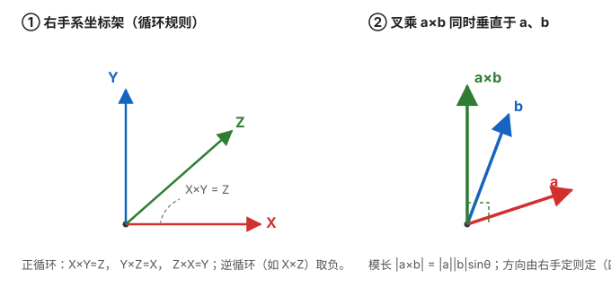

# 矢量叉乘与反对称矩阵

> **来源与可靠性说明**
> 本文是经典线性代数 / 刚体运动学内容，属教科书级标准结论（任意《线性代数》或《机器人学》《多体动力学》教材的"叉积与反对称矩阵"章节均可查到）。全文 ✅ 已用 Python 数值核对四个核心恒等式（见第四节），可作为后续惯性导航系列共用的数学地基，放心引用。

## 为什么惯导要关心叉乘

在惯性导航里，叉乘不是抽象运算，而是天天打交道的"零件"：

- **角速度积分**：姿态的微小增量来自 $\boldsymbol\omega\,\mathrm dt$，姿态更新（四元数 / 旋转向量）本质是把角速度"叉"进当前姿态；
- **科氏加速度**：旋转系里的附加加速度 $\mathbf a_c = 2\boldsymbol\omega\times\mathbf v$；
- **`insupdate` 的划桨 / 圆锥项、地球自转项**：都含 $\boldsymbol\omega$ 的叉乘；
- **反对称矩阵 $[\mathbf a]_\times$**：把"叉乘"变成"矩阵乘法"，让它能参与线性代数（合成、求导、进入卡尔曼滤波的状态矩阵）。

所以这篇文章先用最少的篇幅把叉乘和 $[\mathbf a]_\times$ 讲透，后面拆解 PSINS 时你看到 `cross` / `skew` / `[w]x` 就不会卡。

## 一、矢量叉乘的定义与几何意义

### 1.1 几何定义

$$
\mathbf a\times\mathbf b \;=\; |\mathbf a|\,|\mathbf b|\,\sin\theta \;\cdot\; \mathbf n
$$

- $|\mathbf a|,|\mathbf b|$ 是模长，$\theta$ 是两向量夹角（$0\le\theta\le\pi$）；
- $\mathbf n$ 是单位向量，**同时垂直于 $\mathbf a$ 和 $\mathbf b$**，方向由**右手定则**确定。

几何上：$\mathbf a\times\mathbf b$ 是一个**矢量**，其方向垂直于 $\mathbf a,\mathbf b$ 张成的平面，大小等于以 $\mathbf a,\mathbf b$ 为邻边的**平行四边形面积**。

### 1.2 代数定义（分量展开）

设 $\mathbf a=(a_1,a_2,a_3)^T,\ \mathbf b=(b_1,b_2,b_3)^T$，则

$$
\mathbf a\times\mathbf b
= \begin{pmatrix}
a_2 b_3 - a_3 b_2\\
a_3 b_1 - a_1 b_3\\
a_1 b_2 - a_2 b_1
\end{pmatrix}
$$

记忆法——写成行列式（按第一行展开即得上式）：

$$
\mathbf a\times\mathbf b
= \begin{vmatrix}
\mathbf i & \mathbf j & \mathbf k\\
a_1 & a_2 & a_3\\
b_1 & b_2 & b_3
\end{vmatrix}
$$

### 1.3 右手定则

握拳：四指从 $\mathbf a$ 弯向 $\mathbf b$（沿较小夹角），大拇指指向就是 $\mathbf a\times\mathbf b$。对标准右手系有循环规则：

$$
\mathbf X\times\mathbf Y=\mathbf Z,\quad
\mathbf Y\times\mathbf Z=\mathbf X,\quad
\mathbf Z\times\mathbf X=\mathbf Y
$$

**逆循环取负**，例如 $\mathbf X\times\mathbf Z = -\mathbf Y$。这正是上一篇《坐标变换与旋转矩阵》里"绕 Y 轴符号看起来被转置"的同一套空间拓扑根源——叉乘的循环方向决定了符号。

### 1.4 基本性质

- **反交换**：$\mathbf a\times\mathbf b = -(\mathbf b\times\mathbf a)$
- **分配律**：$\mathbf a\times(\mathbf b+\mathbf c)=\mathbf a\times\mathbf b+\mathbf a\times\mathbf c$
- **与自身叉乘为零**：$\mathbf a\times\mathbf a=\mathbf 0$
- **正交性**：$(\mathbf a\times\mathbf b)\cdot\mathbf a = (\mathbf a\times\mathbf b)\cdot\mathbf b = 0$
- **不满足结合律**：$(\mathbf a\times\mathbf b)\times\mathbf c \neq \mathbf a\times(\mathbf b\times\mathbf c)$
- 拉格朗日恒等式：$|\mathbf a\times\mathbf b|^2 = |\mathbf a|^2|\mathbf b|^2 - (\mathbf a\cdot\mathbf b)^2$

## 二、反对称矩阵 $[\mathbf a]_\times$

### 2.1 定义：把叉乘"矩阵化"

任何三维叉乘都可以写成"**左乘一个反对称矩阵**"：

$$
\mathbf a\times\mathbf b = [\mathbf a]_\times\,\mathbf b
$$

其中

$$
[\mathbf a]_\times =
\begin{bmatrix}
0    & -a_3 &  a_2\\
a_3 &  0   & -a_1\\
-a_2 &  a_1 &  0
\end{bmatrix}
$$

记忆法：把 $\mathbf a=(a_1,a_2,a_3)$ 的"对面"填进去——主对角恒为 0，第 $(i,j)$ 元等于 $-e_{ijk}a_k$（Levi-Civita 符号）。例如第 $(1,2)$ 元 $= -a_3$，第 $(2,1)$ 元 $= +a_3$，两者互为相反数，这就是"反对称"的来由。

### 2.2 为什么重要

- 把**叉乘**变成**矩阵-向量乘法**，计算机只需做矩阵乘，不用特判分量；
- 能无缝参与线性代数：求逆、合成、对时间求导、塞进状态方程 $\dot{\mathbf x}=\mathbf F\mathbf x$；
- 姿态、角速度、误差全都用 $[\boldsymbol\omega]_\times$ 串起来（见第三节）。

### 2.3 关键性质（已数值验证）

- **反对称**：$[\mathbf a]_\times^T = -[\mathbf a]_\times$（主对角全 0，反对角互为相反数）；
- **自叉为零**：$[\mathbf a]_\times\,\mathbf a = \mathbf 0$；
- **双重反对称恒等式**（推导姿态误差、ESKF 误差状态时反复出现）：

$$
[\mathbf a]_\times[\mathbf b]_\times
= \mathbf b\,\mathbf a^T - (\mathbf a\cdot\mathbf b)\,\mathbf I
$$

> 举例：$\mathbf a=(1,2,3)^T,\ \mathbf b=(4,5,6)^T$ 时，
> $[\mathbf a]_\times=[[0,-3,2],[3,0,-1],[-2,1,0]]$，而 $[\mathbf a]_\times\mathbf b = [-3,6,-3]^T = \mathbf a\times\mathbf b$，与代数定义完全一致；双重反对称恒等式在随机 200 组向量上数值误差均 $<10^{-9}$。

## 三、在惯导 / PSINS 里哪里用（关键联系）

- **角速度积分**：姿态增量 $\delta\boldsymbol\theta \approx \boldsymbol\omega\,\mathrm dt$；四元数增量更新 $\delta\mathbf q$ 里就是拿 $[\boldsymbol\omega]_\times$ 去"叉"当前姿态。
- **旋转的指数映射 / 罗德里格斯公式**：旋转矩阵 $\mathbf R = \exp([\boldsymbol\omega]_\times)$（指到后期卡尔曼 / ESKF，本文先铺垫符号）。
- **科氏加速度**：$\mathbf a_c = 2\boldsymbol\omega\times\mathbf v$。
- **`insupdate` 的划桨 / 圆锥项、地球自转项**：都含 $[\boldsymbol\omega]_\times$。
- **姿态误差的线性化**：ESKF 把误差姿态写成小旋转向量 $\delta\boldsymbol\phi$，其扰动传播里大量出现 $[\mathbf v]_\times$。

## 四、两个最容易踩的坑

1. **两层中括号不能想当然合并**。$[\mathbf a]_\times\mathbf b = \mathbf a\times\mathbf b$，但 $[\mathbf a]_\times[\mathbf b]_\times$ 是"两个反对称矩阵相乘"，结果是 $\mathbf b\mathbf a^T-(\mathbf a\cdot\mathbf b)\mathbf I$（第二节 2.3），**不是** $\mathbf a\times\mathbf b$ 的叉乘。新手写姿态误差推导时最容易在这里漏掉 $\mathbf b\mathbf a^T$ 项。
2. **反对称 ≠ 正交**（skew-symmetric ≠ orthogonal）。$[\mathbf a]_\times$ 是"反对称"（转置变负），一般**不是**正交矩阵——除非 $\mathbf a=\mathbf 0$，否则 $[\mathbf a]_\times[\mathbf a]_\times^T \neq \mathbf I$。这俩词中文都带"对称"，意思却完全不同，别混。

## 五、与下一篇衔接

- 本文是《坐标变换与旋转矩阵（推导入门）》的数学工具：旋转矩阵的每一列，本质是把某个基向量"叉乘 / 旋转"后的去向；上一篇讲的符号机理，在这里的右手循环规则里能找到根。
- 四元数、旋转向量、ESKF 都会反复用到 $[\cdot]_\times$，建议先在这里把 $[\mathbf a]_\times$ 和双重反对称恒等式记熟。

## 自测题

1. 计算 $[1,0,0]^T\times[0,1,0]^T$，并验证它等于 $[\mathbf e_1]_\times\mathbf e_2$。
2. 写出 $\boldsymbol\omega=(0,0,\Omega)^T$（绕 Z 轴自转）时的 $[\boldsymbol\omega]_\times$，并说明它对应"绕 Z 旋转"的无穷小生成元。
3. 用双重反对称恒等式验证 $[\mathbf a]_\times[\mathbf a]_\times = \mathbf a\mathbf a^T - |\mathbf a|^2\mathbf I$。
4. 判断并解释：$\mathbf a\times\mathbf b$ 一定同时垂直于 $\mathbf a$ 和 $\mathbf b$ 吗？$\mathbf a\cdot(\mathbf a\times\mathbf b)$ 等于什么？

## 关联

- [坐标变换与旋转矩阵（推导入门）](坐标变换与旋转矩阵.md)
- [数学地基（矩阵·概率·协方差）](数学基础.md)
- [姿态的四种表示](../01_基础篇/02_姿态的四种表示.md)
- [协方差交互实验](协方差交互实验.md)
