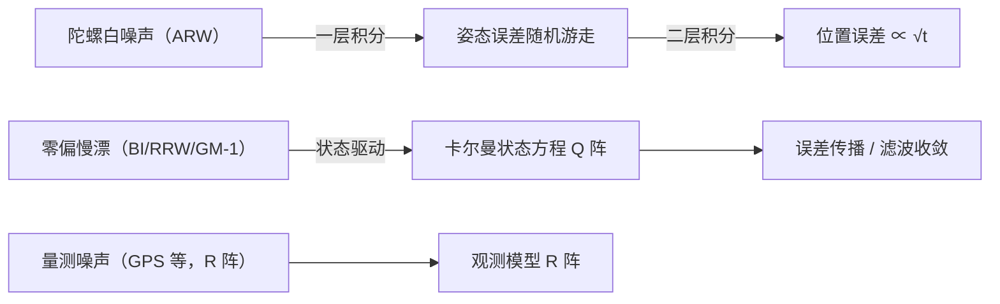

# 随机过程与噪声建模：白噪声、随机游走与 Q 阵

> 一篇**会成长的笔记**。IMU 输出不是"真值 + 一个小随机数"这么简单：误差自己也是**随时间变化的过程**——有的越积越大（随机游走），有的有"记忆"（高斯-马尔可夫）。卡尔曼里喂给系统的噪声（$Q$ 阵）、Allan 方差读出的五指纹（ARW/BI/RRW…），都是随机过程这门语言的词汇。每一节末尾附外链 Wiki。

## 核心要点

- **随机过程** = 一族随时间变化的随机变量 $X(t)$；刻画它的不是"一个数"，而是**均值函数 + 自相关函数**。
- **白噪声**：每个时刻独立同分布、无记忆、功率谱平坦 → 卡尔曼里 $Q,R$ 最常用的默认噪声。
- **白噪声积分 = 随机游走（维纳过程）**：方差随 $\sqrt{t}$ 增长——这是陀螺 ARW、位置误差发散的根源。
- **一阶高斯-马尔可夫（GM-1）过程**：有相关时间 $\tau$、有界方差 → 零偏（bias）建模的标配。
- 噪声的频域画像（功率谱密度 / Allan 方差）→ 从实测数据读出 $Q$ 阵：**连续噪声密度 $q$ × 采样间隔 $t_s$ = 离散 $Q$**。

---

## 一、随机过程是什么

**一句话**：普通随机变量是"扔一次骰子得到一个数"；随机过程是"每个时刻都扔一次骰子，得到一条随时间变化的随机曲线"。

记 $X(t)$（连续时间）或 $X_k$（离散时间，$k$ 为时刻索引）。一次"掷骰子"得到的整条曲线叫**样本函数 / 实现**，全体实现构成随机过程。

**两个核心统计量**（替代普通随机变量的期望/方差）：

- **均值函数**：$m(t)=E[X(t)]$——时刻 $t$ 所有实现的平均。
- **自相关函数**：$R(t_1,t_2)=E[X(t_1)X(t_2)]$——"$t_1$ 和 $t_2$ 两个时刻有没有关联、关联多强"。

**平稳性（宽平稳）**：均值不随时间变 $m(t)\equiv m$，且自相关只取决于时差 $R(t_1,t_2)=R(\tau)$，$\tau=|t_1-t_2|$。多数 IMU 误差模型假设"统计特性不随开机时间变化"，即平稳——Allan 方差正是在这个假设下做的。

!!! note "为什么关注自相关而不是方差"
    方差 $R(0)$ 只回答"单时刻抖多凶"；**自相关函数回答"抖得有没有'记忆'"**——误差是白噪声（无记忆）还是慢漂（有记忆，相关时间长），直接决定它会不会被积分放大、能不能被滤波器建模，这是噪声建模的全部意义。

---

## 二、白噪声：最基础的一块砖

**一句话**：白噪声 = "每时每刻独立、且统计特性不变的噪声"，像白得均匀的光——所有频率都有分量。

- **时域**：任意不同时刻 $X(t_1)$ 与 $X(t_2)$ 不相关，$R(\tau)=q\,\delta(\tau)$（$\delta$ 为狄拉克函数）。
- **频域**：功率谱密度 $S(f)\equiv q$ 常数（白 = 各频率均匀）。
- 加上高斯性（$N(0,\sigma^2)$）就是**高斯白噪声**——卡尔曼的默认假设（叠加定理保证大量独立小扰动之和近似高斯：中心极限定理）。

离散化后：$w_k\sim\mathcal N(0,\sigma_w^2)$，且 $E[w_k w_j]=0\ (k\ne j)$，即 i.i.d. 序列。

> 工程直觉：白噪声覆盖不了"IMU 零偏慢慢漂"这类**有记忆**的误差——那需要随机游走或 GM-1（见 §三、§四）。

---

## 三、随机游走：白噪声的"积分效应"（ARW 的根源）

**一句话**：白噪声每步随机加减 → 累积值 $\sqrt{\text{时间}}$ 倍地飘走，这就是随机游走（又名维纳过程 / 布朗运动）。

离散形式：

$$x_{k+1}=x_k+w_k,\qquad w_k\sim\mathcal N(0,\sigma_w^2)$$

叠加得 $x_N=\sum_{k=1}^N w_k$，于是

$$\mathrm{Var}[x_N]=N\sigma_w^2=\underbrace{(\sigma_w\sqrt{t_s})^2}_{q}\cdot t,\qquad \sigma_{x}\propto \sqrt{t}$$

**方差随时间线性增长、标准差随 $\sqrt{t}$ 增长**——这是随机游走最醒目的指纹。

!!! note "IMU 里的随机游走（为什么惯导会飘）"
    陀螺角速率中的白噪声被积分一次就变成**角度随机游走 ARW**（°/\sqrt h）；再积一次得**偏航误差随机游走**、三次积分进位置误差。这正是惯导"纯惯导必发散"的数学根源（[09 纯惯导误差传播](../02_解算篇/09_纯惯导误差传播.md)讲的舒勒振荡与漂移，噪声项就是从这里喂进去的）。陀螺零偏自己的慢漂则叫**速率随机游走 RRW**——"零偏在做随机游走"。

**与白噪声的区别，一张表：**

| | 白噪声 | 随机游走 |
|---|---|---|
| 记忆 | 无（瞬时独立） | 有（每步是上一步 + 新噪声） |
| 自相关 $R(\tau)$ | $\propto\delta(\tau)$ | 不衰减、长程相关 |
| 方差 | 常数 | $\propto t$ 线性增长 |
| 谱线 | 平坦（$S\propto1$） | $S\propto f^{-2}$ |
| 积分关系 | —— | 白噪声积分 = 随机游走 |

---

## 四、一阶高斯-马尔可夫过程（GM-1）：零偏建模的标配

**一句话**：加一个"每步把上一时刻的误差衰减一点"的系数，就得到**有界方差、有相关时间**的噪声——拿来建 bias 再合适不过。

离散形式：

$$x_{k+1}=\phi\,x_k+w_k,\qquad \phi=e^{-t_s/\tau}\in(0,1)$$

- $\tau$：**相关时间**——误差"记住自己"多久；
- 稳态方差：$\sigma_x^2=\dfrac{\sigma_w^2}{1-\phi^2}$（**有界**，不像随机游走那样无限涨）；
- 自相关：$R(\tau)=E[x^2]\,e^{-|\tau|/\tau_0}$——相隔越远越不相关。

**为什么 bias 用 GM-1：**

| 需求 | GM-1 能否满足 |
|---|---|
| bias 慢变、受温度/老化影响 | ✅ 相关时间 $\tau$ 可设几十分钟~几小时 |
| bias 漂移有上界（不会无限涨） | ✅ 稳态方差有界 |
| 卡尔曼要能建模 | ✅ 就是状态方程里给 $b$ 配的转移系数 $\phi$ |

!!! note "零偏建模三兄弟（在卡尔曼里常见）"
    - **随机常数** $\dot b=0$：bias 固定不变（最简单，P 收敛到某个值）；
    - **随机游走** $\dot b=w$：bias 无限漂（对应 RRW/Allan 的 $K$ 值）；
    - **一阶 GM-1** $\dot b=-\frac{1}{\tau}b+w$：折中，有界又有记忆——ESKF 里 $b_g/b_a$ 常用它（[04 IMU 误差模型](../01_基础篇/04_IMU误差模型.md)）。

---

## 五、Allan 方差：从实测读出五种噪声指纹

**一句话**：时域方差分不清"白噪声、随机游走、bias 平台"谁是谁；把噪声按不同积分时长重新切分画成 log-log 曲线，每种噪声各占一段斜率——这就是 Allan 方差。

| 噪声 | 斜率 | 单位 | 物理来源 |
|---|---|---|---|
| 量化噪声 QN | $-1$ | arcsec | A/D 量化 / 数据截断 |
| 角度随机游走 ARW | $-1/2$ | °/√h | 白噪声积分（最快一项） |
| 零偏不稳定性 BI | $0$（平台） | °/h | 1/f 噪声的平台值 |
| 速率随机游走 RRW | $+1/2$ | °/h^{1.5} | 零偏的随机游走（bias 慢漂） |
| 速率斜坡 RR | $+1$ | °/h² | 温度/老化等确定性趋势 |

如何从曲线提取 $N$、$B$、$K$ 及用它定 ESKF 的 $Q$ 阵，完整流程见 [05 Allan 方差](../01_基础篇/05_Allan方差.md)（含 MATLAB + Python 双轨、静置实测算出 ICM-42688P 的 ARW/BI 实操）。这篇只负责"这些名词的随机过程出身"。

---

## 六、从噪声到 Q 阵：连续 → 离散，$q$ → $Q$

**一句话**：Allan 曲线给的是**连续时间噪声密度 $q$**（rad/s/√Hz），卡尔曼 $Q$ 阵要的是**一个采样间隔内的离散噪声协方差**——乘上 $t_s$ 即可（对白噪声驱动）。

**规则（白噪声驱动）**：连续白噪声方差密度 $q$（$S(f)=q$）在采样间隔 $t_s$ 下离散化为

$$Q_{\text{cont}\to\text{dis}} = q \cdot t_s$$

**IMU 两个标准换算**（单位 / 单位 / 根号时间 → rad/s/√Hz）：

- 陀螺 ARW $N$（°/√h）→ 连续角速率噪声密度 $\sigma_g=N\cdot\dfrac{\pi}{180\cdot60}$（rad/s/√Hz）；
- 加计 VRW $V$（m/s/√h）→ $\sigma_a=V\cdot\dfrac{1}{60\sqrt{3600}}$（m/s²/√Hz）；
- 零偏随机游走 $B$（°/h）→ bias 驱动密度 $\sigma_b=B\cdot\dfrac{\pi}{180\cdot3600}$（rad/s²/√Hz）。

!!! warning "Q 阵放哪、放多大，直接决定滤波器信不信模型"
    $Q$ 太大 → 滤波过动、跟着噪声跑（NEES 偏大）；$Q$ 太小 → 模型"过于自信"、量测被无视（NEES 偏小）。$Q/R$ 失配就是在 [14 一致性检验](../03_组合导航篇/14_一致性检验.md) 里被 NEES/NIS 抓出来的。常用做法：**先按 Allan 读数给初值，再用 NEES 诊断微调**。

**ESKF 里的位置**：$Q$ 是一个分块对角矩阵，陀螺/加计各放一块（$\sigma_g^2$、$\sigma_a^2$，来自 ARW/VRW），零偏各放一块（$\sigma_{b_g}^2$、$\sigma_{b_a}^2$，来自 BI/RRW）——见 [11 EKF 与 ESKF](../03_组合导航篇/11_EKF与ESKF.md)。

---

## 七、串回全系统：噪声怎么"走"进误差

一句话记忆：**白噪声进 ARW → 积分放大成随机游走；零偏进 Q 阵给模型不确定性；量测噪声进 R 阵给观测不确定性——三者都是"高斯 + 参数"，全是概率统计那一篇的语法。**

## 关联

- **系列内**：[惯性导航系列首页](../index.md)
- **姊妹篇**：[概率统计基础](概率统计基础.md)（高斯 / 协方差传播 / $Q,R$ 的统计出身）· [数学地基](数学基础.md)
- **应用篇**：[04 IMU 误差模型](../01_基础篇/04_IMU误差模型.md)（零偏/标度/随机游走建模）· [05 Allan 方差](../01_基础篇/05_Allan方差.md)（五指纹提取与 $Q$ 定标）· [09 纯惯导误差传播](../02_解算篇/09_纯惯导误差传播.md)（噪声积分放大）· [10 卡尔曼滤波基础](../03_组合导航篇/10_卡尔曼滤波基础.md) · [11 EKF 与 ESKF](../03_组合导航篇/11_EKF与ESKF.md) · [14 一致性检验](../03_组合导航篇/14_一致性检验.md)

## 外链 Wiki

- [随机过程 — 维基百科](https://zh.wikipedia.org/wiki/随机过程)
- [白噪声 — 维基百科](https://zh.wikipedia.org/wiki/白噪声)
- [布朗运动 — 维基百科](https://zh.wikipedia.org/wiki/布朗运动)
- [维纳过程 — 维基百科](https://zh.wikipedia.org/wiki/维纳过程)
- [马尔可夫过程 — 维基百科](https://zh.wikipedia.org/wiki/马尔可夫过程)
- [功率谱密度 — 维基百科](https://zh.wikipedia.org/wiki/功率谱密度)
- [艾伦方差 — 维基百科](https://zh.wikipedia.org/wiki/艾伦方差)