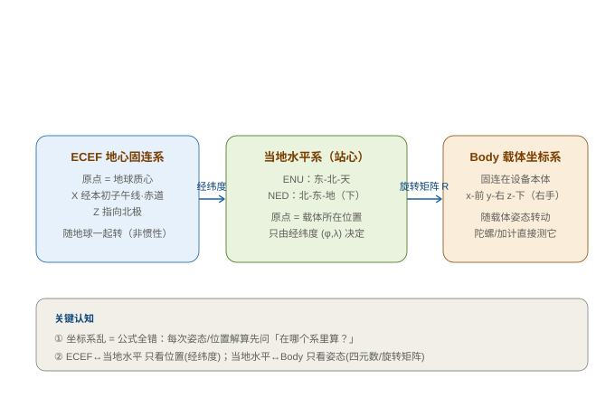

# 01 坐标系与变换

> **一句话定义**：坐标系是一套"原点 + 三根互相垂直的轴"的规则，用来无歧义地描述一个点的位置、方向和运动；**变换**则是同一物体在不同坐标系之间的"搬家公式"。惯导里 90% 的 bug，追到底都是坐标系没对齐。

---

## 一、为什么必须先讲坐标系（直觉类比）

想象你在群里发定位："我在你**东边 100 米、北边 50 米**"。这句话能成立，是因为你们默认了同一套参照：以"你"为原点、东为 x、北为 y、上为 z。

如果对方以为原点是**他自己家**、z 轴指向**地心**，那"东 100 北 50"就彻底错了——**数字没错，参照错了，结果全错**。

惯导干的事，本质就是不断"搬家"：

> 陀螺测的是**载体自己身体里**的角速度（body 系）→ 积分出姿态 → 转成**地面水平系**的姿态 → 加速度计测的是 body 系比力 → 转到水平系去掉重力 → 积分出速度 → 再积分出位置。

任何一步"转到哪个系"弄错，后面全毁。**所以坐标系是惯导的地基，地基歪了楼必倒。**

---

## 二、惯导里最常用的四类坐标系

### 1. ECEF（Earth-Centered Earth-Fixed，地心固连系）

- **原点**：地球质心。
- **轴**：Z 指向北极，X 经本初子午线·赤道，Y 补全右手系。
- **特点**：跟着地球一起转，**不是真正的惯性系**（有地球自转项）。
- **何时用**：全球组网、跨大范围导航、和 GNSS（UM982 给的就是 ECEF/经纬高）对接时。绝大多数 MEMS 板载算法不直接在 ECEF 里算，而是先转成当地水平系。

### 2. 当地水平系（Local Level / 站心系）—— 我们真正干活的地方

原点放在**载体当前所在位置**，轴平铺在局部地平线上。有两种常见约定：

| 约定 | 轴顺序 | 特点 | 谁爱用 |
|---|---|---|---|
| **ENU** | 东(E) - 北(N) - 天(U) | z 朝上，**高度为正**，直观 | 测绘、地理信息 |
| **NED** | 北(N) - 东(E) - 地(D) | z 朝下（指向地心），**与载体重力方向一致**，姿态误差方程更简洁 | **航空/无人机/航海/我们这块板** |

> **本项目约定**：用 **NED**。位置误差状态 `p` 就是 (北, 东, 地)，z 向下；陀螺/加计解算出来的姿态旋转矩阵也是 NED↔body。选 NED 是因为它和"重力朝下"天然对齐，机械编排方程少一个符号麻烦。

### 3. Body（载体坐标系）

- **原点**：设备质心（或 IMU 敏感中心）。
- **轴**：一般 **x-前、y-右、z-下**（右手系）。注意 z 向下，和 NED 的 z 向下一致，少一个翻转。
- **特点**：陀螺仪和加速度计**直接测的就是 body 系**的角速度和比力。所以它是所有传感器数据的"母语"。
- **关键**：body 系的轴必须和 IMU datasheet 的敏感轴**一一对应**（你之前画的《引脚映射表》就是在干这件事——把物理器件的 x/y/z 和板载 body 系对上）。

### 4. ECI（ inertial 惯性系，补充了解）

原点同 ECEF，但**不随地球转**，是牛顿定律真正成立的系。严格动力学（如卫星、长航时）要在 ECI 里积分。MEMS 车载/机载短时要不要？基本不用，但要知道 ECEF 含地球自转，不能当惯性系硬套。

---

## 三、坐标系之间怎么变换

变换的核心是**旋转矩阵** $R$（也叫 DCM，方向余弦矩阵）。一个 $3\times3$ 正交矩阵 $R_{ab}$ 表示"把 **b 系**的向量变到 **a 系**"：

$$v_a = R_{ab}\, v_b$$

性质（务必记住）：

- **正交**：$R^T R = I$，所以**逆就是转置**：$R_{ba} = R_{ab}^T$。
- 同一个姿态有两种写法，别搞混：$R_{nb}$（body→nav，把载体向量搬到地面）和 $R_{bn}=R_{nb}^T$（nav→body）。

### 三级变换链路

1. **ECEF → 当地水平（NED/ENU）**：只由载体**经纬度 $(\varphi,\lambda)$** 决定，是一个与姿态无关的固定旋转（涉及椭球参数，工程上常用现成公式或库，不必手推）。
2. **当地水平 → Body**：只由载体**姿态**（四元数 / 欧拉角 / 旋转矩阵）决定，就是 $R_{nb}$。

> 所以：位置只管"ECEF↔水平"，姿态只管"水平↔Body"。**职责分离**，这是惯导解算能模块化的根本原因。

??? note "📐 折叠：旋转矩阵从四元数怎么来（推导）"

    设单位四元数 $q=(q_w, q_x, q_y, q_z)$，对应的旋转矩阵 $R$（body→nav，Z-Y-X 或按你的约定）为：

    $$
    R = \begin{pmatrix}
    1-2(q_y^2+q_z^2) & 2(q_x q_y - q_w q_z) & 2(q_x q_z + q_w q_y) \\
    2(q_x q_y + q_w q_z) & 1-2(q_x^2+q_z^2) & 2(q_y q_z - q_w q_x) \\
    2(q_x q_z - q_w q_y) & 2(q_y q_z + q_w q_x) & 1-2(q_x^2+q_y^2)
    \end{pmatrix}
    $$

    ENU↔NED 之间更简单，只是轴序和上下翻转：

    $$
    R_{\text{NED}\to\text{ENU}} = \begin{pmatrix}
    0 & 1 & 0 \\
    1 & 0 & 0 \\
    0 & 0 & -1
    \end{pmatrix}
    $$

    （把 N→E、E→N、D(下)→-U(上)）。这就是为什么换约定时，位置积分的符号和旋转矩阵都要跟着翻转——**坑就在这里**。

---

## 四、对应我们代码（不是抽象，是你在写的）

本项目旋转相关的真实函数都在 `ins_math.h` / `ins_eskf_15d.c`（活代码在 `Core/Inc`、`Core/Src`，干净副本在 `Reference/User_参考快照_重构版/INS/`）：

| 你要做的事 | 代码函数 | 位置 |
|---|---|---|
| 四元数 → 旋转矩阵 $R$（body↔nav 的核心） | `quat_to_rotmat(const float q[4], float R[9])` | `ins_math.h` |
| 向量叉乘 → 反对称矩阵（雅可比 $[\omega]_\times$ 用） | `skew_sym_3x3(const float v[3], float S[9])` | `ins_math.h` |
| 四元数 → 欧拉角（yaw/pitch/roll 给人看） | `quat_to_euler(q, &yaw, &pitch, &roll)` | `ins_math.h` |
| 旋转向量(角增量) → 四元数增量（姿态更新用） | `rotvec_to_quat_delta(dtheta[3], dq[4])` | `ins_math.h` |
| 取当前欧拉角 | `eskf15_get_euler(e, &y, &p, &r)` | `ins_eskf_15d.c` |
| 角增量 → 四元数 delta（活代码版） | `rv2q(dt[3], dq[4])` | `ins_eskf_15d.c` |

> 看 `eskf15_get_euler` 内部就一行：`quat_to_euler(e->nom.q, y, p, r)`——**姿态在滤波器里永远存成四元数**（`nom.q`），需要给人/给其他模块看时才转欧拉角。这就是"内部用四元数、外部用欧拉角"的工程常识。

---

## 五、常见坑（把你未来会栽的提前标出来）

!!! danger "坐标系相关的经典翻车"
    - **NED 与 ENU 的 z 轴方向相反**：NED 的 z 指**地心（下）**，ENU 的 z 指**天顶（上）**。若把 NED 的 z 当"高度向上"，位置积分符号全反，飞控会以为自己在往下掉。
    - **Body 系右手定则定义不一致**：x-前、y-右、z-下 是右手系。某处误用 z-上（左手），旋转矩阵会变成 $R^T$ 而非 $R$，姿态整片翻面。硬件选轴要和 datasheet 敏感轴**逐一对应**（你之前的《引脚映射表》就是干这个的）。
    - **搞混 $R$ 的方向**：陀螺积分得到的是 body 系角增量，要转 nav 系必须分清 $R_{nb}$ 还是 $R_{bn}=R_{nb}^T$。用反了，"前"变成"后"、"右"变成"左"。
    - **把 ECEF 当惯性系**：ECEF 随地球转，含地球自转。严格动力学需 ECI；MEMS 短时要一般不深究，但要知道这个前提，别在 ECEF 里硬套牛顿第二定律。

---

## 六、自测题（合上眼睛能答，才算懂）

1. 陀螺仪测的角速度，天然是在哪个坐标系里的？要得到"地面水平系下的姿态"还要过哪一关？
2. NED 和 ENU 的 z 轴分别指向哪？位置积分时符号差在哪？
3. $R_{nb}$ 和 $R_{bn}$ 是什么关系？为什么"逆就是转置"？
4. 我们板为什么选 NED 而不是 ENU？好处是什么？
5. 代码里姿态为什么一直存成四元数、只在输出时转欧拉角？

> 答案都藏在上面。第 3、5 题如果答不清，建议回看 [数学地基：矩阵、概率与协方差](../数学基础.md) 里的旋转矩阵与四元数小节。

---

## 关联与延伸

- 系列首页：[惯性导航与惯导解算 · 自学科普系列](../index.md)
- 数学地基：[矩阵、概率与协方差](../数学基础.md)（旋转矩阵、协方差 $P$ 都在这里）
- 下一篇规划：`02 姿态的四种表示（欧拉角 / DCM / 四元数 / 旋转向量）`——四元数怎么存、欧拉角为什么有万向锁、旋转向量(Bortz)为什么适合高动态
- 同项目落地：[AHRS 板固件仿真与验证](../工作与项目/AHRS板固件仿真与验证/)

## 外链 Wiki

- [坐标系 — 维基百科](https://zh.wikipedia.org/wiki/坐标系)
- [地理坐标系 — 维基百科](https://zh.wikipedia.org/wiki/地理坐标系)
- [旋转矩阵 — 维基百科](https://zh.wikipedia.org/wiki/旋转矩阵)
- [四元数与空间旋转 — 维基百科](https://zh.wikipedia.org/wiki/四元数与空间旋转)
- [惯性导航系统 — 维基百科](https://zh.wikipedia.org/wiki/惯性导航系统)
