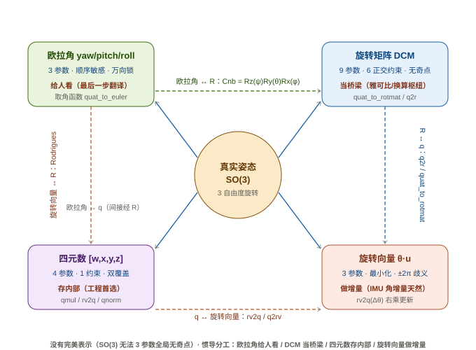
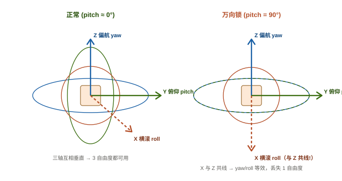
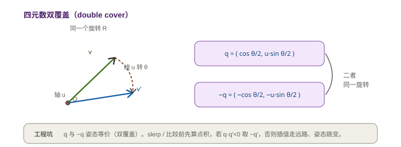

# 02 姿态的四种表示

> **一句话定义**：同一个"姿态"（载体相对导航系的三维朝向，数学上是 3 自由度旋转群 SO(3)）至少有四种主流参数化方式——**欧拉角、旋转矩阵(DCM)、四元数、旋转向量**——它们彼此等价、可互相转换，但在奇点、参数个数、计算开销和插值友好度上各有权衡。惯导工程的常识是：**内部存四元数、对外给欧拉角、做增量更新用旋转向量**。

---

## 一、先统一问题：姿态到底是什么（直觉）

上一讲（[01 坐标系与变换](01_坐标系与变换.md)）我们说惯导的本质是"不断在坐标系之间搬家"。但**姿态**本身是什么？

- 姿态 = 载体坐标系(body)相对于导航系(nav，本项目用 NED)的**朝向**。
- 数学上，朝向就是一个**三维旋转**：把 nav 系的向量旋转到 body 系（或反过来）。所有三维旋转构成一个群，叫 **SO(3)**（Special Orthogonal group，行列式为 +1 的正交矩阵群）。
- SO(3) 是 **3 自由度**的——你只需要 3 个数就能唯一确定任意姿态。

**关键矛盾**：既然是 3 自由度，为什么需要 4 种表示、最多的要用 9 个数？

> 类比：地球表面是 2 维流形，用经纬度(2 个数)描述。但经纬度在**北极点**会"奇点"——所有经线在那汇合，经度失去意义。也就是说，没有一种"全局无奇点、只用 2 个数"的方法能覆盖整个球面。姿态同理：SO(3) 没法用 3 个"全局无奇点"的参数完美覆盖，所以每种表示都**牺牲点什么**（有的有奇点，有的用冗余参数，有的有歧义）。

这就是为什么我们要认识全部四种——**没有哪种是"万能"的，只能让它们各司其职**。

---

## 二、四种表示总览



| 表示                                               | 参数数     | 约束                            | 奇点/歧义               | 串联旋转(复合)       | 插值       | 主要优点                   | 主要缺点                   |
| ------------------------------------------------ | ------- | ----------------------------- | ------------------- | -------------- | -------- | ---------------------- | ---------------------- |
| **欧拉角** (yaw/pitch/roll)                         | 3       | 无                             | **万向锁**(pitch=±90°) | 需先转矩阵再乘        | 不直(会绕远)  | 直观、人能读                 | 奇点 / 顺序依赖              |
| **旋转矩阵 DCM**                                     | 9 (3×3) | 6 个正交约束                       | 无                   | 矩阵乘 $R=R_2R_1$ | 需再正交化    | 无奇点 / 直接作用向量           | 冗余 / 必须反复正交化           |
| **四元数** $[w,x,y,z]$                              | 4       | 1 个范数约束 $\|\boldsymbol q\|=1$ | 无                   | 四元数乘(比矩阵便宜)    | slerp 平滑 | 无奇点 / 数值稳 / 省          | **双覆盖**($q$ 与 $-q$ 等价) |
| **旋转向量** $\boldsymbol\theta=\phi\,\boldsymbol u$ | 3       | 无                             | $\pm\pi/2\pi$ 处不连续  | 需先转四元数         | 小角近线性    | 最小参数 / 物理直观 / IMU 增量天然 | 大角需 wrap               |

> 一句话记忆：**欧拉角给人看、旋转矩阵当桥梁、四元数存内部、旋转向量做增量**。下面逐个拆开。

---

## 三、欧拉角（Euler Angles）

### 1. 定义与顺序

欧拉角把任意姿态拆成**三次基本旋转**的复合，最常用的是 **Z-Y-X 顺序**（也叫 yaw-pitch-roll / 偏航-俯仰-横滚）：

- **yaw（偏航 $\psi$）**：绕 nav 的竖直轴(Z)转 —— "车头朝哪"
- **pitch（俯仰 $\theta$）**：绕机体横轴(Y)转 —— "抬头/低头"
- **roll（横滚 $\phi$）**：绕机体纵轴(X)转 —— "左翼上扬/右翼上扬"

> ⚠️ **顺序极其重要**：Z-Y-X 和 Y-X-Z 给出的数字完全不同，同一个物理姿态用不同约定得到的 (ψ,θ,φ) 数值不一样。本项目统一 **body→NED 的 Z-Y-X**，与 [01](01_坐标系与变换.md) 的旋转矩阵、以及代码 `quat_to_euler` 完全一致。

### 2. 复合旋转矩阵

Z-Y-X 组合出来的旋转矩阵（body→nav）为：

$R = R_z(\psi)\,R_y(\theta)\,R_x(\phi)$

其中三个基本旋转（右乘约定下，从 nav 转到 body 或反过来取决于约定，本项目统一按 body→NED）：

$$
R_z(\psi)=\begin{pmatrix}\cos\psi&-\sin\psi&0\\\sin\psi&\cos\psi&0\\0&0&1\end{pmatrix},\;
R_y(\theta)=\begin{pmatrix}\cos\theta&0&\sin\theta\\0&1&0\\-\sin\theta&0&\cos\theta\end{pmatrix},\;
R_x(\phi)=\begin{pmatrix}1&0&0\\0&\cos\phi&-\sin\phi\\0&\sin\phi&\cos\phi\end{pmatrix}
$$

??? note "📐 折叠：从四元数取欧拉角的显式公式（本项目代码正是这个）"

    本项目 `ins_math.h` 的 `quat_to_euler` 与 `ins_eskf_15d.c` 的 `eskf15_get_euler` 用的是 body→NED(Z-Y-X) 的解析反解（前提：$q=[q_0,q_1,q_2,q_3]=[w,x,y,z]$，且已单位化）：

    $$
    \begin{aligned}
    \text{yaw}   &= \operatorname{atan2}\!\big(2(q_0 q_3 - q_1 q_2),\; 1 - 2(q_2^2+q_3^2)\big) \\
    \text{pitch} &= -\operatorname{asin}\!\big(2(q_1 q_3 + q_0 q_2)\big) \\
    \text{roll}  &= \operatorname{atan2}\!\big(2(q_2 q_3 - q_0 q_1),\; 1 - 2(q_1^2+q_2^2)\big)
    \end{aligned}
    $$

    注意 pitch 前面的负号：这是 NED（z 向下）约定带来的，ENU 里符号会反过来。所以**取欧拉角必须和你的旋转矩阵约定绑死**，绝不能拿一个库的"通用公式"硬套。

### 3. 万向锁（Gimbal Lock）—— 欧拉角的死穴

当 **pitch = ±90°**（机头正上/正下）时，俯仰环把"横滚轴(X)"转到了和"偏航轴(Z)"**共线**的位置——两个本该独立的旋转变成了一个，系统**丢失一个自由度**。此时你无论怎么调 yaw 还是 roll，效果都一样，姿态输出会跳变/失控。



> 这不是数学笔误，是**欧拉角参数化本身的拓扑缺陷**——球面坐标在极点必然奇点，无法避免。所以飞控/惯导绝不会在内部用欧拉角做积分，只在最后一步"翻译"给人看。

---

## 四、旋转矩阵 / 方向余弦矩阵（DCM）

### 1. 定义

一个 $3\times3$ **正交矩阵** $R\in\mathrm{SO}(3)$，满足：

$R^TR = I,\qquad \det R = +1$

它把 body 系向量旋到 nav 系（或反之，看下标约定）。9 个数里只有 **3 个是独立的**——其余 6 个被正交约束吃掉了。

### 2. 性质（务必记住）

- **串联 = 矩阵乘法**：$R_{C\leftarrow A} = R_{C\leftarrow B}\,R_{B\leftarrow A}$。多个姿态复合不用"转回欧拉角再算"，直接乘。
- **逆 = 转置**：$R^{-1}=R^T$（因为正交）。所以 body→nav 是 $R_{nb}$，nav→body 是 $R_{bn}=R_{nb}^T$。
- **直接作用向量**：$\boldsymbol v_{\text{nav}} = R_{nb}\,\boldsymbol v_{\text{body}}$，不用任何三角函数。

### 3. 优点与代价

- ✅ **无奇点**，且左乘即可旋转向量，是"底层真理"表达。
- ❌ **9 个数只装 3 自由度**：数值积分后 $R$ 会慢慢偏离正交（浮点漂移），必须周期性**正交化/重投影**，否则越积越歪。
- ❌ 插值不自然（两矩阵之间线性插值得不到合法旋转）。

> 工程里 DCM 主要当**换算枢纽**：四元数↔欧拉角、雅可比矩阵求导，往往都要先经 $R$ 中转。本项目 `quat_to_rotmat` / `q2r` 就是干这个的。

---

## 五、四元数（Quaternion）

### 1. 定义与几何意义

单位四元数 $\boldsymbol q = (q_0, q_1, q_2, q_3) = (w, x, y, z)$ 表示"**绕单位轴 $\boldsymbol u$ 转角度 $\phi$**"：

$\boldsymbol q = \big(\cos\tfrac{\phi}{2},\; \boldsymbol u\sin\tfrac{\phi}{2}\big)$

也就是说四元数把"旋转轴"和"半角"编码进 4 个数里。本项目约定 **Hamilton 乘积、$[w,x,y,z]$ 顺序**（注意：ROS/TensorFlow 等部分库用 $[x,y,z,w]$ 的 JPL 序，混用是最常见的移植 bug，见第九节）。

### 2. 为什么四元数是工程首选

| 维度    | 四元数               | 旋转矩阵             |
| ----- | ----------------- | ---------------- |
| 参数    | 4（仅 1 个范数约束）      | 9（6 个约束）         |
| 奇点    | 无                 | 无                |
| 串联    | 四元数乘（16 次乘+12 次加） | 矩阵乘（27 次乘+18 次加） |
| 数值稳定性 | 只需偶尔归一化           | 需正交化             |
| 插值    | slerp 平滑、恒定角速度    | 难                |

> 结论：**四元数比旋转矩阵省一半存储和计算，又无欧拉角的奇点**，所以几乎所有实时惯导都在内部用四元数存姿态。

### 3. 双覆盖（Double Cover）—— 四元数的唯一"坑"

四元数对旋转的映射是 **2 对 1**：$\boldsymbol q$ 和 $-\boldsymbol q$ 表示**同一个**三维旋转（转 $\phi$ 绕 $\boldsymbol u$，与转 $2\pi-\phi$ 绕 $-\boldsymbol u$ 等价）。



??? note "📐 折叠：四元数乘法(Hamilton) 与 旋转向量→四元数"

    **Hamilton 乘法**（本项目 `quat_multiply` / `qmul`）：

    $$
    \boldsymbol q_1\otimes\boldsymbol q_2 =
    \begin{pmatrix}
    w_1w_2 - \boldsymbol v_1\!\cdot\!\boldsymbol v_2 \\
    w_1\boldsymbol v_2 + w_2\boldsymbol v_1 + \boldsymbol v_1\times\boldsymbol v_2
    \end{pmatrix}
    $$

    代码实现（核对 `ins_math.h`）：

    ```c
    float w = q1[0]*q2[0] - q1[1]*q2[1] - q1[2]*q2[2] - q1[3]*q2[3];
    float x = q1[0]*q2[1] + q1[1]*q2[0] + q1[2]*q2[3] - q1[3]*q2[2];
    float y = q1[0]*q2[2] - q1[1]*q2[3] + q1[2]*q2[0] + q1[3]*q2[1];
    float z = q1[0]*q2[3] + q1[1]*q2[2] - q1[2]*q2[1] + q1[3]*q2[0];
    ```

    **旋转向量 → 四元数增量**（本项目 `rotvec_to_quat_delta` / `rv2q`，**姿态更新的核心**）：

    设旋转向量 $\boldsymbol\delta\boldsymbol\theta = (\delta\theta_x,\delta\theta_y,\delta\theta_z)$，$\alpha=\|\boldsymbol\delta\boldsymbol\theta\|$，则

    $$
    \boldsymbol dq = \Big(\cos\tfrac{\alpha}{2},\; \frac{\sin(\alpha/2)}{\alpha}\,\boldsymbol\delta\boldsymbol\theta\Big)
    $$

    小角度时 $\boldsymbol dq \approx (1,\; \tfrac12\boldsymbol\delta\boldsymbol\theta)$——这正是陀螺角增量 $\boldsymbol\omega\Delta t$ 直接"升级"成四元数增量的公式（见第六、八节）。

### 🔬 PSINS 演示 ①：旋转向量 → 四元数（rv2q）

> **本系列「PSINS 演示」统一三件套**：① PSINS 参考代码（带署名）→ ② C 语言实现对照 → ③ 结论。
> 参考来源：严龚敏《PSINS》（西北工业大学），保留版权、要求引用。
> 本页共 4 个面板：① rv2q（§五/§六 姿态增量）② qmul（§五 四元数乘法）③ q2mat（§四 DCM）④ q2att（§三 欧拉角，⚠️ 差异警示）。

**① PSINS 参考实现（MATLAB）**

```matlab
% PSINS: base0/rv2q.m — Gongmin Yan, NWPU (psins260705)
function q = rv2q(rv)
    n2 = rv(1)^2 + rv(2)^2 + rv(3)^2;
    if n2 < 1.0e-8                      % 小角泰勒展开
        q(1) = 1 - n2*(1/8 - n2/384);  s = 1/2 - n2*(1/48 - n2/3840);
    else
        n = sqrt(n2); q(1) = cos(n/2); s = sin(n/2)/n;
    end
    q(2:4) = s * rv;
```

**② C 语言实现（本项目 `ins_eskf_15d.c :: rv2q`）**

```c
static void rv2q(const float dt[3], float dq[4])
{
    float a = sqrtf(dt[0]*dt[0] + dt[1]*dt[1] + dt[2]*dt[2]), h = 0.5f * a;
    if (a < 1e-8f) { dq[0]=1; dq[1]=dq[2]=dq[3]=0; return; }
    float s = sinf(h) / a;            /* = sin(n/2)/n */
    dq[0] = cosf(h);
    dq[1] = s*dt[0]; dq[2] = s*dt[1]; dq[3] = s*dt[2];
    qnorm(dq);
}
```

**③ 结论**

✅ **逐字等价**：令 `n = a = ‖dt‖`，则 `h = n/2`，`s = sin(n/2)/n`——与 PSINS 主分支完全一致。
小角处理上 PSINS 用泰勒展开提高精度，本项目在 `a<1e-8` 时直接退化为单位四元数（此时 `dt≈0`，`dq≈(1,0)`，等价且更简单）。
这说明**本项目底层姿态数学与经过大量工程验证的 PSINS 完全对齐**——我们不是在"自己拍脑袋"，而是站在经典参考的肩膀上。

---

### 🔬 PSINS 演示 ②：四元数乘法（qmul）

> 对应正文 §五-2：四元数乘法是姿态串联（$q \leftarrow q \otimes dq$）的引擎，属于**纯代数**——它只跟 Hamilton 约定有关，与坐标系（ENU/NED）无关，所以可以直接逐项对照。

**① PSINS 参考实现（MATLAB）**

```matlab
% PSINS: base0/qmul.m — Gongmin Yan, NWPU (psins260705)
function q = qmul(q1, q2)      % q = q1 ⊗ q2（Hamilton 乘积，标量在首）
    q = [ q1(1)*q2(1) - q1(2)*q2(2) - q1(3)*q2(3) - q1(4)*q2(4);
          q1(1)*q2(2) + q1(2)*q2(1) + q1(3)*q2(4) - q1(4)*q2(3);
          q1(1)*q2(3) + q1(3)*q2(1) + q1(4)*q2(2) - q1(2)*q2(4);
          q1(1)*q2(4) + q1(4)*q2(1) + q1(2)*q2(3) - q1(3)*q2(2) ];
```

**② C 语言实现（本项目 `ins_eskf_15d.c :: qmul`）**

```c
static void qmul(float o[4], const float q1[4], const float q2[4])
{
    float w = q1[0]*q2[0] - q1[1]*q2[1] - q1[2]*q2[2] - q1[3]*q2[3];
    float x = q1[0]*q2[1] + q1[1]*q2[0] + q1[2]*q2[3] - q1[3]*q2[2];
    float y = q1[0]*q2[2] - q1[1]*q2[3] + q1[2]*q2[0] + q1[3]*q2[1];
    float z = q1[0]*q2[3] + q1[1]*q2[2] - q1[2]*q2[1] + q1[3]*q2[0];
    o[0] = w; o[1] = x; o[2] = y; o[3] = z;
}
```

**③ 结论**

✅ **逐项一致**：四项 Hamilton 乘积公式完全对应（`qmul.m` 与 C 的 `qmul` 逐字等价）。这也再次确认存储序兼容——PSINS 标量在首 `[q0,q1,q2,q3]` 与本项目 `[w,x,y,z]` 同构，直接互通。

---

### 🔬 PSINS 演示 ③：四元数 → 旋转矩阵（q2mat / q2r）

> 对应正文 §四-3：DCM 当"换算枢纽"，雅可比矩阵求导常经它中转。⚠️ **注意方向语义**：PSINS 的 `q2mat` 返回 **Cnb = nav→body**（从导航系到机体系），本项目的 `q2r` 也是 **world→body**（= NED→body）——两边方向一致，公式才能逐项对照。

**① PSINS 参考实现（MATLAB）**

```matlab
% PSINS: base0/q2mat.m — Gongmin Yan, NWPU (psins260705)
function Cnb = q2mat(qnb)     % Cnb = nav→body 的 DCM（行向量写法）
    q11=qnb(1)*qnb(1); q12=qnb(1)*qnb(2); q13=qnb(1)*qnb(3); q14=qnb(1)*qnb(4);
    q22=qnb(2)*qnb(2); q23=qnb(2)*qnb(3); q24=qnb(2)*qnb(4);
    q33=qnb(3)*qnb(3); q34=qnb(3)*qnb(4); q44=qnb(4)*qnb(4);
    Cnb = [ q11+q22-q33-q44,  2*(q23-q14),     2*(q24+q13);
            2*(q23+q14),      q11-q22+q33-q44, 2*(q34-q12);
            2*(q24-q13),      2*(q34+q12),     q11-q22-q33+q44 ];
```

**② C 语言实现（本项目 `ins_eskf_15d.c :: q2r`，行主序）**

```c
/* world->body (= NED->body = 参考 R.') */
static void q2r(const float q[4], float R[9])
{
    float xx=q[1]*q[1], yy=q[2]*q[2], zz=q[3]*q[3];
    float xy=q[1]*q[2], xz=q[1]*q[3], yz=q[2]*q[3];
    float wx=q[0]*q[1], wy=q[0]*q[2], wz=q[0]*q[3];
    R[0]=1-2*(yy+zz); R[1]=2*(xy+wz); R[2]=2*(xz-wy);
    R[3]=2*(xy-wz);   R[4]=1-2*(xx+zz); R[5]=2*(yz+wx);
    R[6]=2*(xz+wy);   R[7]=2*(yz-wx);  R[8]=1-2*(xx+yy);
}
```

**③ 结论**

✅ **逐项一致**：9 个元素一一对应（MATLAB 行序 vs C 行主序正好对齐）。而且两边的语义都是 **nav→body**（`Cnb` / `world→body`）——公式本身不依赖 ENU/NED 的轴向选择，只要"导航系→机体系"的方向约定一致就能直接对照。

---

### 🔬 PSINS 演示 ④：四元数 → 欧拉角（q2att / quat_to_euler）⚠️ 差异警示

> 对应正文 §三-2 的折叠。**这一对不能直接对照**——PSINS 用 **ENU**（x 东、y 北、z 天），本项目用 **NED**（x 北、y 东、z 地），姿态角顺序与符号约定都不同。差异正是坐标系约定的具象化。

**① PSINS 参考实现（MATLAB，ENU 约定）**

```matlab
% PSINS: base0/q2att.m — Gongmin Yan, NWPU (psins260705)
% 输出 att = [pitch; roll; yaw]（注意顺序！）—— ENU: x东 y北 z天
function att = q2att(qnb)
    q11=qnb(1)*qnb(1); q12=qnb(1)*qnb(2); q13=qnb(1)*qnb(3); q14=qnb(1)*qnb(4);
    q22=qnb(2)*qnb(2); q23=qnb(2)*qnb(3); q24=qnb(2)*qnb(4);
    q33=qnb(3)*qnb(3); q34=qnb(3)*qnb(4); q44=qnb(4)*qnb(4);
    C12=2*(q23-q14); C22=q11-q22+q33-q44;
    C31=2*(q24-q13); C32=2*(q34+q12); C33=q11-q22-q33+q44;
    if C32>0.999999                     % 万向锁: pitch=±90°
        C11=q11+q22-q33-q44; C13=2*(q24+q13);
        att=[pi/2; atan2(C13,C11); 0];
    elseif C32<-0.999999
        C11=q11+q22-q33-q44; C13=2*(q24+q13);
        att=[-pi/2; atan2(C13,C11); 0];
    else
        att = [ asin(C32);
                atan2(-C31, C33);
                atan2(-C12, C22) ];
    end
```

**② C 语言实现（本项目 `ins_math.h :: quat_to_euler`，NED 约定）**

```c
/* 四元数 -> 欧拉角 (Yaw, Pitch, Roll)。约定 FRD 机体系 -> NED 导航系。 */
static inline void quat_to_euler(const float q[4], float *yaw, float *pitch, float *roll)
{
    float q0=q[0], q1=q[1], q2=q[2], q3=q[3];
    if (yaw)   *yaw   = atan2f(2.0f*(q1*q2 + q0*q3), 1.0f - 2.0f*(q2*q2 + q3*q3));
    if (pitch) *pitch = -asinf(2.0f*(q1*q3 - q0*q2));          /* NED: pitch 带负号 */
    if (roll)  *roll  = atan2f(2.0f*(q2*q3 + q0*q1), 1.0f - 2.0f*(q1*q1 + q2*q2));
}
```

**③ 结论**

⚠️ **结构同构、约定不同——公式不能互换**：
- **输出顺序**：PSINS 给 `[pitch; roll; yaw]`，本项目给 `(yaw, pitch, roll)`。
- **轴向语义**：ENU 与 NED 的 z 轴一上一下，pitch 的符号、部分 atan2 的分子差个负号；我们的 `pitch` 显式带 `-` 号就是 NED 约定的结果（代码注释也写了）。
- **正确姿势**：各用各的取角函数，**不要**拿 PSINS 的 `q2att` 公式替换固件的 `quat_to_euler`——同一物理姿态下两者给出的数字不同（除非恰好对称）。这也解释了 [01 坐标系与变换](01_坐标系与变换.md) 里为什么坐标系必须先定死。

---

### 4. 工程常识：内部永远存四元数，只在输出时转欧拉角

把姿态在滤波器里**永远存成四元数**（`nom.q`），需要给人/给其他模块看时才用 `quat_to_euler` 转。原因已经清楚了：四元数无奇点、好积分；欧拉角只适合"最后一步翻译"。本项目 `eskf15_get_euler` 内部就一行 `quat_to_euler(e->nom.q, y, p, r)`。

---

## 六、旋转向量 / 角轴（Axis-Angle）

### 1. 定义

用一个**三维向量**表示旋转：方向 = 旋转轴 $\boldsymbol u$，长度 = 旋转角 $\phi$：

$\boldsymbol\theta = \phi\,\boldsymbol u \quad (\|\boldsymbol u\|=1)$

只有 3 个参数（最小参数化），而且**物理直觉极强**——"绕某个轴转了多少度"。

### 2. 为什么它适合"增量更新"

IMU 每帧给出的就是**角增量** $\Delta\boldsymbol\theta \approx \boldsymbol\omega\,\Delta t$（陀螺输出直接就是旋转向量！）。把它升级成四元数增量 `dq = rv2q(Δθ)` 再右乘到姿态上，就是姿态积分最自然的做法：

$\boldsymbol q_{k+1} = \boldsymbol q_k \otimes \boldsymbol{dq}(\Delta\boldsymbol\theta)$

本项目 `ins_eskf_15d.c` 的 `eskf15_predict` 正是这么干的（见第八节代码走读）。

### 3. 缺点：大角度歧义

- 转 $\phi$ 和转 $\phi+2\pi$ 是同一个姿态，但向量长度差 $2\pi$——所以旋转向量在 **$\pm\pi$（或 $\pm2\pi$）处不连续**，需要 wrap。
- 不适合做"绝对姿态"存储（超过半圈就乱），但**做小增量完美无瑕**，所以它是"更新步"的最佳载体，而非"状态存储"的载体。

---

## 七、Bortz 方程与"不可交换误差"（coning）

> 这一段是**进阶**。想深入姿态更新算法（本系列 07 篇）前，先在这里埋个种子。

一个朴素的想法：既然 $\Delta\boldsymbol\theta=\boldsymbol\omega\Delta t$，那一直累加 $\boldsymbol q \leftarrow \boldsymbol q\otimes\text{rv2q}(\boldsymbol\omega_k\Delta t)$ 不就行了？**在角速度恒定或变化很慢时是对的**。但当载体做**圆锥运动（coning，高频小幅振动+转动耦合）**&#x65F6;，旋转在三维里**不可交换**——先转 A 再转 B，和先转 B 再转 A，结果不同。忽略这一项会累积出"不可交换误差"。

**Bortz 一阶方程**给出旋转向量随时间演化的精确形式：

$\dot{\boldsymbol\phi} = \boldsymbol\omega + \frac12\boldsymbol\phi\times\boldsymbol\omega + \frac{1}{12}\boldsymbol\phi\times(\boldsymbol\phi\times\boldsymbol\omega) + \cdots$

- 第一项 $\boldsymbol\omega$：就是朴素累加（零阶）。
- 第二项 $\tfrac12\boldsymbol\phi\times\boldsymbol\omega$：**叉乘修正项**，正是 coning 误差的来源——它在高频振动下不可忽略。

??? note "📐 折叠：为什么 MEMS 板常用单子样+rv2q 也够用"

    Bortz 修正项的大小正比于角振动幅值×频率。对本项目这种 **1000 Hz 采样 + MEMS 量级**的载体，单个采样间隔内 $\Delta t$ 极小，$\boldsymbol\phi\times\boldsymbol\omega$ 的二阶项远小于测量噪声，因此**每帧用 `rv2q(ωΔt)` 右乘**已是工程上足够精确的"一阶姿态更新"。

    真正需要多子样 coning 补偿的，是**高动态、低频高幅振动**（如导弹、某些战术级 IMU）。那部分会在 07 篇结合 Savage / 毕查德算法展开；现在你只需记住：**旋转不可交换 → 简单累加有误差 → 高动态要补偿**。

---

## 八、各司其职：本项目实战里的姿态表示

把上面四种放回我们这块板（AHRS-Board，1000 Hz ESKF）：

| 角色                 | 用什么表示                          | 对应代码                                     | 为什么                               |
| ------------------ | ------------------------------ | ---------------------------------------- | --------------------------------- |
| **滤波内部状态**         | 四元数 $\boldsymbol q$            | `e->nom.q[4]`                            | 无奇点、好积分、省算力                       |
| **对外输出 / UI / 日志** | 欧拉角(yaw/pitch/roll)            | `eskf15_get_euler()` → `quat_to_euler()` | 人能读、调试直观                          |
| **每帧姿态增量**         | 旋转向量 $\Delta\boldsymbol\theta$ | `rv2q(φ, dq)` + `qmul(q, q, dq)`         | 陀螺角增量天然是旋转向量，右乘即更新                |
| **换算枢纽 / 雅可比**     | 旋转矩阵 $R$                       | `quat_to_rotmat()` / `q2r()`             | 量测模型(accel/mag)需要 $R$ 把向量投到 nav 系 |

**代码走读（`ins_eskf_15d.c::eskf15_predict`）**：

```c
/* 1) 用积分前的姿态算 R（线性化点，量测更新复用） */
q2r(e->nom.q, Rm);          /* world->body = R.' */
m3t(Rm, Rt);                 /* body->NED = R     */

/* 2) 陀螺去零偏 -> 角增量(旋转向量) -> 四元数增量 -> 右乘更新 */
float phi[3] = { ou[0]*dt, ou[1]*dt, ou[2]*dt };  /* Δθ = ω·dt (旋转向量) */
rv2q(phi, dq);                                  /* 旋转向量 -> 四元数增量 */
qmul(e->nom.q, e->nom.q, dq);                   /* q = q ⊗ dq (右乘) */
qnorm(e->nom.q);                                /* 保持单位四元数 */
```

注意 `qmul(e->nom.q, e->nom.q, dq)` 是**右乘**——因为角增量是在 body 系测得的，要右乘到当前姿态上。这正是第五、六节说的"旋转向量→四元数增量→右乘"。

**另一个真实踩过的坑（`eskf15_get_euler` 注释）**：取欧拉角**必须用 `quat_to_euler` 由 $q$ 直接解**，绝不能"先用 `q2r` 得到 $R$ 再反推欧拉角"——因为本项目里 `q2r` 输出的是 $R^T$（world→body），用它会算成**逆旋转**的姿态，yaw/pitch/roll 全错。这条坑已经写进代码注释，看到 `q2r` 和 `quat_to_rotmat` 的区别要警觉。

---

## 九、常见坑（把你未来会栽的提前标出来）

!!! danger "姿态表示经典翻车清单"  
\- **万向锁**：pitch 接近 ±90° 时欧拉角输出跳变。对策——内部绝不用欧拉角积分，只在输出时转换；靠近极点时用四元数/slerp。  
\- **四元数双覆盖符号**：`q` 与 `-q` 等价。slerp / 比较 / 求差前先算点积，若 $\boldsymbol q\cdot\boldsymbol q'<0$ 取 $-\boldsymbol q'$，否则插值会"走远路"、姿态瞬跳。  
\- **存储序 $[w,x,y,z]$ vs $[x,y,z,w]$ 混用**：本项目 Hamilton 用前者；ROS(`geometry_msgs`)、部分神经网络用后者。移植/对接外部库时第一件事就是确认顺序，差一位全错。  
\- **欧拉角顺序**：Z-Y-X 与 Y-X-Z 数值不同。对接 COTS 模块（如 MTi）必须核对其 datasheet 的顺序与基准系。  
\- **用 `q2r` 反推欧拉角**：本项目 `q2r` 给的是 $R^T$，硬推会得到逆旋转——务必走 `quat_to_euler`。  
\- **旋转矩阵忘记正交化**：长时间积分后 $R$ 漂移失正，必须周期重投影（如通过四元数重建 $R$）。  
\- **旋转向量 $\pm\pi$ 跳变**：当作"绝对姿态"存储时会在半圈处不连续，需要 wrap；它只适合做增量。

---

## 十、自测题（合上眼睛能答，才算懂）

1. 为什么没有一种"只用 3 个数、全局无奇点"的姿态表示？（用经纬度类比回答）
2. 欧拉角 Z-Y-X 的 pitch=90° 时发生了什么？为什么叫"丢失一个自由度"？
3. 旋转矩阵串联为什么是乘法 $R=R_2R_1$ 而不是加法？它和四元数乘法比，贵在哪？
4. 四元数 $\boldsymbol q$ 和 $-\boldsymbol q$ 是什么关系？工程中为什么要"先判符号再 slerp"？
5. 本项目里姿态在滤波器内部存成什么？对外输出成什么？每帧增量是什么？三者如何衔接（写出那行 `qmul` 右乘的含义）？
6. 为什么说"陀螺角增量天然是旋转向量"？旋转向量的主要缺点是什么，为什么它仍适合做增量更新？

> 答案都藏在上面。第 1、3、5 题答不清，建议回看 [01 坐标系与变换](01_坐标系与变换.md) 与 [数学地基：矩阵、概率与协方差](../数学基础.md) 的旋转矩阵小节。

---

## 关联与延伸

- 系列首页：[惯性导航与惯导解算 · 自学科普系列](../index.md)
- 上一篇：[01 坐标系与变换](01_坐标系与变换.md)（姿态张开前先对齐坐标系）
- 下一篇规划：`03 传感器原理`——加速度计测"比力"、陀螺测角速度；MEMS vs FOG
- 代码落地：[AHRS 板固件仿真与验证](../工作与项目/AHRS板固件仿真与验证/)（`ins_eskf_15d.c` / `ins_math.h` 真实实现）
- 数学地基：[矩阵、概率与协方差](../数学基础.md)（旋转矩阵、四元数乘法都在这里）

## 外链 Wiki（随时回补）

- [欧拉角 — 维基百科](https://zh.wikipedia.org/wiki/欧拉角)
- [万向锁 — 维基百科](https://zh.wikipedia.org/wiki/万向锁)
- [四元数与空间旋转 — 维基百科](https://zh.wikipedia.org/wiki/四元数与空间旋转)
- [旋转矩阵 — 维基百科](https://zh.wikipedia.org/wiki/旋转矩阵)
- [旋转群 SO(3) — 维基百科](https://zh.wikipedia.org/wiki/旋转群)
- [轴角表示 — 维基百科](https://zh.wikipedia.org/wiki/轴角表示)
- [Slerp 球面线性插值 — Wikipedia](https://en.wikipedia.org/wiki/Slerp)
