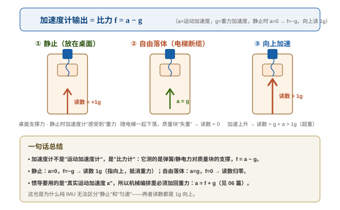
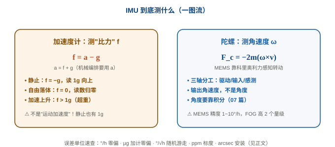
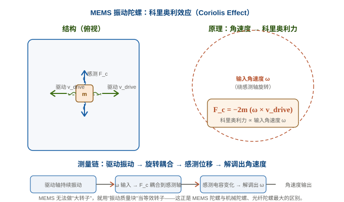
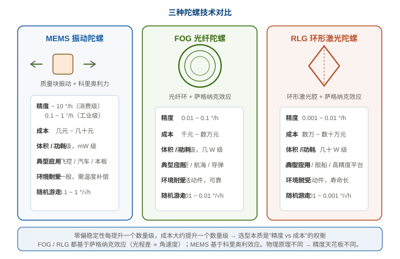

# 03 传感器原理：加速度计测比力、陀螺测角速度

> 系列定位：**M1 基础 · 传感器原理**。上一篇 [02 姿态的四种表示](02_姿态的四种表示.md) 讲清了"姿态怎么表示"，这一篇回答更根本的问题：**IMU 的两个芯片到底在测什么物理量？**——加速度计测的是**比力**（不是"加速度"！），陀螺测的是**角速度**。理解这一点，后面所有公式才有根。

---

## 一、加速度计：测的是"比力"，不是"加速度"

### 1. 直觉实验：电梯里的弹簧秤

想象你站在电梯里的体重秤上：

| 电梯状态 | 秤的读数 | 你的"感觉" |
|---|---|---|
| 静止 / 匀速 | $mg$ | 正常 |
| 加速上升 | $m(g+a) > mg$ | 超重，被压紧 |
| 加速下降 | $m(g-a) < mg$ | 失重，飘起来 |
| **自由落体（断缆）** | **0** | **完全失重** |

关键观察：**自由落体时秤读数为 0**——虽然你在以 $g$ 加速运动！因为加速度计/秤测的从来不是"运动加速度"，而是**施加在质量块上的支撑力**（弹簧力/静电力）。自由落体时没有支撑力，读数归零。

> 这就是为什么加速度计读数的学名叫 **比力（specific force）**：单位质量所受的**非重力**合力。它与"运动加速度"差一个重力加速度。

### 2. 精确关系式（折叠：比力方程）

??? note "📐 折叠：比力 f 与运动加速度 a 的关系推导"

    对质量块写牛顿第二定律（把重力显式分离出来）：

    $$\sum \boldsymbol F = m\boldsymbol a \quad\Rightarrow\quad \boldsymbol F_{\text{支撑}} + m\boldsymbol g = m\boldsymbol a$$

    两边除以 $m$：

    $$\underbrace{\boldsymbol F_{\text{支撑}}/m}_{\text{比力 }\boldsymbol f} = \boldsymbol a - \boldsymbol g$$

    所以：

    $$
    \boxed{\;\boldsymbol f = \boldsymbol a - \boldsymbol g\;}
    \qquad\text{即}\qquad
    \boldsymbol a = \boldsymbol f + \boldsymbol g
    $$

    - **静止**：$\boldsymbol a=0 \Rightarrow \boldsymbol f=-\boldsymbol g$ → 读数指向**上**、大小为 $1g$（抵消重力）。
    - **自由落体**：$\boldsymbol a=\boldsymbol g \Rightarrow \boldsymbol f=0$ → 读数归零。
    - **加速上升**：$\boldsymbol a\uparrow\Rightarrow \boldsymbol f = \boldsymbol a - \boldsymbol g$ → 读数 $>1g$（超重）。

    > 惯导要的是**运动加速度** $\boldsymbol a$，但芯片给的是**比力** $\boldsymbol f$——所以机械编排（06 篇）里必须把重力加回来：$\boldsymbol a = \boldsymbol f + \boldsymbol g$。这是整个 INS 的基石公式。



### 3. 从"比力"到本项目的代码

芯片内部已经把"质量块位移"换算成比力，驱动读回来就是 `accel_mps2`（单位 m/s²，含重力）：

```c
// ins_sensor_types.h —— IMU 采样结构
typedef struct {
    uint32_t    timestamp_us;    /**< 采样时间戳 (微秒) */
    ins_vec3f_t accel_mps2;      /**< 比力/加速度 (m/s^2) —— 注意含重力分量 */
    ins_vec3f_t gyro_rads;       /**< 角速度 (rad/s) */
    ins_f32_t   temperature_c;   /**< 芯片温度 (℃) */
    uint8_t     valid;           /**< 数据有效标志 */
} ins_imu_sample_t;
```

> ⚠️ **静止时 `accel_mps2` 读数 ≈ (0, 0, +9.81) 或 (0,0,-9.81)**（取决于轴向约定，本板 NED + 芯片默认向上为正则读 +9.81）。这是**比力**，不是"运动的加速度"。初学最容易犯的错：把静止读数直接当"速度变化率"用。

---
---





## 二、陀螺仪：测角速度（转动快慢）

### 1. 它测什么

陀螺测的是**机体绕自身轴的转动角速度** $\boldsymbol\omega=(\omega_x,\omega_y,\omega_z)$（单位 rad/s 或 °/s），**不是**角度，也不是加速度。姿态角要靠"角速度积分"才能得到（见 [07 姿态更新算法](../02_解算篇/07_姿态更新算法.md)）。

### 2. MEMS 陀螺的物理原理：科里奥利效应

MEMS（微机电）陀螺里没有旋转的转子，它靠**让质量块持续振动**，再利用**科里奥利力（Coriolis force）**来感知转动：

> **科里奥利力**：在一个**旋转参考系**里运动的物体，会受到一个"貌似"的力：
> $$\boldsymbol F_c = -2m\,\boldsymbol\omega \times \boldsymbol v$$
> 它垂直于转轴和运动方向，大小正比于角速度 $\omega$ 和速度 $v$。

**工作过程（三轴分工）：**

1. **驱动轴**：梳齿静电驱动，让质量块沿 x 轴做高频往复振动（$v_x = v_0\sin\Omega t$）。
2. **输入轴（敏感轴）**：载体绕 z 轴转动 $\omega_z$。
3. **感测轴**：科里奥利力把振动"掰"到 y 轴方向：$F_{cy} = -2m\omega_z v_x$，使质量块在 y 轴产生微小位移。
4. **读出**：y 轴电容变化 $\propto F_{cy} \propto \omega_z$ → 解调出角速度。



> 关键点：**测的是"位移"，但位移是振动速度与角速度的乘积**，所以必须用与驱动同频的参考信号做**解调**才能提取 $\omega_z$。这也是 MEMS 陀螺噪声比加计大的物理根源之一（信号被调制在高频振动上）。

### 3. 从"角速度"到本项目的代码

```c
// bosch_bmi088.c —— LSB→SI 换算表（量程决定每个 LSB 代表多少物理量）
[BMI088_GYRO_RANGE_2000DPS] = 0.001065264f,  // rad/s per LSB
[BMI088_GYRO_RANGE_1000DPS] = 0.000532632f,
[BMI088_GYRO_RANGE_500DPS]  = 0.000266267f,
[BMI088_GYRO_RANGE_250DPS]  = 0.000133068f,
```

驱动把寄存器原始值乘上这个系数，得到 `gyro_rads`（rad/s）——**单位统一成 rad/s**，而不是芯片手册常见的 °/s，避免在滤波器里混单位。

---

## 三、MEMS vs FOG vs RLG：三种陀螺技术对比

同一句"测角速度"，物理原理和性能天花板天差地别：



| 维度 | MEMS（本项目） | FOG 光纤陀螺 | RLG 环形激光陀螺 |
|---|---|---|---|
| 物理原理 | 科里奥利力（振动质量块） | 萨格纳克效应（光纤环） | 萨格纳克效应（激光腔） |
| 零偏稳定性 | 1~10 °/h（消费级）/ 0.1~1 °/h（工业级） | 0.01~0.1 °/h | 0.001~0.01 °/h |
| 角随机游走 | 0.1~1 °/√h | 0.001~0.01 °/√h | 0.0001~0.001 °/√h |
| 成本 | 几元~几十元 | 千元~数万元 | 数万~数十万元 |
| 体积/功耗 | 芯片级 / mW 级 | 器件级 / W 级 | 较大 / 十 W 级 |
| 典型应用 | 手机/飞控/汽车/本板 | 航空/航海/导弹 | 战略导弹/舰船 |
| 无活动件 | 有振动件（可靠但需温补） | 全固态（可靠） | 全固态（寿命长） |

> 一句话：**精度每高一个数量级，成本大约也高一个数量级**。本板选 MEMS（ICM-42688P / IIM-42652 / BMI088）是因为"体积、成本、功耗"约束下消费级/工业级 MEMS 已能满足航姿需求。

---

## 四、本项目 3×IMU 的真实配置（锚点）

```c
// main.c —— 三颗 IMU 的量程配置（真实代码）
sensor_cfg.icm42688p_cfg.accel_fs = ICM426XX_ACCEL_FS_8G;      // 加速度计 ±8g
sensor_cfg.icm42688p_cfg.gyro_fs  = ICM426XX_GYRO_FS_1000DPS;  // 陀螺 ±1000°/s
sensor_cfg.iim42652_cfg.accel_fs  = ICM426XX_ACCEL_FS_8G;      // 加速度计 ±8g
sensor_cfg.iim42652_cfg.gyro_fs   = ICM426XX_GYRO_FS_1000DPS;  // 陀螺 ±1000°/s
sensor_cfg.bmi088_cfg.accel_range = BMI088_ACCEL_RANGE_12G;    // 加速度计 ±12g
sensor_cfg.bmi088_cfg.gyro_range  = BMI088_GYRO_RANGE_1000DPS; // 陀螺 ±1000°/s
sensor_cfg.bmi088_cfg.accel_odr   = BMI088_ACCEL_ODR_800HZ;    // 加计 800 Hz
sensor_cfg.bmi088_cfg.gyro_odr    = BMI088_GYRO_ODR_1000HZ_116HZ; // 陀螺 1000 Hz
```

- **为什么加计量程 8g/12g 而陀螺 1000°/s？** 航姿板可能经历高机动（转弯离心、颠簸），量程必须覆盖"最大预期加速度/角速度"；量程太小会饱和削顶，量程太大则量化噪声变大（LSB 变粗）——是**动态范围 vs 分辨率**的权衡。
- **为什么 BMI088 加计用 12g 而 ICM 用 8g？** 双冗余设计下刻意用不同量程/不同型号，故障模式不相关（见 15 篇多传感器冗余 FDI）。

---

## 五、PSINS 演示：误差模型参数（imuerrset）

> 传感器"标称参数"（零偏、随机游走）是评估 IMU 的通用语言。PSINS 的 `imuerrset` 定义了一套业界标准参数，我们会在下一篇 [04 IMU 误差模型](04_IMU误差模型.md) 详细展开，这里先看它的"单位速查"——**读得懂这些参数，就能读懂任何 IMU 的 datasheet**。

**① PSINS 参考实现（MATLAB）**

```matlab
% PSINS: base/imu/imuerrset.m — Gongmin Yan, NWPU (psins260705)
% eb    - gyro constant bias        (deg/h)    陀螺常值零偏
% db    - acc  constant bias        (ug)       加计常值零偏
% web   - angular random walk       (deg/sqrt(h))  陀螺角随机游走
% wdb   - velocity random walk      (ug/sqrt(Hz))  加计速度随机游走
% dKGii - gyro scale factor error   (ppm)      陀螺标度因数误差
% dKAii - acc  scale factor error   (ppm)      加计标度因数误差
% dKGij - gyro installation error   (arcsec)   陀螺安装误差
% dKAij - acc  installation error   (arcsec)   加计安装误差
% Ka2   - acc  quadratic coefficient(ug/g^2)   加计二次非线性系数
% 示例: 惯性级 IMU
% imuerr = imuerrset(0.01, 100, 0.001, 10, 0.001, 1000, 10, 1000, 10, 10, 10, 10, 10, 10, 10);
%        = 陀螺零偏0.01°/h, 加计零偏100µg, 陀螺ARW 0.001°/√h ...
```

**② 本项目 C 语言实现（`bosch_bmi088.c` / `tdk_icm426xx.c`）**

```c
// 本项目的"误差参数"体现在两处：
// ① 量程/分辨率换算表（决定量化噪声下限）：
[BMI088_GYRO_RANGE_1000DPS] = 0.000532632f,   // rad/s per LSB
// ② 温度补偿（NTC + 恒温 PID，见 ins_thermal），压低温度漂移带来的零偏变化
```

**③ 结论**

PSINS 的 `imuerrset` 参数体系（°/h、µg、°/√h、ppm、arcsec）是**全行业的通用语言**——评估任何 IMU、比较任何方案，都先看这几项。本项目的 MEMS 芯片在 datasheet 里给出的是同类参数（如 ICM-42688P 陀螺零偏典型值 ±2 °/s 量级、ARW 0.0022 °/√s 等），05 篇我们会用 **Allan 方差**从实测数据里把这些参数"测出来"，和 datasheet 对表。

### 附：IMU 误差单位速查（新手向 · 物理含义 + 影响）

> 读 IMU datasheet 时最劝退的就是这一堆单位。其实每个单位都在回答同一句话："**这个传感器在什么物理量上撒谎、撒多大谎、会造成什么后果**"。逐条拆开：

| 单位 | 对应参数 | 物理含义（大白话） | 对导航的实际影响 | 量级参照 |
|---|---|---|---|---|
| **°/h**（度每小时） | 陀螺**常值零偏** eb | 陀螺静止时本应输出 0，但它"谎报"了一个固定的角速度。比如 0.01 °/h = 每 1 小时多转出 0.01° | 姿态角**随时间线性漂移**：积分一次就是角度误差。这是陀螺最致命的误差 | 消费级 MEMS 1~10；工业级 0.1~1；FOG 0.01~0.1；RLG 0.001~0.01 |
| **µg**（微 g） | 加计**常值零偏** db | 加计静止时应读 1g，但"谎报"了 1g 的百万分之一（1µg ≈ 9.8e-6 m/s²） | 速度误差随时间**线性增长**，位置误差**二次方增长**（积分两次） | 常见 50~500 µg；战术级 ~10 µg |
| **°/√h**（度每根号小时） | 陀螺**角随机游走** web | 噪声像"醉汉走路"：每一步方向随机，走得越久偏离越远，但只按**时间的平方根**扩散 | 姿态误差按 √t 增长：短时是噪声，长时是漂移。和零偏的区别：零偏是"一直朝一个方向错"，随机游走是"随机乱晃" | MEMS 0.1~1；FOG 0.001~0.01 |
| **µg/√Hz**（微 g 每根号赫兹） | 加计**速度随机游走** wdb | 同上，不过是加计的噪声密度，用频谱视角描述"每个频率带里有多少噪声" | 速度/位置误差按 √t 增长；和 °/√h 是同一类"随机游走"误差，只是轴不同 | MEMS 10~100；战术级 ~10 |
| **ppm**（百万分之一） | 标度因数误差 dKG/dKA | 测得的量与实际量差一个**比例**：量程 1000°/s 时 1ppm = 0.001°/s 的满量程误差。1000ppm = 满量程的 0.1% | 大角速度/大加速度时误差**按比例放大**——静止没事，机动越猛错得越多 | 低成本 MEMS 几千 ppm；好的 ~10 ppm |
| **arcsec**（角秒） | 安装/交叉耦合误差 dKGij/dKAij | 芯片没对准 PCB 的坐标轴，歪了一点点（1° = 3600″，10″ ≈ 0.0028°） | 一个轴的转动会"泄漏"到另一个轴：转弯时俯仰/横滚被污染；耦合还会让标定复杂化 | 消费级百″级；精密装配 <10″ |
| **µg/g²** | 加计**二次非线性** Ka2 | 加速度越大，误差按**加速度的平方**增长（弹簧在大变形下不再线性） | 高 g 机动（冲击/大过载）时误差暴涨；低 g 时几乎无感 | 常见几 ~ 几十 µg/g² |
| **°C 漂移**（datasheet 常给 °/h/°C） | 温度引起的零偏变化 | 温度变了，芯片"谎报"的底数也跟着变——这就是为什么传感器要标定温度曲线 | 温漂会让上面所有"常值"变成"随温度乱跑的变值"，是 MEMS 最难缠的误差之一 | 见各芯片 datasheet 温度曲线 |

??? note "📐 折叠：°/√h 里的"√h"到底是什么意思？（随机游走直觉）"

    随机游走（random walk）的经典类比是**醉汉走路**：每走一步，方向随机。走 $N$ 步后，他离起点的"典型距离"不是 $N$ 步那么远，而是 $\sqrt{N}$ 步——因为随机方向会互相抵消一部分。

    陀螺的角随机游走（ARW）同理：每秒钟的角速度噪声是随机的，但误差会**累积**。设 ARW = $\sigma$ °/√h，则经过 $t$ 小时后，姿态角的不确定性（1σ）约为：

    $$\sigma_{\theta}(t) = \sigma \cdot \sqrt{t}$$

    - 1 小时后：1°（就是 ARW 数值本身）
    - 4 小时后：2°（√4 = 2）
    - 16 小时后：4°（√16 = 4）

    > 对比零偏：零偏是**线性**增长（$t$），随机游走是**平方根**增长（$\sqrt{t}$）。所以短时间随机游走占主导、长时间零偏占主导——这也是 Allan 方差曲线"先降后升"的来历（见 05 篇）。

> **这些参数最终怎么用？** 03 篇先做到"读得懂单位"；每个误差的**物理机制 → 数学模型 → 标定方法 → 怎么进 ESKF 的状态变量/噪声矩阵**，是下一篇 [04 IMU 误差模型](04_IMU误差模型.md) 的主线，届时逐项展开。

---

## 六、常见坑清单

1. **把加速度计读数当"运动加速度"直接积分** → 位置越积越错。静止时读数 1g 向上，那是比力，必须先加回重力（$a=f+g$）再做积分。
2. **自由落体/失重时加速度计归零** → 纯 IMU 无法靠加计感知姿态（姿态会飘）。这正是为什么需要磁力计/GNSS 辅助（12 篇观测模型）。
3. **单位混用**：陀螺 datasheet 常给 °/s、°/√h，代码里必须统一到 rad/s、rad/√s。本项目驱动层就做了换算（`gyro_rads`）。
4. **量程选错**：量程太小 → 高机动削顶饱和；太大 → LSB 变粗、噪声变大。8g/1000°/s 是航姿板的常见折中。
5. **以为陀螺输出就是角度**：陀螺输出是**角速度**，角度要靠积分；而且积分会引入零偏累积（09 篇纯惯导误差传播）。
6. **混用 ENU/NED 的重力符号**：比力方程里 $g$ 的方向在 ENU（z 向上）与 NED（z 向下）下**符号相反**，取欧拉角时的 pitch 符号也不同（见 02 篇演示④）。

---

## 七、自测题

1. 电梯自由落体时，加速度计读数是多少？为什么？
2. 写出比力方程：$\boldsymbol a$ 与 $\boldsymbol f$、$\boldsymbol g$ 的关系。静止时 $\boldsymbol f$ 指向哪里、多大？
3. MEMS 陀螺靠什么物理效应感知角速度？三个轴分别叫什么？为什么需要解调？
4. FOG/RLG 用的是什么物理效应？它和 MEMS 的精度量级差多少？
5. 本项目三颗 IMU 的量程配置各是多少？为什么加计和陀螺的量程选择逻辑不同？
6. `imuerrset` 里 eb、db、web、wdb 分别代表什么、什么单位？

??? note "📐 参考答案"

    1. 0（自由落体无支撑力，比力归零——虽然人在以 g 加速）。
    2. $\boldsymbol f=\boldsymbol a-\boldsymbol g$（即 $a=f+g$）；静止时 $f=-g$，指向上、大小 1g。
    3. 科里奥利效应；驱动轴（振动）/ 输入轴（敏感）/ 感测轴（位移）；因为位移 $\propto \omega v$，必须用同频参考解调才能提取 $\omega$。
    4. 萨格纳克效应（光程差 ∝ 角速度）；FOG 0.01~0.1 °/h，RLG 0.001~0.01 °/h，比 MEMS 高 2~4 个数量级。
    5. ICM-42688P/IIM-42652：加计 ±8g、陀螺 ±1000°/s；BMI088：加计 ±12g、陀螺 ±1000°/s、加计 800Hz/陀螺 1000Hz。加计量程要覆盖高机动离心，陀螺量程要覆盖快速旋转；量程与分辨率是权衡。
    6. eb=陀螺常值零偏(°/h)、db=加计零偏(µg)、web=陀螺角随机游走(°/√h)、wdb=加计速度随机游走(µg/√Hz)。

---

## 关联与延伸

- 上一篇：[02 姿态的四种表示](02_姿态的四种表示.md)（姿态怎么表示）
- 下一篇：[04 IMU 误差模型](04_IMU误差模型.md)（零偏/标度/交叉耦合/g 灵敏度/温度漂移——`imuerrset` 参数逐项展开）
- 数学地基：[矩阵、概率与协方差](../00_前置数学基础/数学基础.md)（比力方程的矩阵运算基础）
- 外链：[维基 · 加速度计](https://zh.wikipedia.org/wiki/加速度计) · [维基 · 陀螺仪](https://zh.wikipedia.org/wiki/陀螺仪) · [维基 · 科里奥利力](https://zh.wikipedia.org/wiki/科里奥利力) · [维基 · 萨格纳克效应](https://en.wikipedia.org/wiki/Sagnac_effect)
- 项目落地：[AHRS 板固件仿真与验证](../../工作与项目/AHRS板固件仿真与验证/)（`ins_eskf_15d.c` / `ins_math.h` 真实实现）
- 系列首页：[惯性导航与惯导解算 · 自学科普系列](../index.md)
