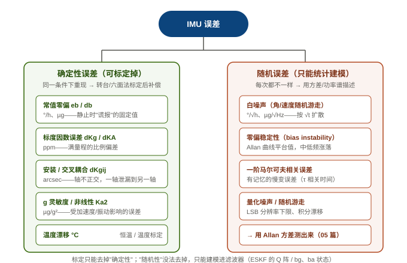
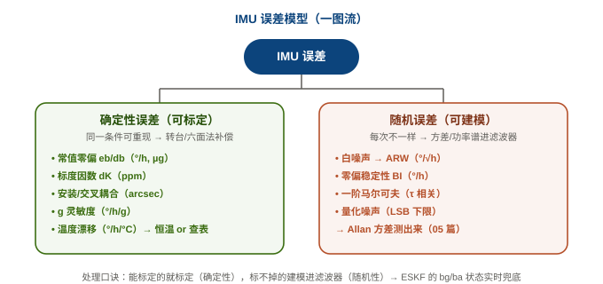

# 04 IMU 误差模型：零偏 / 标度 / 交叉耦合 / g 灵敏度 / 温度漂移

> 系列定位：**M1 基础 · 传感器模型**。上一篇 [03 传感器原理](03_传感器原理.md) 讲了 IMU"测什么"（比力、角速度），还给了误差单位速查表。这一篇回答：**误差从哪来、怎么建数学模型、怎么标定、怎么进 ESKF**。下一篇 [05 Allan 方差](05_Allan方差.md) 教你怎么把这些参数"测出来"。

---

## 一、总览：IMU 误差的两种来源

所有误差分两大类，处理手段完全不同：



| 类别        | 特点           | 处理方式                  | 例子                            |
| --------- | ------------ | --------------------- | ----------------------------- |
| **确定性误差** | 同一条件下**可重现** | **标定**后补偿（减掉/除掉）      | 常值零偏、标度因数、安装误差、g 灵敏度、温度漂移、非线性 |
| **随机误差**  | 每次都不一样       | **统计建模**（方差/功率谱），进滤波器 | 白噪声、零偏稳定性、马尔可夫、量化噪声           |

> **核心思想**：能标定的就标定（确定性），标不掉的建模进滤波器（随机性）。ESKF 里的 `bg/ba` 状态就是"边飞边估零偏"——把标定没标干净的零偏当状态量实时估计。这就是为什么 15 态 ESKF 要留 6 个维度给零偏。

---
---





## 二、常值零偏（Bias）

### 1. 物理机制

理想情况下，静止的陀螺应输出 0、加计应输出 1g。但实际上芯片存在**固定的输出偏差**：

- 陀螺零偏 `eb`：静止时陀螺输出的"假角速度"（单位 °/h）
- 加计零偏 `db`：静止时加计输出的"假比力"（单位 µg，1µg ≈ 9.8e-6 m/s²）

来源：MEMS 结构不对称（制造误差）、残余应力、电路失调电压。**同一颗芯片在同一温度下，这个偏差基本是常数**——所以叫"常值零偏"。

### 2. 数学模型

$\tilde{\boldsymbol\omega} = \boldsymbol\omega + \boldsymbol b_g + \boldsymbol n_g,\qquad \tilde{\boldsymbol f} = \boldsymbol f + \boldsymbol b_a + \boldsymbol n_a$

其中 $\tilde{(\cdot)}$ 表示测量值，$\boldsymbol b_g/\boldsymbol b_a$ 为常值零偏，$\boldsymbol n_g/\boldsymbol n_a$ 为随机噪声（见第七节）。

### 3. 对导航的影响

零偏是最致命的误差：

- 陀螺零偏 $b_g$ → 姿态误差 **线性增长**：$\delta\theta(t) = b_g \cdot t$
- 加计零偏 $b_a$ → 速度误差线性增长、位置误差**二次方增长**：$\delta p(t) = \tfrac12 b_a t^2$

**算笔账**：一个 0.01 °/h 的陀螺（惯性级），10 分钟后姿态漂 $0.0017°$，1 小时后 $0.01°$——单看很小，但配上随机游走和积分误差，纯惯导 1 小时漂几度到几十度很正常。

### 4. 标定方法（确定性部分）

- **静止求平均**：把 IMU 静止放置，输出求平均即得零偏（陀螺静止输出=零偏；加计静止输出=1g+零偏，减 1g 即得）。
- **六面法**：加计零偏需要**翻转**（正放/反放 1g 反向）才能分离零偏与标度因数（见第五节）。

### 5. 怎么进 ESKF（本项目真实代码）

零偏不能只靠一次标定——温度、老化都会让它变。所以 ESKF 把零偏设为**状态变量实时估计**：

```c
// ins_eskf_15d.c —— 误差状态 15 维: [dp dv dθ dba dbg]
// ① 量测前先把估计的零偏从原始测量里去掉：
for (i = 0; i < 3; i++) { ou[i] = gyro[i] - e->nom.bg[i]; au[i] = accel[i] - e->nom.ba[i]; }

// ② 误差传播：δθ̇ = −δbg（零偏直接"喂"进姿态误差）
/* F(θ,bg)@6:8,12:14 = -I   δθ̇=−δbg */

// ③ 更新后把误差叠加回名义状态：
e->nom.ba[i] += dx[9 + i];
e->nom.bg[i] += dx[12 + i];
```

> 这就是"**误差状态卡尔曼**"的精髓：不直接估计姿态/位置，而是估计"误差"，零偏误差 $\delta b_g$ 被量测（加速度计/磁力计/GNSS）激励出来，再反馈修正 $b_g$。所以**量测越丰富，零偏估计越准**——这也是为什么纯陀螺积分会漂、而 ESKF 能收敛。

---

## 三、标度因数误差（Scale Factor）

### 1. 物理机制

芯片输出与真实物理量之间差一个**比例系数**。理想的换算系数在 datasheet 里有标称值（如 BMI088 陀螺 1000dps 档 0.000532632 rad/s/LSB），但实际芯片的增益与标称有偏差。

### 2. 数学模型

$\tilde{\boldsymbol\omega} = (1 + s_g)\boldsymbol\omega,\qquad s_g \approx \frac{\Delta \text{增益}}{\text{标称增益}}$

单位 **ppm**（百万分之一）：$s_g = 1000\,\text{ppm}$ 表示满量程的 0.1% 偏差。

### 3. 影响与标定

- **影响**：误差与输入量**成正比**——静止时没感觉（输入≈0），机动越猛错得越多。比如 1000°/s 量程、1000ppm 标度误差 → 满量程时角速度误差 1°/s。
- **标定**：陀螺用**速率转台**（已知角速度，对比输出）；加计用**六面法**（已知 1g，正反两个方向读数差分离零偏与标度）：

$\text{标度因数误差} = \frac{\text{正向读数} - \text{反向读数}}{2g} - 1$

??? note "📐 折叠：六面法为什么能同时标零偏和标度"

    假设加计实际模型 $\tilde f = (1+s)f + b$（忽略其他误差）：
    
    - 正向（+z 朝上）：$\tilde f_+ = (1+s)(+g) + b = g + sg + b$
    - 反向（−z 朝上）：$\tilde f_- = (1+s)(-g) + b = -g - sg + b$
    
    两式相加：$\tilde f_+ + \tilde f_- = 2b \Rightarrow b = \tfrac12(\tilde f_+ + \tilde f_-)$（**零偏**）  
    两式相减：$\tilde f_+ - \tilde f_- = 2g(1+s) \Rightarrow s = \tfrac{\tilde f_+ - \tilde f_-}{2g} - 1$（**标度**）
    
    这就是"正反两个方向"的原因——一个方向解不开两个未知数。

---

## 四、安装误差 / 交叉耦合（Misalignment / Cross-axis）

### 1. 物理机制

三轴加速度计/陀螺的敏感轴**不可能完美正交**：芯片贴装偏了、MEMS 结构本身三轴不正交。后果：**一个轴的转动/加速度会"泄漏"到另一个轴**。

### 2. 数学模型

测量值 = 真实值 × 耦合矩阵（对角为 1，非对角为小角度误差，单位 arcsec，1°=3600″）：

$\tilde{\boldsymbol\omega} = \begin{pmatrix} 1 & m_{xy} & m_{xz} \\ m_{yx} & 1 & m_{yz} \\ m_{zx} & m_{zy} & 1 \end{pmatrix}\boldsymbol\omega$

对应 PSINS 的 `dKg`/`dKa` 非对角项（`dKGij`，arcsec）。比如绕 x 轴转 100°/s，若 $m_{yx}=100''$，则 y 轴会"看到" $100 \times \sin(100'') \approx 0.048°/s$ 的假信号。

### 3. 标定

同样用**六面法/速率转台**：让每个轴单独运动，观察其他轴的"串扰"，反解耦合矩阵。

### 4. 与 ESKF 的关系

安装误差是**固定常数**，标定后即可补偿，**一般不进 ESKF 状态**（否则状态维度爆炸）。但标定残差会变成等效零偏/噪声，被 `bg/ba` 吸收——所以 ESKF 的零偏估计也能"兜住"没标干净的安装误差。

---

## 五、g 灵敏度（g-sensitivity / VRE）

### 1. 物理机制

**陀螺**在受加速度（尤其是振动）时，输出会偏离真实角速度——这是 MEMS 陀螺最讨厌的误差之一。根源：

- **质量不平衡**：驱动质量块与感测结构的质心不完全重合，加速度产生力矩串入感测轴。
- **振动整流（vibration rectification）**：高频振动经非线性环节整流成直流误差——"越震越漂"。

单位：°/h/g（每 g 加速度产生多少角速度零偏）。

### 2. 数学模型（PSINS 的做法）

PSINS `imuadderr` 里 g 灵敏度直接建模为"陀螺零偏受加计测量调制"：

```matlab
% PSINS: base/imu/imuadderr.m — Gongmin Yan, NWPU (psins260705)
if isfield(imuerr, 'gSens')
    drift(:,1:3) = drift(:,1:3) + imu(:,4:6)*imuerr.gSens';   % 陀螺误差 += 加速度 × gSens
end
```

即 $\delta\boldsymbol\omega = \boldsymbol S_g\,\boldsymbol f$，其中 $\boldsymbol S_g$ 是 **3×3 g 灵敏度矩阵**（每一行：该陀螺轴受三个方向加速度的影响；对角为主灵敏度、非对角为交叉灵敏度）。上面简写成 $\text{diag}(\boldsymbol f)\,\boldsymbol s_g$ 是为了直观展示"每轴受自己方向加速度调制"。

### 3. 影响与对策

- **影响**：载体振动越大，陀螺零偏越不稳定——对无人机/车辆这类振动环境是实打实的威胁。ESKF 里它表现为"零偏被振动污染"，`bg` 估计会抖动。
- **对策**：① 硬件减振（隔振安装）；② 标定测出 g 灵敏度并在补偿模型里去掉；③ 滤波（振动频段的信号被带宽限制滤掉）。

---

## 六、温度漂移（Temperature Drift）

### 1. 物理机制

MEMS 的机械结构、电路、材料特性都随温度变化：弹性模量变、应力变、基准电压漂。所以**零偏、标度、g 灵敏度都是温度的函数**——datasheet 里通常给"零偏温度系数"（如 ±0.5 °/h/°C）。

### 2. 两种对策（工程上必须选一种）

**方案 A：恒温控制（本项目采用）** —— 从源头把温度摁住，让传感器永远工作在同一个温度点，温度漂移自然消失。本项目用三路 NTC + Steinhart-Hart + PID 加热：

```c
// ins_thermal.h —— 恒温子系统配置（真实代码）
// 三路 NTC 测温: NTC_IMU(中心, PID主反馈) / NTC_EDGE(边界) / NTC_BARO(气压计)
// 加热: PD14/TIM4_CH3 ~1kHz PWM → MOSFET 栅极;  PC1 加热供电使能
float target_c;   // 控温目标 (℃), 建议 40~50
float kp, ki, kd; // PID 增益
```

```c
// ins_thermal.c —— Steinhart-Hart (B 参数简化式) 反算温度
float invT = 1.0f / 298.15f + (1.0f / c->beta[i]) * logf(r / c->r25[i]);
```

**方案 B：温度标定（PSINS 的做法）** —— 建温度-零偏曲线，运行时查表补偿。PSINS 有 `imutclbt.m`（温度标定）和 `clbt*.m`（六面法温度系列标定）。

### 3. 为什么本项目选恒温而不是查表

- 查表需要**温箱逐点标定**（设备贵、耗时长），且标定曲线会随老化失效；
- 恒温把"温度变量"直接消掉，**一次设定终身受益**，代价是功耗（加热功率）和启动时间（等升温）；
- 恒温 PID 的目标 40~50℃ 高于环境温度上限，保证任何工况都能稳定控温。

> 这也解释了为什么本板要花一路 TIM + ADC + 功率管在"加热"上——**在 MEMS 精度预算里，温度漂移往往比标度误差更致命**。

---

## 七、随机误差：白噪声 → 随机游走 {#random-walk}

### 1. 白噪声与角随机游走（ARW）

除了确定性误差，陀螺/加计输出还叠加**随机噪声**。它无法预测、无法标定，只能用统计量描述。连续积分后：

$\delta\theta(t) = \int_0^t n_g(\tau)d\tau \sim \mathcal{N}(0,\ \sigma_{ARW}^2 \cdot t)$

**角随机游走（ARW）** $\sigma_{ARW}$ 单位 °/√h：姿态误差的标准差按 $\sqrt{t}$ 扩散（醉汉走路，见 03 篇折叠）。

### 2. 零偏稳定性（Bias Instability）与一阶马尔可夫

- **零偏稳定性**：零偏不是完全恒定，而是在某均值附近慢变（温度残余、1/f 噪声）。Allan 方差曲线的"平台值"就是它。
- **一阶马尔可夫**：有记忆的慢变误差，PSINS 用 `sqg/taug`（标准差+相关时间）建模，`imuadderr` 里通过 `markov1` 生成：

```matlab
% PSINS: base/imu/imuadderr.m —— 马尔可夫相关误差
mvg = markov1(imuerr.sqg.*sqrt(imuerr.taug/2), imuerr.taug, ts, m);
drift(:,1:3) = drift(:,1:3) + mvg*ts;
```

### 3. 误差怎么进 ESKF 的 Q 阵

白噪声进**过程噪声 Q**，零偏的慢变进 **bg/ba 状态的驱动噪声**（相当于给零偏加一个很小的随机游走，让滤波器允许零偏缓慢变化）。ESKF 里对应的就是 `Q` 矩阵的 `bg/ba` 对角块。

### 4. 零偏 vs 随机游走：谁主导？

短时间（< t₀）随机游走主导（√t 长得快），长时间（> t₀）零偏主导（线性无封顶）。**t₀ 就是 Allan 方差曲线的最低点**——见 [05 Allan 方差](05_Allan方差.md)。

---

## 八、PSINS 演示：imuadderr（完整误差施加）

> 把"误差模型"变成"能跑的数据"：PSINS 的 `imuadderr` 把 `imuerrset` 定义的误差施加到理想 IMU 数据上，生成带误差的仿真数据——**这正是我们验证管线（verification/）生成"带病数据"的参考**。

**① PSINS 参考实现（MATLAB）**

```matlab
% PSINS: base/imu/imuadderr.m — Gongmin Yan, NWPU (psins260705)
% 完整误差施加模型: imu = K*imu + drift
% ① 零偏 + 随机游走（常值 + 白噪声）：
drift = [ ts*imuerr.eb(1) + sts*imuerr.web(1)*randn(m,1), ...   % sts = sqrt(ts)
          ts*imuerr.db(1) + sts*imuerr.wdb(1)*randn(m,1), ... ];
% ② 马尔可夫相关误差（有记忆的慢变）：
mvg = markov1(imuerr.sqg.*sqrt(imuerr.taug/2), imuerr.taug, ts, m);
% ③ 二次非线性 Ka2（加计）：
imu(:,4:6) = [ imu(:,4)+imuerr.Ka2(1)/ts*imu(:,4).^2, ... ];
% ④ g 灵敏度（陀螺零偏受加速度调制）：
drift(:,1:3) = drift(:,1:3) + imu(:,4:6)*imuerr.gSens';
% ⑤ 标度因数/安装误差（耦合矩阵）：
Kg = eye(3)+imuerr.dKg; Ka = eye(3)+imuerr.dKa;
imu(:,1:6) = [imu(:,1:3)*Kg', imu(:,4:6)*Ka'];
```

**② 本项目 C 语言实现（`ins_eskf_15d.c`）**

```c
// 固件侧"误差模型"体现在两处：
// ① 去零偏（把估计的零偏从测量中减掉，等价于 imuadderr 的逆操作）：
ou[i] = gyro[i] - e->nom.bg[i];   au[i] = accel[i] - e->nom.ba[i];
// ② 量程→LSB 换算表（标度因数的"标称值"）：
[BMI088_GYRO_RANGE_1000DPS] = 0.000532632f,   // rad/s per LSB
```

**③ 结论**

PSINS 的 `imuadderr` 是"误差→数据"的正向通道，固件的 ESKF 是"数据→误差估计"的逆向通道：标定去掉确定性部分，滤波器吃掉剩余随机部分。**`imuerrset` + `imuadderr` 组合可用于 verification/ 里生成"带已知误差的仿真数据"，反推滤波器能否正确估计出这些误差**——这是 05 篇 Allan 之外的又一重验证手段。

---

## 九、常见坑清单

1. **只标零偏不标标度**：静止标定只能分离零偏，标度误差要正反方向/转台才能标（见六面法折叠）。
2. **把零偏当随机噪声**：零偏是确定性（线性漂移），随机游走是随机性（√t 漂移），处理方式完全不同——前者要标定/状态估计，后者只能进 Q 阵。
3. **忽略 g 灵敏度**：振动环境下陀螺零偏"莫名其妙"变化，八成是 g 灵敏度在作怪，不是滤波器坏了。
4. **温度当不存在**：MEMS 温漂可能比标度误差还大；要么恒温（本项目），要么建温度曲线，不能裸奔。
5. **标定曲线当永久有效**：老化会改变零偏，所以 ESKF 里仍然留了 bg/ba 状态兜底——标定不是一劳永逸。
6. **量程与 LSB 混用**：量程决定 LSB 大小（量化噪声下限），量程越大噪声越大，选量程要覆盖应用又不过分。

---

## 十、自测题

1. IMU 误差分哪两大类？各自的处理方式是什么？
2. 写出含零偏和噪声的陀螺/加计测量模型。
3. 六面法为什么需要正反两个方向？零偏和标度怎么从两个读数分离？
4. g 灵敏度的物理来源是什么？对振动环境有什么影响？
5. 本项目用什么方案对抗温度漂移？为什么不用查表方案？
6. 角随机游走（ARW）的误差随时间怎么扩散？和零偏有什么本质区别？
7. `imuadderr` 的 `drift` 里 `ts*eb + sqrt(ts)*web*randn` 分别代表什么？

??? note "📐 参考答案"

    1. 确定性（可重现，标定补偿）与随机性（不可预测，统计建模进滤波器）。
    2. $\tilde\omega = \omega + b_g + n_g$，$\tilde f = f + b_a + n_a$。
    3. 一个方向解不开两个未知数；相加得零偏 $b=(f_++f_-)/2$，相减得标度 $s=(f_+-f_-)/(2g)-1$。
    4. 质量不平衡 + 振动整流；振动越大陀螺零偏越漂，`bg` 估计抖动。
    5. 恒温 PID（三路 NTC + 加热 PWM，目标 40~50℃）；查表需要温箱逐点标定、且曲线随老化失效，恒温一次设定终身受益。
    6. 按 $\sqrt{t}$ 扩散（随机性），零偏按 $t$ 线性扩散（确定性）；短时随机游走主导、长时零偏主导，交点是 Allan 最低点。
    7. `ts*eb` = 常值零偏在采样间隔内的增量；`sqrt(ts)*web*randn` = 白噪声经积分后的随机游走增量（方差 ∝ t）。

---

## 关联与延伸

- 上一篇：[03 传感器原理](03_传感器原理.md)（比力 / 角速度 / 误差单位速查）
- 下一篇：[05 Allan 方差](05_Allan方差.md) —— 5 种噪声指纹（QN·ARW·BI·RRW·RR）、读 log-log 曲线、从实测数据"测出"本节所有随机参数、定 ESKF 的 Q 阵
- 数学地基：[矩阵、概率与协方差](../数学基础.md)（随机过程、方差、协方差）
- 外链：[维基 · 卡尔曼滤波](https://zh.wikipedia.org/wiki/卡尔曼滤波) · [维基 · Allan 方差](https://zh.wikipedia.org/wiki/艾伦方差) · [维基 · 加速度计](https://zh.wikipedia.org/wiki/加速度计)
- 项目落地：[AHRS 板固件仿真与验证](../../工作与项目/AHRS板固件仿真与验证/)（`ins_eskf_15d.c` / `ins_thermal.h` 真实实现）
- 系列首页：[惯性导航与惯导解算 · 自学科普系列](../index.md)
