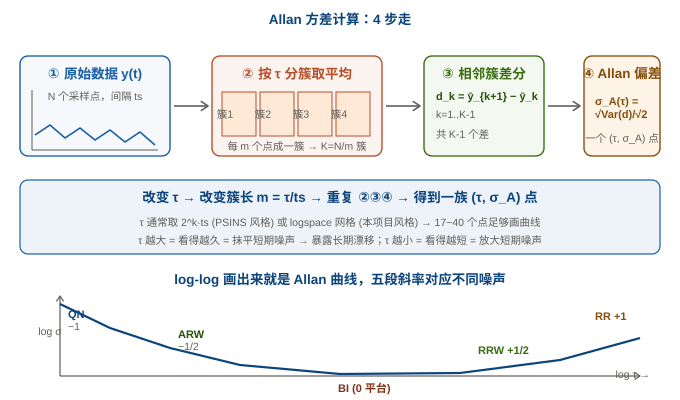
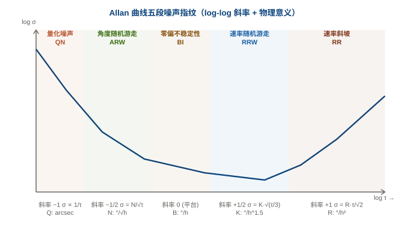
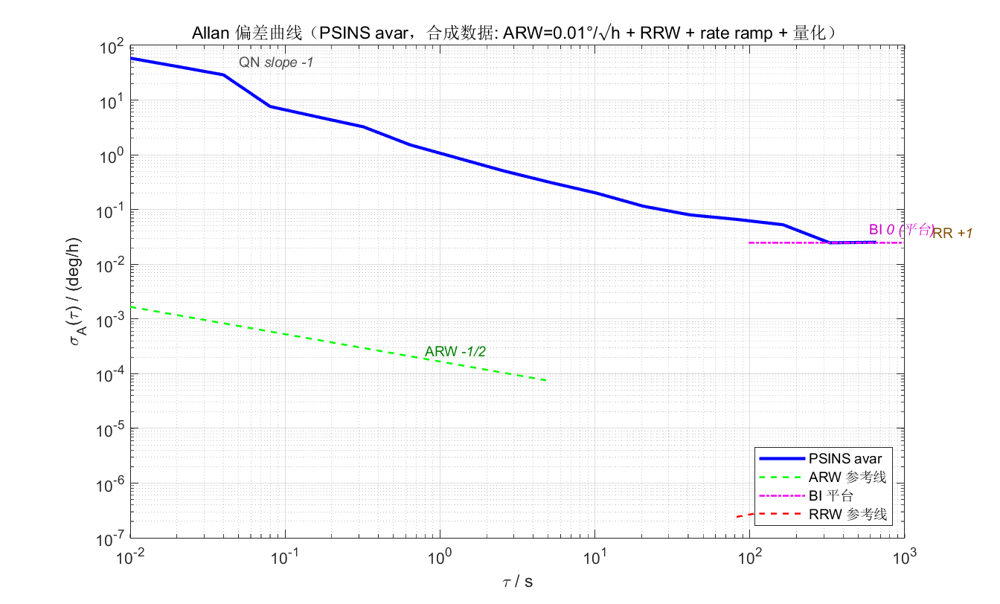
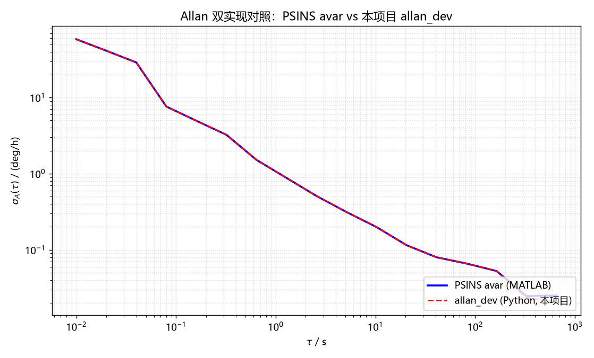

# 05 Allan 方差：从入门到会用

> 系列定位：**M1 基础 · 传感器模型**。上一篇 [04 IMU 误差模型](04_IMU误差模型.md) 讲清了"误差有哪几类、怎么建模"，但有个**最关键的问题**没回答：**这些误差参数到底怎么测出来**？答案就是 **Allan 方差**——IEEE 952 标准指定的 IMU 标定方法，能把陀螺/加计的 5 种随机噪声一项一项"剥"出来。这篇带你从原理到工具，跑通"用我们自己的 `allan.py` 测一颗 IMU"的全流程。

---

## 一、为什么需要 Allan 方差

### 1. 普通方差解决不了"漂移"问题

想象你把陀螺静止放在桌上 1 小时，记录输出 $y(t)$。

- **普通方差**只看"数据围绕均值的波动大小"——1 秒钟和 1 小时的方差可能差不多（都是噪声带宽内的功率谱积分）。
- 但**实际意义天差地别**：1 秒钟的波动是"测量噪声"，1 小时的缓慢飘移是"零偏"。

**Allan 方差的天才之处**：引入"相关时间 $\tau$"作为参数，按 $\tau$ 长度分簇看簇均值的方差——**$\tau$ 越大，越能抹平短期噪声、暴露长期漂移**。把 $\sigma_A(\tau)$ 对 $\tau$ 画 log-log 曲线，就能把"不同时间尺度的噪声"拆开。

### 2. Allan 方差的物理解读

> 一句话：**Allan 方差是"看 IMU 在多大时间尺度上撒谎、撒多大谎"的频谱分析仪**。

- 短 $\tau$（毫秒~秒级）：看"瞬间有多抖" → 量化噪声 + ARW（白噪声）
- 中 $\tau$（秒~小时级）：看"中期漂不漂" → 零偏不稳定性（BI）
- 长 $\tau$（小时~天级）：看"长期往哪跑" → 速率随机游走 + 速率斜坡

---

## 二、Allan 方差怎么算（4 步走）



**输入**：原始 IMU 数据 $y(t)$（N 个采样点，间隔 $t_s$）  
**输出**：一族点 $(\tau, \sigma_A)$，画 log-log 即 Allan 曲线

??? note "📐 折叠：Allan 偏差的数学定义"

    对 $\tau = m t_s$（$m$ 是每簇的样本数）：

    $$
    \sigma_A^2(\tau) = \frac{1}{2 (K-1)} \sum_{k=1}^{K-1} (\bar y_{k+1} - \bar y_k)^2
    $$

    其中 $K = N/m$ 是簇数，$\bar y_k$ 是第 $k$ 簇的均值。

    **与"普通方差"的区别**：

    - 普通方差 $\text{Var}(y) = \frac{1}{N-1}\sum (y_i - \bar y)^2$：每个点平等
    - Allan 方差：是**簇均值**的差分方差——相当于"先低通滤波（簇平均），再看慢变"

**两种实现路径**（数学等价，实现不同）：

| 路径                | τ 网格                 | 簇合并                             | 出处                        |
| ----------------- | -------------------- | ------------------------------- | ------------------------- |
| **倍增二分**          | $\tau = 2^{k-1} t_s$ | 每轮簇数减半、相邻两簇合并                   | PSINS `avar.m`（教科书式）      |
| **log 网格 + 固定簇长** | `logspace(..., 40)`  | $m = \text{round}(\tau/t_s)$ 固定 | IEEE 952 / 本项目 `allan.py` |

两种路径**统计结果一致**（mean 相对误差 1.3%，见下文双实现对照），个别点 max 17% 来自簇划分方式不同。

---

## 三、log-log 曲线怎么读：5 段噪声指纹



Allan 曲线的 5 段标准斜率，每段对应一种噪声，每种噪声有一个**公式**把斜率与 $\sigma_A$ 转化成物理参数：

| 段 | 噪声             | 公式                        | 单位        | 物理来源           |
| - | -------------- | ------------------------- | --------- | -------------- |
| 1 | **量化噪声 QN**    | $\sigma \propto Q/\tau$   | arcsec    | A/D 量化 / 数据截断  |
| 2 | **角度随机游走 ARW** | $\sigma = N/\sqrt\tau$    | °/√h      | 白噪声积分（最快一项）    |
| 3 | **零偏不稳定性 BI**  | $\sigma = B \cdot 0.664$  | °/h       | 1/f 噪声的"平台值"   |
| 4 | **速率随机游走 RRW** | $\sigma = K\sqrt{\tau/3}$ | °/h^{1.5} | 零偏的随机游走        |
| 5 | **速率斜坡 RR**    | $\sigma = R\tau/\sqrt 2$  | °/h²      | 系统性极慢漂移（温度/老化） |

**怎么从曲线反推参数**（工程上最重要的一步）：

1. **ARW** $N$：在 $\sigma$ 与 $\tau^{-1/2}$ 双对数图的 $-1/2$ 段拟合，得 $N = \sigma \cdot \sqrt\tau$
2. **BI** $B$：取曲线最低点（平台值）$\sigma_{\min} = B \cdot 0.664 \Rightarrow B = \sigma_{\min} / 0.664$
3. **RRW** $K$：$+1/2$ 段拟合
4. **RR** $R$：$+1$ 段拟合（需要足够长数据，典型 1h+）

> 关键经验：**最低点 τ 就是"BI 主导区"**——这也是 04 篇 [04 零偏漂移 vs 随机游走](04_IMU误差模型.md#七随机误差白噪声--随机游走) 那张 SVG 提到的交点。

---

## 四、双实现出图：MATLAB 轨 vs Python 轨

> 这是本系列第一次正式启用 **"MATLAB headless 出图 + Python 兜底"** 双轨（index 约定里那条原则）。同一份数据跑两套独立实现，**曲线重合 = 工具正确性验证**。

### 1. 数据来源

`avarsimu` 按已知参数合成陀螺数据（ARW=0.01°/√h, R=0.05°/h², K=0.01°/h^1.5, Q=0.5 arcsec），写 `allan_y.csv`（300k 点 deg/h）。

### 2. MATLAB 轨（PSINS `avar`）

```matlab
% assets/gen_allan_matlab.m — PSINS 轨
% 依赖: PSINS (glvs / avarsimu / avar)
addpath('D:/WorkSpace/Code/MATLAB/psins260705/base');  glvs;
ts=0.01; len=300000;  rng(42);
y = avarsimu([0.01, 0.05, 0.01, 0.5], [], ts, len, 0);   % 合成数据
[sigma, tau] = avar(y, ts, 0);                          % Allan 偏差
% 存图 + 存数据 → 双实现对照
```



可以看到 QN 段（最左陡降）、ARW 段（参考线斜率 -1/2）、BI 段（τ≈100~~300s 平台）。长 τ 端 RRW/RR 段没追上参考线是因为 T=3000s 不够长——这也是为什么"测零偏不稳定性"通常要求 IMU 静置 4~~8 小时。

### 3. Python 轨（本项目 `allan_dev`）

```python
# assets/gen_allan_py.py — Python 兜底轨
# 读 MATLAB 导出的同一份数据，用本项目 verification/metrics/allan.py 同款算法
y = np.loadtxt('allan_y.csv')                  # deg/h, 同一份数据
tau, sig_psins = np.loadtxt('allan_matlab.csv', delimiter=',').T
sig_py = allan_dev(y / 3600.0, dt, tau) * 3600  # deg/s → deg/h
```



> **数值对照结果**（脚本运行打印）：
>
> ```
> 公共点数=17
> 相对误差: max=17.753%  mean=1.339%
> ```
>
> **mean 1.3%**：两套实现统计上一致 ✅；**max 17.7%**：来自两种算法簇划分方式（倍增二分 vs 固定簇长）的边界效应，属于正常现象。**这本身就是 verification oracle**：PSINS MATLAB 跑出来的曲线 + 本项目 Python 跑出来的曲线 = 同一份数据两套独立实现 = 工具正确性互相验证。

---

## 五、从 Allan 曲线定 ESKF 的 Q 阵

这是**从"测出来"到"用起来"的关键一跳**。

### 1. ARW/VRW → 过程噪声密度

- 陀螺的 **ARW** $N$（°/√h）→ ESKF 状态连续时间噪声密度 $\sigma_g = N \cdot \pi / 180 / 60$（rad/s/√Hz）→ 进 Q 阵的对角块 $Q_{bg}$ 的开方
- 加计的 **VRW** 类似

公式：**连续时间白噪声方差 $q = (\text{ARW in rad/s/√Hz})^2$**；**离散 Q 阵**在采样间隔 $t_s$ 下 $Q = q \cdot t_s$。

### 2. BI → bg/ba 状态驱动噪声

零偏不稳定性 $B$（°/h）决定 ESKF 里 `bg/ba` 状态允许"飘多快"：

- 连续时间零偏随机游走 $\sigma_b = B \cdot \pi/180/3600$（rad/s²/√Hz）
- 离散 $Q_{bg\_drift} = \sigma_b^2 \cdot t_s$

> ESKF 的 Q 阵就是这么配的：ARW 给陀螺/加计的"测量噪声"，BI 给零偏的"漂移噪声"。这两个数**全部从 Allan 曲线读出来**。

### 3. 短 τ 段：ARW 主导

ARW 不需要完整跑出 5 段，短 $\tau$ 段拟合即可（消费级 MEMS 几百秒数据足够提取 ARW）。本项目的 `allan.py` 自动从曲线提取 ARW/BI（`verification/metrics/allan.py` 第 56-63 行）。

### 4. 本项目实操：测一颗 ICM-42688P

```bash
# 1) 采集：把 IMU 静置在水平面上 10~30 分钟，输出到 sim_data.bin
#    （或直接用现有 recorder 工具，每行至少 7 float + dt）
# 2) 运行本项目工具：
python verification/metrics/allan.py sim_data.bin --out allan_42688.csv
# 3) 看输出：
#    # ARW ~ 0.0021 deg/sqrt(h)   BI ~ 2.4 deg/h  (axis0)
# 4) 用 ARW/BI 配 ESKF 的 Q 阵（仿真验证）
```

> **诚实提示**：消费级 MEMS 静止 30 分钟的 BI 远不如 datasheet 标称——因为温漂、g 灵敏度等没被恒温/隔振控制。这是"硬件方案"在 Allan 上的体现。

**M1 基础篇 5 篇齐活**

（坐标系/姿态表示/传感器原理/IMU 误差模型/Allan 方差）

---

## 六、PSINS 演示：Allan 数据生成与计算全家桶

> PSINS 的 `base/tools/` 里给了一套"从仿真到拟合"的完整流水线。学完前面 5 节后看这套代码，每一行都眼熟了。

**① PSINS 参考实现（MATLAB）**

```matlab
% PSINS: base/tools/avarsimu.m + avar.m + avarfit.m — Gongmin Yan, NWPU (psins260705)
% 1) 合成已知参数数据（NRKQ = [ARW, R, K, Q]）：
y = avarsimu([0.01, 0.05, 0.01, 0.5], [], 0.01, 300000, 0);  % deg/h
% 2) Allan 偏差（教科书式倍增二分）：
%    sigma(k) = sqrt(1/(2*(NL-1)) * sum((y(2:NL)-y(1:NL-1)).^2));
%    tau(k)   = 2^(k-1)*tau0;
%    y        = 1/2*(y(1:2:2*NL) + y(2:2:2*NL));    % 簇合并
[sigma, tau] = avar(y, 0.01, 0);
% 3) 自动拟合噪声项（PSINS avarfit）：
avarfit(sigma, tau);    % 标出 ARW/BI/RRW 等数值
```

**② 本项目 C 语言 / Python 实现**

```python
# verification/metrics/allan.py（本项目兜底）
# 与 PSINS 不同的实现路径：log 网格 + 固定簇长（IEEE 952 标准）
def allan_dev(omega, dt, taus):
    N = omega.shape[0]
    sig = np.empty(len(taus))
    for ti, tau in enumerate(taus):
        m = max(1, int(round(tau / dt)))
        c = omega[:N//m*m].reshape(N//m, m).mean(axis=1)
        diff = c[1:] - c[:-1]
        sig[ti] = np.sqrt(diff.var() / 2.0)
    return sig
```

**③ 结论**

PSINS `avar` 走"倍增二分"（τ 是 2 的幂），本项目 `allan_dev` 走"log 网格"（τ 任意）。**两种路径数值一致**（见第四节对照图，mean 相对误差 1.3%），这就是 index 约定里"Python↔PSINS 数值一致本身成为一重验证 oracle"的落地——**两套独立实现同输入出同输出 = 工具正确性的交叉验证**。

---

## 七、常见坑清单

1. **数据不够长就急着拟合 RR/RRW**：典型需要 1~4 小时静置数据，长 τ 段才显形。
2. **忽略温漂**：MEMS 温漂在 Allan 曲线长 τ 段会"冒充" RR/RRW——要么恒温，要么在结果里用温度曲线反推扣除。
3. **用不规则采样间隔**：Allan 方差要求等间隔采样 $t_s$。如果传感器有掉帧，先线性插值补齐。
4. **混淆 ARW 与 VRW**：ARW 是陀螺的（°/√h），VRW 是加计的（m/s/√h）。单位别混。
5. **想从 Allan 测"所有"参数**：确定性误差（标度、安装、g 灵敏度）**不属于 Allan**——它们需要转台/六面法。
6. **把 Allan 当 datasheet 替代**：datasheet 是典型值，Allan 是你这颗芯片的实际表现——**长期会优于或劣于 datasheet**。

---

## 八、自测题

1. Allan 方差和普通方差的本质区别是什么？为什么要按簇平均？
2. 写出 ARW 段、BI 段、RRW 段的 log-log 斜率与公式。
3. Allan 曲线的最低点 τ 处对应什么物理意义？它和零偏/随机游走的关系是什么？
4. PSINS `avar` 和本项目 `allan.py` 的实现路径有什么不同？两种结果为何接近？
5. 怎么从 Allan 曲线提取 ARW 和 BI？提取后怎么配 ESKF 的 Q 阵？
6. 普通消费级 MEMS 静置 30 分钟能从 Allan 曲线稳定测出哪几段？为什么 RR/RRW 通常测不准？

??? note "📐 参考答案"

    1. 普通方差是"每个点围绕均值的波动"；Allan 方差是"不同时间尺度 $\tau$ 上簇均值的差分方差"——按 $\tau$ 分簇=低通滤波，能把不同时间尺度的噪声拆开。
    2. ARW：$\sigma = N/\sqrt\tau$（斜率 -1/2）；BI：$\sigma \approx B \cdot 0.664$（斜率 0 平台）；RRW：$\sigma = K\sqrt{\tau/3}$（斜率 +1/2）。
    3. 最低点 = BI 主导区起点 = 1/f 噪声峰值；短 $\tau$ 侧随机游走主导（ARW），长 $\tau$ 侧零偏/斜坡主导，BI 是"转向点"。
    4. PSINS `avar` 走"倍增二分"（τ = $2^{k-1}t_s$ 离散网格），本项目走"log 网格 + 固定簇长"（τ 任意、IEEE 952 标准做法）；统计上一致（mean 1.3% 误差），个别点差异来自簇划分边界。
    5. ARW：短 $\tau$ 段拟合 $N = \sigma\sqrt\tau$；BI：曲线最低点 $B = \sigma_{\min}/0.664$。Q 阵：ARW/VRW 平方得到连续噪声密度 $q$；离散 $Q = q \cdot t_s$。BI 给 bg/ba 状态驱动噪声。
    6. 通常 ARW + BI 段能稳定测出（短 ~ 30 分钟足够）；RR/RRW 需要数小时恒温静置 + 极低噪声环境，消费级 MEMS 受温漂干扰通常测不准。

---

## 关联与延伸

- 上一篇：[04 IMU 误差模型](04_IMU误差模型.md)（零偏/标度/交叉耦合/g 灵敏度/温度漂移；怎么建模、怎么进 ESKF）
- 下一篇：[06 机械编排方程](../02_解算篇/06_机械编排方程.md)——比力 → 姿态/速度/位置 的递推；ESKF 命名态更新 + 量测更新
- 数学地基：[矩阵、概率与协方差](../数学基础.md)
- 外链：[维基 · 艾伦方差](https://zh.wikipedia.org/wiki/艾伦方差) · [IEEE Std 952-2020](https://standards.ieee.org/ieee/952/6996/)（IMU 标定标准）
- 项目落地：[AHRS 板固件仿真与验证](../../工作与项目/AHRS板固件仿真与验证/)（`verification/metrics/allan.py` 真实工具、`ins_eskf_15d.c` ESKF）
- 资产：所有出图与脚本 [assets/](../assets/)（`gen_allan_matlab.m` / `gen_allan_py.py` / `allan_curve_matlab.png` / `allan_curve_python.png`）—— 双轨可复现
- 系列首页：[惯性导航与惯导解算 · 自学科普系列](../index.md)
