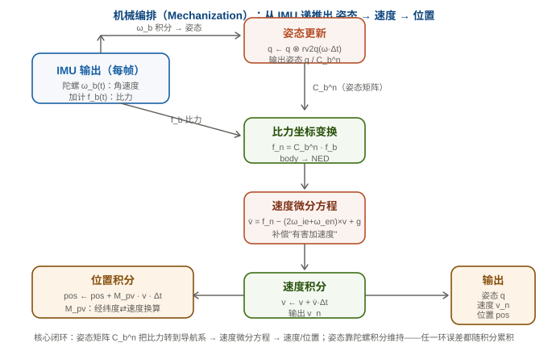
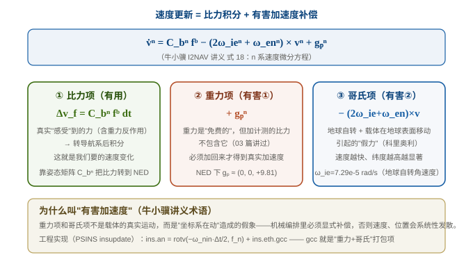

# 06 机械编排方程：比力 → 姿态 / 速度 / 位置

> 系列定位：**M2 解算篇 · 第一篇**。M1 基础篇（[01](../01_基础篇/01_坐标系与变换.md)~[05](../01_基础篇/05_Allan方差.md)）回答"姿态怎么表示、传感器测什么、误差怎么建模"。这一篇进入正题：**拿到每帧 IMU 数据后，怎么递推出姿态、速度、位置**——这就是**机械编排（mechanization）**，也叫惯导解算/力学编排。
>
> **参考体系**：本系列机械编排部分同时参考两个权威——**PSINS**（严龚敏，代码级对照）与 **牛小骥 I2NAV 组合导航讲义**（武汉大学，公式级佐证）。牛小骥讲义的速度微分方程推导（式 18）是业界公认的标准表述，本篇核心公式即锚定它。

📚 **牛小骥 I2NAV 讲义 PDF（在线预览）**：本系列涉及的 5 讲已收录到 [assets/I2NAV组合导航讲义/](../assets/I2NAV组合导航讲义/)，可直接在线阅读：

- [第 1 讲 · 惯性导航姿态算法](../assets/I2NAV组合导航讲义/1-惯性导航姿态算法.pdf)（07 篇姿态更新参考）
- [第 2 讲 · 惯性导航速度和位置算法](../assets/I2NAV组合导航讲义/2-惯性导航速度和位置算法.pdf)（**本篇核心参考，式 18/19**）
- [第 3 讲 · 惯性导航误差传播分析](../assets/I2NAV组合导航讲义/3-惯性导航误差传播分析.pdf)（09 篇参考）
- [第 4/5 讲 · GNSS 松/紧组合](../assets/I2NAV组合导航讲义/4-GNSS、INS松组合算法设计.pdf)（M3 组合导航参考）

---

## 一、机械编排总览

> 先解释这个词："**编排**（mechanization）"来自"机构化/机械化"——把连续时间的物理微分方程，**编排**成计算机能逐帧执行的递推程序。它不产生新物理，只是"把方程翻译成代码"。所以读本篇的姿势是：**每条公式问一句"离散后代码怎么写"**。



一句话：**陀螺积分出姿态，姿态把比力转到导航系，比力积分出速度，速度积分出位置**。四个环节环环相扣，任一环节的误差都会随积分累积——这就是为什么"纯惯导必发散"（09 篇详解）。

本篇按顺序推导三个微分方程：

| 环节 | 微分方程 | 输入 | 输出 |
|---|---|---|---|
| ① 姿态 | $\dot{\boldsymbol q} = \tfrac12\boldsymbol q\otimes\boldsymbol\omega$ | 陀螺 $\boldsymbol\omega_b$ | 姿态 $\boldsymbol q / \boldsymbol C_b^n$ |
| ② 速度 | $\dot{\boldsymbol v}^n = \boldsymbol C_b^n\boldsymbol f^b - (2\boldsymbol\omega_{ie}^n+\boldsymbol\omega_{en}^n)\times\boldsymbol v^n + \boldsymbol g_p^n$ | 加计 $\boldsymbol f_b$ + 姿态 | 速度 $\boldsymbol v^n$ |
| ③ 位置 | $\dot{\boldsymbol p} = \boldsymbol M_{pv}\boldsymbol v^n$ | 速度 | 位置（经纬高） |

> 完整推导：姿态微分在 [02](../01_基础篇/02_姿态的四种表示.md) 已铺垫（旋转向量→四元数右乘），本篇重点推导**速度微分方程**（最复杂、也最体现"机械编排"精髓），位置方程作为速度的积分给出。

---

## 二、符号体系（先立规矩）

> 牛小骥讲义的符号定义是业内最清晰的，直接采用：

- **上标/下标约定**：$\boldsymbol v^n$ 表示速度在 **n 系（导航系）投影**；$\boldsymbol f^b$ 表示比力在 **b 系（机体系）投影**
- $\boldsymbol C_b^n$：**b 系 → n 系的姿态矩阵**（把 body 向量转到 NED）
- $\boldsymbol\omega_{ie}$：**地球自转角速度**（i 惯性系 → e 地球系），常量 ≈ 7.29e-5 rad/s
- $\boldsymbol\omega_{en}$：**导航系相对地球的旋转**（载体在地球表面移动引起），$\boldsymbol\omega_{in} = \boldsymbol\omega_{ie} + \boldsymbol\omega_{en}$ 是"导航系相对惯性系的旋转"

---

## 三、预备：哥氏定理（向量在不同坐标系下的导数）

> 机械编排推导的"第一块基石"：同一个向量，在不同坐标系里看它的"变化率"是不一样的——因为坐标系本身在转。

$$\frac{d\boldsymbol r}{dt}\bigg|_a = \frac{d\boldsymbol r}{dt}\bigg|_b + \boldsymbol\omega_{ab}\times\boldsymbol r$$

其中 $\boldsymbol\omega_{ab}$ 是 b 系相对 a 系的角速度。直觉：你在旋转木马上看一支箭，和你站在地上看同一支箭，它的"方向变化率"差一个转动项。

<details>
<summary>📐 折叠：哥氏定理的直觉证明（旋转坐标系求导）</summary>

设 b 系相对 a 系以角速度 $\boldsymbol\omega_{ab}$ 旋转，向量 $\boldsymbol r$ 在 b 系分量为 $\boldsymbol r^b = (x,y,z)$，基向量 $\hat{\boldsymbol e}_i$ 也在转：

$$\frac{d\boldsymbol r}{dt}\bigg|_a = \sum_i \dot x_i\hat{\boldsymbol e}_i + \sum_i x_i \dot{\hat{\boldsymbol e}}_i = \frac{d\boldsymbol r}{dt}\bigg|_b + \boldsymbol\omega_{ab}\times\boldsymbol r$$

第二项就是"基向量在转"带来的修正。$\square$

</details>

**这正是"有害加速度"的数学来源**：速度在导航系求导 ≠ 在惯性系求导，差出的哥氏项必须显式补偿。

---

## 四、n 系速度微分方程（本篇核心）

### 1. 从牛顿定律出发

载体的**绝对加速度**（惯性系下位置二阶导）由牛顿第二定律 + 比力方程给出（03 篇讲过）：

$$\frac{d^2\boldsymbol r}{dt^2}\bigg|_i = \boldsymbol f + \boldsymbol g$$

其中 $\boldsymbol f$ 是加速度计测的比力，$\boldsymbol g$ 是重力加速度（严格说是引力）。

### 2. 逐步转换到 n 系

用哥氏定理把"惯性系导数"一步步换成"导航系导数"：

| 步骤 | 结果 |
|---|---|
| i 系 → e 系 | $\dot{\boldsymbol v}^e = \dot{\boldsymbol v}^i - \boldsymbol\omega_{ie}\times\boldsymbol v$ |
| e 系 → n 系 | $\dot{\boldsymbol v}^n = \dot{\boldsymbol v}^e - \boldsymbol\omega_{en}\times\boldsymbol v$ |

代入整理，得到 **n 系速度微分方程**：

$$
\boxed{\;\dot{\boldsymbol v}^n = \boldsymbol C_b^n\boldsymbol f^b - (2\boldsymbol\omega_{ie}^n + \boldsymbol\omega_{en}^n)\times\boldsymbol v^n + \boldsymbol g_p^n\;}
$$

> **牛小骥 I2NAV 讲义（武汉大学，2021）式 (18)** 原文即此式。它是整个惯导速度解算的"宪法"。

### 3. 三项的物理含义



| 项 | 含义 | 类型 |
|---|---|---|
| $\boldsymbol C_b^n\boldsymbol f^b$ | 比力转到导航系 | **有用**（真实运动的来源） |
| $+\boldsymbol g_p^n$ | 重力加速度（NED 下 ≈ (0,0,+9.81)） | **有害①**：加计测的比力不含重力，必须加回 |
| $-(2\boldsymbol\omega_{ie}^n+\boldsymbol\omega_{en}^n)\times\boldsymbol v^n$ | 哥氏加速度（地球自转 + 导航系旋转） | **有害②**：坐标系在动的"假力" |

> **"有害加速度"**（牛小骥术语）：重力项 + 哥氏项都不是载体的真实运动，而是"坐标系在动"的假象。机械编排必须显式补偿，否则速度位置系统性发散。

---

## 五、位置微分方程

速度的积分得到位置。导航系（NED）下位置用**经纬高**表示，速度与经纬度变化率的关系：

$$\dot{\boldsymbol p} = \boldsymbol M_{pv}\boldsymbol v^n = \begin{pmatrix} 0 & 1/R_M & 0 \\ 1/(R_N\cos L) & 0 & 0 \\ 0 & 0 & -1 \end{pmatrix}\begin{pmatrix} v_N \\ v_E \\ v_D \end{pmatrix}$$

- $R_M$：子午圈曲率半径；$R_N$：卯酉圈曲率半径；$L$：纬度
- 第一行：纬度变化率 = $v_N / R_M$（向北走，纬度升高）
- 第二行：经度变化率 = $v_E/(R_N\cos L)$（纬度越高，经度线越密，同样的东向速度经度变化越快）
- 第三行：高度变化率 = $-v_D$（NED 下 D 向下，上升时 $v_D<0$）

> 这个矩阵 PSINS 里就是 `ins.Mpv`，代码里只更新对角元素（`Mpv(4)=1/RMh; Mpv(2)=1/(cl*RNh)`）。

---

## 六、离散化：从微分方程到递推式

机械编排是**逐帧递推**，需要把微分方程离散化。以速度为例（牛小骥式 19）：

$$\boldsymbol v_k^n = \boldsymbol v_{k-1}^n + \Delta\boldsymbol v_{f,k} + \Delta\boldsymbol v_{g/cor,k}$$

- $\Delta\boldsymbol v_{f,k} = \int_{t_{k-1}}^{t_k}\boldsymbol C_b^n\boldsymbol f^b dt$：比力积分项（**需要姿态矩阵在区间内变化，涉及不可交换误差**——07 篇圆锥/划桨效应的来源）
- $\Delta\boldsymbol v_{g/cor,k}$：重力 + 哥氏项在区间内的积分（变化慢，用中点值近似即可）

**工程简化**（本项目 ESKF 的做法，1000 Hz 高频采样下足够）：

```c
// ins_eskf_15d.c :: eskf15_predict —— 机械编排的"命名态预测"部分
// ① 姿态：旋转向量→四元数增量→右乘（02 篇演示①的 rv2q 就在这里用）
q2r(e->nom.q, Rm);              /* world->body = R.' */
for (i = 0; i < 3; i++) phi[i] = (gyro[i] - e->nom.bg[i]) * dt;  /* 去零偏的角增量 */
rv2q(phi, dq);                  /* 旋转向量 -> 四元数增量 */
qmul(e->nom.q, e->nom.q, dq);   /* q = q ⊗ dq (右乘) */

// ② 速度：比力转到导航系 + 重力补偿（NED: +g）
//    注意：本项目误差状态 ESKF 里，速度预测用的是"去零偏比力"，重力作为已知量
for (i = 0; i < 3; i++) acc_n[i] = Rm_T_3x3_row_i · (accel - ba);  /* f_n = C_b^n f_b */
vn[i] += (acc_n[i] + g_n[i]) * dt;   /* v += (f_n + g) * dt —— 有害加速度只加重力（短时/中低纬忽略哥氏） */

// ③ 位置：速度积分
pos[i] += vn[i] * dt;
```

> ⚠️ **符号方向坑（新手必看，老手也常翻车）**：公式写 $f_n = \boldsymbol C_b^n \boldsymbol f^b$（body→NED），但上面代码 `q2r` 输出的 `Rm` 是 **world→body**（= $\boldsymbol C_n^b$）——**方向相反**！所以代码里转比力用的是 `Rm` 的**转置**（`Rm_T`），即 $f_n = (\boldsymbol C_n^b)^T \boldsymbol f^b$。
>
> | 符号 | 方向 | 谁在用 |
> |---|---|---|
> | $\boldsymbol C_b^n$ | body → NED（把 body 向量转到导航系） | 公式 $f_n = C_b^n f_b$ |
> | `Rm`（= $\boldsymbol C_n^b$） | NED → body（`q2r` 输出，world→body） | 代码：转比力需用 `Rm'` |
> | `q2r` 的兄弟 `quat_to_rotmat` | body → NED（01/02 篇讲过） | 量测模型（accel/mag 投影） |
>
> 一句话记忆：**`q2r` 给的是反的（world→body），用它转比力记得转置**——这正是 02 篇"用 q2r 反推欧拉角会算成逆旋转"同一个坑的另一面。

> ⚠️ **工程取舍说明**：本项目固件做的是**航姿 + 短时位置**解算（车载/飞控场景），ESKF 预测里**通常省略哥氏项**（$\boldsymbol\omega_{en}$ 量级 1e-6 rad/s，短时影响微乎其微；$\boldsymbol\omega_{ie}\times\boldsymbol v$ 在几十分钟尺度才明显）。**长航时 / 高精度场景必须补**——这正是"看权威推导（牛小骥式 18）+ 按应用取舍"的工程平衡。

---

## 七、算法误差 5% 准则（牛小骥）

> 牛小骥讲义引言里有个极其重要的工程判据：

> **"保证算法引起的误差不超过惯性传感器引起误差的 5%——这是判断算法设计是否合理的一个基本准则。"**

含义：算法（离散化、近似、忽略项）引入的误差应该比传感器本身误差小一个量级，否则"算法误差"会掩盖"传感器误差"，让标定/评估失去意义。

**落地到本项目**：
- 1000 Hz 采样下 `rv2q(ωΔt)` 一阶姿态更新，算法误差远小于 MEMS 噪声 → 满足 5% 准则（02 篇折叠里讲过"单子样+rv2q 够用"）
- 省略哥氏项是否满足 5%？需要按应用算：$v=30$ m/s 时 $\omega_{ie}\times v \approx 2\times 10^{-3}$ m/s²，比 MEMS 加计噪声（mg 级 ≈ 1e-2 m/s²）小一个量级 → 勉强满足，短时可用；高精度长航时需补

---

## 八、走一遍：一帧 IMU 数据的一生（纸面推演）

> 如果前面符号太多，这一节把整篇**串成一个故事**。假设载体是辆向东匀速行驶的车，我们跟着一帧 IMU 数据走完它的一生（简化掉哥氏，只看主线）。

**时刻 $t_{k-1}$：已知状态**（来自上一帧的递推结果）

- 姿态：四元数 $\boldsymbol q$ 存着（内部永远四元数，02 篇）
- 速度：$\boldsymbol v^n = (v_N, v_E, v_D)$（NED 投影）
- 位置：经纬高 $(\varphi, \lambda, h)$

**这帧 IMU 来了**：陀螺给 $\boldsymbol\omega_b$（角速度），加计给 $\boldsymbol f_b$（比力）。

**Step 1 · 姿态更新**（陀螺说了算）
$\boldsymbol\omega_b$ 先去掉估计的零偏 → 得角增量 $\Delta\boldsymbol\theta = (\boldsymbol\omega_b - \boldsymbol b_g)\Delta t$ → `rv2q` 变四元数增量 → 右乘到 $\boldsymbol q$ 上（02 篇演示①的公式）。**姿态矩阵 $\boldsymbol C_b^n$ 随之刷新**——它是后面所有步骤的"翻译官"。

**Step 2 · 比力转导航系**（姿态当翻译官）
加计读的是 body 系的比力，但速度方程要在 NED 系算，所以：
$$\boldsymbol f_n = \boldsymbol C_b^n \boldsymbol f_b \quad(\text{代码里是 } \boldsymbol R_m' \cdot \boldsymbol f_b)$$
**如果 Step 1 的姿态错了，这一步就把比力投影到错误方向**——这就是"姿态是惯导的地基"的原因。

**Step 3 · 速度更新**（加回"有害加速度"）
$$\boldsymbol v^n \leftarrow \boldsymbol v^n + (\boldsymbol f_n + \boldsymbol g_p^n)\Delta t$$
车水平匀速时 $\boldsymbol f_b$ 恰好抵消重力（03 篇：静止/匀速读 1g 向上），所以 $f_n + g = 0$，速度不变——**很合理**。车加速时 $f_n$ 多出加速度分量，速度随之增长。

**Step 4 · 位置更新**
$$\text{纬度} \leftarrow \text{纬度} + \frac{v_N}{R_M}\Delta t, \quad \text{经度} \leftarrow \text{经度} + \frac{v_E}{R_N\cos\varphi}\Delta t$$
位置只是速度的"记账员"。

**循环**：下一帧 IMU 再来，重复 Step 1-4。**没有外部观测时，这个循环永远不会自己纠错**——姿态一点小漂 → 比力投影错 → 速度错 → 位置错，越积越歪（09 篇讲为什么必发散）。

> 💡 看完这个故事，机械编排就一句话：**陀螺定姿态，姿态翻比力，比力积速度，速度积位置**。后面的 PSINS `insupdate` 就是这四步的工业级实现。

---

## 九、PSINS 演示：insupdate（机械编排标准实现）

> PSINS 的 `insupdate` 是业界标准 SINS 机械编排实现，和我们固件的 ESKF 预测**结构完全一致**——只是它是"全量命名态更新"，我们是"误差态预测 + 量测修正"。

**① PSINS 参考实现（MATLAB）**

```matlab
% PSINS: base/base1/insupdate.m — Gongmin Yan, NWPU (psins260705)
function ins = insupdate(ins, imu)
    nn = size(imu,1);  nts = nn*ins.ts;  nts2 = nts/2;
    [phim, dvbm] = cnscl(imu,0);    % 圆锥+划桨补偿（07 篇详述）
    phim = ins.Kg*phim - ins.eb*nts;  dvbm = ins.Ka*dvbm - ins.db*nts;  % 标定+去零偏
    %% 地球参数更新
    vn01 = ins.vn + ins.an*nts2;  pos01 = ins.pos + ins.Mpv*vn01*nts2;
    ins.eth = ethupdate(ins.eth, pos01, vn01);          % 重力/哥氏/曲率半径
    %% (1) 速度更新：比力转导航系 + 有害加速度
    ins.fn = qmulv(ins.qnb, ins.fb);                    % f_n = C_b^n f_b
    ins.an = rotv(-ins.eth.wnin*nts2, ins.fn) + ins.eth.gcc;  % + (g + 哥氏)
    vn1 = ins.vn + ins.an*nts;
    %% (2) 位置更新
    ins.Mpv(4)=1/ins.eth.RMh;  ins.Mpv(2)=1/(ins.eth.cl*ins.eth.RNph);
    ins.Mpvvn = ins.Mpv*(ins.vn+vn1)/2;
    ins.pos = ins.pos + ins.Mpvvn*nts;
    %% (3) 姿态更新（四元数）
    % ins.qnb = qupdt(ins.qnb, ins.wnb*nts);            % 见 07 篇
    ins.qnb = qupdt(ins.qnb, ins.wnb*nts);
```

**② 本项目 C 语言实现（`ins_eskf_15d.c :: eskf15_predict`）**

```c
/* 机械编排（预测步）：姿态/速度/位置 + 误差态协方差传播 */
static void eskf15_predict(eskf15_t *e, const float gyro[3], const float accel[3], float dt)
{
    /* 姿态：rv2q + 右乘（02 篇演示①的公式） */
    float phi[3]; q2r(e->nom.q, Rm);
    for (int i = 0; i < 3; i++) phi[i] = (gyro[i] - e->nom.bg[i]) * dt;
    rv2q(phi, dq);  qmul(e->nom.q, e->nom.q, dq);
    /* 速度：f_n = C_b^n f_b（去零偏）+ 重力 */
    /* 位置：v 积分 */
    /* 协方差：P = F P F' + Q（15 维误差态，见 11 篇） */
}
```

**③ 结论**

PSINS `insupdate`（全量命名态）与本项目 `eskf15_predict`（误差态）**共享同一套机械编排数学**——姿态右乘、比力转导航系、重力补偿。区别只在"更新什么"：PSINS 直接更新姿态/速度/位置，ESKF 先预测误差再修正命名态（11 篇详解）。这也解释了为什么 08-20 那次验证里"固件 C == 算法参考"能成立——因为机械编排的数学是同一套。

---

## 十、与 ESKF 的衔接：命名态更新 vs 量测更新

机械编排（本篇）就是 ESKF 的**命名态预测**；量测更新是**用外部观测修正**（11 篇）：

| ESKF 步骤 | 做什么 | 对应本篇/后续 |
|---|---|---|
| **预测** | 用 IMU 递推命名态 + 传播协方差 | 本篇机械编排 + 误差态 F 阵 |
| **量测更新** | 用 GNSS/磁力计/气压计修正 | 12 篇观测模型 |
| 误差注入 | 把估计的误差加回命名态 | 04 篇零偏 bg/ba 的实时估计 |

> 所以这篇是"ESKF 的前半身"：**机械编排让系统"会动"（预测），量测更新让系统"不漂"（修正）**。先把"会动"搞清楚，11 篇再教"不漂"。

---

## 十一、常见坑清单

1. **忘加重力**：比力不含重力，直接用 `f_n` 积分速度会以 g 为斜率狂飙。NED 下 $+\boldsymbol g_p^n$（z 正）。
2. **忘了去零偏**：陀螺/加计零偏直接进积分，姿态/速度线性漂移。先用标定值或 ESKF 估计值 `gyro-bg`、`accel-ba`。
3. **哥氏项滥用**：短时车载/飞控可忽略哥氏（5% 准则），但长航时/高精度必须补——用牛小骥式 18 全量式最稳。
4. **位置矩阵搞反**：$v_N$ 影响纬度、$v_E$ 影响经度但除以 $\cos L$——纬度越高经度变化越快。经纬高顺序别搞混。
5. **单位混用**：角速度 rad/s vs °/s；比力 m/s² vs g。本项目统一 rad/s + m/s²。
6. **以为机械编排就是全部**：纯机械编排 = 纯惯导 = 必发散（09 篇）。工程产品必须接量测（GNSS/磁力计/气压计），否则几分钟就废。

---

## 十二、自测题

1. 写出 n 系速度微分方程，说明三项各自的物理含义。
2. "有害加速度"指什么？为什么必须补偿？
3. 哥氏定理说的是什么？它和速度微分方程里的哥氏项什么关系？
4. 位置微分方程里 $v_E$ 为什么除以 $\cos L$？
5. 牛小骥的"5% 算法误差准则"是什么？怎么用它判断一个简化是否合理？
6. 本项目 ESKF 预测里省略了哪一项？为什么？什么场景必须补？

<details>
<summary>📐 参考答案</summary>

1. $\dot{\boldsymbol v}^n = \boldsymbol C_b^n\boldsymbol f^b - (2\boldsymbol\omega_{ie}^n+\boldsymbol\omega_{en}^n)\times\boldsymbol v^n + \boldsymbol g_p^n$；比力项（真实运动）、哥氏项（坐标系旋转假力）、重力项。
2. 重力 + 哥氏项：不是载体真实运动，而是"坐标系在动"造成的假象；不补偿则速度位置系统性发散。
3. 同一向量在不同坐标系下的导数差一个 $\boldsymbol\omega\times\boldsymbol r$ 转动项；速度微分方程里的 $-(2\omega_{ie}+\omega_{en})\times v$ 就是哥氏定理应用于速度的结果。
4. 经度线在纬度 $L$ 处半径缩小 $\cos L$ 倍——同样的东向速度，纬度越高经度变化越快。
5. 算法误差应不超过传感器误差的 5%；用它判断"省略哥氏/一阶更新"是否合理。
6. 省略哥氏项 $(2\omega_{ie}+\omega_{en})\times v$；短时中低纬影响远小于 MEMS 噪声（5% 准则）；长航时/高精度/高速需补。

</details>

---

## 关联与延伸

- 上一篇：[05 Allan 方差](../01_基础篇/05_Allan方差.md)（传感器噪声参数怎么测——用于定本篇 Q 阵）
- 下一篇规划：`07 姿态更新算法`——欧拉法/四元数积分/Bortz 旋转向量/RK4、圆锥与划桨效应（`cnscl` 的来龙去脉）
- 参考讲义：牛小骥 I2NAV 组合导航讲义（武汉大学卫星导航定位技术研究中心，2021）第 2 讲"惯性导航速度和位置算法"式 18-19——本篇核心公式锚定于此，完整推导见该讲义
- 数学地基：[矩阵、概率与协方差](../数学基础.md)
- 外链：[维基 · 哥氏定理/科里奥利力](https://zh.wikipedia.org/wiki/科里奥利力) · [维基 · 惯性导航系统](https://zh.wikipedia.org/wiki/惯性导航系统)
- 项目落地：[AHRS 板固件仿真与验证](../../工作与项目/AHRS板固件仿真与验证/)（`ins_eskf_15d.c` 真实实现）
- 系列首页：[惯性导航与惯导解算 · 自学科普系列](../index.md)
