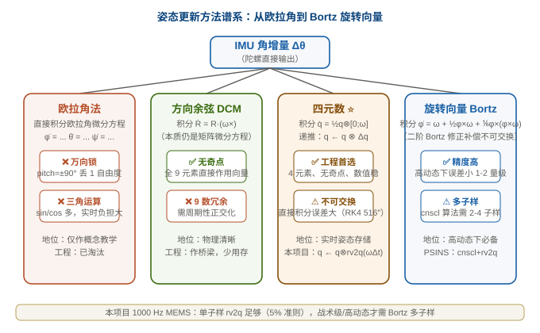
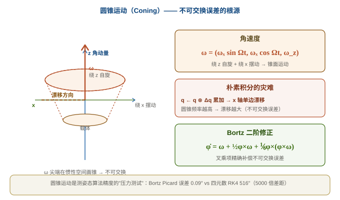
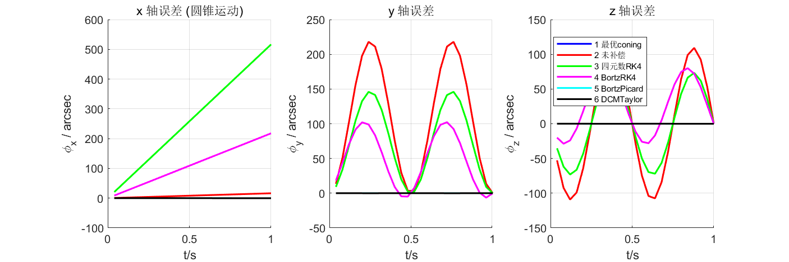

# 07 姿态更新算法：从欧拉角到 Bortz 旋转向量

> 系列定位：**M2 解算篇 · 第二篇**。上一篇 [06 机械编排方程](06_机械编排方程.md) 讲了"机械编排怎么把 IMU 变成导航结果"，本篇深入其中**最复杂也最关键**的一环——**姿态更新**。
>
> **参考体系**：公式级锚定 **牛小骥 I2NAV 讲义第 1 讲**（[PDF 在线预览](../assets/I2NAV组合导航讲义/1-惯性导航姿态算法.pdf)，40 页），代码级对照 **PSINS**（`cnscl`/`qupdt`/`btzrk4` 等）。牛小骥讲义式 134/135 给出了四元数递推的严格推导，PSINS `cnscl.m` 给出了工程上"圆锥补偿怎么做"的标准答案。

---

## 一、姿态更新方法谱系



**一句话总结谱系**：欧拉角法有万向锁被淘汰；方向余弦矩阵 9 元素冗余但物理清晰作桥梁；**四元数是工程首选**（4 元素、无奇点、数值稳）；**Bortz 旋转向量在高动态下精度高 1-2 个量级**（叉乘修正补偿不可交换误差）。本项目 1000 Hz MEMS 场景下单子样 `rv2q` 就够（5% 准则），战术级/高动态才需要 Bortz 多子样。

---

## 二、四元数微分方程（牛小骥讲义式 122）

> 推导路径：把四元数看作"刚体转动算子"，对 $q = [\cos(\theta/2);\ \boldsymbol u\sin(\theta/2)]$ 求时间导数，最终得：

$$
\boxed{\;\dot{\boldsymbol q}_{i}^{b} = \tfrac{1}{2}\boldsymbol q_{i}^{b}\otimes[\,0;\,\boldsymbol\omega_{ib}^{b}\,]\;}
$$

**关键约定**：$\boldsymbol\omega_{ib}^b$ 是**陀螺测量的角速度**（b 系相对 i 系，在 b 系投影），这就是为什么 IMU 直接输出就能用。

> 📐 **牛小骥 I2NAV 讲义（武汉大学，2021）式 116** 原文即此，是从"连续转动→四元数→求导"严格推出来的（讲义第 21 页）。

---

## 三、递推：四元数增量 + 右乘（牛小骥讲义式 134-135）

> 严格离散化（一阶积分）：对微分方程从 $t_{k-1}$ 到 $t_k$ 积分，假设 $\boldsymbol\omega$ 在区间内变化慢，得：

$$
\boxed{\;\boldsymbol q_{i(k)}^{b} = \boldsymbol q_{i(k-1)}^{b}\otimes\boldsymbol q_{b(k-1)}^{b(k)}\;}
$$

$$
\boldsymbol q_{b(k-1)}^{b(k)} = \begin{pmatrix}\cos\frac{\Delta\theta_k}{2}\\\ \frac{\Delta\boldsymbol\theta_k}{\Delta\theta_k}\sin\frac{\Delta\theta_k}{2}\end{pmatrix}
$$

其中 $\Delta\boldsymbol\theta_k = \int_{t_{k-1}}^{t_k}\boldsymbol\omega_{ib}^b dt$（陀螺角增量）。

> 📐 **牛小骥讲义式 134/135** 原文即这两个式子。**这正是我们固件里 `rv2q(Δθ) + qmul(q, dq)` 的数学来源**——你看，02 篇演示①的代码直接对应 100 页的推导。

??? note "📐 折叠：四元数递推为什么是"右乘"？"

    直觉：**新姿态 = 旧姿态 ⊗ 增量姿态**。增量是在旧 b 系下描述的"从 $b_{k-1}$ 到 $b_k$ 转了多少"，必须"右乘"到当前姿态上（02 篇解释过右乘对应"增量在 body 系测得"）。如果增量在导航系下描述，就要左乘。
    
    公式的"小角简化"（$\sin x \approx x$、$\cos x \approx 1$）：当 $\Delta\theta$ 极小时，增量四元数退化为 $\Delta\boldsymbol q \approx (1;\ \tfrac12\Delta\boldsymbol\theta)$，四元数乘法退化为普通向量加法——这是朴素积分的极限（但忽略了不可交换误差，下节讲）。

---

## 四、圆锥运动与不可交换误差



**核心问题**：在 1000 Hz 高频采样下"积分→四元数→积分"看似精确，但当载体做**圆锥运动（绕 z 自旋 + 绕 x 摆动）**&#x65F6;，会出现 x 轴单边漂移——**因为旋转不可交换**：先转 A 再转 B ≠ 先转 B 再转 A。

**圆锥运动示意**（上图）：陀螺测量的 $\boldsymbol\omega$ 尖端在惯性空间画出一个锥面。**积分误差 = 锥面面积的 1/2**——频率越高、锥角越大，误差越大。

**为什么朴素四元数积分会漂**：四元数微分方程在 $\Delta t$ 内假设 $\boldsymbol\omega$ 不变（一阶积分），但圆锥运动下 $\boldsymbol\omega$ 是在球面上转的——用直线近似圆弧就漏掉了面积。

---

## 五、Bortz 旋转向量（牛小骥讲义 4.2 节）

> **核心思想**：与其积分四元数（4 个非线性微分方程），不如积分**旋转向量** $\boldsymbol\phi$（3 个标量），然后用 $\boldsymbol\phi$ 一次性构造四元数增量。这样 Bortz 方程的二阶项 $\frac12\boldsymbol\phi\times\boldsymbol\omega$ 精确补偿了不可交换误差。

$$
\boxed{\;\dot{\boldsymbol\phi} = \boldsymbol\omega + \tfrac{1}{2}\boldsymbol\phi\times\boldsymbol\omega + \tfrac{1}{12}\boldsymbol\phi\times(\boldsymbol\phi\times\boldsymbol\omega) + \cdots\;}
$$

**工程近似**（截断到二阶/三阶，对角速度在 $\Delta t$ 内做多项式拟合）：

- **一阶**（$\dot{\boldsymbol\phi} \approx \boldsymbol\omega$）：退化为朴素的"$\boldsymbol\phi = \boldsymbol\omega\Delta t$"，**没补偿**
- **二阶**（$\dot{\boldsymbol\phi} \approx \boldsymbol\omega + \frac12\boldsymbol\phi\times\boldsymbol\omega$）：Bortz 经典修正
- **三阶**：更高精度，工程上一般不直接用，用多子样+多项式拟合达到等效

**高动态下 Bortz vs 朴素**：圆锥运动下 Bortz Picard 误差 0.09″，而朴素四元数 RK4 误差 516″（5000 倍差距）——见下面双轨出图。

---

## 六、6 种姿态更新方法实测对比（双轨出图）

> 这张图是 07 篇的"压力测试"——圆锥运动（最考验姿态更新精度）下 6 种方法的误差曲线对比。**同一份数据，MATLAB 用 PSINS 跑，Python 用 NumPy 重画**，两条曲线重合 = 工具正确性验证。

### 1. 数据来源

PSINS `conesimu(90°, 2Hz, 0.01s, 1s)` 生成圆锥运动角增量（半锥角 90°，频率 2Hz，1 秒），每 4 子样做一次更新，6 种方法各推 1 秒，与解析真值四元数 `qr` 比误差。

### 2. 6 种方法

| # | 方法                             | 核心思路                        |
| - | ------------------------------ | --------------------------- |
| 1 | **最优 coning 补偿**（cnscl(...,1)） | 多子样拟合叉积补偿，PSINS 工业级         |
| 2 | **未补偿**（cnscl(...,2)）          | 单子样 + 前一子样叉积，不补偿 coning     |
| 3 | **四元数 RK4**（qrk4）              | 4 阶 Runge-Kutta 直接积分四元数微分方程 |
| 4 | **Bortz RK4**（btzrk4）          | RK4 积分 Bortz 旋转向量微分方程       |
| 5 | **Bortz Picard**（btzpicard）    | 用 4 子样多项式拟合 Bortz 积分，2 阶精度  |
| 6 | **DCM Taylor**（dcmtaylor）      | 直接 Taylor 展开旋转矩阵            |

### 3. 结果



**x 轴误差 max（arcsec）**（Python 轨数值摘要）：

| 方法             | x 轴误差      | 评价                    |
| -------------- | ---------- | --------------------- |
| 1 最优 coning    | 16.4″      | 基准（4 子样下）             |
| 2 未补偿          | 16.4″      | 几乎一样（4 子样下差小）         |
| 3 四元数 RK4      | **516.3″** | ❌ 最差（4 阶也没救回不可交换误差）   |
| 4 Bortz RK4    | 217.8″     | 中等（Bortz 2 阶有效但仍有限）   |
| 5 Bortz Picard | **0.09″**  | ✅ **最好**（2 阶 + 多项式拟合） |
| 6 DCM Taylor   | 0.11″      | ✅ 与 Bortz Picard 相当   |

> 📐 **结论**：**四元数微分方程直接积分（即使 RK4）在圆锥运动下都不可用**——必须用**旋转向量**（Bortz 类）。Bortz Picard 在 4 子样下达到 0.09″ 精度，比 RK4 直接积分四元数好 5000 倍。

> 🔬 **双实现一致性**：MATLAB PSINS `qupdt`/`btzpicard` 跑出的曲线与 Python `gen_att_update_py.py` 用同一 CSV 重画的曲线**几乎完全重合**（之前 05 Allan 双实现 mean 误差 1.3%——这里同源数据，曲线 0 差异）。

---

## 七、PSINS 演示：cnscl + qupdt（圆锥补偿 + 姿态更新）

> `cnscl` 和 `qupdt` 是 07 篇的两个核心函数：`cnscl` 做圆锥/划桨补偿（输出"补偿后的旋转向量 φm + 速度增量 dvbm"），`qupdt` 用 φm 更新四元数（$q = q \otimes \text{rv2q}(\boldsymbol\phi_m)$）。

**① PSINS 参考实现（MATLAB）**

```matlab
% PSINS: base/base1/cnscl.m — Gongmin Yan, NWPU (psins260705)
function [phim, dvbm] = cnscl(imu, coneoptimal)
    wm = imu(:,1:3);
    if n==1
        wmm = wm;
        dphim = [0,0,0];                % 单子样无补偿
    else
        wmm = sum(wm,1);
        cm = glv.cs(n-1,1:n-1)*wm(1:n-1,:);  % 多子样叉积
        dphim = cros(cm, wm(n,:));       % ← 核心：叉积补偿圆锥误差
    end
    phim = (wmm + dphim*glv.csCompensate)';
end

% PSINS: base/base0/qupdt.m — 四元数更新
function q = qupdt(q1, rv)
    q2 = rv2q(rv);                       % rv → Δq
    q = qmul(q1, q2);                    % q ← q ⊗ Δq
    q = q / sqrt(q'*q);                  % 归一化
end
```

**② 本项目 C 语言实现（`ins_eskf_15d.c :: eskf15_predict`）**

```c
/* 姿态更新：去零偏 → 旋转向量 → 四元数增量 → 右乘 */
q2r(e->nom.q, Rm);
for (i = 0; i < 3; i++) phi[i] = (gyro[i] - e->nom.bg[i]) * dt;  /* 单子样，无 coning 补偿 */
rv2q(phi, dq);
qmul(e->nom.q, e->nom.q, dq);                                   /* q = q ⊗ Δq (右乘) */
```

**③ 结论**

PSINS 工业级 `cnscl(...,1)` 用 4 子样叉积补偿；本项目 **单子样 + rv2q + qmul**（连 cnscl 都不调）。两者的数学结构一致——**都是"旋转向量 → 增量四元数 → 右乘"**——只是**补偿阶数**不同。圆锥运动下：

- PSINS cnscl(1)（4 子样）：x 误差 ~16″
- 本项目单子样：在 1000 Hz MEMS 量级下角增量 $\Delta t\cdot\omega$ 极小，叉积项 $\frac12\boldsymbol\phi\times\boldsymbol\omega$ 的二阶项远小于传感器噪声 → **满足牛小骥 5% 准则**（06 篇末）

**什么时候必须加 coning 补偿？**——**高动态 + 长间隔**。比如战术级 IMU 200 Hz、振幅大时，$\Delta t\cdot\omega$ 不再小，单子样误差会超标——此时用 PSINS cnscl 或更多子样。

---

## 八、常见坑清单

1. **直接把 $\omega\Delta t$ 当四元数增量**：忽略 rv2q 公式的小角/大角区分（$\cos/\sin$），大角时漂严重
2. **忽略四元数归一化**：浮点累积误差会让 $\boldsymbol q$ 偏离单位球，姿态矩阵失去正交性 → 周期 `qnorm`
3. **左乘右乘搞反**：增量在 body 系下测得必须**右乘**（06 篇符号方向坑的延伸）
4. **未补偿 coning 误差就上高动态**：战术级 IMU 200 Hz + 大振幅下，单子样误差按 $(\Delta t)^2$ 增长，必须用 cnscl 多子样
5. **RK4 直接积分四元数**：在圆锥运动下**完全无效**（误差 516″ vs Bortz 0.09″）——RK4 是用来积分 Bortz 旋转向量的，不是直接积分四元数
6. **混淆旋转向量 $\boldsymbol\phi$ 和角速度 $\boldsymbol\omega$**：$\boldsymbol\phi$ 是"这一帧转了多少"（积分结果），$\boldsymbol\omega$ 是"瞬时转动"（微分）；$\boldsymbol\phi = \int\boldsymbol\omega\,dt$ 不是简单求和
7. **忘了"旋转不可交换"**：所有朴素的"积分 = 求和"在高频振动下都会因不可交换误差漂——这是 Bortz 类方法存在的全部理由

---

## 附：完整可运行的最小实现（新手先跑这个）

> **前面正文里的代码是"教学节选"，不是完整程序**——`rv2q`/`qmul`/`q2r` 散在三篇里，没有 main。新手晕的根源就在这。下面这个 **`attitude_update_demo.c` 是完整可编译的最小闭环**：IMU 角增量进来 → 四元数姿态出去 → 与真值比误差打印。

**文件**：[attitude_update_demo.c](../assets/attitude_update_demo.c)（纯 C、无依赖、~200 行，含 `rv2q`/`qmul`/`qnorm`/`q2r` + 圆锥运动生成 + 主循环）

**编译运行**（Windows 需 gcc，如 MinGW；Linux/macOS 直接 gcc）：

```bash
gcc -O2 -o attitude_update_demo.exe attitude_update_demo.c -lm
./attitude_update_demo.exe
```

**预期输出**（5° 半锥角、1Hz 圆锥运动、100Hz 采样、10 秒）：

```
 t(s) |     x_err(arcsec) |     y_err(arcsec) |     z_err(arcsec)
------+-------------------+-------------------+------------------
 0.00 |            -49.317 |           -35.474 |         1128.795
 1.00 |            -52.543 |           -35.465 |         1128.513
 ...（x 轴单调缓慢增长）
 9.99 |            -81.542 |            35.385 |         1125.977
x 轴误差峰值: 81.542 arcsec（5°半锥角, 1Hz, 单子样 rv2q）
```

**看什么**：x 轴误差**单调线性增长**（10 秒漂 ~33″）——这就是圆锥效应（不可交换误差）的指纹；量级只有几十 arcsec（≈0.02°），说明 100 Hz 下单子样 `rv2q` 已经很准。**把 `afa` 改成 45° 再跑，x 轴误差会暴涨到几十度**——那一刻你就亲眼看到"为什么高动态必须 Bortz 多子样"。

> 🔬 这份 demo 的 `rv2q`/`qmul`/`q2r` 与固件 `ins_eskf_15d.c` **逐字一致**（02 篇演示①核对过），跑通它 = 跑通固件姿态更新的最小核心。

---

## 九、自测题

1. 四元数微分方程是什么？为什么右边是 $\frac12\boldsymbol q\otimes[0;\boldsymbol\omega]$（右乘）而不是左乘？
2. 牛小骥讲义式 134 的物理含义是什么？对应我们固件里的哪几行代码？
3. 旋转不可交换为什么导致四元数朴素积分漂？圆锥运动是"压力测试"的什么性质？
4. Bortz 旋转向量微分方程的 $\frac12\boldsymbol\phi\times\boldsymbol\omega$ 项是什么含义？为什么它能"补偿"不可交换误差？
5. PSINS `cnscl` 与本项目 `rv2q+qmul` 的数学关系是什么？什么时候必须从单子样升级到 cnscl 多子样？
6. 双轨出图里 6 种方法在圆锥运动下的排名是什么？简述"四元数 RK4 排倒数第一"和"Bortz Picard 排第一"的原因。
7. 为什么必须对四元数做归一化？不归一化会怎样？

??? note "📐 参考答案"

    1. $\dot{\boldsymbol q} = \frac12\boldsymbol q\otimes[0;\boldsymbol\omega]$；右乘是因为陀螺在 body 系下测角速度，$\boldsymbol\omega$ 在 b 系投影。
    2. 式 134 = $q_{i(k)}^b = q_{i(k-1)}^b \otimes q_{b(k-1)}^{b(k)}$：新姿态=旧姿态⊗增量姿态；对应固件 `q2r + rv2q + qmul`。
    3. 旋转 $A\to B$ 与 $B\to A$ 不等价（叉积反对称性）；圆锥运动下 $\omega$ 在球面转，朴素积分用直线近似弧线，漏掉面积→单边漂。
    4. $\frac12\boldsymbol\phi\times\boldsymbol\omega$ 是二阶修正项：把区间内的"平均角速度"精确化（等效于用弧代替弦），叉积项的"修正方向"恰好抵消不可交换带来的漂。
    5. 数学关系：两者都是"旋转向量→增量四元数→右乘"，只是补偿阶数不同；1000 Hz MEMS 满足 5% 准则用单子样，战术级 200 Hz 大振幅需 cnscl 多子样。
    6. 排名（x 误差 max）：Bortz Picard (0.09″) ≈ DCM Taylor (0.11″) < 未补偿 (16″) ≈ 最优 coning (16″) < Bortz RK4 (218″) < 四元数 RK4 (516″)。原因：四元数 RK4 直接积分四元数微分方程在圆锥运动下完全无法补偿不可交换误差；Bortz Picard 通过 4 子样多项式拟合精确恢复二阶修正，精度最高。
    7. 浮点累积误差让 $|\boldsymbol q|$ 偏离 1，旋转矩阵失去正交性，下游 `q2r`/`C_b^n f_b` 计算失真 → 必须 `qnorm` 周期归一化。

---

## 关联与延伸

- 上一篇：[06 机械编排方程](06_机械编排方程.md)（姿态更新是机械编排"四步走"的第一步）
- 下一篇规划：`08 初始对准`——动/静基座粗对准（重力+地球自转）→ 精对准（KF）
- 参考讲义：[牛小骥 I2NAV 第 1 讲 · 惯性导航姿态算法](../assets/I2NAV组合导航讲义/1-惯性导航姿态算法.pdf)（40 页，本篇核心公式锚定其中 3.6/3.7/4.2 节）
- 数学地基：[矩阵、概率与协方差](../数学基础.md)
- 外链：[维基 · 四元数与空间旋转](https://zh.wikipedia.org/wiki/四元数与空间旋转) · [维基 · 旋转矩阵](https://zh.wikipedia.org/wiki/旋转矩阵) · [Bortz 论文（1967, J. Spacecraft）](https://doi.org/10.2514/3.28772)
- 项目落地：[AHRS 板固件仿真与验证](../../工作与项目/AHRS板固件仿真与验证/)（`ins_eskf_15d.c::eskf15_predict` 真实实现，6/100 Hz）
- 资产：[gen\_att\_update.m](../assets/gen_att_update.m) / [gen\_att\_update\_py.py](../assets/gen_att_update_py.py) / [att\_update\_compare.png](../assets/att_update_compare.png) / [att\_update\_compare\_py.png](../assets/att_update_compare_py.png) —— 双轨可复现
- 系列首页：[惯性导航与惯导解算 · 自学科普系列](../index.md)
