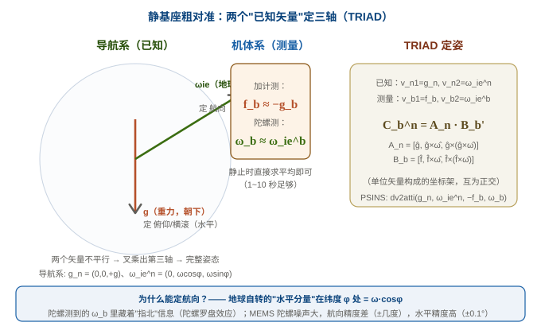

# 08 初始对准：从"不知道姿态"到"知道姿态"

> 系列定位：**M2 解算篇 · 第三篇**。[06](06_机械编排方程.md) 讲了机械编排（怎么递推）、[07](07_姿态更新算法.md) 讲了姿态更新（怎么积分）。但有个**必须先回答的问题**：**开机时姿态是多少？** 机械编排和姿态更新都是"从当前姿态继续推"——如果起点都不知道，后面全是空中楼阁。这一篇回答：**怎么从 IMU 原始数据里"测"出初始姿态**——这就是**初始对准（initial alignment）**。
>
> **参考体系**：公式级与代码级均锚定 **PSINS `base/align/`**（`alignsb`/`dv2atti`/`alignvn`/`aligni0`/`aligncmps`，业界最全的对准工具箱）。牛小骥讲义第 3 讲"静基座误差传播"可作对准精度的理论依据（[PDF](../assets/I2NAV组合导航讲义/3-惯性导航误差传播分析.pdf)）。

---

## 一、为什么需要初始对准

### 1. 一个"先有鸡还是先有蛋"的问题

机械编排（06 篇）的姿态更新需要**当前姿态**才能把比力转到导航系（$f_n = C_b^n f_b$）。但开机时我们**完全不知道**姿态——传感器只给角速度和比力，不给"你现在朝哪"。

### 2. 幸好：重力给了我们"天然的铅垂线"

静止时，加速度计测到的比力**就是重力**（$f = -g$，03 篇讲过）：

$$\boldsymbol f_b = -\boldsymbol C_b^n\boldsymbol g_n \approx \boldsymbol g_b$$

而**地球自转角速度**也能被陀螺测到（虽然很弱，7.29e-5 rad/s ≈ 15°/h）：

$$\boldsymbol\omega_b = \boldsymbol C_b^n\boldsymbol\omega_{ie}^n$$

**两个不平行矢量**（重力 + 地球自转）在导航系已知、在机体系可测 → 足够确定完整姿态！这就是粗对准的数学本质。




---

## 二、粗对准：TRIAD 双矢量定姿（秒级）

### 1. 核心思想

**TRIAD（Tri-Axis Attitude Determination）**：用两个参考矢量构造两套正交基，姿态矩阵 = 两套基的"对拍"。

导航系已知矢量：$\boldsymbol v_{n1} = \boldsymbol g_n,\ \boldsymbol v_{n2} = \boldsymbol\omega_{ie}^n$
机体系测量矢量：$\boldsymbol v_{b1} = -\boldsymbol f_b,\ \boldsymbol v_{b2} = \boldsymbol\omega_b$（静止求平均）

构造正交基（单位化 + 叉乘）：

$$\boldsymbol a_1 = \hat{\boldsymbol v}_{n1}, \quad \boldsymbol a_2 = \frac{\hat{\boldsymbol v}_{n1}\times\hat{\boldsymbol v}_{n2}}{\|\cdot\|}, \quad \boldsymbol a_3 = \boldsymbol a_1\times\boldsymbol a_2$$

机体系同理得 $\boldsymbol b_1,\boldsymbol b_2,\boldsymbol b_3$，则：

$$
\boxed{\;\boldsymbol C_b^n = [\boldsymbol a_1\ \boldsymbol a_2\ \boldsymbol a_3]\,[\boldsymbol b_1\ \boldsymbol b_2\ \boldsymbol b_3]^T\;}
$$

> 🔬 **PSINS 实现**：`dv2atti(vn1, vn2, vb1, vb2)` 就是这个公式（`base/align/dv2atti.m`），`alignsb` 负责"静止求平均 + 调 dv2atti"。完整代码见第七节。

### 2. 两个矢量各定什么

| 矢量 | 定的轴 | 精度（MEMS 静止） | 物理直觉 |
|---|---|---|---|
| 重力 $\boldsymbol g$ | 俯仰 / 横滚（水平） | ±0.1°（加计噪声小） | 水平面 = 垂直重力的平面 |
| 地球自转 $\boldsymbol\omega_{ie}$ | 航向（yaw） | ±几度（陀螺噪声大） | 陀螺罗盘效应：地球自转水平分量指北 |

**为什么航向难**：$\boldsymbol\omega_{ie}$ 的水平分量只有 $\omega\cos\varphi \approx 11.9°/h$（中纬度）——**比 MEMS 陀螺零偏还小**！所以单靠 MEMS 陀螺粗对准，航向误差在几度到几十度量级。这解释了工程事实：**粗对准给的航向只能当"初值"，必须靠精对准或外部观测（磁力计/GNSS）修正**。

---

## 三、精对准：卡尔曼滤波（分钟级）

### 1. 为什么需要精对准

粗对准把姿态定到了"差不多"（水平 0.1°、航向几度）。但 ESKF 需要**更准的初值**，否则协方差收敛慢、甚至发散。精对准用**卡尔曼滤波**把残余失准角"估出来"。

### 2. 核心思想：零速量测

静基座上，真实速度恒为 0。如果机械编排推出来的速度不为 0，**偏差就来自初始失准角**（姿态错 → 比力投影错 → 速度错）：

$$\boldsymbol v_{\text{推算}} = \boldsymbol f(\text{失准角}\ \boldsymbol\phi) \approx 0 + \text{可观测的扰动}$$

**量测**：$\boldsymbol z = \boldsymbol v_{\text{推算}} - 0$（推算速度即"误差"）
**状态**：失准角 $\boldsymbol\phi$ + 零偏 + 速度误差（PSINS `alignvn` 用 12 态：3 失准角 + 3 速度误差 + 3 陀螺零偏 + 3 加计零偏）
**可观测性**：静基座下失准角**完全可观测**（水平角由重力投影、航向角由地球自转投影），几分钟内收敛

### 3. 与 ESKF 的关系（重要）

**精对准本质 = 一个"迷你 ESKF"**：状态只有姿态误差 + 零偏，量测是零速。它的滤波方程和我们 15 态 ESKF 的"量测更新"**同源**（都来自 04 篇的误差模型 + 06 篇的机械编排）——所以：

> 工程上两种做法：① 独立精对准模块（PSINS 风格），跑完把姿态给 ESKF 当初值；② **直接开 ESKF，用零速量测"在线对准"**（本项目的路子，见第五节）。

---

## 四、动基座对准：i0 法（进阶）

> 静基座对准需要载体**不动**几分钟。车辆/无人机实际场景常常"边动边对准"——这就是**动基座对准**。PSINS 的 `aligni0`（inertial frame 法）是主流：把"载体运动"当"转台"，在惯性系里积分，利用运动激励让失准角可观测。适合车载（转弯、加减速天然激励）。

原理一句话：**在惯性系里，重力方向是固定的**（$i$ 系不随地球转），把 IMU 输出积分到 $i$ 系，运动的"杂乱"在积分里被平均掉，剩下的是姿态信息。PSINS 还有 `alignWahba`（Wahba 问题最优解，q-method）等高阶变体。

> 对新手：动基座对准是"进阶章"，先掌握静基座粗/精对准即可。本项目（航姿板）上电通常静止，用静基座足够。

---

## 五、本项目：现状与接入方案

### 1. 现状（诚实说）

固件目前**假设初始姿态已知**（外部传入 `nom.q`），**没有独立对准模块**——这是真实空白。跑仿真时初始姿态是"送的"，真机开机就从"不知道姿态"开始，**必须补对准**。

### 2. 三步接入路径（落地优先序）

```c
// ① 粗对准（上电静止 1~10s，~30 行 C，移植 alignsb 的 dv2atti）：
//    g_b = 平均(-加计)；w_b = 平均(陀螺)；TRIAD 求 C_b^n → 初始化 nom.q
float fb[3] = { 平均(-accel_x), ... }, wb[3] = { 平均(gyro_x), ... };
float gn[3] = { 0, 0, 9.81 },   wie[3] = { 0, w*cos(lat), w*sin(lat) };
//    C_b^n = triad(gn, wie, fb, wb);  →  q2e / e2q 得初始四元数

// ② 精对准（上电静止 30~60s）：零速量测进 ESKF 的量测更新
//    z = v_推算 - 0（用 P 阵和 H 阵估计失准角 + bg/ba）
//    这正是本项目 15 态 ESKF 的"量测更新"——只是量测从 GNSS/磁力计换成零速

// ③ 磁力计辅助（本项目已有 RM3100/IST8310）：粗对准航向 + 磁航向融合
//    磁力计定航向不受陀螺噪声限制（但受磁场干扰，见 12 篇观测模型）
```

> **关键认知**：本项目 ESKF 的量测更新**天然能做精对准**——只要把"零速"当量测喂进去，失准角就会被估计出来。所以 ① 粗对准（给个能用的初值）+ ② ESKF 零速量测（在线精对准）是最小可行方案，**不用单独写 alignvn**。

---

## 六、常见坑清单

1. **不粗对准直接开 ESKF**：初值差 90°，协方差要"飞"很久才收敛，期间导航结果完全不可信。
2. **粗对准时载体在动**：静止求平均的前提是"真静止"——晃动/振动会污染平均，航向尤其差。上电后先确认静止再对准。
3. **以为 MEMS 能粗对准航向到 0.1°**：地球自转信号（~12°/h）被 MEMS 陀螺噪声（几°/h）淹没，粗对准航向只能到几度。要航向精度靠精对准/磁力计/GNSS。
4. **精对准时间不够**：航向角收敛最慢（靠地球自转投影，信号弱），静基座精对准通常要 1~5 分钟。
5. **把粗对准当"不需要标定"**：加计零偏直接影响水平对准（g 方向测偏），陀螺零偏直接影响航向。粗对准精度上限 = 零偏大小。
6. **混淆"对准"和"校零"**：对准是定**姿态**（三个角），校零是测**零偏**（bias）——虽然精对准能顺带估零偏，但概念不同（04 篇）。

---

## 七、PSINS 演示：对准全家桶

> `test_align_methods_compare.m` 把 6 种对准方法在相同条件下对比——**从粗到精的完整谱系**。我们挑最核心的 `alignsb`（粗）+ `dv2atti`（TRIAD）+ `alignvn`（精）看代码。

**① PSINS 参考实现（MATLAB）**

```matlab
% PSINS: base/align/alignsb.m — 静基座解析粗对准
function [att, attk] = alignsb(imu, pos)
    ts = diff(imu(1:2,end));
    wbib = mean(imu(:,1:3),1)'/ts;    % 平均角速度（= 地球自转投影）
    fbsf = mean(imu(:,4:6),1)'/ts;    % 平均比力（= 重力反号）
    eth = earth(pos);                  % 导航系参考矢量: gn, wnie
    [qnb, att] = dv2atti(eth.gn, eth.wnie, -fbsf, wbib);   % TRIAD
end

% PSINS: base/align/dv2atti.m — TRIAD 双矢量定姿（核心数学）
function [qnb, att, Cnb] = dv2atti(vn1, vn2, vb1, vb2)
    vntmp1 = cross(vn1,vn2); vntmp2 = cross(vntmp1,vn1);    % 构造正交基
    vbtmp1 = cross(vb1,vb2); vbtmp2 = cross(vbtmp1,vb1);
    Cnb = [vn1/norm(vn1), vntmp1/norm(vntmp1), vntmp2/norm(vntmp2)] * ...
          [vb1/norm(vb1), vbtmp1/norm(vbtmp1), vbtmp2/norm(vbtmp2)]';  % 对拍
    qnb = m2qua(Cnb); qnb = qnb/norm(qnb);   % 矩阵 → 四元数
end

% PSINS: base/align/alignvn.m — 静基座精对准（vn 量测 KF，12 态）
% 状态: [phiE,phiN,phiU, dvE,dvN,dvU, ebx,eby,ebz, dbx,dby,dbz]'
% 量测: z = v_推算 - 0（零速）；KF 收敛估计失准角 φ 与零偏
```

**② 本项目 C 语言实现（`ins_eskf_15d.c` / 待补模块）**

```c
/* ① 粗对准（建议新增 ins_align.c，~30 行核心）：
   fb = 平均(-加计), wb = 平均(陀螺), TRIAD → C_b^n → nom.q 初值 */
static void align_coarse_static(const float accel_avg[3], const float gyro_avg[3],
                                float lat, float q0[4])
{
    float gn[3]  = {0, 0, 9.80665f};
    float wie[3] = {0, 7.292115e-5f*cosf(lat), 7.292115e-5f*sinf(lat)};
    float fb[3]  = {-accel_avg[0], -accel_avg[1], -accel_avg[2]};
    /* TRIAD（同 dv2atti）：构造正交基 → 对拍 → q2e */
    /* ... */
}

/* ② 精对准 = ESKF 零速量测（本项目量测更新已有，喂 z = v_推算 - 0 即可）*/
/*    15 态 ESKF 的 H 阵对应速度行，见 11 篇 */
```

**③ 结论**

PSINS 对准体系 = **解析粗对准（秒级、TRIAD）→ KF 精对准（分钟级、零速量测）→ i0 动基座（进阶）**。对本项目：粗对准移植 `dv2atti`（~30 行 C）给 `nom.q` 初值，精对准直接用**本项目 ESKF 的零速量测**（不需要单独写 alignvn）——这是最少代码、最贴合现有架构的接入路径。

---

## 八、自测题

1. 为什么静止时能定姿态？粗对准用哪两个"已知矢量"？各自定什么？
2. 为什么粗对准的航向精度比水平差很多？
3. TRIAD 定姿的数学步骤是什么？为什么要叉乘出第三个矢量？
4. 精对准（alignvn）的量测是什么？为什么"零速"能估出失准角？
5. 本项目最小可行的对准方案是什么？（提示：粗对准 + ESKF 什么量测）
6. 动基座对准（aligni0）和静基座对准的本质区别是什么？

??? note "📐 参考答案"

    1. 静止时加计测到的是重力（$f_b=-C_b^n g_n$）、陀螺测到的是地球自转（$\omega_b=C_b^n\omega_{ie}^n$）；重力定俯仰/横滚（水平）、地球自转定航向。
    2. 地球自转水平分量只有 $\omega\cos\varphi\approx12°/h$，比 MEMS 陀螺零偏/噪声（几°/h）还小——信号被噪声淹没。
    3. 两个不平行矢量 → 各自构造正交基（单位化+叉乘出第三轴）→ 两套基"对拍" $C_b^n = [a_1a_2a_3][b_1b_2b_3]^T$。
    4. 量测 $z = v_{推算}-0$（零速）；姿态错 → 比力投影错 → 速度错，KF 从速度误差反推失准角 φ。
    5. 粗对准（TRIAD 给初值）+ ESKF 零速量测（在线精对准）——不需要单独写 alignvn。
    6. 静基座靠"重力+地球自转"两个固定矢量；动基座靠"载体运动当转台"（i0 法在惯性系积分，运动激励失准角可观测）。

---

## 关联与延伸

- 上一篇：[07 姿态更新算法](07_姿态更新算法.md)（对准完就开始推姿态）
- 下一篇：[09 纯惯导误差传播](09_纯惯导误差传播.md)——失准角怎么随时间增长、舒勒振荡、为什么纯惯导必发散（牛小骥讲义第 3 讲）
- 参考讲义：[牛小骥 I2NAV 第 3 讲 · 惯性导航误差传播分析](../assets/I2NAV组合导航讲义/3-惯性导航误差传播分析.pdf)（静基座误差传播 = 对准精度上限的理论依据）
- 数学地基：[矩阵、概率与协方差](../数学基础.md)（TRIAD 的基构造、KF 的协方差）
- 外链：[维基 · 地球自转](https://zh.wikipedia.org/wiki/地球自转) · [维基 · 陀螺罗盘](https://en.wikipedia.org/wiki/Gyrocompass) · [Wahba 问题](https://en.wikipedia.org/wiki/Wahba%27s_problem)
- 项目落地：[AHRS 板固件仿真与验证](../../工作与项目/AHRS板固件仿真与验证/)（`ins_eskf_15d.c` 现状 + 建议新增 `ins_align.c`）
- 系列首页：[惯性导航与惯导解算 · 自学科普系列](../index.md)
