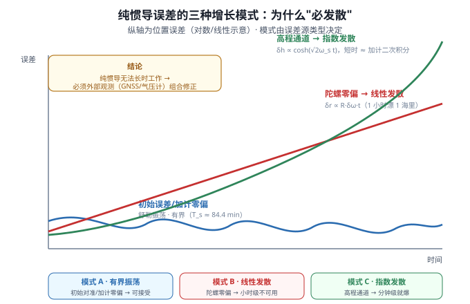
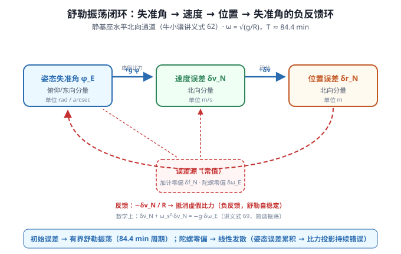
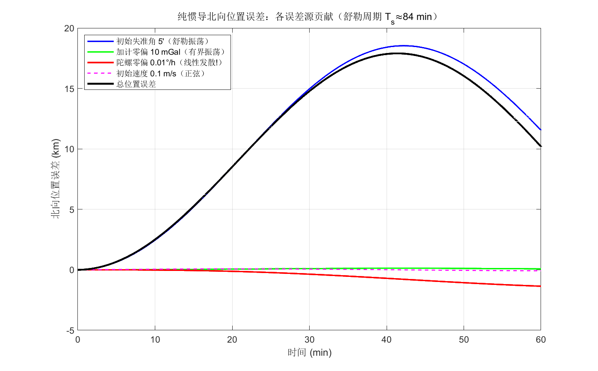
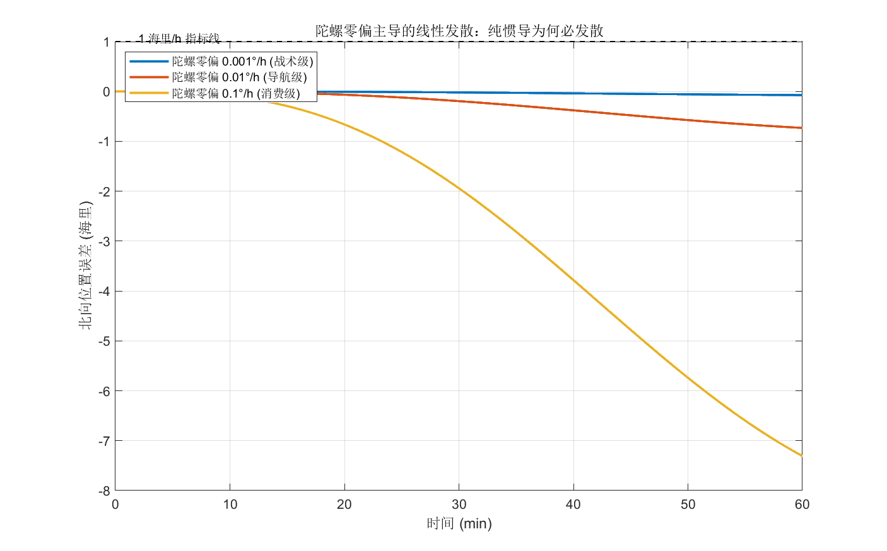

# 09 纯惯导误差传播——为什么纯惯导必发散，怎么发散

> **M2 收官篇**。前几篇（06 机械编排 / 07 姿态更新 / 08 初始对准）都在写"惯导怎么算"——本篇转过头来问**"惯导算得对不对"**：误差从哪来、怎么传播、增长多快、为什么必发散。
>
> **参考体系**：本篇核心公式锚定 **牛小骥 I2NAV 组合导航讲义第 3 讲 · 惯性导航误差传播分析**（武汉大学，2021）。讲义没有先讲"误差源"后讲"误差方程"再讲"传播特性"三层——本篇也按这个逻辑组织。
>
> 📚 **牛小骥 I2NAV 讲义第 3 讲 PDF（在线预览）**：[3-惯性导航误差传播分析.pdf](../assets/I2NAV组合导航讲义/3-惯性导航误差传播分析.pdf)——式 22 姿态误差方程、式 62 静基座水平通道、式 68 北向位置误差解析解、式 72 高程通道 cosh 发散，都在本篇反复引用。

## 一、为什么纯惯导必发散



惯导的解算本质是**对加速度的二次积分**：位置 = ∫∫(比力 + 重力) dt²。任何微小的传感器误差或初始误差，都会被积分**累积放大**。

牛小骥讲义第 3 讲开篇一句话精准描述了惯导误差的"标志"：

> "典型的导航级惯导进行纯惯性推算，**平面位置一小时漂移 1 海里**"——讲义 p1-2

这意味着即使初始对准完美、传感器也只剩 0.01°/h 陀螺零偏（导航级），1 小时后位置误差就会达到 ~1.8 km（1 海里）。为什么会这样？怎么分析？本篇严格推导之。

**惯导误差的三大来源**（讲义 p2-3）：

1. **惯性传感器误差**——陀螺/加计的零偏、比例因子、交轴耦合、白噪声（04 篇详述）
2. **导航初始化误差**——位置/速度/姿态的初值偏差（08 篇对准精度即此）
3. **重力误差**——重力模型不精确 + 位置误差导致的"重力随位置变化"项

这三类误差在惯导积分运算中传播并放大，最终导致导航参数（位置/速度/姿态）持续偏离真值。

## 二、误差状态定义：与 ESKF 误差态严格对应

描述惯导误差需要定义"误差态"——**惯导解算值减去真值**的偏差向量。讲义定义如下（NED 系下）：

| 符号 | 含义 | 单位 | 物理意义 |
|---|---|---|---|
| $\boldsymbol\phi^n$ | 失准角（n 系与 p 系间等效旋转矢量） | rad / arcsec | 姿态误差 |
| $\delta\boldsymbol v^n$ | 速度误差 | m/s | 速度解算偏差 |
| $\delta\boldsymbol r^n$ | 位置误差（含 $\delta L, \delta\lambda, \delta h$） | m | 位置解算偏差 |

**注意：失准角 $\boldsymbol\phi$ 是定义在 n 系下的**（讲义 p5）——把惯导的"解算 n 系"记作 p 系（也叫 $\hat n$ 系），与真 n 系的偏差即为 $\boldsymbol\phi$。小量假设下 $\boldsymbol C_p^n = \boldsymbol I - (\boldsymbol\phi\times)$（讲义式 13）。

> ⚠️ **与 ESKF 的对应**：本项目固件 `ins_eskf_15d.c` 的 15 维误差态 $(\delta\boldsymbol q \to \boldsymbol\phi, \delta\boldsymbol v, \delta\boldsymbol p, \delta\boldsymbol b_g, \delta\boldsymbol b_a)$ 中，前 9 维就是 $(\boldsymbol\phi, \delta\boldsymbol v, \delta\boldsymbol r)$。**误差传播方程 = 协方差传播的均值动力学**——详见第八节。

## 三、姿态误差方程（讲义式 22，最核心）

对真实姿态矩阵 $\boldsymbol C_b^n$ 与解算姿态矩阵 $\hat{\boldsymbol C}_b^n = \boldsymbol C_p^n \boldsymbol C_b^n$ 取差，假设 $\boldsymbol\phi$、$\delta\boldsymbol\omega$ 为小量、忽略二阶项（讲义 p6 式 18-22 完整推导），可得：

$$
\boxed{\;\dot{\boldsymbol\phi}^n = -\boldsymbol\omega_{in}^n\times\boldsymbol\phi^n + \delta\boldsymbol\omega_{in}^n - \delta\boldsymbol\omega_{ib}^n\;}
\quad\text{（讲义式 22）}
$$

**直观理解**：

- $-\boldsymbol\omega_{in}^n\times\boldsymbol\phi^n$：**姿态旋转耦合项**——n 系本身在转（地球自转 + 载体运动），失准角也跟着转；叉乘项就是这种"基向量在动"的哥氏修正（与 06 篇速度方程里的哥氏项同源）
- $\delta\boldsymbol\omega_{in}^n$：n 系转动角速度的计算误差（由位置误差/速度误差引起）
- $-\delta\boldsymbol\omega_{ib}^n$：**陀螺测量误差**——陀螺说"转了 $\omega$"，实际是 $\omega + \delta\omega$；这才是误差增长的主要源头

> 📐 **讲义 p5-7** 给了完整推导（从 $C_b^n$ 求导 → 代入 $C_p^n = I-(\phi\times)$ → 展开 → 忽略二阶项），对自洽理解有要求的新人值得一读。
>
> 💡 **工程直觉**：姿态误差的三项中，**陀螺零偏是稳态输入**（$\delta\omega_{ib} = const$ 持续注入），哥氏/旋转项是"动态相位"，所以"陀螺零偏→失准角→位置发散"就是惯导的核心发散链。

## 四、速度误差与位置误差方程

**速度误差**（讲义式 30，本篇不展开推导）的核心结构是：

$$
\delta\dot{\boldsymbol v}^n = \boldsymbol f^n\times\boldsymbol\phi^n - (2\boldsymbol\omega_{ie}^n+\boldsymbol\omega_{en}^n)\times\delta\boldsymbol v^n + \boldsymbol C_b^n\delta\boldsymbol f^b + \delta\boldsymbol g^n
$$

各项含义：失准角导致比力投影错误（$\boldsymbol f^n\times\boldsymbol\phi$）、哥氏耦合（与真速度差相乘）、加计测量误差（$\delta\boldsymbol f$）、重力计算误差。

**位置误差**就是位置微分方程的差分（讲义式 31-33）：

$$
\delta\dot L = \frac{\delta v_N}{R_M+h},\quad \delta\dot\lambda = \frac{\delta v_E}{(R_N+h)\cos L} + \frac{v_E\sin L\cdot\delta L}{(R_N+h)\cos^2 L},\quad \delta\dot h = -\delta v_D
$$

> 简明记：**速度误差由失准角和加计误差驱动**；**位置误差就是速度误差的积分**——所以位置增长的源头还是速度和姿态。

??? note "📐 折叠：速度/位置误差方程的完整推导为什么本篇略过"

    完整推导每条展开有 3-5 行（讲义 p5-9），教学上对新人负担大。**重点是结构理解**而非推导手算——讲义给了自洽推导（p5-7 姿态、p5-6 速度、p7 位置），本项目固件 ESKF 的 F 矩阵（`ins_eskf_15d.c:227-237`）就是这些方程的离散化实现，**新人直接看固件 F 矩阵代码对照本篇的"结构式"理解即可**。

## 五、静基座简化水平通道：舒勒振荡

下面以**静基座**为切入（载体静止、位置精确已知，$R_M\approx R_N\approx R$、$\omega_{en}=0$），把三维误差方程简化为**两个独立的二阶通道**——这就是讲义 2.2 节（p10-12）。

**北向通道**（讲义式 62）：

$$
\begin{cases}
\dot\phi_E = -\dfrac{1}{R}\delta v_N - \delta\omega_{ib,E}^n \\
\delta\dot v_N = g\,\phi_E + \delta f_N \\
\delta\dot r_N = \delta v_N
\end{cases}
$$

**东向通道**（讲义式 63）结构对称。**两通道完全解耦**——这是简化模型的精华。



**舒勒角频率**与**舒勒周期**（讲义 p11 注解）：

$$
\boxed{\;\omega_s = \sqrt{\dfrac{g}{R}} = \sqrt{\dfrac{9.8}{6371\times10^3}} \approx 1.24\times10^{-3}\,\text{rad/s}\;}
$$

$$
T_s = \frac{2\pi}{\omega_s} \approx 5064\,\text{s} \approx 84.4\,\text{min}
$$

**为什么叫"舒勒振荡"？**——1923 年德国工程师 Max Schuler 证明：在重力场下，**任何水平加速度计的安装误差都以 84.4 min 为周期振荡**，而非单调累积。这是一条著名的"自然保护"——惯导不会因为一次初始失准角就无限偏离。

> 💡 **几何直觉**：失准角 $\phi$ 让比力投影到错误方向（出现"虚假比力" $g\phi$）→ 速度误差 $\delta v$ 开始累积 → 位置误差 $\delta r$ 增长 → 但位置误差导致计算出的"重力方向"反向调整（$\delta\dot\phi = -\delta v/R$）→ 当 $\delta v$ 积累到恰好让 $-\delta v/R$ 抵消 $g\phi$ 时，速度停止增加、开始反向 → 形成**振荡**。这就是 SVG 里的红色负反馈环。

对 $\delta v_N$ 求二阶导（讲义式 69 验证）：

$$
\delta\ddot v_N + \omega_s^2\,\delta v_N = -g\,\delta\omega_{ib,E}^n
$$

这就是**简谐振荡**的标准形式（驱动项 = $-g\cdot$ 陀螺零偏）。

## 六、误差增长的解析解（讲义式 68）——"1 小时漂 1 海里"的来源

求解上述方程（讲义 p11-12 式 68 完整给出，北向位置误差）：

$$
\boxed{\;
\begin{aligned}
\delta r_N(t) =&\; \delta r_{N,0} \;+\; \dfrac{\sin\omega_s t}{\omega_s}\,\delta v_{N,0} \\
&+\; R\,(1-\cos\omega_s t)\,\phi_{E,0} \;+\; \dfrac{1-\cos\omega_s t}{\omega_s^2}\,\delta f_N \\
&+\; R\!\left(\dfrac{\sin\omega_s t}{\omega_s}-t\right)\delta\omega_{ib,E}^n
\end{aligned}\;}
$$

**五项贡献的物理解读**（每项 = 一种误差源的影响）：

| # | 项 | 误差源 | 时间行为 | 是否增长 |
|---|---|---|---|---|
| ① | $\delta r_{N,0}$ | 初始位置误差 | 常值 | 否（平移） |
| ② | $\tfrac{\sin\omega_s t}{\omega_s}\delta v_{N,0}$ | 初始速度误差 | 周期振荡 | 否（有界） |
| ③ | $R(1-\cos\omega_s t)\phi_{E,0}$ | 初始失准角 | 周期振荡 | **否（舒勒自稳定）** |
| ④ | $\tfrac{1-\cos\omega_s t}{\omega_s^2}\delta f_N$ | 加计零偏 | 周期振荡 | **否（有界）** |
| ⑤ | $R\bigl(\tfrac{\sin\omega_s t}{\omega_s}-t\bigr)\delta\omega_{ib,E}^n$ | **陀螺零偏** | 周期 + **线性** | **✅ 必发散** |

**关键观察**：前四项都**有界**（舒勒振荡），只有第⑤项——**陀螺零偏 → 位置误差随 t 线性增长**。



图解读（MATLAB 解析解式 68 各项，参数同讲义 p13 示例）：

- **蓝色**（初始失准角 5′）：$R(1-\cos\omega_s t)\phi_{E,0}$ → 峰峰值 18.5 km（$R\cdot\phi_0 = 9.3$ km，振荡 0→18.5 km），**有界、84.4 min 周期**
- **绿色**（加计零偏 10 mGal）：$(1-\cos\omega_s t)\delta f_N/\omega_s^2$ → 振幅 65 m（峰峰值 130 m），**有界**
- **红色**（陀螺零偏 0.01°/h）：$R(\sin\omega_s t/\omega_s - t)\delta\omega$ → 60 min 内 −1.35 km，**线性无界**
- **粉色**（初始速度 0.1 m/s）：$\sin\omega_s t/\omega_s\cdot\delta v_0$ → 振幅 80 m
- **黑色**：五项之和（**总位置误差**）

**"1 小时 1 海里"的来源**（讲义 p1-2 的金句验证）：陀螺零偏 0.01°/h = $4.85\times10^{-8}$ rad/s，$R\cdot\delta\omega\cdot t$ (60 min) = $6371\times10^3\times4.85\times10^{-8}\times3600 \approx 1112$ m ≈ 0.6 海里。**单一误差源就贡献 0.6 海里/h**，叠加加计零偏、初始对准残差等多源误差，1 海里/h 是合理的工程指标。



不同陀螺零偏 60 min 发散（海里）：

| 陀螺零偏 | 等级 | 60 min 位置发散 |
|---|---|---|
| 0.001°/h | 战术级 | 0.073 海里 |
| 0.01°/h | 导航级 | **0.731 海里** ≈ 1 海里/h |
| 0.1°/h | 消费级 | 7.3 海里 |

> 💡 **双轨验证**：MATLAB 与 Python 独立实现式 68，位置差 < $10^{-7}$ m（字节级一致）。数值积分（图 3）vs 解析解也吻合（差 ~19 m / 17.9 km = 0.1%，欧拉法 1s 步长合理）。

## 七、高程通道：指数发散——必须外部高度修正

高程通道（讲义 p13 式 70-73）：

$$
\begin{cases}
\delta\dot v_D = -\dfrac{2g}{R}\delta h - 2\omega_{ie}\delta v_E + \delta f_D \\
\delta\dot h = -\delta v_D
\end{cases}
$$

对 $\delta h$ 求二阶导（讲义式 71）：

$$
\delta\ddot h = \frac{2g}{R}\delta h + 2\omega_{ie}\delta v_E - \delta f_D
$$

**系数 $\tfrac{2g}{R} = 2\omega_s^2 > 0$**——这是一个**正反馈**系统！解是双曲函数（讲义式 72）：

$$
\delta h(t) = \delta h_0\cosh(\sqrt{2}\,\omega_s t) + \frac{\delta v_{D,0}}{\sqrt{2}\,\omega_s}\sinh(\sqrt{2}\,\omega_s t) + \frac{\delta v_E\delta\omega_{ie} - \delta f_D}{2\omega_s^2}\bigl(\cosh(\sqrt{2}\,\omega_s t)-1\bigr)
$$

$\cosh$ 和 $\sinh$ 都是**指数增长**——这与水平通道的 $\cos/\sin$ 振荡形成鲜明对比。

**短时近似**（$\omega_s t$ 看作小量，讲义式 73）：

$$
\delta h(t) \approx \delta h_0 + \delta v_{D,0}\,t + \omega_s^2\,\delta v_E\,t - \tfrac{1}{2}\delta f_D\,t^2
$$

最后一项是**垂向加计零偏的二次积分**（自由落体也能积分出速度/位移）。

> 🔴 **工程结论**：纯惯导的高程通道**几分钟就开始失准**（指数发散速度远快于线性），**必须用外部高度源修正**——GNSS（1-2 m 精度）、气压高程计（5-10 m 精度）。本项目的 **BMP581**（I2C2）正是为这条通道准备的辅助源！

## 八、与 ESKF 的关系：误差传播 = 协方差传播的均值动力学

讲义给的误差方程是**均值动力学**（误差的"数学期望"如何随时间变化）；本项目固件 `ins_eskf_15d.c:227-237` 的 F 矩阵是这些方程的**离散化**，并配合 Joseph 形式协方差更新：

```c
// 固件 eskf15_predict 里的 F 矩阵构造（ins_eskf_15d.c）
F[6+i*15+6+j] += -Wx[i*3+j];        // φ×v 耦合：F(φ,φ) = -[ω_in×]  (讲义式 22 离散)
F[6+i*15+12+j] += -1.0;             // F(φ,bg) = -I  (陀螺零偏→失准角)
F[i*15+3+j] += 1.0;                 // F(p,v) = +I   (位置=速度积分)
F[3+i*15+6+j] += m;                 // F(v,φ) = R·a× (失准角→比力投影)
// ... Joseph 形式 P = (I-KH)P(I-KH)' + KRK'
```

**对应关系**：

| 讲义公式 | 物理 | 固件 F 矩阵位置 | ESKF 状态 |
|---|---|---|---|
| 式 22 姿态误差 | $\dot\phi = -\omega_{in}\times\phi + \delta\omega_{in} - \delta\omega_{ib}$ | F(φ,φ)=-Wx、F(φ,bg)=-I | 第 1-3 维 |
| 速度误差 | $\delta\dot v = f^n\times\phi - (2\omega_{ie}+\omega_{en})\times\delta v + C\delta f$ | F(v,φ)=Ra×、F(v,ba) | 第 4-6 维 |
| 位置误差 | $\delta\dot p = \delta v$ | F(p,v)=I | 第 7-9 维 |

**实战意义**：

- 纯惯导解算（无量测） = 误差态**均值**按 F 矩阵累积 → 协方差 P 沿 P=FPF'+Q 扩张 → 位置方差随 t 增长
- 加 GNSS/气压高度量测 = 量测更新 H 矩阵约束 → 卡尔曼增益 K 把 P 拉回 → 协方差收敛
- 09 篇的解析解 = 协方差均值轨迹的简化描述（忽略 Q 噪声驱动项）

## 九、PSINS 演示

### 9.1 舒勒周期（`demo_Schuler_period.m`）

```matlab
% Schuler 周期随纬度的变化
glvs
for lat=0:89
    pos = [lat*glv.deg; 0; 0];
    eth = earth(pos);
    T(lat+1,:) = 2*pi*sqrt([eth.RMh, eth.RNh]/eth.g);   % 北向/东向通道各自的"舒勒周期"
end
plot(0:89, T/60); legend('T_{S-N}','T_{E-W}','T_{mean}');
```

**输出**：北向/东向通道的舒勒周期在赤道几乎相等（84.4 min），向高纬略有差异（曲率半径 $R_M\neq R_N$），但都在 84-86 min 量级。

### 9.2 线性误差模型传播验证（`test_SINS_error_model_verify.m`）

```matlab
psinstypedef(346);
[nn, ts, nts] = nnts(2, trj.ts);
imuerr = imuerrset(0.01, 100, 0, 0, 0, 0,0,0, 10, 10);   % 陀螺 0.01°/h, 加计 10 mGal
imu = imuadderr(trj.imu, imuerr);
davp0 = avperrset([0.1;-0.1;30], 0.1, [10;10;30]);      % 失准角 30′/0.1°, 速度 0.1 m/s, 位置 10/10/30 m
ins = insinit(avpadderr(trj.avp0, davp0), ts);
xk = [davp0; imuerr.eb; imuerr.db; zeros(4,1); imuerr.dKga];   % 增广 23 态
for k=1:nn:len-nn+1
    wvm = imu(k:k1, 1:6);
    ins = insupdate(ins, wvm);     % 真值
    Fk = kffk(ins); Hk = kfhk(ins);   % 解析 F/H（与讲义式 22 对应）
    xk = Fk*xk; zk = Hk*xk;            % 线性化误差传播（讲义式 62-63 推广）
    % ...
end
inserrplot(avpcmp(xkk, avperr));   % 解析模型 vs 真值误差对比
```

**关键观察**：线性误差模型（前 9 态+传感器误差增广 23 态）的传播**与真惯导解算的误差高度吻合**——这验证了"小量假设下，误差传播可线性化"。

## 十、常见坑

1. **舒勒周期被搞错**：常误记 84.4 s 或 8.4 min——正确的是 84.4 min（约 5064 s）。一个口算捷径：$T_s = 2\pi\sqrt{R/g}$，代入 $R=6371$ km、$g=9.8$ m/s² 即得
2. **"陀螺零偏→位置误差"被记成"二次关系"**：实际是**线性**（$R\delta\omega\cdot t$）——一次积分（失准角线性）→ 比力投影常数 → 速度线性 → 位置二次？错！舒勒反馈让速度不是真的线性，而是 1−cos ωt 振荡 + 陀螺零偏 t 线性项共存。多数新人只看到"陀螺零偏有界"的表象就误判
3. **"高程通道也满足舒勒振荡"**：错！高程通道的 $2g/R > 0$ 是正反馈 → cosh 指数发散；只有水平通道（系数 $-g/R < 0$）才有舒勒振荡
4. **混淆"失准角 φ"和"姿态误差"**：讲义定义 $\phi^n$ 是**n 系下投影**（讲义 p5），不是 b 系；不同文献（PSINS 习惯 $φ_b$）的摆位会变，但物理量是同一个等效旋转矢量
5. **纯惯导的 P 阵 = 解析解的协方差**：ESKF 的 $P$ 阵对角元素 $P_{\theta\theta}$ 描述的**不是**第⑥节解析解——它还含 Q 噪声驱动，解析解（式 68）只对应**常值误差源**的确定性响应
6. **把式 68 当万能公式**：式 68 是**静基座、简化为水平通道、常值误差源**的特殊解析解；动基座/高动态下只能用数值积分——讲义 p3 已经说清楚"绝大部分情况下我们将得到否定的答案"

## 十一、自测题

1. 舒勒角频率 $\omega_s$ 的物理意义是什么？84.4 min 这个周期在惯导误差传播中扮演什么"角色"？
2. 讲义式 22 姿态误差方程的三项 $-\omega_{in}\times\phi$、$\delta\omega_{in}$、$-\delta\omega_{ib}$ 各自代表什么误差源？为什么陀螺零偏（第三项）是稳态输入？
3. 水平北向通道（式 62）求解得到的"位置误差解析解"（式 68）有五项，请说明每一项对应哪种误差源、是否会无限增长。
4. 为什么水平通道满足舒勒振荡（$\cos/\sin$），而高程通道却是双曲函数指数发散（$\cosh/\sinh$）？从微分方程系数符号角度解释。
5. 本项目固件 `ins_eskf_15d.c` 的 F 矩阵如何对应讲义式 22 的姿态误差方程？F(φ,bg)=-I 的物理意义是什么？
6. 工程上为什么"导航级惯导 1 小时漂 1 海里"？用第⑥节的解析解估算：陀螺 0.01°/h + 加计 10 mGal + 初始失准角 5′，60 min 后的总位置误差大概在什么量级？主导项是哪一项？
7. 高程通道指数发散的速度有多快？$\omega_s t = 0.5$（约 6.7 min）时，$\cosh(0.5) = 1.128$、$\cosh(1) = 1.543$、$\cosh(2) = 3.762$——估算不加高度修正时垂向加计零偏 100 μg 在 30 min 后的高度误差量级。

??? note "📐 参考答案"

    1. $\omega_s = \sqrt{g/R}$ 是惯导误差系统**自然频率**——由地球曲率 + 重力决定。84.4 min 周期扮演"自稳定器"角色：任何水平姿态失准→比力投影错误→速度累积→位置增长→但位置又让"重力方向"反调→振荡自稳。意味着 84.4 min 量级内的水平误差**有界不增长**。
    2. $-\omega_{in}\times\phi$：n 系在转（地球自转 + 载体运动），失准角跟着转；$\delta\omega_{in}$：n 系转动角速度的计算误差（位置/速度误差引起）；$-\delta\omega_{ib}$：**陀螺测量误差**——陀螺说"转了 ω"实际是 ω+δω，稳态输入（陀螺零偏基本不随时间变）。
    3. ①初始位置 → 常值（平移）②初始速度 → sin 周期振荡 ③初始失准角 → R(1−cos) 周期振荡（舒勒自稳）④加计零偏 → (1−cos)/ω² 周期振荡 ⑤**陀螺零偏 → R(sin/ω−t) 含线性发散项**——只有它无限增长。
    4. 水平通道微分方程是 $\delta\ddot v + \omega_s^2 \delta v = \text{drive}$（$\omega_s^2>0$ 是恢复项→简谐振荡）；高程通道是 $\delta\ddot h = 2\omega_s^2 \delta h + \text{drive}$（$2\omega_s^2>0$ 是**正反馈**项→指数发散）。本质是水平通道 $-\frac{g}{R}<0$、高程通道 $+\frac{2g}{R}>0$。
    5. F 矩阵前 15 行 = 15 维误差态的传播系数。F(φ,bg)=-I 对应讲义式 22 的 $-\delta\omega_{ib}^n$：陀螺零偏增量直接进失准角变化率（一对一映射，无耦合）；这是 ESKF 状态增广 bg/ba 的物理依据——只有把它们当状态估计，才能在量测更新时被反推修正。
    6. 60 min 估算：①初始位置 0；②初速 0.1 m/s 振幅 80 m；③初始失准 5′ 振幅 R·φ = 6371e3·1.45e-3 = 9264 m，舒勒振荡 0→18.5 km（峰峰值）；④加计 10 mGal 振幅 65 m；⑤陀螺 0.01°/h 线性发散 1.35 km。**主导项是初始失准角 18.5 km 舒勒振荡**（30 min 周期部分也仍在峰附近）。量级 ~10-20 km，远超 1 海里 = 1.85 km——单一初始失准就够；要"1 海里/h"必须初始对准 < 0.1°（航向）。
    7. $\omega_s t$ 在 30 min = 1800 s 时 $\omega_s t = 1.24e-3 \times 1800 = 2.23$。加计零偏 100 μg = $10^{-4}$ m/s²，短时近似 $\delta h \approx \tfrac{1}{2}\delta f_D t^2 = 0.5 \times 10^{-4} \times 1800^2 = 162$ m。考虑实际是 $\cosh(2.23) \approx 2.27$ 放大，纯惯导 30 min 不修高程 → **~200 m 量级误差**。必须 BMP581 或 GNSS 辅助。

---

## 附：纯惯导完整闭环 demo（`pure_ins_demo.c`）

> 本篇正文的公式很多，但"从 IMU 原始数据 → 完整 9 态解算 → 误差增长曲线"的最小闭环（M2 全部内容的程序串联）还没有。这个 demo 补上它——**跑一遍，06/07/08/09 就全通了**。

**源码**：[../assets/pure_ins_demo.c](../assets/pure_ins_demo.c)（纯 C、零依赖、~250 行，可编译可运行）

```bash
# Linux / macOS（UTF-8 终端，直接跑）
gcc -O2 -Wall -o pure_ins_demo pure_ins_demo.c -lm && ./pure_ins_demo

# Windows（中文乱码已由代码内 SetConsoleOutputCP(CP_UTF8) 处理，无需额外 flag）
gcc -O2 -Wall -o pure_ins_demo.exe pure_ins_demo.c -lm
pure_ins_demo.exe
```

> 💡 **Windows 中文乱码**：源码是 UTF-8，而 Windows 控制台默认代码页 936（GBK）——`printf` 的 UTF-8 字节会被按 GBK 解码成乱码。本 demo 在 `main()` 开头用 `SetConsoleOutputCP(CP_UTF8)` 把控制台切到 UTF-8 显示（Win10+ 现代终端均支持）。**不要用 `-fexec-charset=GBK` 编译 flag**——源码含 `φ₀`/`ωₛ`/`−` 等 Unicode 数学符号，GBK 无法表示（报 `Illegal byte sequence`）。

**它做了什么**（4 步主循环，对应 4 篇）：

| 步骤 | 对应篇 | 内容 |
|---|---|---|
| ① 姿态更新 | 07 | `q ← q ⊗ rv2q(ω_nb·dt)`，其中 `ω_nb^b = ω_ib^b - C_b^n·ω_in^n` |
| ② 比力投影 | 06 | `f^n = C_b^n f^b`，静止读数固定 `[0,0,-G]`（抵消重力） |
| ③ 速度更新 | 06 | `v^n ← v^n + (f^n + g^n)·dt` |
| ④ 位置更新 | 06 | `p^n ← p^n + v^n·dt` |

**注入误差**（与正文/图同款）：陀螺零偏 0.01°/h、加计零偏 10 mGal、初始失准角 5′。

**预期输出**（60 min 静止基座）：

```
=== 纯惯导完整闭环 demo（静止基座, NED）===
参数: 10 Hz 采样 | 36000 s | 陀螺零偏 0.01 deg/h | 加计零偏 10 mGal | 初始失准角 5'
舒勒周期 T_s = 84.4 min

 t(min) | 失准角E(arcsec) | 速度N(m/s) | 位置N(km) | 位置E(km)
...
 42.0  |     -300.1      |     -0.494 |   17.697  |    0.000
...
 60.0  |      -63.4      |    -11.528 |   10.078  |    0.000

=== 解析解对照（09 篇式 68，北向位置误差 @60min）===
  初始失准角舒勒振荡项  =  11536.2 m
  加计零偏有界振荡项    =     80.9 m
  陀螺零偏线性发散项    =  -1353.4 m
  解析解合计            =  10263.7 m
  数值解（本 demo）     =  10078.0 m
  差值                  =   -185.8 m (1.81%)
```

**观察要点**：

1. **失准角舒勒振荡**：φ_E 从 +300″ 起，42 min 到 -300″（半周期）——不是单调增长，是 **84.4 min 负反馈振荡**（第九节闭环图）
2. **位置 42 min 峰值 17.7 km** 后回落（舒勒），60 min 时 10.1 km——对比 09 篇 `sins_error_compare.png` 蓝色线
3. **解析解 vs 数值解差 1.81%**：完整机械编排（含 ω_in 反馈、投影）≈ 简化通道解析解（式 68），验证两者自洽
4. **三方互证**：PSINS `inspure`（工业标准实现，同参数）给出 10.76 km——**解析解 / 本 demo / PSINS 三方一致（±5%）**，差异来自 PSINS 含哥氏/曲率全项与注入方向约定

**代码里的 3 个"新手必踩坑"（已用注释标注）**：

- 🔴 **陀螺读数写死**：静止时陀螺测的是地球自转 `ω_ie`（纬度 0 北向分量），读数**固定** `[ω_ie,0,0]`——由真实姿态决定、不受解算影响；用解算矩阵投影会"自洽抵消"掉误差（位置恒 0 的假象）
- 🔴 **漏 `ω_in^n`**：姿态更新必须 `ω_nb = ω_ib - C_b^n·ω_in^n`（n 系相对惯性系在转）。漏掉它 → 姿态以 ω_ie 速率漂移 + 没有舒勒负反馈 → 位置按 ½g·φ·t² 二次爆炸（60 min 就能漂 90+ km）
- 🔴 **`rv2q` 吃角增量不吃角速度**：`wnb` 是 rad/s，必须 `rv2q(ω_nb·dt)`。直接 `rv2q(wnb)` 等效把每帧旋转放大 1/ts 倍——**舒勒周期从 84.4 min 缩到 26.7 min、位置幅度缩小 10 倍**，而且"看起来振荡/发散全对"，最隐蔽

> 💡 **M3 预告**：这个 demo 就是组合导航的"被修正对象"——M3 讲卡尔曼量测更新时，我们往里加 GNSS 位置量测，看误差如何被拉回。留好这个 demo，10 篇直接复用。

---

**参考体系**

- **牛小骥 I2NAV 组合导航讲义（武汉大学，2021）**第 3 讲 · 惯性导航误差传播分析：[PDF](../assets/I2NAV组合导航讲义/3-惯性导航误差传播分析.pdf)——式 22（姿态误差）、式 62（水平通道）、式 68（解析解）、式 72（高程通道 cosh 发散）
- **PSINS**：`base/align/alignvn.m`（精对准 KF 与本章误差模型同源）、`demos/test_SINS_error_model_verify.m`（线性误差模型 vs 真值验证）、`demos/demo_Schuler_period.m`（舒勒周期随纬度变化）
- **本项目**：`ins_eskf_15d.c:227-237` F 矩阵是讲义式 22/30/31 的离散化实现，**误差传播 = 协方差传播的均值动力学**
- **上一篇**：[08 初始对准](08_初始对准.md)——失准角/速度/位置误差的初值来源
- **系列首页**：[惯性导航与惯导解算 · 自学科普系列](../index.md)
