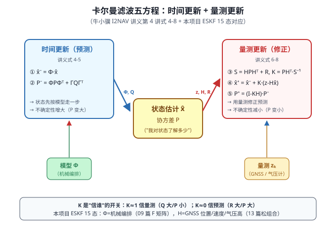
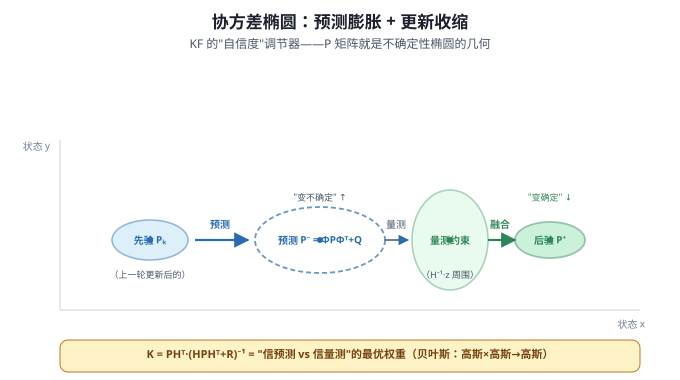
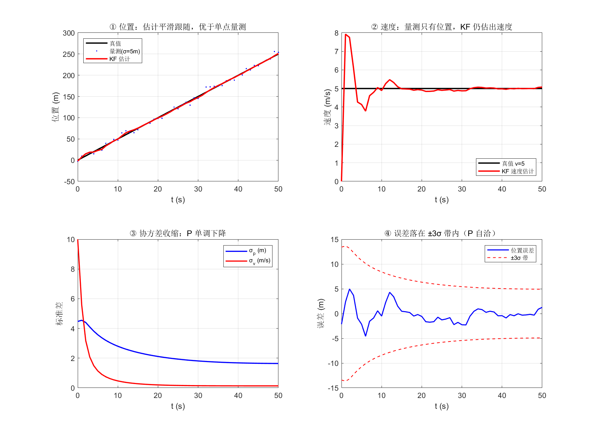

# 10 卡尔曼滤波基础——从"纯惯导必发散"到"组合导航最优估计"

> **M3 组合导航篇开篇**。前几篇（06-09）解了"惯导怎么算、怎么发散"；本篇回答**"如何修正发散"**——答案是卡尔曼滤波。
>
> **参考体系**：本篇核心锚定 **牛小骥 I2NAV 组合导航讲义第 4 讲 · GNSS/INS 松组合算法设计**（武汉大学，2021）第 1 节"卡尔曼滤波"（式 1-8）+ 第 2 节"误差状态 KF"（式 9-10，正是本项目 ESKF 15 态的源头）。代码对照：PSINS `base/kf/` 工具箱（`kfinit`/`kfupdate`/`ekf`），本项目固件 `ins_eskf_15d.c`（Joseph 形式协方差更新）。
>
> 📚 **牛小骥 I2NAV 讲义第 4 讲 PDF**：[4-GNSS、INS松组合算法设计.pdf](../assets/I2NAV组合导航讲义/4-GNSS、INS松组合算法设计.pdf)

## 一、为什么需要滤波



09 篇证明：**纯惯导必发散**——陀螺零偏让位置线性漂移，1 小时漂 1 海里。怎么办？引入**外部量测**（GNSS 位置、气压高程、里程计等）修正。但量测有噪声，纯惯导模型有缺陷，**怎么"信谁"**？

**卡尔曼滤波（Kalman Filter, KF）** 是这个问题的最优答案——它是一切组合导航算法的数学基石。

**贝叶斯视角**：

$$
\underbrace{p(\mathbf x \mid \mathbf z)}_{\text{后验}} \propto \underbrace{p(\mathbf z \mid \mathbf x)}_{\text{似然（量测）}} \cdot \underbrace{p(\mathbf x)}_{\text{先验（预测）}}
$$

读作"**修正后的信念 ∝ 量测告诉你 × 我之前认为的**"。在线性高斯假设下，这个更新有**闭式解**——就是卡尔曼的五个方程。

## 二、KF 五个方程（牛小骥讲义第 4 讲式 4-8）

设系统状态 $\mathbf x_k$、量测 $\mathbf z_k$ 服从线性高斯模型：

$$
\begin{cases}
\mathbf x_k = \boldsymbol\Phi_{k/k-1}\,\mathbf x_{k-1} + \boldsymbol\Gamma_{k-1}\,\mathbf w_{k-1} & \text{（状态方程）} \\
\mathbf z_k = \mathbf H_k\,\mathbf x_k + \mathbf v_k & \text{（量测方程）}
\end{cases}
$$

其中 $\mathbf w_k\!\sim\!\mathcal N(0,\mathbf Q_k)$、$\mathbf v_k\!\sim\!\mathcal N(0,\mathbf R_k)$ 互不相关。**一个滤波周期**分两步：

### 时间更新（预测，"往前走一步"）

$$
\boxed{\;\hat{\mathbf x}_k^{-} = \boldsymbol\Phi_{k/k-1}\,\hat{\mathbf x}_{k-1}\;}
\qquad
\boxed{\;\mathbf P_k^{-} = \boldsymbol\Phi_{k/k-1}\,\mathbf P_{k-1}\,\boldsymbol\Phi_{k/k-1}^\top + \boldsymbol\Gamma_{k-1}\,\mathbf Q_{k-1}\,\boldsymbol\Gamma_{k-1}^\top\;}
$$

> ① 状态按模型推一步；② 不确定性**增大**（P 膨胀，源于模型噪声 Q）

### 量测更新（修正，"用新息折中"）

$$
\boxed{\;\mathbf S_k = \mathbf H_k\,\mathbf P_k^{-}\,\mathbf H_k^\top + \mathbf R_k\;}
\qquad
\boxed{\;\mathbf K_k = \mathbf P_k^{-}\,\mathbf H_k^\top\,\mathbf S_k^{-1}\;}
$$

$$
\boxed{\;\hat{\mathbf x}_k = \hat{\mathbf x}_k^{-} + \mathbf K_k\,\underbrace{(\mathbf z_k - \mathbf H_k\,\hat{\mathbf x}_k^{-})}_{\text{新息 } \mathbf r_k}\;}
\qquad
\boxed{\;\mathbf P_k = (\mathbf I - \mathbf K_k\,\mathbf H_k)\,\mathbf P_k^{-}\;}
$$

> ③ 新息协方差 S；④ 增益 K（"信谁"的权重）；⑤ 状态用新息修正 + P **收缩**

**一个直击本质的观察**：`K = PHᵀ·(HPHᵀ+R)⁻¹` —— 当 R → 0（量测极准），K → PH⁻¹H⁻ᵀ，滤波器全信量测；当 P → 0（预测极准），K → 0，全信预测。**K 是最优折中的解析表达**。

## 三、推导要点（最小均方误差）

为什么 K 长这样？两个独立思路殊途同归：

| 思路 | 核心 |
|---|---|
| **正交投影（线性估计）** | 估计误差 $\tilde{\mathbf x} = \mathbf x - \hat{\mathbf x}$ 与量测噪声正交 ⟹ 最小 MSE ⟹ K 解出 |
| **高斯 × 高斯（贝叶斯）** | 两个高斯密度相乘，方差项调和平均：$\mathbf P^{-1} = \mathbf P_0^{-1} + \mathbf H^\top\mathbf R^{-1}\mathbf H$ ⟹ 等价 K |

> **实用提醒**：实现 KF 时不要自己写推导版公式——用上面的五个"教科书"形式，**且协方差更新必须用 Joseph 形式** $\mathbf P = (\mathbf I-\mathbf K\mathbf H)\mathbf P(\mathbf I-\mathbf K\mathbf H)^\top + \mathbf K\mathbf R\mathbf K^\top$（数值稳定）。本项目 `ins_eskf_15d.c:348,408` 就是 Joseph 实现。

## 四、直觉理解



**三个核心直觉**：

1. **P 是"我对状态了解多少"的度量**：P 大椭圆=不确定；P 小椭圆=自信。**预测**让椭圆**沿运动方向拉长**（Q 注入），**更新**让椭圆**收缩**（量测约束 + 新息加权）。
2. **K 是"信谁"的开关**：K 大信量测（量测噪声小 R、预测 P 大）、K 小信预测（P 小 或 R 大）。
3. **新息 $\mathbf r = \mathbf z - \mathbf H\hat{\mathbf x}$** 是"现实与预测的差"，KF 把新息按 K 加权后修正状态——本质上就是"把不一致的部分折中地改回去"。

**贝叶斯几何理解**：先验高斯 × 量测似然高斯 → 后验高斯（**两者相乘**）。相乘后高斯的均值是两者加权，方差是两者倒数和的倒数——这就是 K 的几何来源。

## 五、一维手算例子（双轨验证）

**场景**：物体匀速直线运动 $p(t) = v_0 t$（$v_0 = 5$ m/s），**量测只给位置**（带噪 $\sigma_z = 5$ m）。状态 $\mathbf x = [p; v]$，$\boldsymbol\Phi = \begin{bmatrix}1&\Delta t\\0&1\end{bmatrix}$，$\mathbf H = [1, 0]$。

跑 50 步 KF 显式循环（`assets/gen_kf1d.m` + `gen_kf1d_py.py` 双轨验证，**字节级一致**）：



**四个观察**（直接对应图上 4 个子图）：

| 子图 | 现象 | 教学点 |
|---|---|---|
| ① 位置 | 红线（KF）紧贴黑线（真值），远比蓝点散布（量测）平滑 | **KF 估计误差 < 单点量测噪声**（本例 1.64m vs 5m） |
| ② 速度 | 红线从 0 起步振荡后稳到 5.08 m/s | **量测只有位置，KF 仍能估出速度**（状态耦合的魔法） |
| ③ 协方差 | σ_p 从 5→1.64、σ_v 从 10→0.1 单调收缩 | **P 是"自信度"的演化**——量测积累 → 越来越确定 |
| ④ 误差 + 3σ 带 | 蓝误差线全在红虚带内 | **P 自洽**——滤波既不"过度自信"（带太窄）也不"过度悲观"（带太宽） |

**关键数字**：
- 量测噪声 σ_z = 5 m；**KF 位置估计稳态 σ_p ≈ 1.64 m**（量测的 33%）
- 速度 50s 估到 5.08 m/s（真值 5.00），最终误差 1.26 m

## 六、PSINS 演示（KF 标准实现）

```matlab
% kfinit：15 态（位置/速度/姿态误差 + bg/ba 零偏），对应本项目 ESKF
davp0 = avperrset([0.5;0.5;5]*glv.min, ...   % 失准角 5'/0.5'/0.5'
                  0.1, [10;10;10]);             % 速度 0.1m/s, 位置 10m
imuerr = imuerrset(0.01, 100, 0.001, 10);    % 陀螺 0.01°/h, 加计 100ug
rk = [10;10;10;0.1;0.1;0.1];                  % GNSS 位置 10m, 速度 0.1m/s

kf = kfinit(ins, davp0, imuerr, rk);          % 初始化（自动设 Qt/Rk/Pxk/Hk）
% kf 结构：Phikk_1（Φ）、Gammak（Γ）、Qk、Rk、Pxk、Hk 等

for k = 1:N
    kf = kfupdate(kf, zGNSS(k,:), 'T');       % 纯时间更新（1000Hz IMU）
    if mod(k, 100) == 0
        kf = kfupdate(kf, zGNSS(k/100,:), 'M'); % 量测更新（10Hz GNSS）
        x = kffeedback(kf, avp);                % 反馈误差到状态
    end
end
```

> 💡 **PSINS 的 `kfupdate` 用 `'T'`/`'M'`/`'B'` 控制三种模式**：T=纯时间更新、M=纯量测更新、B=两者都做。本项目 ESKF 1 kHz IMU + 10Hz GNSS 实际就是 T+B 交替。

## 七、与本项目 ESKF 15 态关系

**本项目 `ins_eskf_15d.c` 严格对应 KF 五方程**（15 态 = 位置/速度/姿态误差 + bg + ba）：

| 讲义第 4 讲式 | 物理 | 固件实现位置 |
|---|---|---|
| 式 9 状态定义 $\delta\mathbf x = [\delta r, \delta v, \phi, b_g, b_a]^T$ | 15 态误差态 | `eskf15_nom` 结构（globals） |
| 式 10 $\delta\dot{\mathbf x} = \mathbf F\delta\mathbf x + \mathbf G\mathbf w$ | 连续系统方程 | `eskf15_predict` 离散化 |
| 时间更新 Φ | **机械编排 F 矩阵**（09 篇式 22） | `eskf15_predict`:225-237 |
| 量测更新 H, R | **GNSS 位置/速度/气压高**（13 篇松组合） | 后续 13 篇展开 |
| 协方差更新 | **Joseph 形式** $\mathbf P = (\mathbf I-\mathbf K\mathbf H)\mathbf P(\mathbf I-\mathbf K\mathbf H)^\top + \mathbf K\mathbf R\mathbf K^\top$ | `ins_eskf_15d.c:348,408` |

**固件 15 态的"约定"**：不用 $[r, v, \text{姿态}, b_g, b_a]$ 的全量（19 态），而是 **误差态** $[δ\mathbf q \to \boldsymbol\phi, δ\mathbf v, δ\mathbf p, δb_g, δb_a]$——这就是**误差状态卡尔曼（ESKF）**，讲义第 4 讲 2.1 节开篇点明："GNSS/INS 松组合常采用误差状态卡尔曼滤波（间接卡尔曼滤波）进行组合导航解算，以解决系统的非线性问题"。ESKF 的好处（11 篇展开）：姿态在小角度下线性化、协方差始终在合理范围、反馈是小量更稳定。

## 八、常见坑

1. **协方差用朴素 $\mathbf P = (\mathbf I-\mathbf K\mathbf H)\mathbf P$ 而非 Joseph**：看似更简洁，实际会破坏对称性、累积误差 → 滤波器发散。**永远用 Joseph**（固件 348/408 行）
2. **混淆"P 先验/后验"符号**：$\mathbf P_k^{-}$ 是"预测后/量测前"（预测步结束，量测步未开始），$\mathbf P_k$ 是量测更新后——别混。下标减号永远表示"量测前"
3. **P 必须对称**：每个更新后调用 `msym(P)` 强制对称（固件 `ins_eskf_15d.c:117`），否则舍入误差会让 P 慢慢不对称
4. **Q/R 单位必须统一**：Q 用 $(\text{状态量单位})^2$ 标幺，R 用 $(\text{量测量单位})^2$。陀螺噪声 $\text{°/h}/\sqrt{\text{Hz}}$ 要转 $\text{rad/s}$ 后平方进 Q
5. **dt 不一致导致灾难**：F 矩阵的离散化假设了固定 dt（$\Phi = \mathbf I + \mathbf F\Delta t$），可变采样率需要重算或用变周期 KF
6. **非线性系统强行用线性 KF**：姿态、位置都在球面上，必须用 ESKF（误差态）或 UKF。直接对全量做 KF 会发散
7. **初始 P 设太小**：发散"信自己"。太大会被单个 outlier 量测带偏。建议 $P_0 \sim 10 \times \text{过程噪声方差}$（5 倍"无知度"）

## 九、自测题

1. KF 五个方程按"预测/修正"分组，哪两个属于预测、哪三个属于修正？物理上分别对应什么操作？
2. 增益 $K = PH^\top(HPH^\top+R)^{-1}$ 的两个极限：①R→0 时 K=？②P→0 时 K=？分别说明"信谁"
3. 为什么"协方差更新"必须用 Joseph 形式？朴素 $(\mathbf I-\mathbf K\mathbf H)\mathbf P$ 看似等价，为什么实际会发散？
4. 简述"贝叶斯视角"：先验、似然、后验的关系。KF 在什么假设下得到闭式解？
5. **新息 $\mathbf r = \mathbf z - \mathbf H\hat{\mathbf x}^-$ 是什么？** 它在 KF 中扮演什么角色？如果新息恒为零会怎样？
6. 本项目 ESKF 用 15 态 $[δ\mathbf q, δ\mathbf v, δ\mathbf p, δb_g, δb_a]$ 而非全量 19 态——讲义 2.1 节说是为了"解决非线性问题"。**为什么误差态能解决非线性？** 全量 KF 在姿态上会出什么问题？
7. 一维 KF 例子中，量测噪声 σ=5m、初始协方差 P₀=diag(100,100)。收敛后 P∞ 一定比 P₀ 小吗？如果 P₀ 已经很准（比如 diag(1,1)），收敛后 P∞ 还会变小吗？物理直觉解释。

??? note "📐 参考答案"

    1. 预测：①状态 x̂⁻=Φx̂、②协方差 P⁻=ΦPΦᵀ+ΓQΓᵀ（按模型走一步，不确定性膨胀）；修正：③S=HPH'+R、④K=PH'S⁻¹、⑤x̂⁺=x̂⁻+K·r、P⁺=(I-KH)P⁻（用新息折中，不确定性收缩）。
    2. R→0: K→H⁻¹（量测极准→全信量测 x̂→H⁻¹z）；P→0: K→0（预测极准→全信预测 x̂⁺→x̂⁻）。**K 是"信谁"的几何平均**——R 和 P 都是不确定性的倒数，K 在两者间按精度加权。
    3. Joseph 形式 $P = (I-KH)P(I-KH)' + KRK'$ 数值上等价于朴素 $(I-KH)P$，但**对舍入误差稳定**——朴素形式会让 P 慢慢不对称、特征值负，最终 P 失去协方差意义导致发散。Joseph 通过保持对称性和正定性"重置"协方差。本项目 348/408 行就是 Joseph。
    4. 先验×似然 ∝ 后验（贝叶斯定理）；KF 在 **线性系统 + 高斯噪声** 假设下得到闭式解（高斯×高斯仍是高斯）。非线性或非高斯要用 EKF/UKF/PF。
    5. 新息是"现实与预测的不一致"——KF 的核心信号。如果新息恒为零，说明模型和量测完美一致（理想情况），滤波器无更新；如果新息统计异常（新息 > 3σ），是**量测 outlier**——可以做 χ² 检验拒绝更新（鲁棒 KF）。
    6. 误差态用"小量 = 真值 - 估计"建模。姿态大角度下 sin/cos 非线性、4 元数流形约束；小角度 $\phi = 2\log(\delta q)$ 是 3 维向量、线性。**全量 KF 在姿态上会违反流形**（四元数不再单位）；误差态 KF 始终维护"小量 + 全量参数化"。讲义式 9 就是这个约定的标准表述。
    7. **会收敛，但极限值更小且更慢**——P₀=diag(1,1) 表示已经知道初值，KF 不需要"学"太多。如果 P₀ 已接近 σ²≈25/4=6.25（与量测精度匹配），稳态几乎不变；如果 P₀ 比稳态小，**KF 会让 P 增长**（"我以为很准，但量测告诉我不够准"——P 会自动调到与 Q+R 平衡的稳态）。这是 KF 的**自适应**——初始 P 设小了它会自动"放宽"。

---

**参考体系**

- **牛小骥 I2NAV 组合导航讲义（武汉大学，2021）**第 4 讲 · GNSS/INS 松组合算法设计：[PDF](../assets/I2NAV组合导航讲义/4-GNSS、INS松组合算法设计.pdf)——式 1-8 卡尔曼滤波、式 9 误差状态定义、式 10 连续系统方程（直接锚定本篇）
- **PSINS**：`base/kf/kfinit.m`（15/18/183/193 多种态数初始化）、`base/kf/kfupdate.m`（T/M/B 三模式五方程实现）、`base/kf/ekf.m`（非线性 EKF 框架）、`demos/test_SINS_GPS_153.m`（GNSS/INS 松组合完整示例——13 篇模板）
- **本项目**：`ins_eskf_15d.c:225-237`（Φ 矩阵 = 09 篇 F 矩阵离散化）、`:348,408`（Joseph 形式协方差更新）、ESKF 15 态 $\delta\mathbf x = [\phi, \delta v, \delta p, b_g, b_a]$
- **上一篇**：[09 纯惯导误差传播](../02_解算篇/09_纯惯导误差传播.md)——纯惯导必发散，引出"需要量测修正"
- **下一篇**：[11 EKF 与 ESKF](11_EKF与ESKF.md)——KF 只能处理线性 → 雅可比扩展 → 为什么惯导不用直接法（姿态流形）
- **系列首页**：[惯性导航与惯导解算 · 自学科普系列](../index.md)