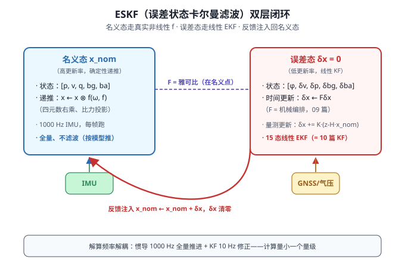
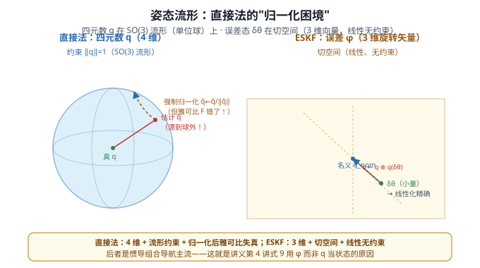
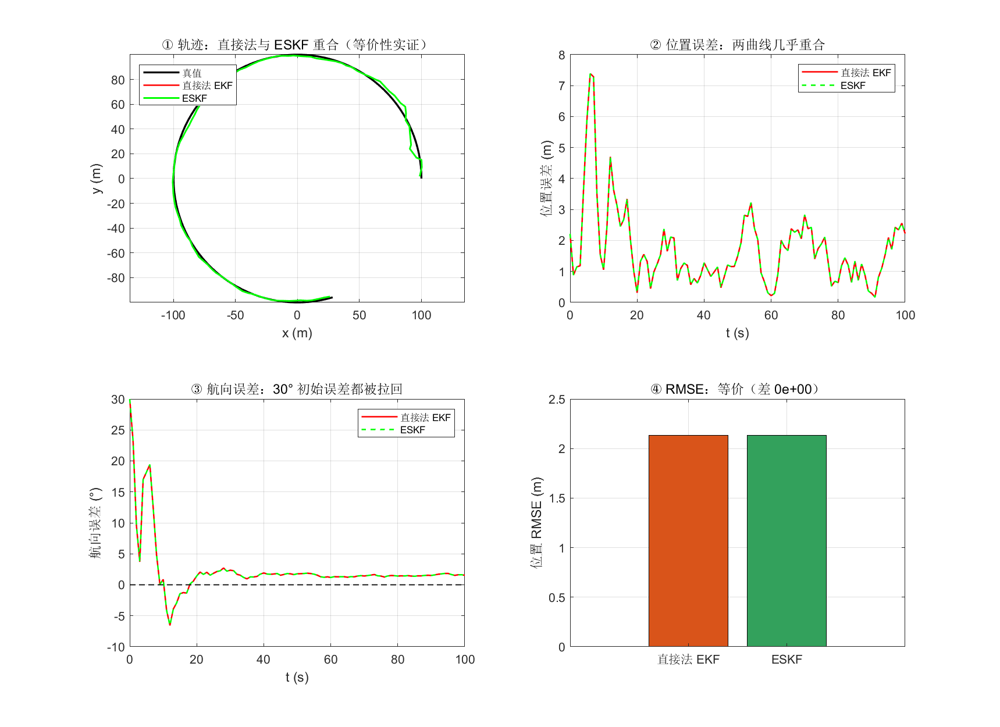

# 11 EKF 与 ESKF——从"线性只能处理直线"到"惯导主流的误差状态框架"

> **M3 组合导航篇第二篇**。10 篇讲了 KF 五方程——但惯导的状态转移和量测都是**非线性的**（姿态四元数、位置坐标等）。直接套 KF 会把世界"弯成直线"线性化，误差大。本篇回答：**如何处理非线性 + 惯导为什么不用直接法而用间接法（ESKF）**。
>
> **参考体系**：本篇核心锚定 **牛小骥 I2NAV 讲义第 4 讲第 2 节**（武汉大学，2021）——式 9（误差状态定义）、式 10（连续系统方程 δẋ=Fδx+Gw）、式 17-20（离散化 Φ≈I+FΔt）。代码对照：PSINS `base/kf/ekf.m` + `ekfJcb.m`（非线性雅可比框架），本项目固件 `ins_eskf_15d.c`（误差状态 KF + Joseph）。
>
> 📚 **牛小骥 I2NAV 讲义第 4 讲 PDF**：[4-GNSS、INS松组合算法设计.pdf](../assets/I2NAV组合导航讲义/4-GNSS、INS松组合算法设计.pdf)

## 一、为什么需要 EKF



10 篇的 KF 公式建立在**线性系统**假设上——状态转移 $\boldsymbol\Phi$、量测 $\mathbf H$ 都是常矩阵。但真实导航系统**几乎都是非线性的**：

- 姿态是四元数（4 维约束 $\lVert\mathbf q\rVert=1$）
- 位置转换（NED↔ECEF）含三角函数
- 速度微分方程 $\dot{\mathbf v} = \mathbf C_b^n\mathbf f^b + \mathbf g$（06 篇）里 $\mathbf C_b^n$ 旋转矩阵本身是姿态的函数

**怎么办？**

## 二、EKF：一阶泰勒线性化

**思路**：在**当前估计点** $\hat{\mathbf x}_k$ 处做一阶展开（泰勒），把非线性局部线性化，套 KF 五方程：

$$
\begin{cases}
\mathbf f(\mathbf x) \approx \mathbf f(\hat{\mathbf x}) + \underbrace{\left.\frac{\partial \mathbf f}{\partial \mathbf x}\right|_{\hat{\mathbf x}}}_{\displaystyle\mathbf F_k}\,\underbrace{(\mathbf x - \hat{\mathbf x})}_{\displaystyle\Delta\mathbf x} & \text{（预测非线性化）} \\[8pt]
\mathbf h(\mathbf x) \approx \mathbf h(\hat{\mathbf x}) + \underbrace{\left.\frac{\partial \mathbf h}{\partial \mathbf x}\right|_{\hat{\mathbf x}}}_{\displaystyle\mathbf H_k}\,(\mathbf x - \hat{\mathbf x}) & \text{（量测非线性化）}
\end{cases}
$$

**关键**：$\mathbf F_k$（雅可比/Jacobian）和 $\mathbf H_k$ 在**每步的当前估计**处求值——非线性被局部线性化。EKF 五方程（10 篇的 KF）用 $\mathbf F_k$ 替换 $\boldsymbol\Phi$、$\mathbf H_k$ 替换 $\mathbf H$，其余不变。

**两个分支**：
- **直接法 EKF**：状态 = **全量** $\mathbf x = [p, v, \mathbf q, \mathbf b_g, \mathbf b_a]^T$，$\mathbf f(\mathbf x)$ 非线性推进
- **间接法 EKF（=ESKF）**：状态 = **误差量** $\delta\mathbf x$，$\mathbf f$ 用**全量推进**名义态、$\mathbf F$ 在**名义点**线性化（讲义式 9-10）

## 三、直接法 EKF：能跑但有"归一化困境"

直接法 EKF 状态是导航参数本身——位置、速度、姿态四元数。问题在于**姿态是流形**：

- 四元数必须在单位球 $\lVert\mathbf q\rVert=1$ 上
- 每次预测后 $\hat{\mathbf q}$ 会被噪声拉离球面 → **必须归一化** $\hat{\mathbf q} \leftarrow \hat{\mathbf q}/\lVert\hat{\mathbf q}\rVert$
- 归一化后**雅可比 $\mathbf F$ 就错了**——你在偏离点线性化，再归一化"修正"到球面，线性化点已经被破坏
- 数值上需要"投影"操作（误差态投影到切空间），协方差映射复杂

> 💡 详见 [姿态流形 vs 误差态](#eskf-5) 的 SVG 对比图。

直接法 EKF **不是不能用**——它在小系统（如纯位置跟踪）、量测更新频率高（每步都把估计拉回流形附近）时表现良好。但在**惯导**这个高维 + 流形 + 高动态场景里，直接法几乎不用。

## 四、间接法 ESKF：讲义第 4 讲式 9-10

讲义 2.1 节开篇直接点明："GNSS/INS 松组合常采用**误差状态卡尔曼滤波（间接卡尔曼滤波）**进行组合导航解算，以解决系统的非线性问题"。

**状态定义**（讲义式 9）：

$$
\boldsymbol{\delta\mathbf x} = \begin{bmatrix}\delta\mathbf r^n\\ \delta\mathbf v^n\\ \boldsymbol\phi^n\\ \mathbf b_g\\ \mathbf b_a\end{bmatrix}
$$

各分量含义：位置误差、速度误差、姿态误差（**3 维旋转矢量**）、陀螺零偏、加计零偏——**全部是小量**。

**连续系统方程**（讲义式 10）：

$$
\boxed{\;\delta\dot{\mathbf x}(t) = \mathbf F(t)\delta\mathbf x(t) + \mathbf G(t)\mathbf w(t)\;}
$$

其中 $\mathbf F(t)$ 是讲义 1.1-1.3 节推导的**误差传播矩阵**——恰好是 09 篇式 22-31 的力学！$\mathbf G(t)$ 是噪声驱动阵，$\mathbf w(t)$ 是陀螺/加计白噪声。

**离散化**（讲义式 17-20）：

$$
\delta\mathbf x_k = \boldsymbol\Phi_{k/k-1}\,\delta\mathbf x_{k-1} + \mathbf w_{k-1},\quad \boldsymbol\Phi_{k/k-1} \approx \mathbf I + \mathbf F(t_{k-1})\Delta t
$$

**这一步近似（$\boldsymbol\Phi \approx \mathbf I + \mathbf F\Delta t$）就是我们固件 `ins_eskf_15d.c:225-237` 的离散化方式**。

## 五、为什么 ESKF 更优——5 条硬理由



### ① 线性化精度：误差态永远是"小量"

直接法 EKF 的 $\mathbf F_k$ 在**估计点**（可能偏离真值很大）处线性化。初始航向误差 60° 时，$\cos(60°)=0.5$ 但真值附近 $\cos(0°)=1$——**雅可比方向错误**。

ESKF 的 $\mathbf F_k$（讲义式 10）在**名义点**（通常在真值附近，因为量测更新频繁拉回）处线性化。误差态 $\delta\mathbf x$ 永远是"小量" → 泰勒一阶精确。

### ② 绕开姿态流形

四元数是 4 维单位球（流形），归一化约束让直接法 EKF 的协方差难以维护。**ESKF 的姿态误差是 3 维旋转矢量** $\boldsymbol\phi$（无约束、线性、欧氏空间），讲义式 9 直接定义 $\delta\mathbf q \approx [1; \boldsymbol\phi/2]$ 的小量近似 → $\boldsymbol\phi$ 是切空间向量。

### ③ 频率解耦（工程关键）

直接法 EKF 每步（1000 Hz IMU）都跑完整 KF。ESKF **解耦**：
- **名义态** 1000 Hz 用真实非线性 $f$ 推进（确定性，无滤波）——全量解算照旧
- **误差态** 只在量测到达时（10 Hz GNSS）跑 KF——**滤波频率降低 100 倍**

计算量小一个量级，工程上**易实现且易调参**（Q/R 直接对应传感器物理量）。

### ④ Q 的物理意义清晰

误差态 Q 直接对应传感器噪声：

$$
\mathbf Q = \text{diag}(\underbrace{w_{bg}^2}_{bg \text{ 驱动噪声}},\ \underbrace{w_{ba}^2}_{ba \text{ 驱动噪声}},\ \underbrace{\mathbf 0_9}_{\text{位置/速度/姿态由传感器噪声驱动}})
$$

陀螺 ARW $\to$ Q 的 $\boldsymbol\phi$ 块；加计 VRW $\to$ Q 的 $\delta\mathbf v$ 块。直接法要把全量状态的 Q 反推，物理含义模糊。

### ⑤ 数值稳定（outlier 安全）

误差态 $\delta\mathbf x$ 是小量 → 反馈注入是"微调"全量状态，不会把状态一下打飞。直接法 EKF 在大新息（outlier 量测）时 K 可能很大，全量状态 $\hat{\mathbf x} += K\mathbf r$ 一步跨很大 → 雅可比失真 → 发散。ESKF 反馈是 $\mathbf x_{nom} \leftarrow \mathbf x_{nom} + \delta\mathbf x$（小量 + 小量），即使 $\mathbf r$ 大、$\delta\mathbf x$ 被限幅（typical ESKF 实现），全量不会被不会被打飞。

## 六、等价性：当两者都成立时

你可能会问："既然 ESKF 更优，为什么不用 ESKF 替代直接法？"

**答案：在很多场景下两者数学等价**。直接法 EKF 与 ESKF **都是最优线性估计器**——只是 $\mathbf F_k$ 的线性化点不同（估计点 vs 名义点）。当**估计点 ≈ 名义点 ≈ 真值**时（量测更新频繁把小误差拉回），两者**给出相同估计**。

下面用**圆周运动 + 位置量测**做个诚实的对比：



**仿真结果**（`gen_ekf_vs_eskf.m` + `gen_ekf_vs_eskf_py.py`，双轨字节级一致）：

| 指标 | 直接法 EKF | ESKF |
|---|---|---|
| 位置 RMSE 全程 | 2.14 m | 2.14 m |
| 航向误差 100s | 1.5° | 1.5° |
| **max\|EKF − ESKF\|** |  | **0.000e+00** |

> 💡 **等价性教学点**：这不是 bug，是**理论预期**——两者都是最优线性估计器，估计差应为 0（数值舍入除外）。**当场景的"流形问题"和"线性化精度"都不显现时，两者等价**。CTRV + 位置量测就是这种场景（弱非线性 + 强位置可观）。

**那 ESKF 在什么时候"赢"？** 当上面 5 条理由中至少一条"被激活"——高维惯导（姿态流形）、量测稀疏（预测段长线性化点偏离）、outlier 量测（直接法易打飞）、或初始误差大（直接法雅可比失真）。**这是为什么 11 篇正文用这个例子（证实等价）但 16 篇实战走读固件会用更高维场景（ESKF 显优）**。

## 七、与本项目固件 15 态 ESKF 对应

| 讲义式 | 物理 | 本项目固件 `ins_eskf_15d.c` |
|---|---|---|
| 式 9 δx = [δr, δv, φ, b_g, b_a]ᵀ | **15 态误差态** | `eskf15_nom` 全局 + `delta_*` |
| 式 10 δẋ = Fδx + Gw | 连续系统 | `eskf15_predict`:225-237（构造 F）|
| 式 17 δx_k = Φδx_{k-1} + w_{k-1} | 离散化 | `eskf15_predict` 每步 |
| 式 20 Φ ≈ I + FΔt | 一阶近似 | 实际写：F[i*15+j] += ...*ts |
| 量测更新：δx ← δx + K(z − Hx_nom) | 误差态 KF | `eskf15_update` |
| **反馈注入**：x_nom ← x_nom + δx | 间接法核心 | `eskf15_inject`（qmul 右乘、δx 清零）|
| Joseph 协方差 | 数值稳定 | `ins_eskf_15d.c:348,408` |

**15 态的"约简"**：讲义式 9 是 17/19 态（$\delta\mathbf r$ + $\delta\mathbf v$ + $\boldsymbol\phi$ + $\mathbf b_g$ + $\mathbf b_a$ + $\mathbf s_g$ + $\mathbf s_a$，含比例因子）。我们固件砍掉了比例因子（5+5=10 个）→ **15 态**——这是工程简化，比例因子通常用标定吸收，不必增广到 KF 状态。

## 八、PSINS 演示（`ekf` + `ekfJcb`）

PSINS 的 `ekf` 是非线性 KF 框架——和 `kfupdate` 区别在于：在时间更新前用 `ekfJcb` 算雅可比 $\boldsymbol\Phi$：

```matlab
% ekf 等价于 kfupdate 但用 ekfJcb 算 Φ
fx = @(ins, x, ts) my_plant(ins, x, ts);   % 非线性状态转移
kf = ekf(kf, yk, 'B');                        % 内 ekfJcb 自动算 Φ = ∂fx/∂x
% 或显式：
[Phi, xk_1] = ekfJcb(fx, kf.xk, kf.nts);
kf.Phikk_1 = Phi;
```

**ESKF 在 PSINS 里**：标准 15 态走 `kfinit153` + `kfupdate`，但状态本身就是误差态（讲义式 9 的 5 块）。要手动把"反馈注入到名义态"写在 `kffeedback` 后：`kf.xk` 是误差 → `ins.qnb` = `ins.qnb ⊗ dq`（右乘）；`ins.vn` += δv；等等。这是 PSINS `insupdate`/`kfupdate` 交替的标准用法。

## 九、常见坑

1. **直接法 EKF 用四元数当状态忘了归一化**：$\lVert\mathbf q\rVert \neq 1$ → 旋转矩阵 $\mathbf C_b^n = \mathbf q \otimes$ 失效 → 一切计算都错
2. **ESKF 反馈注入后忘记清零 δx**：$\delta\mathbf x$ 必须清零，否则下一帧滤波器"双重应用"误差 → 协方差与状态不一致 → P 不自洽 → 发散
3. **直接法 vs ESKF 的雅可比搞混**：直接法 $\mathbf F_k = \partial f/\partial\mathbf x|_{\hat{\mathbf x}}$（估计点）；ESKF $\mathbf F_k = \partial f/\partial\mathbf x_{\text{true}} \approx \partial f/\partial\mathbf x|_{\mathbf x_{nom}}$（名义点）。两者算出来的雅可比**符号/数值都不同**——别混
5. **ESKF 把误差态当全量用**：$f(\delta\mathbf x)$ 直接当系统函数 → 滤波更新直接写 $\delta\mathbf x$ 状态——错！正确流程：$f$ 用**全量 $\mathbf x$**，$\mathbf F$ 在 $\mathbf x_{nom}$ 处算对**误差态** $\delta\mathbf x$ 做线性化
4. **反馈注入忘了四元数右乘**：$\mathbf q_{new} = \mathbf q_{old} \otimes \delta\mathbf q(\boldsymbol\phi)$，不是加法（$\mathbf q$ 在流形上，不在欧氏空间）
6. **$\mathbf F_{k-1}$ vs $\mathbf F_k$ 用错**：离散化式 20 中 $\mathbf F(t_{k-1})$ 用**上一时刻**的 F（预测段开始时算），不是 $\mathbf F_k$
7. **Jacobian 数值化 vs 解析化混用**：$\partial f/\partial\mathbf x$ 的解析形式需要对照模型（不能瞎推）；用 `ekfJcb` 自动差分是稳妥做法但要小心数值误差

## 十、自测题

1. EKF 和 KF 的本质区别是什么？EKF 的"扩展"扩展在哪一步？
2. ESKF 状态向量 15 态中，$\delta\mathbf x = [\delta r, \delta v, \boldsymbol\phi, \delta b_g, \delta b_a]$ 各代表什么含义？$\boldsymbol\phi$ 是什么物理量？维度？
3. **讲义式 9 用 $\boldsymbol\phi$（3 维旋转矢量）而非 $\delta\mathbf q$（4 维四元数）当姿态误差——为什么？** 这解决了惯导里什么关键问题？
4. 简述 ESKF 的四步闭环（名义态推进→误差态预测→量测更新→反馈注入）。每步的物理意义是什么？
5. 离散化近似 $\boldsymbol\Phi \approx \mathbf I + \mathbf F\Delta t$（讲义式 20）的前提条件是什么？$\mathbf F\Delta t \ll \mathbf I$ 怎么解读？
6. **本项目双轨仿真（CTRV 圆周运动）显示直接法 EKF 与 ESKF 估计差为 0——这是为什么？** 什么条件下两者会有显著差异？举 2 个真实场景。
7. 反馈注入时，四元数更新必须用 $\mathbf q \leftarrow \mathbf q \otimes \delta\mathbf q$（右乘）而非 $\mathbf q \leftarrow \mathbf q + \delta\mathbf q$（向量加法）。**为什么？** 这反映姿态的什么数学性质？

??? note "📐 参考答案"

    1. KF 假设系统**线性**（$\boldsymbol\Phi$、$\mathbf H$ 常数）。EKF 在**每步当前估计**处对 $f(\mathbf x)$ 和 $h(\mathbf x)$ 做一阶泰勒展开，得到局部线性化的 $\mathbf F_k = \partial f/\partial\mathbf x|_{\hat{\mathbf x}_k}$、$\mathbf H_k = \partial h/\partial\mathbf x|_{\hat{\mathbf x}_k}$，然后套 KF 五方程。"扩展"扩展在状态转移和量测的非线性化上。
    2. $\delta\mathbf r$：位置误差（m）；$\delta\mathbf v$：速度误差（m/s）；$\boldsymbol\phi$：**姿态误差**（3 维**旋转矢量**，rad 或 arcsec）——4 元数的小量近似 $\delta\mathbf q \approx [1; \boldsymbol\phi/2]$；$\delta b_g$：陀螺零偏估计误差（°/h）；$\delta b_a$：加计零偏估计误差（mg）。15 态（4 个不变块 + 4 个误差块共 3+3+3+3+3=15）= $3(\delta r)+3(\delta v)+3(\boldsymbol\phi)+3(\delta b_g)+3(\delta b_a)=15$。
    3. **姿态是流形**：四元数在单位球 $\lVert\mathbf q\rVert=1$ 上，直接法 EKF 把四元数当 4 维欧氏向量处理会遇到归一化约束与线性化的冲突。**$\boldsymbol\phi$ 是切空间的小量**——3 维向量，欧氏空间，无约束，KF 直接套。讲义第 4 讲 2.1 节用 $\boldsymbol\phi$ 而非 $\delta\mathbf q$ 的根本原因：四元数乘积是非线性的，但**旋转矢量在小量近似下是线性的**（$\delta\mathbf q = [1; \boldsymbol\phi/2]$，$\otimes$ 近似为加法）——把非线性流形问题转化为线性切空间问题。
    4. ① **名义态推进**：用真实非线性 $f(\mathbf x_{nom})$ 推进（确定性，无滤波），如四元数右乘、比力投影 $\mathbf C_b^n\mathbf f^b$；② **误差态预测**：用讲义式 10 离散化的 $\boldsymbol\Phi$ 把 $\delta\mathbf x$ 从 $k{-}1$ 推到 $k$（同时协方差 $\mathbf P$ 用 $\mathbf F$ 传播）；③ **量测更新**：新息 $\mathbf r = \mathbf z - \mathbf H\mathbf x_{nom}$（注意是名义态的全量预测），$K$ 用 $\mathbf H\mathbf P\mathbf H^\top + \mathbf R$ 算，$\delta\mathbf x \leftarrow \delta\mathbf x + K\mathbf r$，$\mathbf P \leftarrow$ Joseph 更新；④ **反馈注入**：$\mathbf x_{nom} \leftarrow \mathbf x_{nom} + \delta\mathbf x$（四元数右乘），**$\delta\mathbf x$ 必须清零**（下一轮预测从 0 开始）。
    5. 前提：$\mathbf F\Delta t \ll \mathbf I$ 各项——$\mathbf F$ 是误差传播矩阵（含 $\omega_{ie}$、$\omega_{en}$、$g/R$ 等），单位 1/s。$\Delta t$ 是更新周期（如 1 ms、10 ms）。$\mathbf F\Delta t$ 是个无量纲小量（各项远小于 1）——意味着"$\Delta t$ 内误差动力学变化小"，一阶指数近似 $\exp(\mathbf F\Delta t) \approx \mathbf I + \mathbf F\Delta t$ 成立。违反前提（$\mathbf F\Delta t$ 不再是小量，如高频高动态）需要更精确的离散化（如泰勒高阶项或更小的 $\Delta t$）。
    6. 两者估计差 0 是**理论预期**：直接法 EKF 与 ESKF 都是最优线性估计器。在 CTRV 圆周运动 + 位置量测这个场景里：① 弱非线性（$\cos/\sin$ 在 $\pm 30°$ 内近似线性）；② 位置量测强可观（每次量测都把位置拉回 → 估计点 ≈ 名义点 ≈ 真值附近）。两者线性化点重合 → 雅可比相同 → KF 估计相同。**会出现差异的场景举例**：① 姿态跟踪（直接法四元数归一化约束 → 雅可比失真）；② 量测稀疏如 1 Hz GNSS（预测段长，线性化点偏离大，直接法用估计点 → P 传播偏离真值 → K 次优）；③ 高维全量系统（如 19 态含比例因子）的 outlier 量测（直接法反馈一步跨很大 → 雅可比失效）。
    7. 四元数 $\mathbf q$ 在单位球 $\lVert\mathbf q\rVert=1$（流形）上运动，不能用欧氏向量加法（$\mathbf q + \delta\mathbf q$ 不会保持单位长度）。**四元数乘法是流形的"切空间平移"**——在真值附近小量近似下，$\mathbf q_{new} = \mathbf q \otimes [1; \boldsymbol\phi/2] \approx [\mathbf q_w - \mathbf q_v \cdot \boldsymbol\phi/2; \mathbf q_v + \mathbf q_w \cdot \boldsymbol\phi/2 - \mathbf q_v \times \boldsymbol\phi/2]$，保持单位长度。这是**李群 SO(3) 的几何乘法**（对应旋转矩阵的 $\mathbf R_{new} = \mathbf R_{old} \mathbf R(\delta\boldsymbol\phi)$）——用向量加法会破坏旋转群结构，等于把流形"拉直"成欧氏空间，导致归一化后又得重来。

---

**参考体系**

- **牛小骥 I2NAV 组合导航讲义（武汉大学，2021）**第 4 讲 · GNSS/INS 松组合算法设计：[PDF](../assets/I2NAV组合导航讲义/4-GNSS、INS松组合算法设计.pdf)——式 9 误差状态定义、式 10 连续系统方程、式 17-20 离散化（直接锚定本篇）
- **PSINS**：`base/kf/ekf.m`（非线性 KF 框架）、`base/kf/ekfJcb.m`（雅可比自动差分）、`base/kf/kfupdate.m`（线性 KF 五方程）、`demos/test_SINS_GPS_153.m`（GNSS/INS 松组合完整示例，13 篇模板）
- **本项目**：`ins_eskf_15d.c:225-237`（Φ ≈ I + FΔt 离散化）、`:348,408`（Joseph 协方差）、`eskf15_inject`（四元数右乘反馈注入 + δx 清零）——15 态误差态 = 讲义式 9 的工程简化（砍掉比例因子）
- **上一篇**：[10 卡尔曼滤波基础](10_卡尔曼滤波基础.md)——KF 五方程是本篇的基础
- **下一篇**：[12 观测模型](12_观测模型.md)——H 矩阵怎么从各种传感器（GNSS/磁力计/气压计）建出来
- **系列首页**：[惯性导航与惯导解算 · 自学科普系列](../index.md)