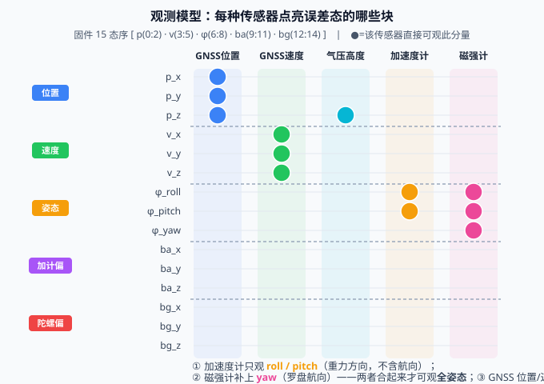

# 12 观测模型——把"传感器读数"翻译成"对 15 个误差态的约束"

> **M3 组合导航篇第三篇**。10 篇给了 KF 五方程、11 篇讲了 ESKF 的误差态框架——但"量测更新"里最关键的 **H 矩阵**还没落地。**H 是什么？它就是把"GNSS 给我一个经纬度""磁力计给我一个地磁矢量"翻译成"我的 15 个误差态里，哪些被这个读数约束了、约束多少"的那张"翻译表"**。
>
> **参考体系**：本篇锚定 **牛小骥 I2NAV 讲义第 4 讲 · GNSS/INS 松组合算法设计**（武汉大学，2021）的**量测方程** $z_k = H_k x_k + v_k$（式 1–8 框架），并把 11 篇的误差态 KF 落到每种传感器的具体 H。代码对照：本项目固件 `ins_eskf_15d.c` 的 `eskf15_update_gnss_pos/vel`、`_accel`、`_mag`、`_baro`；PSINS `base/kf/kfinit153.m`（自动布 H）+ `kfupdate`。
>
> 📚 **牛小骥 I2NAV 讲义第 4 讲 PDF**：[4-GNSS、INS松组合算法设计.pdf](../assets/I2NAV组合导航讲义/4-GNSS、INS松组合算法设计.pdf)

## 一、观测模型在 KF 里到底干啥

KF 五方程（10 篇）里，量测方程长这样：

$$
\mathbf z_k = \mathbf H_k\,\mathbf x_k + \mathbf v_k
$$

- $\mathbf z_k$：传感器这一拍给我的**读数**（比如 GNSS 位置 $[x,y,z]$）
- $\mathbf H_k$：**观测矩阵**——把"状态空间"投影到"量测空间"的翻译器
- $\mathbf v_k\sim\mathcal N(0,\mathbf R_k)$：量测噪声

**ESKF 的特殊写法**（11 篇）：状态是误差态 $\delta\mathbf x$，但量测总是量**全量**的。所以 ESKF 的量测更新其实是：

$$
\mathbf r_k = \underbrace{\mathbf z_k}_{\text{读数}} - \underbrace{\mathbf h(\mathbf x_{nom})}_{\text{用名义态算出的"预测读数"}},\qquad \mathbf H_k = \left.\frac{\partial \mathbf h}{\partial \mathbf x}\right|_{\mathbf x_{nom}}
$$

**一句话**：误差态的"新息" $\mathbf r$ 仍是**全量读数 − 全量预测**，而 $\mathbf H$ 是"预测读数对名义态的雅可比"，它告诉我们——**名义态哪个分量偏了一点点，会让预测读数偏多少**。$\mathbf H$ 在哪一列非零，就说明这个传感器"看得见"哪个误差态。

> 💡 本篇所有 H 矩阵都已用**有限差分校验**（`assets/gen_obs_model.py`，解析 H vs 数值雅可比最大差 ≈ 1e-5，是差分截断误差，不是建模误差）——下面的矩阵不是拍脑袋。

## 二、先统一符号：固件 15 态误差序

本篇 H 全部基于固件权威序（锚定 `ins_eskf_15d.c:244-253` 的 Q 映射与 `ein` 注入）：

$$
\delta\mathbf x = \big[\underbrace{\delta\mathbf p}_{0{:}2},\ \underbrace{\delta\mathbf v}_{3{:}5},\ \underbrace{\boldsymbol\phi}_{6{:}8},\ \underbrace{\delta\mathbf b_a}_{9{:}11},\ \underbrace{\delta\mathbf b_g}_{12{:}14}\big]^T
$$

- $\delta\mathbf p$：NED 位置误差（北/东/地）· 索引 0,1,2
- $\delta\mathbf v$：NED 速度误差 · 索引 3,4,5
- $\boldsymbol\phi$：3 维旋转矢量（姿态误差）· 索引 6,7,8（小角下 $\boldsymbol\phi\approx[\text{roll},\text{pitch},\text{yaw}]$）
- $\delta\mathbf b_a,\delta\mathbf b_g$：加计/陀螺零偏 · 9:11 / 12:14

> ⚠️ 与 11 篇正文"式 9 顺序 $[\delta r,\delta v,\phi,b_g,b_a]$"看似差了最后两块——那是为贴合讲义习惯的**写法**；**本固件实际工程序是 $[\mathbf p,\mathbf v,\boldsymbol\phi,\mathbf b_a,\mathbf b_g]$**（ba 在 9:11、bg 在 12:14）。本文一律以**固件实际索引**为准。

## 三、GNSS 位置：最朴素的 H

GNSS 直接给你导航系位置 $\mathbf z_p = [x,y,z]^T$。预测读数就是名义位置 $\mathbf p_{nom}$：

$$
\mathbf r = \mathbf z_p - \mathbf p_{nom},\qquad \mathbf H_{\text{pos}} = \begin{bmatrix}\mathbf I_3 & \mathbf 0 & \mathbf 0 & \mathbf 0 & \mathbf 0\end{bmatrix}_{3\times15}
$$

即 $\mathbf H$ 的**前 3 列是单位阵**、其余全 0。固件 `eskf15_update_gnss_pos`：`H[0][0]=H[1][1]=H[2][2]=1`。

**物理直觉**：GNSS 位置读数只"看得见"位置误差 $\delta\mathbf p$，对速度、姿态、零偏一律看不见（$\mathbf H$ 对应列是 0 → 新息里不含这些分量 → K 也不会去改它们）。

## 四、GNSS 速度：把单位阵挪到速度块

同理，把单位阵放到速度索引 3:5：

$$
\mathbf r = \mathbf z_v - \mathbf v_{nom},\qquad \mathbf H_{\text{vel}} = \begin{bmatrix}\mathbf 0 & \mathbf I_3 & \mathbf 0 & \mathbf 0 & \mathbf 0\end{bmatrix},\quad \text{固件：}H[0][3]=H[1][4]=H[2][5]=1
$$

> 💡 **位置/速度"解耦"的妙处**：GNSS 位置更新只压位置误差、速度更新只压速度误差，两者互不污染——这正是 ESKF 把状态**分块**的好处（对比直接法 EKF 整块耦合）。

## 五、气压高度：只看得见"往下那一维"

气压计给的是**海拔高度**。注意 NED 系里 z 轴**向下为正**，所以"高度" = $-p_z$：

$$
\text{alt} = -p_z + v_{\text{baro}} \;\Rightarrow\; \mathbf r = z_{\text{alt}} - (-p_{nom,z}) = z_{\text{alt}} + p_{nom,z},\qquad \mathbf H_{\text{baro}} = \begin{bmatrix}0&0&-1&0&\cdots&0\end{bmatrix}
$$

固件 `eskf15_update_baro`：`H[2] = -1.0`（标量更新走 `eus1`）。

**关键提醒**：气压只观**垂直方向**一个自由度。它**不能**补水平位置——水平位置仍只能靠 GNSS。所以"GNSS 丢星 + 气压"只能保高度、保不住平面位置（会漂）。

## 六、加速度计（重力矢量观测）：H = +skew(h)

静止或低机动时，加计测得的比力就是"重力反方向"。把"预测读数"写成导航系重力在**机体**的投影：

$$
\mathbf h_a = \mathbf R^\top \begin{bmatrix}0\\0\\-g\end{bmatrix}\quad(\text{NED，}g>0\text{ 沿 Down}),\qquad \mathbf r = \mathbf a_{\text{meas}} - \mathbf h_a(\mathbf x_{nom})
$$

对姿态误差 $\boldsymbol\phi$（小角）做一阶展开，雅可比落在姿态块 6:8：

$$
\boxed{\;\mathbf H_a(\text{姿态块}) = +\operatorname{skew}(\mathbf h_a)\;},\qquad \operatorname{skew}(\mathbf h)=\begin{bmatrix}0&-h_z&h_y\\ h_z&0&-h_x\\ -h_y&h_x&0\end{bmatrix}
$$

固件 `eskf15_update_accel`：`Hm = +skew(hp)`，填到 `H[i][6:8]`。

> 🔧 **历史坑（本固件真实修过的 bug）**：早期版本写成 `H = R·skew([0,0,-g]) = skew(h)·R`（多乘一个 R），靠"姿态块清零 quirk"硬掩盖；**正确雅可比就是 $+\operatorname{skew}(\mathbf h)$**（右误差约定）。本篇 `gen_obs_model.py` 的有限差分已确认符号正确。

**可观性**：重力矢量只定义"哪边是下"——也就是**倾斜程度（roll/pitch）**。它**看不见航向（yaw）**：把载体绕竖直轴转一圈，重力方向不变。所以**加速度计只观 roll、pitch，不观 yaw**（见下图与第八节验证）。

## 七、磁强计（地磁矢量观测）：补上 yaw

地磁场在导航系有个固定参考矢量 $\mathbf m_{ref}$（北向 + 向下倾角）。预测读数：

$$
\mathbf h_m = \mathbf R^\top \mathbf m_{ref},\qquad \mathbf r = \mathbf m_{\text{meas}} - \mathbf h_m(\mathbf x_{nom}),\qquad \boxed{\;\mathbf H_m(\text{姿态块}) = +\operatorname{skew}(\mathbf h_m)\;}
$$

固件 `eskf15_update_mag`：同样的 `+skew` 结构，只是把 $\mathbf h_a$ 换成 $\mathbf h_m$。

**可观性**：地磁矢量既有水平分量（北）又有向下分量，所以**能观全姿态三轴**——特别是它补上了加速度计缺的 **yaw（航向/罗盘）**。这也是为什么 AHRS 常说"**加计定姿态、磁力计定航向**"。

> ⚠️ 真实硬件里磁力计最娇气：电机/结构电流、硬铁/软铁干扰会让 $\mathbf m_{ref}$ 失真。固件有 `eskf15_check_mag`（强度 + 倾角一致性）做有效性门限；本篇合成数据洁净，默认始终参与。

## 八、可观测性全景

把五种传感器"点亮"的误差态块画成一张表，谁看得见谁一目了然：



双轨验证（`gen_obs_model.py`，名义水平、注入 10° 单轴姿态误差）给出**无可辩驳的解耦证据**：

| 注入误差 | 加计残差 ‖r‖ | 磁强计残差 ‖r‖ | 说明 |
|---|---|---|---|
| roll(x) 10° | **1.71** | 0.07 | 倾斜改重力方向 → 加计敏感 |
| pitch(y) 10° | **1.71** | 0.19 | 同上 |
| yaw(z) 10° | **0.00** | **0.17** | 航向只动罗盘 → 磁强计敏感、加计完全不敏感 |

**结论**：加计是"倾斜计"、磁强计是"罗盘"，两者合起来才可观**全姿态**；GNSS 位置/速度直接可观 $\mathbf p,\mathbf v$；气压只可观高度。

## 九、H 矩阵总表（固件 15 态序）

| 量测 | z 维 | 残差 $\mathbf r = \mathbf z - \mathbf h(\mathbf x_{nom})$ | H（非零块） | 可观分量 |
|---|---|---|---|---|
| GNSS 位置 | 3 | $\mathbf z_p - \mathbf p_{nom}$ | 位置块(0:2)=$\mathbf I_3$ | $p_x,p_y,p_z$ |
| GNSS 速度 | 3 | $\mathbf z_v - \mathbf v_{nom}$ | 速度块(3:5)=$\mathbf I_3$ | $v_x,v_y,v_z$ |
| 气压高度 | 1 | $z_{alt} + p_{nom,z}$ | $H[2]=-1$ | 仅 $p_z$（高度） |
| 加速度计 | 3 | $\mathbf a_{meas} - \mathbf R^\top[0,0,-g]$ | 姿态块(6:8)=$+\operatorname{skew}(\mathbf h_a)$ | roll, pitch |
| 磁强计 | 3 | $\mathbf m_{meas} - \mathbf R^\top\mathbf m_{ref}$ | 姿态块(6:8)=$+\operatorname{skew}(\mathbf h_m)$ | roll, pitch, **yaw** |

> 📌 **工程简化说明**：本固件把加计/磁强计的雅可比**只放在姿态块**（不把零偏块写进 H）。严格模型里 $\mathbf a_{meas}$ 含零偏 $\mathbf b_a$，H 还应含 $+I$ 在 ba 块；当前实现靠过程噪声与其他量测（GNSS）间接约束零偏——这是常见 AHRS 折中，了解即可，不影响本篇主线。

## 十、PSINS 演示（H 怎么来的）

PSINS 的 `kfinit153` 会**按 15/18/19 态自动布好**位置/速度/姿态的 H 块；标准松组合直接 `kfupdate(kf, zGPS, 'M')` 即可。要加**自定义量测**（比如磁力计），需**手设 Hk** 再更新：

```matlab
% PSINS：把磁力计当作对姿态块的观测（与本项目 +skew(h) 一致）
kf = kfinit153(ins, davp0, imuerr, rk);   % 标准 153 态，自动布 GNSS 位置/速度的 H
% 自定义磁强计量测：
Hk = zeros(3, 18);                        % 18 态含比例因子；本项目 15 态则 3x15
Hk(1:3, 7:9) = skew(Rn'*mref);            % 姿态块(7:9) = +skew(R'*mref)，与固件 +skew(h_m) 同构
kf.Hk = Hk;
kf = kfupdate(kf, mMeas, 'M');             % 用这张手设的 H 做量测更新
```

> 💡 注意 PSINS 用 **ENU**（x东/y北/z天），本项目用 **NED**（x北/y东/z地）——纯代数函数（如 `skew`）可逐字对照，但**轴向/符号必须按坐标系重排**。这是本项目与 PSINS 对照的铁律（见系列首页"PSINS 演示约定"）。

## 十一、常见坑

1. **气压高度符号搞反**：NED 的 z 向下为正，高度 = $-p_z$。写成 $H[2]=+1$ 会让高度更新把位置往反方向推——滤波器直接发散。
2. **以为加速度计能定航向**：加计只观 roll/pitch，**yaw 完全不可观**（绕竖轴转不改变重力方向）。没磁强计/GNSS 航向约束，航向会"自由漂移"。
3. **雅可比符号用错（左/右误差）**：右误差约定下 H = $+\operatorname{skew}(\mathbf h)$；写成 $-\operatorname{skew}(\mathbf h)\mathbf R$ 或漏 R 都会让姿态更新方向反、收敛慢甚至发散。本固件已用有限差分锁定 $+\operatorname{skew}(\mathbf h)$。
4. **H 的索引对不上状态序**：用 $[p,v,\phi,b_g,b_a]$ 写的 H 套到 $[p,v,\phi,b_a,b_g]$ 的固件上，零偏块会错位 → 零偏估计错乱。本文 H 一律按固件实际索引 0:14。
5. **杠杆臂（lever arm）忽略**：GNSS 天线位置和 IMU 中心不重合，位置量测应修正为 $\mathbf p = \mathbf p_{ant} - \mathbf R\,\mathbf\ell$。小车/无人机上几厘米误差不大，车载/机载大杆臂必须补。
6. **坐标系混用（ENU vs NED）**：把 NED 的 GNSS/磁力计数据直接喂给 ENU 约定的算法，x/y 互换、z 符号反——一切错位。
7. **磁力计不标定硬/软铁**：未校准的磁干扰让 $\mathbf m_{ref}$ 失真，航向被带偏；务必先 `eskf15_check_mag` 或离线标定。
8. **把量测当全量直接减误差态**：ESKF 的 $\mathbf r = \mathbf z - \mathbf h(\mathbf x_{nom})$（全量预测），**不是** $\mathbf z - \delta\mathbf x$。把读数直接减误差态是初学者最常犯的框架错误。

## 十二、自测题

1. ESKF 的量测更新里，$\mathbf r = \mathbf z - \mathbf h(\mathbf x_{nom})$ 与经典 KF 的 $\mathbf r = \mathbf z - \mathbf H\hat{\mathbf x}^-$ 表述不同，但本质一致。为什么？$\mathbf H$ 在 ESKF 里到底对谁求导？
2. 写出 GNSS 位置更新的残差与 $\mathbf H$（固件 15 态序）。如果 GNSS 只给水平位置（无高程），$\mathbf H$ 该怎么改？
3. 气压高度在 NED 下为什么是 $-p_z$？若误写成 $+p_z$，位置估计会出什么现象？
4. **加速度计的雅可比是 $+\operatorname{skew}(\mathbf h_a)$，不是 $-\operatorname{skew}(\mathbf h_a)\mathbf R$。** 两者差在哪？为什么右误差约定下是前者？
5. 为什么加速度计**只能定 roll/pitch、不能定 yaw**？用本文第十节的双轨验证数据（yaw 误差下加计残差=0）解释。
6. 若系统**只有** GNSS 位置 + 加速度计 + 磁强计（无 GNSS 速度、无气压），哪些误差态**完全不可观**？分别说明。
7. 杠杆臂 $\mathbf p_{ant} = \mathbf p_{imu} + \mathbf R\,\mathbf\ell$ 中，若忽略 $\mathbf R\,\mathbf\ell$ 会给位置量测带来什么误差？什么场景下必须补？

??? note "📐 参考答案"

    1. 经典 KF 状态=全量 $\mathbf x$，直接 $\mathbf z=\mathbf H\mathbf x+\mathbf v$。ESKF 状态=误差态 $\delta\mathbf x$，但传感器量的是全量，所以先由名义态算预测读数 $\mathbf h(\mathbf x_{nom})$，残差 $\mathbf r=\mathbf z-\mathbf h(\mathbf x_{nom})$；$\mathbf H=\partial\mathbf h/\partial\mathbf x|_{\mathbf x_{nom}}$ 是对**名义全量态**的雅可比。因为 $\delta\mathbf x$ 是小量、且 $\mathbf x_{true}=\mathbf x_{nom}\oplus\delta\mathbf x$，这套写法与经典 KF 在线性化点展开后**完全等价**——只是把"对误差态的观测"表达成"对全量名义态预测的斜率"。
    2. 残差 $\mathbf r=\mathbf z_p-\mathbf p_{nom}$；$\mathbf H_{\text{pos}}$ 前三列（位置块 0:2）为单位阵、其余 0。若 GNSS 只给水平位置（缺 $p_z$），则 $\mathbf H$ 退化为只留第 0、1 行（前两列单位、第 2 行整行 0），即 $\mathbf H=\begin{bmatrix}1&0&0&\cdots\\0&1&0&\cdots\\0&0&0&\cdots\end{bmatrix}_{3\times15}$——高度不可观，靠气压/其余量测补。
    3. NED 中 z 轴**向下为正**，重力沿 +z；位置 $p_z$ 是"向下距离"，而"海拔高度"是向上量，故 $\text{alt}=-p_z$。写成 $+p_z$ 等价于把高度量测当成"向下深度"，气压更新会把 $p_z$ 往**反方向**推（高程越走越偏、与 GNSS 位置的水平约束打架）→ 高度发散/振荡。固件 `H[2]=-1` 是正确写法。
    4. 右误差：$\mathbf R_{true}=\mathbf R_{nom}\mathbf R(\delta\boldsymbol\phi)$，量测 $\mathbf z=\mathbf R_{true}^\top\mathbf m\approx(\mathbf I-\operatorname{skew}\delta\boldsymbol\phi)\mathbf R_{nom}^\top\mathbf m=\mathbf h-\operatorname{skew}(\delta\boldsymbol\phi)\mathbf h=\mathbf h+\operatorname{skew}(\mathbf h)\delta\boldsymbol\phi$，故 $\partial\mathbf z/\partial\delta\boldsymbol\phi=+\operatorname{skew}(\mathbf h)$。$-\operatorname{skew}(\mathbf h)\mathbf R$ 是"左误差/先对参考系转"的错误形式，差一个 $\mathbf R$ 和整体符号——本固件早期 bug 正是它，靠清零 quirk 掩盖，现已用有限差分纠正为 $+\operatorname{skew}(\mathbf h)$。
    5. 重力矢量 $\mathbf g^n=[0,0,-g]$ 沿竖直方向。绕竖直轴（yaw）旋转时，$\mathbf R^\top\mathbf g^n$ 不变（竖直向量绕自身轴转不动）→ 预测比力 $\mathbf h_a$ 不变 → 残差 $\mathbf r$ 与 yaw 误差无关 → **加计对 yaw 完全不可观**。双轨验证里 yaw 注入 10° 时加计残差=0.00，正是此理；而 roll/pitch 改变竖直方向投影，残差=1.71。
    6. 可观的：$\mathbf p$（GNSS 位置）、$\boldsymbol\phi$ 三轴（加计 roll/pitch + 磁强计 yaw）。**不可观的**：$\delta\mathbf v$（无 GNSS 速度、且加计/磁强计只约束姿态不直接约束速度块）→ 速度全不可观；$\delta\mathbf b_a,\delta\mathbf b_g$（本固件 H 不写零偏块，且无 GNSS 速度/其他量测提供零偏可观性）→ 零偏不可观。实际 AHRS 中零偏靠长时间零速/机动激励 + 过程噪声缓慢收敛，无速度量测时收敛很慢甚至不收敛。
    7. 忽略 $\mathbf R\,\mathbf\ell$ 会把"天线位置"误当"IMU 位置"。误差大小 = $\|\mathbf R\,\mathbf\ell-\mathbf\ell\|$，当载体姿态变化（尤其大角度转弯/俯仰）时，这个误差随姿态时变，被当成位置误差喂给滤波器 → 位置和姿态被错误耦合。大杆臂（机载、长车身）必须补；小杆臂（贴板 GNSS、几厘米）可忽略。

## 十三、可复现：跑通本篇验证脚本

本篇所有数值结论（五种 H 矩阵、加计/磁强计解耦）都来自 `assets/gen_obs_model.py`（Python）与 `assets/gen_obs_model.m`（MATLAB）**双轨脚本**——同一算法两个语言实现，跑出的数字完全一致（相互背书，也和 10/11 篇的双轨验证模式统一）。建议你亲手跑一遍。

??? note "🧪 运行方式（Python 或 MATLAB，二选一即可）"

    **方式一：Python**（免费、零门槛，只需 Python 3 + numpy）

    ```bash
    # 直接用你自己的 python（已装 numpy）
    python docs/惯性导航/assets/gen_obs_model.py

    # 没装 numpy 时先装再跑
    pip install numpy
    python docs/惯性导航/assets/gen_obs_model.py
    ```

    **方式二：MATLAB**（无工具箱依赖，脚本名即函数名）

    ```matlab
    cd docs/惯性导航/assets
    gen_obs_model
    ```

    两种方式打印内容一致，对应正文的论断：

    1. **五种量测的 H 形状与"解析 vs 数值雅可比"最大差**：
       `gnss_pos 3×15 / 0`、`gnss_vel 3×15 / 0`、`baro 1×15 / 0`、`accel 3×15 / 4.905e-05`、`mag 3×15 / 5.000e-06` —— 非零差均来自差分截断误差，**证明解析 H 全部正确**。
    2. **非零列索引**：位置块 `0:2`、速度块 `3:5`、气压 `2`、加计 `6:7`、磁强计 `6:8` —— 正是"每种传感器点亮不同块"的直观呈现。
    3. **可观测性残差表**（注入 10° 单轴姿态误差）：

       | 误差轴 | 加计残差 \|r\| | 磁强计残差 \|r\| |
       |---|---|---|
       | roll(x)  | 1.7100 | 0.0697 |
       | pitch(y) | 1.7100 | 0.1877 |
       | yaw(z)   | **0.0000** | 0.1743 |

       yaw 下加计残差 = 0 → **加速度计不观航向**（重力方向不含 yaw 信息）；磁强计对 yaw 残差最大 → 航向由罗盘补（呼应自测题第 5 题）。

    跑出来的数字和上面对不上？先 `git diff docs/惯性导航/assets/gen_obs_model.py gen_obs_model.m` 确认脚本没被改过，再查 numpy 版本（`python -c "import numpy; print(numpy.__version__)"`）。

---

**参考体系**

- **牛小骥 I2NAV 组合导航讲义（武汉大学，2021）**第 4 讲 · GNSS/INS 松组合算法设计：[PDF](../assets/I2NAV组合导航讲义/4-GNSS、INS松组合算法设计.pdf)——量测方程 $z=Hx+v$（式 1–8 框架，直接锚定本篇）
- **PSINS**：`base/kf/kfinit153.m`（15/18 态自动布 H）、`base/kf/kfupdate.m`（T/M/B 三模式，量测更新用 `kf.Hk`）、`demos/test_SINS_GPS_153.m`（松组合完整示例，13 篇模板）
- **本项目**：`ins_eskf_15d.c` 的 `eskf15_update_gnss_pos/vel`（`H` 单位阵挑位置/速度块）、`eskf15_update_accel`（`+skew(h_a)`，6:8）、`eskf15_update_mag`（`+skew(h_m)`，6:8）、`eskf15_update_baro`（`H[2]=-1` 标量更新）——误差态序 $[\mathbf p(0{:}2),\mathbf v(3{:}5),\boldsymbol\phi(6{:}8),\mathbf b_a(9{:}11),\mathbf b_g(12{:}14)]$
- **本篇验证**：`assets/gen_obs_model.py`（Python）与 `assets/gen_obs_model.m`（MATLAB）**双轨**——解析 H 矩阵 vs 有限差分雅可比（最大差 ≈ 1e-5）+ 加计/磁强计可观测性解耦实证，两轨数值完全一致
- **上一篇**：[11 EKF 与 ESKF](11_EKF与ESKF.md)——误差态框架是本篇 H 的载体
- **下一篇**：[13 松组合 vs 紧组合](13_松组合vs紧组合.md)——H 矩阵怎么被"松/紧"两种架构组织
- **系列首页**：[惯性导航与惯导解算 · 自学科普系列](../index.md)
