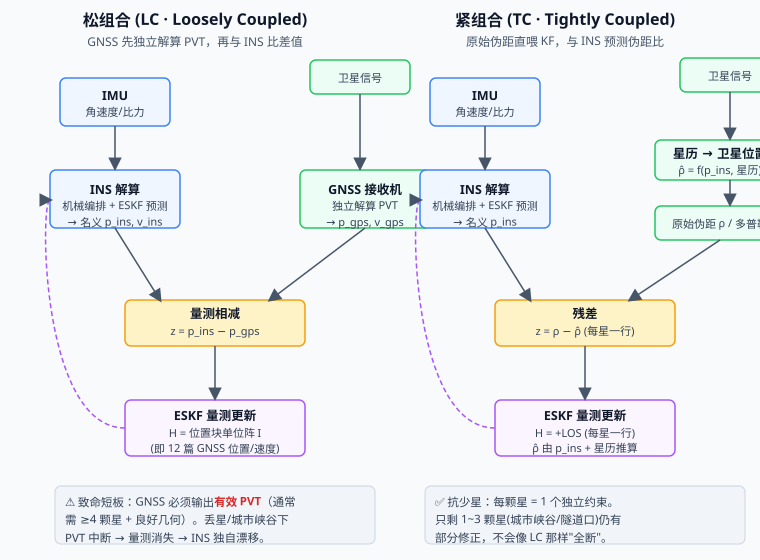
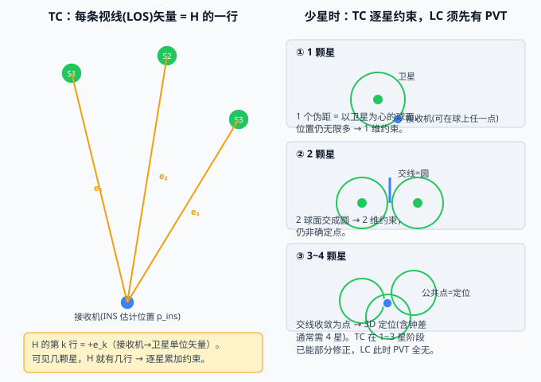

# 13 松组合 vs 紧组合——GNSS 该怎么"接"进 INS 的滤波器

> **M3 组合导航篇第四篇**。12 篇已经把"GNSS 位置/速度当量测"的 H 矩阵写完了——那其实就是**松组合**。本篇退一步问：**GNSS 的信息到底有几种接法接到 INS 上？** 松（LC）/ 紧（TC）/ 超紧（UC）三档耦合深度怎么选？为什么"丢星"时紧组合更扛造？
>
> **参考体系**：松组合锚定 **牛小骥 I2NAV 讲义第 4 讲 · GNSS/INS 松组合算法设计**（武汉大学，2021）的整体框架；紧组合锚定 **PSINS** 的 `gnss/test/test_SINS_GPS_tightly_coupled.m` + `base/kf/kfhk.m` + `gnss/gps/rhoSatRec.m`。代码对照：本项目固件 `ins_eskf_15d.c`（**采用松组合**——GNSS 位置/速度直接当量测）。
>
> 📚 **牛小骥 I2NAV 讲义第 4 讲 PDF**：[4-GNSS、INS松组合算法设计.pdf](../assets/I2NAV组合导航讲义/4-GNSS、INS松组合算法设计.pdf)

## 一、组合导航的"接线方式"有两种

组合导航无非是让 INS 和 GNSS **互相补漏**：INS 短时准、长时漂；GNSS 长时准、短时/遮挡断。但"把 GNSS 的信息接到 INS 的滤波器上"有两条路线——差别在**边界划在哪**：

- **松组合（LC, Loosely Coupled）**：先让 GNSS 接收机**自己独立解算**出位置/速度（PVT），再把这个结果当成 INS 的一个"传感器读数"喂进去。边界划在 **PVT**。
- **紧组合（TC, Tightly Coupled）**：不碰 GNSS 的 PVT，把每颗卫星的**原始伪距**直接喂给 INS 的滤波器，由 INS 自己"反解"位置。边界划在 **伪距**。

> 💡 12 篇写的 `H = 位置块单位阵`（GNSS 位置/速度当量测），就是**松组合**的 H。本篇把"还有紧组合"补上，并讲清两者取舍。

## 二、松组合：GNSS 先独立解算，再和 INS 比



数据流（见左半图）：

1. **IMU** → INS 机械编排 + ESKF 预测，得到名义位置 $\mathbf p_{ins}$、速度 $\mathbf v_{ins}$。
2. **GNSS 接收机** 内部跑一套独立的定位解算（自己的最小二乘或 KF），输出 **PVT**：$\mathbf p_{gps}, \mathbf v_{gps}$。
3. **量测相减**：$\mathbf z = \mathbf p_{ins} - \mathbf p_{gps}$，把差值送进 ESKF。
4. **量测更新**：$\mathbf H =$ 位置块单位阵（12 篇的 GNSS 位置 H）；速度同理。

**优点**

- **模块解耦**：GNSS 是黑盒，换 Ublox/高通/其他厂商不影响 INS 代码。
- **实现简单**：只要会读 GNSS 的 NMEA/二进制位置，不用懂星历。
- **计算量小**：滤波器不碰卫星几何。

**致命短板**

- **依赖 GNSS 输出有效 PVT**。PVT 本身需要 **≥4 颗星 + 良好几何（GDOP）**。一旦丢星、城市峡谷、隧道口，PVT 中断 → **量测瞬间消失** → INS 独自漂移（加计/磁强计只保姿态，位置/速度发散）。

> ⚠️ 这正是本项目固件选松组合时要补的"PVT 健康门限"——PVT 无效时不能拿它去更新。

## 三、紧组合：原始伪距直喂滤波器

数据流（见右半图）：

1. **IMU** → INS 解算，得到名义位置 $\mathbf p_{ins}$。
2. 读**卫星星历** → 算出每颗可见星的卫星位置 $\mathbf{sat}_k$（发射时刻）。
3. INS 用 $\mathbf p_{ins}$ + 星历，**预测**每颗星"应该量到的伪距"：
   $$\hat\rho_k = \|\mathbf{sat}_k - \mathbf p_{ins}\| \quad\text{（PSINS：}\texttt{rhoSatRec}\text{）}$$
4. **量测 = 原始伪距 − 预测伪距**：
   $$\mathbf z_k = \rho_k^{\text{raw}} - \hat\rho_k$$
5. **量测更新**：$\mathbf H$ 的第 $k$ 行 = **第 $k$ 颗星的视线单位矢量 $\mathbf e_k$**（接收机→卫星），落在位置块。

**H 的推导（核心）**

记真位置 $\mathbf p_{true}$、位置误差 $\delta\mathbf p = \mathbf p_{ins} - \mathbf p_{true}$，$\mathbf e_k = \dfrac{\mathbf{sat}_k - \mathbf p_{true}}{D_k}$ 为标称视线单位矢量（$D_k$ 为标称距离）：

$$\hat\rho_k = \|\mathbf{sat}_k - (\mathbf p_{true}+\delta\mathbf p)\|
= \|D_k\mathbf e_k - \delta\mathbf p\|
\approx D_k - \mathbf e_k^\top\delta\mathbf p$$

真实伪距 $\rho_k^{\text{raw}} = \|\mathbf{sat}_k - \mathbf p_{true}\| = D_k$，于是

$$\mathbf z_k = \rho_k^{\text{raw}} - \hat\rho_k \approx \mathbf e_k^\top\delta\mathbf p
\quad\Rightarrow\quad \boxed{\;\mathbf H_k(\text{位置块}) = +\mathbf e_k\;}$$

> 🔧 与 PSINS 一致：`rhoSatRec` 输出的 `LOS` 正是"接收机→卫星"单位矢量，`kfhk(ins, LOS)` 据此布 H。本文 `gen_lc_tc.py` 用**有限差分**校验：解析 H 与数值雅可比最大差 ≈ 2e-6（差分截断误差，非建模误差）。

**直觉**：伪距对接收机位置误差的偏导，就是"从你指向卫星的方向"。你往卫星方向挪一点，伪距就跟着变一点——这一行 H 就记下这个方向。

**优点**

- **每颗星 = 1 个独立约束**。只剩 1~3 颗星（城市峡谷、隧道口）时，LC 已无 PVT，TC 仍能用这几颗星做**部分位置修正**（约束落在这些 LOS 张成的子空间里）。

**代价**

- 滤波器要懂 GNSS：**解星历、算卫星位置、算 LOS、处理接收机钟差**——复杂度高、与 GNSS 强耦合。

## 四、两种 H 的本质区别（呼应 12 篇）

| | 松组合 LC | 紧组合 TC |
|---|---|---|
| 量测 $\mathbf z$ | $\mathbf p_{ins} - \mathbf p_{gps}$（位置差） | $\rho_k^{\text{raw}} - \hat\rho_k$（伪距差） |
| $\mathbf H$（位置块） | **单位阵 $\mathbf I_3$** | **逐行星堆叠的 LOS：$\begin{bmatrix}\mathbf e_1^\top\\ \mathbf e_2^\top\\ \vdots\end{bmatrix}$** |
| $\mathbf H$ 行数 | 固定 3（位置）/ 3（速度） | = 可见星数 $m$（可 1、2、3…） |
| 谁来解位置 | GNSS 芯片（黑盒） | INS 滤波器自己 |

**两者等价吗？** 在 GNSS 几何良好、星数充足时，LC 的 PVT 本质就是这些伪距的最小二乘解——所以 **LC ≈ "把解算外包给 GNSS 芯片的 TC"**。区别在工程鲁棒性：**边界划在 PVT 还是伪距，决定了星数不足时谁还能继续工作**。

## 五、几何可观测性：少星时谁还活着



- 1 颗星 = 一个球面（1 维约束）；2 颗星 = 两球面交成圆（2 维）；3~4 颗星 = 收敛为点（含钟差通常需 4 星）。
- **TC 在 1~3 星阶段已能逐星累加约束**；**LC 必须等 GNSS 芯片吐出 PVT（≥4 星）才开工**。

**双轨验证实证**（`gen_lc_tc.py`，注入 59.16 m 位置误差）：

| 场景 | 位置误差（更新前→后） | 说明 |
|---|---|---|
| **仅 2 颗星 · TC** | 59.16 m → **11.79 m** | KF 修正量落在 2 条 LOS 张成的 2 维子空间；垂直方向协方差不降（仍 ~53 m）→ "2 星只可观 2 维"，与理论一致 |
| **仅 2 颗星 · LC** | 59.16 m → 59.16 m（无更新） | 2 星无 PVT，量测直接消失，误差纹丝不动 |

> 关键教学点：TC 的"抗少星"不是魔法——它只是把"解算位置"和"更新滤波器"两件事的边界从 PVT 下移到了伪距，于是**哪怕解不出完整 PVT，仍能拿零散伪距做部分修正**。

## 六、超紧组合（UC / Deeply Coupled）一笔带过

TC 再上一层：把 INS 的动力学信息**反过来喂进 GNSS 的跟踪环**（载波/码环 DLL），帮弱信号下锁星；GNSS 环路的误差也回灌 INS。适合高动态/强遮挡（军用、无人机穿林）。本系列不展开。

## 七、怎么选（工程权衡）

| 维度 | 松组合 LC | 紧组合 TC | 超紧组合 UC |
|---|---|---|---|
| 耦合深度 | 浅（PVT 边界） | 中（伪距边界） | 深（跟踪环互馈） |
| GNSS 黑盒 | ✅ 是 | ❌ 否（需星历） | ❌ 否 |
| 少星鲁棒性 | 差（<4 星断） | **好（1~3 星仍可部分修正）** | 最好 |
| 实现复杂度 | 低 | 高 | 很高 |
| 计算量 | 小 | 中（逐星算 LOS） | 大 |
| 典型场景 | 车载/便携/消费级 | 城市峡谷/遮挡多 | 高动态/军用 |

**本项目固件 = 松组合**。理由：板级资源有限、GNSS 模块自带可靠 PVT、车载/便携场景丢星不频繁、实现简单可靠——用 12 篇的 GNSS 位置/速度 H 即可。代价是用 PVT 健康门限兜住"中断"风险。

## 八、PSINS 演示

**松组合**（`demos/test_SINS_GPS_153.m`）——LC 把 GNSS 位置当 PVT 量测：

```matlab
% PSINS 松组合：GNSS 先解算 PVT，再与 INS 比
posGPS = trj.avp(k1,7:9)' + davp0(7:9).*randn(3,1);   % GNSS PVT（带噪）
kf = kfupdate(kf, ins.pos-posGPS, 'M');               % H = 位置块单位阵（kfhk 153 case）
```

**紧组合**（`gnss/test/test_SINS_GPS_tightly_coupled.m`）——同一框架换一套"接线"：

```matlab
% PSINS 紧组合：原始伪距直喂 KF（同一 demo 把 if 0 改 if 1 即切换）
[satPos, clkCorr] = satPosBatch(tp-CA/ggps.c, ephi);  % 星历 → 卫星位置
[rho, LOS, AzEl]  = rhoSatRec(satPos, posxyz, CA);     % 预测伪距 + 视线矢量
delta_rho = CA + clkCorr(:,1)*ggps.c - rho;            % z = 原始伪距 − 预测伪距
kf.Hk = kfhk(ins, LOS);                                % H 每行 = 一颗星的 LOS
kf = kfupdate(kf, delta_rho);                          % 量测更新
```

> 📌 同一个 `test_SINS_GPS_tightly_coupled.m` 里 `if 0` 走 LC、`if 1` 走 TC——**松/紧只是"量测和 H 怎么组织"的区别**，底层 ESKF 框架完全共用。这正是本篇想讲透的。

> 💡 **坐标系铁律**：PSINS 用 **ENU**（x东/y北/z天），本项目用 **NED**（x北/y东/z地）。LOS 矢量本身是纯几何量（与坐标系无关），但**算卫星位置、做 ECEF↔本地系转换时必须按各自约定**——凡涉及轴向/符号的面板都要先声明坐标系。

## 九、常见坑

1. **把 LC 当"万能"**：以为有 GNSS 就稳，忽略 PVT 中断风险（丢星/遮挡）→ 位置突然漂。必须加 **PVT 有效性/健康门限**，无效时停更。
2. **TC 忽略接收机钟差**：每颗星伪距都含同一个钟差项 $c\cdot\Delta t$。H 必须给每行加一个"钟差列"（或先用单点定位解钟差再差分）。漏了钟差 → 位置估计系统性偏。
3. **LOS 矢量方向搞反**：H 行 = $+\mathbf e$（接收机→卫星）还是 $-\mathbf e$，取决于残差定义 $\mathbf z=\rho_{raw}-\hat\rho$ 还是反过来。本文用 $\mathbf z=\rho_{raw}-\hat\rho$ 得 $+\mathbf e$；PSINS `rhoSatRec` 的 `LOS` 也是"接收机→卫星"，与本文一致（已用有限差分确认）。
4. **星历时间不同步**：卫星位置要算在**信号发射时刻**（用传播延迟 $\rho/c$ 修正），用接收时刻星历会偏。
5. **地球自转修正（Sagnac）**：全球/高动态下要修正 `rhoSatRec` 里的 `wtau = wie*rho0/c` 旋转项。忽略会引入米级误差。
6. **几何劣化（GDOP 爆炸）**：星都挤在天顶一小块 → LOS 近乎平行 → 水平/垂直精度崩。要监控 GDOP，恶劣时降权或切回 LC。
7. **坐标系混乱**：ENU/NED、ECEF 互转错 → LOS 全错。铁律重申。
8. **把 LC 量测当 TC**：LC 量的是"位置差"（H 是 3×15 单位阵块），TC 量的是"伪距差"（H 是 $m×3$ LOS 堆叠）。维度不同，混用会维度对不上、更新方向错。

## 十、自测题

1. LC 与 TC 最大的**工程**区别在哪？为什么"丢星"场景下 TC 比 LC 更稳？
2. 写出 TC 伪距量测的残差 $\mathbf z$ 与 $\mathbf H$（位置块）。若残差定义为 $\mathbf z=\hat\rho-\rho_{raw}$，H 的符号会变吗？
3. 为什么 TC "每颗星一个独立约束"？用 LOS 矢量说明 1 / 2 / 3 颗星分别能把位置约束到什么程度。
4. 接收机钟差在 TC 里怎么处理？若完全忽略，位置估计会出现什么现象？
5. 有人说"LC 就是 TC 把解算外包给 GNSS 芯片"，这话对吗？在什么条件下成立、什么条件下不成立？
6. 本项目固件是 LC 还是 TC？为什么这么选？对应 12 篇的哪个 H？
7. 双轨验证里，仅 2 颗星时 TC 把 59.16 m 误差压到 11.79 m，但**垂直方向协方差没降**——解释为什么。

??? note "📐 参考答案"

    1. 边界划在哪：LC 边界在 **PVT**（要 GNSS 先解出位置），TC 边界在 **伪距**（滤波器自己解）。丢星时 GNSS 芯片吐不出 PVT → LC 量测消失、INS 独自漂；TC 仍能用残留的 1~3 颗星原始伪距做部分修正，不会全断。
    2. $\mathbf z_k=\rho_k^{raw}-\hat\rho_k\approx\mathbf e_k^\top\delta\mathbf p$，$\mathbf H_k(\text{位置块})=+\mathbf e_k$（接收机→第 $k$ 颗星单位矢量）。若改成 $\mathbf z=\hat\rho-\rho_{raw}$，则 $\mathbf z\approx-\mathbf e_k^\top\delta\mathbf p$ → $\mathbf H_k=-\mathbf e_k$，**整行反号**。两种约定都合法，但必须和残差定义、KF 的 $\mathbf r=\mathbf z-\mathbf H\hat{\mathbf x}$ 一致（本文统一用 $\mathbf z=\rho_{raw}-\hat\rho$）。
    3. 每颗星给出一个伪距观测量，其雅可比就是该星 LOS $\mathbf e_k$，所以"一颗星 = 一个独立约束方向"。1 星 → 位置落在以卫星为心的球面（1 维）；2 星 → 两球面交成圆（2 维，本验证 H2 秩=2）；3~4 星 → 交线收敛为点（3D 定位，含钟差通常需 4 星）。
    4. 钟差 $c\Delta t$ 出现在每颗星伪距里（同号同量）。处理：① 在 TC 状态里加一个钟差状态，H 每行补一列 $+1$（或 $+c$ 视单位）；② 先用单点定位（最小二乘）解出钟差再对伪距差分。忽略钟差 → 所有星伪距都带同一个偏置 → 位置估计被系统性拉偏（尤其沿几何中心方向）。
    5. 部分对：**GNSS 几何良好、星数充足（≥4）时**，LC 的 PVT 本质就是这些伪距的最小二乘解，所以 LC ≈ "外包解算的 TC"，两者位置修正等价。但**星数不足时**不成立：LC 解不出 PVT（直接断），TC 仍能逐星累加部分约束——这时"外包"的边界反而成了 LC 的命门。
    6. **本项目固件 = 松组合（LC）**。理由：板级资源有限、GNSS 模块自带可靠 PVT、车载/便携丢星不频繁、实现简单可靠。对应 12 篇的 **GNSS 位置 H**（位置块单位阵）与 **GNSS 速度 H**（速度块单位阵）。代价是用 PVT 健康门限兜住中断风险。
    7. 2 颗星只提供 2 个独立约束方向（H2 秩=2），KF 只能修正位置在"这 2 条 LOS 张成的 2 维子空间"内的分量；垂直于该子空间的方向没有被任何伪距观测到 → 那个方向的误差和协方差**原样保留**（验证里垂直分量协方差仍 ~53 m）。这正是"部分可观"——TC 抗少星靠的是"能修多少修多少"，不是"星不够也能全定位"。

## 十一、可复现：跑通本篇验证脚本

本篇所有数值结论（H=+LOS、2 星部分修正）都来自 `assets/gen_lc_tc.py`，**纯 numpy、零外部依赖**。验证类文章的底气不在于"作者说对"，而在于**你能亲手复现**——所以这一段请你照着跑一遍。

??? note "🧪 运行方式"

    只需有 Python 3 + numpy。在仓库任意位置执行下面任一种：

    ```bash
    # 方式一：直接用你自己的 python（已装 numpy）
    python docs/惯性导航/assets/gen_lc_tc.py

    # 方式二：没装 numpy 时先装再跑
    pip install numpy
    python docs/惯性导航/assets/gen_lc_tc.py
    ```

    脚本会打印三段结果，正好对应正文两个核心论断：

    1. **TC 伪距 H = +LOS（解析 vs 有限差分）**
       `max|H_analytic - H_fd| ≈ 2e-6` —— 这个极小差值来自差分法的截断误差，**证明解析式 `H = +LOS` 正确**（不是建模误差）。
    2. **LC 对照**：直接打印 `H = I₃`（位置块单位阵），与 [12 观测模型](12_观测模型.md) 的 GNSS 位置 H 完全一致。
    3. **仅 2 颗卫星**：
       - 更新前位置误差 `|delta_p| = 59.16 m`
       - TC 卡尔曼修正后 `|delta_p - dx| = 11.79 m`
       - 更新后协方差 `sqrt(diag(P2))` 中，垂直于 2 条 LOS 的分量仍 ~53 m（**不降**）
       - `H2 秩 = 2` —— 2 星只可观 2 维位置子空间，垂直方向仍漂

    跑出来的数字和上面对不上？先 `git diff docs/惯性导航/assets/gen_lc_tc.py` 确认脚本没被改过，再查 numpy 版本（`python -c "import numpy; print(numpy.__version__)"`）。

---

**参考体系**

- **牛小骥 I2NAV 组合导航讲义（武汉大学，2021）**第 4 讲 · GNSS/INS 松组合算法设计：[PDF](../assets/I2NAV组合导航讲义/4-GNSS、INS松组合算法设计.pdf)——松组合整体框架（本篇 LC 锚点）
- **PSINS**：
  - 松组合 `demos/test_SINS_GPS_153.m`（`kfupdate(kf, ins.pos-posGPS, 'M')`，H=位置块单位阵）
  - 紧组合 `gnss/test/test_SINS_GPS_tightly_coupled.m`（`if 0` LC / `if 1` TC 同框架切换）
  - `base/kf/kfhk.m`（按星历 LOS 布 H）、`gnss/gps/rhoSatRec.m`（预测伪距 + 视线矢量 LOS，含 Sagnac 修正）
- **本项目**：`ins_eskf_15d.c` 的 `eskf15_update_gnss_pos/vel`——**松组合**实现（GNSS 位置/速度直接当量测，H=单位阵挑位置/速度块）；误差态序 $[\mathbf p(0{:}2),\mathbf v(3{:}5),\boldsymbol\phi(6{:}8),\mathbf b_a(9{:}11),\mathbf b_g(12{:}14)]$
- **本篇验证**：`assets/gen_lc_tc.py`——TC 伪距 H=+LOS（解析 vs 有限差分，最大差 ≈2e-6）+ 仅 2 星 TC 部分修正实证（59.16 m→11.79 m）
- **上一篇**：[12 观测模型](12_观测模型.md)——本篇 LC 的 H（GNSS 位置/速度单位阵）在 12 篇落地
- **下一篇**：[14 一致性检验 NEES/NIS（χ²）](14_一致性检验.md)——量测更新到底"合理不合理"的闸门
- **系列首页**：[惯性导航与惯导解算 · 自学科普系列](../index.md)
