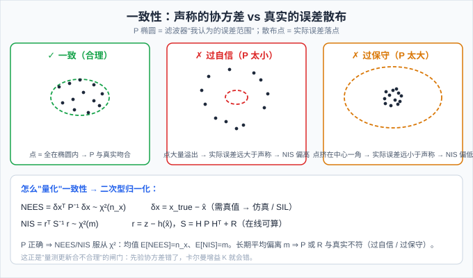
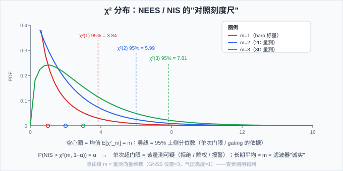

# 14 一致性检验：NEES / NIS（χ²）——量测更新"合理不合理"的闸门

> **M3 组合导航篇第五篇**。13 篇把"GNSS 怎么接进 INS"讲完了，但有一个问题被跳过了：**卡尔曼滤波器告诉你"误差只有 1 m"，你信吗？** 本篇讲怎么给滤波器做"体检"——两个检验量 NEES / NIS，以及它们背后的 χ² 分布。这是"量测更新到底合不合理"的闸门，也是调 Q/R、做异常检测（15 篇 FDI）的基础。
>
> **参考体系**：NIS/NEES 的标准出处是 **Bar-Shalom《Estimation with Applications to Tracking and Navigation》**；PSINS 的 `base/kf/kfupdate.m` 输出新息 `kf.rk` 与新息协方差 `kf.Py0`（=S，正是 NIS 的原料，但 **PSINS 不封装一致性检验——留给你自己算**，这本身就是教学点）；代码对照：本项目固件 `ins_eskf_15d.c` 的 **decoupled gating**（加速度计幅值门限 gf=0.3 / 磁强计常开）和 `matlab_sim/` 的 SIL 验证流程（有真值 → NEES 可算）。

## 一、滤波器也会"说谎"：为什么要体检

卡尔曼滤波器每一步输出两样东西：

- **估计值** $\hat{\mathbf x}_k$：我认为状态是多少；
- **协方差** $\mathbf P_k$：我认为自己的误差有多大（"我有 95% 把握误差在 ±2σ 内"）。

新手只盯着估计值，老手更盯着 $\mathbf P$——**因为增益 $\mathbf K$、门限、后续一切决策都建立在 $\mathbf P$ 之上**。可问题是：$\mathbf P$ 是滤波器**自己声称**的，它可能完全离谱：

- **过自信（overconfident）**：$\mathbf P$ 比真实误差小得多 → 滤波器把不可靠的估计当宝贝，后续量测的修正被过度信任 → 被带偏还"坚信不疑"；
- **过保守（underconfident）**：$\mathbf P$ 比真实误差大得多 → 滤波器不敢用新量测 → 收敛极慢，GNSS 修正形同虚设。

**一致性（consistency）** = 声称的不确定性 $\mathbf P$ 与真实误差统计相符。体检（一致性检验）就是回答一个问题：**"你认为的误差"和"实际犯的错"对得上吗？**



> 💡 一致性 ≠ 精度。精度是"误差有多小"，一致性是"误差的**说法**有多可信"。一个误差 1 m、但声称 100 m 的滤波器"一致但没用"；误差 1 m 声称 0.1 m 的滤波器"精度高但危险"（后面所有判断都建立在错的自信上）。

## 二、两个检验量：NEES 与 NIS

一致性没法直接测（真实误差分布不知道），但可以**抽样检验**：拿"误差的归一化平方"做统计量。有两条路线，差别只在**有没有真值**：

**NEES（Normalized Estimation Error Squared，估计误差归一化平方）**

$$\varepsilon_k^{\text{NEES}} = \delta\mathbf x_k^{\top}\,\mathbf P_k^{-1}\,\delta\mathbf x_k, \qquad \delta\mathbf x_k = \mathbf x_k^{\text{true}} - \hat{\mathbf x}_k$$

需要**真值** $\mathbf x^{\text{true}}$ → 只有仿真、SIL（软件在环）、半实物标定里能用。自由度 = 状态维数 $n_x$（本项目 ESKF 是 15 维误差态，但做 NEES 通常只看关心的子块）。

**NIS（Normalized Innovation Squared，新息归一化平方）**

$$\varepsilon_k^{\text{NIS}} = \mathbf r_k^{\top}\,\mathbf S_k^{-1}\,\mathbf r_k, \qquad \mathbf r_k = \mathbf z_k - \mathbf h(\hat{\mathbf x}_k^-), \quad \mathbf S_k = \mathbf H_k\mathbf P_k^-\mathbf H_k^{\top} + \mathbf R_k$$

需要**量测和它自己的预测**——全是滤波器内部量，**在线就能算**，不需要真值 → 实机只能用 NIS。自由度 = 量测维数 $m$（GNSS 位置=3、气压高度=1）。$\mathbf r_k$ 和 $\mathbf S_k$ 就是 12/13 篇里的新息与新息协方差——PSINS `kfupdate.m` 里分别是 `kf.rk` 和 `kf.Py0`。

**为什么这两个量服从 χ²？** 直觉：若 $\mathbf P$ 真是 $\delta\mathbf x$ 的协方差（且高斯），那么"$\delta\mathbf x$ 被 $\mathbf P$ 归一化"后就是 $m$ 个独立标准正态的平方和——正好是 χ² 的定义。

??? note "📐 推导：δxᵀP⁻¹δx ~ χ²(n) 的关键三步"

    1. 设 $\delta\mathbf x \sim \mathcal N(\mathbf 0, \mathbf P)$，做 Cholesky 分解 $\mathbf P = \mathbf L\mathbf L^{\top}$；
    2. 白化：$\mathbf y = \mathbf L^{-1}\delta\mathbf x$，则 $\mathbf y \sim \mathcal N(\mathbf 0, \mathbf I_n)$（协方差 $\mathbf L^{-1}\mathbf P\mathbf L^{-\top} = \mathbf I$）；
    3. $\delta\mathbf x^{\top}\mathbf P^{-1}\delta\mathbf x = \mathbf y^{\top}\mathbf y = \sum_{i=1}^{n} y_i^2$ —— 独立标准正态平方和，即 $\chi^2(n)$。

    NIS 同理：若 $\mathbf S$ 真是新息 $\mathbf r$ 的协方差（$\mathbf r \sim \mathcal N(\mathbf 0, \mathbf S)$），则 $\mathbf r^{\top}\mathbf S^{-1}\mathbf r \sim \chi^2(m)$。

## 三、χ² 分布与门限怎么用

χ² 分布唯一地由自由度 $d$ 决定，且**均值 = 自由度**：

$$\mathbb E[\chi^2(d)] = d$$

所以一致性检验的**核心判据**出奇简单：**长时间平均的 NEES/NIS ≈ 自由度**。显著大于 → 过自信（声称的 $\mathbf P$ 或 $\mathbf R$ 太小）；显著小于 → 过保守（声称的太大）。



三种用法，从粗到细：

**① 均值检验（最常用）**：收集 $N$ 个样本，算平均 $\bar\varepsilon = \frac{1}{N}\sum\varepsilon_k$，看是否接近 $m$。工程上常用"滑动窗口平均 NIS"，窗口长度 $N$ 越大越灵敏（也越迟钝）。

**② 单次门限（gating）**：单步 $\varepsilon_k$ 以概率 $1-\alpha$ 落在 $[0,\ \chi^2(m,1-\alpha)]$ 内。超出门限 → **该量测可疑**：拒绝、降权或报警。这就是"异常值剔除"和 15 篇 FDI 的数学基础。

**③ 批检验（严格版）**：$N$ 个独立样本的和 $\sum_{k=1}^{N}\varepsilon_k \sim \chi^2(N\cdot m)$。95% 一致性区间：

$$\left[\ \chi^2(Nm,\ 0.025),\ \chi^2(Nm,\ 0.975)\ \right]$$

落在区间外 → 以 95% 置信度判定滤波器不一致。常用**门限速查**：

| 自由度 m | 95% 分位 | 99% 分位 | 对应量测 |
|---|---|---|---|
| 1 | 3.841 | 6.635 | 气压高度（标量） |
| 2 | 5.991 | 9.210 | 2D 位置 |
| 3 | 7.815 | 11.345 | GNSS 3D 位置 / 速度 |

> ⚠️ 门限查表最容易犯的错：**自由度 = 量测向量维数 m**（不是状态维数 n_x、更不是 15）。baro 是 m=1，GNSS 位置是 m=3。

## 四、三种典型失配的"指纹"（诊断表）

一致性检验不只是"过/不过"的闸门——**偏离的方向和形态就是病因的指纹**：

| 现象 | 病因 | 修法 |
|---|---|---|
| NIS 均值 **远大于** m（系统性偏高） | 过自信：$\mathbf R$ 或 $\mathbf P$ 被低估（写太小） | 按真实噪声/误差标定 $\mathbf R$；检查 $\mathbf Q$ 是否漏了过程噪声 |
| NIS 均值 **远小于** m（系统性偏低） | 过保守：$\mathbf R$ 或 $\mathbf P$ 被高估 | 收紧噪声参数；但别为了"好看"盲目压缩（见坑 5） |
| NIS 均值 ≈ m 但**新息序列强相关** | 过程模型漏项 / $\mathbf Q$ 太小 / 动态模型失配 | 补建模（如机动加速度项），别只调 $\mathbf R$ |
| 单点 NIS **偶发尖峰** | 量测异常（GNSS 多径、磁干扰）而非滤波器错 | 保留（这正是 gating 要抓的），不调参数 |
| 各通道 NIS 不一致（如高度高、水平正常） | 某通道 $\mathbf R$ 错 / 该通道模型错 | 逐通道标定 $\mathbf R$，别用标量一刀切 |

> 💡 **先分清"滤波器的错"还是"量测的错"**：NIS 是"量测 vs 滤波器预测"的差。GNSS 多径时 NIS 飙升，**错在量测**（该 gating/降权）；模型漏项时 NIS 持续偏高，**错在滤波器**（该修模型）。区分手段：看 NIS 是"偶发尖峰"还是"持续偏移"——这正是 15 篇 FDI 的主题。

## 五、和 ESKF 的关系：固件的 gating 就是单次 NIS 门限的工程化

一致性检验在本项目里不是纸上谈兵——固件 `ins_eskf_15d.c` 的量测更新里就有它的影子：

```c
// eskf15_update_accel（示意）：加速度计幅值门限 —— "量测可疑就跳过"
if (fabsf(norm_a - G) > gf) {   // gf = 0.3：|‖a‖ − g| > 0.3 g 就跳过量测
    return;                     // banked turn 大过载时 accel 模型失效 → 不用它污染姿态
}
```

这里用的是**幅度近似**而非严格 NIS：当 $|\,\|\mathbf a\| - g\,| > 0.3g$ 时，加速度计量测与"近水平 1g"假设不符 → **该量测被拒之门外**。严格的做法是算 $m$ 维 NIS 并与 $\chi^2(m, 1-\alpha)$ 比——固件用更便宜的启发式（幅值差）等价地实现了"量测模型失效就拒绝"。

> 📌 **为什么 accel 用 gating、mag 常开**：accel 的模型"比力 ≈ 重力反投影"只在近水平/低过载成立（大转弯 1.05–1.58g 时系统性错误），所以必须门限；mag 只依赖姿态不依赖载荷，模型恒成立 → 常开。**判断要不要 gating，先问"这个量测的模型在什么工况下失效"**——这就是一致性思想的工程化。

**NEES 用在哪**：真值只在仿真里存在 → NEES 是开发期验证工具。本项目 `matlab_sim/` 的 SIL 流程正是如此：生成轨迹（真值）→ 跑滤波器 → 算 NEES 看"声称的 P 是否覆盖真实误差"。实机上没有真值，**只能**用 NIS 做在线健康监测（滑动窗口平均超限 → 报警/降权）。

## 六、双轨验证脚本：gen_chi2

`assets/gen_chi2.py`（Python）与 `assets/gen_chi2.m`（MATLAB）做三个演示，对应本节三个核心论断：

1. **χ² 性质**：从标准正态平方和采样 20 万次，样本均值 ≈ m、95% 分位 ≈ 理论值（3.84 / 5.99 / 7.82）→ 证明"若 P 正确则 NEES/NIS ~ χ²"不是空话；
2. **NIS 均值 = 闸门**：m=2 位置量测，真实新息协方差 Σ=41·I₂，三种声称值——一致（S=41I）：E[NIS]=**2.00**≈m ✓；过自信（S=8I）：**10.25**≫2 ✗；过保守（S=200I）：**0.41**≪2 ✗。解析期望 $\mathbb E[\mathbf r^{\top}\mathbf S^{-1}\mathbf r]=\operatorname{tr}(\mathbf S^{-1}\mathbf\Sigma)$ 与蒙特卡洛完全吻合；
3. **NEES 批检验**：N=50 时刻、d=2，ΣNEES~χ²(100)，95% 区间 [74.2, 129.6]——一致滤波器 E[Σ]=100 落在区间内 ✓，过自信（声称 P=P_true/4）E[Σ]=400 远超上界 ✗。

## 七、常见坑

1. **拿单次 NIS 下结论**：单样本 $\varepsilon_k$ 波动极大（χ² 方差 = 2m），一次超门限≠滤波器坏。必须时间平均 / 滑动窗口 / 批检验。
2. **忘了样本相关**：相邻两步的新息不独立（尤其量测频率高时）→ 有效样本数远小于 N → 平均 NIS 波动比理论大。严格批检验要按有效样本数算，或对 NIS 序列做稀疏采样。
3. **把 NEES 用在实机**：没真值就永远算不了 NEES。实机只有 NIS。仿真里两个都算，以 NEES 为准（它直接量估计误差）。
4. **NIS 高就怪滤波器**：先分"量测的错"（偶发尖峰 → gating/降权）还是"滤波器的错"（持续偏移 → 修模型/调 R/Q）。见 15 篇。
5. **把"调 NIS 到 1"当目标**：过拟合噪声参数可以让统计量"好看"，但牺牲真实精度（把 R 写大 → NIS 变小 → 滤波器变迟钝）。一致性 ≠ 精度，先保证模型对，再谈参数。
6. **α 选错**：α=0.05 意味着"正常量测也有 5% 概率被判可疑"——高量测率下天天误报；α 太小（0.001）则漏警。门限要与误报成本匹配。
7. **查表用错自由度**：m 是**量测**维数（baro=1、GNSS=3），不是状态维数。用 15 去查 m=1 的门限，等于把门限放大了几十倍，检验形同虚设。
8. **忽略不可观方向**：ESKF 里某些方向（如只有位置量测时的速度/零偏）P 保持很大——这是"诚实"，NEES 不会惩罚它。别把"不可观方向的 NEES 不大"误判成"滤波器没问题"。

## 八、自测题

1. NEES 和 NIS 分别需要什么信息？实机只能用哪个？为什么？
2. 为什么 $\delta\mathbf x^{\top}\mathbf P^{-1}\delta\mathbf x \sim \chi^2(n_x)$？写出"白化"三步。
3. 一致滤波器的 NIS 均值应该 ≈ m。若实际均值 = 10·m，说明什么？应该先查 R 还是先查 Q？为什么？
4. R 被**低估**（写太小）时，NIS 偏高还是偏低？用 $\mathbf S = \mathbf H\mathbf P\mathbf H^{\top}+\mathbf R$ 解释。
5. 固件 accel 的 gf=0.3 门限和严格 NIS 门限是什么关系？为什么 mag 不需要门限？
6. 批检验里 $\sum_{k=1}^{N}\varepsilon_k \sim \chi^2(Nm)$——为什么自由度乘了 N？（提示：独立 χ² 的和）
7. GNSS 在城市峡谷里 NIS 偶发尖峰，但均值正常。这是"滤波器错"还是"量测错"？该调参数还是加 gating？

??? note "📐 参考答案"

    1. NEES 需要**真值** $\mathbf x^{\text{true}}$（仿真/SIL/标定）；NIS 只要量测与预测（在线可算）。实机没有真值 → 只能用 NIS。NEES 直接量"估计误差"，NIS 量"量测与预测的差"。
    2. ① Cholesky $\mathbf P=\mathbf L\mathbf L^{\top}$；② 白化 $\mathbf y=\mathbf L^{-1}\delta\mathbf x\sim\mathcal N(\mathbf 0,\mathbf I)$；③ $\delta\mathbf x^{\top}\mathbf P^{-1}\delta\mathbf x=\mathbf y^{\top}\mathbf y=\sum y_i^2\sim\chi^2(n_x)$（标准正态平方和）。
    3. 过自信（声称的 P/R 太小）。**先查 R**（量测噪声最容易被写小，也最常错）；R 无误再查 P/Q。因为新息直接吃 R，R 错最先暴露在 NIS。
    4. 偏高。R 太小 → 声称的新息协方差 $\mathbf S=\mathbf H\mathbf P\mathbf H^{\top}+\mathbf R$ 偏小 → 实际新息 $\mathbf r$（方差是真实的 $\mathbf\Sigma$）被过小的 S 归一化 → $\mathbf r^{\top}\mathbf S^{-1}\mathbf r$ 系统性偏大。验证脚本场景 2 的"过自信"正是 R/P 同时压到 4 m（S=8I），NIS 均值 10.25。
    5. 都是"量测模型失效就拒绝"的思想：严格版算 NIS 与 $\chi^2(m,1-\alpha)$ 比；固件用更便宜的幅值启发式（$|\,\|\mathbf a\|-g\,|>0.3g$）等价实现。mag 模型只依赖姿态、不依赖载荷/过载，任何工况都成立 → 常开。判断依据 = "模型在什么工况下失效"。
    6. 独立同分布 $\chi^2(m)$ 的和仍为 χ²，自由度相加：$\sum\varepsilon_k\sim\chi^2(N\cdot m)$。前提是样本独立（坑 2 的有效样本数问题）。
    7. **量测的错**（偶发尖峰 + 均值正常 = 局部异常如多径，不是系统性失配）。正确做法是加 gating/降权/健康标志，而不是调 R/Q——调参数会把"正常时段"也变迟钝。这正是 15 篇 FDI 的内容。

## 九、可复现：跑通本篇验证脚本

本篇数值结论（χ² 性质、NIS 均值闸门、NEES 批检验）来自 `assets/gen_chi2.py`（Python）与 `assets/gen_chi2.m`（MATLAB）**双轨脚本**。注意：本脚本含蒙特卡洛采样，两轨 PRNG 不同（MATLAB `rng(42)` ≠ numpy `default_rng(42)`），**解析列逐数字一致，MC 统计量在小数末位允许 ±0.02 差异**（N=20 万样本下收敛）。

??? note "🧪 运行方式（Python 或 MATLAB，二选一即可）"

    **方式一：Python**（免费、零门槛，只需 Python 3 + numpy）

    ```bash
    python docs/惯性导航/assets/gen_chi2.py
    # 没装 numpy 先：pip install numpy
    ```

    **方式二：MATLAB**（无工具箱依赖，脚本名即函数名）

    ```matlab
    cd docs/惯性导航/assets
    gen_chi2
    ```

    打印三段结果，对应正文三个论断：

    1. **χ² 分布性质**：`m=1/2/3` 样本均值 ≈ `1/2/3`，95% 分位 ≈ `3.84/5.99/7.82`（理论 `3.841/5.991/7.815`）。
    2. **NIS 均值 = 一致性闸门**（解析 E[NIS]，两轨逐数字一致）：
       - 一致（S=41·I₂）→ **2.00** ≈ m ✓
       - 过自信（S=8·I₂）→ **10.25** ≫ 2 ✗（声称 S 太小）
       - 过保守（S=200·I₂）→ **0.41** ≪ 2 ✗（声称 S 太大）
    3. **NEES 批检验**：ΣNEES~χ²(100)，95% 区间 [74.22, 129.56]；一致滤波器 E[Σ]=100 ✓ 通过，过自信（P/4）E[Σ]=400 ✗ 拒绝。

    对不上？先 `git diff docs/惯性导航/assets/gen_chi2.py gen_chi2.m` 确认脚本没被改过。

---

**参考体系**

- **Bar-Shalom, Li, Kirubarajan《Estimation with Applications to Tracking and Navigation》**（Wiley, 2001）——NIS/NEES 一致性检验的标准出处（第 5 章滤波性能评估）
- **牛小骥 I2NAV 组合导航讲义（武汉大学，2021）**第 4 讲：[PDF](../assets/I2NAV组合导航讲义/4-GNSS、INS松组合算法设计.pdf)——量测方程与 KF 更新框架（一致性检验即在此框架上做统计）
- **PSINS**：`base/kf/kfupdate.m`——输出新息 `kf.rk` 与新息协方差 `kf.Py0`（=S，NIS 原料；PSINS 不封装检验，`rk'*inv(Py0)*rk` 即 NIS）
- **本项目**：`ins_eskf_15d.c` 的 `eskf15_update_accel`（`gf=0.3` 幅值门限 = 单次 NIS 门限的工程近似）、`eskf15_update_mag`（常开）；`matlab_sim/` SIL 流程（有真值 → NEES 评估收敛）
- **本篇验证**：`assets/gen_chi2.py`（Python）与 `assets/gen_chi2.m`（MATLAB）**双轨**——χ² 性质 MC + NIS 均值三场景（解析 2.00/10.25/0.41）+ NEES 批检验（100 ∈ [74.2,129.6]）
- **上一篇**：[13 松组合 vs 紧组合](13_松组合vs紧组合.md)——量测怎么进来；本篇讲进来的量测怎么"体检"
- **下一篇**：[15 多传感器冗余 + FDI](15_多传感器冗余与FDI.md)——"量测的错 vs 滤波器的错"怎么自动区分
- **系列首页**：[惯性导航与惯导解算 · 自学科普系列](../index.md)
