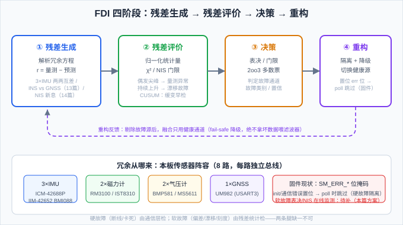
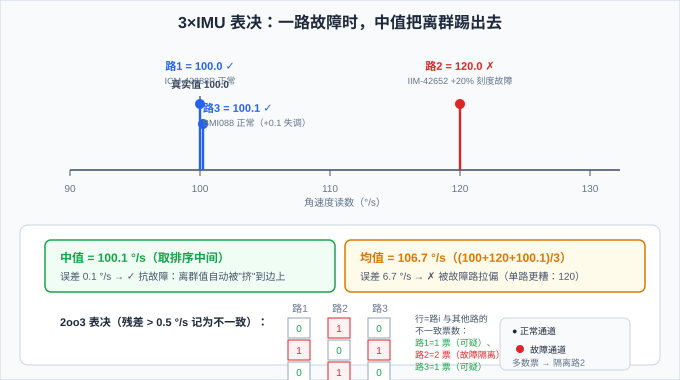

# 15 多传感器冗余 + FDI——三路 IMU 的"少数服从多数"

> **M3 组合导航篇第六篇**。14 篇给滤波器做了"体检"（NIS/NEES），但那还是**单量测**层面。本篇升级到**系统**层面：本板有 3 路 IMU、2 路磁力计、2 路气压计——多出来的传感器不是摆设，是用来**互相监督**的。讲冗余怎么组织、故障怎么检测与隔离（FDI）、坏数据怎么被挡在滤波器门外。
>
> **参考体系**：FDI 的经典框架（残差生成→评价→决策→重构）锚定 **Gertler《Analytical Redundancy Methods in Fault Detection and Isolation》**；故障注入工具锚定 **PSINS** `base/imu/imuerrset.m`（IMU 误差模型：零偏 eb/db、刻度、随机游走——模拟软故障的原料）；代码对照：本项目固件 `ins_sensor_manager.h/.c`（**`SM_ERR_*` 位掩码 + poll 跳过 = 硬故障隔离已落地**）与 `ins_eskf_15d.c`（14 篇的 gating = 量测级 FDI）。

## 一、为什么冗余：传感器坏了自己不会说

陀螺仪坏了，输出不是变成 NaN，而是**继续给出一个数**——可能偏差、可能漂移、可能卡在常值。惯性导航是"连续说谎者"：它永远有输出，故障不报错，只会在航姿/位置里**慢慢或突然体现**。单点失效 = 整个航姿系统不可用。

冗余的意义不是"多装一个备份"，而是让系统具备 **FDI** 三字能力：

- **D（Detection）检测**：发现"某一路不对劲"；
- **I（Isolation）隔离**：定位是哪一路、什么类型的故障；
- **R（Reconfiguration）重构**：剔除故障源，用剩下的健康通道继续工作。

冗余分两类，本篇两个都讲：

- **硬件冗余**：同质传感器多装几路（本板 3×IMU、2×磁、2×气压）——直接"少数服从多数"；
- **解析冗余**：不同来源互相校验（13 篇的 INS vs GNSS、14 篇的 NIS）——没有第二个硬件，也能靠模型发现不一致。

> 💡 冗余 ≠ 可靠。三路 IMU 摆在那里，如果只是"三路都喂进滤波器"，故障路照样污染结果——**必须有表决/检验把坏路挑出来**。这才是 FDI 的全部意义。

## 二、先认清敌人：故障的四种形态

检测手段取决于故障形态，先分类：

| 类别 | 形态 | 例子 | 检测手段 | 难度 |
|---|---|---|---|---|
| **硬故障** | 断线 / 卡死常值 / 无响应 | SPI 通信断、寄存器全 0、读数不变 | 通信层错误位（固件 `SM_ERR_*`）、方差≈0 | 易 |
| **软故障·跳变** | 偏差（bias）突变 | 焊点松动、温漂阶跃 | 残差/NIS 单次门限（14 篇） | 中 |
| **软故障·缓变** | 漂移、比例因子变化 | 器件老化、刻度温漂 | NIS 趋势 / CUSUM / 表决 | 难 |
| **软故障·噪声** | 随机噪声增大 | 电磁干扰 | 新息方差 / 残差统计检验 | 难 |

> ⚠️ 最阴险的是**缓变漂移**：它变化慢，单步残差永远在门限内，但长期把结果带偏——所以 14 篇强调"看趋势（均值/滑动窗）而不是看单步"。

## 三、本板冗余阵容与固件现状

本板 8 路传感器，每路独立总线、独立驱动：

| 传感器 | 总线 | 角色 | 冗余 |
|---|---|---|---|
| ICM-42688P | SPI1 | 主 IMU | 3×IMU |
| IIM-42652 | SPI6(BDMA) | 辅 IMU | 3×IMU |
| BMI088（双 die） | SPI4 | 辅 IMU | 3×IMU |
| RM3100 | SPI6 共享 | 磁力计 | 2×磁 |
| IST8310 | I2C1 | 磁力计 | 2×磁 |
| BMP581 | I2C2 | 气压计 | 2×气压 |
| MS5611 | I2C3 | 气压计 | 2×气压 |
| UM982 | USART3 | GNSS | 1×（靠解析冗余） |

**固件已落地的硬故障隔离**（`ins_sensor_manager.h` 位掩码 + `ins_sensor_manager.c` poll）：

```c
#define SM_ERR_ICM42688P (1UL<<0)   // 每路传感器一个错误位
#define SM_ERR_IIM42652  (1UL<<1)
#define SM_ERR_BMI088    (1UL<<2)
// ... RM3100/IST8310/BMP581/MS5611/UM982 同理

int ins_sensor_manager_poll(ins_sensor_manager_t *m) {
    ins_sensor_snapshot_t *s = &m->snap;
    // 有错误位的设备直接跳过 —— 故障通道被"隔离"，不再读它
    if (!(m->err & SM_ERR_ICM42688P)) icm426xx_read_imu(&m->icm42688p, &s->imu_icm42688p);
    if (!(m->err & SM_ERR_IIM42652))  icm426xx_read_imu(&m->iim42652,  &s->imu_iim42652);
    if (!(m->err & SM_ERR_BMI088))    bmi088_read(&m->bmi088,          &s->imu_bmi088);
    // ...
}
```

这套机制检的是**硬故障**（init 失败/通信错误 → 置位 → 不再 poll）。但**软故障（偏差/漂移/刻度）它看不见**——读数还在更新，只是不准。这正是本篇要补的：把 14 篇的一致性检验升级成"三路互相监督"的表决体系。

> 📌 所以"本板落地"的完整方案是两条腿：**① 通信层错误位（已有）**处理硬故障；**② 表决 + NIS 在线监测（本篇方案）**处理软故障。

## 四、三路 IMU 的三种融合策略

拿到三路 IMU 数据后怎么用？三条路线，鲁棒性和代价不同：

**策略 A：量测扩维进一个 ESKF**——状态不变，量测向量从 3 维扩到 9 维（三路陀螺+加计各 3 维），H 矩阵按块堆叠（12 篇的 accel H 复制三份）。

- 优点：数学最"正统"，每路噪声权重由 R 块自动决定；
- 缺点：**一路故障直接污染更新**（除非逐路 gating），计算量 ×3，且三路 R 相关性难建模。故障隔离要靠 H 块级的 gating，复杂。

**策略 B：中值表决（median）**——逐轴取三路读数排序的中间值，喂给滤波器。

- 优点：**天然抗单路故障**（离群值被挤到边上），零状态、零参数，极便宜；
- 缺点：3 路坏 2 路就失效；无故障时精度略逊均值（只取中间，没利用全部数据）。

**策略 C：独立解算 + 2oo3 表决**——三路各自跑（或直接比原始读数），两两比较残差，多数票隔离故障路。

- 优点：故障定位明确（能说出"路 2 坏了"），可做健康标志持久化；
- 缺点：实现最重（要三路同步、表决逻辑、切换策略）。

对比：

| 维度 | A 量测扩维 | B 中值 | C 独立+2oo3 |
|---|---|---|---|
| 抗 1 路故障 | 需逐路 gating | ✅ 天然 | ✅ 显式 |
| 故障定位 | 弱 | 无 | ✅ 强 |
| 实现成本 | 中 | 最低 | 高 |
| 精度（无故障） | 最高 | 中 | 中 |
| 本板建议 | 不推荐 | **首选**（便宜可靠） | 精调阶段再上 |

> 💡 工程上常见组合：**中值做默认融合（软故障兜底）+ 通信错误位做硬故障隔离 + 定期 NIS 均值做健康监测**。三层都不重，但把"单点失效"变成"单点告警"。

## 五、FDI 四阶段框架



- **① 残差生成**：解析冗余方程——同一个物理量，用多种方式算，相减得残差 $\mathbf r$。三路 IMU 互差、13 篇的 INS vs GNSS、14 篇的新息都是残差。
- **② 残差评价**：把残差归一化成统计量——14 篇的 NIS（$\mathbf r^{\top}\mathbf S^{-1}\mathbf r$）、χ² 门限、CUSUM（缓变故障用累积和，比单步门限早发现）。
- **③ 决策**：表决 / 门限判定——"路 2 与其余两路都不一致 → 故障"。
- **④ 重构**：隔离故障通道、切健康源、降级运行——固件的"置位 err 位 + poll 跳过"就是最简单的重构。

> 📌 关键设计问题：**残差怎么"干净"**。残差里既有故障信号，也有噪声和模型误差。评价环节必须归一化（除以声称的协方差，14 篇的 S），否则门限没法设。

## 六、与 ESKF 的接口：量测级 FDI 是 gating 的系统化

14 篇里 `eskf15_update_accel` 的 `gf=0.3` 门限，本质是**量测级 FDI**：量测与模型不符 → 丢弃。15 篇把它系统化，形成三档：

1. **单量测 gating**（14 篇）：逐条量测算 NIS，超门限丢弃——已落地；
2. **多源表决**（本篇）：同一物理量有多个来源，先表决出健康源再更新——待补；
3. **健康状态持久化**：故障标志（如 `sm_err`）不只影响本次 poll，还决定后续是否**重新上电/重试恢复**（瞬态故障自愈）还是**长期隔离**（永久故障告警）。

状态级 vs 量测级：量测级 FDI 挡的是"这步量测不可信"；状态级 FDI 盯的是"状态估计本身发散"（如 14 篇的 NEES 持续超限 → 整个滤波器不可信 → 切备用滤波器/重置）。实机通常先量测级后状态级。

## 七、双轨验证脚本：gen_fdi



`assets/gen_fdi.py`（Python）与 `assets/gen_fdi.m`（MATLAB）三个演示（确定性，两轨逐数字一致）：

1. **一路故障时怎么融合**：真实角速度 100 °/s，路 2 故障 +20% 刻度误差，三路读数 [100, 120, 100.1]——单路拿故障路误差 **20.0**、均值 106.7 误差 **6.7**、中值 100.1 误差 **0.1** → 中值天然剔除离群；
2. **2oo3 表决**：两两残差矩阵 $|\mathbf w_i-\mathbf w_j|$，路 2 与两路都冲突（2 票）→ 隔离；路 1/路 3 各 1 票（可疑）；正常两路互相一致；
3. **NIS 捕获缓变漂移**：漂移 $b(t)=0.02t$ °/s、σ=1，NIS=(0.02t)²，在第 **98** 步跨过 χ²(1,95%)=3.841 门限——缓变故障靠"趋势越过门限"而非单步。

## 八、常见坑

1. **只冗余不表决**：三路都喂滤波器，故障路照样污染——冗余必须配 FDI，否则只是"三倍的单点"。
2. **用均值当融合**：均值不抗故障，一个离群拉偏全部（验证演示 1：6.7 °/s）。中值才是"一键抗离群"。
3. **忽视共因失效**：2oo3 里两路同源故障（同一供电轨、同一温漂源、同一干扰）→ 表决两票判"正常"→ 中值也救不了。工程上要**异构**（不同总线/供电/厂商，本板 3×IMU 分属 SPI1/SPI4/SPI6 正是为此）。
4. **门限拍脑袋**：gating 门限要和误报率挂钩（14 篇的 χ² 表）；α=0.05 在高量测率下天天误报，该用滑动窗/健康标志。
5. **只做单步检测**：缓变漂移单步永远在门限内——必须看趋势（滑动均值 / CUSUM / 残差累积和）。
6. **忽略时间同步**：三路 IMU 采样时刻不一致就直接表决，会把"时间差"误判成"不一致"。先对齐（同一 poll 周期快照，本板 snapshot 结构已统一），再比。
7. **软故障被滤波器"吸收"**：缓变漂移可能被 ESKF 的零偏状态 $\mathbf b_g/\mathbf b_a$ 当成"真实零偏"学走——**检测不到是原理性的**（滤波器诚实但错误地解释了它）。对策：零偏状态加合理性约束（如零偏幅值上限、与另两路交叉验证）。
8. **FDI 反馈回路过激**：瞬时抖动就隔离 → 反复切换 → 更糟。重构要有**迟滞/确认**（连续 N 步超限才隔离；隔离后可定期试探恢复）。

## 九、自测题

1. 硬故障和软故障的检测手段分别是什么？固件 `SM_ERR_*` 位掩码能检哪类？
2. 一路故障时，均值、中值、单路各自的误差如何（用 gen_fdi 演示 1 的数字）？为什么中值抗离群？
3. 2oo3 表决里"路 2 与两路冲突（2 票）→ 隔离"的依据是什么？若两路同源故障，表决会怎样失效？
4. 缓变漂移为什么单步检测不到？14 篇的哪些工具能改造成"趋势检测"？
5. ESKF 的零偏状态为什么会让慢漂移"隐身"？工程上怎么对抗？
6. 量测扩维（三路进一个 ESKF）与中值表决的取舍——什么时候该用哪个？
7. 某路 IMU 输出突然卡在常值（不再变化）。你会用哪几个特征检出它？（提示：方差、与另两路残差、通信层）

??? note "📐 参考答案"

    1. 硬故障：通信层（init 失败/寄存器错误 → 置位 → poll 跳过）、方差≈0（卡死）；软故障：残差/NIS（14 篇）、表决、趋势检测。`SM_ERR_*` 检的是**硬故障**（通信错误），软故障它看不见。
    2. 单路（拿故障路）= **20.0** °/s；均值 = **6.7** °/s（(100+120+100.1)/3=106.7 被拉偏）；中值 = **0.1** °/s（排序中间值 100.1 ≈ 正常）。中值抗离群因为排序后故障值落在边上，取中间的天然是"多数正常值"。
    3. 依据：故障路的读数与其他**所有**健康路都不一致（残差都超门限），"少数服从多数"判它出局；正常路之间互相一致，票数少。两路同源故障（共因失效）时，两路互相"一致" → 表决判正常 → 系统全错。对策：异构冗余 + 额外解析冗余（INS vs GNSS）。
    4. 单步残差 = 漂移增量，永远小于门限；只有**累积**（滑动均值 / NIS 趋势 / CUSUM）才能积累到超限。14 篇的"时间平均 NIS"和批检验就是趋势检测的基础。
    5. 慢漂移和真实零偏在滤波器的观测模型里**不可区分**——零偏状态把漂移"解释"掉，残差保持很小，NIS 永远正常。这是原理性的（可观测性限制）。对抗：零偏幅值合理性约束、与其他 IMU 交叉验证、定期标定。
    6. 无故障且噪声模型准 → 量测扩维精度最高；要便宜 + 抗单路故障 → 中值；要明确故障定位 → 独立+2oo3。实机常取"中值 + 错误位 + NIS 监测"组合。
    7. 三个特征：① 方差骤降≈0（读数不再变化）；② 与另两路残差持续超门限（表决 2 票）；③ 若连通信也断则错误位置位。任一命中即隔离。

## 十、可复现：跑通本篇验证脚本

本篇数值结论（中值/均值/单路对比、2oo3 表决矩阵、NIS 第 98 步触发）来自 `assets/gen_fdi.py`（Python）与 `assets/gen_fdi.m`（MATLAB）**双轨脚本**。本脚本是**确定性演示**（无随机采样），两轨**逐数字一致**。

??? note "🧪 运行方式（Python 或 MATLAB，二选一即可）"

    **方式一：Python**（免费、零门槛，只需 Python 3 + numpy）

    ```bash
    python docs/惯性导航/assets/gen_fdi.py
    # 没装 numpy 先：pip install numpy
    ```

    **方式二：MATLAB**（无工具箱依赖，脚本名即函数名）

    ```matlab
    cd docs/惯性导航/assets
    gen_fdi
    ```

    打印三段结果，对应正文三个论断：

    1. **单路/均值/中值对比**：三路读数 `[100.0, 120.0, 100.1]`（路 2 故障 +20%）→ 单路误差 `20.0`、均值 `6.7`、中值 `0.1` °/s。
    2. **2oo3 表决矩阵**：路 2 不一致票数 = 2 → `故障 ✗ 隔离`；路 1/路 3 = 1 → `可疑 ?`。
    3. **NIS 缓变漂移**：`t=98` 步 NIS=3.84 跨过门限（χ²(1,95%)=3.841），`t=50` 步 1.00 未触发、`t=100` 步 4.00 已触发。

    对不上？先 `git diff docs/惯性导航/assets/gen_fdi.py gen_fdi.m` 确认脚本没被改过。

---

**参考体系**

- **Gertler《Analytical Redundancy Methods in Fault Detection and Isolation》**（Elsevier, 1998）——解析冗余 FDI 框架（残差生成→评价→决策→重构）
- **PSINS**：`base/imu/imuerrset.m`——IMU 误差模型（eb/db/刻度/随机游走），软故障注入的原料（`imuadderr` 把误差加进 IMU 数据列）
- **本项目**：`ins_sensor_manager.h/.c`（`SM_ERR_*` 位掩码 + poll 跳过 = 硬故障隔离）、`ins_eskf_15d.c` 的 `eskf15_update_accel`（gf=0.3 gating = 量测级 FDI）、`ins_sensor_snapshot_t`（三路 IMU 统一快照，表决的时间同步基础）
- **上一篇**：[14 一致性检验 NEES/NIS](14_一致性检验.md)——单量测"体检"；本篇升级为多源"互相监督"
- **下一篇**：[拆解 PSINS ①：test_SINS_trj.m](../04_拆解PSINS篇/P1_轨迹生成_拆解test_SINS_trj.md)——开始拆工业参考：轨迹怎么"造"出来
- **系列首页**：[惯性导航与惯导解算 · 自学科普系列](../index.md)
