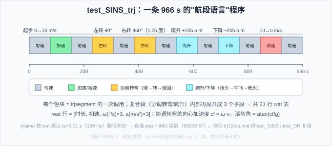

# 拆解 PSINS ①：test_SINS_trj.m——轨迹是怎么"造"出来的

> **拆解 PSINS 系列第一篇**。科普系列（01–16）把惯导的原理讲完了，但 PSINS 这尊"工业级参考"还蒙着面纱。本系列把 PSINS 的核心 demo 拆开揉碎：从 19–31 行的"薄壳"脚本一路追进 `base/` 库函数，把"这段代码在算什么、为什么这么算、对应科普系列哪一章"讲透。
>
> **本篇拆解对象**：`demos/test_SINS_trj.m`（31 行）——PSINS 的**数据母版**。`test_SINS.m`、`test_DR.m`、`test_SINS_GPS_153.m` 全都消费它生成的 `trj10ms.mat`。它自己不算导航，但**没有它，后面所有 demo 都是无米之炊**。
>
> **参考体系**：PSINS `base/base1/trjsegment.m`（航段语言）与 `base/base1/trjsimu.m`（正演机，代码注释自引严龚敏硕士学位论文 p63）；对照科普系列 [09 纯惯导误差传播](../02_解算篇/09_纯惯导误差传播.md) 的位置微分方程、[07 姿态更新](../02_解算篇/07_姿态更新算法.md) 的圆锥效应。**本板对应**：验证用的高机动轨迹（2.5g 转弯/倒飞 VTOL 剖面）正是用同类的航段语言拼出来的。

## 一、拆解系列的读法：demo 是"薄壳"，肉在 `base/` 里

先建立一个总印象——**PSINS 的 demo 脚本几乎不干活**：

| demo | 行数 | 自己实现的 | 调用的库函数 |
|---|---|---|---|
| `test_SINS_trj.m` | 31 | 无（只"点菜"） | `trjsegment` / `trjsimu` / `trjfile` / `insplot` / `imuplot` |
| `test_SINS.m` | 19 | 无 | `trjfile` / `imuerrset` / `imuadderr` / `avperrset` / `avpadderr` / `bhsimu` / `inspure` / `avpcmpplot` |
| `test_DR.m` | 29 | 一个 8 行解算循环 | `odsimu` / `drinit` / `drupdate` / `avpcmp` / `insplot` |

demo 的正确读法 = **把它当"数据流入口"**：每一行调用都是一扇门，推开门（读库函数）才是拆解。本系列每篇都按这个方式走一遍。

另外一条主线贯穿三篇：**`test_SINS_trj` 是母版**。它生成的 `trj10ms.mat` 同时被 `test_SINS`（纯惯导）和 `test_DR`（航位推算）消费——所以 P1 先把"造数据"讲透，P2/P3 才能讲"算导航"。

## 二、全景：31 行干了四件事

```matlab
glvs                                        % ① 全局常量（glv.*）
ts = 0.01;                                  %    采样间隔 100 Hz
avp0 = [[0;0;0]; [0;0;0]; [29*glv.deg; 106*glv.deg; 450]];  % 初始姿态/速度/位置（西安）
xxx = [];                                   % ② 用"航段语言"拼轨迹
seg = trjsegment(xxx, 'init', 0);           %    13 个航段调用
seg = trjsegment(seg, 'uniform', 100);
seg = trjsegment(seg, 'accelerate', 10, xxx, 1);
...                                         %    （省略中间 9 个）
seg = trjsegment(seg, 'deaccelerate', 5,  xxx, 2);
seg = trjsegment(seg, 'uniform', 100);
trj = trjsimu(avp0, seg.wat, ts, 1);        % ③ 正演：wat 表 → 真值 + IMU 数据
trjfile('trj10ms.mat', trj);                % ④ 存盘供其他 demo 消费
insplot(trj.avp);  imuplot(trj.imu);        %    画图
```

四幕剧：**①初始化 → ②拼航段 → ③正演 → ④存盘**。②③是灵魂，本篇重点拆。

## 三、`glvs` 与 `avp0`：全局常量与初始状态

`glvs`（`base/glvs.m`）把整个地球模型装进全局结构体 `glv`：重力 `glv.g0`、地球自转角速度 `glv.wie`、长半轴 `glv.Re`、扁率 `glv.f`、常系数 `glv.deg/glv.min`（弧度换算）等。PSINS 所有函数第一行几乎都是 `global glv`——**全局量是 PSINS 的风格**（省去到处传参，代价是隐蔽依赖，这点在坑里会讲）。

`avp0` 是初始"姿态-速度-位置"（att-v-pos 顺序）：

```matlab
avp0 = [[0;0;0];          % 姿态 [pitch; roll; yaw] = 0（水平朝北）
        [0;0;0];          % 速度 vn = 0（静止起步）
        [29*glv.deg; 106*glv.deg; 450]];   % 位置 [lat; lon; h]：西安附近，海拔 450 m
```

注意 PSINS 的 att 顺序是 **[pitch; roll; yaw]**（和我们科普系列/固件的 yaw-pitch-roll 输出顺序不同），pos 是 [纬度; 经度; 高度]（NED 下的经纬高）。这是 PSINS 与固件的第一个"约定差异"。

## 四、`trjsegment`：一门"航段语言"

`trjsegment(seg, segtype, lasting, w, a, var1)` 是纯**查表函数**：每种 `segtype` 往 `seg.wat` 里追加一行（或几行），并维护 `seg.vel`（当前段初速）。wat 表的行格式是：

$$\text{wat 行} = [\ \text{lasting},\ \text{vel},\ \boldsymbol\omega_{(3)},\ \mathbf a_{(3)}\ ]$$

即 [时长, 初速, 角速度×3(°/s), 加速度×3(m/s²)]——`trjsimu` 只认这张表，不认"语义"。

**8 种基本航段**（每种 = 一行 wat）：

| 航段 | wat 效果 | 物理含义 |
|---|---|---|
| `uniform` | ω=a=0 | 匀速直线（速度大小不变） |
| `accelerate` | a 沿前进方向 | 直线加速（末速 = 初速 + lasting·a） |
| `deaccelerate` | a 反向 | 直线减速（传入 a>0，内部取负） |
| `headup` / `headdown` | ω 绕俯仰轴 ±w，a 补偿 cf | 抬头/低头（俯仰速率 w） |
| `turnleft` / `turnright` | ω 绕航向轴 ±w，a 补偿 −cf | 左/右转弯（航向速率 w） |
| `rollleft` / `rollright` | ω 绕横滚轴 ±w | 左/右滚转（滚转速率 w） |

关键物理：**协调转弯的向心加速度**（`trjsegment.m` 第 19–20 行）：

```matlab
dps = pi/180/1;                    % deg/s → rad/s
if exist('w','var'), cf = (w*dps)*seg.vel; end   % cf = ω·v
```

$c_f = \omega \cdot v$——转弯段要保持速度大小不变，就必须提供横向向心加速度 $v^2/r = \omega v$。这个 cf 被写进 wat 的加速度列（`turnleft` 写 `-cf`、`turnright` 写 `+cf`，方向由航段语义决定）。**读者可以立刻验证**：P1 验证脚本里 coturnleft 45s@2°/s、v=10 m/s → cf = 0.35 m/s² = 3.6%g → 滚转角 atan(cf/g) = 2.0°。

**6 种复合航段**（每种 = 展开成多个基本段）：`coturnleft/right`（协调转弯：先滚 → 转 → 滚回，滚转角 = atan(cf/g)）、`climb/descent`（抬头 → 平飞 → 低头）、`static`（减速停 + 静止）、`8turn`/`sturn`（S 形/8 字形机动）。**复合段证明了 wat 表是可编程的**——任意机动剖面都能拼出来（本板验证轨迹就是这么干的）。

## 五、`trjsimu`：正演机——从"想要的轨迹"反算"IMU 该读到什么"

`trjsimu(avp0, wat, ts, repeats)` 是 P1 的心脏：给定初始状态和 wat 表，按 ts 逐拍数值积分，同时输出**真值 avp** 和**IMU 读数 imu**。核心循环（`trjsimu.m` 第 43–79 行）每拍做六件事：

**① 姿态推进**（第 49 行）：

$$\mathrm{att} \leftarrow \mathrm{att} + \boldsymbol\omega_t \cdot ts$$

把航段角速度按欧拉角增量推进姿态——这是"轨迹系"里的姿态演化（忽略地球旋转的近似层，真正的 wnin 补偿在陀螺增量里）。

**② 速度推进**（第 57–58 行）：

$$\mathbf a_n = \mathbf C_{nt}\,\mathbf a_t, \qquad \mathbf v_n \leftarrow \mathbf v_n + \mathbf a_n\, ts$$

航段加速度定义在**轨迹系**，用 $\mathbf C_{nt}$（由当前 pitch/yaw 构造，见 `trjsimu.m` 第 46–48 行）转到导航系。注意 `trjsimu.m` 第 66 行 `phim = m2rv(Cbn_1*Cnb) + (Cbn_1+Cnb')*(wnin*ts2)` 才是精确路径，这里给的是教学简化。

**③ 位置推进**（第 60–62 行）——直接就是科普 09 篇的位置微分方程：

$$\delta\mathbf p = \left[\ \tfrac{v_E}{R_{Mh}},\ \tfrac{v_N}{R_{Nh}\cos L},\ v_U\ \right]^{\top} ts$$

纬向/经向曲率半径 $R_{Mh}, R_{Nh}$ 来自 `eth = earth(pos, vn)`（`base/base2/earth.m`，随位置每拍更新）。

**④ 陀螺增量（角增量 wm）**（第 66–68 行）——**从姿态变化反算陀螺该读到什么**：

$$\boldsymbol\phi_m = \mathrm{m2rv}(\mathbf C_{b_{k-1}}^n \mathbf C_{b_k}^n) + (\mathbf C_{b_{k-1}}^n + {\mathbf C_{b_k}^n}^{\top})\,\boldsymbol\omega_{in}^n \tfrac{ts}{2}$$

$$\mathbf w_m = (\mathbf I + \tfrac{1}{12}\mathrm{skew}(\mathbf w_{m-1}))^{-1}\, \boldsymbol\phi_m$$

第一项 = 相邻拍姿态差转旋转矢量（m2rv）；第二项 = 导航系相对惯性系的旋转补偿（wnin，含地球自转 + 载体运动的耦合）。第二行是**双子样圆锥补偿**（`wm_1/12` 项）——科普 07 篇圆锥效应的直接落地。**注意陀螺读数定义在体坐标系**，所以姿态变化要先乘 $\mathbf C_b^n$ 变回体轴再补偿。

**⑤ 加计增量（速度增量 vm）**（第 71–72 行）——**从"运动加速度"反算比力**：

$$\Delta\mathbf v_{bm} = \mathbf C_{b_{k-1}}^n\, \mathrm{rv2m}(\boldsymbol\omega_{in}^n \tfrac{ts}{2})\, (\mathbf a_n - \mathbf g_{cc})\, ts$$

$$\mathbf v_m = (\mathbf I + \tfrac{1}{2}\mathrm{skew}(\mathbf w_m))^{-1}\, \Delta\mathbf v_{bm}$$

核心是 $\mathbf a_n - \mathbf g_{cc}$：**从运动加速度里减掉重力/哥氏，剩下的才是比力**（科普 03 篇的比力方程 $f = a - g$！）。$\mathbf g_{cc}$ 来自 `eth.gcc`（重力 + 哥氏项）。第二行的 $\mathrm{skew}(\mathbf w_m)/2$ 是**旋转补偿**（体坐标系旋转引起的速度积分修正，sculling 的一部分）。

**⑥ 匀速段阻尼**（第 51–55 行）：`damping = 1-exp(-ts/5)`，匀速段的实际速度被**阻尼回参考速度** `vnr`——模拟真实飞行控制的"保持速度"行为，也避免纯数值积分漂移。

> 📌 **正演 vs 反演的互逆关系**：`insupdate`（科普 09 篇的机械编排）是从 **wm/vm → att/vn/pos**（读数积分出导航状态）；`trjsimu` 是从 **att/vn/pos → wm/vm**（想要的轨迹反算出读数）。两者是同一数学的互逆对——**P2 的 test_SINS 将验证这个闭环**：把 trjsimu 生成的 imu 喂给 inspure，无误差时应当完美复现 trj.avp。

## 六、完整轨迹：966 s 的"飞行程序"



test_SINS_trj 的 13 个航段调用（展开成 21 行 wat 表，完整表见验证脚本输出）：

| # | 航段 | 时长 | 效果 |
|---|---|---|---|
| 1 | uniform | 100 s | 静止起步 |
| 2 | accelerate | 10 s | 0 → 10 m/s（1 m/s²） |
| 3 | uniform | 100 s | 匀速 10 m/s |
| 4 | **coturnleft** | 45 s | 左转 90°（2°/s，滚转 2.0°） |
| 5 | uniform | 100 s | 匀速 |
| 6 | **coturnright** | 50 s | 右转 450° = 1.25 圈（9°/s，滚转 9.1°） |
| 7 | uniform | 100 s | 匀速 |
| 8 | **climb** | 10+50+10 s | 爬升：抬头 20° → 平飞 → 低头，净升 **205.6 m** |
| 9 | uniform | 100 s | 匀速（高位） |
| 10 | **descent** | 10+50+10 s | 下降：对称回原高度 |
| 11 | uniform | 100 s | 匀速 |
| 12 | deaccelerate | 5 s | 10 → 0 m/s（2 m/s²） |
| 13 | uniform | 100 s | 静止收尾 |

**关键解析值**（P1 验证脚本 gen_trj 实测）：

- 总时长 **966 s** = 96600 步 @100 Hz；
- 协调左转 90°：转弯半径 $r = v/\omega = 10/(2\pi/180) = \mathbf{286.5\ m}$，向心加速度 cf = 0.35 m/s²，滚转角 2.0°；
- 协调右转 450°：半径 **63.7 m**（9°/s 更急），cf = 1.57 m/s² = 16%g，滚转角 9.1°；
- 爬升段净升 **205.6 m** = 抬头段 17.3 m + 20° 仰角平飞 171.0 m + 低头段 17.3 m（descent 段对称回位）。

这套"**直行 + 急弯 + 大圈 + 爬升下降**"的剖面覆盖了惯导解算的全部考验：加速度激励（估零偏）、角速度激励（估姿态）、垂向运动（估高度）、转弯过载（考验 gating）——**设计轨迹本身就是一门学问**，本板验证轨迹（含 2.5g 转弯/AoA 180° 倒飞）同理。

## 七、输出与消费：trj 结构和下游 demo

`trjsimu` 返回的 `trj` 是打包好的结构（`varpack`）：

- `trj.imu`：`[wm, vm, t]`——陀螺/加计**增量**（不是角速度/比力！），列 = [wx wy wz vx vy vz t]，行 = 96600；
- `trj.avp`：`[att, vn, pos, t]`——真值（`iatt2c` 把欧拉角转成便于画图的形式）；
- `trj.avp0, wat, ts, repeats`：回显输入。

`trjfile('trj10ms.mat', trj)` 存盘；`insplot/imuplot` 画真值轨迹和 IMU 数据。**下游**：`test_SINS` 加载后注入误差再 `inspure`；`test_DR` 加载后再叠加里程计（`odsimu`）；`test_SINS_GPS_153` 还从 `trj.avp` 抽 GNSS 位置。**一个母版，全家消费**——这正是 P1 必须先讲的原因。

> ⚠️ **增量 vs 速率**：`trj.imu` 给的是角增量 wm（rad）和速度增量 vm（m/s），不是角速度/比力。insupdate 的机械编排吃的是**增量**（`cnscl` 圆锥划桨补偿基于增量）。写驱动/仿真时最容易犯的错就是把增量当速率用（差一个 ts 倍）。

## 八、常见坑

1. **增量当速率**：`trj.imu` 的 wm/vm 是增量，用前必须理解"每 ts 累计一次"（上面的 ⚠️）。
2. **att 顺序**：PSINS `[pitch; roll; yaw]`，科普/固件习惯 `(yaw, pitch, roll)`——对照代码时先分清。
3. **wat 的 w 单位是 °/s、a 是 m/s²**：`trjsegment` 内部把 °/s 转弧度（`w*dps`）；手写 wat 或改参数时别混单位。
4. **全局 glv 依赖**：所有 PSINS 函数第一行 `global glv`，脱离 `glvs` 单独跑某函数会崩——复现代码必须整套加载。
5. **匀速段阻尼改变了"匀速"**：damping 让速度缓慢回到参考值，短段内速度不是严格常数——做解析对照时按"长时间平均"理解。
6. **复合段展开**：coturn/climb 是 3 个子段，wat 表行数 ≠ 航段调用数（13 调用 → 21 行）——数段时别对不上。
7. **重复用 `trj10ms.mat`**：demo 要求先跑 `test_SINS_trj` 生成 mat；不生成就跑 `test_SINS` 会报文件不存在。

## 九、自测题

1. wat 行格式是什么？`trjsegment` 与 `trjsimu` 的接口在哪一行参数上？
2. 协调转弯为什么需要向心加速度 cf = ω·v？滚转角怎么由 cf 推出？
3. `trjsimu` 的陀螺增量里，`(Cbn_1+Cnb')·wnin·ts/2` 补偿的是什么？对应科普哪一篇的什么效应？
4. 加计增量里 `an - gcc` 的物理意义是什么？对应科普 03 篇的什么方程？
5. 为什么说 `trjsimu` 是 `insupdate` 的"互逆"？P2 会用哪个函数验证这个闭环？
6. `trj.imu` 给的是增量还是速率？如果当速率用会差什么？
7. 如果把 coturnright 的 9°/s 改成 18°/s，转弯半径和滚转角各变多少？（用 $r=v/\omega$、$\theta=\mathrm{atan}(cf/g)$ 算）

??? note "📐 参考答案"

    1. `[lasting, vel, w(3), a(3)]`；接口参数 = `seg.wat`——`trjsegment` 写表，`trjsimu(avp0, seg.wat, ts, 1)` 读表。
    2. 转弯时速度方向改变需要向心加速度 $v^2/r=\omega v$；保持速度大小不变就必须在 wat 加速度列写 cf。滚转角 $\theta=\mathrm{atan}(c_f/g)$（协调转弯的坡度=离心力与重力的平衡角）。
    3. 补偿**导航系相对惯性系的旋转**（地球自转 + 载体移动引起的 n 系转动，wnin）——陀螺测的是体系相对惯性系，但姿态方程在导航系积分，差一个 wnin 项。对应科普 07/09 篇的导航系旋转补偿。
    4. $\mathbf a_n - \mathbf g_{cc}$ = 扣除重力/哥氏后的"纯运动加速度"，即**比力** $f=a-g$（科普 03 篇比力方程）——加计测的是比力，所以生成读数前必须把重力减掉。
    5. trjsimu 从"想要的 att/vn/pos"反算 wm/vm（正演）；insupdate 从 wm/vm 积分回 att/vn/pos（机械编排）。P2 的 `inspure` 就是解算端，无误差时输出应复现 trj.avp。
    6. 增量（rad 和 m/s，每 ts 累计）。当速率用会差 ts 倍（如 100 Hz 下差 100 倍）——错误会表现为姿态/速度积分爆炸。
    7. 半径 $r=10/(18\pi/180)=31.8$ m（减半）；cf = 3.14 m/s² = 32%g，滚转角 $\mathrm{atan}(3.14/9.8)=17.8°$——更急的弯 = 更大的坡度，超过 ~30° 坡度时协调转弯就开始逼近机动极限。

## 十、可复现：跑通本篇验证脚本

本篇数值（wat 表展开、966 s、转弯半径、爬升高度）来自 `assets/gen_trj.py`（Python）与 `assets/gen_trj.m`（MATLAB）**双轨脚本**，纯解析、无随机，两轨**逐数字一致**。

??? note "🧪 运行方式（Python 或 MATLAB，二选一即可）"

    ```bash
    # Python（只需 numpy）
    python docs/惯性导航/assets/gen_trj.py

    # MATLAB（无工具箱依赖）
    cd docs/惯性导航/assets
    gen_trj
    ```

    输出对照：

    1. **完整 wat 表 21 行**（13 个航段调用展开）：行 4–6 是 coturnleft 的滚→转→滚回、行 12–14 是 climb 的抬头→平飞→低头；
    2. **解析值**：总时长 `966 s` / `96600 步`；左转半径 `286.5 m`（滚转角 `2.0°`）；右转半径 `63.7 m`（滚转角 `9.1°`）；爬升净高 `205.6 m`（17.3+171.0+17.3）。

    对不上？先 `git diff docs/惯性导航/assets/gen_trj.py gen_trj.m` 确认脚本没被改过。想亲眼看真值/IMU 数据：在 MATLAB 里跑 `test_SINS_trj.m`，`insplot(trj.avp)` 会画出 966 s 的轨迹。

---

**参考体系**

- **PSINS**：`demos/test_SINS_trj.m`（本篇拆解对象）、`base/base1/trjsegment.m`（航段语言）、`base/base1/trjsimu.m`（正演机，注释引用严龚敏硕士学位论文 p63）、`base/base2/earth.m`（曲率半径/重力模型）、`base/glvs.m`（全局常量）
- **科普系列对照**：03 比力方程（`an−gcc`）、07 姿态更新/圆锥效应（`wm_1/12` 项）、09 位置微分方程（`dpos01`）——全部在 trjsimu 里"原样重现"
- **本篇验证**：`assets/gen_trj.py`（Python）与 `assets/gen_trj.m`（MATLAB）双轨——wat 表展开 + 解析值（966 s / 286.5 m / 63.7 m / 205.6 m）
- **上一篇**：[15 多传感器冗余 + FDI](../03_组合导航篇/15_多传感器冗余与FDI.md)——科普系列收官侧；本篇起进入"工业参考拆解"
- **下一篇**：[拆解 PSINS ②：test_SINS.m](P2_纯惯导_拆解test_SINS.md)——纯惯导解算（inspure），验证"trjsimu 正演 → insupdate 反演"闭环
- **系列首页**：[惯性导航与惯导解算 · 自学科普系列](../index.md)
