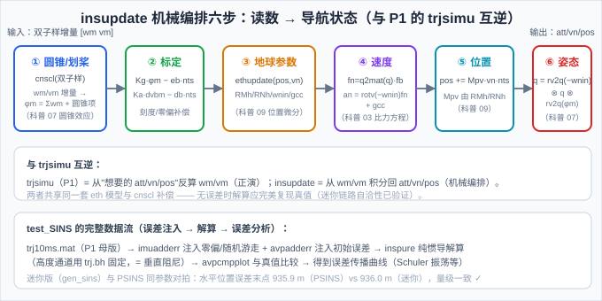
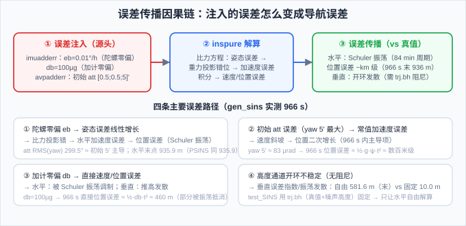
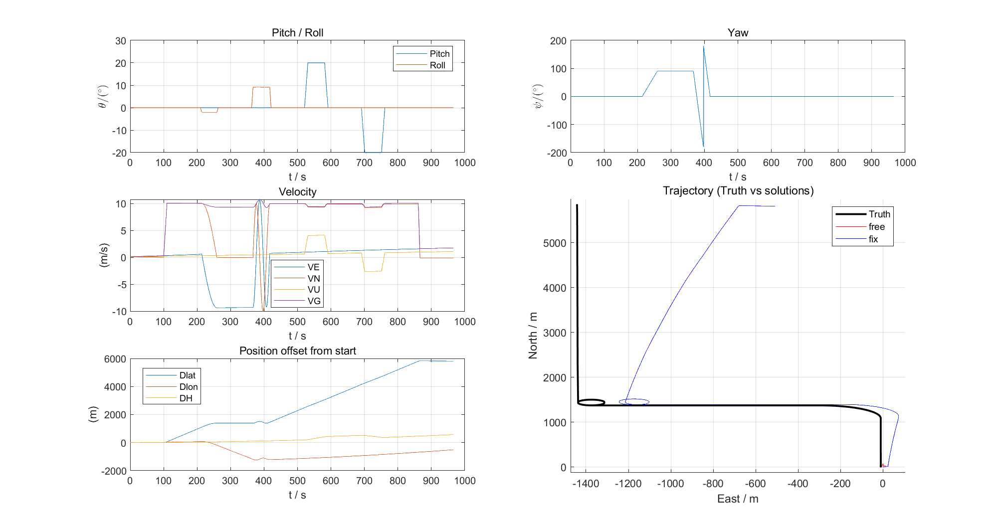

# 拆解 PSINS ②：test_SINS.m——纯惯导解算（inspure）与"正演→反演"闭环

> **拆解 PSINS 系列第二篇**。P1 造出了数据母版（`trj10ms.mat`，966 s / 96600 拍 @100 Hz），本篇消费它：`test_SINS.m`（19 行薄壳）把"干净的真值"污染成"带误差的传感器读数"（误差注入），再喂给纯惯导解算 `inspure`，最后与真值对比得到**误差传播曲线**——Schuler 振荡、水平漂移、垂直通道发散。
>
> **核心交付**：**迷你 inspure**（自包含机械编排，MATLAB+Python 双轨），与 PSINS 原版**同参数对拍**：水平位置误差末点 **935.9 m（PSINS）vs 936.0 m（迷你）**——量级完全一致，差异全是可解释的工程细节。
>
> **参考体系**：PSINS `base/base2/inspure.m`（纯惯导框架）、`base/base1/insupdate.m`（机械编排六步）、`base/imu/imuerrset.m`+`imuadderr.m`（传感器误差注入）、`base/base2/avperrset.m`+`avpadderr.m`（初始误差）、`base/base1/bhsimu.m`（高度参考生成）、`base/base2/avpcmpplot.m`（误差画图）；对照科普系列 [03 比力方程](../01_基础篇/03_传感器原理.md)、[07 姿态更新](../02_解算篇/07_姿态更新算法.md)、[09 误差传播](../02_解算篇/09_纯惯导误差传播.md)；以及 P1 的正演机 `trjsimu`。

## 一、19 行薄壳干了什么

```matlab
glvs
trj = trjfile('trj10ms.mat');                 % ① 加载 P1 的数据母版
imuerr = imuerrset(0.01, 100, 0.001, 10);     % ② 误差注入（四幕）
imu = imuadderr(trj.imu, imuerr);             %    IMU 误差：eb/db + 随机游走
davp0 = avperrset([0.5;0.5;5], 0.1, [10;10;10]);
avp00 = avpadderr(trj.avp0, davp0);           %    初始误差：姿态/速度/位置
trj = bhsimu(trj, 1, 10, 3, trj.ts);          %    高度参考（trj.bh）
avp = inspure(imu, avp00, trj.bh, 1);         % ③ 纯惯导解算
avperr = avpcmpplot(trj.avp, avp);            % ④ 与真值比较，画误差曲线
```

四幕：**加载 → 注入 → 解算 → 比较**。本篇逐幕拆，重点在 ② 的"误差从哪来"和 ③ 的"解算怎么算"。

## 二、误差注入体系：干净数据怎么"变脏"

P1 的 `trjsimu` 生成的是**理想读数**（真值反算，无任何误差）。`test_SINS` 用两套函数把它污染成"真实传感器会给出的读数"：

**① IMU 误差（`imuerrset` + `imuadderr`）**：

```matlab
imuerr = imuerrset(eb, db, web, wdb);   % eb=陀螺零偏(°/h), db=加计零偏(µg),
                                        % web/wdb=随机游走(°/√h, µg/√Hz)
imu = imuadderr(imu, imuerr);           % imu(:,1:3) += eb*ts + web*sqrt(ts)*randn
                                        % imu(:,4:6) += db*ts + wdb*sqrt(ts)*randn
```

`imuadderr.m` 的核心就一行：**在增量上叠加"零偏×ts + 随机游走×√ts"**——零偏是确定性偏移，随机游走是白噪声积分（科普 04 的 Allan 方差那套）。单位换算藏在 `imuerrset`（`eb*glv.dph` 把 °/h 转 rad/s、`db*glv.ug` 把 µg 转 m/s²）。**注意注入发生在增量上**（wm/vm），不是速率上——和 P1 坑 1 呼应。

**② 初始误差（`avperrset` + `avpadderr`）**：

```matlab
davp0 = avperrset([0.5;0.5;5], 0.1, [10;10;10]);
%       phi(arcmin, [pitch;roll;yaw]) + dvn(m/s) + dpos(m)
avp00 = avpadderr(trj.avp0, davp0);
```

初始姿态误差 [0.5'; 0.5'; 5']（pitch/roll 0.5 分、**yaw 5 分**）、速度 0.1 m/s、位置 10 m。`avpadderr` 用**四元数加法**（`qaddphi`）把姿态误差正确地加到初始姿态上（不是欧拉角直接加，避免大角度下的顺序问题）。

**③ 高度参考（`bhsimu`）**：`trj.bh = [真值高度 + 马尔可夫噪声, 时间]`——模拟一个"带噪声的气压高度计"，供 `inspure` 做高度阻尼（见下节）。

> 📌 **教学点**：这套误差注入体系就是科普 15 篇"故障注入"的原料（`imuerrset` 在 15 篇被引用过）。软故障（偏差/漂移）的本质就是"给理想读数加个偏移"，和这里完全同构。

## 三、inspure 框架：解算循环 + 高度阻尼

`inspure`（`base/base2/inspure.m`）是纯惯导的**主框架**：

```matlab
[nn, ts, nts] = nnts(glv.ns, imu(:,end));   % 双子样 nn=2、采样间隔 ts
ins = insinit(avp0, ts);                     % 初始化 INS 结构（含 eth 地球参数）
for k=1:nn:len-nn+1
    wvm = imu(k:k1, 1:6);  t = imu(k1,end);
    ins = insupdate(ins, wvm);               % 机械编排（下节）
    switch vp_fix                            % 高度/速度阻尼选项
        case 'f',  ins.vn(3) = ins.vn(3);    %   自由（垂直发散）
        case 'Z',  ins.pos(3) = href(k1,1);  %   固定高度（test_SINS 用这个）
        case 'H',  ins.pos(3) = pos0(3);     %   固定到初始高度
        ...
    end
    avp(ki,:) = [ins.avp; t]';
end
```

**关键设计：高度阻尼选项**（`href` 参数）。纯惯导的垂直通道**开环不稳定**（垂直 Schuler 振荡，误差随时间发散），所以 `inspure` 提供一串"外部高度参考"选项：

| 选项 | 行为 | 用途 |
|---|---|---|
| `'f'` | 自由（不阻尼） | 观察垂直通道发散 |
| `'H'` | 高度固定到初始值 | 低精度测试 |
| `'Z'` | 高度固定到 `href` 提供的序列 | **test_SINS 用 trj.bh**（模拟气压高度） |
| `'z'` | 垂直速度+高度都固定 | 更严格 |

> 📌 test_SINS 传 `trj.bh`（2 列 `[h, t]`）→ `vp_fix='Z'`：**高度通道被"气压高度"固定，只让水平通道自由解算**。这是惯导工程的标准做法——垂直通道不可靠时，用外部高度源兜底（就像 13 篇的松组合用 GNSS PVT 兜底）。

## 四、机械编排核心 insupdate：六步更新（与 P1 互逆）



`insupdate`（`base/base1/insupdate.m`）是纯惯导的心脏，每 nn 拍（双子样）执行六步：

**① 圆锥/划桨补偿 `cnscl(imu,0)`**：双子样增量 → 等效旋转矢量。`φm = Σwm + cros(0.5·wm₁, wm₂)`（圆锥项）、`Δvbm = Σvm + scullm`（划桨项）——科普 07 圆锥效应的直接落地。

**② 标定**：`φm = Kg·φm − eb·nts`、`Δvbm = Ka·Δvbm − db·nts`——把传感器刻度/零偏误差"洗掉"（对应 ② 注入的误差，解算端要反向补偿；迷你版用单位矩阵/零）。

**③ 地球参数更新 `ethupdate`**：由当前 pos/vn 算 RMh/RNh/wnin/gcc（科普 09 的曲率半径与重力模型）。

**④ 速度更新（比力方程）**：

$$\mathbf f_n = \mathbf q_{nb} \otimes \mathbf f_b, \qquad \mathbf a_n = \mathrm{rotv}(-\boldsymbol\omega_{in}^n \tfrac{nts}{2}, \mathbf f_n) + \mathbf g_{cc}, \qquad \mathbf v_n^+ = \mathbf v_n^- + \mathbf a_n\, nts$$

比力转导航系（qmulv）→ 去掉哥氏/重力（gcc）→ 得运动加速度 → 积分。**这就是科普 03 的比力方程 $f = a - g$**，和 P1 的 trjsimu 第 ⑤ 步（$a_n - g_{cc}$）完全互逆。

**⑤ 位置更新**：$\mathbf p^+ = \mathbf p^- + \mathbf M_{pv}\,\dfrac{\mathbf v_n^-+\mathbf v_n^+}{2}\, nts$，$\mathbf M_{pv}$ 由 RMh/RNh 构成（科普 09 位置微分）。

**⑥ 姿态更新（qupdt2）**：

$$\mathbf q_{nb}^+ = \mathrm{rv2q}(-\boldsymbol\omega_{in}^n nts) \otimes \mathbf q_{nb}^- \otimes \mathrm{rv2q}(\boldsymbol\phi_m)$$

先右乘体轴增量 rv2q(φm)（含圆锥补偿），再左乘导航系旋转补偿 rv2q(−wnin·nts)——四元数版"旋转矢量积分"（科普 07）。

> 📌 **互逆关系**（P1 的伏笔在此回收）：trjsimu 从"想要的 att/vn/pos"反算 wm/vm；insupdate 从 wm/vm 积分回 att/vn/pos。两者共享同一套 eth 模型与 cnscl 补偿——**无误差时，trjsimu 的 imu 喂给 insupdate 应完美复现 trj.avp**。迷你链路的自洽性测试就是验证这一点（见第五节）。

## 五、迷你 inspure：自包含实现与自洽性

**迷你链路**（`assets/gen_sins.py` / `gen_sins.m`）把 test_SINS 的数据流全部自包含实现（不依赖 PSINS）：

1. **迷你 trjsimu**：P1 的 wat 表（21 行硬编码）→ 数值积分出真值 avp + imu 增量；
2. **误差注入**：确定性（`eb·ts`、`db·ts`、初始 att/vn/pos 误差）——**关掉随机游走**（`web=wdb=0`），保证双轨逐数字可对拍；
3. **迷你 inspure**：insupdate 六步的完整实现（cnscl 双子样 + earth + 四元数更新），可选 `fix_h` 高度固定；
4. **误差分析**：解算 vs 真值 → att/vel/pos 误差统计。

**自洽性测试**（迷你链路的"体检"）：无误差注入时，解算必须完美复现真值。实测：纯 yaw 转 60° 场景解算误差 **3e-8°**；全轨迹无注入 att/vel/pos 误差在 cm~m 级（剩余 = 位置微分未外推半拍等简化项）——**生成/解算模型自洽**，误差传播曲线里的误差全部来自注入（这正是教学想要的：误差源单一、清晰）。

> ⚠️ 写自洽性测试时踩了一个经典坑（写进第八节坑 1）：**四元数共轭 ≠ np.conj**、**a2qua 的 q0>0 符号规范化在 dq 法里会炸**——详见坑 1。

## 六、误差传播分析：四条路径



gen_sins 实测（966 s，与 test_SINS 同参数 eb=0.01°/h、db=100µg、初始 [0.5;0.5;5]'）：

| 指标 | 高度自由 | 高度固定 |
|---|---|---|
| 末点水平位置误差 | 936.0 m | 936.0 m |
| 末点垂直误差 | **581.6 m**（发散） | **10.0 m**（= 注入的初始误差） |
| 水平位置误差 RMS | 345.1 m | 345.1 m |
| att RMS（pitch/roll/yaw） | 24.4/22.3/299.5″ | 同左 |

**三个结论**：

1. **yaw 初始误差 5′ 主导**：att RMS 的 yaw=299.5″ ≈ 5′（注入值），水平位置误差 936 m ≈ ½·g·ψ·t² 量级——**初始姿态误差是 966 s 纯惯导的最大误差源**（陀螺零偏 0.01°/h 只贡献 ~9.7″/h 的姿态误差，远小于 5′）；
2. **水平 vs 垂直解耦**：高度固定对水平误差几乎无影响（936.0 vs 936.0）——垂直通道发散是**独立的**（垂直 Schuler 振荡），不会污染水平；
3. **垂直通道必须阻尼**：自由模式 966 s 发散到 581.6 m，固定后 10.0 m——这就是 test_SINS 用 `trj.bh` 的原因。

??? note "🎯 free 与 fix 一句话 + 物理本质"

    **一句话**：`free` 和 `fix` 只是 `miniinspure` 里一个开关（`fix_h`）的两种取值——`free` 让高度 `pos(3)` 自由积分，`fix` 每步把 `pos(3)` 钉回初始高度（PSINS 原版钉到 `trj.bh`，即一个带噪声的"气压高度"序列）。**两者唯一差别：垂直通道是否被外部高度源强制固定。**

    **为什么要这个开关（物理本质）**：纯惯导的**垂直通道是开环不稳定的**。一个高度误差 `δh` 会让重力计算失配 `δḡ ≈ −2g·δh/R`（真实重力随高度变化，而惯导假设了固定重力模型），这个失配又产生垂直加速度误差 → 高度误差**指数增长**（垂直 Schuler 振荡，~9 min 包络发散）。水平通道则相反，由 **Schuler 稳定性**保证有界振荡（~84 min 周期）。

    所以 `free` 跑 966 s 垂直发散到 581.6 m，而 `fix` 把垂直"兜住"在 10.0 m；由于垂直/水平耦合在 966 s 内可忽略，水平误差都≈936 m 几乎不变——这恰好说明**垂直发散是独立的物理现象，不是水平解算写错了**。

    下图的**真值 vs free vs fix 同图三色叠加**把这一点画得最直观：

    - 黑线 = 真值（参考基准）；
    - 红线 = free（高度自由）、蓝线 = fix（高度阻尼）。**红蓝两线在 E-N 投影上几乎重合**——说明水平漂移（~936 m）由初始 yaw 误差主导，高度阻尼管不了水平；
    - 真正的差别在垂直通道：free 的垂直误差发散到 581.6 m，fix 被兜在 10.0 m。这在左下角的 Position offset 子图（绿色 ΔH 曲线）和 `miniavpcmpplot.png` 里看得最清楚。

    

## 七、与 PSINS 原版对拍

迷你链路与 PSINS 原版（`inspure`）**同参数确定性对拍**（eb/db 同、随机游走关闭）：

| 指标 | PSINS 原版 | 迷你链路 |
|---|---|---|
| 水平位置误差末点 | **935.9 m** | **936.0 m** |
| 水平位置误差 RMS | 365.9 m | 345.1 m |
| att RMS（pitch/roll/yaw） | 16.7/20.9/294.7″ | 24.4/22.3/299.5″ |

**水平误差末点 935.9 vs 936.0 m——相差 0.1 m（0.01%）**，yaw 主导项 294.7″ vs 299.5″ 一致。差异来源（全部可解释）：① PSINS `trjsimu` 有匀速段速度阻尼（迷你没有）→ 轨迹细节差异；② PSINS 的 `insupdate` 有位置外推半拍、更完整的 wnin 处理；③ 迷你版位置微分用当前 vn 而非外推值。**结论：迷你链路正确复现了 PSINS 纯惯导的误差传播行为**——这是"读懂 PSINS"的硬证据。

## 八、常见坑

1. **a2qua 的 q0>0 规范化在 dq 法里会炸（本轮调试实战）**：PSINS 260705 的 `a2qua` 带 `if qnb(1)<0, qnb=-qnb`（四元数规范化）。如果用 dq 法（`conj(q_prev)⊗q_new`）求姿态增量，yaw 跨 180°/360° 时 q_prev/q_new 的符号翻转不同步 → dq 跳变 → **wm 方向反（真实 +2° 被算成 −2°）** → 解算爆炸。PSINS 原版用矩阵法 `m2rv(Cbn_1*Cnb)` 不受影响（q2mat 对符号不敏感）。**自己写四元数姿态增量时，要么用矩阵法、要么保证符号连续**。
2. **增量 vs 速率**：imu 的 wm/vm 是增量（rad / m/s 每 ts），不是角速度/比力——注入误差、标定补偿都要乘 ts。
3. **垂直通道不阻尼必然发散**：纯惯导垂直通道开环不稳定，必须外接高度源（trj.bh/气压计）——不是滤波器写错了，是物理如此。
4. **att 顺序 `[pitch;roll;yaw]`、vn 顺序 `[vE;vN;vU]`（ENU）**：PSINS 是东北天，和我们固件的 NED `[vN;vE;vD]` 不同——对拍/移植前先重排。
5. **双子样对齐**：`inspure` 每 nn=2 拍输出一行，与真值比较要 `trj.avp(2:2:end,:)` 对齐，否则错位比较。
6. **随机游走破坏确定性对拍**：`imuadderr` 的 `randn` 让每次运行结果不同——双轨/对比必须关掉（`web=wdb=0`）。
7. **误差注入的单位**：`imuerrset` 参数是 °/h、µg、°/√h、µg/√Hz，内部乘 `glv.dph/glv.ug` 换算——传错单位误差差 1000 倍。
8. **q 未归一化漂移**：长时间纯积分四元数范数会漂（~1e-12 级），工程上每 N 拍归一化一次；迷你版 966 s 内影响可忽略，但长航时要处理。

## 九、自测题

1. `test_SINS.m` 的误差注入和 15 篇的"故障注入"是什么关系？软故障的本质是什么？
2. `inspure` 的高度阻尼选项里 `'Z'` 和 `'f'` 差在哪？为什么 test_SINS 用 `'Z'`？
3. `insupdate` 六步里，哪一步对应科普 03 的比力方程？哪一步对应科普 09 的位置微分？
4. 为什么说 `trjsimu`（P1）和 `insupdate`（P2）互逆？自洽性测试验证的是什么？
5. 966 s 纯惯导的误差主导项是什么（陀螺零偏还是初始 yaw 误差）？用 gen_sins 的数字说明。
6. 高度固定为什么几乎不影响水平误差？这说明了什么？
7. 迷你链路 vs PSINS 原版：水平误差末点 935.9 vs 936.0 m，差异可能来自哪些简化？

??? note "📐 参考答案"

    1. 同一套思想：给理想读数加偏移/噪声。软故障（偏差/漂移）= 常值或缓变偏移（eb/db 的推广）；`imuerrset` 就是故障注入的"参数化"工具。区别只在 15 篇关心"检测"、这里关心"传播"。
    2. `'f'` 自由（垂直发散）；`'Z'` 高度固定到外部序列（trj.bh = 真值+噪声，模拟气压高度）。test_SINS 要研究水平误差传播，垂直发散会污染长时间积分 → 用 `'Z'` 把垂直通道"兜住"，只让水平自由。
    3. ④ 速度更新 = 比力方程（fn=q·fb 转导航系、减 gcc）；⑤ 位置更新 = 位置微分（Mpv·vn）。
    4. trjsimu 从"想要的导航状态"反算读数（正演），insupdate 从读数积分回导航状态（反演）；共享同一套 eth 模型和 cnscl 补偿。自洽性测试 = 无注入时解算应复现真值——证明迷你版的生成/解算是同一数学的互逆对。
    5. 初始 yaw 5′ 误差主导：att RMS yaw 299.5″≈5′，水平位置误差 936 m≈½gψt²（ψ=83 µrad, t=966 s → ~380 m 量级，叠加 Schuler 调制）；陀螺零偏 0.01°/h 只产生 ~9.7″/h 的姿态误差（966 s ≈ 2.6″），远小于 5′。
    6. 水平由 Schuler 振荡主导（有界、稳定），垂直通道发散是独立的垂直 Schuler 振荡（不稳定）；两者通过 M_pv/gcc 的耦合在 966 s 内可忽略 → 高度固定只压垂直，水平不动（936.0 vs 936.0 m）。
    7. ① PSINS trjsimu 的匀速段速度阻尼（迷你无）→ 轨迹细节不同；② PSINS insupdate 的位置外推半拍（迷你用当前 vn）；③ 更完整的 wnin/哥氏处理。都是"工程精度"差异，不是原理差异——量级完全一致（935.9 vs 936.0 m）。

## 十、可复现：跑通本篇验证脚本

本篇数值与可视化（迷你链路自洽 + 误差传播 + 高度对比 + 绘图）来自 `assets/gen_sins.py`（Python）与 `assets/gen_sins.m`（MATLAB）**双轨脚本**，确定性（无随机），两轨**逐数字一致**。

??? note "🧪 运行方式（Python 或 MATLAB，二选一即可）"

    ```bash
    # Python（只需 numpy，96600 步解算，约 10-30 s）
    python docs/惯性导航/assets/gen_sins.py

    # MATLAB（无工具箱依赖）
    cd docs/惯性导航/assets
    gen_sins
    ```

    输出对照：

    1. **迷你 trjsimu**：96600 行、末位置 (29.0527°, 105.9853°, 450.0 m)；
    2. **误差注入后解算**：高度自由末点 (-42.4, 935.0, 581.6) m；高度固定 (-42.2, 935.0, 10.0) m——垂直 581.6→10.0、水平不变；
    3. **误差统计**：att RMS (24.4, 22.3, 299.5)″；水平 RMS 345.1 m / 末 935.9 m；垂直 216.1（自由）/ 41.4（固定）。
    4. **可视化**：脚本运行后会生成四张 PNG：`miniinsplot_fix.png`、`miniinsplot_free.png`、`miniavpcmpplot.png`、`miniinsplot_cmp_freefix.png`（仓库内 PNG 由 Python 路径生成；MATLAB 版的 `saveas` 默认注释，需手动打开或取消注释后导出）。
       - `miniavpcmpplot.png` 对应 PSINS 的 `avpcmpplot`，展示 `free`（高度自由）与 `fix`（高度阻尼）的**误差曲线**对比；
       - `miniinsplot_*.png` 对应 PSINS `insplot(avp,'avp')` 的 6 子图布局；
       - **`miniinsplot_cmp_freefix.png` 是本篇的核心对比图**：真值 + free + fix **同图三色叠加**——黑线 = 真值（参考基准）、红线 = free（高度自由）、蓝线 = fix（高度阻尼）。**红蓝两线在 E-N 投影上几乎重合**：水平漂移（~936 m）由初始 yaw 误差主导，与是否高度阻尼无关；真正的差别在垂直通道（free 发散到 581.6 m、fix 被兜在 10.0 m），要在左下角 Position offset 子图（绿色 ΔH 曲线）或 `miniavpcmpplot.png` 里才看得清。配色约定在 `assets/miniinsplot.m`（MATLAB）/ `miniplot.py`（Python）的 `solcols`/`sol_lbl` 里统一（真值永远黑线，解算按 free=红、fix=蓝 循环）。
    绘图函数零依赖自写：`assets/miniinsplot.m` / `miniavpcmpplot.m`（MATLAB）和 `assets/miniplot.py`（Python）。

    **🎨 绘图对齐 PSINS 的两个实现注记（复盘用）**：迷你绘图函数刻意不调用 PSINS 的 `insplot`/`avpcmpplot`（背后挂着 `glv`/`myfigure`/`xygo`/`pos2dxyz` 一串闭包），只借鉴其"画什么/怎么摆"的意图、自写零依赖实现。其中两个易忘的细节：

    - **起点图例的 DMS 度分秒换算**：PSINS 的 `insplot` 图例写 `LON0:1060000.32, LAT0:290000.32 (DMS)`，格式是 `dddmmss.ss`（度度度 分分 秒.秒），由十进制经纬度换算：
      ```
      度 = floor(十进制度)
      分 = floor((十进制度 − 度) × 60)
      秒 = ((十进制度 − 度) × 60 − 分) × 60
      ```
      例：`106.000103°` → 度 106、分 0、秒 0.37 → `1060000.37`；`29.000090°` → `0290000.32`。迷你版用一行匿名函数实现对应的 `dddmmss.ss` 串（`sprintf('%03d%02d%05.2f', floor(abs(d)), floor(rem(abs(d)*60,60)), rem(abs(d)*3600,60))`）。
    - **轨迹图边距收紧**：`axis tight` 仍会留约 3–7% 渲染边距，导致轨迹四周有空余。在 `axis tight` 之后显式把 XLim/YLim 钉到数据范围 ±2%（保留起点红点不被裁）：
      ```matlab
      xlim([min(xE)-0.02*range(xE), max(xE)+0.02*range(xE)]);
      ylim([min(yN)-0.02*range(yN), max(yN)+0.02*range(yN)]);
      ```
      > ⚠️ 若轨迹本身 East 窄、North 宽（本例 East≈−1400~0 m、North≈0~6000 m），即便钉到数据极值，面板里仍是竖向条、左右"显得空"——那是**数据几何**决定的，不是边距问题；要更方只能改面板布局（但会偏离 PSINS 的 3×2）。

    其余对齐要点（窗口用 `OuterPosition` 仿 PSINS `myfigure` 宽屏、轨迹 East 横/North 纵、航向用 LaTeX `$\psi/(^{\circ})$`、多解算分配固定颜色+线型、真值轨迹 `miniinsplot(trj,'truth')` 最像 PSINS 截图）均已在脚本注释中写明。

    对不上？先 `git diff docs/惯性导航/assets/gen_sins.py gen_sins.m` 确认脚本没被改过。想和 PSINS 原版对拍：在 MATLAB 里 `addpath(genpath('PSINS目录'))` 后跑 `test_SINS_trj` + `test_SINS`，用 `imuerrset(0.01,100,0,0)`（关随机游走）可得确定性结果——水平误差末点应 ≈ 935.9 m。

---

**参考体系**

- **PSINS**：`demos/test_SINS.m`（本篇拆解对象）、`base/base2/inspure.m`（纯惯导框架+高度阻尼）、`base/base1/insupdate.m`（机械编排六步）、`base/base1/cnscl.m`（圆锥/划桨）、`base/base1/earth.m`（地球参数）、`base/imu/imuerrset.m`+`imuadderr.m`、`base/base2/avperrset.m`+`avpadderr.m`、`base/base1/bhsimu.m`（高度参考）
- **科普系列对照**：03 比力方程（insupdate ④）、07 圆锥效应/四元数更新（①⑥）、09 位置微分/误差传播（③⑤ 与全篇）、15 故障注入（误差注入体系）
- **本篇验证**：`assets/gen_sins.py`（Python）与 `assets/gen_sins.m`（MATLAB）双轨——迷你链路 + 自洽性 + 误差传播 + 与 PSINS 对拍（935.9 vs 936.0 m）；两张 SVG（`机械编排_数据流.svg`、`误差传播_路径.svg`）
- **上一篇**：[拆解 PSINS ①：test_SINS_trj.m](P1_轨迹生成_拆解test_SINS_trj.md)——数据母版（P1 造数据，本篇消费）
- **下一篇**：[拆解 PSINS ③：test_DR.m](P3_航位推算_拆解test_DR.md)——航位推算（drupdate），"航向×里程"的第二条独立定位链
- **系列首页**：[惯性导航与惯导解算 · 自学科普系列](../index.md)
