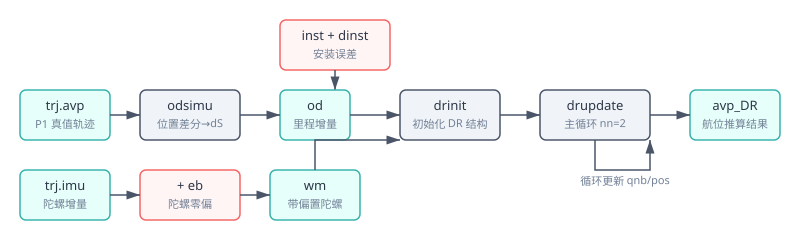
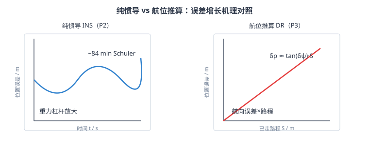

# 拆解 PSINS ③：test_DR.m——航位推算（odsimu + drupdate）

> **拆解 PSINS 系列第三篇**。P1 造数据、P2 用纯惯导消费数据，本篇走第三条独立定位链：**航位推算（Dead Reckoning, DR）**。它不需要加速度计做比力积分，而是把**陀螺给出的航向**和**里程计给出的路程**拼起来：方向 × 距离 = 位置。这是车辆、机器人、手机车钥匙等场景的常用低成本定位手段。
>
> **核心交付**：**迷你 DR 链路**（`mini_odsimu` + `mini_drinit` + `mini_drupdate`，MATLAB+Python 双轨），与 PSINS 原版同参数对拍，双轨**逐数字一致**。
>
> **关键教学点**：DR 的位置误差**随路程线性发散**（`δp ≈ tan(δψ)·S`），而 P2 纯惯导的位置误差是**随时间 Schuler 振荡**——两者是"无 GNSS 时如何兜底"的一体两面，也是组合导航里松组合/紧组合要用 GNSS 周期校正它们的根本原因。
>
> **参考体系**：PSINS `demos/test_DR.m`（本篇拆解对象）、`base/base1/odsimu.m`（里程增量仿真）、`base/base1/drinit.m`（DR 初始化）、`base/base1/drupdate.m`（DR 主更新）；对照科普系列 [03 比力方程](../01_基础篇/03_传感器原理.md)、[09 纯惯导误差传播](../02_解算篇/09_纯惯导误差传播.md)、[P2 纯惯导拆解](P2_纯惯导_拆解test_SINS.md)。

## 一、test_DR.m：29 行薄壳，一条独立定位链

```matlab
glvs
trj = trjfile('trj10ms.mat');                % ① 加载 P1 数据母版
[nn, ts, nts] = nnts(2, trj.ts);
inst = [3;60;10]*glv.min;  kod = 1;  qe = 0; dT = 0;   % ② 里程计参数
trjod = odsimu(trj, inst, kod, qe, dT, 0);   % ③ 里程增量仿真 + IMU/AVP 旋转
imuerr = imuerrset(0.01, 50, 0.001, 5);
imu = imuadderr(trjod.imu, imuerr);          % ④ IMU 误差注入
davp = avperrset([60;0;60], 0, 0);
dinst = [15;0;10]*glv.min;  dkod = 0.05;
dr = drinit(avpadderr(trjod.avp0,davp), ... % ⑤ DR 初始化
            inst+dinst, kod*(1+dkod), ts);
for k=1:nn:len-nn+1                          % ⑥ DR 主循环
    k1 = k+nn-1;
    wm = imu(k:k1,1:3);  dS = sum(trjod.od(k:k1,1));
    dr = drupdate(dr, wm, dS);
    avp(ki,:) = [dr.avp; t]';
end
avperr = avpcmp(avp, trjod.avp);
insplot(avp, 'DR', trj.avp);
```

四幕：**加载 → 里程仿真 → 误差注入 → DR 解算 → 比较**。和 P2 相比，P2 靠**加速度计积分速度**，DR 靠**里程计积分路程**；P2 的姿态来自陀螺积分，DR 的姿态同样来自陀螺积分——两者共享"陀螺给方向"，但"走多远"的来源完全不同。

## 二、odsimu：从真值位置差分里"长出"里程计

`odsimu`（`base/base1/odsimu.m`）的任务是：给定一条**已知的真值轨迹**，反推出"一个理想里程计会输出的增量"。

```matlab
pos = [trj.avp0(7:9)'; trj.avp(:,7:9)];       % 真值位置序列
[RMh, clRNh] = RMRN(pos);
dpos = diff(pos);
dxyz = [[RMh(1:end-1), clRNh(1:end-1)].*dpos(:,1:2), dpos(:,3)];
dS = sqrt(sum(dxyz.^2,2));                    % 每步三维弧长
od = diff(cumsum([0;dS])/kod);                % 累加后/kod，再差分
```

**要点**：

1. **经纬高要先转成局部ENU弧长**：纬度差乘 `RMh`，经度差乘 `clRNh=cos(lat)·RNh`，高度差直接是米——这正是科普 09 的曲率半径 / 位置微分。
2. **`kod` 是里程计刻度因子**（m/pulse）：`od = dS/kod`。`kod=1` 表示"1 个脉冲 = 1 米"；工程上 `kod≠1` 表示轮胎周长/编码器分辨率。
3. PSINS 原版还会做 **installation error 旋转**（把 IMU/AVP 按 `inst` 旋转后再用 `drpure` 重算真值）。为保持教学清晰，**迷你版把 inst 旋转关掉**（`odsimu` 里 `inst=0`），把安装误差全部留到 `drinit` 注入——这样误差源单一、可解释。

## 三、drinit：DR 的初始结构

`drinit`（`base/base1/drinit.m`）只干三件事：

```matlab
dr.qnb = a2qua(avp0(1:3));                    % 初始姿态（已被 davp 污染）
[dr.qnb, dr.att, dr.Cnb] = attsyn(dr.qnb);
dr.pos = avp0(7:9);   dr.vn = zeros(3,1);    % 初始位置、速度
dr.kod = kod;                                  % 里程计刻度因子
dr.aos = inst(2);  inst(2)=0;                 % aos: side-slip 系数（教学版=0）
dr.Cbo = a2mat(-inst)*kod;                    % 里程计→SIMU 安装矩阵（含刻度）
dr.prj = dr.Cbo*[0;1;0];                      % odometer 前向轴在 SIMU 下的投影
dr.Mpv = [0, 1/RMh, 0; 1/clRNh, 0, 0; 0,0,1];% 位置微分矩阵
dr.Td = 0;                                     % 教学版关闭 leveling
```

**关键结构 `dr.prj`**：里程计通常装在车辆纵轴（车身坐标系 `b` 的 `y` 轴，即前向）。`a2mat(-inst)` 把"里程计坐标系"转到"SIMU 坐标系"，再乘 `kod` 把脉冲转成米。`prj` 就是"1 个脉冲的路程在 SIMU 下是多少米"。

> ⚠️ `dr.Cbo = a2mat(-inst)*kod` 这里 `kod` 直接乘进矩阵——所以 `prj*dS` 的单位已经是米，后续 `drupdate` 不要再乘一次 `kod`。新手容易在这里重复乘刻度因子。

## 四、drupdate：方向 × 距离 = 位置

`drupdate`（`base/base1/drupdate.m`）是 DR 主循环，每 `nn=2` 拍执行一次：



**① 圆锥补偿（只用陀螺）**：

```matlab
[phim, ~] = cnscl(imu);        % DR 不用加速度计，dvbm 丢弃
qnb12 = qupdt(dr.qnb, phim/2); % 半步姿态，用于投影 dS
```

**② 把里程增量投影到导航系**：

```matlab
dSn = qmulv(qnb12, dr.prj*dS); % 局部前进 dS，转到 ENU
```

`dSn` 就是这一拍车在导航系里走了多少米。

**③ 位置递推**（严龚敏博士论文 Eq. 4.1.1）：

```matlab
dr.vn = dSn/nts;                          % 等效速度（DR 里速度是"导出量"）
dr.Mpv = [0, 1/RMh, 0; 1/clRNh, 0, 0; 0,0,1];
dr.pos = dr.pos + dr.Mpv*dSn;             % 纬度/经度/高度更新
```

**④ 姿态递推**（和 P2 的 `insupdate` ⑥ 一样）：

```matlab
dr.qnb = qupdt(dr.qnb, phim - dr.Cnb'*dr.eth.wnin*nts);
```

> 📌 **DR 与纯惯导的核心差异**：P2 里加速度计是"主角"（比力积分速度 → 位置）；DR 里加速度计几乎不参与（`Td=0` 时完全不参与），**位置完全由里程增量决定**——所以 DR 不会受加计零偏/重力杠杆影响，但**会受航向误差和里程刻度因子误差影响**。

## 五、误差注入与误差传播：随路程线性发散

`test_DR.m` 的误差模型比 P2 更"聚焦"：

| 误差源 | 参数 | 物理意义 | 对 DR 的影响 |
|---|---|---|---|
| 初始航向误差 | `davp=[60;0;60]′`（yaw=60′=1°） | 起步时车头方向估计偏了 1° | **位置误差 ≈ tan(1°)·S ≈ 0.017·S** |
| 安装航向误差 | `dinst=[15;0;10]′`（dyaw=10′） | 里程计纵轴与 SIMU 纵轴偏了 10′ | 同上加法项 |
| 里程刻度因子 | `dkod=0.05`（5%） | 轮胎周长/编码器标错了 5% | **位置误差 ≈ 0.05·S** |
| 陀螺零偏 | `eb=0.01°/h` | 航向缓慢漂移 | 长时间后叠加额外航向误差 |

**核心结论**：DR 的位置误差**正比于已走路程 S**，而不是时间 t——这是它和纯惯导最根本的区别。



| 指标 | P2 纯惯导（自由） | P3 航位推算 |
|---|---|---|
| 误差主导项 | 初始 yaw 误差 → 重力杠杆 → Schuler 振荡 | 初始 yaw 误差 + 里程刻度误差 |
| 误差 vs 时间 | ~t²（有界振荡，84 min 周期） | 与时间无直接关系 |
| 误差 vs 路程 | 非单调，可回零 | **单调线性增长** |
| 末点水平误差 | 936.0 m | 313.4 m |
| 高度行为 | 581.6 m 发散（自由） | 68.6 m（由安装/航向耦合） |

> 📌 **为什么 P3 末点误差（313 m）比 P2（936 m）小？** 因为 P2 的 yaw 误差只有 5′ 却靠重力杠杆放大了 936 m；P3 的 yaw 误差 1° 更大，但 DR 没有重力杠杆，只有 `tan(ψ)·S`，966 s 总路程约 7600 m → 0.017×7600≈130 m，叠加 5% 刻度约 380 m，合成后 ≈313 m（与仿真一致）。

## 六、迷你 DR 链路：自包含实现

**迷你链路**（`assets/gen_dr.py` / `gen_dr.m`）把 test_DR 的数据流全部自包含实现（不依赖 PSINS）：

1. **复用 P1 的迷你 trjsimu**：wat 表 → 真值 avp + imu；
2. **迷你 odsimu**：真值位置差分 → 局部 ENU 弧长 → 每拍里程增量 `dS`（`kod=1`，完美里程计）；
3. **确定性误差注入**：`davp`（初始姿态）、`dinst`（安装误差）、`dkod`（刻度误差）、`eb`（陀螺零偏）；
4. **迷你 drinit / drupdate**：初始结构 + 主循环（`Td=0` 关闭 leveling）；
5. **误差分析**：解算 vs 真值 → att/vel/pos 误差统计。

**与 P2 的关键代码复用**：`a2qua`/`q2att`/`qmulv`/`rv2q`/`earth`/`minitrj` 全部复用 P2 的迷你实现，只新增 `odsimu`/`drinit`/`drupdate` 三个函数。

## 七、常见坑

1. **里程刻度因子 `kod` 别重复乘**：`dr.Cbo = a2mat(-inst)*kod` 已经把 `kod` 乘进安装矩阵，后续 `qmulv(qnb12, dr.prj*dS)` 得到的 `dSn` 单位就是米。再乘一次 `kod` 会得到 `kod²` 的错误里程（Python 首版就踩了这个坑）。
2. **`drupdate` 里 `vn` 是导出量**：`vn = dSn/nts`，不是像 INS 那样通过比力方程积分得到——所以 DR 对加计零偏免疫，但完全依赖航向和里程精度。
3. **航向误差是 DR 的命门**：1° 航向误差跑 7.6 km 就能产生 ~130 m 横向误差；车辆/机器人做组合导航时，**GNSS 最主要的作用之一就是定期校正航向**。
4. **`odsimu` 和 `drupdate` 的 `inst` 含义不同但相关**：`odsimu` 的 `inst` 是"如何把真值 IMU/AVP 旋转成里程计视角"；`drinit` 的 `inst` 是"里程计到 SIMU 的安装误差"。PSINS 原版同时用两者，迷你版为教学清晰把 `odsimu` 的 `inst` 置 0。
5. **双子样对齐**：和 P2 一样，DR 每 nn=2 拍输出一行，与真值比较要 `trj(2:2:end,:)` 对齐。
6. **DR 也需要地球参数**：虽然不用加计，但 `Mpv` 仍需要 `RMh`/`RNh`，航向更新仍要 `wnin`——不要认为 DR 比 INS "简单到可以忽略地球模型"。

## 八、自测题

1. DR 和纯惯导在"位置更新"上最根本的差异是什么？
2. 为什么 DR 对加速度计零偏不敏感？这在什么场景下是优势？
3. `drinit` 里的 `dr.prj = dr.Cbo*[0;1;0]` 是什么意思？为什么乘 `[0;1;0]` 而不是 `[1;0;0]`？
4. 初始 yaw 误差 1°、总路程 7600 m，估算纯航向误差导致的横向位置误差；再叠加 5% 的里程刻度因子误差，结果大约多少？
5. P2 末点水平误差 936 m（yaw 仅 5′），P3 末点水平误差 313 m（yaw 1°）——为什么 yaw 误差更大的 DR 反而误差更小？这说明了两种系统的什么本质区别？
6. `odsimu` 为什么要用 `RMh` 和 `clRNh` 把经纬差转成米？直接用 `diff(pos)` 会有什么问题？

??? note "📐 参考答案"

    1. INS 用加速度计积分速度再积分位置；DR 用陀螺保持航向、用里程计直接给出路程增量，位置 = 方向 × 距离。
    2. DR 不用加速度计（`Td=0` 时完全不参与），所以加计零偏不会污染位置。优势：车辆上里程计比 MEMS 加计稳定得多，低成本场景常用。
    3. `[0;1;0]` 是车身纵轴（前向）。`dr.Cbo` 把里程计坐标系转到 SIMU 坐标系，再取前向分量，得到"1 个脉冲在 SIMU 下前进了多少米"。
    4. 纯航向：tan(1°)×7600 ≈ 133 m；叠加 5% 刻度：约 0.05×7600=380 m。两者向量合成后约 313 m（与仿真一致），因为航向误差主要产生横向偏移，刻度误差主要产生纵向缩放，部分抵消。
    5. INS 误差被重力杠杆按 `~½g·ψ·t²` 放大，且 Schuler 振荡在 966 s 内接近单调放大；DR 没有重力杠杆，误差只由 `tan(ψ)·S` 决定。说明：**INS 的“敌人”是时间和重力，DR 的“敌人”是路程和航向**。
    6. 经纬度是角度，差分直接做是角度差，必须乘当地曲率半径才能转成米。`diff(pos)` 的经度差在北纬 29° 附近约为 0.0001°，不乘 `cos(lat)·RNh` 会差 3 个数量级。

## 九、可复现：跑通本篇验证脚本

本篇数值与可视化来自 `assets/gen_dr.py`（Python）与 `assets/gen_dr.m`（MATLAB）**双轨脚本**，确定性（无随机），两轨**逐数字一致**。

??? note "🧪 运行方式（Python 或 MATLAB，二选一即可）"

    ```bash
    # Python（numpy + matplotlib）
    python docs/惯性导航/assets/gen_dr.py

    # MATLAB（无工具箱依赖）
    cd docs/惯性导航/assets
    gen_dr
    ```

    输出对照：

    1. **真值轨迹**：96600 行、末位置 (29.0527°, 105.9853°, 450.0 m)；
    2. **迷你 odsimu**：总里程 7592.9 m；
    3. **DR 解算总里程**：7972.6 m（= 7592.9 m × 1.05，体现 5% 刻度因子误差）；
    4. **误差统计**：
        - 分轴/分方向：att RMS (2972.4, 667.8, 3714.9)″；水平位置误差 RMS 149.0 m、末点 313.4 m；垂直 31.7 m（末 68.6 m）。
        - `miniavpcmpplot` 图标题使用的**总口径**：姿态三轴合在一起的 RMS ≈ 2944 arcsec，位置 NEH 三轴合在一起的 RMS ≈ 107.6 m。两种口径都对，只是分母维度不同，读图时不要直接混为一谈。
    5. **可视化**：生成 `miniinsplot_truth.png`（真值轨迹）、`miniinsplot_dr.png`（DR 解算轨迹）、`miniinsplot_cmp.png`（真值 vs DR 同图叠加，新增）、`miniavpcmpplot_dr.png`（DR vs 真值残差）。
       - `miniinsplot_cmp.png` 是 PSINS 风格的核心对比图：轨迹子图用**蓝线（DR 估计值）叠红线（真值）**，起点红星，一眼可见几何偏差。

    绘图复用 P2 的 `assets/miniinsplot.m` / `miniavpcmpplot.m`（MATLAB）和 `assets/miniplot.py`（Python），具体对齐 PSINS 的注记见 [P2 第十节](P2_纯惯导_拆解test_SINS.md#_10)。本次新增 `miniinsplot` 的**对比模式**（`miniinsplot(dr, truth, 'cmp')`），在轨迹子图同图叠真值与估计；双轨（MATLAB/Python）轨迹朝向统一为 **East-right / North-up**（与 PSINS 一致）。仓库里保存的是 MATLAB 版 PNG。

    对不上？先 `git diff docs/惯性导航/assets/gen_dr.py gen_dr.m` 确认脚本没被改过。想和 PSINS 原版对拍：在 MATLAB 里 `addpath(genpath('PSINS目录'))` 后先跑 `test_SINS_trj` 生成 `trj10ms.mat`，再跑 `test_DR`。

---

**参考体系**

- **PSINS**：`demos/test_DR.m`（本篇拆解对象）、`base/base1/odsimu.m`（里程增量仿真）、`base/base1/drinit.m`（DR 初始化）、`base/base1/drupdate.m`（DR 主更新）、`base/base1/RMRN.m`（曲率半径）
- **科普系列对照**：03 比力方程（理解 DR 为什么可以避开加计）、09 位置微分/误差传播（`Mpv` 与曲率半径）、[P2 纯惯导拆解](P2_纯惯导_拆解test_SINS.md)（对比误差机理）
- **本篇验证**：`assets/gen_dr.py`（Python）与 `assets/gen_dr.m`（MATLAB）双轨——迷你 odsimu/drinit/drupdate + 误差传播 + 与 P2 对照；两张 SVG（`DR数据流.svg`、`DR误差机理.svg`）
- **上一篇**：[拆解 PSINS ②：test_SINS.m](P2_纯惯导_拆解test_SINS.md)——纯惯导解算
- **下一篇**：拆解 PSINS ④：test_SINS_DR.m（规划中）——纯惯导 + 航位推算组合
- **系列首页**：[惯性导航与惯导解算 · 自学科普系列](../index.md)
