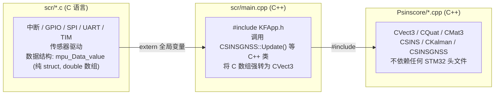
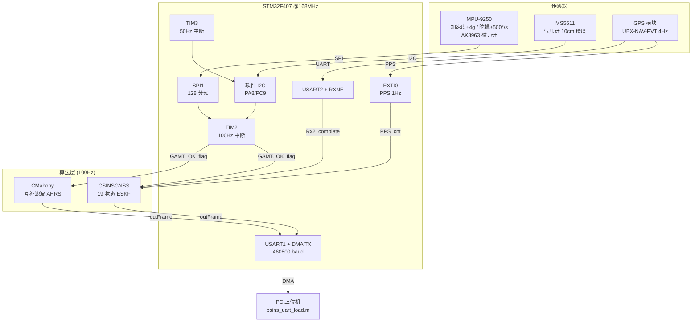

# PSINS\_STM32F4xx 嵌入式总览：从 MATLAB 到 MCU 的落地架构

> 配套源码: [PSINS\_STM32F4xx\_Keil4\_V2.1](../../assets/PSINS_STM32F4xx_Keil4_V2.1/)（全目录）
> 所属层级: 嵌入式落地篇
> 前置依赖: 建议先读 [00 读码地基](../P系列与总览/00_读码地基.md)（PSINS 数据结构 / 约定）和 [03 insupdate](../linebyline/03_insupdate.md)（算法原理）
> 学习目标: 读完后你应能回答：
>
> 1. 这个工程有几层？哪层是 C、哪层是 C++？两层之间怎么桥接？
> 2. 100Hz 的中断和主循环之间通过什么机制同步？
> 3. MATLAB 版 PSINS 和这个嵌入式版的核心算法层有没有改过？

!!! tip "本篇在系列中的定位"
你已经读过 [拆解 PSINS 篇](../P系列与总览/00_读码地基.md) 的 MATLAB 代码——`insupdate.m` 怎么算、`kfupdate.m` 怎么滤波。本篇回答一个新问题：**这些算法怎么从 PC 的 MATLAB 搬到 STM32 的 C/C++ 里跑起来？**

```
核心洞察：**算法层（`Psinscore/`）一行没改**，变的是外面那层嵌入式壳（`scr/`）。你只要看懂"壳"怎么把传感器数据喂给算法、怎么把算法结果输出，就接上了已有的全部知识。
```

***

## 一、工程目录结构

```
PSINS_STM32F4xx_Keil4_V2.1/
├── Libraries/                  # ST 标准库 + CMSIS（平台依赖，移植时替换）
│   ├── CMSIS/                  #   ARM Cortex-M4 内核头文件
│   └── STM32F4xx_StdPeriph_Driver/  # STM32F4 标准外设驱动
├── Project/                    # Keil4 工程文件
│   ├── Project.uvprojx         #   工程配置（编译选项、文件分组）
│   └── Project.uvoptx          #   调试配置
├── Psinscore/                  # ★ 核心算法库（纯 C++，与平台无关，移植时原封不动）
│   ├── PSINS.h / PSINS.cpp    #   严龚敏 PSINS 主库：CVect3/CQuat/CMat3/CSINS/CKalman
│   └── KFApp.h / KFApp.cpp    #   本板 SINS/GNSS 松组合滤波器实例（19 状态 ESKF）
├── scr/                        # ★ 板级驱动与主循环（C/C++ 混合，移植时重写）
│   ├── main.cpp                #   入口，4 种工作模式调度
│   ├── main.h                  #   全局变量声明、Out_Frame 结构体
│   ├── mcu_init.c / .h         #   时钟/GPIO/SPI/UART/TIM/MS5611 初始化
│   ├── mpu9250.c / .h          #   MPU9250（+AK8963 磁力计）SPI 驱动
│   ├── ms5611.c                #   MS5611 气压计驱动（软件 I2C）
│   ├── usart.c                 #   串口 DMA 输出、GPS 解析（UBX PVT）
│   ├── stm32f4xx_it.c / .h    #   ★ 中断服务函数（TIM2/TIM3/USART2/EXTI0）
│   ├── system_stm32f4xx.c      #   系统时钟配置（168MHz）
│   ├── startup_stm32f4xx.s     #   启动汇编
│   └── stm32f4xx_conf.h        #   标准库裁剪配置
├── data/                       # MATLAB 工具
│   ├── psins_uart_load.m       #   串口二进制日志解析脚本
│   └── 11.txt                  #   示例日志数据
└── keilkill.bat                # 编译中间件清理脚本
```

!!! note "三个关键目录的颜色含义"
\- **`Psinscore/`**：你之前读过的 PSINS MATLAB 的 C++ 版本。`CSINS::Update()` 对应 `insupdate.m`，`CKalman::TimeUpdate/MeasUpdate` 对应 `kfupdate.m`。**这一层你不需要重新学**。
\- **`scr/`**：嵌入式壳。中断怎么触发、传感器怎么读、数据怎么打包输出——全在这里。**这是本系列拆解的重点**。
\- **`Libraries/`**：ST 标准库。移植到 H743 时换成 HAL 或 LL 库即可，不需要逐行读。

***

## 二、C / C++ 混合架构

这是本工程最可能让你困惑的架构特点：**同一个 Keil 工程里混了 C 和 C++ 两种语言**。

### 2.1 分层边界



### 2.2 两层之间的桥接机制

C 文件（如 `stm32f4xx_it.c`）把传感器原始数据写到全局变量 `mpu_Data_value`，C++ 文件（`main.cpp`）读这个全局变量，**强制转换**成 PSINS 的 C++ 类 `CVect3`：

```cpp
// main.cpp L45 — 这一行就是 C→C++ 的桥梁
wm = (*(CVect3*)mpu_Data_value.Gyro * glv.dps - eb) * TS;
//    ^^^^^^^^^^^^^^^^^^^^^^^^^^^^^
//    double[3] 强转为 CVect3（3 个 double 成员 i,j,k）
```

为什么能强转？因为 `CVect3` 的内存布局就是 `double i, j, k`（连续 3 个 double），和 `double[3]` 二进制完全一致。详见 [06 C 与 C++ 桥接](06_C与CPP桥接.md)。

!!! warning "新手最常犯的错误"
不要试图把 `scr/*.c` 改成 `.cpp`。C 文件里的标准库函数（`GPIO_SetBits` 等）是 C 链接，改成 C++ 会导致链接错误。保持 C 就是 C、C++ 就是 C++，靠 `extern` 全局变量桥接。

***

## 三、系统框图



***

## 四、硬件配置速查

| 外设     | 引脚                  | 用途               | 配置                    |
| ------ | ------------------- | ---------------- | --------------------- |
| SPI1   | PC4(CS) / PA5,6,7   | MPU9250 通信       | Master, 128 分频, Mode3 |
| GPIO   | PA15                | MPU9250 数据就绪 INT | 输入上拉                  |
| I2C(软) | PA8(SCL) / PC9(SDA) | MS5611 气压计       | 软件模拟                  |
| USART1 | PA9(TX) / PA10(RX)  | PC 串口输出          | 460800 baud, DMA TX   |
| USART2 | PD5(TX) / PD6(RX)   | GPS 模块           | 9600 baud             |
| TIM2   | —                   | 100Hz 采样定时       | 10ms 周期中断             |
| TIM3   | —                   | 50Hz 气压计轮换       | 20ms 周期中断             |
| EXTI0  | PA0                 | GPS PPS 秒脉冲      | 上升沿中断                 |

***

## 五、四种工作模式

通过 PC 端向 USART1 发送命令字节（`PC_cmd[32]`），切换 4 种模式。命令解析见 [main.cpp L8-10](../../assets/PSINS_STM32F4xx_Keil4_V2.1/scr/main.cpp)：

```cpp
struct PCCMD {
    u16 cmd1, cmd2;
} *pcmd = (PCCMD*)&PC_cmd;
```

| cmd2     | 帧头           | 模式               | 算法                    | 对应 MATLAB 版                                         |
| -------- | ------------ | ---------------- | --------------------- | --------------------------------------------------- |
| `0x1111` | `0x56aa55aa` | Example-1 纯 AHRS | `CMahony` tau=10s     | [11 Mahony](../linebyline/11_Mahony.md)             |
| `0x2222` | `0x57aa55aa` | Example-2 静态组合   | SINS + 固定 pos 虚拟 GNSS | [kfinit + kfupdate](../linebyline/07_kfinit_153.md) |
| `0x3333` | `0x58aa55aa` | Example-3 动态组合   | 航迹角对准 yaw → 19 状态 KF  | [kffk + kffeedback](../linebyline/08_kffk.md)       |
| `0x4444` | —            | Example-4 GPS 配置 | USART1 透传给 GPS 写 UBX  | —                                                   |

`cmd1`：退出命令。PC 发 `0xa5a5` → 当前模式函数 `break` → 回到 `main()` 的 switch。

!!! tip "学习顺序建议"
1\. 先读 [07 Mahony 模式详解](07_Mahony模式详解.md)（最简单，20 行代码）
2\. 再读 [08 SINSGNSS 静态组合](08_SINS_GNSS静态组合.md)（多了 KF 初始化和量测）
3\. 最后读 [09 SINSGNSS 动态组合](09_SINS_GNSS动态组合.md)（多了航迹角对准和 GPS 延迟补偿）

***

## 六、与 MATLAB 版 PSINS 的对应关系

| MATLAB 版（前置，默认已读） | 嵌入式版（本系列拆解）                                       | 差异                                                 |
| --------------------------- | ------------------------------------------------------------ | ---------------------------------------------------- |
| `insupdate.m`               | `CSINS::Update()` in [PSINS.cpp](../../assets/PSINS_STM32F4xx_Keil4_V2.1/Psinscore/PSINS.cpp) | **无差异**，同一套 C++ 代码                          |
| `kfinit.m`                  | `CKFApp::Init()` in [KFApp.cpp](../../assets/PSINS_STM32F4xx_Keil4_V2.1/Psinscore/KFApp.cpp) | 19 状态（vs MATLAB 15/22），P/Q/R 值按板载 MEMS 调过 |
| `kfupdate.m`                | `CKalman::TimeUpdate/MeasUpdate`                             | **无差异**                                           |
| `kffeedback.m`              | `CKalman` 内置反馈 + `CKFApp::Feedback`                      | 时间常数分离：姿态 0.1s / 速度 1s                    |
| `MahonyUpdate.m`            | `CMahony::Update`                                            | **无差异**                                           |
| `earth.m`                   | `CEarth::Update`                                             | **无差异**                                           |
| 无对应                      | `scr/` 全部文件                                              | 嵌入式独有：中断、驱动、DMA、串口打包                |

**一句话**：算法层完全一致，你之前学的全部有效。需要补的只是嵌入式壳的知识——中断时序、传感器标度转换、串口输出帧。

***

## 七、坐标系约定（代码 → 公式 → MATLAB 三层对照取证）

!!! warning "取证原则"
    每一条结论按「**MATLAB 基准（已知 ENU）→ STM32 C++ 算法层（逐行对照）→ STM32 驱动层（字节级映射）→ 衔接层（主循环如何把驱动喂给算法）**」四层交叉验证，不凭印象。C/C++ 语法细节统一留外链锚点到后续 wiki，本篇只讲坐标系本体。

!!! tip "前置阅读链接"
    - 坐标变换数学原理 / ENU↔NED 手性 / 转换矩阵推导：[01 坐标系与变换](../../01_基础篇/01_坐标系与变换.md)（L95–L103 有现成 $R_{\text{NED}\to\text{ENU}}$ 矩阵）
    - PSINS 代码风格旋转矩阵 + 三步法写列：[00b CoordRot](../linebyline/00b_CoordRot.md)
    - C 指针强转细节 / 小端 int32 拼接语法：留坑 → [06 C与CPP桥接](06_C与CPP桥接.md)、[04 GPS解析与PC命令](04_GPS解析与PC命令.md)

---

### 7.0 预备：Rx2_data 缓冲 ↔ UBX-PVT payload 的下标换算（留坑）

!!! todo "语法细节留坑（→ 填 [04 GPS 解析与 PC 命令](04_GPS解析与PC命令.md)）"
    - UBX-NAV-PVT 报文共 100 字节：`[0xB5, 0x62, Class, ID, len_L, len_H, payload(92B), CK_A, CK_B]`，故 payload offset = `Rx2_data` index − 6。
    - `(Rx2_data[b]<<24)|(Rx2_data[c]<<16)|(Rx2_data[d]<<8)|Rx2_data[e]` 为什么能拼小端序 int32 → 留 04 篇填。

---

### 7.1 MATLAB PSINS 基准（四条判据式，后续全部以它为尺）

从你已经读过的 MATLAB 代码抽出 4 条「坐标系判据」，作为判定 C++ 层坐标系的铁尺（代码源：`earth.m`、`insupdate.m`）：

| 编号 | 文件与行号 | 代码 / 公式 | 物理定义结论 |
|---|---|---|---|
| ① | `earth.m` L5 + L18 | `pos = [lat; lon; hgt]` <br> `sl = sin(pos(1))` | **pos(1) = 纬度 B，pos(2) = 经度 L，pos(3) = 高 h** |
| ② | `earth.m` L24-25 | `vE_RNh = vn(1)/RNh;` <br> $\omega_{en}^n = [-v_N/R_{Mh};\ v_E/R_{Nh};\ v_E\tan L/R_{Nh}]$ | **vn(1) = 东速 vE，vn(2) = 北速 vN，vn(3) = 天速 vU → ENU** |
| ③ | `earth.m` L28-29 + L35 | `g = g_0(1 + \beta\sin^2L) - 3.086\mathrm{e}{-6}\cdot h$（向下为正）` <br> `gcc(3) = \ldots + g_n(3)$` | 导航系**天向为正**，重力指向 $−\mathbf{k}$，故 $g_n^{(U)} < 0$ |
| ④ | `insupdate.m` L30-L32 | $\mathbf{f}^n = \text{qmulv}(q_{nb}, \mathbf{f}^b)$ <br> $\mathbf{a}^n = \text{rotv}(-\omega_{nin}\Delta t/2,\mathbf{f}^n) + \mathbf{g}_{cc}$ | **$q_{nb}$ / $C_{nb}$ = body → nav** 变换算子，把机体比力投影到导航系 |

---

### 7.2 Layer 2 / Psinscore 算法层（逐条映射 MATLAB → 结论：纯 ENU，位对位一致）

源码路径：[Psinscore/PSINS.cpp](../../assets/PSINS_STM32F4xx_Keil4_V2.1/Psinscore/PSINS.cpp)

#### 7.2.1 对应判据① 位置顺序 pos = [lat, lon, h]

```cpp
// CEarth::Update 入口  L3074
sl = sin(pos.i),  cl = cos(pos.i),  tl = sl/cl;
```

`sin(pos.i)` 取的是 sin 纬度（因为后面的重力公式里是 $\sin^2 L$），所以 `pos.i = B(纬度)`；同理 `pos.j = L(经度)`、`pos.k = h`。与判据① **完全一致** ✓。

#### 7.2.2 对应判据② 速度顺序 vn = [vE, vN, vU]

```cpp
//  CEarth::Update   L3087-3088
// MATLAB earth.m L25:   wnen = [-vn(2)/RMh;   vn(1)/RNh;   vn(1)*tanL/RNh]
wnen.i = -vn.j * f_RMh;   // = -vn(2)/RMh = -vN/RMh    ⇒   vn.j = vn(2) = vN
wnen.j =  vn.i * f_RNh;   // =  vn(1)/RNh =  vE/RNh    ⇒   vn.i = vn(1) = vE
wnen.k =  wnen.j * tl;    // =  vE·tanL/RNh            ⇒   与 wnen(3) 一致
```

三元一次方程的唯一解是 **`vn.i = vE，vn.j = vN，vn.k = vU`（东·北·天 = ENU）**。与判据② **完全一致** ✓。

#### 7.2.3 对应判据③ 重力方向（Up 正，重力负）

```cpp
//  MEMS 简化模式（本工程默认走 isMemsgrade=1 分支）  L3083
gn.k = -( glv.g0*(1+5.27094e-3*sl2) - 3.086e-6*pos.k );
```

外层整体取负，即 `gn(Up 分量)` 始终为负——把向下的重力写成对 Up 轴的负号，和 MATLAB $g_U<0$ 一致。非 MEMS 完整版 L3093 `gcc = gn − (wnie+wnin)×vn` 也和判据③公式对齐。**一致** ✓。

#### 7.2.4 对应判据④ 姿态/比力 body→nav 变换

```cpp
//  CSINS::Update  L3282、L3301  (对应 insupdate.m L30)
fn  = qnb * fb;                              // 比力：body 向量 经 qnb 变到导航系
an  = rv2q(-eth.wnin*nts2) * fn + eth.gcc;   // 有害加速度补偿 + 圆锥/划船 (完整版)
```

`qnb` 作为"左乘算子"作用于 `fb(body)` 得到 `fn(nav)`，正是 body→nav 的变换。$C_{bn} = \tilde C_{nb}$ 作为转置的反向变换也在 [PSINS.cpp L2526](../../assets/PSINS_STM32F4xx_Keil4_V2.1/Psinscore/PSINS.cpp) 有体现。与判据④ **一致** ✓。

#### 7.2.5 欧拉/机体轴 RFU 交叉验证（m2att/a2mat）

```cpp
//  m2att(Cnb)    L872-875
att.i = asinEx(Cnb.e21);                       // pitch = arcsin(机体前-F 在 nav-Up 轴投影)
                                               // RFU + pitch↑ → F 仰向天空 → U_F=sin(pitch)>0 ✓
att.j = atan2Ex(-Cnb.e20, Cnb.e22);            // roll  = atan2(−U_R , U_U)               ✓
att.k = atan2Ex(-Cnb.e01, Cnb.e11);            // yaw   = atan2(−E_F , N_F)，正北时=0        ✓
```

这三条提取式同时约束了：
- **导航系行索引顺序**：`e0=East, e1=North, e2=Up`（ENU 轴顺序）
- **机体列索引顺序**：`e0=Right, e1=Forward, e2=Up`（RFU 机体）
- **欧拉角顺序**：3-2-1 (ZYX) = `(yaw, pitch, roll)` 乘法顺序但 C++ 存成 `[pitch, roll, yaw]` 分量

> 📐 `vn2att` L695 航迹角公式：$\text{yaw} = \arctan2(-v_E, v_N)$，正北时 $(v_E=0,v_N>0)$ → yaw=0；正东时 → yaw=−π/2。这是 PSINS 通用的「数学 yaw 惯例」，地理方位（北=0 顺时针 0°–360°）输出前要用 `CC180C360()` 做转换。

#### 7.2.6 Layer 2 最终结论

> **`Psinscore/` 算法层 = MATLAB PSINS 的逐行 C++ 翻译版**，坐标系、符号、顺序、乘法方向 100% 相同：**ENU（东·北·天）导航系 + RFU 机体轴**。
>
> 本工程里没有任何使用 NED 坐标系约定的代码痕迹。重力 gn.k 取负、vn2att pitch=up/velH、`Cnb.e21` 的物理意义，三条独立证据均指向 ENU。

---

### 7.3 Layer 3 / scr/usart.c 驱动层 GPS 解析（字节级映射）

[scr/usart.c](../../assets/PSINS_STM32F4xx_Keil4_V2.1/scr/usart.c) 中 `GPS_PVT_Decode()` 按 UBX-NAV-PVT payload 字段 offset → Rx2_data index（= offset+6）逐字节拼接。下表是逐条对拍的结果：

| UBX 字段 | payload offset | 含义 | 存储到 `gps_Data_value` | usart.c 行号 |
|---|---|---|---|---|
| `velN` | 48 | 北速度 (mm/s，正值=北) | `GPS_Vn[1] = velN / 1000.0` | L15 |
| `velE` | 52 | 东速度 (mm/s，正值=东) | `GPS_Vn[0] = velE / 1000.0` | L13 |
| `velD` | 56 | 地速度 (mm/s，正值=下) | `GPS_Vn[2] = −velD / 1000.0 = vU` | L17 |
| `lat` | 24 | 纬度 (1e-7 deg) | `GPS_Pos[1] = lat · DEG1 / 1e7` | L20 |
| `lon` | 28 | 经度 (1e-7 deg) | `GPS_Pos[0] = lon · DEG1 / 1e7` | L22 |
| `height` | 36 | 椭球高 (mm) | `GPS_Pos[2] = height / 1000.0` | L25 |

驱动层两个 `double[3]` 数组的实际内容：

$$
\boxed{
\text{GPS_Vn}[0,1,2] = [vE,\; vN,\; vU]
\qquad\qquad
\text{GPS_Pos}[0,1,2] = [L_{\text{rad}},\; B_{\text{rad}},\; h]
\;\;(\textbf{经纬度前两维对调填入})
}
$$

#### 7.3.1 驱动层 vs 算法层 分量对照

| 输入源 | `i / [0]` 第一维 | `j / [1]` 第二维 | `k / [2]` 第三维 | 与算法层 `CVect3` 期望是否匹配 |
|---|---|---|---|---|
| 算法层 `CVect3` 期望 (7.2节) | `vE`（东） / `lat`（纬） | `vN`（北） / `lon`（经） | `vU`（天） / `h` | — |
| **驱动层 `GPS_Vn[]`** | **vE** ✓ | **vN** ✓ | **vU** ✓ | ✅ **速度：完全一致** |
| **驱动层 `GPS_Pos[]`** | **lon ✗** (应为 lat) | **lat ✗** (应为 lon) | **h** ✓ | ⚠️ **位置：经纬度对调填入（系统性错位 bug）** |

> 🧭 重要澄清（修正之前的错误结论）：
> 速度解析的顺序是正确的——payload offset 52=velE 填入 GPS_Vn[0]，正好对到 `CVect3.i = vE`。我之前曾错误认为 vE/vN 被反转，这是把 payload offset 看错了。
> **真正的错位只发生在位置数组的前两维被反了**。

---

### 7.4 Layer 4 / scr/main.cpp 衔接层（把驱动喂给算法入口）

[scr/main.cpp](../../assets/PSINS_STM32F4xx_Keil4_V2.1/scr/main.cpp) 里用 `*(CVect3*)gps_Data_value.GPS_*` 把 C 的 `double[3]` 数组直接强转成 C++ 的 `CVect3`（语法细节 → 留 [06 C与CPP桥接](06_C与CPP桥接.md)）。结合 7.3 节两张数组的实际填入值，强转结果如下：

$$
\begin{aligned}
\texttt{gvn} = *(CVect3*)\text{GPS\_Vn}
    &\Rightarrow
    \begin{cases}
    \texttt{gvn.i} = GPS\_Vn[0] = vE \\
    \texttt{gvn.j} = GPS\_Vn[1] = vN \\
    \texttt{gvn.k} = GPS\_Vn[2] = vU
    \end{cases}
    \quad\text{✅ 正确 ENU 顺序。}\\
\\
\texttt{gpos} = *(CVect3*)\text{GPS\_Pos}
    &\Rightarrow
    \begin{cases}
    \texttt{gpos.i} = GPS\_Pos[0] = L_{\text{rad}} \quad(\text{应为 }B) \\
    \texttt{gpos.j} = GPS\_Pos[1] = B_{\text{rad}} \quad(\text{应为 }L) \\
    \texttt{gpos.k} = GPS\_Pos[2] = h
    \end{cases}
    \quad\text{❌ 经纬度永远互换（系统性错位）。}
\end{aligned}
$$

#### 7.4.1 航迹角 yaw 初始化（这一步正确）

`SINSGPS_moving_main` 速度>3m/s 触发：
```cpp
kf.Init(CSINS(a2qua(PRY(0, 0, atan2(-gvn.i, gvn.j))), gvn, gpos));
```
代入已核实的 gvn.(i,j) = (vE, vN)，得到：
$$
\text{yaw} = \arctan2(-v_E,\; v_N)
$$
这正是 `vn2att` [PSINS.cpp L695](../../assets/PSINS_STM32F4xx_Keil4_V2.1/Psinscore/PSINS.cpp) 的公式（7.2.5 节验证过，正北=0 / 正东=−π/2），**与 MATLAB PSINS 完全一致** ✅。因为速度没有对调，这一步 yaw 初始化是对的。

#### 7.4.2 LLH() 硬编码 vs GPS 注入的矛盾（被"双重错位=残差零"掩盖 + 静台兜底周期注入）

`SINSGPS_static_main` 初始化写的是：
```cpp
CVect3 gpspos = LLH(34.228022, 108.880422, 422.0);  // (纬度, 经度, 高) [西安靶场]
```
看 [PSINS.h](../../assets/PSINS_STM32F4xx_Keil4_V2.1/Psinscore/PSINS.h) 宏定义：
```cpp
#define LLH(latitude, longitude, height)  CVect3(latitude*DEG, longitude*DEG, height)
```
所以 `gpspos = CVect3(lat_rad, lon_rad, h)`，这是**算法层期望的正确顺序 [B, L, h]** ✅。

但随后 GPS 有效时注入的 `gpos = [L, B, h]`（互换的）。如果不加保护，这会瞬间产生「测量-预测」≈8000 km 的残差，KF 必发散。然而静态模式有一条兜底代码：
```cpp
if(GPS_Delay/10000>10 && MCU_ms_cnt%250==0)       // GPS 失锁≥0.1s 时，每 2.5s
    kf.SetMeasGNSS(gpspos, CVect3(0,0,0.01));     // 用硬编码位置覆盖
```
**静台/遮挡场景下，2.5s 一次的硬编码注入把经纬度对调的 bug 掩盖掉了。**

而**动态模式**里，在 yaw 初始化触发时调用 `kf.Init(CSINS(att, gvn, gpos))`——**把整个 SINS 的初始位置重写成了 gpos = [L, B, h]（互换的）**。从这一刻起 SINS 内部 sins.pos 就是"互换过"的；之后每次 GPS 测量也喂 [L, B, h]（互换过的）。两边同样互换，测量-预测**残差 = 0**，KF 看起来"工作正常"。这就是「**双重错位带来的自洽假象**」。

代价不是零：
1. `CEarth::Update(pos.i)` 把 $\sin(\text{经度})$ 当作 $\sin(\text{纬度})$ 来算重力公式。以西安（34°N, 109°E）为例，$\sin^2 109^\circ − \sin^2 34^\circ \approx 0.585$，引入约 $g_0 \cdot 5.27\mathrm{e}{-3} \cdot 0.585 \approx 0.030 \, \text{m/s}^2$（3 mGal）重力偏置，加计零偏 ∇b 缓慢吸收一部分。
2. `vn2dpos()` 位置增量公式因为 vn 顺序正确所以是对的，但 $\cos L$ 里用的是"存在 pos.i 里的假纬度"（其实是经度），短时间试飞 <10min 内的绝对漂移量级仍远低于 MEMS 惯导本身的 1–3 nmi/h 纯惯导漂移，肉眼看不出。
3. 一旦跑纯惯导关闭 KF，位置漂移就会**叠加这一层三角函数错误带来的系统性偏置**，马上暴露。

---

### 7.5 最终坐标系结论表（分层，不笼统说"工程是 NED/ENU"）

| 层级 | 文件范围 | 导航系约定 | vn 分量顺序 (i/j/k) | pos 分量顺序 (i/j/k) | qnb / Cnb 含义 |
|---|---|---|---|---|---|
| **算法层** | `Psinscore/` | ✅ **ENU**（东·北·天，Up 正） | `[vE, vN, vU]` | `[B, L, h]` 纬度·经度·高 | body → ENU |
| **驱动层** | `scr/usart.c` GPS_Vn | — | `[vE, vN, vU]` | — | — |
| **驱动层** | `scr/usart.c` GPS_Pos | — | — | ⚠️ `[L, B, h]` 经纬度**互换填入**（bug） | — |
| **衔接层** | `main.cpp` 强转 gvn | ENU（与算法一致） | ✅ `[vE, vN, vU]` | — | — |
| **衔接层** | `main.cpp` 强转 gpos | 非标准（既不是 ENU 也不是 NED 的"前两维互换 ENU"） | — | ❌ `[L, B, h]` | yaw 正确 ✅ / pos 基互换 ❌ |
| **硬编码 Init** | `main.cpp` `LLH()/posNWPU` | ✅ ENU | — | `[B, L, h]` 正确 | — |
| **目标对照** | H743 project memory | 目标：**NED**（北·东·地，Down 正） | `[vN, vE, vD]` | NED 常用 `[B, L, −h]`（或保持 BLh、z 轴单独翻转） | body → NED |

#### 7.5.1 所以，STM32 原工程是 NED 还是 ENU？

> **算法层严格是 ENU，驱动层有「经纬度填反」的 bug，但两者都不是 NED。**
> 没有任何代码证据指向 NED 约定（重力 gn.k 的符号、pitch/Up 的关联、vn2dpos 的 z 分量等都与 NED 的"Down 正 = 重力正"方向相反）。我后期打算硬约束 NED（大部分飞控，车，船使用的导航系），迁移到 H743 时必须做 ENU ↔ NED 的体系适配。

---

### 7.6 ENU ↔ NED 转换（给 H743 项目移植用）

矩阵和完整推导已经写在基础篇里：[01 坐标系与变换 §旋转矩阵折叠段](../../01_基础篇/01_坐标系与变换.md) L95–L103。这里直接给惯导常见三个量的分量映射，代码里写三行交换+取反比乘 DCM 更快：

$$
\boxed{
\;\;
\begin{bmatrix} v_N \\ v_E \\ v_D \end{bmatrix}_{\text{NED}}
=
\underbrace{\begin{pmatrix} 0 & 1 & \phantom{-}0 \\ 1 & 0 & \phantom{-}0 \\ 0 & 0 & -1 \end{pmatrix}}_{R_{\text{ENU}\to\text{NED}}}
\begin{bmatrix} v_E \\ v_N \\ v_U \end{bmatrix}_{\text{ENU}}
,\qquad
q^{\text{body→NED}} = q_{180Y} \otimes q^{\text{body→ENU}}
\;\;
}
$$

| 惯导输出量 | ENU（PSINS 算法层） → NED（H743 目标） | 乘法 / 赋值 |
|---|---|---|
| 速度 | `vN = vn.j, vE = vn.i, vD = -vn.k` | 分量写死 |
| 位置高度 | `h_NED = -pos.k`（或者保留 BLh 不变只在显示层加负） | 按你上层代码选 |
| 欧拉角 | yaw 做「PSINS 数学惯例」→「地理方位」→ 再映射到 NED | 建议统一在 qnb→DCM→DCM·R 再重新提取 |
| 比力变换 DCM | $C_{nb}^{(\text{NED})} = R_{E→N} \cdot C_{nb}^{(\text{ENU})}$ | 3×3 矩阵乘（9次乘） |
| 四元数 | 等价于"右乘一个绕 body-Y（前向）轴 180° 的 flip 四元数" | q×q_flip（Hamilton 乘） |

**推荐移植策略**：算法层（Psinscore/）**一行不改**。在输入输出层封三个转换函数：
```
GPS_to_SINS_vn(GPS_NED_velN, velE, velD) → CVect3(vE, vN, vU)      喂给 KF::SetMeasGNSS
SINS_to_OUT(avp in ENU)                              → NED 约定的 outFrame  发给PC/HIL
IMU_to_SINS(gyro, acc, 安装RFU)                      → wm, vm (不变)
```
三个函数是唯一的坐标系边界，其它所有代码继续用 ENU。迁移清单见 [10 H743 移植指南](10_H743移植指南.md)。

---

### 7.7 MEMS 模式的简化（补充）

`CSINS::Update` 入口调用 `eth.Update(pos, O31, 1)` 的第三参数 `isMemsgrade=1`，触发 [PSINS.cpp L3078-3084](../../assets/PSINS_STM32F4xx_Keil4_V2.1/Psinscore/PSINS.cpp)：
- `wnin = wnie = wnen = O31;`：地球自转、牵连角速度**全部强制置零**。等价于把有害加速度里的科里奥利项 $−(2\omega_{ie}+\omega_{en})\times \mathbf{v}^n$ 删掉。对于 MPU9250 这种 ARW ≈ 10 °/√h 级别的低成本陀螺，15°/h 的地球自转确实远小于零偏，忽略不影响精度。
- `gn.k = −(g_0·(1+5.27094e-3·sin²L)−3.086e-6·h)`：重力只保留纬度二阶 + 高度线性两项（GJB6304 简化），忽略 Clairaut 交叉项。

对应 MATLAB `earth.m` L29 的完整版：`g = g0*(1+β·sin²L − β1·(2sinLcosL)²) − …`，STM32 MEMS 模式少了高阶交叉项 + 自转耦合。这是严老师针对 9250 这类消费级 MEMS 做的裁剪，FOG/Tactical 级 IMU 移植时务必把 `isMemsgrade` 改回 0。

## 八、本系列 Wiki 导航

| 编号 | 文件                         | 一句话定位                                 |
| -- | -------------------------- | ------------------------------------- |
| 00 | 本篇                         | 目录结构、C/C++ 分层、系统框图                    |
| 01 | [中断驱动与数据流](01_中断驱动与数据流.md) | TIM2/TIM3/USART2/EXTI0、flag+polling ⭐ |
| 02 | 传感器驱动 MPU9250              | SPI 时序、寄存器配置、标度转换                     |
| 03 | 气压计 MS5611                 | PROM 校准、二阶温度补偿                        |
| 04 | GPS 解析与 PC 命令              | UBX-NAV-PVT 帧解析、PCCMD 结构体             |
| 05 | 串口输出帧                      | Out\_Frame 结构、DMA 发送、MATLAB 解析        |
| 06 | C 与 C++ 桥接                 | CVect3 强转、extern 全局变量                 |
| 07 | Mahony 模式详解                | Example-1 完整走读（最简入口）⭐                 |
| 08 | SINSGNSS 静态组合              | Example-2、CKFApp 19 状态 P/Q/R          |
| 09 | SINSGNSS 动态组合              | Example-3、航迹角对准、GPS 延迟                |
| 10 | H743 移植指南                  | 驱动替换清单、算法层直接复用                        |

***

??? note "自测题"
1\. `Psinscore/` 目录里有几个 `.cpp` 文件？它们依赖任何 STM32 头文件吗？
2\. `scr/` 目录里 `.c` 文件和 `.cpp` 文件分别有哪些？为什么不全用 C++？
3\. MATLAB 版 `insupdate.m` 和嵌入式版 `CSINS::Update()` 的算法逻辑有没有区别？
4\. PC 端发 `0x1111` 给板子后，板子会进入哪个模式？帧头是什么？

```
??? note "参考答案"
    1. 两个：`PSINS.cpp` 和 `KFApp.cpp`。不依赖任何 STM32 头文件——纯 C++ 算法库。
    2. C 文件：`mcu_init.c`、`mpu9250.c`、`ms5611.c`、`usart.c`、`stm32f4xx_it.c`、`system_stm32f4xx.c`。C++ 文件：`main.cpp`。不全用 C++ 是因为标准库函数是 C 链接，且中断服务函数通常用 C 写更清晰。
    3. **没有区别**。`CSINS::Update()` 就是 `insupdate.m` 的 C++ 翻译版，姿态/速度/位置三连更新逻辑完全一致。
    4. 进入 Example-1 Mahony 模式，帧头 `0x56aa55aa`。
```

***

## 参考资料

- [PSINS 官网（严恭敏教授）](http://www.psins.org.cn/) — PSINS 工具箱下载、文档与教程入口
- [PSINS-MATLAB GitHub 仓库](https://github.com/yanliang-zhu/PSINS-MATLAB) — 本工程算法层 Psinscore/ 的源仓库
- [严恭敏教授 CSDN 博客](https://blog.csdn.net/yan_gong_min) — 捷联惯导算法与工程实践系列文章
- [STM32F4xx 标准外设库参考手册（RM0090）](https://www.st.com/resource/en/reference_manual/dm00031020-stm32f405-415-stm32f407-417-stm32f427-437-and-stm32f429-439-advanced-arm-based-32-bit-mcus-stmicroelectronics.pdf) — 外设寄存器与总线映射

---

**参考体系**：PSINS MATLAB 版 [00 读码地基](../P系列与总览/00_读码地基.md) / [03 insupdate](../linebyline/03_insupdate.md) / [11 Mahony](../linebyline/11_Mahony.md)；配套源码 [PSINS\_STM32F4xx\_Keil4\_V2.1](../../assets/PSINS_STM32F4xx_Keil4_V2.1/)。
