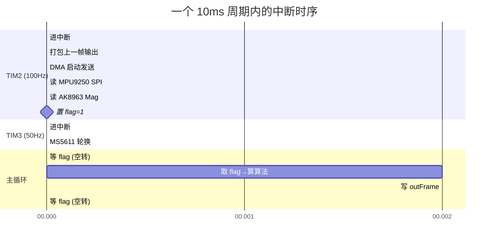
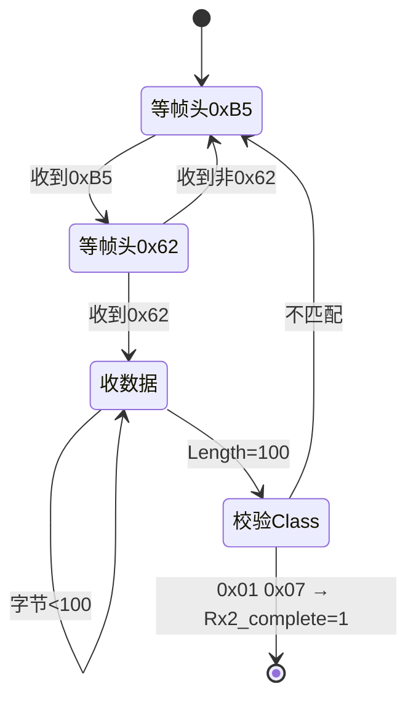
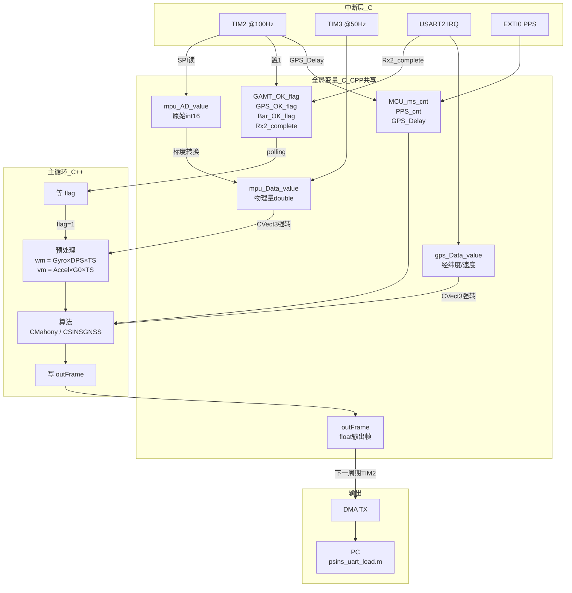

# 中断驱动与数据流：嵌入式 PSINS 的心脏

> 配套源码: [stm32f4xx_it.c](../../assets/PSINS_STM32F4xx_Keil4_V2.1/scr/stm32f4xx_it.c) / [main.cpp](../../assets/PSINS_STM32F4xx_Keil4_V2.1/scr/main.cpp)
> 所属层级: 嵌入式落地篇
> 前置依赖: [00 总览与架构](00_总览与架构.md)
> 学习目标: 读完后你应能回答：
> 1. TIM2 中断每 10ms 做了哪 4 件事？顺序为什么是这个顺序？
> 2. `GAMT_OK_flag` 从 0→1→0 的完整生命周期是什么？谁置 1、谁清 0？
> 3. 主循环里的 `if(flag==0) continue; flag=0;` 为什么不是多余的？
> 4. 数据输出为什么比数据采集滞后一个周期？

!!! tip "本篇为什么重要"
    这是你看不懂整个工程的**最常见卡点**。MATLAB 版 PSINS 是顺序执行——`for k=1:len, insupdate(), end`，数据从文件读，算完存数组。嵌入式版完全不同——**中断在后台不断触发，主循环靠标志位同步**。不理解这个机制，后面所有代码都读不通。

---

## 一、中断总览：4 个中断源

板子上有 4 个中断源同时运行，各自独立工作：

| 中断 | 频率 | 触发条件 | 作用 | 源码位置 |
|---|---|---|---|---|
| TIM2 | 100Hz | 定时器溢出 | 读 IMU + 打包输出 | [it.c L172](../../assets/PSINS_STM32F4xx_Keil4_V2.1/scr/stm32f4xx_it.c) |
| TIM3 | 50Hz | 定时器溢出 | 读 MS5611 气压 | [it.c L204](../../assets/PSINS_STM32F4xx_Keil4_V2.1/scr/stm32f4xx_it.c) |
| USART2 | ~4Hz | RXNE（每字节） | 接收 GPS UBX 帧 | [it.c L236](../../assets/PSINS_STM32F4xx_Keil4_V2.1/scr/stm32f4xx_it.c) |
| EXTI0 | 1Hz | PPS 上升沿 | GPS 秒脉冲时间戳 | [it.c L163](../../assets/PSINS_STM32F4xx_Keil4_V2.1/scr/stm32f4xx_it.c) |



---

## 二、TIM2 中断逐行拆解（100Hz，最核心）

[stm32f4xx_it.c L172-202](../../assets/PSINS_STM32F4xx_Keil4_V2.1/scr/stm32f4xx_it.c)：

```c
void TIM2_IRQHandler(void)
{
    if(TIM_GetITStatus(TIM2, TIM_IT_Update) != RESET)
    {
        TIM_ClearITPendingBit(TIM2, TIM_IT_Update);  // ① 清中断标志
        timtest_debug(0);                             //   调试：记录时间戳
        MCU_ms_cnt += 10;   // ② 系统时间戳 +10ms

        if(MCU_ms_cnt > 10 && mcu_init_gpscfg == 0)
        {
            Uart1_Out_Frame();            // ③ 打包【上一帧】的计算结果
            USART1_DIA_OUT_Configuration(); //   DMA 发送 outFrame 到 PC
        }
        Delay(0);  // 清零耗时统计

        timtest_debug(1);
        READ_MPU9250_A_T_G();   // ④ 读加速度+温度+陀螺
        timtest_debug(2);
        READ_MPU9250_MAG();     // ⑤ 读磁力计（AK8963）
        timtest_debug(3);
        GAMT_OK_flag = 1;        // ⑥ ★ 通知主循环：数据就绪

        if(Rx2_complete == 1)   // ⑦ 如果 GPS 帧收完
        {
            Rx2_complete = 0;
            GPS_OK_flag = 1;
            GPS_Delay = MCU_ms_cnt*10 - PPS_cnt;  // GPS 延迟(ms)
            GPS_PVT_Decode();                       // 解析 UBX 帧
        }
        timtest_debug(4);
    }
}
```

### 2.1 执行顺序的设计意图

| 步骤 | 做什么 | 为什么是这个顺序 |
|---|---|---|
| ① | 清中断标志 | 必须先清，否则会无限重入 |
| ② | 时间戳 +10 | 给系统和 GPS 延迟计算用 |
| ③ | 打包+发送上一帧 | **先输出再采样**——DMA 发送不占 CPU，可以和后续 SPI 读取并行 |
| ④⑤ | 读 IMU 传感器 | 占 ~0.8ms，是中断里最耗时的部分 |
| ⑥ | `GAMT_OK_flag = 1` | **最后**才置标志——保证主循环拿到的数据是完整的 |
| ⑦ | GPS 解析 | 只在 `Rx2_complete=1` 时才做，不阻塞 |

!!! note "为什么先输出再采样？"
    ③ 输出的是**上一帧**（第 N-1 次）的结果，④⑤ 采的是**当前帧**（第 N 次）的原始数据。这样 DMA 在后台发送第 N-1 帧的同时，CPU 可以专心读 SPI 采第 N 帧的数据。流水线并行，不浪费时间。

### 2.2 `timtest_debug()` 是什么？

[mcu_init.h](../../assets/PSINS_STM32F4xx_Keil4_V2.1/scr/mcu_init.h) 里定义的调试宏，用定时器的 `CNT` 寄存器记录每一步的耗时（微秒级）。正常使用时可以忽略，调试时用来看哪一步超时了。

---

## 三、TIM3 中断逐行拆解（50Hz，气压计）

[stm32f4xx_it.c L204-234](../../assets/PSINS_STM32F4xx_Keil4_V2.1/scr/stm32f4xx_it.c)：

```c
void TIM3_IRQHandler(void)
{
    if (TIM_GetITStatus(TIM3, TIM_IT_Update) != RESET)
    {
        MS5611_cnt++;                    // 计数器 1→2→3→4→5→0 循环
        if(MS5611_cnt == 1)              // 第1拍：启动温度ADC
            MS561101BA_start_Temperature();
        if(MS5611_cnt == 2)              // 第2拍：读温度（需等待转换）
            MS561101BA_getTemperature();
        if(MS5611_cnt == 3)              // 第3拍：启动压力ADC
            MS561101BA_start_Pressure();
        if(MS5611_cnt == 4)              // 第4拍：读压力
            MS561101BA_getPressure();
        if(MS5611_cnt == 5) {            // 第5拍：标记完成
            Bar_OK_flag = 1;
            MS5611_cnt = 0;              // 重置计数器
        }
        TIM_ClearITPendingBit(TIM3, TIM_IT_Update);
        TIM_SetCounter(TIM3, 0);
    }
}
```

**为什么分 5 拍？** MS5611 的 ADC 转换需要时间（OSR=4096 时约 9ms），不能在同一个中断里启动+读取。分 5 拍 = 100ms 周期 = 10Hz 气压更新率。

```
拍1 (20ms): 启动温度ADC ──→ ADC正在转换...
拍2 (40ms): 读温度结果 ←── 转换完成
拍3 (60ms): 启动压力ADC ──→ ADC正在转换...
拍4 (80ms): 读压力结果 ←── 转换完成
拍5 (100ms): Bar_OK_flag=1, 重置
```

!!! note "`_cnt` 后缀的含义"
    `MS5611_cnt` 的 `cnt` = counter（计数器）。这是嵌入式 C 的命名习惯：`MCU_ms_cnt`（毫秒计数器）、`MAG_cnt`（磁力计节拍计数器）、`MS5611_cnt`（气压计节拍计数器）。不是关键字，纯命名约定。

---

## 四、USART2 中断逐行拆解（GPS 接收）

[stm32f4xx_it.c L236-278](../../assets/PSINS_STM32F4xx_Keil4_V2.1/scr/stm32f4xx_it.c)：

```c
void USART2_IRQHandler(void)
{
    char temp;
    // GPS 配置模式：透传给 u-center
    if(mcu_init_gpscfg) {
        // ...直接转发字节，return
    }

    if(USART_GetITStatus(USART2, USART_IT_RXNE) != RESET)
    {
        USART_ClearITPendingBit(USART2, USART_IT_RXNE);
        temp = USART_ReceiveData(USART2);  // 读1字节

        Rx2_data1[Length2] = temp;          // 存入缓冲区
        Length2++;

        // UBX 帧头检查：必须 0xB5 0x62
        if(Length2 == 1 && Rx2_data1[0] != 0xb5) {
            Rx2_data1[0] = 0; Length2 = 0;   // 帧头错误，重来
        }
        if(Length2 == 2 && Rx2_data1[1] != 0x62) {
            Rx2_data1[0] = Rx2_data1[1] = 0; Length2 = 0;
        }
        // 收满 100 字节
        if(Length2 == 100) {
            if(Rx2_data1[2] == 0x01 && Rx2_data1[3] == 0x07) {  // UBX-NAV-PVT
                memcpy(Rx2_data, Rx2_data1, 100);  // 复制到正式缓冲区
                Rx2_complete = 1;                    // ★ 通知 TIM2 中断
            }
            Length2 = 0;  // 重置，准备收下一帧
        }
    }
}
```

**状态机流程**：



**关键设计**：USART2 中断**不解析 GPS 数据**，只负责收字节和帧头校验。真正的解析（`GPS_PVT_Decode()`）在 TIM2 中断里做——因为 TIM2 是 100Hz，能保证解析时机确定性。

---

## 五、EXTI0 中断（PPS 秒脉冲）

[stm32f4xx_it.c L163-170](../../assets/PSINS_STM32F4xx_Keil4_V2.1/scr/stm32f4xx_it.c)：

```c
void EXTI0_IRQHandler(void)
{
    if(EXTI_GetITStatus(EXTI_Line0) != RESET)
    {
        EXTI_ClearITPendingBit(EXTI_Line0);
        PPS_cnt = MCU_ms_cnt * 10 + TIM2->CNT;  // PPS 时刻的精确时间戳(100us)
    }
}
```

PPS（Pulse Per Second）是 GPS 模块每秒输出的一个精确脉冲。这里用 `MCU_ms_cnt` 和 `TIM2->CNT` 组合出一个微秒级时间戳。

当 GPS 数据到达时（`Rx2_complete=1`），TIM2 中断里算 `GPS_Delay = MCU_ms_cnt*10 - PPS_cnt`，就是 GPS 数据从产生到被处理的延迟。这个延迟送进 KF 的 `posGNSSdelay` 做延迟补偿。

---

## 六、核心机制：flag + polling（标志位轮询）

这是整个工程的**心脏**。理解了它，后面的主循环代码就通了。

### 6.1 生产者-消费者模型

```
中断（生产者）          主循环（消费者）
    │                       │
    │  100Hz采数据           │  while(1)空转
    │                       │
    │  写 mpu_Data_value    │  if(flag==0) continue ← 还没来，继续等
    │  flag = 1 ──────────→ │  if(flag==0) continue ← 来了！
    │  "有货了"              │  flag = 0 ← "拿走了"
    │                       │  算法(wm, vm) ← 用数据
    │                       │  写 outFrame
    │  下一周期...          │  回到 while 开头继续等
```

### 6.2 代码对照

[main.cpp L39-50](../../assets/PSINS_STM32F4xx_Keil4_V2.1/scr/main.cpp)：

```cpp
while(1)
{
    if(pcmd->cmd1 == 0xa5a5) { pcmd->cmd1=0; break; } // PC发退出命令
    if(GAMT_OK_flag == 0) continue;  // ① flag=0 → 跳回while开头，继续等
    GAMT_OK_flag = 0;                 // ② flag=1 → 消费掉，清零

    // 以下是用数据做计算的代码
    wm = (*(CVect3*)mpu_Data_value.Gyro * glv.dps - eb) * TS;
    vm = (*(CVect3*)mpu_Data_value.Accel * glv.g0 - db) * TS;
    mahony.Update(wm, vm, TS);
    AVPUartOut(q2att(mahony.qnb));
}
```

### 6.3 为什么 `GAMT_OK_flag = 0` 不是多余的？

```c
if(GAMT_OK_flag == 0) continue;  // 如果 flag=0，跳过下面所有代码
GAMT_OK_flag = 0;                // 能走到这行，说明 flag 一定=1
```

`continue` 的语义是**跳过本次循环剩余代码，直接回到 while 开头**。

| 时刻 | flag 值 | 执行哪行 | 解释 |
|---|---|---|---|
| 中断还没来 | 0 | `if(flag==0) continue` | 空转，回到 while 开头 |
| 中断刚置 1 | 1 | 跳过 if，执行 `flag=0` | 消费标志 |
| 算法刚跑完 | 0 | `if(flag==0) continue` | 等下一次中断 |

第②行 `GAMT_OK_flag = 0` 是**"消费"标志**——告诉系统"我拿到了数据，去准备下一帧"。如果不清零，下一轮 while 发现 flag 还是 1，就会重复处理同一帧数据。

!!! example "生活类比"
    快递柜模式：快递员（中断）把包裹放进去，灯亮（flag=1）。你（主循环）看到灯亮，取走包裹，把灯关掉（flag=0）。如果你不关灯，下次看到灯还亮，你以为又有包裹了——其实还是原来那个。

---

## 七、完整数据流图



---

## 八、输出为什么滞后一个周期？

看 TIM2 中断里 ③ 和 ④ 的顺序：

```
TIM2 第 N 次中断:
  ③ Uart1_Out_Frame()      ← 打包第 N-1 次的算法结果
     DMA 发送到 PC
  ④ READ_MPU9250()          ← 读新的原始数据
     GAMT_OK_flag = 1

主循环（被 ④ 唤醒）:
  用新数据算算法 → 结果写 outFrame

TIM2 第 N+1 次中断:
  ③ Uart1_Out_Frame()      ← 打包第 N 次的算法结果
     DMA 发送到 PC
  ...
```

所以 PC 上收到的数据**滞后一个 10ms 周期**。但 DMA 发送不占 CPU，对实时性没有影响。

---

## 九、与 MATLAB 版的根本差异

| 维度 | MATLAB 版 | 嵌入式版 |
|---|---|---|
| 数据来源 | `trj.imu` 矩阵，预先存好 | SPI/UART 中断实时采 |
| 执行频率 | `for` 循环，跑完就停 | 100Hz 中断驱动，永不停止 |
| 同步机制 | 无需同步（顺序执行） | flag + polling |
| 输出方式 | 存 `ins.avp` 矩阵，最后画图 | DMA 串口实时发送 float 帧 |
| 时间约束 | 无（MATLAB 慢就慢） | 10ms 内必须算完（否则丢帧） |
| 数据预处理 | `wm = imu(k,1:3)` 直接是增量 | `wm = Gyro × DPS × TS`（°/s→rad→增量） |

!!! note "为什么嵌入式要多一步 `×DPS×TS`？"
    MATLAB 版的 `trj.imu` 存的**已经是增量**（`wm = ∫ω dt`，单位 rad）。但 MPU9250 输出的是**速率**（°/s），必须乘 `DPS(=π/180)` 转弧度/秒，再乘 `TS(=0.01s)` 得增量。这就是预处理那行的物理含义。

---

## 十、`PCCMD` 结构体与模式切换

[main.cpp L8-10](../../assets/PSINS_STM32F4xx_Keil4_V2.1/scr/main.cpp)：

```cpp
struct PCCMD {
    u16 cmd1, cmd2;           // 两个16位无符号整数，共4字节
} *pcmd = (PCCMD*)&PC_cmd;
```

`PC_cmd` 是 `char[32]` 数组，由 [USART1 中断](../../assets/PSINS_STM32F4xx_Keil4_V2.1/scr/stm32f4xx_it.c) 从 PC 串口逐字节填充。强转后：

```
PC_cmd 内存:  [0]  [1]  [2]  [3]  ...
               ↓    ↓    ↓    ↓
               0xA5 0xA5 0x11 0x11  ...
               \_______/  \_______/
pcmd→          cmd1=0xa5a5  cmd2=0x1111
```

- `cmd1`：退出命令。`0xa5a5` = 退出当前模式回 `main()`
- `cmd2`：模式选择。`0x1111`/`0x2222`/`0x3333`/`0x4444`

!!! tip "`.` 和 `->` 的区别"
    - `pcmd->cmd1`：`pcmd` 是**指针**，用箭头 `->` 访问成员
    - `mahony.qnb`：`mahony` 是**对象本身**，用点 `.` 访问成员
    - 记忆口诀：**实体用点，指针用箭头**

---

??? note "自测题"
    1. TIM2 中断里为什么先 `Uart1_Out_Frame()` 再 `READ_MPU9250()`？能不能反过来？
    2. 如果算法计算超过 10ms，会发生什么？
    3. `GAMT_OK_flag` 从 0 变成 1 是在哪行代码？从 1 变成 0 又是在哪行？
    4. MS5611 为什么分 5 拍读取？能不能在 1 次中断里完成？
    5. `pcmd->cmd2 = 0`（main.cpp L22）在 switch case 里出现，作用是什么？

    ??? note "参考答案"
        1. 先输出再采样是为了流水线并行——DMA 在后台发送上一帧，CPU 同时读 SPI 采当前帧。反过来会导致输出延迟一个周期且浪费 CPU 等待时间。
        2. 下一次 TIM2 中断到来时主循环还没算完，`GAMT_OK_flag` 被中断再次置 1，但旧数据已被新数据覆盖（`mpu_Data_value` 被刷新），丢一帧。不会崩溃，但数据有缺口。
        3. 置 1：TIM2 中断 [it.c L191](../../assets/PSINS_STM32F4xx_Keil4_V2.1/scr/stm32f4xx_it.c) `GAMT_OK_flag=1`。清 0：主循环 [main.cpp L43](../../assets/PSINS_STM32F4xx_Keil4_V2.1/scr/main.cpp) `GAMT_OK_flag=0`。
        4. MS5611 ADC 转换需要 ~9ms（OSR=4096），不能在同一个 20ms 中断里启动+等待+读取。分拍让 CPU 不阻塞。
        5. 防止 switch 进入后再次匹配同一个 case——`cmd2` 清零后，如果 PC 不发新命令，switch 不会重复进入，当前模式函数的 `while(1)` 继续转。

---

**参考体系**：[00 总览与架构](00_总览与架构.md) / MATLAB 版 [00 读码地基](../P系列与总览/00_读码地基.md)（主循环骨架）/ 配套源码 [stm32f4xx_it.c](../../assets/PSINS_STM32F4xx_Keil4_V2.1/scr/stm32f4xx_it.c)
