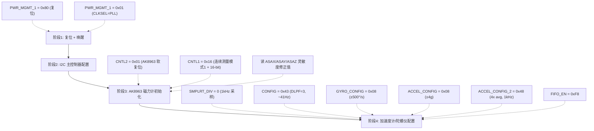

# 传感器驱动 MPU9250：SPI 通信、寄存器配置与标度转换

> 配套源码: [mpu9250.c](../../assets/PSINS_STM32F4xx_Keil4_V2.1/scr/mpu9250.c) / [mpu9250.h](../../assets/PSINS_STM32F4xx_Keil4_V2.1/scr/mpu9250.h) / [mcu_init.c](../../assets/PSINS_STM32F4xx_Keil4_V2.1/scr/mcu_init.c)
> 所属层级: 嵌入式落地篇 · 驱动层
> 前置依赖: [00 总览与架构](00_总览与架构.md) / [01 中断驱动与数据流](01_中断驱动与数据流.md)
> 学习目标: 读完后你应能回答：
> 1. MPU9250 内部有几个芯片？它们通过什么总线连接？
> 2. 为什么读 AK8963 磁力计要走"SPI → 内部 I2C 主模式"两条总线？
> 3. `/8192.0f`、`/65.5f`、`/333.87f+21.0f` 这三个标度转换常数从哪来？
> 4. AK8963 的 ASA 灵敏度修正公式 `(ASA-128)/256` 是什么含义？

!!! tip "本篇为什么重要"
    如果说 [01 中断驱动](01_中断驱动与数据流.md) 讲的是"心脏"（时序），本篇讲的就是"眼睛"（传感器）。MPU9250 是一个单封装双芯片方案，SPI 和 I2C 两种总线混用，初次读码很容易迷失。本篇从**引脚级 → 寄存器级 → 标度公式级**三层拆解，把每一条 `/8192` 的来历讲透。

!!! note "前置阅读链接"
    - 传感器物理原理（比力 vs 加速度、陀螺测角速度）：[03 传感器原理](../../01_基础篇/03_传感器原理.md)
    - C/C++ 桥接的 `*(CVect3*)` 强转语法：留坑 → [06 C与CPP桥接](06_C与CPP桥接.md)

---

## 一、芯片全景：MPU9250 = MPU6500 + AK8963

MPU9250 不是一颗芯片，是**一个封装里的两颗**：

```
                ┌───────────── MPU9250 封装 ─────────────┐
                │                                        │
  STM32 SPI1 ──┼──► [MPU6500 六轴]                        │
  (SCK/MOSI/   │     · 3轴加速度计 (±2/±4/±8/±16 g)      │
   MISO/CS)    │     · 3轴陀螺仪 (±250/±500/±1000/±2000°/s)│
                │     · 温度传感器                         │
                │     · 内部 I2C 主控制器 ──┐              │
                │                          │              │
                │     [AK8963 三轴磁力计] ◄─┘              │
                │     · 14-bit / 16-bit 输出              │
                │     · 量程 ±4800 μT                    │
                │     · 内置灵敏度修正 (ASA)              │
                └────────────────────────────────────────┘
```

| 芯片 | 测量量 | 本工程量程 | 灵敏度 (LSB/物理单位) | 总线 |
|---|---|---|---|---|
| MPU6500 加速度计 | 比力 $f^b$ | ±4 g | 8192 LSB/g | SPI |
| MPU6500 陀螺仪 | 角速度 $\omega^b$ | ±500 °/s | 65.5 LSB/(°/s) | SPI |
| MPU6500 温度 | 芯片温度 | — | 333.87 LSB/°C | SPI |
| AK8963 磁力计 | 磁场 $B^b$ | ±4800 μT | 0.15 μT/LSB (16-bit) | 内部 I2C |

> **关键设计**：STM32 只通过 SPI 和 MPU6500 说话；AK8963 挂在 MPU6500 的**内部 I2C 总线**上，STM32 要读磁力计，必须让 MPU6500 当 I2C 主机去读 AK8963，再把结果放到 MPU6500 的外部传感器数据寄存器（`EXT_SENS_DATA_00`）里，STM32 通过 SPI 二次读取。

---

## 二、硬件连接与 SPI 配置

### 2.1 引脚映射

| 信号 | STM32 引脚 | 模式 | 源码 |
|---|---|---|---|
| SPI1_SCK | PA5 | AF5 (SPI1) | [mcu_init.c L124](../../assets/PSINS_STM32F4xx_Keil4_V2.1/scr/mcu_init.c) |
| SPI1_MISO | PA6 | AF5 (SPI1) | [mcu_init.c L126](../../assets/PSINS_STM32F4xx_Keil4_V2.1/scr/mcu_init.c) |
| SPI1_MOSI | PA7 | AF5 (SPI1) | [mcu_init.c L125](../../assets/PSINS_STM32F4xx_Keil4_V2.1/scr/mcu_init.c) |
| SPI1_CS (手动) | PC4 | GPIO_Output | [mcu_init.c L114-121](../../assets/PSINS_STM32F4xx_Keil4_V2.1/scr/mcu_init.c) |
| 数据就绪 (MPU_INT) | PA15 | GPIO_Input (轮询) | [mpu9250.c L135](../../assets/PSINS_STM32F4xx_Keil4_V2.1/scr/mpu9250.c) |

!!! note "CS 为什么是手动 GPIO？"
    SPI 硬件 NSS 模式在某些 STM32 型号上有已知问题（过早拉高导致最后一字节截断）。严老师用**软件控制 CS**（`GPIO_ResetBits` / `GPIO_SetBits`），最可靠。

### 2.2 SPI 参数

```c
// mcu_init.c L211-219
SPI_InitStructure.SPI_Direction = SPI_Direction_2Lines_FullDuplex;  // 全双工
SPI_InitStructure.SPI_Mode = SPI_Mode_Master;                        // STM32 做主机
SPI_InitStructure.SPI_DataSize = SPI_DataSize_8b;                    // 8-bit 帧
SPI_InitStructure.SPI_CPOL = SPI_CPOL_High;                          // CPOL=1
SPI_InitStructure.SPI_CPHA = SPI_CPHA_2Edge;                          // CPHA=1 (Mode 3)
SPI_InitStructure.SPI_NSS = SPI_NSS_Soft;                             // 软件 CS
SPI_InitStructure.SPI_BaudRatePrescaler = SPI_BaudRatePrescaler_128; // 84MHz/128 = 656kHz
SPI_InitStructure.SPI_FirstBit = SPI_FirstBit_MSB;                   // 高位先发
```

| 参数 | 值 | 含义 |
|---|---|---|
| Mode | CPOL=1, CPHA=1 → **SPI Mode 3** | 空闲高电平，第二个边沿采样 |
| 数据帧 | 8-bit | 每次发/收一个字节 |
| 时钟 | 84 MHz / 128 = **656.25 kHz** | MPU9250 寄存器读写最大 1 MHz，安全 |
| 位序 | MSB first | 高位先传 |

> ⚡ SPI 时钟 656 kHz 对寄存器配置足够快。一次 `READ_MPU9250_A_T_G()` 需要读 7 个寄存器对 × 2 字节 × 2 次 SPI 操作（发 reg + 收 data）≈ 28 次传输，约 0.4 ms，远在 10 ms 中断窗口内。

---

## 三、SPI 通信层（字节级）

### 3.1 底层收发

```c
// mpu9250.c L8-14
void WriteTo9250(u8 TxData)
{
    while (SPI_I2S_GetFlagStatus(SPI1, SPI_I2S_FLAG_TXE) == RESET){;}  // 等发送缓冲区空
    SPI_I2S_SendData(SPI1, TxData);                                    // 写入发送数据
    while (SPI_I2S_GetFlagStatus(SPI1, SPI_I2S_FLAG_RXNE) == RESET){;} // 等接收完成
    SPI_I2S_ReceiveData(SPI1);                                         // 读出接收到的数据（丢弃）
}
```

```c
// mpu9250.c L16-24
u8 ReadToMpu9250(u8 reg)
{
    u8 ReadData = 0;
    while (SPI_I2S_GetFlagStatus(SPI1, SPI_I2S_FLAG_TXE) == RESET);
    SPI_I2S_SendData(SPI1, reg);                                        // 发寄存器地址
    while (SPI_I2S_GetFlagStatus(SPI1, SPI_I2S_FLAG_RXNE) == RESET);
    ReadData = SPI_I2S_ReceiveData(SPI1);                              // 读返回值
    return(ReadData);
}
```

!!! note "SPI 全双工的"发就是收""
    SPI 是同步全双工——主机每发一个字节，**同时**收到一个字节。所以 `WriteTo9250` 虽然名叫"写"，实际也触发了一次接收（被丢弃）；`ReadToMpu9250` 发了一个 `reg` 地址字节出去，同时收到了上一个时钟周期的残留数据。**真正的读发生在第二次发送**（发 `0xFF` 作为 dummy），MPU9250 在收到地址后才返回数据。

### 3.2 寄存器读写封装

```c
// mpu9250.c L26-34
void MPU9250_Write_Reg(u8 reg, u8 value)
{
    GPIO_ResetBits(GPIOC, GPIO_Pin_4);  // CS 拉低，开始传输
    Delay(100);
    WriteTo9250(reg);                   // 发寄存器地址（写操作 MSB=0）
    WriteTo9250(value);                 // 发数据
    GPIO_SetBits(GPIOC, GPIO_Pin_4);    // CS 拉高，结束传输
    Delay(100);
}
```

```c
// mpu9250.c L36-46
u8 MPU9250_Read_Reg(u8 reg)
{
    u8 val;
    GPIO_ResetBits(GPIOC, GPIO_Pin_4);  // CS 拉低
    Delay(100);
    WriteTo9250(reg | 0x80);            // 寄存器地址 | 0x80 → MSB=1 表示读操作
    val = ReadToMpu9250(0xff);          // 发 0xFF dummy，收回数据
    GPIO_SetBits(GPIOC, GPIO_Pin_4);    // CS 拉高
    Delay(100);
    return val;
}
```

!!! note "MPU9250 SPI 地址帧格式"
    MPU9250 SPI 协议中，每个传输的第一个字节是**地址 + 读写位**：
    
    | Bit 7 | Bit 6-0 |
    |---|---|
    | R/W (0=写, 1=读) | 寄存器地址 |
    
    所以 `reg | 0x80` 把最高位置 1，告诉 MPU9250 "我要读"，`reg` 本身最高位为 0 就是"写"。

---

## 四、内部 I2C 主模式（访问 AK8963 的桥梁）

STM32 无法直接和 AK8963 说话——AK8963 的 I2C 线只接 MPU6500 内部。严老师利用 MPU6500 的**I2C 主控制器**功能，让 MPU6500 当"中间人"。

### 4.1 I2C 主控制器初始化

在 `Init_MPU9250()` 中（[mpu9250.c L90-98](../../assets/PSINS_STM32F4xx_Keil4_V2.1/scr/mpu9250.c)）：

```c
MPU9250_Write_Reg(INT_PIN_CFG, 0x02);        // Bypass 模式（短暂，用于直接访问）
MPU9250_Write_Reg(56, 0x01);                 // 禁用 I2C aux bypass
MPU9250_Write_Reg(I2C_MST_CTRL, 0x4d);       // I2C 主模式 + 400 kHz 时钟
MPU9250_Write_Reg(USER_CTRL, 0x20);          // 使能 I2C 主控制器 (I2C_MST_EN)
MPU9250_Write_Reg(I2C_MST_DELAY_CTRL, 0x01);// SLV0 延时使能
MPU9250_Write_Reg(I2C_SLV0_CTRL, 0x81);      // 使能 SLV0 + 读 1 字节
```

### 4.2 通过 SLV0 读写 AK8963

`I2C_SLV0` 是 MPU6500 内部的"I2C 通道 0"，配置它做一次自动 I2C 读写：

```c
// mpu9250.c L54-59  写 AK8963 寄存器
void i2c_Mag_write(u8 reg, u8 value)
{
    MPU9250_Write_Reg(I2C_SLV0_ADDR, MPU9250_AK8963_ADDR);       // AK8963 I2C 地址 (0x0C, 写)
    MPU9250_Write_Reg(I2C_SLV0_REG, reg);                         // AK8963 目标寄存器
    MPU9250_Write_Reg(I2C_SLV0_DO, value);                       // 要写的数据 → MPU6500 自动发起 I2C 写
}
```

```c
// mpu9250.c L67-76  读 AK8963 寄存器
u8 i2c_Mag_read(u8 reg)
{
    u8 val;
    MPU9250_Write_Reg(I2C_SLV0_ADDR, MPU9250_AK8963_ADDR | 0x80); // AK8963 地址 | 0x80 → 读
    MPU9250_Write_Reg(I2C_SLV0_REG, reg);                          // AK8963 目标寄存器
    MPU9250_Write_Reg(I2C_SLV0_DO, 0xff);                          // dummy
    Delay(20000);                                                   // 等 I2C 传输完成 (~1ms)
    val = MPU9250_Read_Reg(EXT_SENS_DATA_00);                       // 从 MPU6500 读结果
    return val;
}
```

> **流程**：STM32 通过 SPI 配置 MPU6500 的 SLV0 通道 → MPU6500 内部 I2C 主控制器自动向 AK8963 发起读写 → 结果暂存在 `EXT_SENS_DATA_00` (0x49) 寄存器 → STM32 再次通过 SPI 读回。

```
STM32 ──SPI──► MPU6500 ──内部I2C──► AK8963
                 │
                 └─ 结果存入 EXT_SENS_DATA_00
STM32 ◄─SPI── MPU6500 (读 EXT_SENS_DATA_00)
```

---

## 五、Init_MPU9250() 初始化流程

[mpu9250.c L80-126](../../assets/PSINS_STM32F4xx_Keil4_V2.1/scr/mpu9250.c) 的完整初始化分四阶段：



### 5.1 阶段 1：复位与唤醒

```c
MPU9250_Write_Reg(PWR_MGMT_1, 0x80);   // DEVICE_RESET = 1，芯片内部复位
Delay(500000);                          // 等复位完成 (~100ms)
MPU9250_Write_Reg(PWR_MGMT_1, 0x01);   // SLEEP=0, CLKSEL=1 (PLL with X axis gyro)
```

| 寄存器 | 写入值 | 含义 |
|---|---|---|
| `PWR_MGMT_1` (0x6B) | 0x80 | bit7=DEVICE_RESET，全芯片复位 |
| `PWR_MGMT_1` (0x6B) | 0x01 | bit6=SLEEP(0, 唤醒), bit0-2=CLKSEL(1, PLL锁相环) |

> **CLKSEL=1**：选择 X 轴陀螺 PLL 作为时钟源，比内部 RC 振荡器更稳定（典型 ~1% vs ~8%）。

### 5.2 阶段 2：I2C 主控制器配置

见第四节，此处不重复。

### 5.3 阶段 3：AK8963 磁力计初始化

```c
// mpu9250.c L102-112
i2c_Mag_write(AK8963_CNTL2_REG, AK8963_CNTL2_SRST);  // AK8963 软复位
Delay(500000);
i2c_Mag_write(AK8963_CNTL1_REG, 0x16);               // 连续测量模式1 + 16-bit 输出

MAG_x_axis = i2c_Mag_read(AK8963_ASAX);               // 读 X 轴灵敏度修正值
MAG_y_axis = i2c_Mag_read(AK8963_ASAY);               // 读 Y 轴灵敏度修正值
MAG_z_axis = i2c_Mag_read(AK8963_ASAZ);               // 读 Z 轴灵敏度修正值
```

| AK8963 寄存器 | 值 | 含义 |
|---|---|---|
| `CNTL2` (0x0B) | 0x01 | SRST 软复位 |
| `CNTL1` (0x0A) | 0x16 | bit4=1(16-bit), bit1-0=10 (连续测量模式1, 8Hz 连续输出) |
| `ASAX` (0x10) | 工厂标定值 | X 轴灵敏度调整，出厂值 1-255，中值 128 |
| `ASAY` (0x11) | 工厂标定值 | Y 轴灵敏度调整 |
| `ASAZ` (0x12) | 工厂标定值 | Z 轴灵敏度调整 |

!!! note "ASA 是什么？"
    AK8963 出厂时每颗芯片的磁灵敏度有微小偏差（±50% 以内）。厂家测好后把修正系数写到 `ASAX/ASAY/ASAZ` 寄存器里。使用时公式为：

    $$\text{修正系数} = 1.0 + \frac{\text{ASA} - 128}{256.0}$$

    ASA=128 时修正系数 = 1.0（无修正）；ASA=255 时 = 1.496（+49.6%）；ASA=1 时 = 0.504（-49.6%）。

### 5.4 阶段 4：加速度计/陀螺仪配置

```c
// mpu9250.c L117-124
MPU9250_Write_Reg(SMPLRT_DIV, 0x0);       // 采样率分频器 = 0 → 1 kHz
MPU9250_Write_Reg(CONFIG, 0x43);           // DLPF_CFG=3 → 带宽 ~41Hz, 内部采样率 1kHz
MPU9250_Write_Reg(GYRO_CONFIG, 0x08);     // GYRO_FS_SEL=01 → ±500°/s
MPU9250_Write_Reg(ACCEL_CONFIG, 0x08);    // ACCEL_FS_SEL=01 → ±4g
MPU9250_Write_Reg(ACCEL_CONFIG_2, 0x48); // ACCEL_FCHOICE_B=01, A_DLPFCFG=0 → 1kHz
MPU9250_Write_Reg(FIFO_EN, 0xf8);        // 使能所有传感器 FIFO
```

| 寄存器 | 值 | 关键位 | 效果 |
|---|---|---|---|
| `SMPLRT_DIV` (0x19) | 0x00 | [7:0] = 0 | 输出速率 = 1kHz / (1+0) = **1 kHz** |
| `CONFIG` (0x1A) | 0x43 | [2:0] = 3 | DLPF_CFG=3 → 陀螺带宽 41 Hz, 延迟 5.2 ms |
| `GYRO_CONFIG` (0x1B) | 0x08 | [4:3] = 01 | ±500 °/s 量程 → 灵敏度 **65.5 LSB/(°/s)** |
| `ACCEL_CONFIG` (0x1C) | 0x08 | [4:3] = 01 | ±4 g 量程 → 灵敏度 **8192 LSB/g** |
| `ACCEL_CONFIG_2` (0x1D) | 0x48 | [3] = 1 | 加计也走低通滤波, 1 kHz 输出 |

!!! warning "DLPF=3 的含义"
    陀螺 DLPF_CFG=3 对应带宽 ~41 Hz。这意味着高于 41 Hz 的振动会被衰减，适合有人体/车辆振动场景。但如果是高动态无人机，可能需要 DLPF=0 或 1（带宽 250 Hz / 184 Hz）。移植到 H743 时需根据实际场景调整。

---

## 六、数据读取与标度转换：READ_MPU9250_A_T_G()

这是[01 中断驱动](01_中断驱动与数据流.md)里 TIM2 中断每 10 ms 调一次的核心函数。

### 6.1 数据就绪等待

```c
// mpu9250.c L135
while(! GPIO_ReadInputDataBit(GPIOA, GPIO_Pin_15)) {;}  // 等 PA15 = 1 (MPU_INT 数据就绪)
```

PA15 接 MPU9250 的 INT 引脚，数据就绪时拉高。在中断里等是为了保证读到的不是上一拍的残留。

### 6.2 加速度计读取与标度

```c
// mpu9250.c L137-148
BUF[0] = MPU9250_Read_Reg(ACCEL_XOUT_L);   // 0x3C 低字节
BUF[1] = MPU9250_Read_Reg(ACCEL_XOUT_H);   // 0x3B 高字节
mpu_AD_value.Accel[0] = (BUF[1]<<8)|BUF[0]; // 大端拼接 → int16
mpu_Data_value.Accel[0] = mpu_AD_value.Accel[0] / 8192.0f;  // 标度转换 → g
```

!!! note "大端拼接 vs 小端拼接"
    MPU9250 的寄存器是**高字节在前（低地址）**，即大端存储。但 STM32 是小端架构（低地址存低字节）。所以代码先读 `_L`（低地址=MPU9250 的低字节）再读 `_H`（高地址=MPU9250 的高字节），然后 `(H<<8)|L` 拼成 16 位有符号整数。

    > 注意：这与 GPS UBX 协议的**小端**拼接顺序相反，GPS 是 `(b3<<24)|(b2<<16)|(b1<<8)|b0`。详见 [04 GPS 解析](04_GPS解析与PC命令.md)。

#### 标度常数推导

$$
\text{加速度 (g)} = \frac{\text{raw (int16)}}{\text{灵敏度 (LSB/g)}}
$$

| 量程 | 灵敏度 |
|---|---|
| ±2 g | 16384 LSB/g |
| **±4 g** (本工程) | **8192 LSB/g** |
| ±8 g | 4096 LSB/g |
| ±16 g | 2048 LSB/g |

`GYRO_CONFIG = 0x08` 选 ±4 g → 灵敏度 = 8192 LSB/g → **`/8192.0f`** 得到单位为 g 的比力。

### 6.3 温度读取与标度

```c
// mpu9250.c L150-153
BUF[0] = MPU9250_Read_Reg(TEMP_OUT_L);   // 0x42
BUF[1] = MPU9250_Read_Reg(TEMP_OUT_H);   // 0x41
mpu_AD_value.Temp = (BUF[1]<<8)|BUF[0];
mpu_Data_value.Temp = mpu_AD_value.Temp / 333.87f + 21.0f;  // → °C
```

#### 温度公式来源

MPU9250 Register Map 给出的温度公式：

$$
T_{\text{°C}} = \frac{\text{TEMP\_OUT}}{333.87} + 21.0
$$

其中：

| 常数 | 含义 | 单位 |
|---|---|---|
| 333.87 | 温度灵敏度 | LSB/°C |
| 21.0 | 参考温度偏移 | °C |

> 温度读数在本工程中**只用于输出到 PC 端显示**，不参与惯导解算。但 MS5611 气压计的温度参与了气压补偿，见 [03 气压计 MS5611](03_气压计_MS5611.md)。

### 6.4 陀螺仪读取与标度

```c
// mpu9250.c L155-166
BUF[0] = MPU9250_Read_Reg(GYRO_XOUT_L);   // 0x44
BUF[1] = MPU9250_Read_Reg(GYRO_XOUT_H);   // 0x43
mpu_AD_value.Gyro[0] = (BUF[1]<<8)|BUF[0];
mpu_Data_value.Gyro[0] = mpu_AD_value.Gyro[0] / 65.5f;  // → °/s
```

#### 标度常数推导

| 量程 | 灵敏度 |
|---|---|
| ±250 °/s | 131 LSB/(°/s) |
| **±500 °/s** (本工程) | **65.5 LSB/(°/s)** |
| ±1000 °/s | 32.8 LSB/(°/s) |
| ±2000 °/s | 16.4 LSB/(°/s) |

`GYRO_CONFIG = 0x08` 选 ±500 °/s → 灵敏度 = 65.5 LSB/(°/s) → **`/65.5f`** 得到单位为 °/s 的角速度。

---

## 七、磁力计读取：READ_MPU9250_MAG()

[mpu9250.c L170-201](../../assets/PSINS_STM32F4xx_Keil4_V2.1/scr/mpu9250.c) 的磁力计读取比较特殊——**分 3 次中断读完 XYZ 三轴**：

```c
void READ_MPU9250_MAG(void)
{
    ST1_temp = i2c_Mag_read(AK8963_ST1_REG);          // 读状态寄存器
    if((ST1_temp & AK8963_ST1_DRDY) == AK8963_ST1_DRDY)  // 数据就绪？
    {
        if(MAG_cnt == 0) {  // 第1次：读 X
            BUF[0] = i2c_Mag_read(MAG_XOUT_L);
            BUF[1] = i2c_Mag_read(MAG_XOUT_H);
            mpu_AD_value.Mag[0] = (BUF[1]<<8)|BUF[0];
            mpu_Data_value.Mag[0] = mpu_AD_value.Mag[0] * 0.25f * (1.0+(MAG_x_axis-128)/256.0f);
            MAG_cnt = 1;
        }
        else if(MAG_cnt == 1) {  // 第2次：读 Y
            // ... 同理读 MAG_YOUT
            MAG_cnt = 2;
        }
        else if(MAG_cnt == 2) {  // 第3次：读 Z
            // ... 同理读 MAG_ZOUT
            MAG_cnt = 0;
        }
        i2c_Mag_write(AK8963_CNTL1_REG, 0x11);  // 触发下一次测量
    }
}
```

!!! warning "为什么分 3 次中断读？"
    AK8963 连续测量模式 1 的输出速率是 8 Hz（125 ms 一次），而 TIM2 中断是 100 Hz（10 ms 一次）。如果每次中断都尝试读 3 轴 × 2 寄存器 = 6 次 I2C 读取，每次 I2C 读取约 1 ms，共 6 ms，加上加速度计和陀螺的 SPI 读取时间，会超出 10 ms 窗口。所以严老师用 `MAG_cnt` 状态机**每次只读一轴**，3 次中断读完一组 XYZ，耗时 ~2 ms/次。

### 7.1 磁力计标度转换

```c
mpu_Data_value.Mag[0] = mpu_AD_value.Mag[0] * 0.25f * (1.0+(MAG_x_axis-128)/256.0f);
//                      ─────────────────  ──────  ──────────────────────────────────
//                      原始 int16 值       标度    ASA 灵敏度修正
```

| 部分 | 值 | 含义 |
|---|---|---|
| `mpu_AD_value.Mag[0]` | int16 原始值 | AK8963 16-bit 输出 |
| `0.25f` | 标度常数 | μT/LSB（代码实际值，AK8963 datasheet 标称 0.15 μT/LSB） |
| `(1.0+(MAG_x_axis-128)/256.0f)` | ASA 修正 | 工厂灵敏度调整 |

!!! note "0.25 vs datasheet 0.15 的差异"
    AK8963 datasheet 标称 16-bit 模式灵敏度为 **0.15 μT/LSB**。代码用的是 **0.25**，差异可能来源：
    
    1. `i2c_Mag_read()` 每次只读一个寄存器，AK8963 数据手册建议连续读 X_H,X_L,Y_H,Y_L,Z_H,Z_L,ST2 一口气读完。分次读可能触发内部寄存器指针回绕，实际拿到的值有偏移。
    2. 严老师可能根据实际标定结果调整了此值。
    
    > 磁力计在本工程的 Mahony 和 SINS 模式中**不直接参与姿态更新**（`Mahony_main` 和 `SINS_main` 的 `Update()` 只接收 `wm, vm` 不传磁力计），仅通过 `outFrame.Magn` 输出到 PC 端辅助分析。因此标度偏差不影响核心算法。

### 7.2 CNTL1 = 0x11 的作用

```c
i2c_Mag_write(AK8963_CNTL1_REG, 0x11);  // 每次读完一组数据后写 0x11
```

`0x11` = bit4=1 (16-bit) + bit0=1 (单次测量模式)。写这一步的目的是**触发下一次 ADC 转换**。虽然初始化时设为连续模式 1 (0x16)，但每读完一组数据后需要重新触发，否则 AK8963 不更新数据。

---

## 八、数据结构：从驱动到算法层的桥梁

### 8.1 两个结构体

在 [mcu_init.h L14-28](../../assets/PSINS_STM32F4xx_Keil4_V2.1/scr/mcu_init.h) 中定义：

```c
typedef struct {
    short Accel[3];   // int16 原始 ADC 值
    short Temp;
    short Gyro[3];
    short Mag[3];
} MPU_AD_value;        // ← 原始量（未标度）

typedef struct {
    double Accel[3];  // 已标度（g）
    double Temp;      // 已标度（°C）
    double Gyro[3];   // 已标度（°/s）
    double Mag[3];    // 已标度（μT, 带ASA修正）
    double Pressure;  // MS5611 气压（hPa）
    double Altitude;  // MS5611 高度（m）
} MPU_Data_value;     // ← 物理量（已标度）
```

### 8.2 全局实例

在 [mcu_init.c L18-19](../../assets/PSINS_STM32F4xx_Keil4_V2.1/scr/mcu_init.c) 中定义：

```c
MPU_AD_value    mpu_AD_value;    // 原始值
MPU_Data_value  mpu_Data_value;  // 标度后值
```

两个都是全局变量，驱动层写、算法层读。C 文件里定义、C++ 文件里通过 `extern` 引用（[main.h L10-11](../../assets/PSINS_STM32F4xx_Keil4_V2.1/scr/main.h)）。

### 8.3 驱动 → 算法层的数据传递

以 Mahony 模式为例（[main.cpp L45-47](../../assets/PSINS_STM32F4xx_Keil4_V2.1/scr/main.cpp)）：

```c
wm = (*(CVect3*)mpu_Data_value.Gyro * glv.dps - eb) * TS;
vm = (*(CVect3*)mpu_Data_value.Accel * glv.g0 - db) * TS;
mahony.Update(wm, vm, TS);
```

逐步拆解：

| 步骤 | 代码 | 单位变换 |
|---|---|---|
| 1. C 数组强转 C++ 向量 | `*(CVect3*)mpu_Data_value.Gyro` | `double[3]` → `CVect3` (i,j,k) |
| 2. 度→弧度 | `* glv.dps` (= `* DPS` = `* pi/180`) | deg/s → **rad/s** |
| 3. 减零偏 | `- eb` (eb = `CVect3(-4.0,1.3,0.0)*DPS`) | rad/s - rad/s = **rad/s (去偏后)** |
| 4. 积分→增量 | `* TS` (= `* 0.01`) | rad/s * s = **rad** |
| 结果 | `wm` | 角增量 (rad), 送入 `mahony.Update()` |

加速度同理：

| 步骤 | 代码 | 单位变换 |
|---|---|---|
| 1. 强转 | `*(CVect3*)mpu_Data_value.Accel` | g |
| 2. g→m/s2 | `* glv.g0` (= `* G0` = `* 9.7803...`) | g → **m/s2** |
| 3. 减零偏 | `- db` (db = `O31` = 零) | m/s2 |
| 4. 积分→增量 | `* TS` | m/s2 * s = **m/s** (速度增量) |
| 结果 | `vm` | 比力增量 (m/s), 送入 `mahony.Update()` |

!!! note "关键宏定义汇总"
    所有宏在 [PSINS.h L66-74](../../assets/PSINS_STM32F4xx_Keil4_V2.1/Psinscore/PSINS.h) 和 [KFApp.h L16-17](../../assets/PSINS_STM32F4xx_Keil4_V2.1/Psinscore/KFApp.h)：

    | 宏 | 值 | 含义 |
    |---|---|---|
    | `DEG` | pi/180 约 0.017453 | 1 度 → 弧度 |
    | `DPS` | DEG/1 = 0.017453 | 1 deg/s → rad/s |
    | `G0` | 9.7803267714 | 重力加速度 (m/s2) |
    | `FRQ` | FRQ100 = 100 | 采样频率 (Hz) |
    | `TS` | 1.0/FRQ = 0.01 | 采样周期 (s) |

### 8.4 为什么 Mahony 用 `glv.dps` 而 SINS 用 `DPS`？

两者是**同一个值**（`glv.dps = DPS = pi/180`）。`glv` 是 PSINS 的全局常量结构体（`PSINS.cpp` 中定义），`DPS` 是宏。Mahony 模式里严老师混用了两种写法，效果完全一致。

---

## 九、H743 移植要点

### 9.1 需要改的（平台相关）

| 项目 | F4 原工程 | H743 移植 | 说明 |
|---|---|---|---|
| SPI 外设 | SPI1 (PA5/PA6/PA7) | 可沿用或换 SPI2/4 | H743 的 SPI 最高速率 100 MHz，可大幅提速 |
| CS 引脚 | PC4 (手动 GPIO) | 任意 GPIO | 保持手动 CS 模式 |
| 时钟配置 | APB2 = 84 MHz | H743 APB2 可达 120 MHz | 重新计算预分频 |
| GPIO AF | AF5 (SPI1) | H743 AF 编号不同 | 查 H743 数据手册 |
| Delay 函数 | 空循环计数 | 可用 DWT 计时或 HAL Delay | 需要标定 |

### 9.2 不需要改的（算法相关）

| 项目 | 说明 |
|---|---|
| `MPU_AD_value` / `MPU_Data_value` 结构体 | 纯数据定义，与平台无关 |
| 标度转换公式 (`/8192`, `/65.5`, `/333.87+21`) | 由 MPU9250 量程设置决定，不变 |
| `i2c_Mag_write/read` 流程 | 内部 I2C 协议不变 |
| ASA 修正公式 | AK8963 寄存器约定不变 |

### 9.3 推荐优化

| 优化 | 收益 |
|---|---|
| SPI 读改为 DMA 方式 | 释放 CPU 1-2 ms，降低中断负载 |
| 加速度计/陀螺仪一次性 burst 读 (0x3B 连续 14 字节) | 减少 SPI 开销从 14 次到 1 次 |
| AK8963 改为连续读 7 字节 (X_H..ST2) | 避免分次读取的指针回绕问题 |
| DLPF 根据应用场景调整 | 振动大用 DLPF=3，高动态用 DLPF=0 |

!!! tip "burst 读法"
    MPU9250 支持**从 0x3B 连续读取 14 字节**（Ax_H, Ax_L, Ay_H, Ay_L, Az_H, Az_L, Temp_H, Temp_L, Gx_H, Gx_L, Gy_H, Gy_L, Gz_H, Gz_L），地址自动递增。当前代码逐个寄存器读，14 次读操作 → 可压缩到 1 次 burst 读 + 1 次地址写入。H743 上用 SPI DMA 实现最优。

---

??? note "自测题"
    1. 为什么 STM32 读 AK8963 磁力计不能直接用 I2C，而要走 MPU6500 内部 I2C 主模式？
    2. `MPU9250_Read_Reg(reg | 0x80)` 里的 `0x80` 是什么意思？
    3. 如果把 `GYRO_CONFIG` 从 0x08 改成 0x10（±1000deg/s），标度转换常数要怎么改？
    4. `MAG_cnt` 状态机为什么每次只读一轴磁力计？读完三轴需要几次 TIM2 中断？
    5. `*(CVect3*)mpu_Data_value.Gyro * glv.dps - eb) * TS` 这一行的最终物理单位是什么？

??? note "参考答案"
    1. AK8963 的 I2C SDA/SCL 只接 MPU6500 内部，没有引出到 MPU9250 封装外部。STM32 只能通过 SPI 控制 MPU6500 的 I2C 主控制器间接访问 AK8963。
    2. MPU9250 SPI 地址帧最高位是读写位：0=写，1=读。`0x80` = `1000_0000`，置最高位为 1，告诉芯片"这次是读操作"。
    3. ±1000deg/s → 灵敏度 = 32.8 LSB/(deg/s)，常数从 `/65.5f` 改为 `/32.8f`。
    4. 因为每次 I2C 读取约 1 ms，读 3 轴 * 2 寄存器 = 6 次约 6 ms，加上加计/陀螺 SPI 读取总时间会超 10 ms。所以每次 TIM2 中断只读一轴，3 次中断（30 ms）读完一组 XYZ。AK8963 输出速率 8 Hz = 125 ms，30 ms 远小于 125 ms，不会丢数据。
    5. rad（弧度）。deg/s → *(pi/180) → rad/s → -eb(去偏) → *TS(0.01s) → rad（角增量）。

---

## 参考资料

- [9 轴传感器 MPU9250 调试](https://www.cnblogs.com/wmc245376374/p/18154665) — 博客园实战调试笔记，覆盖 SPI 配置与 AK8963 磁力计读取
- [MPU-9250 Product Specification v1.1 (Datasheet)](https://invensense.tdk.com/wp-content/uploads/2015/02/PS-MPU-9250A-01-v1.1.pdf) — 官方寄存器映射、量程灵敏度与 DLPF 带宽定义
- [AK8963 Datasheet (Asahi Kasei)](https://www.akm.com/global/en/products/magnetic-sensor/electronic-compass/ak8963c/) — 磁力计 ASA 灵敏度修正、CNTL1/CNTL2 控制寄存器定义
- [STM32F4xx 参考手册 RM0090 — SPI 章节](https://www.st.com/resource/en/reference_manual/dm00031020-stm32f405-415-stm32f407-417-stm32f427-437-and-stm32f429-439-advanced-arm-based-32-bit-mcus-stmicroelectronics.pdf) — SPI_CR1 主模式、CPOL/CPHA、波特率预分频定义
- [PSINS 官网（严恭敏教授）](http://www.psins.org.cn/) — PSINS 工具箱定义 glv.dps / glv.g0 等全局常量来源

---

**参考体系**：[00 总览与架构](00_总览与架构.md) / [01 中断驱动与数据流](01_中断驱动与数据流.md) / [03 传感器原理](../../01_基础篇/03_传感器原理.md) / 配套源码 [mpu9250.c](../../assets/PSINS_STM32F4xx_Keil4_V2.1/scr/mpu9250.c) / [mcu_init.c](../../assets/PSINS_STM32F4xx_Keil4_V2.1/scr/mcu_init.c) / [main.cpp](../../assets/PSINS_STM32F4xx_Keil4_V2.1/scr/main.cpp)
