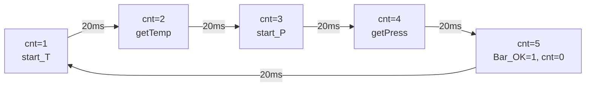

# 气压计 MS5611：软件 I2C、PROM 校准与二阶温度补偿

> 配套源码: [ms5611.c](../../assets/PSINS_STM32F4xx_Keil4_V2.1/scr/ms5611.c) / [mpu9250.h](../../assets/PSINS_STM32F4xx_Keil4_V2.1/scr/mpu9250.h) (宏定义) / [mcu_init.c](../../assets/PSINS_STM32F4xx_Keil4_V2.1/scr/mcu_init.c) (GPIO) / [stm32f4xx_it.c](../../assets/PSINS_STM32F4xx_Keil4_V2.1/scr/stm32f4xx_it.c) (TIM3中断)
> 所属层级: 嵌入式落地篇 · 驱动层
> 前置依赖: [00 总览与架构](00_总览与架构.md) / [01 中断驱动与数据流](01_中断驱动与数据流.md) / [02 传感器驱动 MPU9250](02_传感器驱动_MPU9250.md)
> 学习目标: 读完后你应能回答：
> 1. MS5611 用的是硬件 I2C 外设还是软件模拟？为什么？
> 2. PROM 里存的 7 个校准系数 C[0]~C[6] 分别代表什么？
> 3. 二阶温度补偿在什么条件下触发？补偿了哪些量？
> 4. TIM3 中断的 5 步状态机如何实现"温度和气压交替测量"？
> 5. `Altitude = (1013.25 - Pressure) * 9.0` 这个高度公式有多精确？

!!! tip "本篇为什么重要"
    MS5611 是板子上唯一一个**不走 SPI、也不走 STM32 硬件 I2C 外设**的传感器——它用的是**GPIO 软件模拟 I2C**（bit-banging）。理解这种"最底层"的通信方式，是嵌入式驱动开发的基本功。同时，MS5611 的二阶温度补偿公式是惯导中**传感器误差补偿**的经典范例。

---

## 一、芯片全景：MS5611 是什么

MS5611-01BA 是 MEAS 公司的高分辨率气压传感器（MemS  piezoresistive）：

| 参数 | 值 |
|---|---|
| 量程 | 10 ~ 1200 mbar (hPa) |
| 分辨率 | 0.012 mbar (OSR=256) ~ 0.002 mbar (OSR=4096) |
| 温度量程 | -40 ~ +85 °C |
| 通信接口 | I2C / SPI（本工程用 I2C） |
| I2C 地址 | 0xEE (写) / 0xEF (读)，即 7-bit 地址 0x77 左移 1 位 |
| 内置 | PROM 128-bit，存 6 个工厂校准系数 |

> MS5611 内部有一个**高精度 ADC**，测量的不是模拟电压而是**数字压力/温度原始值**（D1/D2）。用户需要读 PROM 校准系数 + D1/D2 原始值，按 datasheet 公式计算补偿后的气压和温度。

---

## 二、硬件连接：软件 I2C

### 2.1 引脚映射

| 信号 | STM32 引脚 | 模式 | 源码 |
|---|---|---|---|
| IIC_SCL | PA8 | GPIO_Output (推挽) | [mcu_init.c L160-166](../../assets/PSINS_STM32F4xx_Keil4_V2.1/scr/mcu_init.c) |
| IIC_SDA | PC9 | GPIO_Output/Input (动态切换) | [mcu_init.c L170-176](../../assets/PSINS_STM32F4xx_Keil4_V2.1/scr/mcu_init.c) |

GPIO 宏定义在 [mpu9250.h L104-108](../../assets/PSINS_STM32F4xx_Keil4_V2.1/scr/mpu9250.h)：

```c
#define IIC_SDA_HIGH  {GPIO_SetBits(GPIOC,GPIO_Pin_9);}
#define IIC_SCL_HIGH  {GPIO_SetBits(GPIOA,GPIO_Pin_8);}
#define IIC_SDA_LOW   {GPIO_ResetBits(GPIOC,GPIO_Pin_9);}
#define IIC_SCL_LOW   {GPIO_ResetBits(GPIOA,GPIO_Pin_8);}
#define IIC_SDA_VALUE  (GPIOC->IDR & GPIO_Pin_9)
```

!!! note "为什么用软件模拟 I2C？"
    STM32F4 的硬件 I2C 外设有已知的 ACK 控制问题（ST 官方 errata）。严老师选择用 GPIO bit-banging 模拟 I2C，虽然速度慢，但**完全可控、无 errata 风险**。MS5611 的转换时间远大于 I2C 通信时间（OSR=4096 时转换 9 ms），所以 I2C 速度不是瓶颈。

### 2.2 SDA 方向切换

I2C 协议中 SDA 是**双向线**——主机发数据时 SDA 做输出，读从机应答/数据时 SDA 做输入。代码用 GPIO 模式切换实现：

```c
// ms5611.c L16-23  SDA 切换为输入（读从机时）
void IIC_SDA_Out2Input(void)
{
    GPIO_InitStructure.GPIO_Pin = GPIO_Pin_9;
    GPIO_InitStructure.GPIO_PuPd = GPIO_PuPd_NOPULL;
    GPIO_InitStructure.GPIO_Mode = GPIO_Mode_IN;
    GPIO_Init(GPIOC, &GPIO_InitStructure);
}

// ms5611.c L29-38  SDA 切换为输出（发数据时）
void IIC_SDA_Input2Out(void)
{
    GPIO_InitStructure.GPIO_Pin = GPIO_Pin_9;
    GPIO_InitStructure.GPIO_Mode = GPIO_Mode_OUT;
    GPIO_InitStructure.GPIO_OType = GPIO_OType_PP;
    GPIO_InitStructure.GPIO_PuPd = GPIO_PuPd_UP;
    GPIO_InitStructure.GPIO_Speed = GPIO_Speed_50MHz;
    GPIO_Init(GPIOC, &GPIO_InitStructure);
}
```

> 这是软件 I2C 的经典写法。硬件 I2C 外设会自动处理方向切换，但 bit-banging 必须手动管理。

---

## 三、I2C 通信层（bit-banging）

### 3.1 Start / Stop 条件

```c
// ms5611.c L54-61  Start: SCL 高电平时 SDA 由高→低
void IIC_Start(void)
{
    IIC_SDA_HIGH;    // SDA 先拉高
    IIC_SCL_HIGH;    // SCL 拉高
    IIC_Delay(IIC_DELAY);  // 等稳定
    IIC_SDA_LOW;     // SDA 拉低 → Start 条件
    IIC_Delay(IIC_DELAY);
}

// ms5611.c L67-73  Stop: SCL 高电平时 SDA 由低→高
void IIC_Stop(void)
{
    IIC_SDA_LOW;
    IIC_SCL_HIGH;
    IIC_Delay(IIC_DELAY);
    IIC_SDA_HIGH;    // SDA 拉高 → Stop 条件
}
```

| 条件 | SCL | SDA 变化 | 含义 |
|---|---|---|---|
| Start | 高 | 高→低 | 开始一次传输 |
| Stop | 高 | 低→高 | 结束一次传输 |

### 3.2 字节发送

```c
// ms5611.c L127-150  MSB first 发 8 bit
void IIC_Send(u8 u8Snd)
{
    u8 i;
    IIC_SCL_LOW;
    for(i = 0; i < 8; i++)
    {
        if((u8Snd & 0x80) == 0x80)  IIC_SDA_HIGH;  // 测最高位
        else                        IIC_SDA_LOW;
        IIC_Delay(IIC_DELAY);
        IIC_SCL_HIGH;               // SCL 拉高，从机采样 SDA
        u8Snd = u8Snd << 1;         // 准备下一位
        IIC_Delay(IIC_DELAY);
        IIC_SCL_LOW;               // SCL 拉低，允许 SDA 变化
    }
}
```

### 3.3 字节读取与 ACK

```c
// ms5611.c L155-182  MSB first 读 8 bit
u8 IIC_Read(void)
{
    IIC_SDA_Out2Input();   // SDA 切输入
    for(i = 0; i < 8; i++)
    {
        IIC_SCL_HIGH;
        IIC_Delay(IIC_DELAY);
        lu8Val = lu8Val << 1;
        if(IIC_SDA_VALUE != 0)  lu8Val = lu8Val | 0x01;
        else                     lu8Val = lu8Val & 0xfe;
        IIC_SCL_LOW;
        IIC_Delay(IIC_DELAY);
    }
    IIC_SDA_Input2Out();   // SDA 切回输出
    return (u8)lu8Val;
}
```

ACK / NoACK：

```c
// ACK: SDA 拉低 + 一个 SCL 脉冲
void IIC_Ack(void)   { IIC_SDA_LOW; IIC_SCL_HIGH; IIC_Delay(IIC_DELAY); IIC_SCL_LOW; }

// NoACK: SDA 拉高 + 一个 SCL 脉冲
void IIC_NoAck(void) { IIC_SDA_HIGH; IIC_SCL_HIGH; IIC_Delay(IIC_DELAY); IIC_SCL_LOW; }
```

从机 ACK 检测：

```c
// ms5611.c L101-122
u8 IIC_isSalveAck(void)
{
    IIC_SDA_HIGH;
    IIC_SDA_Out2Input();  // SDA 切输入
    IIC_SCL_HIGH;
    for(i = 0; i < 10; i++)  // 等最多 10 个 IIC_DELAY
    {
        if(IIC_SDA_VALUE == 0)  // 从机拉低 = ACK
        {
            lu8Tmp = 1;
            break;
        }
        IIC_Delay(IIC_DELAY);
    }
    IIC_SCL_LOW;
    IIC_SDA_Input2Out();  // 切回输出
    return lu8Tmp;
}
```

---

## 四、MS5611 操作流程

### 4.1 关键宏定义

[mpu9250.h L82-102](../../assets/PSINS_STM32F4xx_Keil4_V2.1/scr/mpu9250.h)：

```c
#define MS561101BA_SlaveAddress  0xEE   // I2C 写地址 (7-bit 0x77 << 1)
#define MS561101BA_RST           0x1E   // 复位命令
#define MS561101BA_D1_OSR_4096   0x48   // 压力转换, OSR=4096 (9.04ms)
#define MS561101BA_D2_OSR_4096   0x58   // 温度转换, OSR=4096 (9.04ms)
#define MS561101BA_ADC_RD        0x00   // 读 ADC 结果
#define MS561101BA_PROM_RD       0xA0   // PROM 读取起始地址
```

### 4.2 复位

```c
// ms5611.c L184-199
u8 MS561101BA_RESET(void)
{
    IIC_Start();
    IIC_Send(MS561101BA_SlaveAddress);  // 发写地址 0xEE
    if(0 == IIC_isSalveAck()) return 0;  // 无应答
    IIC_Send(MS561101BA_RST);            // 发复位命令 0x1E
    if(0 == IIC_isSalveAck()) return 0;
    IIC_Stop();
    return 1;
}
```

> 复位后等待 2.8 ms（datasheet 要求），代码中 `mcu_init()` 里 `Delay(100000)` 约 20 ms，足够。

### 4.3 PROM 读取：6 个校准系数

```c
// ms5611.c L201-237
u8 MS561101BA_PROM_READ(void)
{
    for(i = 0; i < 7; i++)  // 读 7 个 16-bit 系数
    {
        IIC_Start();
        IIC_Send(MS561101BA_SlaveAddress);       // 写地址
        IIC_Send(MS561101BA_PROM_RD + i*2);      // PROM 地址 0xA0,0xA2,...,0xAC
        IIC_Stop();

        IIC_Start();
        IIC_Send(MS561101BA_SlaveAddress + 1);   // 读地址 0xEF
        d1 = IIC_Read();  IIC_Ack();              // 高字节
        d2 = IIC_Read();  IIC_NoAck();            // 低字节
        IIC_Stop();

        MS561101BA_Cal_C[i] = (d1<<8) + d2;       // 拼成 16-bit
    }
    return 1;
}
```

PROM 校准系数含义（MS5611 datasheet）：

| 系数 | 地址 | 名称 | 含义 |
|---|---|---|---|
| C[0] | 0xA0 | — | 保留（厂家用，通常忽略） |
| C[1] | 0xA2 | SENS_T1 | 压力灵敏度 |
| C[2] | 0xA4 | OFF_T1 | 压力偏移 |
| C[3] | 0xA6 | TCS | 压力灵敏度温度系数 |
| C[4] | 0xA8 | TCO | 压力偏移温度系数 |
| C[5] | 0xAA | T_REF | 参考温度 |
| C[6] | 0xAC | TEMPSENS | 温度灵敏度系数 |

> 每颗 MS5611 出厂时工厂测好这些系数并写入 PROM，用户只需读取使用。

---

## 五、温度测量

### 5.1 启动温度转换

```c
// ms5611.c L239-255
u8 MS561101BA_start_Temperature(void)
{
    IIC_Start();
    IIC_Send(MS561101BA_SlaveAddress);
    IIC_Send(MS561101BA_D2_OSR_4096);  // 命令 0x58：温度 ADC, OSR=4096
    IIC_Stop();
    return 1;
}
```

### 5.2 读取温度原始值 D2 并计算

```c
// ms5611.c L257-293
u8 MS561101BA_getTemperature(void)
{
    // 读 3 字节 ADC 结果
    d1 = IIC_Read();  IIC_Ack();   // D2[23:16]
    d2 = IIC_Read();  IIC_Ack();   // D2[15:8]
    d3 = IIC_Read();  IIC_NoAck(); // D2[7:0]
    IIC_Stop();

    D2_Temp = (d1<<16) + (d2<<8) + d3;                    // 24-bit 原始值

    dT = D2_Temp - (((u32)MS561101BA_Cal_C[5]) << 8);     // 温度差
    TEMP = 2000 + (float)dT * MS561101BA_Cal_C[6] / 8388608.0;  // 温度 x100 °C
    return 1;
}
```

#### 公式推导

$$
dT = D2 - C_5 \times 2^8
$$

$$
\text{TEMP} = 2000 + dT \times \frac{C_6}{2^{23}} \quad [\times 100\,°\text{C}]
$$

| 变量 | 含义 | 单位 |
|---|---|---|
| `D2_Temp` | 温度 ADC 原始值 | counts (24-bit) |
| `dT` | 实际温度与参考温度的差 | counts |
| `C[5]` | 参考温度 (T_REF) | counts |
| `C[6]` | 温度灵敏度系数 (TEMPSENS) | counts/°C |
| `TEMP` | 计算温度 × 100 | °C × 100 |

> TEMP 的单位是 **°C × 100**（即 `TEMP = 2512` 表示 25.12 °C），因为 datasheet 用整数避免浮点。代码用 `float` 计算。

---

## 六、压力测量与二阶温度补偿

### 6.1 启动压力转换

```c
// ms5611.c L295-311
u8 MS561101BA_start_Pressure(void)
{
    IIC_Start();
    IIC_Send(MS561101BA_SlaveAddress);
    IIC_Send(MS561101BA_D1_OSR_4096);  // 命令 0x48：压力 ADC, OSR=4096
    IIC_Stop();
    return 1;
}
```

### 6.2 读取压力原始值 D1 并补偿计算

```c
// ms5611.c L313-377
u8 MS561101BA_getPressure(void)
{
    // 读 3 字节 D1
    D1_Pres = (d1<<16) + (d2<<8) + d3;   // 24-bit 压力原始值

    // 一阶补偿（利用温度信息）
    OFF  = C[2]*65536 + C[4]*dT/128;      // 压力偏移（温度补偿后）
    SENS = C[1]*32768 + C[3]*dT/256;      // 压力灵敏度（温度补偿后）

    // 二阶补偿（低温区额外修正）
    if(TEMP >= 2000)        // T >= 20.00°C：无需二阶修正
    {
        T2 = OFF2 = SENS2 = 0;
    }
    else                    // T < 20.00°C：需要二阶修正
    {
        T2 = (dT*dT) / 0x80000000;                    // = dT^2 / 2^31
        OFF2 = 2.5 * (TEMP-2000)^2;
        SENS2 = 1.25 * (TEMP-2000)^2;
        if(TEMP < -1500)   // T < -15.00°C：额外大偏差修正
        {
            OFF2  += 7.0 * (TEMP+1500)^2;
            SENS2 += 5.5 * (TEMP+1500)^2;
        }
    }
    TEMP -= T2;
    OFF  -= OFF2;
    SENS -= SENS2;

    // 最终压力
    Pressure = (D1_Pres * SENS / 2097152.0 - OFF) / 3276800.0;
    Altitude = (1013.25 - Pressure) * 9.0;
}
```

### 6.3 公式汇总

**一阶补偿**（利用温度差 dT 修正压力）：

$$
\text{OFF} = C_2 \times 2^{16} + \frac{C_4 \times dT}{2^7}
$$

$$
\text{SENS} = C_1 \times 2^{15} + \frac{C_3 \times dT}{2^8}
$$

$$
P = \frac{D_1 \times \text{SENS}}{2^{21}} - \frac{\text{OFF}}{2^{12}} \quad [\text{mbar}]
$$

**二阶补偿**（低温区非线性修正）：

| 条件 | 修正量 |
|---|---|
| TEMP >= 2000 (T >= 20°C) | 无修正 |
| -1500 <= TEMP < 2000 (-15°C ~ 20°C) | T2, OFF2, SENS2 如上 |
| TEMP < -1500 (T < -15°C) | 额外追加 OFF2/SENS2 大偏差项 |

!!! note "二阶补偿的物理意义"
    MS5611 的压力-温度交叉灵敏度在低温区（< 20°C）呈非线性变化。一阶补偿只修正线性部分，二阶补偿修正非线性残差。这对于户外/高空场景（温度可能低至 -40°C）尤为重要。

### 6.4 高度计算

```c
Altitude = (1013.25 - Pressure) * 9.0;  // m
```

这是一个**线性近似**，标准气压高度公式为：

$$
h = \frac{T_0}{L} \left[1 - \left(\frac{P}{P_0}\right)^{\frac{g L}{R T_0}}\right] \approx 44330 \left[1 - \left(\frac{P}{1013.25}\right)^{0.1903}\right]
$$

线性近似 $h \approx (P_0 - P) \times k$ 在 P 接近 1013 hPa 时误差小，但在大高度差时会偏差显著：

| 真实高度 (m) | 标准公式 P (hPa) | 线性近似高度 (m) | 误差 |
|---|---|---|---|
| 0 | 1013.25 | 0 | 0 |
| 100 | 1001.3 | 107.9 | +7.9 |
| 500 | 954.6 | 528.8 | +28.8 |
| 1000 | 898.7 | 1035.0 | +35.0 |
| 2000 | 795.0 | 1963.8 | -36.2 |

> 高度值在本工程中**仅用于 PC 端显示和 outFrame.mBar 输出**，不直接参与 SINS 算法（SINS 高度来自 GPS `pos.k` 或纯惯导解算）。H743 移植时建议替换为标准气压公式。

---

## 七、TIM3 中断时序：5 步状态机

[stm32f4xx_it.c L220-250](../../assets/PSINS_STM32F4xx_Keil4_V2.1/scr/stm32f4xx_it.c) 的 TIM3 中断（50 Hz / 20 ms）用 `MS5611_cnt` 实现一个 5 步循环：

```c
void TIM3_IRQHandler(void)
{
    MS5611_cnt++;
    if(MS5611_cnt == 1)  MS561101BA_start_Temperature();  // 启动温度ADC
    if(MS5611_cnt == 2)  MS561101BA_getTemperature();     // 读温度 → 算dT/TEMP
    if(MS5611_cnt == 3)  MS561101BA_start_Pressure();     // 启动压力ADC
    if(MS5611_cnt == 4)  MS561101BA_getPressure();        // 读压力 → 算补偿 → Pressure/Altitude
    if(MS5611_cnt == 5)  { Bar_OK_flag = 1; MS5611_cnt = 0; }  // 通知主循环
    TIM_ClearITPendingBit(TIM3, TIM_IT_Update);
    TIM_SetCounter(TIM3, 0);
}
```



| 步骤 | cnt | TIM3 间隔 | 操作 | 耗时 |
|---|---|---|---|---|
| 1 | 1 | 0→20 ms | 启动温度 ADC (0x58) | ~0.5 ms (I2C) |
| — | — | 20→40 ms | **等待 ADC 转换** (9.04 ms @ OSR=4096) | — |
| 2 | 2 | 40→60 ms | 读 D2 + 算温度 | ~1 ms |
| 3 | 3 | 60→80 ms | 启动压力 ADC (0x48) | ~0.5 ms |
| — | — | 80→100 ms | **等待 ADC 转换** (9.04 ms) | — |
| 4 | 4 | 100→120 ms | 读 D1 + 算补偿 → Pressure/Altitude | ~1.5 ms |
| 5 | 5 | 120→140 ms | Bar_OK_flag = 1, cnt = 0 | <0.1 ms |

> **一组完整的温度+气压测量需要 5 × 20 ms = 100 ms（10 Hz）**。其中 ADC 转换占 2 × 9 ms = 18 ms，其余 82 ms 是等待。OSR=4096 虽然精度最高但慢；如果降到 OSR=256，转换只需 0.6 ms，理论可在 10 ms 内完成一轮（100 Hz），但分辨率从 0.002 mbar 降到 0.012 mbar。

---

## 八、数据输出

压力和高度写入全局结构体（[ms5611.c L373-374](../../assets/PSINS_STM32F4xx_Keil4_V2.1/scr/ms5611.c)）：

```c
mpu_Data_value.Pressure = Pressure;    // hPa (mbar)
mpu_Data_value.Altitude = Altitude;   // m (线性近似)
```

在 [main.cpp](../../assets/PSINS_STM32F4xx_Keil4_V2.1/scr/main.cpp) 中通过 `AVPUartOut()` 打包到 `outFrame.mBar`（单位 hPa）发送给 PC：

```c
// outFrame 结构定义在 mcu_init.h L46-62
float mBar;  // ← 气压值 (hPa)
```

!!! note "气压在本工程中的角色"
    气压计的高度值**不参与 SINS 卡尔曼滤波的状态更新**（KF 状态向量没有气压高度）。`Bar_OK_flag` 在主循环中也没有被用于触发任何操作（检查 `main.cpp` 各模式均无 `if(Bar_OK_flag)` 分支）。

    > 气压计目前仅作为**辅助输出**。在 H743 移植时，如果要做气压高度辅助（松组合），可以将气压高度作为 KF 的一个观测值，约束 SINS 高度通道的发散。详见 [10 H743 移植指南](10_H743移植指南.md)。

---

## 九、H743 移植要点

### 9.1 需要改的

| 项目 | F4 原工程 | H743 移植 | 说明 |
|---|---|---|---|
| I2C 引脚 | PA8(SCL) / PC9(SDA) GPIO | 可换用硬件 I2C1/I2C2 | H743 的 I2C 外设比 F4 更稳定 |
| GPIO 模式切换 | `GPIO_Mode_OUT` / `GPIO_Mode_IN` | HAL: `GPIO_MODE_OUTPUT_OD` / `GPIO_MODE_INPUT` | 用开漏输出更符合 I2C 规范 |
| Delay 函数 | 空循环计数 | DWT 计时或 HAL_Delay | 需要重新标定 IIC_DELAY |
| TIM3 配置 | APB1=42MHz, 预分频 8400 | H743 APB1 频率不同 | 重新计算预分频保持 50 Hz |

### 9.2 推荐优化

| 优化 | 收益 |
|---|---|
| 换用硬件 I2C 外设 | 省去 bit-banging 的 CPU 开销，通信时间从 ~1 ms 降到 ~0.3 ms |
| OSR 从 4096 降到 2048 | 转换时间从 9 ms 降到 2.28 ms，可提高气压更新率到 ~25 Hz |
| 高度公式替换为标准气压公式 | 消除线性近似的 30+ m 误差 |
| 气压高度加入 KF 松组合 | 约束 SINS 高度通道发散 |

### 9.3 不需要改的

| 项目 | 说明 |
|---|---|
| PROM 校准系数读取流程 | I2C 协议，与平台无关 |
| 二阶温度补偿公式 | datasheet 标准，与平台无关 |
| C[0]~C[6] 的物理含义 | 芯片内部约定不变 |

---

??? note "自测题"
    1. MS5611 的 SDA 线为什么需要在输出和输入模式之间切换？哪个环节需要切换为输入？
    2. PROM 校准系数 C[5] 和 C[6] 分别在温度计算中起什么作用？
    3. 二阶温度补偿在 TEMP < -1500（即 T < -15°C）时额外修正了什么？为什么需要这个额外修正？
    4. 一组完整的温度+气压测量需要多少毫秒？其中 ADC 转换占多少？
    5. 如果把 OSR 从 4096 改成 256，TIM3 的 5 步状态机是否还能正常工作？

??? note "参考答案"
    1. I2C SDA 是双向线。主机发数据时 SDA 做输出；读从机 ACK 或读数据时 SDA 必须切为输入，否则主机和从机会同时驱动 SDA 导致冲突（短路）。`IIC_isSalveAck()` 和 `IIC_Read()` 中切换为输入。
    2. C[5] 是参考温度 T_REF，用于计算温度差 `dT = D2 - C[5]<<8`；C[6] 是温度灵敏度系数 TEMPSENS，用于把 dT 转换为实际温度 `TEMP = 2000 + dT * C[6] / 2^23`。
    3. 在 T < -15°C 时，压力-温度交叉灵敏度的非线性进一步加剧。标准二阶修正只覆盖 -15°C ~ 20°C 区间的二次项，低于 -15°C 需要追加额外的大偏差二次项（OFF2 += 7.0*(TEMP+1500)^2, SENS2 += 5.5*(TEMP+1500)^2）来补偿。
    4. 5 步 × 20 ms = 100 ms。其中两次 ADC 转换各 9.04 ms = 18.08 ms，其余 82 ms 是等待。
    5. OSR=256 时 ADC 转换只需 0.6 ms。TIM3 每 20 ms 中断一次，第 1 步启动后到第 2 步读取间隔 20 ms，远大于 0.6 ms，所以仍然能正常工作。但如果想提高更新率，可以把 TIM3 频率提高到 200 Hz（5 ms），因为 0.6 ms + I2C 时间（~1 ms）在 5 ms 窗口内。

---

## 参考资料

- [MS5611-01BA Datasheet (MEAS)](https://www.te.com/commerce/DocumentDelivery/DOTTL?pid=9&model=MS5611-01BA03&crl=1) — 7 个 PROM 校准系数定义、二阶温度补偿公式与 OSR 转换时间表
- [STM32 软件模拟 I2C 原理详解](https://blog.csdn.net/qq_34715903/article/details/107759765) — bit-banging 时序、SDA 方向切换、ACK 检测实现
- [STM32F4xx 参考手册 RM0090 — GPIO 章节](https://www.st.com/resource/en/reference_manual/dm00031020-stm32f405-415-stm32f407-417-stm32f427-437-and-stm32f429-439-advanced-arm-based-32-bit-mcus-stmicroelectronics.pdf) — GPIO_Mode_OUT/GPIO_Mode_IN 切换、推挽与开漏模式差异
- [标准气压高度公式（ISA 模型）](https://en.wikipedia.org/wiki/Barometric_formula) — 线性近似 (1013.25-P)*9.0 的标准气压公式对照
- [PSINS 官网（严恭敏教授）](http://www.psins.org.cn/) — 气压高度在 PSINS 工具箱中的角色定义

---

**参考体系**：[00 总览与架构](00_总览与架构.md) / [01 中断驱动与数据流](01_中断驱动与数据流.md) / [02 传感器驱动 MPU9250](02_传感器驱动_MPU9250.md) / 配套源码 [ms5611.c](../../assets/PSINS_STM32F4xx_Keil4_V2.1/scr/ms5611.c) / [stm32f4xx_it.c](../../assets/PSINS_STM32F4xx_Keil4_V2.1/scr/stm32f4xx_it.c) / [mcu_init.c](../../assets/PSINS_STM32F4xx_Keil4_V2.1/scr/mcu_init.c)
