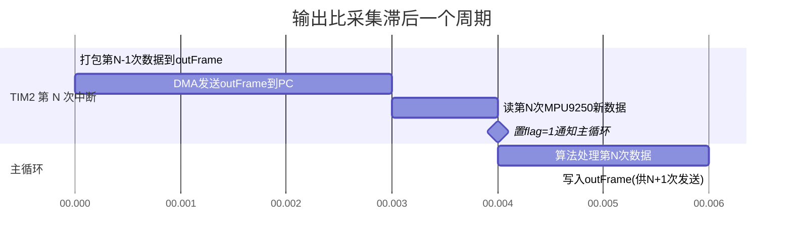

# 串口输出帧：Out_Frame 结构、DMA 发送与 MATLAB 解析

> 配套源码: [usart.c](../../assets/PSINS_STM32F4xx_Keil4_V2.1/scr/usart.c) (打包) / [mcu_init.c](../../assets/PSINS_STM32F4xx_Keil4_V2.1/scr/mcu_init.c) (DMA) / [mcu_init.h](../../assets/PSINS_STM32F4xx_Keil4_V2.1/scr/mcu_init.h) (结构体) / [stm32f4xx_it.c](../../assets/PSINS_STM32F4xx_Keil4_V2.1/scr/stm32f4xx_it.c) (触发)
> 所属层级: 嵌入式落地篇 · 衔接层
> 前置依赖: [00 总览与架构](00_总览与架构.md) / [01 中断驱动与数据流](01_中断驱动与数据流.md)
> 学习目标: 读完后你应能回答：
> 1. `Out_Frame` 结构体有多少字节？各字段排列顺序是什么？
> 2. 为什么输出比采集"滞后一个周期"？
> 3. DMA 发送 `outFrame` 用的哪个 DMA Stream？为什么不需要 CPU 干预？
> 4. 校验和怎么算？校验范围是整个帧还是部分字段？
> 5. PC 端如何根据帧头区分 Mahony / SINS 静态 / SINS 动态模式？

!!! tip "本篇为什么重要"
    串口输出帧是嵌入式 PSINS 与 PC 端 MATLAB 之间的**唯一数据通道**。理解帧结构是你在 PC 端做数据分析、画图、调试的前提。本篇把 `Out_Frame` 的每个字段、打包时序、DMA 机制、校验和算法一次讲透。

---

## 一、Out_Frame 结构体定义

[mcu_init.h L46-62](../../assets/PSINS_STM32F4xx_Keil4_V2.1/scr/mcu_init.h)：

```c
typedef struct {
    u32   head;       // 帧头 (0x56aa55aa / 0x57aa55aa / 0x58aa55aa)
    float t;          // 时间戳 (s)
    float Gyro[3];    // 陀螺原始值 (deg/s)
    float Accel[3];   // 加计原始值 (m/s2, ×9.8)
    float Magn[3];    // 磁力计值 (μT, 带ASA修正)
    float mBar;       // 气压 (hPa)
    float Att[3];     // 姿态角 [pitch, roll, yaw] (rad)
    float Vn[3];      // 速度 [vE, vN, vU] (m/s)
    float Pos[5];      // 位置 [lat_deg, lat_frac, lon_deg, lon_frac, h]
    float GPS_Vn[3];  // GPS 速度 [vE, vN, vU] (m/s)
    float GPS_Pos[5]; // GPS 位置 [lat_deg, lat_frac, lon_deg, lon_frac, h]
    float GPS_status; // GPS 状态 = numSV + pDOP/100
    float GPS_delay;  // GPS 延迟 (s)
    float Temp;       // MPU9250 温度 (degC)
    u32   chksum;     // 校验和
} Out_Frame;
```

### 1.1 字段布局与偏移

| 偏移 (byte) | 字段 | 类型 | 大小 | 含义 |
|---|---|---|---|---|
| 0 | `head` | u32 | 4 | 帧头，标识模式 |
| 4 | `t` | float | 4 | 系统时间 (s) |
| 8-19 | `Gyro[3]` | float×3 | 12 | 陀螺 (deg/s) |
| 20-31 | `Accel[3]` | float×3 | 12 | 加计 (m/s2, 已×9.8) |
| 32-43 | `Magn[3]` | float×3 | 12 | 磁力计 (μT) |
| 44 | `mBar` | float | 4 | 气压 (hPa) |
| 48-59 | `Att[3]` | float×3 | 12 | 姿态 [pitch, roll, yaw] (rad) |
| 60-71 | `Vn[3]` | float×3 | 12 | 速度 [vE, vN, vU] (m/s) |
| 72-91 | `Pos[5]` | float×5 | 20 | 位置 (度+小数+度+小数+高) |
| 92-103 | `GPS_Vn[3]` | float×3 | 12 | GPS 速度 |
| 104-123 | `GPS_Pos[5]` | float×5 | 20 | GPS 位置 |
| 124 | `GPS_status` | float | 4 | numSV + pDOP/100 |
| 128 | `GPS_delay` | float | 4 | GPS 延迟 (s) |
| 132 | `Temp` | float | 4 | 温度 (degC) |
| 136 | `chksum` | u32 | 4 | 校验和 |
| **总计** | | | **140** | |

> 140 字节 × 460800 bps ÷ 10 bit/byte ≈ **3.03 ms** 发送时间，远在 10 ms 中断窗口内。

### 1.2 帧头约定

| 帧头值 | 模式 | 设置位置 |
|---|---|---|
| `0x56aa55aa` | Example-1 Mahony | [main.cpp L22](../../assets/PSINS_STM32F4xx_Keil4_V2.1/scr/main.cpp) |
| `0x57aa55aa` | Example-2 SINSGPS 静态 | [main.cpp L23](../../assets/PSINS_STM32F4xx_Keil4_V2.1/scr/main.cpp) |
| `0x58aa55aa` | Example-3 SINSGPS 动态 | [main.cpp L24](../../assets/PSINS_STM32F4xx_Keil4_V2.1/scr/main.cpp) |

PC 端通过帧头判断当前板子运行在哪个模式，从而选择正确的解析策略。

!!! note "为什么帧头不用 0xA5A5 等简单值？"
    `0x56aa55aa` 是一个"特殊序列"——4 字节中高低字节交替，在正常数据流中极不可能自然出现，起到**帧同步**作用。PC 端搜索这个序列就能找到帧起始。

---

## 二、Uart1_Out_Frame() 打包函数

[usart.c L54-122](../../assets/PSINS_STM32F4xx_Keil4_V2.1/scr/usart.c) 的完整打包逻辑：

### 2.1 IMU 数据打包

```c
// usart.c L62-73
outFrame.t = (float)(MCU_ms_cnt / 1000.0f);                  // 时间 (s)

outFrame.Gyro[0] = (float)mpu_Data_value.Gyro[0];            // deg/s
outFrame.Gyro[1] = (float)mpu_Data_value.Gyro[1];
outFrame.Gyro[2] = (float)mpu_Data_value.Gyro[2];

outFrame.Accel[0] = (float)(mpu_Data_value.Accel[0] * 9.8f); // g→m/s2
outFrame.Accel[1] = (float)(mpu_Data_value.Accel[1] * 9.8f);
outFrame.Accel[2] = (float)(mpu_Data_value.Accel[2] * 9.8f);

outFrame.Magn[0] = (float)mpu_Data_value.Mag[0];             // μT
outFrame.Magn[1] = (float)mpu_Data_value.Mag[1];
outFrame.Magn[2] = (float)mpu_Data_value.Mag[2];

outFrame.mBar = (float)mpu_Data_value.Pressure;              // hPa
```

!!! note "加计输出乘 9.8 而非 G0"
    打包时加计乘的是 `9.8f`，不是 PSINS 定义的 `G0 = 9.7803...`。这是严老师的近似——PC 端只是显示用，0.02 m/s2 的差异不影响可视化分析。如果要精确，应改为 `*G0`。

### 2.2 GPS 数据打包

```c
// usart.c L77-108
if(GPS_send_once == 1)
{
    outFrame.GPS_Vn[0] = (float)gps_Data_value.GPS_Vn[0];     // m/s
    outFrame.GPS_Vn[1] = (float)gps_Data_value.GPS_Vn[1];
    outFrame.GPS_Vn[2] = (float)gps_Data_value.GPS_Vn[2];

    // 经纬度拆成"整数度 + 小数度"两段
    Data_D = gps_Data_value.GPS_Pos[1] / DEG1;   // lon (rad → deg)
    Data_U = (u32)Data_D;                          // 整数度
    Data_F = (float)(Data_D - (double)Data_U);    // 小数度
    outFrame.GPS_Pos[0] = (float)Data_U;          // lon 整数
    outFrame.GPS_Pos[1] = Data_F;                  // lon 小数

    Data_D = gps_Data_value.GPS_Pos[0] / DEG1;   // lat (rad → deg)
    Data_U = (u32)Data_D;
    Data_F = (float)(Data_D - (double)Data_U);
    outFrame.GPS_Pos[2] = (float)Data_U;          // lat 整数
    outFrame.GPS_Pos[3] = Data_F;                  // lat 小数

    outFrame.GPS_Pos[4] = (float)gps_Data_value.GPS_Pos[2];  // h (m)

    // GPS 状态 = numSV + pDOP/100
    outFrame.GPS_status = (float)GPS_numSV + GPS_pDOP / 100.0f;

    // GPS 延迟
    outFrame.GPS_delay = GPS_Delay / 10000.0f;   // 100μs → s
    // ... 延迟修正见 04 篇

    GPS_send_once = 0;
}
else
{
    // GPS 无新数据时清零所有 GPS 字段
    outFrame.GPS_Vn[0..2] = 0;
    outFrame.GPS_Pos[0..4] = 0;
    outFrame.GPS_status = 0;
    outFrame.GPS_delay = 0;
}
```

!!! note "为什么经纬度拆成整数+小数？"
    `float` 只有 7 位有效数字。经度 109.880422° 如果直接存成一个 float，精度只有 0.001°（约 100 m）。拆成 `109`（整数）和 `0.880422`（小数）两个 float，各自精度足够，组合后精度保持到 0.000001°（约 0.1 m）。

    注意输出顺序：`GPS_Pos[0,1]` 存的是**经度**（lon），`GPS_Pos[2,3]` 存的是**纬度**（lat）。这与内部 `GPS_Pos[0]=lat, GPS_Pos[1]=lon` 不同——输出时为了 MATLAB 端方便而做了拆分。

### 2.3 校验和

```c
// usart.c L119-121
for(outFrame.chksum = 0, pcheck = (u8*)&outFrame.t;
    pcheck < (u8*)&outFrame.chksum;
    pcheck++)
{
    outFrame.chksum += *pcheck;
}
```

- 起始地址：`&outFrame.t`（跳过 `head` 字段）
- 结束地址：`&outFrame.chksum`（不包含校验和本身）
- 算法：逐字节累加（uint32 溢出回绕）

| 校验范围 | 字段 |
|---|---|
| 包含 | `t` → `Temp`（L4-L135） |
| 不包含 | `head`（帧头不参与校验） |
| 不包含 | `chksum`（校验和本身） |

> PC 端验证：收到 140 字节后，对 byte[4]~byte[135] 做同样累加，与 byte[136~139] 比较。

---

## 三、DMA 发送机制

### 3.1 DMA 配置

[mcu_init.c L241-262](../../assets/PSINS_STM32F4xx_Keil4_V2.1/scr/mcu_init.c)：

```c
void USART1_DIA_OUT_Configuration(void)
{
    DMA_InitTypeDef DMA_InitStructure;
    DMA_DeInit(DMA2_Stream7);
    DMA_InitStructure.DMA_Channel = DMA_Channel_4;
    DMA_InitStructure.DMA_PeripheralBaseAddr = (uint32_t)&USART1->DR;  // 目标: USART1 数据寄存器
    DMA_InitStructure.DMA_Memory0BaseAddr = (uint32_t)&outFrame;       // 源: outFrame 结构体
    DMA_InitStructure.DMA_DIR = DMA_DIR_MemoryToPeripheral;             // 内存→外设
    DMA_InitStructure.DMA_BufferSize = (uint16_t)sizeof(outFrame);     // 140 字节
    DMA_InitStructure.DMA_PeripheralInc = DMA_PeripheralInc_Disable;   // 外设地址不递增
    DMA_InitStructure.DMA_MemoryInc = DMA_MemoryInc_Enable;             // 内存地址递增
    DMA_InitStructure.DMA_PeripheralDataSize = DMA_PeripheralDataSize_Byte;
    DMA_InitStructure.DMA_MemoryDataSize = DMA_PeripheralDataSize_Byte;
    DMA_InitStructure.DMA_Mode = DMA_Mode_Normal;                       // 单次模式
    DMA_InitStructure.DMA_Priority = DMA_Priority_High;
    DMA_Init(DMA2_Stream7, &DMA_InitStructure);
    USART_DMACmd(USART1, USART_DMAReq_Tx, ENABLE);
    USART_ClearFlag(USART1, USART_FLAG_TC);
    DMA_Cmd(DMA2_Stream7, ENABLE);
}
```

| 参数 | 值 | 含义 |
|---|---|---|
| DMA Stream | DMA2_Stream7 | STM32F4 的 USART1_TX 固定映射 |
| Channel | Channel_4 | USART1_TX 的 DMA 通道 |
| 方向 | Memory → Peripheral | 从 outFrame 发到 USART1 |
| 数据大小 | Byte | 逐字节发送 |
| 内存递增 | Enable | 遍历 outFrame 的 140 字节 |
| 外设递增 | Disable | 始终写同一个 DR 寄存器 |
| 模式 | Normal (单次) | 发完 140 字节自动停止 |

### 3.2 触发时序

在 TIM2 中断中触发（[stm32f4xx_it.c L192-196](../../assets/PSINS_STM32F4xx_Keil4_V2.1/scr/stm32f4xx_it.c)）：

```c
// TIM2 中断 (100 Hz)
if(MCU_ms_cnt > 10 && mcu_init_gpscfg == 0)
{
    Uart1_Out_Frame();              // 1. 打包上一帧数据到 outFrame
    USART1_DIA_OUT_Configuration();  // 2. 启动 DMA 发送 outFrame
}

Delay(0);                            // 3. 清零 totalDly

READ_MPU9250_A_T_G();               // 4. 读新数据
READ_MPU9250_MAG();
GAMT_OK_flag = 1;                   // 5. 通知主循环
```



> **关键时序**：TIM2 第 N 次中断先打包**第 N-1 次**的数据并发送，然后才读取**第 N 次**的新数据。主循环处理完第 N 次数据后更新 `outFrame`，等下一次中断（第 N+1 次）发送。**输出永远比采集晚一个 10 ms 周期**。

---

## 四、Out_Frame 与算法层的接口

`outFrame` 是一个 C 结构体全局变量，由 C++ 算法层写入、由 C 驱动层读取发送。两个写入来源：

### 4.1 帧头写入（C++ 层）

[main.cpp L22-24](../../assets/PSINS_STM32F4xx_Keil4_V2.1/scr/main.cpp) 在进入模式时设置：

```c
outFrame.head = 0x56aa55aa;  // Mahony 模式
outFrame.head = 0x57aa55aa;  // SINSGPS 静态
outFrame.head = 0x58aa55aa;  // SINSGPS 动态
```

### 4.2 导航数据写入（C++ 层）

`AVPUartOut()` 函数在主循环中被调用（[main.cpp L48](../../assets/PSINS_STM32F4xx_Keil4_V2.1/scr/main.cpp)），把算法结果写入 `outFrame.Att/Vn/Pos`：

```c
// Mahony 模式
AVPUartOut(q2att(mahony.qnb));  // 四元数→欧拉角→outFrame.Att

// SINS 模式
AVPUartOut(kf);  // KF 状态→outFrame.Att/Vn/Pos
```

> `AVPUartOut` 的实现细节在 PSINS.cpp 中，涉及 `q2att` 四元数转欧拉角和 KF 状态提取，留到 [07 Mahony 详解](07_Mahony模式详解.md) 和 [08 SINSGNSS](08_SINS_GNSS静态组合.md) 中展开。

### 4.3 IMU 数据写入（C 层）

[usart.c L62-117](../../assets/PSINS_STM32F4xx_Keil4_V2.1/scr/usart.c) 的 `Uart1_Out_Frame()` 在中断里把 `mpu_Data_value` 写入 `outFrame.Gyro/Accel/Magn/mBar/Temp`。

---

## 五、PC 端 MATLAB 解析

PC 端通过串口接收 140 字节帧，MATLAB 解析伪代码：

```matlab
% 1. 找帧头
header = fread(s, 4, 'uint32');
while header ~= hex2dec('56aa55aa') && ...
      header ~= hex2dec('57aa55aa') && ...
      header ~= hex2dec('58aa55aa')
    header = fread(s, 1, 'uint32');
end

% 2. 读剩余 136 字节
data = fread(s, 136/4, 'single');  % float32 数组

% 3. 解析字段
t       = data(1);
gyro    = data(2:4);     % deg/s
accel   = data(5:7);     % m/s2
mag     = data(8:10);    % μT
mBar    = data(11);
att     = data(12:14);   % pitch, roll, yaw (rad)
vn      = data(15:17);   % vE, vN, vU (m/s)
pos     = data(18:22);   % lon_int, lon_frac, lat_int, lat_frac, h
gps_vn  = data(23:25);
gps_pos = data(26:30);
gps_st  = data(31);
gps_dly = data(32);
temp    = data(33);
chksum  = fread(s, 1, 'uint32');

% 4. 校验
calc_chk = sum(typecast(single(data), 'uint8'), 'uint32');
assert(calc_chk == chksum);
```

> PSINS MATLAB 版附带 `psins_show.m` 等脚本可以直接解析这些帧并画图。

---

## 六、H743 移植要点

### 6.1 需要改的

| 项目 | F4 原工程 | H743 移植 | 说明 |
|---|---|---|---|
| DMA Stream | DMA2_Stream7 / Ch4 | H743 DMA 映射不同 | 查 H743 DMA 请求表 |
| USART 波特率 | 460800 | 可升至 921600 或更高 | H743 USART 时钟更高 |
| `sizeof(outFrame)` | 140 (需验证无 padding) | 应保持 140 | 用 `__packed` 防止编译器插入 padding |

!!! warning "结构体 padding 风险"
    `Out_Frame` 全是 float(4B) 和 u32(4B)，天然 4 字节对齐，目前没有 padding 问题。但如果移植时往里加了 `double` 或 `u8` 字段，编译器可能插入 padding 导致 `sizeof` 变化。建议加 `__attribute__((packed))` 或逐字段验证偏移。

### 6.2 不需要改的

| 项目 | 说明 |
|---|---|
| Out_Frame 字段定义 | 纯数据协议，与平台无关 |
| 校验和算法 | 逐字节累加，与平台无关 |
| 打包逻辑 | 纯 C 逻辑，可跨平台 |
| 帧头约定 | 协议约定，不变 |

### 6.3 推荐优化

| 优化 | 收益 |
|---|---|
| DMA 改 Circular 模式 + 双缓冲 | 消除每次重新配置 DMA 的开销 |
| 加帧尾标识（如 0x55aa55aa） | 双向帧同步更可靠 |
| 加 CRC32 替代简单累加 | 提升数据完整性保证 |
| 经纬度直接用 double 存储 | 消除整数+小数拆分的复杂性 |

---

??? note "自测题"
    1. `Out_Frame` 总共多少字节？为什么经纬度要拆成整数+小数两个 float？
    2. TIM2 中断先做什么再做什么？为什么输出比采集晚一个周期？
    3. 校验和的计算范围是什么？为什么不包含帧头？
    4. DMA 配置中 `DMA_MemoryInc_Enable` 的作用是什么？如果不使能会怎样？
    5. PC 端如何区分收到的是 Mahony 模式数据还是 SINS 模式数据？

??? note "参考答案"
    1. 140 字节。float 只有 7 位有效数字，经度 109.880422° 直接存 float 会丢失精度。拆成 109 + 0.880422 两个 float，组合后精度保持到 0.000001°。
    2. 先调用 `Uart1_Out_Frame()` 打包上一帧数据并启动 DMA 发送，然后才调 `READ_MPU9250_A_T_G()` 读新数据。因为打包用的是上一次中断读到的数据，所以输出晚一个 10ms 周期。
    3. 从 `outFrame.t`（偏移 4）到 `outFrame.Temp`（偏移 135），不包含 `head`（帧头固定不变不需要校验）和 `chksum`（不能参与自身校验）。
    4. 内存地址递增让 DMA 自动遍历 outFrame 的 140 个字节。如果不使能，DMA 会反复发送同一个字节（outFrame 的第 0 字节），PC 端收到的是无效数据。
    5. 通过帧头 `head` 字段：0x56aa55aa = Mahony, 0x57aa55aa = SINS静态, 0x58aa55aa = SINS动态。

---

## 参考资料

- [STM32F4xx 参考手册 RM0090 — DMA 章节](https://www.st.com/resource/en/reference_manual/dm00031020-stm32f405-415-stm32f407-417-stm32f427-437-and-stm32f429-439-advanced-arm-based-32-bit-mcus-stmicroelectronics.pdf) — DMA2_Stream7 通道映射、内存递增模式、外设到内存传输
- [STM32 DMA 传输实战详解](https://blog.csdn.net/qq_34715903/article/details/108271815) — DMA_MemoryInc_Enable / 外设地址固定、内存地址递增的工程含义
- [严恭敏教授 CSDN 博客](https://blog.csdn.net/yan_gong_min) — PSINS 工程输出帧 DMA 设计与 Out_Frame 字段定义
- [IEEE 754 浮点数精度问题](https://en.wikipedia.org/wiki/IEEE_754) — 经度 109.880422° 为何拆分整数 + 小数存储
- [PSINS 官网（严恭敏教授）](http://www.psins.org.cn/) — 帧头 x56aa55aa 等枚举与字段定义来源

---

**参考体系**：[00 总览与架构](00_总览与架构.md) / [01 中断驱动与数据流](01_中断驱动与数据流.md) / [04 GPS解析与PC命令](04_GPS解析与PC命令.md) / 配套源码 [usart.c](../../assets/PSINS_STM32F4xx_Keil4_V2.1/scr/usart.c) / [mcu_init.c](../../assets/PSINS_STM32F4xx_Keil4_V2.1/scr/mcu_init.c) / [mcu_init.h](../../assets/PSINS_STM32F4xx_Keil4_V2.1/scr/mcu_init.h)
