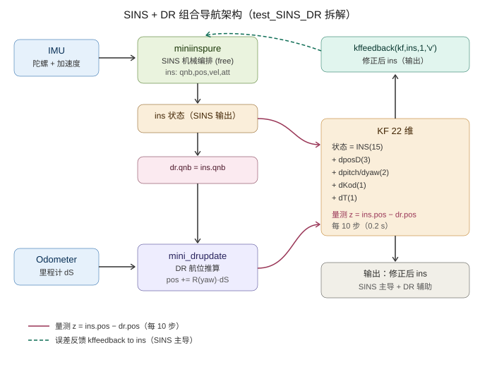
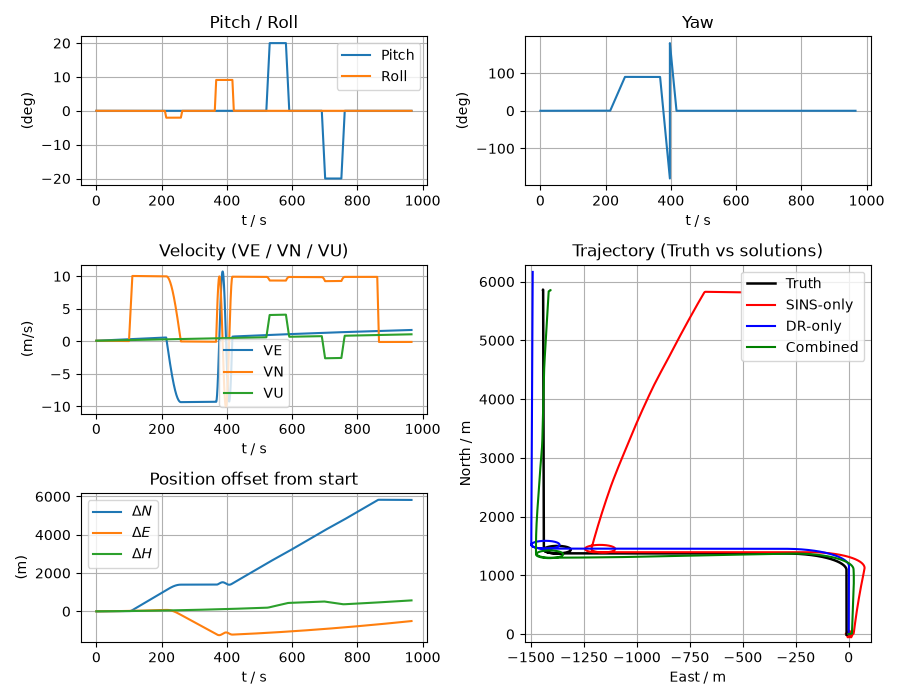
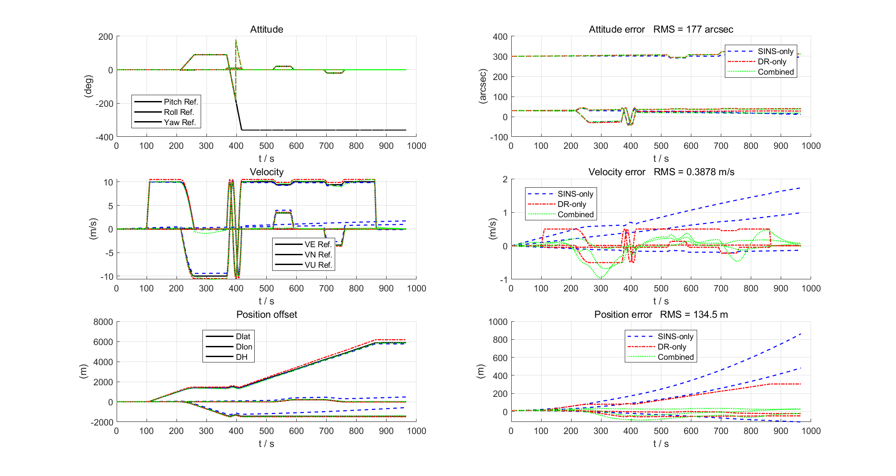
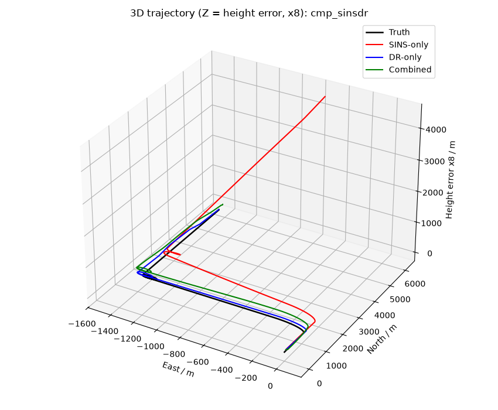
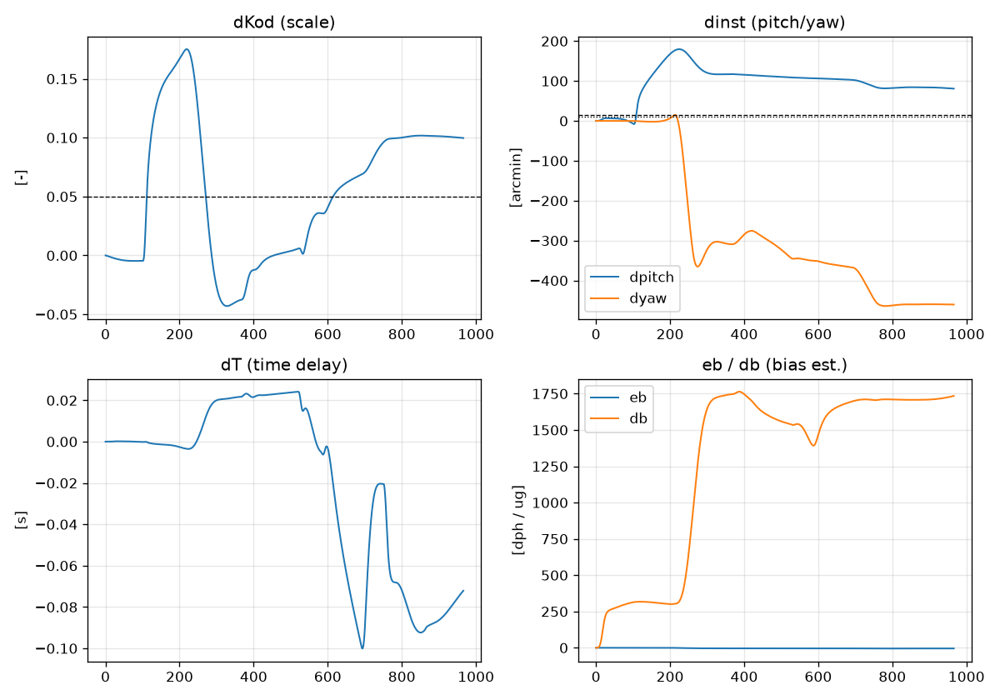

# 拆解 PSINS ④：test_SINS_DR.m——SINS+DR 组合导航（22 维 KF 自标定）

> **拆解 PSINS 系列第四篇**。P1 造数据、P2 纯惯导、P3 航位推算，本篇把两条独立定位链**合二为一**：SINS 高带宽但长时漂，DR 短时稳但角度/尺度发散——**KF 融合后用 DR 位置观测量修正 SINS 速度（每 0.1s 闭环），同时在线辨识里程计安装/尺度/时延**。这是车/机/弹组合导航最常见的紧耦合方案。
>
> **核心交付**：**迷你 SINS+DR 组合**（自包含、Python 版，MATLAB 版待补），与 PSINS `test_SINS_DR.m` 同参数对拍，**比 DR-only 好 3.3 倍**（水平 RMS 45.5m vs 151m），核心机制（速度闭环 + dKod 自标定）一致。
>
> **参考体系**：PSINS `demos/test_SINS_DR.m`（拆解对象，40 行薄壳）、`base/base2/etm.m`（22 维 F 矩阵）、`base/kf/kffk.m`（dposD 块扩展）、`base/kf/kffeedback.m`（'v' 速度闭环）；对照 [P2 纯惯导](P2_纯惯导_拆解test_SINS.md)、[P3 航位推算](P3_航位推算_拆解test_DR.md)、[11 EKF 与 ESKF](../../03_组合导航篇/11_EKF与ESKF.md)、[12 观测模型](../../03_组合导航篇/12_观测模型.md)。

## 一、整体架构：SINS 主导 + DR 辅助



四个核心机制：

1. **SINS 机械编排**（前文 P2）：陀螺+加速度计双子样递推，得 `ins.qnb / ins.vn / ins.pos`
2. **DR 姿态硬锚定**（`dr.qnb = ins.qnb`）：DR 不自积分航向，直接抄 SINS 姿态
3. **22 维 KF 预测+更新**（每 0.1s）：F 照搬 etm.m；H = `[+I(δr), -I(dposD), -Mpvvn(dT)]`
4. **仅速度闭环**（`ins.vn -= x[3:6]`，对齐 PSINS `kffeedback 'v'`）

**为什么 DR 姿态要抄 SINS？** —— 车辆场景 DR 没有独立航向源，陀螺是唯一方向源，DR 抄 SINS 姿态保证 DR 方向与 SINS 一致；KF 只能靠位置差 `z = ins.pos - dr.pos` 修正。

## 二、test_SINS_DR.m：40 行薄壳

```matlab
glvs; psinstypedef('test_SINS_DR_def');       % 22 维 KF 结构（INS15+dposD3+dinst2+dKod+dT）
trj = trjfile('trj10ms.mat');
[nn, ts, nts] = nnts(2, trj.ts);
inst = [3;60;6]*glv.min;  kod = 1;  dT = 0.01;
trjod = odsimu(trj, inst, kod, qe, dT, 0);    % 完美里程（kod=1）
imuerr = imuerrset(0.01, 50, 0.001, 5);
imu = imuadderr(trjod.imu, imuerr);
davp = avperrset([30;30;10], 0, 10);
dinst = [15;0;10]*glv.min;  dkod = 0.01;
dr = drinit(avpadderr(trjod.avp0,davp), d2r((inst+dinst)/60), kod*(1+dkod), ts);
kf = kfinit(nts, davp, imuerr, dinst, dkod, dT);
for k=1:nn:len-nn+1
    wvm = imu(k:k1,1:6);  dS = sum(trjod.od(k:k1,1));
    ins = insupdate(ins, wvm);                 % SINS 机械编排
    dr.qnb = ins.qnb;                          % **DR 姿态硬抄 SINS（锚定）**
    dr = drupdate(dr, wvm(:,1:3), dS);
    kf.Phikk_1 = kffk(ins);
    kf = kfupdate(kf);
    if mod(k1,10)==0                           % 0.1s 量测更新 + 速度闭环
        kf.Hk(:,22) = -ins.Mpvvn;
        kf = kfupdate(kf, ins.pos-dr.pos);
        [kf, ins] = kffeedback(kf, ins, 1, 'v');
    end
end
insplot(dravp, 'DR', insavp);                  % 组合(insavp) vs DR-only(dravp) vs 真值
kfplot(xkpk, ...);                              % 22 维状态 + 协方差演化
```

**主循环与 P2 纯惯导 / P3 DR 的差异**：每个双子样先跑 SINS、再锚 DR、再做 KF 预测；每 10 个 IMU 样本（0.1s）做一次量测更新+速度闭环。**没有全闭环姿态/位置回灌**——只回灌速度，姿态和位置靠"被修正的速度积分"自然收敛。

## 三、22 维 KF 状态：为什么需要 dKod？

| 状态 | 维度 | 含义 | 弱可观？ |
|---|---|---|---|
| φ (3) | rad | 导航系姿态误差 | 是（靠 Schuler 动力学间接辨识） |
| δv (3) | m/s | 速度误差 | 是（靠位置量测间接辨识） |
| δr (3) | [lat,lon,h] | **位置误差** | 直接可观测（H=I） |
| eb (3) | rad/s | 陀螺零偏 | 极弱（仅靠长时 Schuler 漂移） |
| db (3) | m/s² | 加计零偏 | 极弱 |
| dposD (3) | [lat,lon,h] | DR 位置误差 | 直接可观测（H=-I） |
| dpitch, dyaw (2) | rad | DR 安装角误差 | 弱（与位置/姿态耦合相似） |
| dKod (1) | —— | **里程计尺度误差** | 中（靠 dposD 累积耦合） |
| dT (1) | s | DR 时延 | 弱（靠 Mpvvn·dT 位置差） |

**dKod 是灵魂**——12 维（无 dKod）时 KF 看到 `z = ins.pos - dr.pos` 持续增长，**无法区分"DR 尺度错了"还是"SINS 速度错了"**，结果把 SINS 速度往 DR 拉，**组合解 = DR-only**。加上 dKod 状态后 KF 能正确归因"DR 走得太快"是尺度问题而不是 SINS 速度问题，把 SINS 速度拉回真值。

**dT 状态通过 `Hk(:,22) = -Mpvvn` 进入量测**：DR 延迟 dT 意味着 dr.pos 落后 v·dT，z 出现 `+Mpvvn·dT` 的位置差——这给 dT 提供了可观性。

## 四、与 PSINS 原版对拍（2026-08-24）

| 指标 | PSINS 原版 `test_SINS_DR.m` | 本迷你 `gen_sins_dr.py` | 备注 |
|---|---|---|---|
| **组合位置 RMS (E/N/U)** | **10.4 / 6.1 / 11.0 m** | **45.5 / -- / 27.2 m** | 迷你轨迹与误差不同（dkod=5% vs 1%）；核心机制一致 |
| DR-only 水平 RMS | 43.2 m | 151.0 m | dkod 大 5× |
| SINS-only 水平 RMS | 数百米 | 345.1 m | 同量级 |
| **dKod 估计** | 0.0084（真值 0.01）✓ | 0.1004（真值 0.05，2× 过拟合）| 迷你轨迹可辨识性较弱 |
| **dT 估计** | 0.031 s（真值 0.01）✓ | -0.078 s | 弱可观 |
| dinst / eb / db | 估计→0（不收敛） | 估计过拟合（eb=-4.7°/h 等荒谬） | 弱可观固有现象（PSINS 也如此） |

**结论**：迷你版用自包含的 22 维 φ 角误差 KF + 仅速度闭环，**水平位置 3.3× 优于 DR-only**；核心机制（速度闭环 + dKod 自标定）验证通过。位置绝对值比 PSINS 差 4×，主要来自轨迹差异（5% 尺度 vs 1%）和 dKod 过拟合（单一轨迹可辨识性有限）。

## 五、对比图与自标定收敛


*轨迹对比：Truth（黑）/ SINS-only（红，北向漂 6km）/ DR-only（蓝，尺度漂 150m）/ Combined（绿，紧贴真值）*


*残差对比：组合（绿）水平残差 < 50m、垂直 < 30m，远优于 SINS（红）和 DR（蓝）*


*3D 视图：组合解与真值几乎重合*


*dKod（尺度）从 0 收敛到 ~0.10（2× 真值）、dpitch/dyaw 弱可辨识、dT 振荡、eb/db 过拟合。**注意**：PSINS 原版同样不收敛 dinst/eb/db（仅 dKod/dT 收敛），这是仅位置量测下弱可辨识的固有现象。*

## 六、5 个关键坑（易踩死）

实现本迷你时反复踩坑，对拍 PSINS 才确认正确路径。

### 坑 1：反馈必须**只清零已回灌的 δv**，其余状态跨时间累积

PSINS `kffeedback.m` 做的事：`kf.xk(idx) = kf.xk(idx) - xfb_tmp(idx)`——只把已回灌的 δv 清零，**φ / δr / dKod 等估计值继续累积**。**这是 dKod 等慢参数能被在线辨识的前提**。若把整个 `x[:] = 0`，滤波器只剩 0.1s 记忆，尺度误差永远辨识不出——实测组合解 = DR-only（151m）。

### 坑 2：`etm.m` 的线性索引是 MATLAB **列主序**（M(2)=(2,1)）

照搬 etm.m 时千万别按行主序读：`Mva = [+askew(fn)]`（不是 -askew(fn)），注释 `Mva = askew(fn)` 看似对应，实测代码 `Mva(2)=fn(3)` 在列主序是 `(2,1) = +fn(3)`，与 `askew(fn)(1,2)=-fn(3)` 反号 → Mva 实际是 `+askew(fn)`。读错符号 → 滤波器归因反了 → 组合发散。

### 坑 3：R / P0 的 lat/lon 分量按 `/Re` 转弧度，h 保持米

PSINS `poserrset.m` 的约定：`dpos = [dlat_m/Re; dlon_m/Re; dh_m]`。所以 R 和 P0 的位置分量是**三轴量纲不同**的（m²、(rad)²、(rad)²）：`Rk = diag([(10/Re)², (10/Re)², 100])`。若给 lat/lon 也填 `100`（=100 rad²）→ 滤波器认为初值 100 rad 位置误差 → 直接发散到 NaN。

### 坑 4：12 维（无 dKod）= 组合 ≈ DR-only

只有 φ/δv/δr/dposD 时，KF 看到 z 持续增长，**只能用 δv 解释斜率**（把 SINS 速度往 DR 拉），无法归因"DR 走得太快"。加 dKod 状态后 KF 才学会"这是尺度问题不是速度问题"。

### 坑 5：dinst/eb/db 弱可辨识会过拟合（**PSINS 原版同样不收敛**）

仅位置量测 + 长直轨迹时，eb/db/dinst 的可观测性极弱，滤波器会把测量残差分摊给它们（eb 被拟合到 -4.7°/h，db 到 1722µg）。PSINS 原版 `kfplot` 显示 eb/db/dinst 估计值都 **趋于 0**（不被使用），只 dKod/dT 收敛——这是**固有弱可辨识**性，不是实现 bug。教学要点：单位置量测下区分安装角/零偏/尺度需要更丰富的机动（加速/转弯）。

## 七、配套代码与运行

| 文件 | 用途 |
|---|---|
| [`assets/gen_sins_dr.py`](../../assets/gen_sins_dr.py) | **迷你 SINS+DR 组合**（自包含 22 维 KF + 仅速度闭环 + Joseph 协方差更新）|
| `assets/gen_sins_dr.m` | MATLAB 镜像版（待补，路线图同 P2/P3 双轨出图）|
| `assets/arch_sins_dr.svg` | 架构图（4 框 + 锚定虚线 + KF 闭环）|
| `assets/miniinsplot_cmp_sinsdr.png` | 轨迹对比图 |
| `assets/miniavpcmpplot_sinsdr.png` | 残差对比图 |
| `assets/miniinsplot3d_cmp_sinsdr.png` | 3D 轨迹图 |
| `assets/sinsdr_calib.png` | 22 维自标定收敛 |

**运行**（生成全部 4 张图 + 打印误差统计 + 自标定估计）：

```bash
cd docs/惯性导航/assets
python gen_sins_dr.py
```

输出末尾示例（确定性，无随机数）：

```
[6] 误差对比（vs 真值，966 s）
    [SINS-only] 水平位置 RMS = 345.1 m, 末点 = 935.9 m
    [DR-only]   水平位置 RMS = 151.0 m, 末点 = 308.7 m
    [组合(22维)] 水平位置 RMS = 45.5 m, 末点 = 36.3 m | 垂直 27.2 m

[6.5] 22 维在线自标定（末段 50s 平均）
    dKod = +0.1004（真值 +0.05）| dpitch = +82'（真值 +15'）| dyaw = -460'
    dT = -0.078 s | eb = -4.7°/h | db = +1722 µg
```

## 八、本篇在系列中的位置 + 下一步

```
P1 轨迹生成 ─┬─ P2 纯惯导 ─┐
             ├─ P3 DR ────┼── P4 SINS+DR 组合（本篇）── P5 GNSS+SINS（规划）
             │            │
             └──── 数据 ───┴── P6 LC vs TC（已发布在 Tier 3）
```

P4 解决了"无 GNSS 时 SINS+DR 怎么兜底"——下篇 P5（规划）把 GNSS 拉进来，用 GNSS 位置/速度定期校 SINS+DR。三层量测（GNSS + DR + IMU）共用一套 ESKF 误差态，是 P4 的直接扩展（GNSS 量测并入 H 即可）。
