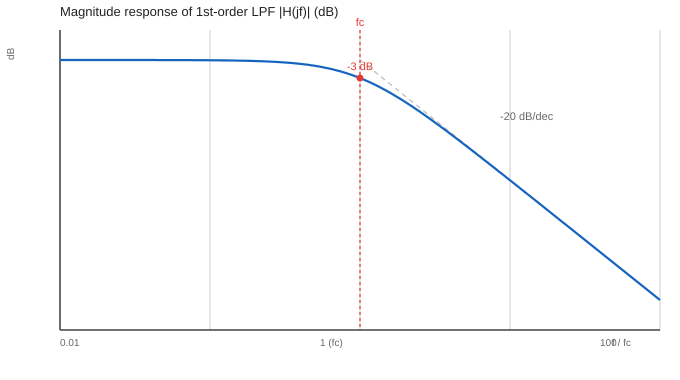
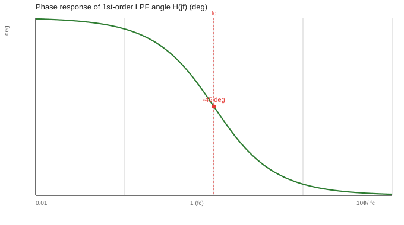

# 一阶低通滤波器与波特图（Bode Plot）分析

> 通用科普：先把"一阶低通"这件事讲清楚，再用两张波特图把频率响应看明白。
> 本文是 [一阶互补滤波分析](00_一阶互补滤波分析.md) 的"前置数学"——互补滤波里那个对加速度计做低通的分支，本质就是下面这个东西。
> 它也是 AHRS 里给加计"降噪"最常用的手段（见 [P5 姿态解算·Mahony](../04_拆解PSINS篇/P系列与总览/P5_姿态解算_拆解Mahony.md) 的准静态门控）。

---

## 1. 它是什么、解决什么问题

低通滤波器（Low-Pass Filter, LPF）只让**低频信号**通过、把**高频信号**衰减掉。

现实里"高频"通常是噪声：

- 加速度计在振动环境下会叠加速度噪声（高频）→ 低通后姿态更稳；
- 但低通会引入**相位滞后 / 时延**——截止频率越低越干净，也越"迟钝"。

**一阶**是最简单的一类：只有一个储能元件（一个时间常数 $\tau$），传递函数是一条直线斜率（−20 dB/dec），没有谐振峰。工程上够用、好算、好移植，是嵌入式里的主力。

---

## 2. 传递函数

连续域标准型（截止角频率 $\omega_c=2\pi f_c$，$\tau=1/\omega_c$）：

$$H(s)=\frac{\omega_c}{s+\omega_c}=\frac{1}{1+\tau s}$$

令 $s=j\omega$（$\omega=2\pi f$），得到**频率响应** $H(j\omega)$：

$$|H(j\omega)|=\frac{1}{\sqrt{1+(\omega/\omega_c)^2}}=\frac{1}{\sqrt{1+(f/f_c)^2}}$$

$$\angle H(j\omega)=-\arctan\!\Big(\frac{\omega}{\omega_c}\Big)=-\arctan\!\Big(\frac{f}{f_c}\Big)$$

记归一化频率 $x=f/f_c$（相对截止频率的倍数），则幅值只取决于 $x$，与具体截止频率无关——这正是下面两张图用 $f/f_c$ 作横轴的理由。

---

## 3. 波特图怎么读

波特图把幅值画成 **dB**（纵轴），相位画成 **度**，横轴是 **对数频率**。两张图已按 $f/f_c \in[0.01,100]$ 画好：

### 3.1 幅频：三条关键事实

- **低于截止频率**（$f\ll f_c$，$x\ll1$）：$|H|\approx1$，即 **0 dB**——信号几乎无损通过；
- **高于截止频率**（$f\gg f_c$，$x\gg1$）：幅值按 $1/x$ 衰减，即 **−20 dB/dec**（每十倍频程降 20 dB），图中灰色虚线就是这条渐近线；
- **正好在截止频率**（$f=f_c$，$x=1$）：幅值降到 $1/\sqrt2\approx0.707$，即 **−3.01 dB**——这就是"截止频率"的定义（半功率点）。

> 直觉：−20 dB/dec 意味着频率高 10 倍、幅度只剩约 1/10（10× 在幅度上是 20 dB；反过来 −20 dB 就是 1/10）。

### 3.2 相频：滞后的来源

- 低频时相位 ≈ 0°（不滞后）；
- **截止频率处相位 = −45°**；
- 高频时趋于 **−90°**（信号被"推后"了四分之一周期）。

这个相位滞后就是低通的代价：你看到的姿态比真实姿态"慢半拍"。互补滤波之所以把加计低通、陀螺高通**相加**，就是为了用陀螺的高频响应去补回加计被低通吃掉的那部分动态。

---

## 4. 时域一句话

阶跃输入 $u(t)=1\;(t\ge0)$ 的输出：

$$y(t)=1-e^{-t/\tau}$$

即按时间常数 $\tau=1/\omega_c$ 指数趋近——**约 $3\tau\sim5\tau$ 收敛**。截止频率越低，$\tau$ 越大，收敛越慢（时延越大）。这和频域"截止越低越迟钝"是同一件事的两面。

---

## 5. 落到 AHRS 上怎么选

| 想要 | 代价 | 怎么取 |
|------|------|--------|
| 加计更干净（振动抑制好） | 姿态滞后大、动态差 | 截止频率调低（如 10~30 Hz） |
| 姿态跟手（动态好） | 噪声没滤干净 | 截止频率调高（如 50~100 Hz） |
| 折中 | — | 常用 30~50 Hz，再靠陀螺高通补动态 |

本库 M-A 的 Mahony 没直接对加计做低通，而是用**准静态门控**（机动时关掉加计修正、交给陀螺硬扛）——思路异曲同工：都是"别让高频运动加速度污染姿态"。区别是门控按**比力模长**判据、低通按**频率**判据，各有盲区（详见 P5 第 6.2 节）。

---

## 6. 小结

- 一阶低通 $H(s)=\omega_c/(s+\omega_c)$，只有 1 个参数 $\tau$；
- 波特图三件套：**0 dB 平台 / −20 dB/dec / 截止处 −3 dB**；相位 **0°→−90°，截止处 −45°**；
- 取舍永远是"干净 vs 跟手"，截止频率定一切；
- 它是互补滤波、Mahony 门控的共同数学祖先。

下一篇可回看 [一阶互补滤波分析](00_一阶互补滤波分析.md)（把这里的低通和陀螺高通拼成一个姿态估计器）。
