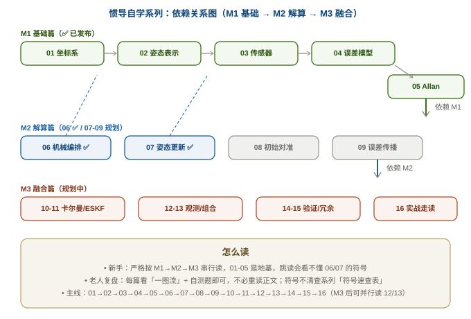

# 惯性导航与惯导解算 · 自学科普系列

> 系列目标：**自学 + 科普**惯导解算，从数学物理地基一直讲到姿态/位置/速度解算与组合导航。
> 一路用到的**数学、物理、控制等基础知识**，都会单独成内链笔记，并附上**外链 Wiki（维基百科）**，方便随时回去补课。

## 先串一个整体认知

惯导（INS / 惯性导航系统）靠的是"**牛顿定律 + 死推**"：陀螺仪量**角速度**、加速度计量**比力**，然后通过**积分**滚动出姿态 → 速度 → 位置。不用外部信号，全靠自己推，所以叫"惯性/自主导航"。它的难点不在"公式有多唬人"，而在每一步都要弄清：

- **在哪个坐标系里算**（坐标系乱，公式全错）；
- **姿态怎么表示**（欧拉角有万向锁，四元数 / 旋转矩阵更稳）；
- **误差从哪来、怎么涨**（偏差 / 随机游走，越积越漂）；
- **怎么用传感器模型和概率**把误差"修"回来（卡尔曼 / ESKF）。

## 符号与术语速查表（跨篇统一，随时回来查）

> 所有篇目共用这套符号（以本项目固件为准）。**记不住时先来这里**，比翻回各篇快。

| 符号 | 含义 | 首次出现 |
|---|---|---|
| **NED / ENU** | 当地水平系两种约定（北东地 / 东北天）；本项目用 **NED** | [01](01_基础篇/01_坐标系与变换.md) |
| **body 系（b 系）** | 载体坐标系，x-前 y-右 z-下；IMU 直接测的就是 b 系量 | [01](01_基础篇/01_坐标系与变换.md) |
| $R_{ab}$ / $\boldsymbol C_b^n$ | 旋转矩阵：把 b 系向量投影到 a 系；$C_b^n$ = body→NED。⚠️ 固件 `q2r` 给的是**反方向** $C_n^b$（world→body），转比力要转置 | [01](01_基础篇/01_坐标系与变换.md) / [06](02_解算篇/06_机械编排方程.md) |
| $\boldsymbol q = [w,x,y,z]$ | 四元数（Hamilton、标量在首）；姿态内部存储形式 | [02](01_基础篇/02_姿态的四种表示.md) |
| $q_b^i$（**下标=动系 b、上标=参考系 i**） | 姿态四元数："b 相对 i"，等价 Solà 的 `q_bi`（摆位不同）。别把上下标看反 | [07](02_解算篇/07_姿态更新算法.md) |
| $\boldsymbol\omega_{ib}^b$ | 陀螺测量的角速度：b 系相对 i 系、在 b 系投影（IMU 直接输出） | [07](02_解算篇/07_姿态更新算法.md) |
| $\boldsymbol f^b$ / $\boldsymbol v^n$ / $\boldsymbol p$ | 比力（b 系）/ 速度（n 系投影）/ 位置 | [03](01_基础篇/03_传感器原理.md) / [06](02_解算篇/06_机械编排方程.md) |
| $\boldsymbol f = \boldsymbol a - \boldsymbol g$ | 比力方程：加计测比力、不是加速度；机械编排要加回重力 | [03](01_基础篇/03_传感器原理.md) |
| $\boldsymbol b_g$ / $\boldsymbol b_a$（`bg`/`ba`） | 陀螺 / 加计零偏（ESKF 的 15 态里各 3 维，实时估计） | [04](01_基础篇/04_IMU误差模型.md) |
| ARW / BI / RRW / RR / QN | Allan 五种噪声指纹（°/√h、°/h、°/h^1.5、°/h²、arcsec） | [05](01_基础篇/05_Allan方差.md) |
| 有害加速度 | 重力 + 哥氏项（不是载体真实运动，速度更新必须补偿） | [06](02_解算篇/06_机械编排方程.md) |
| 不可交换误差（coning） | 旋转不可交换导致的积分漂移；Bortz 旋转向量 / cnscl 补偿 | [07](02_解算篇/07_姿态更新算法.md) |

## 本系列文章清单（从基础到融合，3 个 Tier / 16 篇）

> 写作顺序按 M1→M5 正序打地基；每篇**自包含 + 通俗为主 + 数学推导折叠**，并锚定本项目真实代码（`ins_eskf_15d.c` / `ins_math.h`）。✅ = 已发布。

### Tier 1 · 惯导基础知识（是什么 / 为什么）→ 📁 [01_基础篇/](01_基础篇/)
| 篇 | 主题 | 状态 |
|---|---|---|
| [01 坐标系与变换](01_基础篇/01_坐标系与变换.md) | ECEF / 当地水平(ENU·NED) / body，变换与旋转矩阵 | ✅ 已发布 |
| [02 姿态的四种表示](01_基础篇/02_姿态的四种表示.md) | 欧拉角 / DCM / 四元数 / 旋转向量，万向锁，双覆盖，Bortz | ✅ 已发布（含 PSINS 演示①-④） |
| [03 传感器原理](01_基础篇/03_传感器原理.md) | 加速度计测"比力"、陀螺测角速度（科里奥利）；MEMS vs FOG vs RLG | ✅ 已发布（含 PSINS 演示·imuerrset） |
| [04 IMU 误差模型](01_基础篇/04_IMU误差模型.md) | 零偏 / 标度 / 交叉耦合 / g 灵敏度 / 温度漂移，怎么标定、怎么进 ESKF | ✅ 已发布（含 PSINS 演示·imuadderr） |
| [05 Allan 方差](01_基础篇/05_Allan方差.md) | 5 种噪声指纹（QN/ARW/BI/RRW/RR），log-log 曲线怎么读、怎么定 ESKF 的 Q 阵 | ✅ 已发布（含 PSINS 演示·avarsimu+avar、双轨出图） |

### Tier 2 · 惯导解算 + 滤波修正（怎么算/怎么修正）→ 📁 [02_解算篇/](02_解算篇/)
| 篇 | 主题 | 状态 |
|---|---|---|
| [06 机械编排方程](02_解算篇/06_机械编排方程.md) | 比力 → 姿态 / 速度 / 位置 的递推（n 系速度微分方程，锚定牛小骥 I2NAV 讲义式 18） | ✅ 已发布（含 PSINS 演示·insupdate） |
| [07 姿态更新算法](02_解算篇/07_姿态更新算法.md) | 欧拉法 / DCM / 四元数 / Bortz 旋转向量，圆锥效应与不可交换误差（牛小骥 I2NAV 讲义式 134-135 + 6 方法实测对比） | ✅ 已发布（含 PSINS 演示·cnscl+qupdt、双轨出图） |
| [08 初始对准](02_解算篇/08_初始对准.md) | 静基座粗对准（TRIAD：重力定水平 + 地球自转定航向）→ 精对准（零速 KF）→ 动基座（i0 法） | ✅ 已发布（含 PSINS 演示·alignsb/dv2atti/alignvn） |
| [09 纯惯导误差传播](02_解算篇/09_纯惯导误差传播.md) | 失准角增长 / 舒勒振荡(84.4min) / 高程指数发散 / 与 ESKF F 矩阵对应 | ✅ 已发布（M2 收官篇，锚定牛小骥讲义第 3 讲） |

### Tier 3 · 多源数据融合（怎么更准）
| 篇 | 主题 | 状态 |
|---|---|---|
| [10 卡尔曼滤波基础](02_解算篇/10_卡尔曼滤波基础.md) | KF 五方程（预测+修正）/ 协方差椭圆 / 一维手算 + 双轨验证 / 与本项目 ESKF 15 态对应（锚定牛小骥讲义第 4 讲式 1-8、PSINS kfupdate） | ✅ 已发布（M3 组合导航篇开篇） |
| 11 EKF 与 ESKF | 线性化缺陷 → 误差状态 KF（本项目 15 维本体） | 规划中 |
| 12 观测模型 | GNSS / 磁力计 / 气压计 / 视觉 | 规划中 |
| 13 松组合 vs 紧组合 | 两种组合架构的取舍 | 规划中 |
| 14 一致性检验 NEES/NIS（χ²） | 验证框架的核心闸门 | 规划中 |
| 15 多传感器冗余 + FDI | 故障检测隔离，对应本板 3×IMU | 规划中 |
| 16 实战：走读 ins_eskf_15d.c | 把前面所有概念落进真实代码 | 规划中 |

## 学习路线图

> 打个勾就是"已过关"。每一节跳转对应内链笔记，**⭐** 表示该节依赖的基础知识已在外链中给出直达。

### 第 0 步 · 概览（先建立直觉）
- [ ] 什么是惯导？比力、速度增量、姿态为什么能自报位置（读本页上文）
- ⭐ 外链：[惯性导航系统 — 维基百科](https://zh.wikipedia.org/wiki/惯性导航系统)

### 第 1 步 · 数学地基（本系列补课重点）
- [ ] [数学地基：矩阵、概率与协方差](数学基础.md)（含「身高-体重」真实 Python 演示）
- [ ] [协方差交互实验：拖点看正/负/零与单位影响](协方差交互实验.md)
- [ ] 泰勒展开与一阶导数（规划中） ⭐ 外链：[维基 · 泰勒公式](https://zh.wikipedia.org/wiki/泰勒公式)
- [x] [欧拉角 / 万向锁 / 四元数 / 旋转向量](01_基础篇/02_姿态的四种表示.md)（已发布） ⭐ 外链：[维基 · 欧拉角](https://zh.wikipedia.org/wiki/欧拉角)
- [ ] 四元数与旋转矩阵（规划中） ⭐ 外链：[维基 · 四元数与空间旋转](https://zh.wikipedia.org/wiki/四元数与空间旋转)
- [ ] 李群 / 李代数 SO(3)（规划中） ⭐ 外链：[维基 · 旋转矩阵](https://zh.wikipedia.org/wiki/旋转矩阵)

### 第 2 步 · 物理与传感器模型
- [x] [陀螺仪模型 · 科里奥利 / 萨格纳克 / 零偏与随机游走](01_基础篇/03_传感器原理.md)（已发布） ⭐ 外链：[维基 · 陀螺仪](https://zh.wikipedia.org/wiki/陀螺仪)
- [x] [加速度计模型 · 比力与重力](01_基础篇/03_传感器原理.md)（已发布） ⭐ 外链：[维基 · 加速度计](https://zh.wikipedia.org/wiki/加速度计)
- [x] [IMU 误差模型 · 零偏/标度/交叉耦合/g灵敏度/温漂](01_基础篇/04_IMU误差模型.md)（已发布） ⭐ 外链：[维基 · 艾伦方差](https://zh.wikipedia.org/wiki/艾伦方差)
- [x] [Allan 方差 · 5 种噪声指纹与 Q 阵定标](01_基础篇/05_Allan方差.md)（已发布，**含 MATLAB+Python 双轨出图**） ⭐ 外链：[维基 · 艾伦方差](https://zh.wikipedia.org/wiki/艾伦方差)
- [x] [导航坐标系：NED / ENU / ECEF](01_基础篇/01_坐标系与变换.md)（已发布） ⭐ 外链：[维基 · 大地坐标系](https://zh.wikipedia.org/wiki/地理坐标系)

### 第 3 步 · 姿态解算（旋转矢量的算法）
- [ ] 互补滤波（规划中）
- [ ] 梯度下降法（Madgwick）（规划中）
- [ ] 卡尔曼滤波与 ESKF（规划中） ⭐ 外链：[维基 · 卡尔曼滤波](https://zh.wikipedia.org/wiki/卡尔曼滤波)

### 第 4 步 · 惯导解算全流程
- [x] [机械编排 · 姿态 → 速度 → 位置 的积分递推](02_解算篇/06_机械编排方程.md)（已发布，锚定牛小骥 I2NAV 讲义式 18）
- [x] [姿态更新 · 欧拉/DCM/四元数/Bortz + 圆锥与划桨](02_解算篇/07_姿态更新算法.md)（已发布，6 种方法实测对比 + 牛小骥式 134-135）

### 第 5 步 · 组合导航
- [ ] GNSS / INS 松耦合与紧耦合（规划中）
- [ ] 因子图 / 预积分（规划中）

## 基础知识外链速查（随时回补）

| 话题 | 外链 Wiki |
| --- | --- |
| 协方差矩阵 | [维基 · 协方差矩阵](https://zh.wikipedia.org/wiki/协方差矩阵) |
| 卡尔曼滤波 | [维基 · 卡尔曼滤波](https://zh.wikipedia.org/wiki/卡尔曼滤波) |
| 四元数 | [维基 · 四元数与空间旋转](https://zh.wikipedia.org/wiki/四元数与空间旋转) |
| 欧拉角 | [维基 · 欧拉角](https://zh.wikipedia.org/wiki/欧拉角) |
| 惯性导航 | [维基 · 惯性导航系统](https://zh.wikipedia.org/wiki/惯性导航系统) |
| 陀螺仪 | [维基 · 陀螺仪](https://zh.wikipedia.org/wiki/陀螺仪) |
| 加速度计 | [维基 · 加速度计](https://zh.wikipedia.org/wiki/加速度计) |

## PSINS 演示约定与致谢

从 **02 姿态的四种表示** 起，本系列引入「**PSINS 演示**」三件套（① PSINS 参考代码带署名 → ② C 语言实现对照 → ③ 结论），用严龚敏老师的 **PSINS**（西北工业大学，开源惯性导航工具箱；本地 `D:\WorkSpace\Code\MATLAB\psins260705`，作者主页可获取最新版）作算法参考与可视化演示。约定如下：

- **用途定位**：PSINS 仅作**算法参考、验证 oracle 与教学演示**；其 MATLAB 代码**不逐字搬入本项目固件**（商用侧尤须规避整段复制，学算法、自己重写实现、致谢来源）。
- **引用与版权**：节选代码保留 `Copyright Gongmin Yan, NWPU` 署名，并在代码首行注释标注来源文件与版本（如 `% PSINS: base0/rv2q.m — Gongmin Yan, NWPU (psins260705)`）；文末统一致谢。
- **图的可复现性**：能出图的 demo 以 **MATLAB headless 出图为主**，同时用 **Python/NumPy 重写核心数学作兜底**（存 `assets/gen_*.py`）——既让 wiki 不绑定 MATLAB 许可证，又让 Python↔PSINS 数值一致本身成为一重验证 oracle。
- **范式提醒**：PSINS 标准 SINS 用 φ 角误差模型、其 AHRS 用直接全态四元数 EKF；本项目固件用 Solà 右不变 ESKF（误差态 15 维）。两者小误差下等价但 F/H/状态定义不同，**只作对照、禁止直接照搬**。
- **坐标系提醒（ENU vs NED）**：PSINS 用 **ENU**（x 东、y 北、z 天），本项目固件用 **NED**（x 北、y 东、z 地）。**纯代数函数可逐字对照**（`rv2q`/`qmul`/`q2mat` 与坐标系无关，只需方向语义一致）；**与轴向/符号相关的函数必须标差异**（如 `q2att` vs `quat_to_euler`：输出顺序与 pitch 符号都不同，公式不可互换）。凡涉及姿态角、重力、磁场方向的面板都要先声明坐标系再对照。

## 关联

- **同一项目落地**：[工作与项目 · AHRS 板固件仿真与验证](../工作与项目/AHRS板固件仿真与验证/)（ESKF 已验证到 MATLAB / PC 端 SIL）
- **博客文章**：「惯导解算学习」「卡尔曼滤波」「因子图应用于导航」「IMU 预积分」「组合导航学习」「航姿解算从器件到算法」

---
相关：[← 总索引](../00-索引.md)