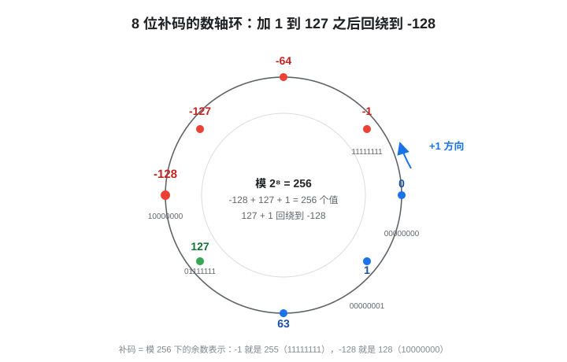

# 01 二进制与编码：原码、反码、补码

> C 语言系列·基础篇第一篇。从「计算机为什么只认 0 和 1」讲起，把有符号整数的三种编码方式——原码、反码、补码——彻底讲透，并落到 C 语言的位运算与溢出行为上。
> 全文用 8 位二进制做例子，理解后 16/32/64 位只是把数字放大，规则完全一样。

## 这篇能带给你什么

- **原理层**：补码为什么是计算机的唯一选择——不是约定俗成，而是硬件成本决定的必然。
- **换算层**：任意负数 → 补码的手算与心算技巧，以及「为什么 -128 没有正数配对」。
- **实战层**：溢出、回绕、无符号陷阱、`x & -x` 这类补码在位运算中的经典用法。

阅读路线：赶时间直接看第 5 节（补码）+ 第 6 节（溢出）；想完整建立直觉，从第 1 节顺着读。

---

## 1. 为什么计算机只用 0 和 1

物理上，电路最容易实现的状态就是两种：高电平 / 低电平。于是所有信息——数字、文字、图片、声音——在计算机内部最终都变成一串 0 和 1，称为**二进制**。

一个 0/1 称为 1 个**比特（bit）**；8 个比特组成 1 个**字节（byte）**。一个 n 位二进制数能表示 `2^n` 种不同组合。比如：

- 8 位无符号数：`0 ~ 255`（`00000000₂ ~ 11111111₂`）
- 16 位无符号数：`0 ~ 65535`
- 32 位无符号数：`0 ~ 4294967295`

但问题来了：**负数怎么表示？** 这就是编码要解决的事。同一个二进制位模式，用不同编码解释，就是不同的数字。

## 2. 三个候选方案：原码、反码、补码

人类最早想到的、也最符合直觉的方案，是把最高位当"符号位"：`0` 表示正，`1` 表示负。围绕「符号位怎么处理」演化出了三种编码：

| 编码 | 负数规则 | 有没有 ±0 问题 | 加减法要不要判断符号 |
|---|---|---|---|
| 原码 | 符号位 + 绝对值 | 有（`00000000` 与 `10000000` 都是 0） | 要，硬件复杂 |
| 反码 | 符号位不变，其余位取反 | 有（`00000000` 与 `11111111` 都是 0） | 不用，但要处理循环进位 |
| **补码** | 反码 + 1 | **没有** | **不用，一个加法器通吃** |

下面逐一展开。

## 3. 原码：最直观，也最不好用

**定义**：最高位是符号位（0 正 1 负），其余位是绝对值。

| 十进制 | 8 位原码 |
|---|---|
| +5 | `00000101` |
| -5 | `10000101` |
| +0 | `00000000` |
| -0 | `10000000` |

两个致命缺点：

1. **有两个 0**（`+0` 和 `-0`）。比较相等、判零都要特判，很别扭。
2. **加减法必须先判断符号**。`5 + (-5)`，硬件要先看一个是正一个是负，再决定是加还是减、谁减谁、结果符号归谁——一套复杂的逻辑，还容易出错。

于是有了反码，试图让「减法变成加法」。

## 4. 反码：减法变加法，但 ±0 还在

**定义**：正数同原码；负数是「符号位不变，其余位全部取反」。

| 十进制 | 8 位反码 |
|---|---|
| +5 | `00000101` |
| -5 | `11111010` |
| +0 | `00000000` |
| -0 | `11111111` |

好处：`5 + (-5)` 可以直接当加法算：

```
  00000101   (+5)
+ 11111010   (-5)
----------
  11111111   (=-0，见上表)
```

结果碰巧就是 -0，数值上等于 0，方向对了！但 `11111111` 表示 -0，和 `00000000`（+0）是**两个不同的位模式**，判等依然要特判；而且如果出现进位，还得做一次「循环进位（end-around carry）」补回来，硬件还是要额外逻辑。

反码的方向正确，但不够干净。最终胜出的是补码。

## 5. 补码：一个加法器通吃一切

**定义**：正数同原码；负数是「反码 + 1」。

| 十进制 | 原码 | 反码 | 补码 |
|---|---|---|---|
| +5 | `00000101` | `00000101` | `00000101` |
| -5 | `10000101` | `11111010` | `11111011` |
| +0 | `00000000` | `00000000` | `00000000` |
| -0 | `10000000` | `11111111` | 不存在（被 -128 占用） |
| -128 | 无法表示 | 无法表示 | `10000000` |

三个关键性质，让补码成为唯一选择：

!!! note "性质 1：0 是唯一的"
    补码里 `00000000` 是唯一的 0。`-0` 的补码 = `11111111 + 1 = 00000000`（进位丢掉），它不存在了。

!!! note "性质 2：减法就是加法"
    `a - b` 等价于 `a + (-b)`，而 `-b` 的补码就是一个位模式。硬件**只需要一个加法器**，不需要单独的减法器，不需要判断符号。这是补码胜出的根本原因——省电路、省逻辑、快。

!!! note "性质 3：范围不对称，多出一个负数"
    8 位补码范围是 **-128 ~ 127**，而不是 ±127。因为 0 唯一了，`10000000` 空出来就表示 -128。对称的正数 +128 放不下。

**本质理解（模运算视角）**：n 位补码就是「模 `2^n` 下的余数」。比如 8 位：

- `-1` = `255`（即 `11111111`），因为 `-1 ≡ 255 (mod 256)`
- `-128` = `128`（即 `10000000`），因为 `-128 ≡ 128 (mod 256)`

整个数轴被卷成一个环，这也是下面这张图想表达的东西：



图中顺时针每走一步就是 `+1`：`127 + 1` 会越过最大值，直接回绕到 `-128`。这种「绕一圈回来」的行为，正是补码数学上的「模 2⁸ 回绕」。

### 5.1 手算与心算技巧

**套路一（取反加一）**：`-x` 的补码 = `~x + 1`。

```
例：-5
 5  = 00000101
~5  = 11111010   (按位取反)
+1  = 11111011   = -5 ✓
```

**套路二（从右往左找第一个 1）**：从最低位往左，遇到第一个 1 之前照抄，之后全部取反。

```
例：-5 = 0101 → 从右往左，第一个 1 是 bit0，bit0 照抄，bit1~bit7 取反
 0101 → 1 0 1 1 → 补全 8 位：11111011 ✓（秒出答案）
```

**快速换算表**（8 位，建议背下来）：

| 十进制 | 补码 |
|---|---|
| 127 | `01111111` |
| 1 | `00000001` |
| 0 | `00000000` |
| -1 | `11111111` |
| -2 | `11111110` |
| -128 | `10000000` |

规律：**-1 是全 1**，这在实际中非常有用（后面会看到）。

## 6. 溢出与回绕：C 里两种截然不同的行为

回到补码环：`127 + 1` 会回绕到 `-128`。在 C 里，这个「回绕」是否合法，取决于类型有没有符号：

| 类型 | 溢出行为 | C 标准态度 |
|---|---|---|
| `unsigned`（无符号） | 模 `2^n` 回绕，结果确定 | **定义好的**（是数学运算，不是错误） |
| `signed`（有符号） | 结果未定义（可能回绕、可能被优化掉） | **未定义行为（UB）**，编译器可为所欲为 |

!!! warning "经典陷阱"
    ```c
    int a = INT_MAX;      // 2147483647
    a + 1;                // 有符号溢出 = UB，结果不可依赖

    unsigned b = UINT_MAX; // 4294967295
    b + 1;                // 无符号回绕 = 0，行为确定
    ```

有符号溢出是**未定义行为**，不只是"结果不对"——现代编译器做优化时可能直接假设"这种情况永远不会发生"，导致程序行为完全不可预测。这也是嵌入式代码里**循环计数、长度计算优先用无符号类型**的原因之一。

## 7. 位运算视角：补码的实战价值

补码让一组位运算有了数学意义。几个高频用法：

| 表达式 | 含义 | 原理 |
|---|---|---|
| `x & -x` | 取出 x 最低位的 1 | `-x = ~x + 1`，低位 1 前面的位全部取反后相加进位，只有最低位 1 保留 |
| `x & (x - 1)` | 清除 x 最低位的 1 | 常用于统计二进制中 1 的个数（每次清掉一个） |
| `~x + 1` | 取相反数（等价 `-x`） | 补码定义本身 |
| `x >> k` | 除以 `2^k`（**注意**：有符号右移是算术右移，负数补符号位） | 无符号右移才是逻辑右移 |

示例——统计一个 `uint32_t` 里 1 的个数：

```c
uint32_t count_bits(uint32_t x)
{
    uint32_t n = 0;
    while (x) { x &= (x - 1); n++; }   /* 每轮清掉最低位的 1 */
    return n;
}
```

示例——判断一个数是不是 2 的幂：

```c
int is_pow2(uint32_t x) { return x && !(x & (x - 1)); }
```

这些技巧能成立，全依赖「补码 = 模运算」这一性质。理解补码，位运算就不再是死记硬背。

## 8. 小结与自测

**一句话记忆**：

- **原码**：直观，但有 ±0、加减法要判断符号。
- **反码**：减法变加法，但 ±0 还在。
- **补码**：`反码 + 1`，0 唯一、减法即加法、范围 -128~127，**硬件只要一个加法器**，所以它是计算机的最终选择。
- 无符号溢出是**回绕**（确定），有符号溢出是 **UB**（不可依赖）。

**自测题**（答案在文末折叠区）：

1. 写出 -1、-2、-64、-128 的 8 位补码。
2. 解释为什么 8 位补码能表示 -128，却不能表示 +128。
3. `127 + 1` 在 8 位补码下等于多少？在 32 位 `int` 下等于多少？
4. `x & -x` 在 `x = 12`（`00001100`）时等于多少？

<details>
<summary>点开看答案</summary>

1. `-1 = 11111111`，`-2 = 11111110`，`-64 = 11000000`，`-128 = 10000000`。
2. 0 唯一后空出的 `10000000` 表示 -128；要表示 +128 需要 9 位（`100000000`），8 位放不下。
3. 8 位补码下 `127 + 1 = -128`（回绕）；32 位 `int` 下 `127 + 1 = 128`（远未到 `INT_MAX`，正常）。
4. `12 = 1100`，最低位的 1 在第 2 位，`x & -x = 0100 = 4`。

</details>

---

下一篇：[02 C 变量类型与精度（int 为什么随平台变、float/double 有效位数）](02_C变量类型与精度.md)
