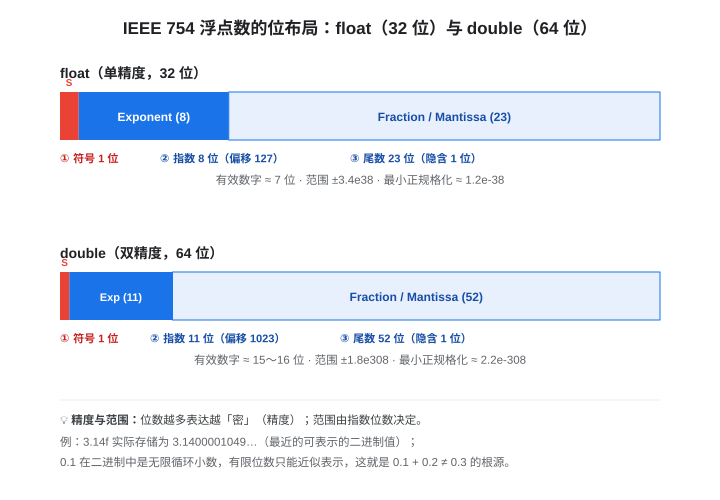

# 02 C 变量类型与精度：int 为什么随平台变，float/double 差在哪

> C 语言系列·基础篇第二篇。回答两个最常被问懵的问题：**int 到底是几个字节？** 以及 **float 和 double 的"有效位数"是什么意思？**
> 核心结论先放在这里：C 标准只保证类型**最小范围**，不保证位数——所以同一份代码在不同编译器 / 平台上，`int` 可能是 16、32 或 64 位；而浮点数的"精度"由 IEEE 754 的位数分配决定，与"范围"是两回事。

## 这篇能带给你什么

- **整型**：char/short/int/long/long long 在标准里到底承诺了什么，在主流平台上又各是几位；signed/unsigned 的范围怎么算。
- **浮点**：IEEE 754 的位布局、单双精度的有效位数与范围、`0.1 + 0.2 ≠ 0.3` 的根源。
- **可移植**：`stdint.h` 定宽类型（`uint8_t` 等）为什么是嵌入式 / 跨平台代码的正确姿势。

阅读路线：只想搞懂 float/double，直奔第 3 节；被 `int` 位数坑过，从第 2 节读起。

---

## 1. 一句话总览：C 的类型是"平台决定的"，不是"标准写死的"

很多语言（如 Java、C#）的 `int` 在任何平台都是 32 位。**C 不是这样**。C 标准（C11 §5.2.4.2.1）只规定了每种整型**必须能表示的最小范围**，具体用多少位表示，由**编译器的目标平台**决定。

> 为什么 C 要这样？因为 C 诞生时各种机器位数不同（16 位、32 位并存），C 的设计哲学是"贴近机器、高效"——类型直接映射到硬件寄存器宽度，而不是强行为所有平台统一。

这就是"`int` 与编译器有关"的全部含义：**不是 C 语言本身模糊，而是标准把选择权交给了平台。**

## 2. 整型家族：char / short / int / long / long long

### 2.1 标准承诺的最小范围（任何平台都必须满足）

| 类型 | 标准保证的最小位数 | 保证的最小范围 |
|---|---|---|
| `char` | 8 | -127 ~ 127（或 0 ~ 255） |
| `short` | ≥16 | -32767 ~ 32767 |
| `int` | ≥16 | -32767 ~ 32767 |
| `long` | ≥32 | -2147483647 ~ 2147483647 |
| `long long` | ≥64 | -9223372036854775807 ~ 9223372036854775807 |

注意：标准只给"下限"，`int` 只要 ≥16 位就合法——所以按标准，一个 16 位 `int` 的平台是合规的。

### 2.2 主流平台的实际位数（这才是你平时写代码面对的现实）

| 类型 | 32 位 MCU（ARM Cortex-M，Keil/GCC） | 32 位 x86 | 64 位 x86_64 / ARM64 |
|---|---|---|---|
| `char` | 8 | 8 | 8 |
| `short` | 16 | 16 | 16 |
| `int` | **32** | **32** | **32** |
| `long` | **32** | **32** | **64** |
| `long long` | 64 | 64 | 64 |
| `float` | 32 | 32 | 32 |
| `double` | 64 | 64 | 64 |
| `void*`（指针） | 32 | 32 | 64 |

!!! warning "最容易踩的坑：long 在 64 位平台是 64 位"
    同一份代码，在 32 位 MCU 上 `long` 是 32 位、在 64 位 Linux 上却是 64 位。**跨平台代码里不要用裸 `long` 表达"32 位整数"**——要么用 `stdint.h` 的 `int32_t`，要么明确 `long long`。Windows 例外：MSVC 上 `long` 永远是 32 位（Windows 的 LLP64 模型），这也是"int/long 到底几位"在网上争论不休的原因——**不同平台答案确实不同**。

### 2.3 有符号 / 无符号的范围怎么算

- 有符号（补码）：`-2^(n-1) ~ 2^(n-1) - 1`
- 无符号：`0 ~ 2^n - 1`

以 32 位 `int` / `unsigned int` 为例：

| 类型 | 最小值 | 最大值 |
|---|---|---|
| `int32_t` | -2147483648 | 2147483647 |
| `uint32_t` | 0 | 4294967295 |
| `int16_t` | -32768 | 32767 |
| `uint16_t` | 0 | 65535 |

背不住没关系，直接用 `limits.h` 里的宏：

```c
#include <limits.h>
printf("%d %u\n", INT_MAX, UINT_MAX);   /* 2147483647  4294967295 */
```

### 2.4 用 sizeof 实测你的平台

```c
#include <stdio.h>
int main(void)
{
    printf("char=%zu short=%zu int=%zu long=%zu long long=%zu float=%zu double=%zu ptr=%zu\n",
           sizeof(char), sizeof(short), sizeof(int),
           sizeof(long), sizeof(long long),
           sizeof(float), sizeof(double), sizeof(void*));
    return 0;
}
```

`sizeof` 的单位是**字节**，`%zu` 是 `size_t` 的正确格式符。把这行代码在 Keil、GCC、MSVC 各跑一遍，你会直观看到差异。

## 3. 浮点家族：float / double / long double

### 3.1 浮点数的本质：符号 + 指数 + 尾数

整数是"精确的离散值"，浮点数是"对实数的有限近似"。绝大多数平台遵循 **IEEE 754** 标准，把位数分成三段：



| 类型 | 总位数 | 符号 | 指数 | 尾数 | 有效数字 | 范围（绝对值） |
|---|---|---|---|---|---|---|
| `float` | 32 | 1 | 8 | 23 | ≈ **7 位** | ≈ 1.2e-38 ~ 3.4e38 |
| `double` | 64 | 1 | 11 | 52 | ≈ **15~16 位** | ≈ 2.2e-308 ~ 1.8e308 |
| `long double` | 平台相关（x86 常为 80 位扩展） | — | — | — | ≈ 18~19 位 | 更大 |

### 3.2 有效位数 ≠ 范围：这是最常被混淆的一点

- **范围**由指数位数决定：指数越多，能表达的"数量级"越大（float 到 1e38，double 到 1e308）。
- **有效位数**由尾数位数决定：尾数越多，相邻两个可表示值之间"越密"，精度越高。

`3.14f` 打印出来是 `3.1400001049...`，因为 3.14 不是任何 23 位尾数能精确表示的值，float 存的是**离它最近的那个可表示值**。`3.14`（double）的尾数是 52 位，近似得更准，但也仍然不是精确的 3.14。

### 3.3 经典坑：0.1 + 0.2 ≠ 0.3

`0.1` 在二进制里是**无限循环小数**（就像 1/3 在十进制里是 0.333…），任何有限位数的浮点都只能近似。所以：

```c
float  a = 0.1f, b = 0.2f;
printf("%.17f\n", a + b);   /* 0.30000001192092896，不是 0.3 */

double c = 0.1, d = 0.2;
printf("%.17f\n", c + d);   /* 0.30000000000000004，也不是 0.3，只是更接近 */
```

!!! tip "浮点比较的正解"
    永远不要直接写 `if (x == y)` 比较浮点结果，要比较**差的绝对值是否小于某个容差**：

    ```c
    #include <math.h>
    if (fabsf(x - y) < 1e-6f) { ... }   /* float 用 fabsf、阈值按实际精度选 */
    ```

    需要**逐位精确**的场景（金额、校验、跨平台协议），用定点数（整数 + 固定缩放）或十进制类型，不要用二进制浮点。

### 3.4 什么时候该用 double？

嵌入式里常用 float 省内存、省计算（Cortex-M4/M7 带硬件 FPU，float 运算和 double 速度差很多）。但有两类情况强烈建议 double：

1. **累加 / 积分类计算**：误差会随步数累积，float 的 7 位有效数字很快就漏完（卡尔曼滤波的协方差矩阵就是典型——更新几十万步后，float 的舍入会主导结果）。
2. **对精度敏感的比较 / 判断**：如门限判断、数值稳定性分析。

原则：**先想清楚精度需求，再选类型**。不懂取舍时，桌面 / PC 场景直接用 double；MCU 场景先算清楚误差预算再决定是否压缩成 float。

## 4. 定宽类型 stdint.h：跨平台代码的正解

`<stdint.h>` 提供**位数固定**的类型，无论什么平台都一样：

| 类型 | 位数 | 典型用途 |
|---|---|---|
| `uint8_t` / `int8_t` | 8 | 传感器原始字节、协议字段 |
| `uint16_t` / `int16_t` | 16 | ADC 原始值、寄存器 |
| `uint32_t` / `int32_t` | 32 | 时间戳、坐标、寄存器地址 |
| `uint64_t` / `int64_t` | 64 | 大数、高精度计数 |

嵌入式 / 通信协议场景**几乎强制要求**：报文结构体、寄存器映射、DMA 缓冲，都该用定宽类型，否则换个编译器布局就变了。

打印定宽类型要用 `<inttypes.h>` 的格式宏（避免 `%d` 和 `uint32_t` 在部分平台不匹配）：

```c
#include <stdint.h>
#include <inttypes.h>
uint32_t val = 42;
printf("%" PRIu32 "\n", val);   /* 而不是裸 %d */
```

## 5. 隐式转换与整型提升：安静的错误源

两个常见坑：

**坑一：小整型被提升成 int**

```c
char a = 200, b = 100;          /* 若 char 有符号，200 存进去已经回绕 */
int c = a + b;                  /* a、b 先提升为 int 再相加，结果 300 ✓ */
```

**坑二：有符号与无符号混算，结果看无符号**

```c
int a = -1;
unsigned int b = 1;
if (a < b) printf("yes");       /* 打印 "no"！-1 被转成无符号 4294967295 */
```

`a` 先被隐式转成 `unsigned`（-1 → 4294967295），再和 1 比较。**混用有符号/无符号时，行为由无符号一方主导**——这是 C 里最隐蔽的错误来源之一。规范做法：比较双方显式同类型，或避免混用。

## 6. 实践清单

- **跨平台 / 协议 / 寄存器**：一律 `stdint.h` 定宽类型，配 `<inttypes.h>` 格式宏。
- **明确符号**：循环计数、长度用 `unsigned`（回绕确定）；需要负数语义才用 `signed`。
- **别用裸 `long` 表示固定位数**：它在 64 位 Linux 是 64 位、在 MCU 和 MSVC 是 32 位。
- **浮点不判等**：用容差比较；`fabsf` / `fabs` 对应 float / double。
- **float 还是 double**：先算精度预算；累加 / 积分类计算优先 double。
- **`sizeof` + `limits.h` + `float.h`**：不确定就实测，`FLT_DIG` / `DBL_DIG` 直接给出有效位数。

---

上一篇：[01 二进制与编码：原码、反码、补码](01_二进制与编码_原码反码补码.md)

系列规划：03 指针与数组 · 04 内存模型（static/volatile/const）· 05 结构体与内存对齐 · 06 编译与链接 · 07 数值计算的陷阱（累积误差 / Kahan）· 08 未定义行为
