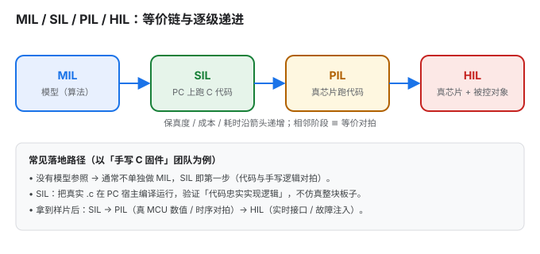
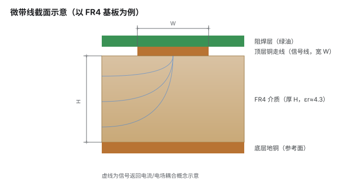

# SVG 入门：读图与制作

> 一篇把 SVG 讲透的长文，也是本站「SVG 动手区」的第一篇：先建立「它是什么、为什么好用」的直觉；再学会拿到任何一张陌生 SVG 时，按固定四步读懂它；最后手把手带你写出能复用的图。
> 全文以「手写代码」为主线——不依赖任何图形软件也能产出专业图表，这也是把它沉淀成一项可迁移技能的目标。
>
> 本文由原《SVG 从认识到制作》（语法字典）与《拿到一张 SVG 先读四件事》（读图四步）合并而来：**读图在前、语法在后**——先学会看，再学会写。

## 这篇能带给你什么

- **认识层**：矢量图与位图的本质区别、SVG 的坐标系与 `viewBox`、基本图形与路径、样式与颜色、变换与复用、嵌入与动画、可访问性。
- **读图层**：拿到一张陌生 SVG 不慌——按「看画布 → 看骨架 → 找锚点 → 无害试改」四步，几分钟内摸清结构。这是动手改图的前提，也是动手区后续各页（六种常见手术、AI 改造实战、排错清单）的公共基础。
- **制作层**：一套可落地的画图工作流、一组可复制的图元模板，以及三个来自真实工程场景的范例（流程图 / 截面图 / 架构图），源码都随文给出，可直接改。
- **避坑层**：把常见的 7 类错误（含「把项目状态写死进图里」这种反例）集中列出，省去你踩坑的时间。

阅读路线：**拿到现成图想改**，先读第 3 节「先读四件事」；只想快速上手画新图，直奔第 13 节「制作实战」；想打牢基础，从第 1 节顺着读。

---

## 1. 认识 SVG：它到底是什么

### 1.1 矢量图 vs 位图

| 维度 | 位图（PNG / JPG） | 矢量图（SVG） |
|---|---|---|
| 存储内容 | 像素网格（每个点什么颜色） | 几何指令（画一个圆、连一条线…） |
| 放大 | 放大出现锯齿 / 模糊 | 任意放大都清晰 |
| 文件体积 | 复杂照片小、简单图形反而大 | 简单图形极小、照片不合适 |
| 可编辑性 | 只能改像素 | 可改坐标、颜色、用 CSS/JS 操控 |
| 典型用途 | 照片、截图、纹理 | 图标、示意图、流程图、图表、动画 |

一句话：**照片用位图，图形用矢量。** 凡是「由线条、色块、文字构成的图」，SVG 几乎都是更优解。

### 1.2 SVG 的本质：带坐标的 XML

SVG（Scalable Vector Graphics）就是一个**文本文件**，里面是一串带坐标的 XML 标签。这意味着：

- 用记事本就能改；用版本管理（git）能 diff；能用程序批量生成。
- 浏览器原生支持，SEO 友好（文字可被搜索、被屏幕阅读器读取）。
- 内部元素可被 CSS 样式化、被 JavaScript 增删改——这是它和「静态图片」最本质的区别。

它与 HTML 同属 XML 家族：HTML 里能直接内联 `<svg>`，SVG 里也能嵌 `<foreignObject>` 包 HTML。

### 1.3 一个最小 SVG 拆解

下面这个圆，就是最朴素的 SVG（直接渲染在页面里）：

<svg xmlns="http://www.w3.org/2000/svg" viewBox="0 0 120 80" width="180">
  <circle cx="60" cy="40" r="30" fill="#1a73e8"/>
</svg>

它的源码：

```svg
<svg xmlns="http://www.w3.org/2000/svg" viewBox="0 0 120 80">
  <circle cx="60" cy="40" r="30" fill="#1a73e8"/>
</svg>
```

逐属性解释：

- `xmlns`：命名空间，告诉解析器「这是 SVG 而非别的 XML」。内联进 HTML 时可省略，独立 `.svg` 文件必须有。
- `viewBox="0 0 120 80"`：内部坐标系为宽 120、高 80（详见第 2.3 节）。
- `<circle>`：画圆，`cx/cy` 是圆心，`r` 是半径，`fill` 是填充色。

---

## 2. 坐标系与视口（最易踩坑，先玩再看）

画 SVG、读 SVG 都绕不开坐标系。这一节先用一个能拖的玩具建立体感，再讲清规则。

### 2.1 先玩一下：拖动滑块改坐标

读图与画图之前，先拖动下面两个滑块，蓝色方块会实时移动——**你改的不是「方块往哪走」，而是它的 `x` / `y` 坐标值**：

<div class='play-wrap'>

<style>
#play-svg{background:#fafafa;border:1px solid #dadce0;border-radius:8px}
#play-box{fill:#e8f0fe;stroke:#1a73e8;stroke-width:2}
.play-row{font:14px sans-serif;color:#202124;margin:6px 0}
.play-row input{vertical-align:middle}
#play-hint{font:13px sans-serif;color:#1a73e8;margin-top:4px}
@media (prefers-color-scheme: dark){
  #play-svg{background:#1e2024;border-color:#3c4043}
  #play-box{fill:#1b3a5c;stroke:#4a9eff}
  .play-row{color:#e8eaed}
  #play-hint{color:#8ab4f8}
}
</style>

<svg id='play-svg' viewBox='0 0 400 240' style='max-width:420px;width:100%;height:auto'>
  <defs>
    <pattern id='pgrid' width='20' height='20' patternUnits='userSpaceOnUse'>
      <path d='M20 0 L0 0 0 20' fill='none' stroke='#e8eaed' stroke-width='1'/>
    </pattern>
  </defs>
  <rect width='400' height='240' fill='url(#pgrid)'/>
  <rect id='play-box' x='120' y='90' width='80' height='60' rx='8'/>
</svg>

<div class='play-row'>X（左右）：<input type='range' id='play-x' min='0' max='320' value='120'> <span id='play-xv'></span></div>
<div class='play-row'>Y（上下）：<input type='range' id='play-y' min='0' max='180' value='90'> <span id='play-yv'></span></div>
<p id='play-hint'></p>

<script>
  var box=document.getElementById('play-box');
  var gx=document.getElementById('play-x'), gy=document.getElementById('play-y');
  var xv=document.getElementById('play-xv'), yv=document.getElementById('play-yv');
  var hint=document.getElementById('play-hint');
  function upd(){
    var x=+gx.value, y=+gy.value;
    box.setAttribute('x',x); box.setAttribute('y',y);
    xv.textContent='x='+x+' → 横向 '+Math.round(x/400*100)+'%';
    yv.textContent='y='+y+' → 纵向 '+Math.round(y/240*100)+'%';
    hint.textContent='把 Y 调大，方块往下走 —— 这就是 SVG 的 y 轴朝下';
  }
  gx.addEventListener('input',upd); gy.addEventListener('input',upd); upd();
</script>

</div>

最关键的体感：**方块的坐标被写死在 SVG 里，网格不会因为它移动而跟着动**——坐标系是固定的，变的只是元素的坐标值。记住这个玩具，后面读图（第 3 节）、改图就都有了锚点。

### 2.2 y 轴向下

SVG 的坐标系和数学课学的相反：**原点在左上角，x 向右增大，y 向下增大**。

```
(0,0) ─── x 增大 ──▶
  │
  │  y 增大（往下）
  │
  ▼
```

一开始画「向上的箭头」「对称的图」时，最容易被这个反向 y 轴坑到。记住：屏幕坐标里「上」是更小的 y；**想把元素往下移 → y 加；往上移 → y 减**。这一条大约能解释新手一半的「怎么改反了」。

### 2.3 viewBox 是什么（最重要的概念）

`viewBox="minX minY width height"` 定义**内部坐标系的可见范围**，和最终显示尺寸（`width`/`height`）是**解耦**的。

看同一个内容，放在不同尺寸的容器里：

<svg xmlns="http://www.w3.org/2000/svg" viewBox="0 0 100 60" width="100" height="60"><rect x="10" y="10" width="80" height="40" rx="6" fill="#e8f0fe" stroke="#1a73e8"/></svg>
<svg xmlns="http://www.w3.org/2000/svg" viewBox="0 0 100 60" width="200" height="120"><rect x="10" y="10" width="80" height="40" rx="6" fill="#e8f0fe" stroke="#1a73e8"/></svg>

两个框的源码**完全相同**，只是外层 `width/height` 不同——内容自动缩放适配。这正是 SVG「可缩放」的来源：你只管在 `viewBox` 坐标系里画图，缩放交给渲染器。

对照记忆：

- `viewBox` 决定**内部坐标系**（元素的坐标按它算）。
- `width`/`height` 决定**显示尺寸**（渲染出来多大）。
- 两者不必相等：`viewBox="0 0 920 720"` 而 `width="460"`，图形整体缩放到一半显示，但内部坐标一律不变。

**实战建议**：画图时先定一个宽松的 `viewBox`（比如 `0 0 680 400`），内部随意摆放；最后再决定它在页面上显示多大。不要让 `viewBox` 卡得太紧，否则内容容易被裁掉。

### 2.4 preserveAspectRatio

当 `viewBox` 的宽高比和容器不一致时，`preserveAspectRatio` 决定「怎么对齐、怎么缩放」：

- `xMidYMid meet`（默认）：等比缩放、居中、完整显示（可能留白）。
- `xMidYMid slice`：等比缩放、填满、裁掉溢出部分。
- `none`：**不等比拉伸**铺满——慎用，图形会被拉变形。

绝大多数情况用默认即可；只有当你明确想「拉伸填满」时才用 `none`。

---

## 3. 拿到一张 SVG，先读四件事 {: #read-4-steps }

改 SVG 之所以让人发怵，很少是因为语法难，而是因为**打开一个几百行的文件，不知道哪一行对应图上的哪个东西**。

这一节给出一套固定的读图顺序。按这个顺序走四步，任何一张 SVG 都能在几分钟内摸清结构，然后才有资格谈「改」。坐标系与 `viewBox` 的精讲在第 2 节，这里用到时直接引用，不重复展开。

### 3.1 四件事总览

| 顺序 | 做什么 | 回答什么问题 | 产出 |
|---|---|---|---|
| ① | 看画布 | 这张图多大？原点在哪？坐标往哪长？ | 一张坐标心智地图 |
| ② | 看骨架 | 图分成哪几块？每块从哪行到哪行？ | 行号区间表 |
| ③ | 找锚点 | 我关心的元素在画布的哪个位置？ | 具体行号 + 坐标 |
| ④ | 无害试改 | 我的理解对不对？ | 一次验证 |

### 3.2 ① 看画布：建立坐标系直觉 {: #step1-canvas }

打开 SVG，**第一行 `<svg>` 标签**就决定了整张图的空间规则：

```svg
<svg xmlns="http://www.w3.org/2000/svg"
     viewBox="0 0 920 720"
     width="920" height="720">
```

关于坐标系的完整解释见第 2.2–2.4 节，这里只快速回顾三条，然后直接进入「心智地图」：

- `viewBox="min-x min-y width height"` → `0 0 920 720` 意为可见区域左上角是 `(0, 0)`、宽 920、高 720。**所有子元素的坐标都在这个坐标系里解释**，与最终显示多大无关。
- **y 轴朝下**：y 越大越靠下。
- `width`/`height` 只管显示尺寸，可与 `viewBox` 不同（见第 2.3 节）。

先把整张图的结构扫一眼，再谈坐标细节：

{: style="max-width:680px;width:100%;height:auto"}

*左半：`viewBox` 定义的可见范围、x 轴向右、**y 轴朝下**，以及两条坐标铁律；右半：`<defs>` 定义区与 `<g>` 分组分别对应画面上的什么。*

读完这一步，脑子里应该剩下这样一张坐标网格：

```text
(0,0) ──────────────────────── x → (920,0)
  │
  │     左上        中上        右上
  │
  │     左中        中心        右中
  │
  │     左下        中下        右下
  ↓ y
(0,720) ───────────────────── (920,720)
```

看到一个坐标如 `x="525" y="445"`，立刻能反应过来：**横向 525/920 约 57%（偏右），纵向 445/720 约 62%（偏下）→ 右下区域**。这个直觉会贯穿后面所有步骤。

### 3.3 ② 看骨架：把文件切成几大块 {: #step2-structure }

SVG 几乎没有缩进规范可言（尤其 AI 生成的），但**分组标签 `<g>`** 就是天然的目录。

**用大纲视角看结构**：在编辑器里折叠所有标签（VS Code 按 `Ctrl+Shift+[` 或用折叠全部命令），只展开顶层，你就能看到骨架。典型结构：

```svg
<svg>
  <defs>          <!-- 定义区：渐变、箭头 marker、裁剪路径。不直接显示 -->
    ...
  </defs>
  <rect />        <!-- 背景 -->
  <g id="title">  <!-- 标题区 -->
  <g id="chip1">  <!-- 模块一 -->
  <g id="chip2">  <!-- 模块二 -->
  <g id="wires">  <!-- 连线 -->
  <g id="labels"> <!-- 标注 -->
</svg>
```

**分类：定义区 vs 绘制区**（判断某段是不是定义区的最快办法：看它的父标签是不是 `<defs>`）：

| 区域 | 特征 | 改的时候注意 |
|---|---|---|
| **定义区** `<defs>` | 内含 `linearGradient`、`marker`、`clipPath`、`filter`、`pattern` | 这里的东西**不直接显示**，是被别处 `url(#id)` 引用的。改这里会**同时影响所有引用者** |
| **绘制区** | `rect` / `circle` / `path` / `line` / `text` | 所见即所得，一对一 |

**如果没有 `<g>` 分组怎么办**：很多 AI 生成的 SVG 是一长串平铺的元素，没有分组。此时按**空间位置**自行划块：

1. 扫一遍所有元素的 `y` 坐标，看是否成簇（比如集中在 50~120、300~400、600~700 三个区间）。
2. 每一簇就是一个功能模块。
3. 记下行号区间，例如：`第 12–48 行 = 顶部标题`、`第 50–180 行 = 左侧芯片`。

**这步做出来的一张「行号区间表」，是后面对话和改动的基础**。哪怕只是手写在一张纸上，也比在几百行里反复滚动强得多。

### 3.4 ③ 找锚点：定位你关心的元素 {: #step3-locate }

现在带着具体目标来找。假设要改的是「某个二极管的朝向」，流程是：

**步骤 1：靠特征搜，别靠肉眼扫**。用编辑器的搜索（`Ctrl+F`），按以下优先级试：

| 搜什么 | 适用情况 | 示例 |
|---|---|---|
| `id=` / `class=` | 图作者给了命名（最省事） | 搜 `body-diode` |
| 注释 `<!--` | 有人写过注释 | 搜 `<!-- 体二极管` |
| 文字内容 | 要改的元素带标签文字 | 搜 `>D1<` |
| 特征属性 | 知道它在用某种样式 | 搜 `stroke-width="2.5"` |
| 坐标数值 | 只知道大概位置 | 搜 `y="45"` |

**步骤 2：用坐标验证是不是它**。搜到候选后，用 ① 建好的坐标直觉核对。**这一步不能省**——图里可能有多个相似元素（比如电路图里两颗对称的 MOS 管），搜到的未必是你要的那个。

举例：搜到两个 `polygon`，一个在 `583,456`（y≈456，画布中部），一个在 `583,310`（y≈310，画布上部）。如果你要改的是「下面那颗管的二极管」，那就是 y=456 这个。

**步骤 3：记下完整上下文**。找到目标元素后，**把它周围 5–10 行一起看懂**。因为一个视觉元素往往由多个 SVG 元素拼成：

```svg
<!-- 一个"二极管符号"实际由三部分拼成 -->
<path d="M 563 498 L 583 498 L 583 436 L 563 436"   <!-- ① 引线 -->
      fill="none" stroke="#1e293b" stroke-width="2"/>
<line x1="577" y1="456" x2="589" y2="456"           <!-- ② 阴极横线 -->
      stroke="#1e293b" stroke-width="2.5"/>
<polygon points="583,456 578,466 588,466"           <!-- ③ 阳极三角形 -->
         fill="#1e293b"/>
```

要改「二极管方向」，**这三处必须一起改**，只改一处会得到歪掉的图形。这就是为什么必须先读上下文。

### 3.5 ④ 无害试改：验证你的理解 {: #step4-probe }

在动真正的修改之前，先做一次**成本低、效果明显、且可逆**的改动，确认你找对了地方、也理解对了含义。

**推荐做法：临时改成亮色**

```svg
<!-- 原 -->
<polygon points="583,456 578,466 588,466" fill="#1e293b"/>
<!-- 试改 -->
<polygon points="583,456 578,466 588,466" fill="#ff00ff"/>
```

刷新预览：

- 变色的**正是**你以为的那个元素 → 理解正确，开始正式改。
- 变色的**不是**你要的，或者**一片都变了** → 找错元素了（或它是被 `<defs>` 共享引用的），回到 ③ 重找。
- **什么都没变** → 元素可能被后面绘制的元素**盖住**了，或被 `display="none"` / `opacity="0"` 隐藏，或被 `clipPath` 裁掉了。见 [SVG 排错清单](SVG排错清单.md)。

**另外两种试改手段**：

| 手段 | 怎么做 | 能验证什么 |
|---|---|---|
| **放大描边** | 把 `stroke-width` 从 `2` 改成 `6` | 元素的实际轮廓范围（对付细线看不清的情况） |
| **整组平移** | 给父 `<g>` 加 `transform="translate(30,0)"` | 这一组到底包含哪些元素（一动全动的就是同组） |

**试改完记得改回来**。听起来是废话，但这是最高频的翻车点：试改标记忘了删，结果图里留着一个亮粉色元素就提交了。**试改前先记下原值**（或依赖备份文件），验证完立刻还原。

### 3.6 完整示例：读一张电路图

把四步串起来走一遍（以一张 920×720 的电路图为例）：

```text
① 看画布
   viewBox="0 0 920 720" → 宽 920、高 720，原点左上角，y 朝下
   → 心智地图就绪

② 看骨架（折叠后看顶层）
   <defs>           行 8–40   （箭头 marker、渐变）
   <g id="dw01">    行 45–120 （左侧控制芯片）
   <g id="mos">     行 122–260（右侧双 MOS）
   <g id="wires">   行 262–400（连线）
   → 行号区间表就绪

③ 找锚点（目标：右侧"下面那颗 MOS"的体二极管）
   搜 "二极管" 注释 → 命中 2 处（行 178、行 246）
   比坐标：行 178 的 y≈310（上），行 246 的 y≈456（下）
   → 目标 = 行 246 附近，且它由 path+line+polygon 三行拼成

④ 无害试改
   把行 248 的 polygon fill 改 #ff00ff → 刷新
   确认变色的就是下面那颗管的三角形 → 理解正确
   → 还原颜色，开始正式修改
```

全程不到五分钟，但避免了「改错元素 → 越改越乱 → 回滚重来」的循环。

### 3.7 读图速查卡

```text
① viewBox 定坐标系，y 轴朝下，y 越大越靠下
② <defs> 是定义区（改一处影响所有引用）；<g> 是分组（折叠看骨架）
③ 靠 id/注释/文字/坐标搜索定位；找到后连带看上下 5–10 行
④ 先做一次临时亮色试改，验证理解；验证完立刻还原
```

<!-- @@PART2@@ -->

---

## 4. 基本图形

所有基本图形都是「自闭合或带起止标签的元素 + 几何属性」。下面给出最常用的一组。

### 4.1 矩形 / 圆 / 椭圆

```svg
<rect   x="10" y="10" width="120" height="60" rx="8"  fill="#e8f0fe" stroke="#1a73e8" stroke-width="2"/>
<circle cx="80" cy="40" r="30" fill="#188038"/>
<ellipse cx="80" cy="40" rx="40" ry="20" fill="#b06000"/>
```

- `rect`：`x/y` 是左上角，`rx/ry` 是圆角半径（只写 `rx` 则四角同圆）。
- `circle`：`cx/cy/r` 圆心半径。
- `ellipse`：`rx/ry` 分别是横、纵半轴。

### 4.2 线 / 折线 / 多边形

```svg
<line     x1="10" y1="10" x2="120" y2="60" stroke="#1a73e8" stroke-width="2"/>
<polyline points="10,60 40,20 70,60 100,20" fill="none" stroke="#188038" stroke-width="2"/>
<polygon  points="60,10 110,60 10,60"       fill="#e8f0fe" stroke="#b06000" stroke-width="2"/>
```

- `line`：两点线段。
- `polyline`：折线（不闭合，`fill="none"` 才只显示线）。
- `polygon`：多边形（自动闭合首尾）。
- **调整技巧**：想让多边形变宽 / 变窄，只调顶点的 `x` 坐标即可——以梯形为例，把左侧两个顶点的 x 调小、右侧两个顶点的 x 调大，梯形就变宽；反之变窄。同理，上下移动改各顶点的 `y`。

### 4.3 文本（含 tspan 换行）

```svg
<text x="60" y="40" font-size="14" text-anchor="middle" fill="#202124">标签</text>
```

- `text-anchor`：`start`（左对齐，默认）/ `middle`（居中）/ `end`（右对齐），决定 `x` 作为文字的哪一侧基准。
- 字体相关属性（`font-size`、`font-family`、`font-weight`）都可用。文字不随 `viewBox` 缩放而失真——它始终是矢量文字。
- **`y` 是文字的「基线」位置，不是外框顶部**。这是最容易调错的地方：文字贴顶了就**调大 `y`**（往下移），贴底了就**调小 `y`**（往上移）。
- **多行文字用 `<tspan>`**：单个 `<text>` 只能放一行；要换行，在 `<text>` 内用多个 `<tspan>`，每个用 `x` 重新定位、用 `dy` 控制相对上一行的垂直偏移。

```svg
<text x="60" y="40" text-anchor="middle" font-size="14">
  <tspan x="60" dy="0">第一行</tspan>
  <tspan x="60" dy="18">第二行（相对上一行再下移 18）</tspan>
  <tspan x="60" dy="18">第三行（注意 dy 是累加的，仍写 18）</tspan>
</text>
```

> **关键陷阱**：`dy` 是**相对上一行**的累加偏移，不是绝对坐标。第 3 行若误写成 `dy="36"` 会让它再额外下移两行距——正确做法是**每一行都写同样的 `dy`**（如 `18`），让它在上一行基础上逐行下移。

---

## 5. 路径 path：SVG 的灵魂

### 5.1 为什么必须学 path

几乎所有复杂图形（曲线、任意形状、图标）最终都用 `<path>` 表达。你仓库里那些流程图箭头、传输线截面、架构连线，底层都是 path。掌握它，等于拿到了「自由画图」的钥匙。

### 5.2 命令速查（绝对 vs 相对）

`path` 的 `d` 属性是一串命令。`M` 类大写是**绝对坐标**（相对画布原点），小写是**相对坐标**（相对上一个点）。新手先熟练绝对坐标，再学相对会更顺。

| 命令 | 含义 | 参数 |
|---|---|---|
| `M x y` | 移动画笔（落笔） | 起点 |
| `L x y` | 画直线到 | 终点 |
| `H x` | 水平线到 | x |
| `V y` | 垂直线到 | y |
| `Z` | 闭合路径 | — |
| `C x1 y1 x2 y2 x y` | 三次贝塞尔曲线 | 两个控制点 + 终点 |
| `S x2 y2 x y` | 平滑三次曲线 | 一个控制点 + 终点 |
| `Q x1 y1 x y` | 二次贝塞尔曲线 | 一个控制点 + 终点 |
| `T x y` | 平滑二次曲线 | 终点 |
| `A rx ry rot large sweep x y` | 圆弧 | 半径、旋转、大弧标志、扫角标志、终点 |

贝塞尔曲线的「控制点」决定弯曲方向和程度——把它想象成「往哪个方向拉橡皮筋」。下面这条橙色曲线是 `M10,50 Q60,0 110,50`（一个控制点把线向上拉）：

<svg xmlns="http://www.w3.org/2000/svg" viewBox="0 0 120 60" width="200"><path d="M10,50 Q60,0 110,50" fill="none" stroke="#b06000" stroke-width="3"/><circle cx="60" cy="0" r="3" fill="#b06000"/></svg>

### 5.3 实战：手画一条带圆角箭头

目标：一条从 (20,40) 出发、末端带箭头的折线。分步拼：

```svg
<svg viewBox="0 0 160 80">
  <defs>
    <marker id="ah" viewBox="0 0 10 10" refX="9" refY="5"
            markerWidth="7" markerHeight="7" orient="auto-start-reverse">
      <path d="M0,0 L10,5 L0,10 z" fill="#1a73e8"/>
    </marker>
  </defs>
  <!-- 折线本体：先横后竖，圆角用 Q 过渡 -->
  <path d="M20,20 H120 Q130,20 130,30 V60"
        fill="none" stroke="#1a73e8" stroke-width="2"
        marker-end="url(#ah)"/>
</svg>
```

要点：`H120` 画到 x=120；`Q130,20 130,30` 用二次曲线在拐角处做圆滑过渡；`V60` 向下；`marker-end` 在终点自动补箭头（marker 的精讲见第 8.4 节）。

---

## 6. 样式与颜色

### 6.1 表现属性 vs CSS

给元素上色有两种写法：

```svg
<!-- 写法 A：表现属性（直接写在标签上） -->
<rect fill="#e8f0fe" stroke="#1a73e8" stroke-width="2"/>

<!-- 写法 B：用 CSS class -->
<style>
  .box { fill:#e8f0fe; stroke:#1a73e8; stroke-width:2; }
</style>
<rect class="box"/>
```

常用样式属性：`fill`（填充）、`stroke`（描边色）、`stroke-width`、`stroke-linecap`（线端 `butt/round/square`）、`stroke-linejoin`（拐角 `miter/round/bevel`）、`stroke-dasharray`（虚线，如 `4 2`）。

**建议**：要换主题、要复用，优先用 class + 外部 CSS；一次性小图用表现属性更直观。

### 6.2 颜色模型

- 命名色：`red`、`blue`、`none`（透明，注意不是 `transparent` 关键字，SVG 用 `none` 表示不填充）。
- 十六进制：`#1a73e8`、`#fff`。
- `rgb()/rgba()`：`rgb(26,115,232)`、`rgba(26,115,232,0.5)`（带透明度）。
- `hsl()`：按色相/饱和度/亮度描述，做「同色系渐变」很方便。
- `currentColor`：取当前文字颜色——配合 CSS 变量可实现「随主题变色」（见下）。

### 6.3 亮 / 暗双主题适配（重点） {: #svg-dark-theme }

如果你的站点像 Material 主题那样有亮色 / 暗色两套配色，**把颜色写死进 SVG 会出事**：亮色下设计的深蓝字，在暗色背景上可能糊掉。

正确做法：用 `currentColor` + CSS 变量，让 SVG 跟随主题。

```svg
<svg viewBox="0 0 100 40" style="color: var(--md-primary-fg-color)">
  <circle cx="20" cy="20" r="12" fill="currentColor"/>
  <text x="40" y="25" fill="currentColor">随主题变色</text>
</svg>
```

`var(--md-primary-fg-color)` 是 Material 主题的强调前景色变量，亮/暗下自动取不同值。若把文字硬编码成 `#202124`，暗色模式就翻车了。

> **反例（真实踩坑）**：曾有一张流程图在 SIL 卡片上写死绿色「我们在这」徽标，以及底部「本项目（手写 C）… 你没理解错」等文字。这些把**某一时刻的项目状态**焊死进了图里——换个项目、或读者不知道上下文时，图就不知所云，暗色下也不协调。正确做法是**只画通用结构**，把项目特例放到图外的文字说明里（可参考本文第 13.3 节的重构版）。

---

## 7. 变换 transform

`transform` 把元素整体移动 / 旋转 / 缩放，常用于「摆正一个已经画好的图形」。

```svg
<g transform="translate(100,50)"> ... </g>   <!-- 平移 -->
<g transform="rotate(45)">        ... </g>   <!-- 绕原点旋转 45° -->
<g transform="rotate(45 60 60)">  ... </g>   <!-- 绕 (60,60) 旋转 -->
<g transform="scale(1.5)">        ... </g>   <!-- 放大 1.5 倍 -->
<g transform="translate(100,0) rotate(30)"> ... </g>  <!-- 组合：先旋转后平移 -->
```

注意两点：
1. **旋转中心默认是原点 (0,0)**，不是图形中心。要让图形绕自身中心转，写 `rotate(deg cx cy)` 或先把图形画在原点附近再 `translate`。
2. 多个变换**从左到右依次作用**，顺序不同结果不同。

---

## 8. 复用与高级结构 `<defs>`

`<defs>` 里放「定义了但不直接显示」的元素，靠引用才出现。这是 SVG 做到「又短又灵活」的关键。

### 8.1 defs / symbol / use

```svg
<defs>
  <circle id="dot" cx="0" cy="0" r="5" fill="#1a73e8"/>
</defs>
<use href="#dot" x="20" y="20"/>
<use href="#dot" x="40" y="20"/>
```

`symbol` 类似可复用的「子图模板」，`use` 多次实例化。图标库常这么干。

### 8.2 渐变

```svg
<defs>
  <linearGradient id="g" x1="0" y1="0" x2="0" y2="1">
    <stop offset="0"   stop-color="#d9c2a3"/>
    <stop offset="1"   stop-color="#c9a978"/>
  </linearGradient>
</defs>
<rect width="100" height="60" fill="url(#g)"/>
```

`linearGradient` 线性渐变，`radialGradient` 径向渐变；`offset` 是 0~1 的位置，`stop-color` 是那一点的颜色。适合做「厚度感」「金属感」（如介质基板、铜箔）。

### 8.3 图案 pattern

```svg
<defs>
  <pattern id="hatch" width="6" height="6" patternUnits="userSpaceOnUse" patternTransform="rotate(45)">
    <line x1="0" y1="0" x2="0" y2="6" stroke="#999" stroke-width="1"/>
  </pattern>
</defs>
<rect width="100" height="60" fill="url(#hatch)"/>
```

`pattern` 用一个小图元平铺填充，常做「剖面填充 / 阴影线 / 网格」。

### 8.4 标记 marker（箭头端点神器）

流程图、架构图里所有箭头，都应做成 `marker` 复用，而不是每个箭头手画一个三角：

```svg
<defs>
  <marker id="arrow" viewBox="0 0 10 10" refX="9" refY="5"
          markerWidth="8" markerHeight="8" orient="auto-start-reverse">
    <path d="M0,0 L10,5 L0,10 z" fill="#1a73e8"/>
  </marker>
</defs>
<line x1="10" y1="20" x2="100" y2="20" stroke="#1a73e8" stroke-width="2" marker-end="url(#arrow)"/>
```

`orient="auto-start-reverse"` 让箭头自动对齐线条方向；`marker-end` 放终点、`marker-start` 放起点。本文第 13 节的三个范例全靠它统一箭头样式。

### 8.5 裁剪 clipPath 与遮罩 mask

- `clipPath`：用一个形状「剪」出可见区域（硬边裁切）。
- `mask`：用灰度图控制透明度（软遮罩，可做渐隐）。

```svg
<clipPath id="c"><circle cx="50" cy="30" r="30"/></clipPath>
<rect width="100" height="60" fill="#1a73e8" clip-path="url(#c)"/>
```

### 8.6 滤镜 filter（谨慎使用）

`filter` 能做投影、模糊、发光，但**体积大、渲染慢**，且不是所有场景都需要。简单投影示例：

```svg
<defs>
  <filter id="sh" x="-20%" y="-20%" width="140%" height="140%">
    <feDropShadow dx="0" dy="2" stdDeviation="2" flood-color="#000" flood-opacity="0.3"/>
  </filter>
</defs>
<rect width="100" height="60" rx="8" fill="#fff" filter="url(#sh)"/>
```

仅在「确实需要质感」时用；示意图通常不需要，反而拖慢页面。

---

## 9. 文本与字体

- SVG 文字是矢量的，放大不糊，但**依赖阅读端有对应字体**。中文尤其要注意：若指定了生僻 `font-family` 而对方没装，会回退到默认字体，版式可能跳变。
- 安全做法：用系统通用字体栈，如 `'Microsoft YaHei', 'PingFang SC', sans-serif`。
- 若要「所见即所得」且跨平台一致，可把文字转成 path（用 Illustrator / Inkscape 的「转曲」），但代价是**失去可搜索、可改文字**，且体积变大。示意图一般不必转曲。

---

## 10. 嵌入与响应式

### 10.1 四种嵌入方式对比

| 方式 | 写法 | 能否被 CSS/JS 操控内部 | 适用 |
|---|---|---|---|
| 内联 `<svg>` | 直接把 `<svg>…</svg>` 粘进 HTML/MD | ✅ 能 | 需要主题变色、交互、动画 |
| `` | `` | ❌ 不能 | 静态插图、体积敏感 |
| CSS `background` / data URI | `background:url(x.svg)` | ❌ 不能 | 装饰背景 |
| `<object>` / `<iframe>` | 独立文档加载 | 受限（跨文档） | 需隔离的复杂场景 |

### 10.2 在 MkDocs Material 里放 SVG

两种常用法：

1. **内联进 `.md`**：直接把 `<svg>…</svg>` 写在 Markdown 里，可被站点的 CSS 变量 / JS 影响（推荐用于需要随主题变色的图）。Material 默认允许原始 HTML。
2. **用 `` 引用**：写法简单，但图是「黑盒」，内部元素不受页面 CSS 控制——颜色已写死在文件里。

暗色主题下的颜色处理：若用内联法，按 [第 6.3 节](#svg-dark-theme) 用 `currentColor`；若用引用法，要么准备两套配色，要么接受固定配色。

---

## 11. 动画（三路线简介）

SVG 动画有三条路线，按需选用：

- **SMIL**（`<animate>` 等标签）：纯声明式，无需 JS，但部分旧环境支持有限，且已被 W3C 标记为「不推荐发展」。
- **CSS 动画**：用 `@keyframes` 操控 `transform` / `opacity`，性能好、写法简单，适合大部分轻动画。
- **JavaScript**：用 JS 增删改元素或重绘——网页里那些会动的示波器 / 波形图，多半就是 JS 每帧重绘的典型。需要数据驱动、交互时选它。

> 本文聚焦「静态制图技能」，动画点到为止。若需要，可在此基础上另开一篇。

---

## 12. 可访问性

SVG 不是「画完就完」。给读屏软件和搜索引擎留信息：

```svg
<svg role="img" aria-label="MIL 到 HIL 的递进示意图">
  <title>MIL/SIL/PIL/HIL 等价链</title>
  <desc>四个阶段保真度逐级递增，相邻阶段做等价对拍。</desc>
  ...
</svg>
```

- `role="img"` + `aria-label`：让读屏把它当一张图念出描述。
- `<title>` / `<desc>`：悬浮提示 + 语义说明。
- 配色注意**对比度**，别用浅灰字配白底（暗色下更糟）。

---

## 13. 制作实战：工作流与模板

### 13.0 拿到现成 SVG 怎么微调（改别人的 / 改 AI 生成的）

很多时候你不是从零画，而是拿到一份别人或 AI 给的 SVG，想做点小调整。掌握下面三招，不动脑也能改：

1. **文字太挤 / 重叠了？**
   找到对应的 `<text>` 或 `<tspan>`，把 `y` 调大 `5~10px`（往下移），或把 `font-size` 缩小 1 个字号（如 `11` 改 `10`）。多行文字则调 `dy`（见 4.3 节）。
2. **内容超出边界 / 想加高画布？**
   改最顶上的 `viewBox` 与 `height`：把高度加大（如 `510` 改 `550`），底部空间就出来了；注意 `viewBox` 第四个值（高度）和 `<svg>` 的 `height` 要一起改。
3. **想把某块整体挪一下？**
   用 `<g transform="translate(X, Y)">` 把那一组元素包起来，统一平移，免去逐个改坐标。例如 `translate(0, 10)` 把整组下移 10px。

> 若这份 SVG 要放进会切换亮 / 暗主题的站点，记得把写死的颜色（如 `#5f6368`）改成 `currentColor`（见第 6.3 节），否则暗色背景下可能糊掉。

!!! tip "更完整的「改图能力」在动手区相邻页面"
    上面三招只覆盖最常见的微调。若你需要的是**完整的改图能力**——怎么读懂一张陌生的 SVG（见本文第 3 节）、怎么改才不会牵一片、怎么让图在亮暗主题下都好看、出问题怎么排错——继续看动手区相邻页面即可：
    [改图的六种常见手术](改图的六种常见手术.md)（六种改图套路）、[AI 生成 SVG 改造实战](AI生成SVG改造实战.md)（针对 AI 产物的完整流程）、[SVG 排错清单](SVG排错清单.md)（现象 → 原因 → 修法）。

### 13.1 通用工作流

1. **先画草图**（纸上 / 脑中）：确定要表达什么、分几块、怎么排布。
2. **定 `viewBox`**：给一个宽松的画布（如 `0 0 680 400`），内部随意摆。
3. **搭骨架（分组）**：用 `<g>` 把「标题 / 各模块 / 连线 / 注释」分组，每组一个 `<g>`，方便整体定位。
4. **逐元素填充**：先画方块 / 线条，再放文字、箭头、标注。
5. **实时预览**：边改边看，工具任选其一（都不需要商业软件）：
   - **VS Code + SVG 预览插件**（推荐）：打开 `.svg` 文件，右侧实时渲染，体验最好。
   - **浏览器直接预览**：把 `.svg` 拖进 Chrome / Edge，改完按 `F5` 刷新即可。
   - **在线可视化编辑器**：[SVG-Edit](https://svg-edit.github.io/svgedit/)（页面内直接拖拽改，也能切 Code 模式改代码）、[Boxy SVG](https://boxy-svg.com/)（极简现代，适合调颜色 / 字号 / 路径）。适合不想碰代码时快速视觉化编辑。
6. **校验**：检查有没有裁切、文字溢出、颜色在暗色下是否可读。

日常手写 + 预览，只需 **文本编辑器 + 浏览器**；在线编辑器作为「不想写代码时的补充」即可。

### 13.2 可复用图元（复制即用）

**带标签的方框**

```svg
<g>
  <rect x="20" y="20" width="130" height="60" rx="10"
        fill="#e8f0fe" stroke="#1a73e8" stroke-width="2"/>
  <text x="85" y="48" text-anchor="middle" font-size="14"
        font-weight="700" fill="#1a73e8">标题</text>
  <text x="85" y="66" text-anchor="middle" font-size="11"
        fill="#5f6368">副标题</text>
</g>
```

**箭头**（依赖 8.4 的 `marker`）

```svg
<line x1="160" y1="50" x2="250" y2="50" stroke="#1a73e8"
      stroke-width="2" marker-end="url(#arrow)"/>
```

**图例 legend**：一个 `rect` + 一行 `text` 排成一列即可。

**配色建议**（对齐 Material 蓝强调色，深浅搭配有层次）：

| 角色 | 颜色 |
|---|---|
| 强调 / 主色 | `#1a73e8`（蓝） |
| 成功 / 正向 | `#188038`（绿） |
| 警告 | `#b06000`（橙棕） |
| 危险 / 边界 | `#c5221f`（红） |
| 底纹 / 注释框 | `#f8f9fa` 描边 `#dadce0` |
| 正文文字 | `#202124` / `#3c4043` |
| 次要文字 | `#5f6368` |

### 13.3 案例 A：流程 + 标注图

目标：一张「MIL → SIL → PIL → HIL」递进流程图，带侧栏说明。完整源码与渲染见
`assets/example-flow.svg`：



画法拆解：
- 四个等尺寸圆角方框（`<g>` 分组，统一 `text-anchor="middle"` 居中文字）。
- 箭头用 8.4 的 `marker` 统一端点。
- 底部侧栏是一个大 `rect` + 多行 `text`，放**通用化**说明（以「手写 C 固件团队」为例，不绑定任何具体项目进度）。

### 13.4 案例 B：分层截面图

目标：一张「微带线截面」示意图（阻焊 / 铜走线 / 介质 / 地铜分层）。完整源码与渲染见
`assets/example-crosssection.svg`：



画法拆解：
- 各层是上下堆叠的 `rect`；介质层用 8.2 的 `linearGradient` 做厚度感。
- 尺寸标注（W 线宽、H 厚度）用带 `marker` 的细线 + 文字，左侧 H 用 `transform="rotate(-90 …)"` 把文字转 90°。
- 电场耦合用半透明 `path` 概念示意，并明确标注「非精确」。

### 13.5 案例 C：架构节点图

目标：一张「传感器 → 主控 → 通信」的数据链路架构图。完整源码与渲染见
`assets/example-architecture.svg`：


画法拆解：
- 节点等尺寸、等间距，视觉才有秩序；同层同色系，层级用颜色区分。
- 连线只画数据 / 控制流向，箭头方向即流向（`marker` 统一）。
- 侧栏总结「画法要点」，把经验从图里抽出来。

---

## 14. 常见坑与排错

1. **把项目状态 / 对话上下文写死进图**（最该避免）：如「我们在这」「本项目…你没理解错」。图应只表达**通用结构**，特例放到图外文字。本文第 13.3 节即一张被这样「洗白」过的图。
2. **y 轴向下导致图形上下翻转**：画对称 / 向上元素时，记得屏幕坐标 y 向下。
3. **`viewBox` 没设或设错**：内容被裁切、或缩放比例怪。先定宽松 `viewBox`。
4. **文字不缩放 / 字体丢失**：指定了对方没有的 `font-family`→用通用字体栈（见第 9 节）；或误以为文字会失真（其实矢量文字不会）。
5. **内联进 Markdown 后颜色不随主题**：没用 `currentColor` / CSS 变量，而是写死 `#xxx`→按第 6.3 节改。
6. **`A` 圆弧方向搞反**：`sweep-flag`（第 4 个标志位）决定顺 / 逆时针，画错弧就翻面。多试两次记住手感。
7. **体积爆炸**：滥用 `filter`、从图形软件导出的 SVG 带海量冗余节点→用工具（如 SVGO）压缩，或手写精简版。

---

## 15. 速查表（Cheat Sheet）

**元素**

| 元素 | 作用 |
|---|---|
| `svg` | 根容器，`viewBox` 定义坐标系 |
| `rect` / `circle` / `ellipse` | 矩形 / 圆 / 椭圆 |
| `line` / `polyline` / `polygon` | 线 / 折线 / 多边形 |
| `path` | 任意路径（灵魂） |
| `text` | 文字 |
| `g` | 分组（transform / 统一样式） |
| `defs` / `use` / `symbol` | 定义 / 复用 |
| `linearGradient` / `radialGradient` | 渐变 |
| `pattern` | 平铺填充 |
| `marker` | 线端点（箭头） |
| `clipPath` / `mask` | 裁剪 / 遮罩 |
| `filter` | 滤镜（投影 / 模糊） |

**path 命令**：`M L H V Z C S Q T A`（大写绝对 / 小写相对）。

**常用样式**：`fill`、`stroke`、`stroke-width`、`stroke-linecap`、`stroke-linejoin`、`stroke-dasharray`、`opacity`。

**坐标系口诀**：原点左上、y 向下、`viewBox` 与显示尺寸解耦、`preserveAspectRatio` 管对齐缩放。

---

## 16. 参考资料

- SVG 规范（W3C）：<https://www.w3.org/TR/SVG2/>
- MDN SVG 教程：<https://developer.mozilla.org/zh-CN/docs/Web/SVG>
- 站内实战素材：本站 SVG 动手区的 `assets/` 下有多个手写 SVG 范例（读图解剖图、流程 / 截面 / 架构三案例等），结构与写法可直接参考。
- 本文三个范例源码：`assets/example-flow.svg`、`assets/example-crosssection.svg`、`assets/example-architecture.svg`（见第 13.3–13.5 节）。

---

## 附：Illustrator / Visio / 网页 SVG 编辑器，怎么选

> 前面全部内容都假设你**手写代码**。日常还有另一条路：用图形软件拖拽编辑。下面三类工具**都支持打开 / 拖拽编辑 SVG**，但底层模型差异很大——选错工具，轻则导出的代码又脏又长，重则把动画 / 交互标签直接丢掉。
> 先纠正一个高频错名：软件叫 **Adobe Illustrator**（常简称 **AI**），不是 "illustrate"。

### 1️⃣ Adobe Illustrator（AI）

✅ **可直接打开、拖拽编辑 SVG**：打开后拆解成路径、锚点、图层，可拖动每个图形、改节点、改颜色，完整矢量编辑能力；导出 SVG 可精细控制精度、样式、是否保留图层、压缩选项。

⚠️ 缺点：

1. AI 会**改写 SVG 内部 XML 结构**——网页里常用的动画、JS 交互标签打开后会丢失，只保留静态图形；
2. 导出给网页使用时经常附带大量冗余标签，需要后续清理代码；
3. 付费软件，体积大。

> 适合：图标、插画、logo 等**静态**矢量图；**不适合**编辑带网页交互动画的 SVG。

### 2️⃣ Microsoft Visio

✅ 能导入 SVG 并拖拽编辑，但**不是原生 SVG 编辑器**——导入后 Visio 会把 SVG **转成自家形状对象**，必须取消编组才能拖拽修改子图形；再另存为 SVG，是 Visio 反向生成的。

⚠️ 大坑（非常常见）：

1. 复杂路径、渐变、透明度、特殊滤镜转换时容易变形、错位；
2. 文字容易乱码丢失，部分效果会直接变成位图嵌入 SVG；
3. Visio **不识别 SVG 的动画 / JS 交互代码**，导入直接丢弃。

> 适合：流程图、框图等简单修改；**不适合**处理网页要用的 SVG 素材。

### 3️⃣ 网页版 SVG 编辑器（浏览器直接跑）

典型：Boxy-SVG、SVG-Edit、[SVGDO](https://svgdo.com/zh/)、Figma、Pixso。共同点是画布预览 ↔ SVG 代码**双向同步**：改图形代码实时变，改代码图形实时变。

- **纯 SVG 原生编辑器**（SVG-Edit / SVGDO）：完全基于浏览器 SVG 标准，尽量不修改原始标签，**保留动画、CSS、交互属性**，开发者友好；缺点是复杂插画绘图能力弱。
- **UI 设计网页工具**（Figma / Pixso）：拖拽编辑很强，但内部是**自家数据模型**，导入导出 SVG 会做转换，复杂动画可能丢失，适合图标 / UI 场景。

### 三者关键区别简表

| 工具 | 拖拽编辑 SVG | 是否保留 SVG 动画 / JS | 底层模型 | 适合场景 |
|---|---|---|---|---|
| Illustrator（AI） | ✅ 完整路径锚点编辑 | ❌ 交互 / 动画丢失 | AI 内部矢量模型 | logo、插画、印刷等静态矢量图 |
| Visio | ✅（导入后转成 Visio 形状） | ❌ 完全丢弃 | Visio 绘图对象 | 流程图、框图、办公绘图 |
| 网页 SVG 编辑器 | ✅ 画布拖拽 + 代码双向联动 | ✅ 原生编辑器可保留 | 浏览器 SVG DOM | 网页图标、带交互 SVG、快速改图 |

### 选型速记

1. 做网页图标、带动画 / 交互的 SVG → 优先**网页 SVG 编辑器**（SVG-Edit / SVGDO）
2. 做 logo、插画、印刷物料 → **Illustrator**
3. 画流程图、架构图、Office 生态 → **Visio**
4. **不要用 Visio 来回折腾网页 SVG**，极易出现变形 bug。

> 小提示：Photoshop（PS）**不能编辑 SVG 路径**——PS 打开 SVG 会按位图栅格化处理，只能整体缩放，不能像矢量软件那样拆节点改路径。别拿它当 SVG 编辑器。
