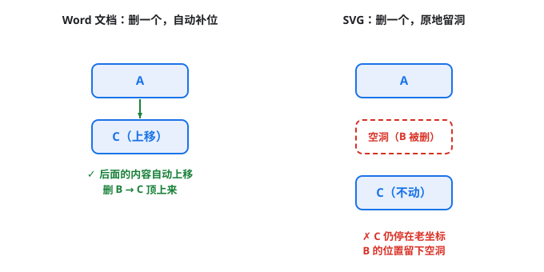
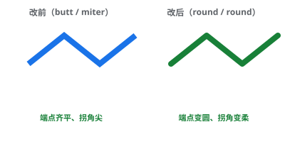
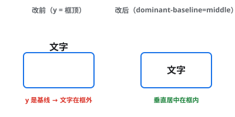
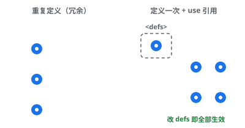

# SVG 术语速查

改图时高频出现的属性 / 元素，一词一解，配最小示例。完整语法去 [语法字典](../../../技术与编程/可视化与图形/SVG从认识到制作.md)；怎么改去 [SVG 动手区](index.md)。

## 坐标系

| 术语 | 什么意思 | 注意 |
|---|---|---|
| `viewBox="min-x min-y w h"` | 内部坐标系，所有坐标按它解释 | 与显示尺寸无关 |
| `x` / `y` | 矩形 / 图像左上角 | 圆用 `cx` / `cy` |
| `y` 轴方向 | **y 越大越靠下** | 和数学课相反，新手一半的「改反了」源于此 |
| `width` / `height` | 显示尺寸 | 常与 viewBox 不同，正是「矢量」的含义 |

*图：删掉一个元素，Word 自动补位、SVG 原地留洞——坐标写死、没有自动重排。*

## 填充与描边

| 术语 | 作用 | 常用值 |
|---|---|---|
| `fill` | 填充色 | `none` = 不填充 |
| `stroke` / `stroke-width` | 描边色 / 粗细 | |
| `stroke-dasharray` | 虚线 | `"6 4"` = 6 实 4 虚 |
| `stroke-linecap` | 端点形状 | `butt` / `round` / `square` |
| `stroke-linejoin` | 拐角形状 | `miter` / `round` / `bevel` |

*图：同一个折线，`round` 让端点变圆、拐角变柔。*

## 文字

| 术语 | 作用 | 常用值 |
|---|---|---|
| `text-anchor` | 水平对齐 | `start`（默认左）/ `middle`（中）/ `end`（右） |
| `dominant-baseline` | 垂直对齐 | `middle` 让文字垂直居中 |
| `font-size` / `font-weight` | 字号 / 字重 | `400` / `700` |

> **`y` 是基线，不是顶部**：`y="48"` 指字母底部那条线。要让文字在框里居中，加 `dominant-baseline="middle"`，再把 `y` 设成框的中心。

## 变换 transform

| 写法 | 作用 | 坑 |
|---|---|---|
| `translate(dx, dy)` | 平移 | |
| `rotate(deg, cx, cy)` | 绕 (cx,cy) 旋转 | **顺时针为正**（y 轴朝下） |
| `scale(sx, sy)` | 缩放 | `scale(-1,1)` = 水平镜像 |
| 嵌套 `<g>` | 多个 transform 串联 | 父级 transform **累加** |

## 分组与复用

- `<g>`：分组，可整体 `transform`；嵌套 transform 会累加。
- `<defs>`：定义区，**不直接显示**，被别处 `url(#id)` 引用；改这里会同时影响所有引用者。
- `<use href="#id">`：引用 defs 里的定义，改定义即全部生效；引用不能改内部细节。

## 显隐三属性

| 属性 | 显示？ | 占位？ | 可点击？ |
|---|---|---|---|
| `display="none"` | 否 | 否 | 否 |
| `visibility="hidden"` | 否 | 是 | 否 |
| `opacity="0"` | 否（透明） | 是 | 是 |

不确定要不要删时，先用 `display="none"`，反悔删掉属性即可。

## 箭头 marker

- `<marker>`：定义箭头形状，放在 `<defs>` 里。
- 用 `marker-end="url(#id)"` 接到线 / 路径的末端。删 `<defs>` 里的 marker，所有引用线会**静默失去箭头**。

---

相关：[← SVG 动手区](index.md) · [读图四步](拿到一张SVG先读四件事.md) · [六种手术](改图的六种常见手术.md) · [语法字典 →](../../../技术与编程/可视化与图形/SVG从认识到制作.md)

---

## 外部工具与推荐资源

- [SVG Path Visualizer](https://svg-path-visualizer.netlify.app/) — 把 `path` 的 `d` 数据实时画出来，调坐标时直观看曲线长啥样，排查「path 画歪了」神器。
- [SVGOMG](https://jakearchibald.github.io/svgomg/) — Jake Archibald 做的 SVG 在线压缩 / 优化器，粘贴 SVG 即可瘦身（删冗余、合并路径、round 坐标），改完图后顺手压一下再发布。
- [SVG 基础教程（cnblogs）](https://www.cnblogs.com/webhmy/p/9826120.html) — 一篇中文 SVG 入门文章，覆盖元素 / 属性 / 示例，适合作为本文的补充读物。
