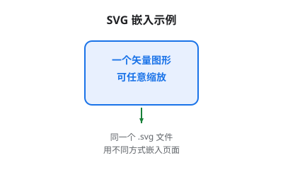

# 亮暗双主题与 MkDocs 嵌入

改好的 SVG 要放进会切换亮/暗主题的站点（如本站的 MkDocs Material）时，会遇到两个独立的问题：**颜色在暗色下糊掉**，以及**引用路径对不上**。这一页分别解决。

---

## 第一部分：让图在亮暗两种主题下都好看

### 问题：写死的颜色在暗色下会糊

假设图里有一行深灰色文字：

```svg
<text fill="#5f6368">说明文字</text>
```

- 亮色主题（白底）：深灰字配白底，对比度尚可，能看清。
- 暗色主题（黑底）：深灰字配黑底，**基本糊成一团**。

反过来，如果图里有浅色填充的方框（`#f8f9fa`），在暗色下它会变成一块刺眼的亮斑。

**根本原因**：颜色值是写死的，它不知道当前是什么主题。

### 解法一：`currentColor`（最省事，推荐首选）

`currentColor` 是一个特殊关键字，意思是"取当前的文字颜色（CSS 的 `color` 属性）"。

```svg
<!-- 改前：写死 -->
<path d="..." stroke="#5f6368"/>

<!-- 改后：跟随主题 -->
<path d="..." stroke="currentColor"/>
```

当 SVG 被当作**图片**（`` 或 Markdown 的 ``）引入时，`currentColor` 取不到外部的 `color`，会退化为默认值（通常是黑色）。所以这个解法**主要用于内联 SVG**。

### 解法二：CSS 变量 + 内联 SVG（功能最强）

把 SVG 代码**直接写进 HTML/Markdown**，它就成了文档的一部分，可以正常使用 CSS 变量。

MkDocs Material 提供了一批随主题变化的变量，常用的有：

| 变量 | 含义 | 亮色下 | 暗色下 |
|---|---|---|---|
| `--md-primary-fg-color` | 主色（强调色） | 蓝 | 蓝（略调） |
| `--md-default-fg-color` | 正文文字色 | 近黑 | 近白 |
| `--md-default-fg-color--light` | 次要文字色 | 灰 | 浅灰 |
| `--md-default-bg-color` | 页面背景色 | 白 | 近黑 |

用法：

```html
<svg viewBox="0 0 200 100" style="max-width:100%">
  <rect x="10" y="10" width="180" height="80" rx="8"
        fill="none"
        stroke="var(--md-primary-fg-color)" stroke-width="2"/>
  <text x="100" y="55" text-anchor="middle"
        fill="var(--md-default-fg-color)" font-size="14">随主题变化</text>
</svg>
```

这样方框描边跟随主色、文字跟随正文色，亮暗自动适配。

!!! warning "内联 SVG 是白盒，会被站点样式影响"
    内联进页面的 SVG 会被站点的全局 CSS 波及（例如 Material 对 `svg` 的一些默认样式）。如果发现内联后样式异常，优先怀疑 CSS 冲突，而不是 SVG 本身有问题。
    另外，内联 SVG **不能**被 `` 那样缓存复用，同一张图在多处出现时代码会重复。

### 解法三：`<style>` + 媒体查询（自包含，推荐用于独立 .svg 文件）

在 `.svg` 文件内部写 CSS，让它**自己**响应系统的亮/暗偏好。这样无论是内联还是当图片引入，都能适配。

```svg
<svg xmlns="http://www.w3.org/2000/svg" viewBox="0 0 200 100">
  <style>
    .stroke { stroke: #1a73e8; }
    .fill   { fill:   #202124; }
    @media (prefers-color-scheme: dark) {
      .stroke { stroke: #8ab4f8; }   /* 暗色下换成浅蓝 */
      .fill   { fill:   #e8eaed; }   /* 暗色下换成浅灰 */
    }
  </style>

  <rect class="stroke" x="10" y="10" width="180" height="80"
        rx="8" fill="none" stroke-width="2"/>
  <text class="fill" x="100" y="55" text-anchor="middle"
        font-size="14">随系统主题变化</text>
</svg>
```

!!! note "媒体查询跟随的是**系统**，不一定是站点"
    `prefers-color-scheme` 读的是**操作系统/浏览器**的亮暗偏好。如果站点本身有手动切换主题的按钮（本站就有），而用户手动切了、但系统偏好没变，那么 SVG 的颜色**不会跟着站点的按钮变**。
    需要严格跟随站点按钮时，只能用解法二（内联 + CSS 变量）。

### 三种解法怎么选

| 解法 | 适用场景 | 优点 | 缺点 |
|---|---|---|---|
| `currentColor` | 内联的单色图标 | 一行改动，最省事 | 只能继承一个颜色；当图片引入时失效 |
| CSS 变量 + 内联 | 要严格跟随站点主题切换 | 与站点完全一致 | 要内联；可能被站点 CSS 影响 |
| `<style>` + 媒体查询 | 独立的 `.svg` 文件 | 文件自包含，引用方式不限 | 跟随系统偏好，不跟随站点手动切换 |

**实践建议**：独立 `.svg` 文件用解法三（自包含最省心）；需要精细控制且图不大的时候用解法二。

---

## 第二部分：放进 MkDocs 不出错

### 引用方式对比

| 方式 | 写法 | 特点 |
|---|---|---|
| **Markdown 图片**（最常用） | `` | 简单；作为图片引入，不能用 CSS 变量 |
| **Markdown 带 alt** | `` | 同上，**推荐**，对可访问性和搜索更友好 |
| **HTML `` + 尺寸** | `` | 可控制显示尺寸 |
| **内联 SVG** | 直接把 `<svg>...</svg>` 贴进 md | 可用 CSS 变量；代码冗长 |

MkDocs Material 默认支持在 Markdown 里直接写 HTML，所以几种方式可以混用。

### 路径与文件名编码（高频坑）

**结论：Markdown 里写真实文件名，不要手动做 URL 编码。**

MkDocs 会按你写的路径去文件系统中找文件，找到之后在生成的 HTML 里自动做 URL 编码。所以：

```markdown
<!-- ✅ 正确：写磁盘上的真实文件名 -->


<!-- ❌ 错误：手动编码后 MkDocs 反而找不到文件 -->


```

构建后的 HTML 里你会看到路径变成了 `DW01%2B8205A_SCH.png`、`Position%20_reverse.jpg`——**这是 MkDocs 自动做的，浏览器会正确还原**，不用管。

!!! warning "文件名本身的建议"
    虽然 MkDocs 能处理 `+` 和空格，但**新文件尽量别用**，能省掉一整类麻烦：
    - 用 `-` 或 `_` 代替空格：`position-reverse.jpg`
    - 避免 `+ & # % ?` 等 URL 里有特殊含义的字符
    - 中文文件名能用，但跨平台 / 跨工具链时出错概率更高，能避则避

### 相对路径的基准

Markdown 里的相对路径是**相对于当前 .md 文件所在的目录**，不是相对于 `docs/` 根目录，也不是相对于站点根目录。

```text
docs/
└── 技术与编程/
    └── 前端设计/
        ├── index.md          ← 从这里引用
        └── SVG/
            ├── index.md
            └── assets/
                └── demo.svg
```

- 在 `SVG/index.md` 里引用 → `assets/demo.svg`
- 在 `前端设计/index.md` 里引用 → `SVG/assets/demo.svg`
- 想从任意位置引用同一张图 → 用**绝对路径**（以 `/` 开头，相对于站点根）：`/技术与编程/前端设计/SVG/assets/demo.svg`

!!! note "站点部署在子路径时，绝对路径可能失效"
    如果站点不是部署在域名根目录（例如 `example.com/wiki/`），以 `/` 开头的绝对路径会指错地方。本站部署在域名根目录，可以放心用；换环境时需要重新确认。

### 尺寸控制

SVG 作为图片引入时，显示尺寸由 `width`/`height` 属性或 CSS 决定：

```markdown
<!-- 方式一：HTML img 指定宽度（高度自适应） -->
{: width="600"}

<!-- 方式二：CSS 控制（推荐，响应式） -->
{: style="max-width:100%; height:auto"}
```

**推荐做法**：`.svg` 文件里**只保留 `viewBox`、删掉 `width`/`height`**，让显示尺寸完全由引用方（CSS）决定。这样同一份文件在窄屏和宽屏都能自适应。

```svg
<!-- 推荐：自适应 -->
<svg xmlns="..." viewBox="0 0 920 720">

<!-- 不推荐：写死尺寸，窄屏会溢出 -->
<svg xmlns="..." viewBox="0 0 920 720" width="920" height="720">
```

---

## 检查清单

改完准备提交前，过一遍：

- [ ] 图里有没有写死的颜色（`#xxx`）？亮暗两种主题下都看过吗？
- [ ] 用的是哪种适配方案？它跟随的是**系统偏好**还是**站点按钮**？符合预期吗？
- [ ] `.svg` 文件里是否只留了 `viewBox`（利于响应式）？
- [ ] Markdown 里写的是**磁盘上的真实文件名**（没有手动编码）？
- [ ] 相对路径的基准是当前 `.md` 所在目录，对吗？
- [ ] 本地 `mkdocs serve` 预览过吗（构建告警会提示链接问题）？

---

相关：[← 六种手术](改图的六种常见手术.md) · [下一步：排错清单 →](SVG排错清单.md) · [SVG 入门：读图与制作](./SVG入门_读图与制作.md)
