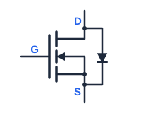
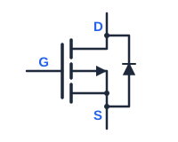

# 实战：一张电路图改图复盘

前面几页讲的是方法，这一页用一个真实案例把它们串起来。案例本身很简单（一张双 MOS 管保护电路图），但它集中体现了改图时**最容易翻车的三类问题**，正好覆盖方法论的三个要点。

---

## 案例背景

需要画一张单节锂电池保护电路的**封装视图**——不是抽象的原理符号，而是要画出芯片实际的样子：两颗 SOT-23-6 封装的芯片，各自的六个引脚按真实位置排列，引脚之间用线连起来。

<!-- 以某锂电池保护电路（DW01 控制芯片 + 8205A 双 N-MOS）为例 -->

图上要表达的核心器件关系：

```text
        ┌──── 电池正极 B+ ────┐
        │                     │
      [控制芯片]           [双 MOS 管]
        │  (6 脚)             │  (6 脚)
        └──── 电池负极 B- ────┘
                              │
                            P-（对外负极）
```

这类图的特点，也是它难改的原因：**引脚是固定位置的，器件内部结构和引脚之间必须严格对应**。改一个引脚编号为代价的挪动，整张图的连线逻辑就错了。

---

## 坑一：一个视觉元素 = 多个 SVG 元素

### 现象

要在图上画一个**体二极管符号**（MOS 管内部固有的寄生二极管）。看起来是"一个小三角加一横"，实际在 SVG 里由**三行**拼成：

```svg
<!-- ① 引线：把二极管并联到 MOS 的源漏两端 -->
<path d="M 563 498 L 583 498 L 583 436 L 563 436"
      fill="none" stroke="#1e293b" stroke-width="2" stroke-linecap="round"/>

<!-- ② 阴极横线 -->
<line x1="577" y1="456" x2="589" y2="456"
      stroke="#1e293b" stroke-width="2.5" stroke-linecap="round"/>

<!-- ③ 阳极三角形 -->
<polygon points="583,456 578,466 588,466"
         fill="#1e293b" stroke="#1e293b" stroke-width="1.5"/>
```

### 翻车点

想把这个二极管**翻转方向**，只改了 ③ 的三角形顶点（把 `583,456 578,466 588,466` 改成朝上）。刷新一看——三角形确实朝上了，但**② 的阴极横线还留在原来那头**，于是得到了一个不伦不类的图形：三角朝上、阴极线在下方，物理含义变成了"两头都像阳极"。

### 正确做法

**改之前先数清楚目标由几个 SVG 元素构成**（这正是 [读图第 ③ 步](SVG入门_读图与制作.md#step3-locate) 强调的）。翻转一个二极管符号 = 同时处理三行：

| 元素 | 翻转时要改什么 |
|---|---|
| ① `path` 引线 | 保持（它是连接线，本来对称） |
| ② `line` 阴极横线 | 移到**另一端**（改 `y1`/`y2`） |
| ③ `polygon` 三角形 | 顶点方向翻转 |

```svg
<!-- 翻转后：阴极横线移到下方，三角形改为朝上 -->
<line x1="577" y1="478" x2="589" y2="478" .../>        <!-- 下移 -->
<polygon points="583,478 578,468 588,468" .../>         <!-- 顶点翻转 -->
```

!!! tip "更省事的改法：整组镜像"
    如果只想把一个符号上下翻转，与其逐个改坐标，不如套一个 `<g>` 做镜像变换：

    ```svg
    <g transform="translate(0, 934) scale(1, -1)">   <!-- 934 = 2 × 翻转轴 y 坐标 -->
      <line .../>
      <polygon .../>
    </g>
    ```
    其中 `scale(1,-1)` 上下翻转，再用 `translate` 把它移回原位（翻转轴在 y=467 时，补偿量 = 2×467 = 934）。一行搞定，且不会漏改。

翻转二极管符号时，**对照一下标准 MOS 管的体二极管方向**，就知道翻完该是什么样。下图是 N 型与 P 型两种 MOS 管（注意阴极横线的位置：NMOS 靠源极 S，PMOS 靠漏极 D，正好互为镜像）：

{: style="display:inline-block;max-width:380px;width:47%;height:auto;vertical-align:middle" } {: style="display:inline-block;max-width:380px;width:47%;height:auto;vertical-align:middle" }

*图注：左 = NMOS（体二极管阴极横线在下方，靠近源极 S）；右 = PMOS（阴极横线在上方，靠近漏极 D），两者互为镜像。*

---

## 坑二：改一处牵一片（坐标是绝对的）

### 现象

画完两颗芯片后发现，右侧芯片的引脚编号标错了——6 个脚的排列方向与实际封装相反。改引脚编号意味着**整列标签的内容全部重新分配**，而每个标签是一个独立的 `<text>`，各有各的 `x`/`y`。

### 翻车点

用了最直觉的办法：一个个改 `<text>` 的内容。改到第 4 个时发现，标签虽然换对了，但**对应的连线还连在原来的引脚上**——因为连线（`<path>` 的 `d`）里的坐标是**写死的引脚坐标**，改文字内容完全不影响连线。

结果图变成了"引脚标签正确、连线接在错误引脚上"——比改之前更有误导性。

### 正确做法

遇到"改一处会影响一片"的需求，先停下来画一张**依赖清单**：

```text
要改：右侧芯片的引脚编号排列
受影响的元素：
  ├─ 6 个引脚的 <text> 标签内容        ← 直接受影响
  ├─ 6 条连线的 <path> 起点坐标         ← 间接受影响（必须同步）
  ├─ 芯片内部符号（两个 MOS）的位置     ← 若引脚顺序变了，内部结构也要跟着重排
  └─ 1 脚标识圆点的位置                 ← 跟着 1 脚走
```

有了清单，就能评估工作量，也能在改完之后逐项核对。

**另外一个省力技巧**：把"右侧芯片"整体包一个 `<g>`，如果最终发现这一侧的改动太大、不如重画，直接替换整个 `<g>` 的内容即可，不会波及左侧和连线层。

---

## 坑三：语义错误不会报错（最危险的一类）

### 现象

这是整个案例里**代价最高**的一个坑。

图上有两颗 N-MOS 管（M1 负责放电通路、M2 负责充电通路），它们共用漏极、背靠背连接。每颗 MOS 内部各有一个体二极管，两个二极管必须**方向相反**——这正是"背靠背"能双向阻断的物理来源。

画完之后，图上两颗管的体二极管看起来都画对了（三角形 + 阴极线齐全、位置对称、颜色一致），**渲染完全正常，没有任何报错**。

但其中一颗的方向画反了。

### 为什么危险

| 属性错误 | 语义错误 |
|---|---|
| 坐标写错、颜色写错 | 器件方向画反、逻辑箭头指反 |
| **一眼能看出来** | **图形完全合法，肉眼很难发现** |
| 任何人都能发现 | 只有**懂这个领域**的人才能发现 |

具体的物理后果（以本例说明）：

```text
正确：M1 关断时，其体二极管应阻断"放电方向"的电流
      → 过放保护生效，电池停止放电

画反：M1 关断了，但电流仍然可以经由体二极管通过
      → 过放保护形同虚设
      → 而图上看起来"保护电路画得很完整"
```

一张画反了体二极管的电路图，**比一张空白的图更有害**——读者会基于它得出错误的结论，而且不会有任何怀疑。

### 怎么防

1. **AI 生成的图，语义必须人工复核**。AI 对语法很熟，但对"这个二极管该朝哪边"这类工程语义把握不稳，且它出错时**不会有任何提示**。
2. **按物理量反向验证**。画完之后，拿一个具体的物理过程在图上"走"一遍：假设现在要过放保护 → M1 应该关断 → 电流想从电池正极流向负载 → 走到 M1 时，体二极管是导通还是阻断？如果答案是"导通"，就画反了。
3. **同类型元素对照检查**。本例里有两颗对称的 MOS，它们的体二极管**本该镜像对称**。如果发现两颗画成了完全一样（而非镜像），那就是信号——很可能有一颗反了。

!!! tip "这条经验不限于电路图"
    流程图箭头指反、时序图先后颠倒、架构图数据流向画反……都属于"语义错误"。共同特征是：**渲染正常、不报错，只有懂领域的人能看出来**。
    所以凡是要放进文档给人看的示意图，**语义复核这一步不能跳过**，而且它的优先级高于调样式——图好看但画错了，比图朴素但正确要糟得多。

---

## 完整复盘：改一张图的标准流程

把案例里的教训整理成可复用的流程：

```text
1. 备份（复制一份 .svg.bak 或先 git commit）

2. 读图（[SVG 入门：读图与制作](SVG入门_读图与制作.md) 第 3 节）
   ├─ viewBox 定坐标系
   ├─ 折叠看 <g> 骨架，列出"行号区间表"
   └─ 定位目标元素 + 连带看上下 5–10 行

3. 列依赖清单（本页坑二）
   └─ 这次改动会影响哪些元素？逐个列出来

4. 无害试改验证（[读图第 ④ 步](SVG入门_读图与制作.md#step4-probe)）
   └─ 临时改成亮色，确认找对了元素
   └─ 验证完立刻还原

5. 实施改动（[改图的六种常见手术](改图的六种常见手术.md)）
   └─ 优先用 <g transform> 而非逐个改坐标
   └─ 一个视觉元素包含的多个 SVG 元素要一起改（本页坑一）

6. 语义复核（本页坑三）★ 最容易被跳过
   └─ 拿着具体的物理/逻辑过程，在图上走一遍
   └─ 对称结构检查是否真的镜像对称

7. 主题与嵌入检查（[亮暗双主题与 MkDocs 嵌入](亮暗双主题与MkDocs嵌入.md)）
   ├─ 亮暗两种主题下都看过吗？
   └─ 引用路径写的是磁盘真实文件名吗？

8. 本地预览 + 提交
```

---

## 三条最值得记住的

1. **一个视觉元素往往由多个 SVG 元素拼成**，改之前先数清楚，否则会得到残缺的图形。
2. **坐标是绝对的**，改一处往往要连带改一片；用 `<g transform>` 能把影响范围锁在组内。
3. **语义错误不会报错**，也不会看起来"不对劲"——它是唯一一种必须靠领域知识才能发现的 bug，复核优先级最高。

---

相关：[← 排错清单](SVG排错清单.md) · [← SVG 动手区](/技术与编程/前端设计/SVG/) · [原案例完整电路说明](../../../硬件与半导体/汽车电子/KeyGo-DW01电池保护踩坑.md)
