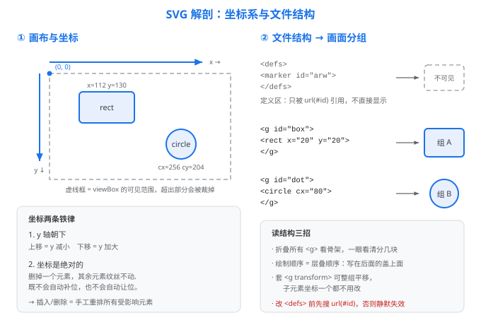

# 拿到一张 SVG 先读四件事

## 0. 先玩一下：拖动滑块改坐标

读图之前，先用一个能动的玩具建立直觉。拖动下面两个滑块，蓝色方块会实时移动——**你改的不是「方块往哪走」，而是它的 `x` / `y` 坐标值**：

<div class='play-wrap'>

<style>
#play-svg{background:#fafafa;border:1px solid #dadce0;border-radius:8px}
#play-box{fill:#e8f0fe;stroke:#1a73e8;stroke-width:2}
.play-row{font:14px sans-serif;color:#202124;margin:6px 0}
.play-row input{vertical-align:middle}
#play-hint{font:13px sans-serif;color:#1a73e8;margin-top:4px}
@media (prefers-color-scheme: dark){
  #play-svg{background:#1e2024;border-color:#3c4043}
  #play-box{fill:#1b3a5c;stroke:#4a9eff}
  .play-row{color:#e8eaed}
  #play-hint{color:#8ab4f8}
}
</style>

<svg id='play-svg' viewBox='0 0 400 240' style='max-width:420px;width:100%;height:auto'>
  <defs>
    <pattern id='pgrid' width='20' height='20' patternUnits='userSpaceOnUse'>
      <path d='M20 0 L0 0 0 20' fill='none' stroke='#e8eaed' stroke-width='1'/>
    </pattern>
  </defs>
  <rect width='400' height='240' fill='url(#pgrid)'/>
  <rect id='play-box' x='120' y='90' width='80' height='60' rx='8'/>
</svg>

<div class='play-row'>X（左右）：<input type='range' id='play-x' min='0' max='320' value='120'> <span id='play-xv'></span></div>
<div class='play-row'>Y（上下）：<input type='range' id='play-y' min='0' max='180' value='90'> <span id='play-yv'></span></div>
<p id='play-hint'></p>

<script>
  var box=document.getElementById('play-box');
  var gx=document.getElementById('play-x'), gy=document.getElementById('play-y');
  var xv=document.getElementById('play-xv'), yv=document.getElementById('play-yv');
  var hint=document.getElementById('play-hint');
  function upd(){
    var x=+gx.value, y=+gy.value;
    box.setAttribute('x',x); box.setAttribute('y',y);
    xv.textContent='x='+x+' → 横向 '+Math.round(x/400*100)+'%';
    yv.textContent='y='+y+' → 纵向 '+Math.round(y/240*100)+'%';
    hint.textContent='把 Y 调大，方块往下走 —— 这就是 SVG 的 y 轴朝下';
  }
  gx.addEventListener('input',upd); gy.addEventListener('input',upd); upd();
</script>

</div>

最关键的体感：**方块的坐标被写死在 SVG 里，网格不会因为它移动而跟着动**。这正好呼应后面「坐标是绝对的」——记住这个玩具，后面读图、改图就都有了锚点。

---

改 SVG 之所以让人发怵，很少是因为语法难，而是因为**打开一个几百行的文件，不知道哪一行对应图上的哪个东西**。

这一页给出一套固定的读图顺序。按这个顺序走四步，任何一张 SVG 都能在几分钟内摸清结构，然后才有资格谈"改"。

---

## 四件事总览

| 顺序 | 做什么 | 回答什么问题 | 产出 |
|---|---|---|---|
| ① | 看画布 | 这张图多大？原点在哪？坐标往哪长？ | 一张坐标心智地图 |
| ② | 看骨架 | 图分成哪几块？每块从哪行到哪行？ | 行号区间表 |
| ③ | 找锚点 | 我关心的元素在画布的哪个位置？ | 具体行号 + 坐标 |
| ④ | 无害试改 | 我的理解对不对？ | 一次验证 |

---

## ① 看画布：建立坐标系直觉

打开 SVG，**第一行 `<svg>` 标签**就决定了整张图的空间规则：

```svg
<svg xmlns="http://www.w3.org/2000/svg"
     viewBox="0 0 920 720"
     width="920" height="720">
```

三个要点：

### viewBox 的四个数字

`viewBox="min-x min-y width height"` → `0 0 920 720` 意为：可见区域的左上角是 `(0, 0)`，宽 920、高 720。**所有子元素的坐标都在这个坐标系里解释**，与图片最终显示多大无关。

### y 轴朝下（最容易踩的一条）

数学课上 y 轴朝上，**SVG 的 y 轴朝下**。也就是说：

- `y` 越大 → 位置越**靠下**
- 想把元素往**下**移 → `y` **加**
- 想把元素往**上**移 → `y` **减**

这一条大约能解释新手一半的"怎么改反了"。

### width/height vs viewBox

- `viewBox` 决定**内部坐标系**（元素的坐标按它算）。
- `width`/`height` 决定**显示尺寸**（渲染出来多大）。

两者不必相等。若 `viewBox="0 0 920 720"` 而 `width="460"`，图形会整体缩放到一半显示，但内部坐标一律不变——这正是 SVG "矢量" 的含义。

> **响应式技巧**：在 wiki / 网页里嵌入时，常把 `width`/`height` 删掉（或写成 `width="100%"`），只保留 `viewBox`。这样图会随容器宽度自适应缩放。详见 [亮暗双主题与 MkDocs 嵌入](亮暗双主题与MkDocs嵌入.md)。

### 画布心智地图

先把整张图的结构看一眼，再谈坐标细节：



*左半：`viewBox` 定义的可见范围、x 轴向右、**y 轴朝下**，以及两条坐标铁律；右半：`<defs>` 定义区与 `<g>` 分组分别对应画面上的什么。*

读完这一步，脑子里应该剩下这样一张坐标网格：

```text
(0,0) ──────────────────────── x → (920,0)
  │
  │     左上        中上        右上
  │
  │     左中        中心        右中
  │
  │     左下        中下        右下
  ↓ y
(0,720) ───────────────────── (920,720)
```

看到一个坐标如 `x="525" y="445"`，立刻能反应过来：**横向 525/920 约 57%（偏右），纵向 445/720 约 62%（偏下）→ 右下区域**。这个直觉会贯穿后面所有步骤。

---

## ② 看骨架：把文件切成几大块

SVG 几乎没有缩进规范可言（尤其 AI 生成的），但**分组标签 `<g>`** 就是天然的目录。

### 用大纲视角看结构

在编辑器里折叠所有标签（VS Code 按 `Ctrl+Shift+[` 或用折叠全部命令），只展开顶层，你就能看到骨架。典型结构：

```svg
<svg>
  <defs>          <!-- 定义区：渐变、箭头 marker、裁剪路径。不直接显示 -->
    ...
  </defs>
  <rect />        <!-- 背景 -->
  <g id="title">  <!-- 标题区 -->
  <g id="chip1">  <!-- 模块一 -->
  <g id="chip2">  <!-- 模块二 -->
  <g id="wires">  <!-- 连线 -->
  <g id="labels"> <!-- 标注 -->
</svg>
```

### 分类：定义区 vs 绘制区

| 区域 | 特征 | 改的时候注意 |
|---|---|---|
| **定义区** `<defs>` | 内含 `linearGradient`、`marker`、`clipPath`、`filter`、`pattern` | 这里的东西**不直接显示**，是被别处 `url(#id)` 引用的。改这里会**同时影响所有引用者** |
| **绘制区** | `rect` / `circle` / `path` / `line` / `text` | 所见即所得，一对一 |

**判断某段是不是定义区的最快办法**：看它的父标签是不是 `<defs>`。

### 如果没有 `<g>` 分组怎么办

很多 AI 生成的 SVG 是一长串平铺的元素，没有分组。此时按**空间位置**自行划块：

1. 扫一遍所有元素的 `y` 坐标，看是否成簇（比如集中在 50~120、300~400、600~700 三个区间）。
2. 每一簇就是一个功能模块。
3. 记下行号区间，例如：`第 12–48 行 = 顶部标题`、`第 50–180 行 = 左侧芯片`。

**这步做出来的一张"行号区间表"，是后面对话和改动的基础**。哪怕只是手写在一张纸上，也比在几百行里反复滚动强得多。

---

## ③ 找锚点：定位你关心的元素

现在带着具体目标来找。假设要改的是"某个二极管的朝向"，流程是：

### 步骤 1：靠特征搜，别靠肉眼扫

用编辑器的搜索（`Ctrl+F`），按以下优先级试：

| 搜什么 | 适用情况 | 示例 |
|---|---|---|
| `id=` / `class=` | 图作者给了命名（最省事） | 搜 `body-diode` |
| 注释 `<!--` | 有人写过注释 | 搜 `<!-- 体二极管` |
| 文字内容 | 要改的元素带标签文字 | 搜 `>D1<` |
| 特征属性 | 知道它在用某种样式 | 搜 `stroke-width="2.5"` |
| 坐标数值 | 只知道大概位置 | 搜 `y="45"` |

### 步骤 2：用坐标验证是不是它

搜到候选后，用 ① 建好的坐标直觉核对。**这一步不能省**——图里可能有多个相似元素（比如电路图里两颗对称的 MOS 管），搜到的未必是你要的那个。

举例：搜到两个 `polygon`，一个在 `583,456`（y≈456，画布中部），一个在 `583,310`（y≈310，画布上部）。如果你要改的是"下面那颗管的二极管"，那就是 y=456 这个。

### 步骤 3：记下完整上下文

找到目标元素后，**把它周围 5–10 行一起看懂**。因为一个视觉元素往往由多个 SVG 元素拼成：

```svg
<!-- 一个"二极管符号"实际由三部分拼成 -->
<path d="M 563 498 L 583 498 L 583 436 L 563 436"   <!-- ① 引线 -->
      fill="none" stroke="#1e293b" stroke-width="2"/>
<line x1="577" y1="456" x2="589" y2="456"           <!-- ② 阴极横线 -->
      stroke="#1e293b" stroke-width="2.5"/>
<polygon points="583,456 578,466 588,466"           <!-- ③ 阳极三角形 -->
         fill="#1e293b"/>
```

要改"二极管方向"，**这三处必须一起改**，只改一处会得到歪掉的图形。这就是为什么必须先读上下文。

---

## ④ 无害试改：验证你的理解

在动真正的修改之前，先做一次**成本低、效果明显、且可逆**的改动，确认你找对了地方、也理解对了含义。

### 推荐做法：临时改成亮色

```svg
<!-- 原 -->
<polygon points="583,456 578,466 588,466" fill="#1e293b"/>
<!-- 试改 -->
<polygon points="583,456 578,466 588,466" fill="#ff00ff"/>
```

刷新预览：

- 变色的**正是**你以为的那个元素 → 理解正确，开始正式改。
- 变色的**不是**你要的，或者**一片都变了** → 找错元素了（或它是被 `<defs>` 共享引用的），回到 ③ 重找。
- **什么都没变** → 元素可能被后面绘制的元素**盖住**了，或被 `display="none"` / `opacity="0"` 隐藏，或被 `clipPath` 裁掉了。见 [SVG 排错清单](SVG排错清单.md)。

### 另外两种试改手段

| 手段 | 怎么做 | 能验证什么 |
|---|---|---|
| **放大描边** | 把 `stroke-width` 从 `2` 改成 `6` | 元素的实际轮廓范围（对付细线看不清的情况） |
| **整组平移** | 给父 `<g>` 加 `transform="translate(30,0)"` | 这一组到底包含哪些元素（一动全动的就是同组） |

### 试改完记得改回来

听起来是废话，但这是最高频的翻车点：试改标记忘了删，结果图里留着一个亮粉色元素就提交了。**试改前先记下原值**（或依赖备份文件），验证完立刻还原。

---

## 完整示例：读一张电路图

把四步串起来走一遍（以一张 920×720 的电路图为例）：

```text
① 看画布
   viewBox="0 0 920 720" → 宽 920、高 720，原点左上角，y 朝下
   → 心智地图就绪

② 看骨架（折叠后看顶层）
   <defs>           行 8–40   （箭头 marker、渐变）
   <g id="dw01">    行 45–120 （左侧控制芯片）
   <g id="mos">     行 122–260（右侧双 MOS）
   <g id="wires">   行 262–400（连线）
   → 行号区间表就绪

③ 找锚点（目标：右侧"下面那颗 MOS"的体二极管）
   搜 "二极管" 注释 → 命中 2 处（行 178、行 246）
   比坐标：行 178 的 y≈310（上），行 246 的 y≈456（下）
   → 目标 = 行 246 附近，且它由 path+line+polygon 三行拼成

④ 无害试改
   把行 248 的 polygon fill 改 #ff00ff → 刷新
   确认变色的就是下面那颗管的三角形 → 理解正确
   → 还原颜色，开始正式修改
```

全程不到五分钟，但避免了"改错元素 → 越改越乱 → 回滚重来"的循环。

---

## 速查卡

```text
① viewBox 定坐标系，y 轴朝下，y 越大越靠下
② <defs> 是定义区（改一处影响所有引用）；<g> 是分组（折叠看骨架）
③ 靠 id/注释/文字/坐标搜索定位；找到后连带看上下 5–10 行
④ 先做一次临时亮色试改，验证理解；验证完立刻还原
```

---

相关：[← SVG 动手区](/技术与编程/前端设计/SVG/) · [下一步：六种常见手术 →](改图的六种常见手术.md) · [术语速查](SVG术语速查.md) · [语法字典](../../../技术与编程/可视化与图形/SVG从认识到制作.md)
