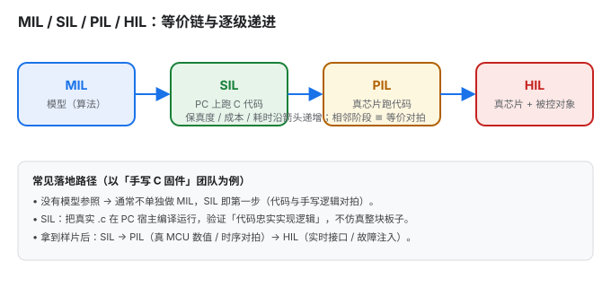
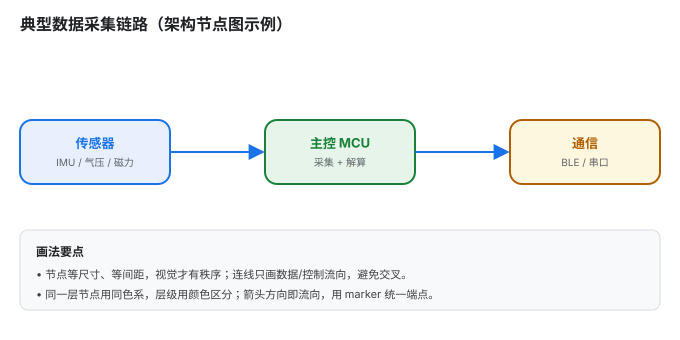

# SVG 从认识到制作

> 一篇把 SVG 讲透的长文：先建立「它是什么、为什么好用」的直觉，再手把手带你写出能复用的图。
> 全文以「手写代码」为主线——不依赖任何图形软件也能产出专业图表，这也是把它沉淀成一项可迁移技能的目标。

## 这篇能带给你什么

- **认识层**：矢量图与位图的本质区别、SVG 的坐标系与 `viewBox`、基本图形与路径、样式与颜色、变换与复用、嵌入与动画、可访问性。
- **制作层**：一套可落地的画图工作流、一组可复制的图元模板，以及三个来自真实工程场景的范例（流程图 / 截面图 / 架构图），源码都随文给出，可直接改。
- **避坑层**：把常见的 7 类错误（含「把项目状态写死进图里」这种反例）集中列出，省去你踩坑的时间。

阅读路线：只想快速上手，直奔第 12 节「制作实战」；想打牢基础，从第 1 节顺着读。

---

## 1. 认识 SVG：它到底是什么

### 1.1 矢量图 vs 位图

| 维度 | 位图（PNG / JPG） | 矢量图（SVG） |
|---|---|---|
| 存储内容 | 像素网格（每个点什么颜色） | 几何指令（画一个圆、连一条线…） |
| 放大 | 放大出现锯齿 / 模糊 | 任意放大都清晰 |
| 文件体积 | 复杂照片小、简单图形反而大 | 简单图形极小、照片不合适 |
| 可编辑性 | 只能改像素 | 可改坐标、颜色、用 CSS/JS 操控 |
| 典型用途 | 照片、截图、纹理 | 图标、示意图、流程图、图表、动画 |

一句话：**照片用位图，图形用矢量。** 凡是「由线条、色块、文字构成的图」，SVG 几乎都是更优解。

### 1.2 SVG 的本质：带坐标的 XML

SVG（Scalable Vector Graphics）就是一个**文本文件**，里面是一串带坐标的 XML 标签。这意味着：

- 用记事本就能改；用版本管理（git）能 diff；能用程序批量生成。
- 浏览器原生支持，SEO 友好（文字可被搜索、被屏幕阅读器读取）。
- 内部元素可被 CSS 样式化、被 JavaScript 增删改——这是它和「静态图片」最本质的区别。

它与 HTML 同属 XML 家族：HTML 里能直接内联 `<svg>`，SVG 里也能嵌 `<foreignObject>` 包 HTML。

### 1.3 一个最小 SVG 拆解

下面这个圆，就是最朴素的 SVG（直接渲染在页面里）：

<svg xmlns="http://www.w3.org/2000/svg" viewBox="0 0 120 80" width="180">
  <circle cx="60" cy="40" r="30" fill="#1a73e8"/>
</svg>

它的源码：

```svg
<svg xmlns="http://www.w3.org/2000/svg" viewBox="0 0 120 80">
  <circle cx="60" cy="40" r="30" fill="#1a73e8"/>
</svg>
```

逐属性解释：

- `xmlns`：命名空间，告诉解析器「这是 SVG 而非别的 XML」。内联进 HTML 时可省略，独立 `.svg` 文件必须有。
- `viewBox="0 0 120 80"`：内部坐标系为宽 120、高 80（详见第 2 节）。
- `<circle>`：画圆，`cx/cy` 是圆心，`r` 是半径，`fill` 是填充色。

---

## 2. 坐标系与视口（最易踩坑）

### 2.1 y 轴向下

SVG 的坐标系和数学课学的相反：**原点在左上角，x 向右增大，y 向下增大**。

```
(0,0) ─── x 增大 ──▶
  │
  │  y 增大（往下）
  │
  ▼
```

一开始画「向上的箭头」「对称的图」时，最容易被这个反向 y 轴坑到。记住：屏幕坐标里「上」是更小的 y。

### 2.2 viewBox 是什么（最重要的概念）

`viewBox="minX minY width height"` 定义**内部坐标系的可见范围**，和最终显示尺寸（`width`/`height`）是**解耦**的。

看同一个内容，放在不同尺寸的容器里：

<svg xmlns="http://www.w3.org/2000/svg" viewBox="0 0 100 60" width="100" height="60"><rect x="10" y="10" width="80" height="40" rx="6" fill="#e8f0fe" stroke="#1a73e8"/></svg>
<svg xmlns="http://www.w3.org/2000/svg" viewBox="0 0 100 60" width="200" height="120"><rect x="10" y="10" width="80" height="40" rx="6" fill="#e8f0fe" stroke="#1a73e8"/></svg>

两个框的源码**完全相同**，只是外层 `width/height` 不同——内容自动缩放适配。这正是 SVG「可缩放」的来源：你只管在 `viewBox` 坐标系里画图，缩放交给渲染器。

**实战建议**：画图时先定一个宽松的 `viewBox`（比如 `0 0 680 400`），内部随意摆放；最后再决定它在页面上显示多大。不要让 `viewBox` 卡得太紧，否则内容容易被裁掉。

### 2.3 preserveAspectRatio

当 `viewBox` 的宽高比和容器不一致时，`preserveAspectRatio` 决定「怎么对齐、怎么缩放」：

- `xMidYMid meet`（默认）：等比缩放、居中、完整显示（可能留白）。
- `xMidYMid slice`：等比缩放、填满、裁掉溢出部分。
- `none`：**不等比拉伸**铺满——慎用，图形会被拉变形。

绝大多数情况用默认即可；只有当你明确想「拉伸填满」时才用 `none`。

---

## 3. 基本图形

所有基本图形都是「自闭合或带起止标签的元素 + 几何属性」。下面给出最常用的一组。

### 3.1 矩形 / 圆 / 椭圆

```svg
<rect   x="10" y="10" width="120" height="60" rx="8"  fill="#e8f0fe" stroke="#1a73e8" stroke-width="2"/>
<circle cx="80" cy="40" r="30" fill="#188038"/>
<ellipse cx="80" cy="40" rx="40" ry="20" fill="#b06000"/>
```

- `rect`：`x/y` 是左上角，`rx/ry` 是圆角半径（只写 `rx` 则四角同圆）。
- `circle`：`cx/cy/r` 圆心半径。
- `ellipse`：`rx/ry` 分别是横、纵半轴。

### 3.2 线 / 折线 / 多边形

```svg
<line     x1="10" y1="10" x2="120" y2="60" stroke="#1a73e8" stroke-width="2"/>
<polyline points="10,60 40,20 70,60 100,20" fill="none" stroke="#188038" stroke-width="2"/>
<polygon  points="60,10 110,60 10,60"       fill="#e8f0fe" stroke="#b06000" stroke-width="2"/>
```

- `line`：两点线段。
- `polyline`：折线（不闭合，`fill="none"` 才只显示线）。
- `polygon`：多边形（自动闭合首尾）。

### 3.3 文本

```svg
<text x="60" y="40" font-size="14" text-anchor="middle" fill="#202124">标签</text>
```

- `text-anchor`：`start`（左对齐，默认）/ `middle`（居中）/ `end`（右对齐），决定 `x` 作为文字的哪一侧基准。
- 字体相关属性（`font-size`、`font-family`、`font-weight`）都可用。文字不随 `viewBox` 缩放而失真——它始终是矢量文字。

---

## 4. 路径 path：SVG 的灵魂

### 4.1 为什么必须学 path

几乎所有复杂图形（曲线、任意形状、图标）最终都用 `<path>` 表达。你仓库里那些流程图箭头、传输线截面、架构连线，底层都是 path。掌握它，等于拿到了「自由画图」的钥匙。

### 4.2 命令速查（绝对 vs 相对）

`path` 的 `d` 属性是一串命令。`M` 类大写是**绝对坐标**（相对画布原点），小写是**相对坐标**（相对上一个点）。新手先熟练绝对坐标，再学相对会更顺。

| 命令 | 含义 | 参数 |
|---|---|---|
| `M x y` | 移动画笔（落笔） | 起点 |
| `L x y` | 画直线到 | 终点 |
| `H x` | 水平线到 | x |
| `V y` | 垂直线到 | y |
| `Z` | 闭合路径 | — |
| `C x1 y1 x2 y2 x y` | 三次贝塞尔曲线 | 两个控制点 + 终点 |
| `S x2 y2 x y` | 平滑三次曲线 | 一个控制点 + 终点 |
| `Q x1 y1 x y` | 二次贝塞尔曲线 | 一个控制点 + 终点 |
| `T x y` | 平滑二次曲线 | 终点 |
| `A rx ry rot large sweep x y` | 圆弧 | 半径、旋转、大弧标志、扫角标志、终点 |

贝塞尔曲线的「控制点」决定弯曲方向和程度——把它想象成「往哪个方向拉橡皮筋」。下面这条橙色曲线是 `M10,50 Q60,0 110,50`（一个控制点把线向上拉）：

<svg xmlns="http://www.w3.org/2000/svg" viewBox="0 0 120 60" width="200"><path d="M10,50 Q60,0 110,50" fill="none" stroke="#b06000" stroke-width="3"/><circle cx="60" cy="0" r="3" fill="#b06000"/></svg>

### 4.3 实战：手画一条带圆角箭头

目标：一条从 (20,40) 出发、末端带箭头的折线。分步拼：

```svg
<svg viewBox="0 0 160 80">
  <defs>
    <marker id="ah" viewBox="0 0 10 10" refX="9" refY="5"
            markerWidth="7" markerHeight="7" orient="auto-start-reverse">
      <path d="M0,0 L10,5 L0,10 z" fill="#1a73e8"/>
    </marker>
  </defs>
  <!-- 折线本体：先横后竖，圆角用 Q 过渡 -->
  <path d="M20,20 H120 Q130,20 130,30 V60"
        fill="none" stroke="#1a73e8" stroke-width="2"
        marker-end="url(#ah)"/>
</svg>
```

要点：`H120` 画到 x=120；`Q130,20 130,30` 用二次曲线在拐角处做圆滑过渡；`V60` 向下；`marker-end` 在终点自动补箭头（marker 定义见第 7.4 节）。

---

## 5. 样式与颜色

### 5.1 表现属性 vs CSS

给元素上色有两种写法：

```svg
<!-- 写法 A：表现属性（直接写在标签上） -->
<rect fill="#e8f0fe" stroke="#1a73e8" stroke-width="2"/>

<!-- 写法 B：用 CSS class -->
<style>
  .box { fill:#e8f0fe; stroke:#1a73e8; stroke-width:2; }
</style>
<rect class="box"/>
```

常用样式属性：`fill`（填充）、`stroke`（描边色）、`stroke-width`、`stroke-linecap`（线端 `butt/round/square`）、`stroke-linejoin`（拐角 `miter/round/bevel`）、`stroke-dasharray`（虚线，如 `4 2`）。

**建议**：要换主题、要复用，优先用 class + 外部 CSS；一次性小图用表现属性更直观。

### 5.2 颜色模型

- 命名色：`red`、`blue`、`none`（透明，注意不是 `transparent` 关键字，SVG 用 `none` 表示不填充）。
- 十六进制：`#1a73e8`、`#fff`。
- `rgb()/rgba()`：`rgb(26,115,232)`、`rgba(26,115,232,0.5)`（带透明度）。
- `hsl()`：按色相/饱和度/亮度描述，做「同色系渐变」很方便。
- `currentColor`：取当前文字颜色——配合 CSS 变量可实现「随主题变色」（见下）。

### 5.3 亮 / 暗双主题适配（重点）

如果你的站点像 Material 主题那样有亮色 / 暗色两套配色，**把颜色写死进 SVG 会出事**：亮色下设计的深蓝字，在暗色背景上可能糊掉。

正确做法：用 `currentColor` + CSS 变量，让 SVG 跟随主题。

```svg
<svg viewBox="0 0 100 40" style="color: var(--md-primary-fg-color)">
  <circle cx="20" cy="20" r="12" fill="currentColor"/>
  <text x="40" y="25" fill="currentColor">随主题变色</text>
</svg>
```

`var(--md-primary-fg-color)` 是 Material 主题的强调前景色变量，亮/暗下自动取不同值。若把文字硬编码成 `#202124`，暗色模式就翻车了。

> **反例（真实踩坑）**：曾有一张流程图在 SIL 卡片上写死绿色「我们在这」徽标，以及底部「本项目（手写 C）… 你没理解错」等文字。这些把**某一时刻的项目状态**焊死进了图里——换个项目、或读者不知道上下文时，图就不知所云，暗色下也不协调。正确做法是**只画通用结构**，把项目特例放到图外的文字说明里（可参考本文第 12.3 节的重构版）。

---

## 6. 变换 transform

`transform` 把元素整体移动 / 旋转 / 缩放，常用于「摆正一个已经画好的图形」。

```svg
<g transform="translate(100,50)"> ... </g>   <!-- 平移 -->
<g transform="rotate(45)">        ... </g>   <!-- 绕原点旋转 45° -->
<g transform="rotate(45 60 60)">  ... </g>   <!-- 绕 (60,60) 旋转 -->
<g transform="scale(1.5)">        ... </g>   <!-- 放大 1.5 倍 -->
<g transform="translate(100,0) rotate(30)"> ... </g>  <!-- 组合：先旋转后平移 -->
```

注意两点：
1. **旋转中心默认是原点 (0,0)**，不是图形中心。要让图形绕自身中心转，写 `rotate(deg cx cy)` 或先把图形画在原点附近再 `translate`。
2. 多个变换**从左到右依次作用**，顺序不同结果不同。

---

## 7. 复用与高级结构 `<defs>`

`<defs>` 里放「定义了但不直接显示」的元素，靠引用才出现。这是 SVG 做到「又短又灵活」的关键。

### 7.1 defs / symbol / use

```svg
<defs>
  <circle id="dot" cx="0" cy="0" r="5" fill="#1a73e8"/>
</defs>
<use href="#dot" x="20" y="20"/>
<use href="#dot" x="40" y="20"/>
```

`symbol` 类似可复用的「子图模板」，`use` 多次实例化。图标库常这么干。

### 7.2 渐变

```svg
<defs>
  <linearGradient id="g" x1="0" y1="0" x2="0" y2="1">
    <stop offset="0"   stop-color="#d9c2a3"/>
    <stop offset="1"   stop-color="#c9a978"/>
  </linearGradient>
</defs>
<rect width="100" height="60" fill="url(#g)"/>
```

`linearGradient` 线性渐变，`radialGradient` 径向渐变；`offset` 是 0~1 的位置，`stop-color` 是那一点的颜色。适合做「厚度感」「金属感」（如介质基板、铜箔）。

### 7.3 图案 pattern

```svg
<defs>
  <pattern id="hatch" width="6" height="6" patternUnits="userSpaceOnUse" patternTransform="rotate(45)">
    <line x1="0" y1="0" x2="0" y2="6" stroke="#999" stroke-width="1"/>
  </pattern>
</defs>
<rect width="100" height="60" fill="url(#hatch)"/>
```

`pattern` 用一个小图元平铺填充，常做「剖面填充 / 阴影线 / 网格」。

### 7.4 标记 marker（箭头端点神器）

流程图、架构图里所有箭头，都应做成 `marker` 复用，而不是每个箭头手画一个三角：

```svg
<defs>
  <marker id="arrow" viewBox="0 0 10 10" refX="9" refY="5"
          markerWidth="8" markerHeight="8" orient="auto-start-reverse">
    <path d="M0,0 L10,5 L0,10 z" fill="#1a73e8"/>
  </marker>
</defs>
<line x1="10" y1="20" x2="100" y2="20" stroke="#1a73e8" stroke-width="2" marker-end="url(#arrow)"/>
```

`orient="auto-start-reverse"` 让箭头自动对齐线条方向；`marker-end` 放终点、`marker-start` 放起点。本文三个范例全靠它统一箭头样式。

### 7.5 裁剪 clipPath 与遮罩 mask

- `clipPath`：用一个形状「剪」出可见区域（硬边裁切）。
- `mask`：用灰度图控制透明度（软遮罩，可做渐隐）。

```svg
<clipPath id="c"><circle cx="50" cy="30" r="30"/></clipPath>
<rect width="100" height="60" fill="#1a73e8" clip-path="url(#c)"/>
```

### 7.6 滤镜 filter（谨慎使用）

`filter` 能做投影、模糊、发光，但**体积大、渲染慢**，且不是所有场景都需要。简单投影示例：

```svg
<defs>
  <filter id="sh" x="-20%" y="-20%" width="140%" height="140%">
    <feDropShadow dx="0" dy="2" stdDeviation="2" flood-color="#000" flood-opacity="0.3"/>
  </filter>
</defs>
<rect width="100" height="60" rx="8" fill="#fff" filter="url(#sh)"/>
```

仅在「确实需要质感」时用；示意图通常不需要，反而拖慢页面。

---

## 8. 文本与字体

- SVG 文字是矢量的，放大不糊，但**依赖阅读端有对应字体**。中文尤其要注意：若指定了生僻 `font-family` 而对方没装，会回退到默认字体，版式可能跳变。
- 安全做法：用系统通用字体栈，如 `'Microsoft YaHei', 'PingFang SC', sans-serif`。
- 若要「所见即所得」且跨平台一致，可把文字转成 path（用 Illustrator / Inkscape 的「转曲」），但代价是**失去可搜索、可改文字**，且体积变大。示意图一般不必转曲。

---

## 9. 嵌入与响应式

### 9.1 四种嵌入方式对比

| 方式 | 写法 | 能否被 CSS/JS 操控内部 | 适用 |
|---|---|---|---|
| 内联 `<svg>` | 直接把 `<svg>…</svg>` 粘进 HTML/MD | ✅ 能 | 需要主题变色、交互、动画 |
| `` | `` | ❌ 不能 | 静态插图、体积敏感 |
| CSS `background` / data URI | `background:url(x.svg)` | ❌ 不能 | 装饰背景 |
| `<object>` / `<iframe>` | 独立文档加载 | 受限（跨文档） | 需隔离的复杂场景 |

### 9.2 在 MkDocs Material 里放 SVG

两种常用法：

1. **内联进 `.md`**：直接把 `<svg>…</svg>` 写在 Markdown 里，可被站点的 CSS 变量 / JS 影响（推荐用于需要随主题变色的图）。Material 默认允许原始 HTML。
2. **用 `` 引用**：写法简单，但图是「黑盒」，内部元素不受页面 CSS 控制——颜色已写死在文件里。

暗色主题下的颜色处理：若用内联法，按 [第 5.3 节](#53-亮--暗双主题适配重点) 用 `currentColor`；若用引用法，要么准备两套配色，要么接受固定配色。

---

## 10. 动画（三路线简介）

SVG 动画有三条路线，按需选用：

- **SMIL**（`<animate>` 等标签）：纯声明式，无需 JS，但部分旧环境支持有限，且已被 W3C 标记为「不推荐发展」。
- **CSS 动画**：用 `@keyframes` 操控 `transform` / `opacity`，性能好、写法简单，适合大部分轻动画。
- **JavaScript**：用 JS 增删改元素或重绘——你项目里 protocol-lab 的波形就是 JS 动态重绘的典型。需要数据驱动、交互时选它。

> 本文聚焦「静态制图技能」，动画点到为止。若需要，可在此基础上另开一篇。

---

## 11. 可访问性

SVG 不是「画完就完」。给读屏软件和搜索引擎留信息：

```svg
<svg role="img" aria-label="MIL 到 HIL 的递进示意图">
  <title>MIL/SIL/PIL/HIL 等价链</title>
  <desc>四个阶段保真度逐级递增，相邻阶段做等价对拍。</desc>
  ...
</svg>
```

- `role="img"` + `aria-label`：让读屏把它当一张图念出描述。
- `<title>` / `<desc>`：悬浮提示 + 语义说明。
- 配色注意**对比度**，别用浅灰字配白底（暗色下更糟）。

---

## 12. 制作实战：工作流与模板

### 12.1 通用工作流

1. **先画草图**（纸上 / 脑中）：确定要表达什么、分几块、怎么排布。
2. **定 `viewBox`**：给一个宽松的画布（如 `0 0 680 400`），内部随意摆。
3. **搭骨架（分组）**：用 `<g>` 把「标题 / 各模块 / 连线 / 注释」分组，每组一个 `<g>`，方便整体定位。
4. **逐元素填充**：先画方块 / 线条，再放文字、箭头、标注。
5. **实时预览**：用 VS Code 装个 SVG 预览插件，或直接在浏览器打开 `.svg` 看效果。
6. **校验**：检查有没有裁切、文字溢出、颜色在暗色下是否可读。

工具只需要一个**文本编辑器 + 浏览器**，不需要任何商业软件。

### 12.2 可复用图元（复制即用）

**带标签的方框**

```svg
<g>
  <rect x="20" y="20" width="130" height="60" rx="10"
        fill="#e8f0fe" stroke="#1a73e8" stroke-width="2"/>
  <text x="85" y="48" text-anchor="middle" font-size="14"
        font-weight="700" fill="#1a73e8">标题</text>
  <text x="85" y="66" text-anchor="middle" font-size="11"
        fill="#5f6368">副标题</text>
</g>
```

**箭头**（依赖 7.4 的 `marker`）

```svg
<line x1="160" y1="50" x2="250" y2="50" stroke="#1a73e8"
      stroke-width="2" marker-end="url(#arrow)"/>
```

**图例 legend**：一个 `rect` + 一行 `text` 排成一列即可。

**配色建议**（对齐 Material 蓝强调色，深浅搭配有层次）：

| 角色 | 颜色 |
|---|---|
| 强调 / 主色 | `#1a73e8`（蓝） |
| 成功 / 正向 | `#188038`（绿） |
| 警告 | `#b06000`（橙棕） |
| 危险 / 边界 | `#c5221f`（红） |
| 底纹 / 注释框 | `#f8f9fa` 描边 `#dadce0` |
| 正文文字 | `#202124` / `#3c4043` |
| 次要文字 | `#5f6368` |

### 12.3 案例 A：流程 + 标注图

目标：一张「MIL → SIL → PIL → HIL」递进流程图，带侧栏说明。完整源码与渲染见
`assets/example-flow.svg`：



画法拆解：
- 四个等尺寸圆角方框（`<g>` 分组，统一 `text-anchor="middle"` 居中文字）。
- 箭头用 7.4 的 `marker` 统一端点。
- 底部侧栏是一个大 `rect` + 多行 `text`，放**通用化**说明（以「手写 C 固件团队」为例，不绑定任何具体项目进度）。

### 12.4 案例 B：分层截面图

目标：一张「微带线截面」示意图（阻焊 / 铜走线 / 介质 / 地铜分层）。完整源码与渲染见
`assets/example-crosssection.svg`：


画法拆解：
- 各层是上下堆叠的 `rect`；介质层用 7.2 的 `linearGradient` 做厚度感。
- 尺寸标注（W 线宽、H 厚度）用带 `marker` 的细线 + 文字，左侧 H 用 `transform="rotate(-90 …)"` 把文字转 90°。
- 电场耦合用半透明 `path` 概念示意，并明确标注「非精确」。

### 12.5 案例 C：架构节点图

目标：一张「传感器 → 主控 → 通信」的数据链路架构图。完整源码与渲染见
`assets/example-architecture.svg`：



画法拆解：
- 节点等尺寸、等间距，视觉才有秩序；同层同色系，层级用颜色区分。
- 连线只画数据 / 控制流向，箭头方向即流向（`marker` 统一）。
- 侧栏总结「画法要点」，把经验从图里抽出来。

---

## 13. 常见坑与排错

1. **把项目状态 / 对话上下文写死进图**（最该避免）：如「我们在这」「本项目…你没理解错」。图应只表达**通用结构**，特例放到图外文字。本文第 12.3 节即一张被这样「洗白」过的图。
2. **y 轴向下导致图形上下翻转**：画对称 / 向上元素时，记得屏幕坐标 y 向下。
3. **`viewBox` 没设或设错**：内容被裁切、或缩放比例怪。先定宽松 `viewBox`。
4. **文字不缩放 / 字体丢失**：指定了对方没有的 `font-family`→用通用字体栈；或误以为文字会失真（其实矢量文字不会）。
5. **内联进 Markdown 后颜色不随主题**：没用 `currentColor` / CSS 变量，而是写死 `#xxx`→按 5.3 改。
6. **`A` 圆弧方向搞反**：`sweep-flag`（第 4 个标志位）决定顺 / 逆时针，画错弧就翻面。多试两次记住手感。
7. **体积爆炸**：滥用 `filter`、从图形软件导出的 SVG 带海量冗余节点→用工具（如 SVGO）压缩，或手写精简版。

---

## 14. 速查表（Cheat Sheet）

**元素**

| 元素 | 作用 |
|---|---|
| `svg` | 根容器，`viewBox` 定义坐标系 |
| `rect` / `circle` / `ellipse` | 矩形 / 圆 / 椭圆 |
| `line` / `polyline` / `polygon` | 线 / 折线 / 多边形 |
| `path` | 任意路径（灵魂） |
| `text` | 文字 |
| `g` | 分组（transform / 统一样式） |
| `defs` / `use` / `symbol` | 定义 / 复用 |
| `linearGradient` / `radialGradient` | 渐变 |
| `pattern` | 平铺填充 |
| `marker` | 线端点（箭头） |
| `clipPath` / `mask` | 裁剪 / 遮罩 |
| `filter` | 滤镜（投影 / 模糊） |

**path 命令**：`M L H V Z C S Q T A`（大写绝对 / 小写相对）。

**常用样式**：`fill`、`stroke`、`stroke-width`、`stroke-linecap`、`stroke-linejoin`、`stroke-dasharray`、`opacity`。

**坐标系口诀**：原点左上、y 向下、`viewBox` 与显示尺寸解耦、`preserveAspectRatio` 管对齐缩放。

---

## 15. 参考资料

- SVG 规范（W3C）：<https://www.w3.org/TR/SVG2/>
- MDN SVG 教程：<https://developer.mozilla.org/zh-CN/docs/Web/SVG>
- 站内实战素材：本仓库 `docs/` 下已有 26 个手写 SVG（验证金字塔、传输线截面、叠层、架构图等），可直接参考其结构与写法。
- 本文三个范例源码：`assets/example-flow.svg`、`assets/example-crosssection.svg`、`assets/example-architecture.svg`。
