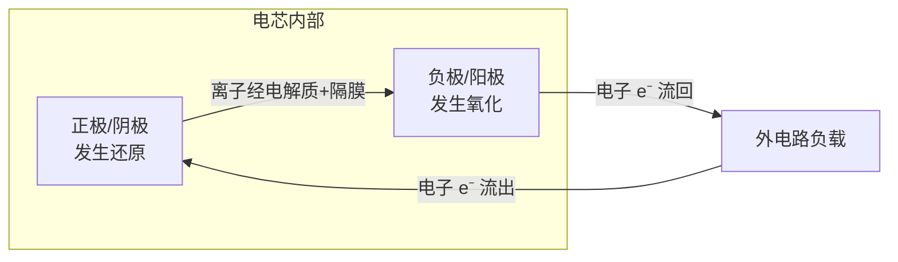
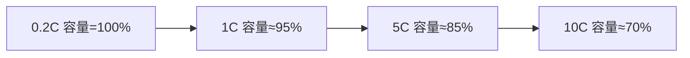
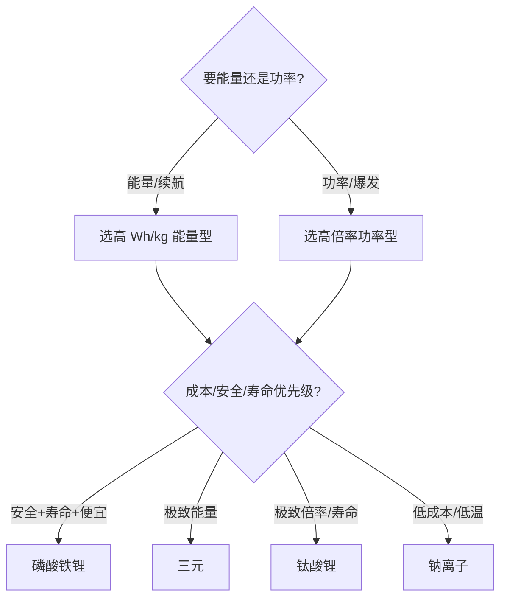

> 这是一篇**综述性总纲**：把"什么是电池"以及倍率、能量密度、重量、寿命等核心维度一次性讲透，不绑定任何具体应用场景。后续我们会按场景拆出分册（动力电池 / 储能电池 / 消费电子电池 / 启动电池等），本文是所有分册的"字典"和入口。

# 电池完全指南：从原理到倍率、能量密度与重量的全维度解析

电池本质上是一个**把化学能存起来、按需放出电能**的装置。理解它，关键不在背参数，而在弄懂一组相互牵制的物理量：**能量（能跑多远）、功率（能多猛）、重量/体积（多重多大）、寿命（能用多久）、安全（会不会炸）**。本文用一条主线串起这些量，并重点拆开你关心的**倍率（C-rate）**与**能量密度**。

---

## 1. 什么是电池

### 1.1 基本定义

电池（Battery / Cell）是利用**氧化还原反应**将化学能转化为电能的装置。日常说的"一块电池"可能是：

- **电芯（Cell）**：单个电化学单元，如一节 18650、一片软包电芯。
- **电池模组（Module）**：多个电芯串并联后的组合。
- **电池包（Pack）**：模组 + 结构件 + BMS + 热管理 + 线束，是装到设备里的成品。

### 1.2 内部结构

- **正极（阴极，放电时）**：电位高，发生还原反应，接受电子。
- **负极（阳极，放电时）**：电位低，发生氧化反应，放出电子。
- **电解质**：传导**离子**（Li⁺、Na⁺、H⁺ 等），是内部"离子通道"。
- **隔膜**：电子绝缘、离子导通，防止正负极短路。
- **集流体**：把电极电流汇集到外部（正极铝箔、负极铜箔常见）。
- **外壳**：钢壳 / 铝壳 / 铝塑膜（软包）。

> 关键直觉：**电子走外电路（做功），离子走内电路（维持电荷平衡）**。两条路缺一不可，否则反应立刻停止。

### 1.3 一次电池 vs 二次电池

| 类型 | 可否充电 | 例子 | 特点 |
| :--- | :--- | :--- | :--- |
| 一次电池 | 否 | 碱性干电池、锂原电池 | 能量密度高、放完即弃 |
| 二次电池（蓄电池） | 可 | 铅酸、镍氢、锂离子、钠离子 | 循环使用，看重寿命与倍率 |

本文重点在**二次电池**（可充电），因为倍率、循环寿命等概念主要服务于可充电场景。

### 1.4 标称电压从哪来

电池电压由正负极材料的**电化学势差**决定。例如：

- 锂离子：正极（钴酸锂/磷酸铁锂等）− 石墨负极 ≈ 3.0~3.7 V 标称。
- 铅酸：约 2.0 V/单格，6 格串成 12 V。
- 镍氢：约 1.2 V/单格。

---

## 2. 核心参数全景速查

先看一张总表，建立全局感，后面逐条展开：

| 参数 | 符号 | 单位 | 含义 | 典型量级（锂离子电芯） |
| :--- | :--- | :--- | :--- | :--- |
| 标称电压 | $V$ | V | 平均工作电压 | 3.2（LFP）~3.7（三元） |
| 容量 | $C$ | Ah / mAh | 能存多少电荷 | 2~5 Ah（单芯） |
| 能量 | $E$ | Wh | 电压 × 容量 | 7~18 Wh（单芯） |
| 质量能量密度 | $E_m$ | Wh/kg | 每公斤带多少能量 | 150~300 Wh/kg |
| 体积能量密度 | $E_v$ | Wh/L | 每升带多少能量 | 300~700 Wh/L |
| 功率 | $P$ | W | 能多快放出能量 | 数 W ~ 数千 W |
| 倍率 | $k$ | C | 充放电速度（相对容量） | 0.5C~10C（甚至更高） |
| 内阻 | $R$ | mΩ | 内部阻力 | 数 mΩ ~ 数十 mΩ |
| 循环寿命 | — | 次 | 容量衰减到 80% 的循环数 | 300（铅酸）~ 6000+（LFP） |
| 自放电率 | — | %/月 | 闲置损耗 | 1%~5%（锂电） |

---

## 3. 电压：不只是"多少伏"

电池的电压不是一个定值，而是一条**随电量变化的曲线**：

- **开路电压（OCV）**：不接负载时的端电压，约等于电动势，随 SOC 单调变化（所以常用 OCV 估算电量）。
- **工作电压（端电压）**：带载时 $V_{\text{端}} = V_{\text{OCV}} - I \cdot R_{\text{内阻}}$（放电），充电时反之 $V_{\text{端}} = V_{\text{OCV}} + I \cdot R$。
- **充电截止电压 / 放电终止电压**：充满、放空的保护边界（如三元锂 4.2 V 充止、2.5~3.0 V 放止）。

**串并联规则**：

- 串联（S）升压：电压相加，容量不变（如 3 串 = 11.1 V 三元）。
- 并联（P）扩容量：容量相加，电压不变。
- "3S2P" = 3 串 2 并，共 6 芯，电压 ×3、容量 ×2。

---

## 4. 容量：能存多少"电"

容量 $C$ 定义为以某电流放电到终止电压所能给出的电荷量：

$$
C = I \cdot t \quad (\text{单位：Ah 或 mAh})
$$

- **额定容量**：标准条件下（通常 0.2C、25 ℃）厂家标称值。
- **实际容量**会随**温度降低**和**倍率升高**而缩水（低温、大电流都"放不出来"）。
- 容量衰减不可逆，是寿命的核心判据。

---

## 5. 能量与能量密度（重点）

### 5.1 能量

$$
E\;[\text{Wh}] = V_{\text{nom}}\;[\text{V}] \times C\;[\text{Ah}]
$$

能量才决定"能跑多远 / 能用多久"，容量只决定"电荷量"。同样 10 Ah：

- 12 V 铅酸 → 120 Wh
- 3.7 V 三元 → 37 Wh

所以比容量（mAh/g）之外，必须看**能量**。

### 5.2 两种能量密度

| 维度 | 符号 | 单位 | 回答的问题 |
| :--- | :--- | :--- | :--- |
| 质量能量密度 | $E_m$ | **Wh/kg** | 每公斤多重能带多少能量（决定续航/航程） |
| 体积能量密度 | $E_v$ | **Wh/L** | 每升多大能装多少能量（决定占空间） |

- 电动车、航空器最关心 **Wh/kg**（重量直接吃掉续航）。
- 手机、便携设备最关心 **Wh/L**（塞不塞得下）。

### 5.3 理论值 vs 实际值

电芯实际能量密度远低于材料理论值，因为电芯里不只是活性物质，还有：

- 电解质、隔膜、集流体（铝/铜箔）、粘结剂、导电剂
- 外壳、极耳、内部空隙

这些"非活性部分"约占 30%~50% 重量。所以**材料突破 ≠ 电芯突破**，工程封装同样关键。

### 5.4 电芯 vs 系统（Pack）能量密度

设备里用的是**电池包**，而包里还有：

- 模组结构件、Busbar、采样线
- **BMS**（电池管理系统）
- 热管理（液冷板/风道/加热膜）
- 外壳与防护

结果是：**系统能量密度通常只有电芯的 60%~80%**。例如电芯 250 Wh/kg，成包后往往 150~180 Wh/kg。谈"续航"时必须用**系统级**数字。

---

## 6. 功率与功率密度

功率是能量释放的**快慢**：

$$
P\;[\text{W}] = V\;[\text{V}] \times I\;[\text{A}]
$$

- **功率密度**：单位质量 / 体积的功率（W/kg、W/L），决定"加速猛不猛、启动快不快"。
- 功率 ≈ 电压 × 电流，而电流又由**倍率**决定（见下节），所以**功率密度和倍率是一体两面**。

直觉：**能量密度决定"能跑多远"，功率密度决定"能跑多快/多猛"**。一个电池往往要在两者间权衡——能量型电芯（高 Wh/kg、低倍率）与功率型电芯（高倍率、略低 Wh/kg）由此分化。

---

## 7. 倍率 C-rate（重点）

这是你最关心的维度，单独讲透。

### 7.1 定义

**1C** 定义为"**用 1 小时把额定容量放完的电流**"。更一般地：

$$
I\;[\text{A}] = k \cdot C\;[\text{Ah}], \qquad k=\text{倍率（C）}
$$

放电时间与倍率成反比：

$$
t\;[\text{h}] = \frac{1}{k}
$$

举例（一块标称 **2000 mAh = 2 Ah** 的电芯）：

| 倍率 | 电流 | 理论放完时间 |
| :--- | :--- | :--- |
| 0.5C | 1 A | 2 h |
| 1C | 2 A | 1 h |
| 2C | 4 A | 0.5 h（30 min） |
| 5C | 10 A | 0.2 h（12 min） |
| 10C | 20 A | 0.1 h（6 min） |

> 充电倍率同理：1C 充电 = 1 小时充满（理想情况），3C ≈ 20 分钟充满。快充就是堆高充电倍率。

### 7.2 倍率 ↔ 功率换算

把倍率换成功率（近似用标称电压）：

$$
P \approx V_{\text{nom}} \cdot I = V_{\text{nom}} \cdot k \cdot C = k \cdot E
$$

即：**功率 = 倍率 × 总能量**。一块 100 Wh 电池：

- 1C 放电 ≈ 100 W
- 10C 放电 ≈ 1000 W（但受热和容量衰减限制）

### 7.3 持续倍率 vs 脉冲倍率

- **持续倍率（Continuous）**：长时间稳定放/充不掉链子的倍率，受**发热**限制。
- **脉冲倍率（Pulse）**：短时（秒级）爆发，靠瞬时大电流，受**温升与极化**限制，不能持续。

规格书常写"持续 3C / 脉冲 10C（10 s）"——别把脉冲当持续用。

### 7.4 容量会随倍率缩水

高倍率下，极化与内阻压降变大，还没放完电端电压就跌破终止电压，于是**可用容量下降**。经验上倍率越高，实测容量越低于标称：

这正是动力电池要专门设计高倍率能力的原因。

### 7.5 高倍率是怎么"炼"出来的

要让电池扛大电流、低发热，工程上做四件事：

1. **减薄电极**：离子扩散距离短，极化小。
2. **高导电网络**：更多导电剂、更优粘结剂，降欧姆内阻。
3. **多极耳 / 全极耳（Tabless）**：缩短电子路径，降 $I^2R$ 发热（特斯拉 4680 的卖点之一）。
4. **优化电解液与配方**：提升离子电导率、 widen 温区。

### 7.6 内阻：倍率的隐形天花板

发热功率：

$$
P_{\text{loss}} = I^2 R_{\text{内阻}}
$$

内阻每降一半，同电流发热降为 1/4。内阻分：

- **欧姆内阻**：材料/界面本征电阻。
- **极化内阻**：电化学反应滞后，随倍率、SOC、温度剧烈变化。

低内阻 = 高倍率能力 + 低发热 + 高能量效率。

---

## 8. 效率：充进去的≠放出来的

- **库仑效率（容量效率）**：放出容量 / 充入容量，锂电常 >99%。
- **能量效率（往返效率）**：放出能量 / 充入能量，扣掉 $I^2R$ 发热与副反应，锂电约 90%~95%，铅酸更低（80% 左右）。

算"真实可用能量"时务必乘能量效率。

---

## 9. 寿命：能用多久

| 寿命类型 | 定义 | 主要杀手 |
| :--- | :--- | :--- |
| 循环寿命 | 充放一次为一循环，到容量剩 80% 的次数 | 深放（高 DOD）、高倍率、高温 |
| 日历寿命 | 随时间自然衰退（即便少用） | 高温、长期满电存放 |

经验规律：

- **DOD 越浅，循环越多**（80% DOD 远多于 100% DOD）。
- **温度每升 10 ℃，衰减显著加快**。
- **长期满电 / 空电存放都伤电池**；锂电最佳存放 ~50% SOC、阴凉处。

---

## 10. 状态量 SOC / SOH / DOD

| 量 | 含义 |
| :--- | :--- |
| SOC（State of Charge） | 剩余电量百分比，0~100% |
| DOD（Depth of Discharge） | 放电深度，DOD = 100% − SOC |
| SOH（State of Health） | 健康度，相对新电池的容量/内阻比，<80% 通常判寿命终 |

BMS 的核心任务就是估算这三者。

---

## 11. 自放电与安全

- **自放电率**：闲置时电量流失，锂电约 1%~5%/月，镍镉/镍氢更高，靠自放电差异还能粗略判断电芯化学体系。
- **安全内核——热失控**：大电流、过充、短路、针刺、挤压会让内部产热 > 散热，温度飙升触发链式放热，可能起火。防御靠：
  - **BMS**（过充/过放/过流/温控保护）
  - 电芯本体保护：PTC（正温度系数开关）、CID（电流中断装置）、泄压阀
  - 化学体系选择：LFP（磷酸铁锂）热稳定性远优于三元，是安全取向的首选

---

## 12. 主要化学体系横向对比（重点大表）

下表覆盖常见二次电池体系，数值为**典型电芯量级**，具体看厂家规格：

| 体系 | 标称电压 (V) | 质量能量密度 (Wh/kg) | 倍率能力 | 循环寿命 | 成本 | 安全性 | 记忆效应 | 典型应用 |
| :--- | :--- | :--- | :--- | :--- | :--- | :--- | :--- | :--- |
| 铅酸 | 2.0/格 | 30~50 | 低~中 | 300~500 | 极低 | 中（酸液腐蚀） | 无 | 汽车启动、UPS、储能 |
| 镍镉 NiCd | 1.2 | 40~60 | 高 | 500~1000 | 中 | 中 | **有** | 工具、航模（渐淘汰） |
| 镍氢 NiMH | 1.2 | 60~120 | 中 | 500~1000 | 中 | 中 | 弱 | 混动（普锐斯）、家电 |
| 钴酸锂 LCO | 3.7 | 150~200 | 低~中 | 500~1000 | 中 | 中 | 无 | 手机、笔记本 |
| 锰酸锂 LMO | 3.7 | 100~150 | 中~高 | 500~2000 | 中 | 中 | 无 | 工具、部分车 |
| 磷酸铁锂 **LFP** | 3.2 | 120~180 | 中~高 | **2000~6000+** | 低~中 | **高** | 无 | 车、储能、大巴 |
| 三元 NMC/NCA | 3.6~3.7 | **200~300** | 中~高 | 1000~2500 | 中~高 | 中（热敏感） | 无 | 乘用车、3C、无人机 |
| 钛酸锂 LTO | 2.4 | 50~90 | **极高** | **5000~20000** | 高 | 高 | 无 | 快充公交、电网调频 |
| 钠离子 | 3.0~3.2 | 100~160 | 中~高 | 2000~4000 | 低（资源广） | 高 | 无 | 储能、低速车（新兴） |
| 固态电池 | — | 目标 300~500 | 高（待量产） | 高（待验证） | 高（初期） | **高** | 无 | 下一代车/航空（展望） |

> 读表要点：**没有"最好"的体系，只有"最合适"的取舍**。要能量选三元，要寿命/安全/成本选 LFP，要极致倍率/寿命选 LTO，要资源与低温选钠电。

---

## 13. 重量与体积：从电芯到系统

### 13.1 电芯重量组成（以三元软包为例，量级）

- 活性物质（正负极材料）：~40%~50%
- 电解质 + 隔膜：~10%~15%
- 集流体（铜/铝箔）：~10%~15%
- 外壳 + 极耳 + 其他：~20%~30%

这正是"理论能量密度 >> 实际"的原因。

### 13.2 包（Pack）重量账

成包后，非电芯部分（结构、BMS、热管理、外壳）通常占整包重量 **20%~40%**：

$$
E_{m,\text{系统}} \approx E_{m,\text{电芯}} \times (0.6 \sim 0.8)
$$

举例：电芯 250 Wh/kg → 系统约 **150~200 Wh/kg**。做整机能效/续航预算时，请务必用系统级数字，否则会严重乐观。

### 13.3 重量为何是系统设计的命门

- 交通工具：重量直接吃续航（背着电池跑，电池自己也重）。
- 航空器 / 便携设备：每克都贵，体积能量密度与质量能量密度双重受限。
- 储能电站：重量不敏感，更看 **Wh/成本（元/Wh）** 与寿命。

---

## 14. 通用选型逻辑（不绑定场景）

拿到需求，按这条链推：

**反推示例**：某设备需 **100 W 持续工作 2 h**，用 **12 V** 系统。

1. 需能量 $E = P \cdot t = 100 \times 2 = 200\ \text{Wh}$
2. 电芯按 200 Wh/kg 算，裸电芯约 **1.0 kg**
3. 成包按 0.7 折算，约 **1.4 kg**（不含余量）
4. 为寿命留余量（常取 1.2~1.5 倍容量），最终选 ~240~300 Wh 包

这套算法任何场景通用，先把"能量需求、电压平台、峰值功率（决定倍率）、空间/重量上限、预算、寿命"列清楚，再回表选体系。

---

## 15. 单位换算速查

| 换算 | 公式 |
| :--- | :--- |
| mAh → Ah | $1\ \text{Ah} = 1000\ \text{mAh}$ |
| 能量 | $\text{Wh} = V \times \text{Ah}$ |
| 倍率 → 时间 | $t(\text{h}) = 1/k$ |
| 倍率 → 电流 | $I(\text{A}) = k \times C(\text{Ah})$ |
| 倍率 → 功率 | $P(\text{W}) \approx k \times E(\text{Wh})$ |
| 质量↔体积能量密度 | 需密度 $\rho$：$E_v = E_m \times \rho$ |

记忆口诀：**C 是"几小时放完"，倍率倒数就是时间；功率 = 倍率 × 能量；能量 = 电压 × 容量。**

---

## 16. 结语与后续

本文把电池的原理骨架和全部核心维度（电压、容量、能量/能量密度、功率/倍率、内阻、效率、寿命、安全、重量）讲清，并横向对比了主流化学体系，可作为后续所有电池分册的"字典"。

后续计划按**应用场景**拆分深入：

- 动力电池（车/工具/无人机）：倍率、功率密度、快充、热管理
- 储能电池（电站/UPS）：成本、循环寿命、LFP 与钠电
- 消费电子电池（手机/笔电）：体积能量密度、轻薄、安全
- 启动电池（汽车启停/摩托）：高倍率脉冲、低温
- 特种电池（低温/高温/柔性/固态）

每个分册会复用本文的参数定义，只聚焦该场景的取舍与典型规格。

## 参考与致谢

- 通用电化学与电池工程常识（电化学势、Nernst 方程、倍率定义等）
- 各体系典型参数区间参考行业通用电芯规格书惯例（数值为量级，具体以厂家 datasheet 为准）
- [Battery University](https://batteryuniversity.com/) —— 电池原理与老化机制的经典公开资料

> 本篇为个人学习综述，参数均为典型量级，实际选型请以具体电芯 datasheet 与实测为准。
