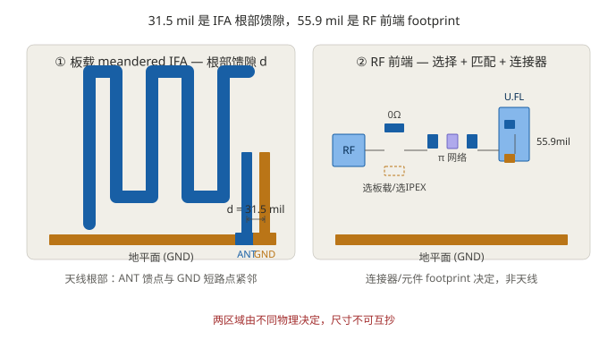
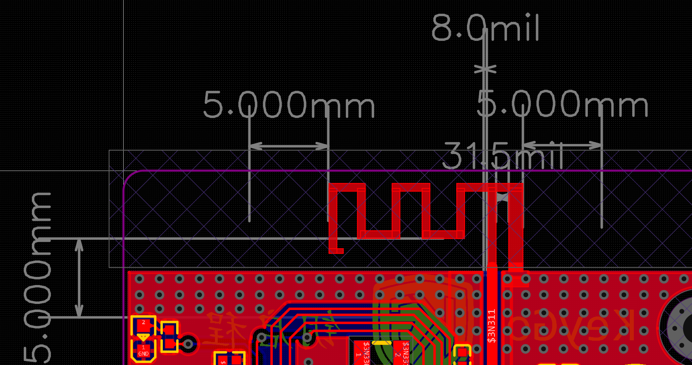
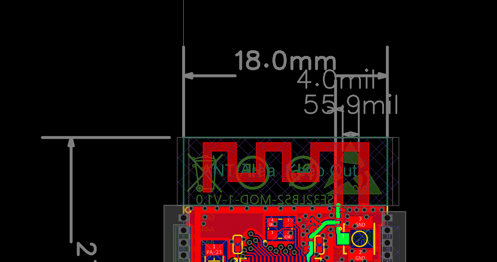

# 板载天线馈点间距辨析：天线馈隙 vs RF 前端布局

!!! warning "草稿 · 研究中"
    本文目前是**研究草稿（WIP）**，结论基于实测观察 + 模组参考原理图 + 公开资料推断，**尚未用 VNA 实测最终确认**。文中待确认项见第 8 节。请带着"先验证、再采信"的态度读，不要当成定论。

---

## 1. 问题是怎么来的

画 CH582M 板载天线时，我量到两类"间距"，一开始分不清：

- 自己蚀刻的 IFA（倒 F）天线，RF 馈点与 GND 馈点之间的间距 **d ≈ 31.5 mil**。
- 参考模组（ESP32-WROOM、SF32LB56-MOD 等）上量到约 **55.9 mil** 的"较大间距"，而且那些模组似乎还有 **0Ω 电阻做板载/IPEX 天线选择**，外加一个 **Π 形网络**。

于是冒出一个问题：**馈点间距到底重不重要？是不是我该把 31.5 mil 改成 55.9 mil？**

> 结论先放这：**31.5 mil 与 55.9 mil 根本不在同一功能区**，不能比较，更不能直接照抄。详见第 2、3 节。

---

## 2. 核心结论：两个无关尺寸

| 量 | 物理落点 | 由什么决定 | 是不是天线参数 |
|---|---|---|---|
| **31.5 mil** | 蚀刻天线本体 ANT 的 RF↔GND 馈点间距 d（根部紧邻） | 天线几何（馈点抽头位置 + 匹配） | ✅ 是 |
| **55.9 mil** | 模组 RF 前端：U.FL/IPEX 连接器信号-地焊盘 + 0Ω 选择器 + Π 匹配网络占位的 layout 尺寸 | 元件封装 / 连接器 footprint / 布线 | ❌ 否 |


*上图为示意草图，未按真实比例、结构未必与实物一致，仅用于区分「天线馈隙」与「RF 前端 footprint」两个区域。*

一句话：**31.5 mil 是天线"自己的事"，55.9 mil 是 RF 前端"连接器与选择器的事"，两者由完全不同的物理决定，互不相干。**

> 注：IFA 的 RF 馈点与 GND 短路点都在天线**根部、地平面边缘**（对应你 PCB 里 ANT1 右下角的 ANT/GND 两个 pad），d 是两者之间的水平小间隙；天线主体向另一端 meander 延伸。d 不是天线两臂或天线两端的对角距离。

### 实物参考

#### 左：本人 CH582M 板载 IFA 的 31.5 mil 馈隙

*图：本人板载 meandered IFA，ANT 与 GND 两个 pad 位于根部右侧，d = 31.5 mil 是两者的水平间隙，属于天线几何参数。*

#### 右：参考模组（SF32LB56-MOD）对应区域，标称 55.9 mil

*图：参考模组在天线/RF 前端区域标出 55.9 mil。该区域同时包含模组天线根部与 0Ω 选择器、U.FL/IPEX 连接器 footprint，55.9 mil 主要由连接器/布局决定，与左侧天线馈隙 d 不是同一物理量，不能混抄。*

---

## 3. 模组 RF 前端长什么样（参考原理图解读）

参考模组在 RF 输出到天线之间，放的是一整块**射频前端电路**，包含三样东西：

### 3.1 0Ω 电阻天线选择器（板载 ↔ IPEX）
RF 出来后分两路：一路走板载天线，一路走 U.FL 座；**用一颗 0Ω 电阻二选一焊接**，把另一条路断开。这就是你看到的"可以通过 0Ω 选择板载还是 IPEX"。

### 3.2 Π 形匹配/滤波网络（不是固定 CCC）
该区域画了多个 C、L 焊盘位置，但**大部分标 NF（Not Fitted，空贴）**，只有少数实焊。典型实焊配置是：

```
RF_OUT → C0124(15pF) 串联 → [0Ω 选择器] → 板载天线 ANT0100
```

> **NF = Not Fitted（空贴）**：这片区域是**可配置匹配网络占位**——同一块 PCB 能适配不同芯片/不同天线的组合。参考设计认为"15pF 串联 + 板载天线"在它那套布局上已经够匹配，所以把其余 C/L 都空着。
>
> 所以你看到的"三个电容"只是**焊盘占位**，不是真焊了三颗电容的 CCC 滤波器；若按 π 网络焊满，常见组合是 `C0124–L0101–C0128`（CLC π）。

### 3.3 U.FL/IPEX 连接器
`J0100 = U.FL-R-SMT-1(80)`（Hirose）。它的信号焊盘到接地焊盘间距、以及整片选择器的走线空间，就是那 **55.9 mil** 的来源——**属于连接器 footprint，不是天线馈隙**。

---

## 4. 为什么 15pF 不能直接抄给 CH582M

15pF 是该参考板**针对它自己的芯片 PA 输出阻抗 + 这条具体天线 + 这套叠层**调出来的匹配值。CH582M 的 BLE 射频口输出阻抗不同，你的板厚/走线/天线也不同：

> **直接抄 15pF 大概率失配。**

正确做法：在 CH582M 的 RF 输出预留 π 网络焊盘，用 VNA 实测 S11，目标 **2.40–2.48 GHz 内 S11 ≤ −10 dB**，再定 C/L 具体值。

---

## 5. 回到天线：馈隙 d 本身的影响

- 对蚀刻 IFA：馈点距短路点的间距 d 是**设计参数**，决定输入阻抗变换比；它和天线臂长、短路位置、净空、地平面是一个整体，一起调到 50Ω。
- d 是**二阶量**，主要由匹配网络吸收；但天线几何要**整体复制或整体仿真**，不能只改其中一个数字。
- 自己用的 **31.5 mil 没问题，保留即可**；用 π 网络把 S11 调好就行。

> 不要把"某模组量到 55.9 mil"当成"天线馈隙该取的值"。55.9 mil 落在 RF 前端，跟天线馈隙 d 是两条平行线。

---

## 6. 模组真正值得抄的，是这三件事

1. **RF 输出端加 π 匹配网络（C-L-C）焊盘**，实测调值——这正是本文第 4 节强调的。
2. **想要外置选项时加 0Ω 选择器**（板载/IPEX 二选一），间距随连接器与 0Ω 封装走，不用刻意凑 55.9。
3. **天线净空 keepout、地平面尺寸、缝合过孔**——这些才是真影响性能的项，详见《阻抗计算实战指南》相关章节。

---

## 7. 一句话收尾

> **天线馈隙 d（你的 31.5 mil）按天线几何保留；55.9 mil 是连接器/选择器的 footprint，不是天线参数——别混抄。CH582M 复制"π 网络占位 + 可选 0Ω 天线/IPEX 选择"这个架构，值自己拿 VNA 调。**

---

## 8. 待确认 / TODO（研究中）

- [ ] 用 VNA 实测"31.5 mil 天线 + CH582M"的 S11，定 π 网络 C/L 值。
- [ ] 在模组实物上确认 55.9 mil 的精确落点：是 U.FL 座 SIG–GND 焊盘间距，还是 0Ω 选择器两焊盘间距（或兼容座脚距）。
- [ ] 核对官方 HID 例程 vs 自己固件的 RSSI，定位 B 版"弱信号"主因（硬件弱 vs 固件唤醒），见《阻抗计算实战指南》B 版案例。
- [ ] 把"参考模组 NF 占位 / 0Ω 选择"的通用画法整理成可复用模板。

---

## 9. 参考

- TI AN043 / SWRA117D《Small Size 2.4 GHz PCB Antenna》— 蛇形 IFA 完整尺寸与"地平面尺寸决定性能"结论。
- TI SWRA046 / swru120b《2.4-GHz PCB Antenna》— 阻抗随地平面/近场/板厚变化，建议馈点加 π 匹配。
- Johanson Technology《Chip Antenna Layout Considerations》— 片式天线净空与馈线细则。
- Infineon/Cypress AN91445《Antenna Design and RF Layout Guidelines》— 净空 0.8mm（更好 2–3mm）、地平面影响。
- Hirose U.FL-R-SMT-1 数据手册 — land pattern（信号-地焊盘间距）。
- 模组参考原理图（ANT0100 板载天线 + J0100 U.FL 选择器 + NF 匹配占位）。
- 实测：自绘 CH582M 板载天线 d ≈ 31.5 mil；ESP32 / SF32LB56-MOD 前端区域 ≈ 55.9 mil。
