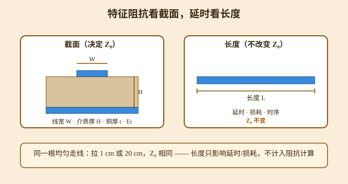

# 特征阻抗与阻抗匹配：为什么只算线宽、不算线长

> 一个常见疑问：大家用「阻抗神器」（Si8000/Si9000、Saturn、嘉立创阻抗工具）做阻抗匹配，算出来的只有线宽，没有导线的长度——为什么？

本篇回答这个问题，并厘清「控制线宽」和「控制线长」到底在控制什么、为什么不能混为一谈。它是 [射频传输线：微带与共面波导](射频传输线-微带与共面波导.md) 在「阻抗本身」这件事上的概念补充，也和 [2.4G 天线设计方案](2.4G天线设计方案.md) 的 50 Ω 匹配前后呼应。

---

## 一、核心结论

**阻抗计算器（Si8000/Si9000、Saturn、嘉立创阻抗工具）算的是特征阻抗 Z₀**，公式本质是：

```
Z₀ = √(L₀ / C₀)
```

- `L₀`：**单位长度电感**
- `C₀`：**单位长度电容**

> **特征阻抗只取决于走线的横截面结构**（线宽、介质厚度、铜厚、介电常数），**和走线总长度无关**。这就是软件只要输入线宽、不需要填长度的根本原因。

换句话说：只要截面不变，不管你拉 1 cm 还是 20 cm，整条线的特征阻抗永远相同。



---

## 二、两个极易混淆的概念

90% 的工程师会在这两个概念上踩坑，先把它们钉死：

### 2.1 特征阻抗 Z₀（阻抗计算器算的东西）

一条均匀走线，只要截面不变，Z₀ 是常数。它的作用是**防止信号反射**——源阻抗 ↔ 传输线 Z₀ ↔ 负载阻抗三者匹配，能量才顺着线走、不反弹。

通俗类比：一根水管的「通水特性」（粗细），只看水管直径，**和水管总长无关**；水管多长，不改变管子本身的粗细。

### 2.2 走线长度控制（等长、最大线长）

长度控制**不改变阻抗大小**，它管的是另外三件事：

| 维度 | 长度在控制什么 | 典型场景 |
|---|---|---|
| 信号传播延时（时序） | 多路信号是否同时到达 | DDR、LVDS、并行总线要做等长 |
| 高频损耗 | 走线越长，导体 / 介质损耗累积越大，幅度衰减 | 高频信号、长距离走线 |
| 反射叠加效应 | 同样一处阻抗不连续（过孔、连接器），长线让反射来回震荡更明显 | 高速串行、长走线 |

> **一句话区分**：
> **控制线宽 = 控制传输线本身的阻抗，解决反射；**
> **控制线长 = 控制延时、损耗、时序，不改变阻抗数值。**

---

## 三、两种场景，分开看待

### 场景 A：普通高速数字 PCB（飞控、USB、以太网、时钟）

目标：保证走线**全程阻抗连续（50 Ω / 100 Ω 差分）**。

操作：用阻抗计算器算出对应层所需线宽，布线全程保持线宽不变。

长度**不需要参与阻抗计算**，但仍有布线约束：

- 尽量缩短走线；
- 差分对内两条走线**必须等长**（不是为了阻抗，是抑制共模噪声、保证相位）；
- 同组并行总线（如 DDR）组内等长，满足时序。

### 场景 B：射频微波电路（天线、滤波器、功分器、λ/4 匹配枝节）

**这里长度直接参与阻抗匹配**——很多人就是在这里产生认知混淆。

射频里其实有两种匹配：

1. **传输线特性匹配**：依旧只控制线宽，得到 50 Ω 主线；
2. **分布式阻抗匹配（Smith 圆图、λ/4 变换器）**：利用**特定长度传输线的相位变换**实现阻抗变换。

> ⚠️ **重点区分**：PCB 主线依旧先用计算器算出 50 Ω 线宽；**λ/4 短线是额外加的匹配枝节**，枝节必须精确控制长度。飞控、普通数字硬件几乎碰不到这种需求，**不要把射频枝节匹配的概念套到数字信号上**。

---

## 四、常见误区纠正

### 误区 1：「阻抗匹配必须同时控制线宽 + 线长」

❌ 错。**阻抗连续（抑制反射）依靠恒定线宽；长度是时序 / 损耗维度的约束，不属于「特征阻抗计算」范畴。**

### 误区 2：走线越长，阻抗会变大 / 变小

❌ 理想均匀传输线，Z₀ 不变。现实长线变差，是**损耗叠加、多处阻抗不连续反复反射**，不是走线本身的 Z₀ 变了。

### 误区 3：既然长度不影响阻抗，走线可以无限拉长

❌ 阻抗数值不变，但：

- 边沿退化、眼图缩小；
- 振铃、EMI 恶化；
- 时序裕量丢失。

**「可以不参与阻抗计算」≠「布线可以不限制长度」。**

---

## 五、落地到你的 VTOL 飞控设计

| 信号 | 阻抗做法 | 长度 / 等长做法 |
|---|---|---|
| 陀螺仪、IMU 的 SPI、高速时钟 | 先算内层 / 外层 50 Ω 线宽，布线保持线宽恒定 | 走线尽量短；SPI 时钟与数据按需等长 |
| 差分总线（RS422、以太网） | 算出差分阻抗 100 Ω 对应的【线宽 + 线间距】 | 全程 W/S 不变；差分对内严格等长 |
| 普通低速信号（UART、GPIO） | 不用阻抗控制 | 优先缩短走线即可 |

---

## 六、最简记忆口诀

> **阻抗看截面（线宽），延时看长短；**
> **数字控线宽防反射，差分等长控相位；**
> **只有射频枝节，才需要精确长度做匹配。**

---

## 延伸

- 想算具体线宽：见 [射频传输线：微带与共面波导](射频传输线-微带与共面波导.md) 第四节的 50 Ω 公式与工具。
- FR4 板材微带 / 带状线 50 Ω、差分 100 Ω 简易计算示例，以及四层板叠层对应的阻抗线宽参考，可进一步补充。
