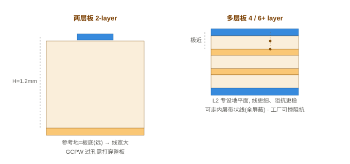

# 特征阻抗与阻抗匹配：为什么只算线宽、不算线长

> 一个常见疑问：大家用「阻抗神器」（Si8000/Si9000、Saturn、嘉立创阻抗工具）做阻抗匹配，算出来的只有线宽，没有导线的长度——为什么？

本篇回答这个问题，并厘清「控制线宽」和「控制线长」到底在控制什么、为什么不能混为一谈。它是 [射频传输线：微带与共面波导](射频传输线-微带与共面波导.md) 在「阻抗本身」这件事上的概念补充，也和 [2.4G 天线设计方案](2.4G天线设计方案.md) 的 50 Ω 匹配前后呼应。

---

## 一、核心结论

**阻抗计算器（Si8000/Si9000、Saturn、嘉立创阻抗工具）算的是特征阻抗 Z₀**，公式本质是：

```
Z₀ = √(L₀ / C₀)
```

- `L₀`：**单位长度电感**
- `C₀`：**单位长度电容**

> **特征阻抗只取决于走线的横截面结构**（线宽、介质厚度、铜厚、介电常数），**和走线总长度无关**。这就是软件只要输入线宽、不需要填长度的根本原因。

换句话说：只要截面不变，不管你拉 1 cm 还是 20 cm，整条线的特征阻抗永远相同。


---

## 二、两个极易混淆的概念

90% 的工程师会在这两个概念上踩坑，先把它们钉死：

### 2.1 特征阻抗 Z₀（阻抗计算器算的东西）

一条均匀走线，只要截面不变，Z₀ 是常数。它的作用是**防止信号反射**——源阻抗 ↔ 传输线 Z₀ ↔ 负载阻抗三者匹配，能量才顺着线走、不反弹。

通俗类比：一根水管的「通水特性」（粗细），只看水管直径，**和水管总长无关**；水管多长，不改变管子本身的粗细。

### 2.2 走线长度控制（等长、最大线长）

长度控制**不改变阻抗大小**，它管的是另外三件事：

| 维度 | 长度在控制什么 | 典型场景 |
|---|---|---|
| 信号传播延时（时序） | 多路信号是否同时到达 | DDR、LVDS、并行总线要做等长 |
| 高频损耗 | 走线越长，导体 / 介质损耗累积越大，幅度衰减 | 高频信号、长距离走线 |
| 反射叠加效应 | 同样一处阻抗不连续（过孔、连接器），长线让反射来回震荡更明显 | 高速串行、长走线 |

> **一句话区分**：
> **控制线宽 = 控制传输线本身的阻抗，解决反射；**
> **控制线长 = 控制延时、损耗、时序，不改变阻抗数值。**

---

## 三、两种场景，分开看待

### 场景 A：普通高速数字 PCB（飞控、USB、以太网、时钟）

目标：保证走线**全程阻抗连续（50 Ω / 100 Ω 差分）**。

操作：用阻抗计算器算出对应层所需线宽，布线全程保持线宽不变。

长度**不需要参与阻抗计算**，但仍有布线约束：

- 尽量缩短走线；
- 差分对内两条走线**必须等长**（不是为了阻抗，是抑制共模噪声、保证相位）；
- 同组并行总线（如 DDR）组内等长，满足时序。

### 场景 B：射频微波电路（天线、滤波器、功分器、λ/4 匹配枝节）

**这里长度直接参与阻抗匹配**——很多人就是在这里产生认知混淆。

射频里其实有两种匹配：

1. **传输线特性匹配**：依旧只控制线宽，得到 50 Ω 主线；
2. **分布式阻抗匹配（Smith 圆图、λ/4 变换器）**：利用**特定长度传输线的相位变换**实现阻抗变换。

> ⚠️ **重点区分**：PCB 主线依旧先用计算器算出 50 Ω 线宽；**λ/4 短线是额外加的匹配枝节**，枝节必须精确控制长度。普通数字硬件几乎碰不到这种需求，**不要把射频枝节匹配的概念套到数字信号上**。

> 💡 对你而言：CH582M 的 50 Ω 馈线是场景 A 的「特性匹配」（只控线宽）；而天线跟前的 **π 型 / 匹配网络**才是场景 B 那种「真正做阻抗变换」的东西——它靠元件值（和枝节长度）把天线/封装的复数阻抗搬到 50 Ω。两者别混。

---

## 四、常见误区纠正

### 误区 1：「阻抗匹配必须同时控制线宽 + 线长」

❌ 错。**阻抗连续（抑制反射）依靠恒定线宽；长度是时序 / 损耗维度的约束，不属于「特征阻抗计算」范畴。**

### 误区 2：走线越长，阻抗会变大 / 变小

❌ 理想均匀传输线，Z₀ 不变。现实长线变差，是**损耗叠加、多处阻抗不连续反复反射**，不是走线本身的 Z₀ 变了。

### 误区 3：既然长度不影响阻抗，走线可以无限拉长

❌ 阻抗数值不变，但：

- 边沿退化、眼图缩小；
- 振铃、EMI 恶化；
- 时序裕量丢失。

**「可以不参与阻抗计算」≠「布线可以不限制长度」。**

---

## 五、FR4 简易线宽计算示例（50 Ω / 差分 100 Ω）

> 下面都是**经验估算值**（FR4 Er≈4.3、铜厚 1 oz≈35 µm）。真实投板请用 Saturn PCB Toolkit 或板厂阻抗计算器按实际叠层复核；**双层板工厂不做阻抗管控，最终 ±15% 波动是正常的**。

### 5.1 微带线 50 Ω 的速算规律

微带（顶层信号 + 板底整块地）的薄带近似公式：

```
Z₀ ≈ 87 / √(Er + 1.41) × ln( 5.98·H / (0.8·W + t) )
```

对 FR4（Er≈4.3）化简，可得一条很好记的规律：

> **50 Ω 微带线宽 ≈ 1.9 × H**（H = 信号层到参考地的介质厚度）

### 5.2 单端 50 Ω 线宽估算表

| 传输线类型 | 叠层 / 板厚 | H（到参考地） | 50 Ω 线宽估算 | 说明 |
|---|---|---|---|---|
| 微带（2 层，1.2 mm） | 全板厚当介质 | 1.2 mm | ≈ 2.2 mm（≈ 87 mil） | 太宽，密集板难布 |
| 微带（2 层，1.0 mm） | 全板厚当介质 | 1.0 mm | ≈ 1.9 mm（≈ 75 mil） | 仍偏宽 |
| 微带（2 层，1.6 mm） | 全板厚当介质 | 1.6 mm | ≈ 3.0 mm（≈ 120 mil） | 更宽 |
| 微带（4 层，prepreg 0.2 mm） | L1 信号 / L2 地（薄半固化片） | 0.2 mm | ≈ 0.38 mm（≈ 15 mil） | 精细，工厂可管控 |
| 微带（4 层，prepreg 0.15 mm） | L1 / L2 更近 | 0.15 mm | ≈ 0.28 mm（≈ 11 mil） | 更细 |
| **GCPW（2 层，1.2 mm）** | 顶层信号 + 两侧地 + 底地 | ≈ 1.2 mm | ≈ 0.6 ~ 0.7 mm（≈ 26 mil） | **你现用的方案**，侧地帮压低 Z₀ |
| GCPW（4 层，prepreg 0.2 mm） | 薄 prepreg + 侧地 | 0.2 mm | ≈ 0.25 ~ 0.4 mm | 更细 |
| 带状线（4 层内层） | 信号夹两层地之间 | 每侧 ≈ 0.2 mm | ≈ 0.2 mm（≈ 8 mil） | 全屏蔽；**不能直连表层天线** |

> 注意：**GCPW 因为有两侧地并联电容，同样 50 Ω 比纯微带窄很多**——这就是你那块 1.2 mm 双层板能用 26 mil 拿到 50 Ω、而不是 2.2 mm 的根本原因。

### 5.3 差分 100 Ω 微带线估算

差分对（edge-coupled microstrip）的差分阻抗大致 `Z_diff ≈ 2 × Z_odd`。经验上，**100 Ω 差分对的线宽 W 与线间距 S 都约等于 H 的量级**：

| 差分对 | 叠层 | H | 线宽 W | 线间距 S | 差分阻抗 |
|---|---|---|---|---|---|
| 微带差分（4 层，prepreg 0.2 mm） | L1 / L2 薄介质 | 0.2 mm | ≈ 0.15 mm（6 mil） | ≈ 0.18 mm（7 mil） | ≈ 100 Ω |
| 微带差分（2 层，1.2 mm） | 全板厚当介质 | 1.2 mm | ≈ 0.9 mm | ≈ 0.9 mm | ≈ 100 Ω（极宽，难布） |

> 差分对要的是**成对 W/S 恒定 + 对内严格等长**，阻抗看的是这对线的几何，不是单根。

---

## 六、板厚怎么选：双层板 vs 四层板

决定 50 Ω 线宽粗不粗的，不是「总板厚」本身，而是**信号层到参考地平面的距离 H**。这正是双层板和四层板的本质差别。



### 6.1 双层板（2-layer）

结构：TOP 走信号 + BOTTOM 一整块地，中间隔着**整块板厚**的 FR4。

- **H = 整板厚**（常见 1.0 / 1.2 / 1.6 mm）→ 微带 50 Ω 线很宽（1.9 ~ 3 mm），密集布局铺不开；
- 用 **GCPW**（顶层信号 + 两侧地 + 过孔篱笆打到底地）能把 50 Ω 压到 ~26 mil，是双层板做 2.4G 的务实解法；
- **阻抗不可控**：嘉立创等双层工厂只按几何蚀刻、不做阻抗管控，最终 ±15% 波动，必须预留 π/L 匹配焊盘后期用 VNA 调；
- 成本低、工艺简单，适合功能不密、对射频裕量要求不极端的板子。

### 6.2 四层板（4-layer）

典型叠层（总厚常 1.0 / 1.2 / 1.6 mm）：`L1 信号 / L2 地 / L3 电源 / L4 信号`。关键不是总厚，而是 **L1 到 L2 只用一层极薄的半固化片（prepreg，约 0.1 ~ 0.3 mm）**。

- **H ≈ 0.2 mm（很近）** → 微带 50 Ω 线宽骤降到 ~15 mil，对蚀刻误差不敏感、好布线；
- **工厂提供可控阻抗服务**：你给目标 Z₀ 和叠层，工厂用场解算器算线宽并 TDR 抽检——这是双层板没有的「免费校准」；
- GCPW 的侧地过孔只需打到相邻的 L2（很近），比双层「打穿整板」容易；
- 代价：成本更高、层压更复杂，内层带状线虽屏蔽最好但不能直连天线（天线馈线那段仍回表层微带/GCPW）。

### 6.3 怎么选（针对你的 CH582M 2.4G 蓝牙）

| 维度 | 双层板（1.2 mm） | 四层板（L1-L2 ≈ 0.2 mm） |
|---|---|---|
| 50 Ω 线宽 | GCPW ≈ 26 mil | 微带 ≈ 15 mil / GCPW 更细 |
| 阻抗是否可控 | 否（几何 + 后期调） | 是（工厂 TDR） |
| 布局密度 | 一般（线偏粗） | 好（线细） |
| 射频裕量 | 靠 π 匹配 + VNA 实测补 | 天生更稳 |
| 成本 | 低 | 高 |

- **简单模组 / 验证板**：双层板完全够，GCPW + 过孔篱笆 + 底层净空 + π 匹配焊盘，按你现有方案走；
- **密度高 / 对射频一致性要求高**：上四层板，L1 走 RF、L2 整层地，阻抗更稳、布线更轻松。

---

## 七、落地到你的 CH582M 2.4G 蓝牙天线设计

CH582M 是 WCH 的 BLE SoC，2.4 GHz 射频口需要一条 **50 Ω** 通路连到天线。结合上面几条，落到你板子上的实操要点：

| 项目 | 做法 |
|---|---|
| RF 接口 | CH582M 通常为**单端 50 Ω** 输出，经外部 **π 型匹配网络**接到天线（具体看 datasheet / 参考设计；若为差分输出则需先过 balun 转单端）。 |
| 馈线 | 用阻抗计算器按你的叠层算出 50 Ω 线宽（双层 GCPW ≈ 26 mil / 8 mil；四层更细），布线**全程等宽、等间隙**。 |
| 拐角 | 用 45°，禁止 90° 直角（局部电容突变 → 反射）。 |
| 回流 / 屏蔽 | GCPW 两侧地连续等宽，过孔篱笆 800 ~ 1200 µm 一排钉到主地。 |
| 净空 | 天线本体与馈线正下方及周围 ≥ 5 mm 禁止铺铜 / 走线 / 金属件。 |
| 匹配 | 必留 π/L 匹配焊盘（0201/0402），第一版靠 VNA 扫 S11 把天线阻抗搬到 50 Ω 中心。 |
| 长度 | 馈线长度**不参与 50 Ω 计算**，但 BLE 2.4G 损耗敏感，尽量短；天线跟前的匹配网络才是真正「吃长度/相位」做变换的地方。 |

> 一句话：**线宽管「这条 50 Ω 对不对」，长度管「损耗/净空/匹配网络」**——和你那块 CH582 板的射频成败，分清楚这两件事就少踩一大半坑。

---

## 八、最简记忆口诀

> **阻抗看截面（线宽），延时看长短；**
> **数字控线宽防反射，差分等长控相位；**
> **只有射频枝节，才需要精确长度做匹配。**

---

## 延伸

- 想算具体线宽 / 看阻抗公式：见 [射频传输线：微带与共面波导](射频传输线-微带与共面波导.md) 第四节与「两层 vs 多层板」一节（含叠层 SVG）。
- 实际投板前，用 **Saturn PCB Toolkit**（免费）或板厂官网阻抗计算器按真实叠层复核线宽；双层板务必预留匹配焊盘、以 VNA 实测为准。
- CH582M 射频口的单端 / 差分属性、推荐匹配拓扑，以 **WCH 官方 datasheet 与评估板参考设计** 为准。
- 要一套可直接抄的 CH582M 板材 + 线宽方案、净空/馈线下方留地做法、馈线长度约束与嘉立创下单备注模板，见 [CH582M 2.4G 天线：阻抗计算与 FR4 板材完整方案](CH582M 2.4G天线阻抗与FR4方案.md)。
- 嘉立创下单时阻抗计算器那 8 种外层模式（单端/共面 × 微带/CPW × 带/不带防焊）具体选哪个、W/S/T/D1/Er1 怎么填 → [嘉立创阻抗计算器详解：8 种模式怎么选](../../EDA/嘉立创EDA/嘉立创阻抗计算器详解.md)。
