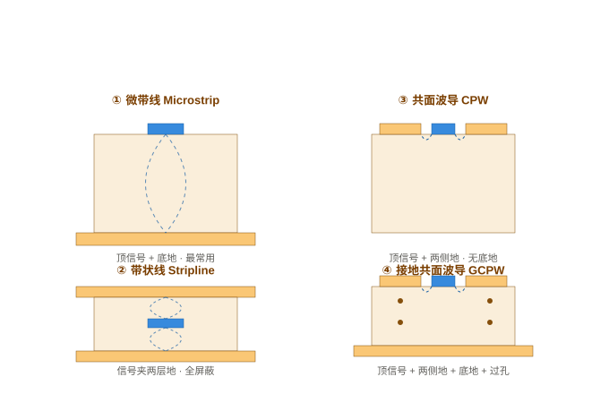
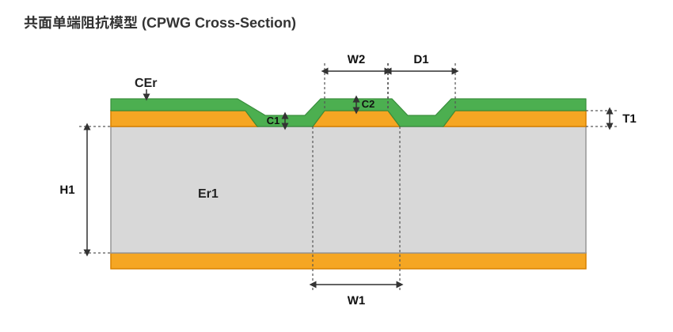

# 阻抗计算实战指南：从选模型到落地 PCB

> 一个被反复验证的残酷事实：**很多人「算对了线宽，板子还是没蓝牙 / 没 WiFi / 眼图崩」**。
> 原因是——**阻抗计算 ≠ 阻抗设计**。计算器只解决「这个截面该多宽」，真正决定好坏的是「模型选对 + PCB 1:1 还原 + 工艺能耐受」。
>
> 本文给一套可照做的 4 步流程，外加最常见的 8 个坑，并用一个真实的「算对却完全没蓝牙」案例收尾。

概念原理见 [特征阻抗与阻抗匹配](特征阻抗与阻抗匹配.md)；工具里 8 种模式怎么选见 [嘉立创阻抗计算器详解](../../EDA/嘉立创EDA/嘉立创阻抗计算器详解.md)；CH582M 具体线宽表见 [CH582M 2.4G 天线阻抗与 FR4 方案](CH582M 2.4G天线阻抗与FR4方案.md)；结构怎么选见 [射频传输线：微带与共面波导](射频传输线-微带与共面波导.md)。

---

## 一、先厘清：计算器到底在算什么

阻抗计算器（Si8000/Si9000、Saturn、嘉立创在线工具）算的是**特征阻抗 Z₀**，公式本质是：

```
Z₀ = √(L₀ / C₀)
```

- `L₀`：单位长度电感
- `C₀`：单位长度电容

> **特征阻抗只取决于走线的横截面结构**（线宽、介质厚度、铜厚、介电常数、是否共面地），**和走线总长度无关**。这就是软件只要线宽、不填长度的根本原因。

换句话说：只要截面不变，拉 1 cm 还是 20 cm，整条线的特征阻抗永远相同。

!!! warning "计算器输出的是「理想结构下的推荐尺寸」，不是「保证值」"
    它假设：共面地无限宽且理想接地、绿油参数标准、蚀刻零误差、参考地完整连续。**你板子上只要有一条没满足，实测阻抗就会偏离。** 所以「算对了」只完成了一半。

---

## 二、正确算阻抗的 4 步流程

### 步骤 1：确定传输线结构（最关键，90% 的错都在这）

先回答两个问题，再开计算器：

**① 单端还是差分？**

| 信号类型 | 目标阻抗 | 例子 |
| --- | --- | --- |
| 单端射频（RF 馈线） | 50 Ω | CH582M RF 引脚、nRF24、ESP32 射频 |
| 差分高速数字 | 100 Ω | USB D+/D-、RS422、以太网、LVDS |

**② 射频线两侧有没有地？**

- **两侧无地** → 选「单端阻抗（外层）」/「差分阻抗（外层）」= **微带线（Microstrip）**
- **两侧有地** → 选「共面单端（外层）」/「共面差分」= **接地共面波导（GCPW / CPWG）**



> ⚠️ **模型必须和 PCB 实际结构一致。** 这是最容易翻车的地方：你在射频线两侧铺了地，结构已经是 GCPW，却还按普通微带去算 → 算出来的线宽完全失效，实测阻抗直接崩。反之，两侧没地却选了共面模型也一样错。

### 步骤 2：填真实的板厂工艺参数

打开嘉立创（或 Saturn / Si8000）计算器，按**你下单的真实工艺**填：

| 参数 | 怎么填 | 坑点 |
| --- | --- | --- |
| 板厚 | 成品板厚（如 1.0 / 1.2 / 1.6 mm） | **成品板厚 ≠ 介质厚度 H**；嘉立创 JLC0212 的 1.2 mm 双面板，芯板 H 只有 41.93 mil ≈ 1.065 mm |
| 层数 | 2 / 4 / 6 | 决定参考层位置 |
| 铜厚 | 1 oz（35 µm）/ 0.5 oz / 2 oz | 共面模型里铜厚影响明显 |
| 介电常数 εr | FR4 默认 ~4.4，按板厂实际 | 不同品牌 4.2~4.6 波动 |
| 目标阻抗 | 单端 50 / 差分 100 | 别填反 |
| 参考层 | 上/下参考层（L2 地等） | 微带看「下参考层」 |
| 防焊 | 带防焊（默认绿油）/ 不带防焊（开窗） | 见下方「防焊陷阱」 |

**防焊陷阱（极重要）**：

- **带防焊**：走线盖绿油，绿油 εr≈3.3~3.8，抬高有效介电常数、阻抗略降。
- **不带防焊**：假设走线裸铜对空气（εr=1），同等线宽下 Z₀ 更高，计算器会自动加宽线宽。
- ⚠️ **选了「不带防焊」≠ 板厂自动给你开窗！** 你必须在 PCB 的阻焊层（Solder Mask）真画开窗，把绿油去掉；否则实物还是盖着绿油，算出来的线宽**完全失效**。

### 步骤 3：拿到线宽/间隙，在 PCB 里 1:1 还原

计算器吐出来两个关键尺寸，必须原样落到板子上：

- **W1 = 信号线宽**
- **D1 = 阻抗线到铜距离**（GCPW 的缝宽 S）

还原时最容易漏的三件事：

1. **共面地必须真的铺满**，而且沿射频线两侧打**地篱笆过孔**（间距 0.8~1.5 mm，孔径 800~1200 µm）打穿连到参考地。否则共面地是「浮空岛」，根本不计入模型，选 GCPW 模型等于白选。
2. **馈线下方参考地必须连续完整**，不能被电源/信号走线切碎。
3. **天线本体不控阻抗**，只控馈线。天线按芯片原厂给的尺寸画外形 + 净空 keepout（≥ 5 mm），不要拿阻抗计算器去算天线振子。

> 💡 射频馈线长度只要不是极端长（几 cm 量级），对 2.4G 没大问题；重点是**截面连续 + 回流路径完整**。长度影响的是延时和损耗，不是 Z₀。

**关于「成品板厚」与「介质厚度 H」的再强调（以嘉立创 JLC0212 为例）**

很多工程师手算阻抗时，直接拿"1.2 mm"当 H 代入公式，结果会系统性地算低。嘉立创 JLC0212 1.2 mm 双面板的真实叠层如下：

| 层 | 材料 | 厚度（mil） | 厚度（mm） |
| --- | --- | --- | --- |
| L1 铜 | 外层铜 | 0.60 | 0.0152 |
| 芯板介质 | FR4 | **41.93** | **1.0650** |
| L2 铜 | 外层铜 | 0.60 | 0.0152 |
| **合计成品板厚** | — | **43.13** | **1.0954** |

> 成品标称 1.2 mm 是总厚度范围 0.99~1.2 mm 的标称值，实际有效介质 H 是 **1.065 mm**。在线计算器（嘉立创、华秋）会自动处理这个换算；但你自己用 Saturn / 公式手算时，**H 必须填 1.065 mm，不能填 1.2 mm**。

### 步骤 4：交叉验证 + 留余量

- **换一个工具复核**：嘉立创算完，再用 Saturn（Coplanar 模块）或 AD 内置 impedance calculator 算一遍。误差 ±5% 以内就放心。
- **接受工艺公差**：板厂蚀刻 ±0.5 mil、介质厚度/εr 有批次波动，**双层 ±15%、四层 ±10% 是常态**。
- **务必留可调余量**：π 型匹配焊盘 / 0Ω 跳线 / 预留串联元件，后期用 VNA 实测 S11 微调。别指望「一次算准、板子免调」。

---

## 三、最常见的 9 个坑

### 1. 模型选错（两侧有地却选普通微带）
最致命。结构已经是 GCPW，按微带算 → 线宽偏粗，实测阻抗偏低一大截。

### 2. 共面地没打「地篱笆」过孔 → 浮空
画了两侧铺铜但没打过孔连到地层，共面地不生效，模型等于没选。

### 3. 选了「不带防焊」却没真开窗
计算器按裸铜算的线宽，你实物还盖着绿油 → 阻抗严重偏离 50Ω。

### 4. 缝宽被蚀刻残铜 / 锡珠桥接 → 短路
GCPW 缝只有 8 mil 时尤其脆。一旦桥接，信号线对地短路，天线直接死。

### 5. 天线本体没随板厚重调
PCB 天线（倒 F / 蛇形 / IF）谐振频率对板厚极敏感。板厚从 1.2 → 1.0 mm，天线几何必须重调，不能只改馈线宽度就沿用旧天线外形。

### 6. 绿油影响被忽略
带 / 不带防焊的有效 εr 不同，线宽差几个 mil。2.4G 留绿油影响很小，不必强行开窗；开窗主要给 5G/WiFi/毫米波/天线振子。

### 7. 把计算器输出当「保证值」
实测受 Er、厚度、蚀刻、绿油多重影响，±10~15% 波动正常。必留匹配余量。

### 8. 只看线宽、不看回流路径
地平面被打碎、参考层缺失，比线宽偏 2 mil 严重得多。回流路径断了，Z₀ 全乱。

### 9. 把「成品板厚」直接当「介质厚度 H」代入公式
这是手算阻抗时最常见的系统性错误。JLC0212 标称 1.2 mm，实际芯板 H 只有 1.065 mm；你按 1.2 mm 手算，Z₀ 会系统性偏低。在线计算器会自动处理叠层；但用 Saturn / 公式时，H 必须填芯板厚度。

---

## 四、真实案例：算对线宽，却完全没蓝牙

> 这是一次真实的 CH582M 2.4G BLE 调试，用来说明「步骤 1~3 算对了，步骤 3 的 PCB 还原没做到位」会怎样。

**背景**

- 芯片 CH582M，射频端口单端 50 Ω。
- `VINTA = 1.04 V`：这是芯片内部 1.05V 射频 LDO 输出，**说明射频部分供电正常**，不是「射频没上电」。
- 能烧录程序，同份固件在**淘宝开发板**和**自画的 A 版**都能正常广播蓝牙。
- 自画两版：

| 版本 | 线宽 W | 缝宽 S（到铺铜距离） | 板厚 | 结果 |
| --- | --- | --- | --- | --- |
| A 版 | 26 mil | 10 mil | 1.2 mm | ✅ 有蓝牙信号 |
| B 版 | 30.5 mil | 8 mil | 1.0 mm | ❌ 能烧录，但完全搜不到蓝牙 |

**B 版线宽算对了吗？**

在嘉立创计算器选「共面单端（外层）」，填 1.0 mm 板、1 oz、W=30.5 mil、D1=8 mil，反算 **50.0755 Ω**——**线宽选得完全正确**，1.0 mm 板做 50Ω GCPW 本来就该 ≈31 mil。

**那为什么完全没蓝牙？**

阻抗就算偏到 40Ω、60Ω，BLE 也只是距离变短、不会「完全没」。**「完全没」几乎一定是短路 / 断路 / 时钟没起**，而不是阻抗偏几欧姆。按概率排：

1. **8 mil 缝被桥接**（锡珠 / 蚀刻残铜）→ 馈线对地短路，天线死。30.5 mil 线配 8 mil 缝，缝比 A 的 10 mil 更窄，更易桥。
2. **共面地没打地篱笆过孔**连到底层地 → 回流路径断，不辐射。
3. **天线本体没随 1.0 mm 板厚重调** → 谐振频率推偏出 2.4G。
4. B 板个体焊接 / 来料问题（32 MHz 晶振没起振、匹配电容虚焊）。

**现场排查顺序（不靠仪器优先）**

1. 万用表二极管档：量「馈线走线中点」对 GND 的阻值（别直接量天线焊盘，板载 PCB 天线的 RF 脚可能通过天线本体直流连到 GND）。正常应高阻/开路；若几 Ω → 短路（缝桥了）。同时量「芯片 RF 脚 → 馈线中点」是否通，确认没有开路。
2. 放大镜 / 显微镜对比 A、B 的 8 mil 缝，看有没有铜 / 锡桥。
3. 手机 nRF Connect 扫：能扫到但很弱 = 天线/匹配；**完全扫不到** = 更像结构短路或 32M 没起。
4. 示波器看 32 MHz 晶振两引脚是否起振（~1 Vpp）。
5. 叠 A/B 的 RF 区 Gerber 比一比，看 B 除了这仨参数还动了啥。

**教训**

- **计算器算对 ≠ 板子一定好。** 模型对了，还要结构 1:1 还原 + 工艺无缺陷。
- 急着要板子：下一版直接克隆 A 的 RF 区（26/10/1.2 mm + 同样的地篱笆过孔 + 同样的天线几何），别动尺寸。
- 非要 1.0 mm 板：馈线宽度选得对（≈31 mil），但**天线几何也得按 1.0 mm 重调**，不能只改馈线、沿用 A 的天线外形。

---

## 五、工具清单与怎么用

### 1. 阻抗计算软件

| 工具 | 用途 | 特点 / 注意 |
| --- | --- | --- |
| **嘉立创在线阻抗计算器** | 8 种模式一键反算，国内下单最常用 | 模式含义见 [嘉立创阻抗计算器详解](../../EDA/嘉立创EDA/嘉立创阻抗计算器详解.md)；默认叠层按嘉立创工艺库 |
| **华秋 DFM 阻抗计算** | 华秋下单配套，集成在 DFM 客户端里 | 叠层/材料参数和华秋工艺库绑定，可导出压合结构 |
| **Saturn PCB Toolkit** | 离线小工具，自带 Coplanar / 微带 / 带状线 | 免费、轻量，GCPW 比很多在线工具更灵活；但默认参数未必匹配你板厂 |
| **Polar Si8000 / Si9000** | 行业事实标准，板厂高频常用 | 正版付费；Si9000 覆盖最全的共面/差分/嵌入式结构，是“下血本”时的参考 |
| **Altium 内置 Impedance Calculator** | 画板时直接算、直接约束规则 | 需先正确建 Stackup，否则算出来也错 |
| **ADS / HFSS / Sonnet** | 全波 / 3D 场求解器 | 用于高速/毫米波、差分过孔、天线等复杂结构；杀鸡不用牛刀 |

!!! tip "要不要下载 Si9000？"
    如果你只是做 2.4G 蓝牙、USB2.0 差分、普通 50Ω 馈线，**嘉立创 + 华秋 + Saturn 完全够用**，差别只在默认叠层参数。Si9000 是专业板厂/高速工程师的标配，但正版不便宜；不要盲目下载——先把你当前问题的根因（结构/工艺）找到，比追求第 4 位小数重要得多。

### 2. 射频调试常用仪器

| 工具 | 用途 | 使用阶段 |
| --- | --- | --- |
| **VNA（矢量网络分析仪）** | 测 S11 / S21，看天线匹配、馈线阻抗、反射损耗 | 板子出来后调 π 匹配，最终裁决 |
| **频谱分析仪 + 近场探头** | 看 2.4G 辐射有没有、功率多大、谐波在哪 | 排查“有没有发射”最快 |
| **TDR（时域反射计）** | 看整条传输线阻抗沿路径是否连续 | 高速数字/长馈线用得多 |
| **示波器** | 看 32 MHz 晶振起振、数字信号质量 | 调试全过程 |
| **万用表（二极管/通断档）** | 快速排查短路 / 虚焊 / 开路 | 上电前必做 |

### 3. PCB 可制造性 / 文件检查工具

| 工具 | 用途 | 注意 |
| --- | --- | --- |
| **华秋 DFM** | 一键检查间距、线宽、孔径、阻抗、SMT 可焊性 | 国内常用，阻抗模块已集成 |
| **嘉立创 DFM（立创助手）** | 嘉立创下单前检查 | 和嘉立创工艺库绑定 |
| **CAM350 / GC-Prevue** | 看 Gerber、量尺寸、查层对齐 | 老派但可靠 |
| **Altium CAMtastic** | AD 自带 Gerber 查看 | 不用额外装软件 |

---

## 六、为什么不同工具算出来不一样？（以嘉立创 vs 华秋 DFM 为例）

你这次用华秋 DFM 和嘉立创在线算同一组 1.2 mm 双面板，数据如下：

| 工具 | 板材 | W | S（到铜距离） | 成品板厚 | 芯板 H | 结果 |
| --- | --- | --- | --- | --- | --- | --- |
| 嘉立创在线 | **JLC0212** | 26.5 mil | 8 mil | 1.2 mm | 41.93 mil / 1.065 mm | **53.79 Ω** |
| 嘉立创在线 | **JLC0212** | 26.5 mil | 10 mil | 1.2 mm | 41.93 mil / 1.065 mm | **57.55 Ω** |
| 华秋 DFM | 1.2 mm 双面板 | 26.5 mil | 8 mil | 1.2 mm | 41.93 mil / 1.065 mm | **55.11 Ω** |
| 华秋 DFM | 1.2 mm 双面板 | 26.5 mil | 10 mil | 1.2 mm | 41.93 mil / 1.065 mm | **58.84 Ω** |

下图是共面单端（CPWG / GCPW）的截面模型示意图，标出了 W1/W2/D1/H1/T1/C1/C2/CEr/Er1 等参数在叠层中的物理位置（信号线上窄下宽的蚀刻梯形、两侧共面地与底层参考地、绿油在沟槽处下凹）：



> 图中各标注对应的典型取值即上表中华秋 DFM 的 26.5 mil / 8 mil 计算结果：W1=26.50、W2=25.70、D1=8.00、H1=41.9291、Er1=4.2000、T1=1.3780、C1=1.1969、C2=0.5000、CEr=3.5000，最终反算 **55.11 Ω**。

**关键发现：两家工具给出的芯板介质厚度 H 其实一致（都是 41.93 mil ≈ 1.065 mm）**，差异主要来自：

- **介电常数 Er**：华秋默认 Er1=4.2，嘉立创 JLC0212 默认可能按 4.4~4.5 建模。Er 越小，Z₀ 越高，所以华秋结果整体比嘉立创高 1~2 Ω。
- **阻焊厚度 / εr**：绿油厚度、绿油 εr（3.3~3.8）的建模方式两家不同。
- **场求解器 / 铜箔粗糙度模型**：2D 场求解器的网格、边缘蚀刻修正、粗糙度经验公式都有差别，2.4G 下通常造成 1~3 Ω 分散。

**结论**：

- 华秋和嘉立创的结果相差 **1.3~1.5 Ω**，属于正常工具差异，不是你填错了。
- 你 A 版实际用的是 **26 mil / 10 mil / 1.2 mm**，按嘉立创 JLC0212 反算约 **58 Ω** 左右，但它**照样能工作**——这说明 BLE 2.4G 对 ±8 Ω 的失配相当宽容。
- B 版 **30.5 mil / 8 mil / 1.0 mm** 嘉立创反算约 50 Ω，线宽本身没错；"完全没蓝牙"不是阻抗偏这几欧姆，而是结构/工艺问题。

**那你该信谁？**

1. **优先信你下单那家板厂的计算器**（嘉立创下单就信嘉立创，华秋下单就信华秋），因为它用的材料参数最接近实际出货。
2. **再用另一个工具做交叉验证**：两者差 3~5 Ω 是正常误差；差超过 10 Ω，检查 Er、H、防焊参数是否一致。
3. **最后以 VNA 实测为准**：板子出来后看 S11，用 π 型匹配网络把中心频点调到 2.4 GHz。

---

## 七、速查口诀

> 单端 50 / 差分 100；
> 两侧无地选微带，两侧有地选共面；
> 算完线宽要还原，共面地要打过孔；
> 天线不控阻抗，只控馈线别忘净空；
> **计算器算对 ≠ 板子好，短路断路先排查。**

---

## 附：CH582M 推荐射频参数（GCPW）

| 板型 | 线宽 W | 缝宽 S | 板厚 | 说明 |
| --- | --- | --- | --- | --- |
| 双面板 | 26 mil | 10 mil | 1.2 mm | 嘉立创 JLC0212 反算 ≈58 Ω（A 版实测可用，说明 BLE 对 ±8 Ω 宽容） |
| 双面板 | 26 mil | 8 mil | 1.2 mm | 嘉立创 JLC0212 反算 ≈54 Ω |
| 双面板 | ≈31 mil | 8 mil | 1.0 mm | 嘉立创反算 ≈50 Ω（B 版线宽正确，失败在结构/工艺） |

完整线宽表、净空做法、嘉立创下单阻抗备注模板见 [CH582M 2.4G 天线阻抗与 FR4 方案](CH582M 2.4G天线阻抗与FR4方案.md)。
