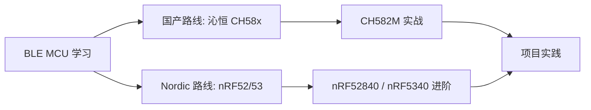

# 嵌入式开发

这里记录我的嵌入式开发学习笔记，重点聚焦 **BLE MCU / SoC** 的学习与项目实践。

## 学习路线图

## 当前进度

| 平台 | 芯片 | 状态 | 备注 |
|------|------|------|------|
| 沁恒 WCH | CH582M | 🚧 学习中 | RISC-V + BLE 5.3 |
| Nordic | nRF52840 / nRF5340 | ⏳ 计划中 | ARM Cortex-M + BLE 5.3/5.4 |

## 笔记目录

- [CH582M 特性与概览](BLE%20MCU&SOC/WCH/CH58(2)3M/CH582M%20特性与概览.md) — 核心规格、外设速查、系列选型对比
- [CH582M Flash 存储与 SNV 详解](BLE%20MCU&SOC/WCH/CH58(2)3M/CH582M%20Flash%20存储与%20SNV%20详解.md) — Flash 分区地图、配对绑定机制、外接存储扩展方案
- [CH582M DataFlash 地址偏移实践](BLE%20MCU&SOC/WCH/CH58(2)3M/CH582M%20DataFlash%20地址偏移实践.md) — 自定义配置区与 BLE SNV 共存时的地址规划

---

> 💡 **学习资源**
> - 沁恒官网：[https://www.wch.cn](https://www.wch.cn)
> - Nordic DevZone：[https://devzone.nordicsemi.com](https://devzone.nordicsemi.com)
> - BLE 核心规范：[Bluetooth SIG](https://www.bluetooth.com/specifications/)
