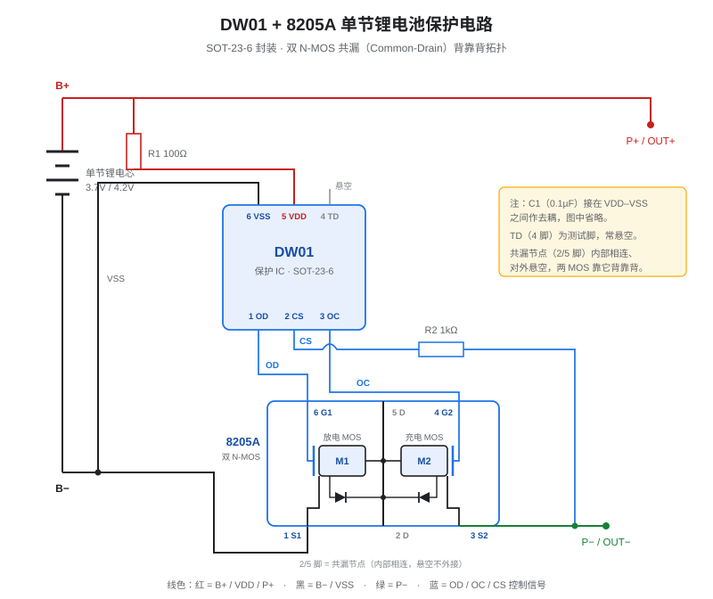
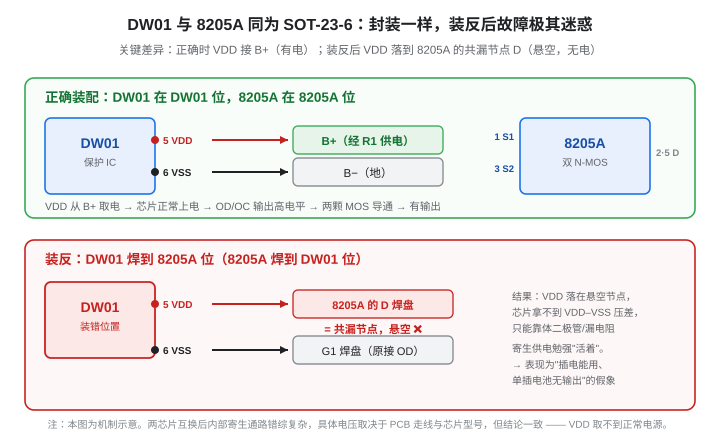

# KeyGo 电池保护踩坑：DW01 + 8205A

> 分类：硬件与半导体 / 汽车电子
> 项目类型：实战踩坑（基于 CH582M 的 BLE 智能车钥匙 KeyGo）
> 关联主文：[KeyGo：BLE 手机钥匙](KeyGo-BLE手机钥匙.md)
> 关联页面：[KeyGo 调试踩坑记录](KeyGo-调试踩坑.md) · [KeyGo 电源选型（5V→3.3V LDO 与低功耗）](KeyGo-LDO电源选型与低功耗.md)
> 更新日期：{{ git_revision_date_localized }}

---

本页记录 KeyGo 在电池保护电路上踩的一整串坑：板子原本为锂电池设计了板载 `DW01 + 8205A` 保护，后来考虑到大部分软包聚合物锂电池**自带保护板**，于是想着可自选启/禁用板载保护以降低功耗（低功耗蓝牙项目），结果一路遭遇"禁用后功耗高、插电能用、单插电池无输出、充不进电"等等诡异现象。

这不是一篇"芯片教程"，而是一条完整的**工程诊断链**：现象 → 误判 → 反转 → 真因。其中最值钱的部分不是结论，而是**前面几轮假设为什么会全部跑偏**。

!!! note "来源与可靠性说明"
    本页内容来自一次真实的排查对话，但**不照搬**对话中的 AI 结论——整理时已对照官方 datasheet 逐条核实并修正。标注约定：

    - ✅ **已核实**：与官方 datasheet 或权威来源一致。
    - ❓ **待核实**：社区/对话流传、未找到官方依据。
    - ⚠️ **存疑或已修正**：对话中 deepseek 的说法有误，本页已改正。
    
    **本次核实发现对话中 AI 有两处实质错误**（见 1.2 与 5.3 节）：一是把 8205A 当成 8 脚芯片，二是给出的 TSSOP-8 引脚表与官方 datasheet 不符。整段排查虽然最终找到了正确根因（芯片装反），但中间几轮"芯片锁死"的推论是**错的**，本页会明确标注。

    **另有一处是本页初稿自己的错误，已被实测推翻并在 2.3 节更正**：初稿据 datasheet 推断"不接电池插电通常不会有输出"，实测证明**空载可以正常输出**，而且这是由拓扑决定的必然行为。这次更正本身也是本页方法论（第 7 节）的一个现场演示。

---

## 1. 先搞清楚 DW01 + 8205A 到底是什么

### 1.1 两颗芯片的分工

一句话概括：**DW01 是"大脑"（判断该不该断电），8205A 是"手"（真正切断电流的两颗 MOS 管）**。DW01 本身不流过主电流，它只负责监测并输出电压信号去驱动 8205A 内部的 MOS 管栅极。

典型搭配是 `DW01 + FS8205A`，这是单节锂电池保护板最常见的分立方案，也是 TP4056 充电模块背面那套电路的标配。

### 1.2 引脚定义（务必先确认封装！）

这是本次排查最大的教训之一：**同一个型号、不同封装，引脚定义完全不同。**

!!! warning "先记住这一句：8205A 分为 SOT-23-6 和 TSSOP-8 两种封装"
    **8205A 分为 SOT-23-6 和 TSSOP-8 两种封装，两者的引脚定义完全不同**（FS8205A、JMTM8205A 等各家同型号器件同样如此）。

    查资料、量电压、动烙铁之前，**第一步永远是确认你手上和板上是哪一种封装**。因为这两种封装的引脚排列**毫无对应关系** —— 按错封装去量电压、去短接、去推断故障，后面的每一步都建立在错误前提上。

    本次排查中 AI 就是在这里栽的：它把板上的 8205A 当成了 8 脚（TSSOP-8），于是整条推理链从第二步起就跑偏了（见 5.3 节）。

#### DW01（SOT-23-6）

✅ 已核实（萨科微 slkormicro 官方 DW01 datasheet + 多个来源一致）

| 引脚 | 符号 | 功能 |
|:---:|:---:|---|
| 1 | **OD** | 放电 MOS 管控制输出（过放/过流时拉低） |
| 2 | **CS** | 充放电电流检测输入 |
| 3 | **OC** | 充电 MOS 管控制输出（过充时拉低） |
| 4 | **TD** | 测试脚，用于缩短延时，**通常悬空** |
| 5 | **VDD** | 芯片供电，经 R1（约 100Ω）接电池正极 |
| 6 | **VSS** | 芯片地，接电池负极 |

#### 8205A 封装一：SOT-23-6（双 N 沟道 MOS）

✅ 已核实（UMW / JMT / FUXINSEMI 三份 datasheet 一致）

| 引脚 | 符号 | 功能 |
|:---:|:---:|---|
| 1 | **S1** | MOS1 源极 → 接电池负极 B− |
| 2 | **D** | 漏极（与 5 脚内部相连，共漏） |
| 3 | **S2** | MOS2 源极 → 接输出负极 P− |
| 4 | **G2** | MOS2 栅极 ← 接 DW01 的 OC |
| 5 | **D** | 漏极（与 2 脚内部相连，共漏） |
| 6 | **G1** | MOS1 栅极 ← 接 DW01 的 OD |

#### 8205A 封装二：TSSOP-8

✅ 已核实（Fortune 富晶电子官方 FS8205A datasheet）

| 引脚 | 1 | 2 | 3 | 4 | 5 | 6 | 7 | 8 |
|:---:|:---:|:---:|:---:|:---:|:---:|:---:|:---:|:---:|
| 符号 | D1 | S1 | S1 | G1 | G2 | S2 | S2 | D2 |

!!! warning "两处必须记住的封装坑"
    **① 两种封装的引脚毫无对应关系。** SOT-23-6 的 `1=S1、3=S2`，而 TSSOP-8 的 `1=D1、3=S1` —— 引脚号一样，功能完全不是一回事。凡是"按引脚号"操作的改动（短接、量测、飞线），**必须先确认板上是哪个封装**，否则极易一步踩空。

    **② 排查对话中 AI 给出的 TSSOP-8 引脚表是错的。** 它给的是 `1=S1, 2=G1, 3=S2, 4=G2, 5=D2, 6=D2, 7=D1, 8=D1`，⚠️ **与 Fortune 官方 datasheet 不符**（官方为 1=D1、2/3=S1、4=G1、5=G2、6/7=S2、8=D2）。
    
    顺便说：从实际排查中观察到的"**1 脚 = S1、3 脚 = S2**"判断，板上用的是 **SOT-23-6** 封装（与上表 ✅ 一致），而不是对话里 AI 声称的 8 脚。这一点很关键——**DW01 也是 SOT-23-6，两颗芯片封装完全相同，这正是它们能被互换焊接的物理前提**（见第 5 节）。

### 1.3 电路拓扑：为什么必须两颗 MOS 背靠背

关键在 **共漏（Common-Drain）背靠背**结构：两颗 N-MOS 的漏极（8205A 的 2、5 脚）在内部相连，形成**对外悬空的共漏节点**；S1 接电池负极 B−，S2 接输出负极 P−。

每颗 MOS 都自带**体二极管**，且方向相反：

- **M1（G1，受 OD 控制）**：体二极管方向 S1 → D。放电电流要从 P− 流回 B−，必须先穿过 M1，而 M1 的体二极管只让电流从 B− 往 D 流 —— 所以**放电必须靠 M1 沟道导通**。**OD 控制放电。**
- **M2（G2，受 OC 控制）**：体二极管方向 S2 → D。充电电流要从 B− 流向 P−，必须先穿过 M2，而 M2 的体二极管只让电流从 S2（P− 侧）往 D 流 —— 所以**充电必须靠 M2 沟道导通**。**OC 控制充电。**

由此得到两条后面会反复用到的推论：

1. **任一颗 MOS 关断，就能阻断对应方向的电流**，另一方向仍可通 —— 这就是保护板能"只禁止放电、但允许充电"的原因。
2. **把 S1 和 S2 短接 = 直接用一根导线把 B− 和 P− 连起来**，电流完全绕开两颗 MOS —— 这就是第 4 节"禁用保护"操作的物理本质。

### 1.4 关键电气参数（DW01）✅

已核实自萨科微 slkormicro 官方 DW01 datasheet，供排查时对照：

| 参数 | 符号 | 典型值 | 说明 |
|---|:---:|:---:|---|
| 过充检测电压 | VOCD | **4.28 V**（4.24~4.33） | 超过即关断充电 MOS |
| 过充恢复电压 | VOCR | **4.08 V** | 跌回此值才恢复充电 |
| 过放检测电压 | VODL | **2.40 V**（2.30~2.50） | 低于即关断放电 MOS |
| 过放恢复电压 | VODR | **3.00 V** | 升回此值才恢复放电 |
| 过流检测电压 | VOI1 | **0.15 V** | CS 脚检测阈值 |
| 短路检测电压 | VOI2 | **1.30 V** | |
| **工作电流** | IDD | **4.0 µA**（max 6.0）@ VDD=3.9 V | **低功耗项目重点关注！** |
| 过充 / 过放延时 | TOC / TOD | 120 ms / 40 ms | 防误触发 |
| 过流 / 短路延时 | TOI1 / TOI2 | 10 ms / 400 µs | |

!!! tip "注意 I_DD 这一行"
    很多资料笼统地说 DW01 静态电流"约 3 µA"，但**官方 datasheet 写的是典型 4 µA、最大 6 µA**（VDD=3.9 V）。对 KeyGo 这类深睡目标是 µA 级的项目，这 4~6 µA **不是可以忽略的小数目**，详见第 8 节。

---

## 2. 坑 1：不接电池，插电会有输出吗？

**结论：会 —— 空载可以正常输出。** ✅（实测）

这一点值得单独讲，因为它推翻了一个流传很广、听起来也很"合理"的说法：

> "DW01 靠电池取电，不接电池芯片就不工作，MOS 全关断，所以没输出。"

⚠️ **这句话前半句对，后半句错。** DW01 确实靠电池正极取电（VDD 经 R1 接到 B+），但**有没有输出，取决于负载电流走哪条路，而不是 DW01 有没有电**。

### 2.1 关键：分清"电池支路"和"负载支路"

回顾 1.3 节的拓扑。保护板上有两组端子，其中 **B+ 与 P+ 是同一个网络**（板子上就是同一片铜箔，只是引出两个焊盘）；而 **8205A 只串在 B− → P− 这一段上**，它只控制"电池负极"这一条腿。

于是三种工作状态下，电流走的路径完全不同：

| 状态 | 电流路径 | 8205A 在负载回路里吗？ |
|---|---|:---:|
| **只有电池（无充电器）** | 电池+ → B+/P+ → 负载 → P− → **S2→M2→D→M1→S1** → B− → 电池− | ✅ **在**。MOS 必须导通才有输出 |
| **只有充电器（不接电池，空载）** | 充电器+ → B+/P+ → 负载 → P− → 充电器− | ❌ **不在**。负载直接吃充电器的电 |
| **充电器 + 电池（充电）** | 充电器+ → B+ → 电池 → B− → **S1→M1→D→M2→S2** → P− → 充电器− | ✅ 在（这是充电回路） |

**看第二行**：不接电池时，负载电流从充电器正极进来，经 `B+/P+` 送到负载，再从 `P−` 直接回到充电器负极 —— **整条回路根本不经过 B−，也就不经过 8205A**。电池那条腿是悬空的，两颗 MOS 导通与否跟负载毫无关系。

*同一块保护板，三种场景下的电流回路。粗色带是实际电流路径，灰化部分是该场景下的悬空支路。注意中间那幅：不接电池时负载回路被绿框圈在右侧，8205A 整条支路是**开路死路**，与输出毫无关系。*

所以"空载插电能正常输出"是**拓扑决定的必然结果**，既不是漏电压，也不是什么"侥幸激活"。

### 2.2 那 DW01 到底有没有电？

有。因为 **B+ 与 P+ 是同一网络**，充电器一插上，`B+` 就被抬到充电电压（例如 TP4056 输出约 4.2 V），DW01 的 VDD 经 R1 照样取到电，芯片正常上电，OD / OC 正常输出高电平。

只不过**它此刻的状态对输出电压没有影响** —— 你量到的电压是充电器直接给的，不是保护板"放行"的。

!!! tip "一个能反向印证的小推论"
    既然负载回路绕开了 8205A，那么**就算你直接把 5 V 怼到 B+ 上、把 DW01 逼进过充保护（OC 拉低、充电 MOS 关断），空载输出照样正常**。

    换句话说：**判断"不接电池插电有没有输出"，跟 DW01 的保护状态无关。** 如果你的板子在这个条件下反而没输出，问题一定在 `B+ ↔ P+` 或 `P−` 这条主回路上（断线、虚焊、焊盘装反），而**不是**"保护板锁死了"。

### 2.3 ⚠️ 更正本页此前的一个推断

本页初稿曾写"不接电池通常不会有输出"，并把社区观察到的"能测到电压"归因为体二极管漏电压、标记 ❓。**这个推断已被实测推翻，现予更正**：

| | 旧（已推翻） | 新（实测 ✅） |
|---|---|---|
| 结论 | ❌ "通常不会有输出" | ✅ **"空载可以正常输出"** |
| 对"测到电压"的解释 | ❌ 体二极管 / 寄生通路的漏电压 | ✅ **充电器直接供电的正常结果** |
| 归为 | ❓ 社区观察、未见官方依据 | ✅ 由拓扑推出的必然行为 |

这条更正本身，恰好是第 7 节方法论的一个现场演示：**"听起来很合理"的通用机制，不等于事实。**

### 2.4 但别把它当成"保护板可以当电源开关用"

空载能用 ≠ 可以放心这么用。不接电池直接带载有几个实打实的坑：

| 风险 | 说明 |
|---|---|
| **输出质量明显变差** | 锂电池本身是个巨大的"电容"，平时替你吸收纹波和瞬态。没电池时，TP4056 这类线性充电 IC 会陷入"充满 → 终止 → 电压跌落 → 再次充电"的循环，输出带明显锯齿纹波。**对 BLE 这类射频尤其不友好**，可能表现为通信距离变短、莫名丢包。 |
| **带载能力受限** | 输出被限制在充电 IC 的最大电流内（TP4056 约 1 A，且由 PROG 电阻设定）。负载一重，充电 IC 可能反复误判"充满"而通断。 |
| **保护功能失效** | 过放保护失去意义（没有电池可保护）；输出端短路时也没有电池能量需要切断 —— 但反过来，充电 IC 自身是否有短路保护就成了唯一防线。 |

!!! tip "反过来用：把它当成一个诊断手段"
    **"不接电池 → 只插电 → 量输出"是一个很好的对照实验**，因为它"应该有输出"是拓扑上的必然。

    - 有输出 ✅ → 说明 `B+/P+` 主回路和 `P−` 回路是通的，**充电 IC 正常**。
    - 没输出 ❌ → 立刻去查主回路的断线 / 虚焊 / 芯片装反，**别再往"DW01 锁死"那个方向猜**。

---

## 3. 坑 2：短接 OD 与 OC 来"禁用保护"——危险操作

为省掉保护板的功耗，一个看起来很聪明的操作是：**把 DW01 的 1 脚（OD）和 3 脚（OC）直接短接**，强制两个栅极同时得到高电平，两颗 MOS 全导通。

**它能工作，但千万别这么干。** 原因有四：

1. **所有保护彻底失效**（最危险）：过充、过放、过流、短路保护全部失效。输出端短路时 MOS 无法关断，可能直接烧板甚至引燃电池。
2. **芯片内部输出级"顶牛"**：正常时 OD、OC 都是高电平，一旦触发保护（比如过放），DW01 会**强制把 OD 拉低而 OC 维持高电平**。此时你把它们短接，等于让芯片内部两个输出级直接对垒，产生**贯通电流**，可烧毁 DW01。
3. **MOS 管半导通发热**：电平冲突时栅极电压被钳在中间值（如 1.5~2 V），不足以完全导通，MOS 进入**线性区**，内阻剧增，**几分钟内就会发烫冒烟**。
4. **充放电逻辑混乱**：两个 MOS 同时导通后无法区分电流方向，CS 脚采样出错，可能引发误动作。

!!! warning "如果一定要硬改"
    想彻底旁路保护，**正确做法不是短接芯片的 OD/OC**，而是**直接把 8205A 的 D 与 S 短接**（或拆掉 DW01、把 MOS 栅极直接接到电池正极）。不过这等同于让锂电池"裸奔"，正式产品强烈不建议。

---

## 4. 坑 3：改短接 S1 / S2——可行，但代价是"全裸奔"

于是改用另一个方案：**短接 8205A 的 1 脚（S1）和 3 脚（S2）**。

### 4.1 为什么这个操作是可行的

回顾 1.3 节的拓扑：S1 接 B−、S2 接 P−，两颗 MOS 串联在中间，共漏节点悬空。**把 S1 和 S2 短接，等于用一根导线把 B− 和 P− 直连，电流完全绕开了两颗 MOS 管。**

这个操作有两大效果：

- ✅ **完全导通**：不再依赖 DW01 的 OD/OC 信号，冷启动问题一并消失。
- ✅ **省掉导通损耗**：绕开了 MOS 的 RDS(on)（FS8205A 典型 21~25 mΩ），虽然这个损耗本来就很小。

而且它**没有**坑 2 里"芯片内部顶牛"的问题——因为你动的是**功率通路**（MOS 的源极），不是**控制芯片的输出脚**，DW01 的输出级不会互相短路。

!!! tip "为什么这个操作在两种封装下都成立"
    巧合的是，**SOT-23-6 的 1 脚=S1、3 脚=S2**，而 TSSOP-8 的 1 脚=D1、3 脚=S1 —— 也就是说这个"短接 1、3 脚"的操作**只在 SOT-23-6 下才是 S1-S2 旁路**。你实测"短接后确实能工作"，反过来印证了板上就是 SOT-23-6 封装 ✅。

### 4.2 代价：安全性完全外包

| 维度 | 评价 |
|---|---|
| 功耗 | ✅ 极低（绕过 MOS，主要是少了 DW01 的 4 µA 静态电流） |
| 过充 / 过放 / 过流 / 短路保护 | ❌ **板上全部失效** |
| 风险承担方 | 完全依赖**聚合物电池自带的保护板** |
| 适用场景 | 临时测试、验证；正式产品需谨慎评估 |

因为你用的聚合物电池**自带 DW01+8205 保护板**，所以过充过放由电池自己兜底，这个方案在你的场景下**风险可控**——但要清楚：这是把安全性**外包**给了电池厂，而不是自己解决的。采购时要确认电池的过放截止电压（一般 2.4~2.8 V）是否满足蓝牙模块的最低工作电压。

---

## 5. 坑 4（真凶）：拔出电池再插回就变成 0 V

### 5.1 现象

在尝试禁用板载保护的过程中，出现了极其诡异的现象：

| 操作 | 结果 |
|---|---|
| 充电器 + 电池一起接 | 电池两端能测到 **3.9 V** ✅ |
| 接上后拔掉充电器（电池还在） | 仍有 **3.9 V** ✅ |
| **拔掉电池，只单独插电池** | **测不到电压，几乎 0 V** ❌ |
| 尝试给电池充电 | **充不进去** ❌ |

### 5.2 误判：以为是"DW01 锁死"

排查初期的假设全都指向 **DW01 进入了保护锁死状态**，并据此开出了药方：

- 假说：短接 S1/S2 的操作触发了芯片保护机制，移除短接后芯片没自动恢复。
- 建议的药方 1：插充电器充电几分钟，靠充电电流自动解锁。→ **实测无效**。
- 建议的药方 2：短接 DW01 的 CS（2 脚）与 VSS（6 脚）1~2 秒手动复位。
- 建议的药方 3：在 CS 与 VSS 之间焊一个轻触按键，每次插电池按一下。

!!! warning "这几轮假设全部落空 —— 真因是物理装配错误"
    实际上，**根因根本不是芯片锁死，而是 DW01 和 8205A 两颗芯片焊错了位置**（DW01 焊到了 8205A 的焊盘上，8205A 焊到了 DW01 的焊盘上）。这是排查者后来**亲眼观察**发现的。

    ⚠️ 因此请特别注意：**上述"锁死—激活"这条推理链，在本案中是被证伪的。** 它之所以看起来"说得通"，是因为它恰好能解释部分现象（见 5.3），属于典型的**似是而非**。
    
    ❓ 至于"**短接 CS 与 VSS 可强制复位 DW01**"这个说法，它确实是中文社区流传很广的偏方，但**未见官方 datasheet 明确记载此操作**，其机制存疑（DW01 官方记录的是通过 CS 脚检测充电器接入，VCH 典型 −0.5 V，属于"0 V 电池充电使能"功能，与"短接 CS-VSS 复位"不是一回事）。标记 ❓，**不要把它当成可靠手段**。

### 5.3 真因：两颗同封装芯片互换了位置

**为什么能装反？** DW01 和 8205A 都是 **SOT-23-6**，封装外形一模一样，在原理图和 PCB 上又紧挨着。焊接时看错位号，两颗芯片就能互换——而且**焊上去严丝合缝，肉眼不细看根本发现不了**。

**装反后发生了什么？** 以 DW01 落到 8205A 焊盘为例（1 脚对 1 脚）：

| 8205A 焊盘 | 原本应接 | 实际落上的 DW01 引脚 | 后果 |
|:---:|---|:---:|---|
| 1 (S1) | B− | 1 = **OD** | 放电控制信号接到电池负极 |
| 2 (D) | 共漏节点 | 2 = **CS** | 电流检测脚接到共漏 |
| 3 (S2) | P− | 3 = **OC** | 充电控制信号接到输出负极 |
| 4 (G2) | ← OC | 4 = **TD**（悬空） | 充电 MOS 栅极失去驱动 |
| 5 (D) | 共漏节点 | 5 = **VDD** | **芯片供电落到悬空的共漏节点** |
| 6 (G1) | ← OD | 6 = **VSS** | **芯片地接到栅极网络** |

再看**另一半：8205A 落到 DW01 焊盘上** ⚠️（基于拓扑的推断）—— 这一半才是决定"能不能充电 / 能不能放电"的关键：

| DW01 焊盘（所属网络） | 原本应接 | 实际落上的 8205A 引脚 | 后果 |
|:---:|---|:---:|---|
| 1（NET_OD） | DW01 的 OD 输出 | 1 = **S1** | OD 网络变成一个 MOS 源极，与控制信号断开 |
| 2（NET_CS → R2 → P−） | DW01 的 CS 输入 | 2 = **D** | 漏极经 R2 挂到 P− |
| 3（NET_OC） | DW01 的 OC 输出 | 3 = **S2** | OC 网络变成一个 MOS 源极 |
| 4（NET_TD，悬空） | DW01 的 TD | 4 = **G2** | **充电 MOS 的栅极悬空，失去任何驱动** |
| 5（NET_VDD → R1 → B+） | DW01 的 VDD | 5 = **D** | 另一颗漏极经 R1 挂到 B+ |
| 6（NET_VSS → B−） | DW01 的 VSS | 6 = **G1** | **放电 MOS 的栅极被永久接到 B−（0 V）→ M1 常关** |

于是得到三条致命后果：

1. **两颗 MOS 都不可能被正常导通。** M1 的栅极焊到了 B−（0 V），**永久关断**；M2 的栅极落在 TD 悬空网络上，**没有任何驱动源**。
2. **B+ 与 P− 被 `R1 + R2` 串在了一起。** 8205A 的两个漏极内部相连，而它们现在分别落在 `NET_VDD（经 R1 到 B+）` 和 `NET_CS（经 R2 到 P−）` 上 —— 于是形成一条 `B+ —R1(100Ω)—D—R2(1kΩ)—P−` 的高阻通路。**这条通路电流极小：空载拿万用表量几乎还是电池电压，一带载就塌到接近 0 V** —— 这正好解释了"量得到 / 用不了"的矛盾。
3. **DW01 拿不到有效压差。** VDD 经 R1 挂到 B+，VSS 却落到了 `NET_OD`（该网络上现在只剩 8205A 的 S1，一个 MOS 源极），只能经 M1 的体二极管回挂到共漏节点，VDD–VSS 压差最多一个二极管压降（约 0.6 V），远不足以让芯片正常工作。

### 5.4 为什么现象会那么"诡异"

把 2.1 节的"三条电流路径"和 5.3 的互换后果合起来，那套现象其实**不需要任何"芯片锁死"假设**就能解释：

- **充电器 + 电池一起接 → 有 3.9 V**
  → **这一条根本不需要寄生通路来解释。** 充电器直接接在 `B+/P+` 与 `P−` 之间，负载电流走 `充电器+ → B+/P+ → 负载 → P− → 充电器−`，**完全绕开了 8205A**（见 2.1 节图示中间那幅，及表格第二行）。
  → 换句话说：**哪怕把两颗芯片全拆下来，插着充电器照样有输出。** 把它理解成"芯片被激活了"，是这次误判的起点。

- **拔掉充电器（电池还在）→ 仍有 3.9 V**
  → ⚠️ 推断：电池经 `B+ → R1(100Ω) → 共漏 → R2(1kΩ) → P−` 维持一条高阻通路。负载极轻（或只用电表量）时电压几乎不跌，于是"看起来还能用"。这个状态极不可靠，一带载就崩。

- **拔掉电池，再单独插回 → 几乎 0 V**
  → 所有节点放电归零，浮空的 G2 栅极电荷泄放，两颗 MOS 彻底关死，回路只剩那条 1.1 kΩ 高阻通路 —— **一带载立刻塌到 0 V**。

- **充不进电**
  → 充电 MOS 的栅极（8205A 的 G2）落在 DW01 的 TD 悬空网络上，没有驱动；放电 MOS（M1）的栅极又被永久焊在 B−。**充电回路根本建立不起来。**

!!! warning "关于这段机理的诚实说明"
    上面后三条属于**基于拓扑的推断 ⚠️**。两颗芯片互换后的寄生路径错综复杂，浮空栅极的具体电位、1.1 kΩ 通路上实际能维持多少电压，都取决于你的 PCB 走线与芯片批次，**我没有你的板子，无法逐条实测验证**。

    但有两点是确定的 ✅：

    1. **根因（两颗芯片装反位置）是排查者亲眼观察到的物理事实。**
    2. **"插着充电器有输出"不需要任何芯片参与** —— 它是拓扑决定的必然（第 2 节）。这正是本页最反直觉、也最容易被误读成"芯片被激活了"的一条。

### 5.5 修复步骤

1. **拆焊**：用热风枪或烙铁把 DW01 和 8205A 都取下，清理焊盘残锡。
2. **核对丝印**：找到 PCB 上 DW01、8205A 各自的丝印框，确认**第 1 脚的小圆点/缺角标记**位置。芯片本体上的小圆点/切角必须与丝印对齐。
3. **先测再焊**：用万用表二极管档测拆下的 DW01，红表笔接 6 脚（VSS）、黑表笔接 5 脚（VDD），正常应为几百欧~几千欧（二极管正向压降）。**若测得 0 Ω 短路，说明芯片已击穿，必须换新**（VDD 与 VSS 曾被接到错误网络，有损坏风险）。8205A 通常更耐造，但也测一下 D 与 S 间有无短路。
4. **焊回后先只接电池**：不要急着插充电器。测 DW01 的 **5 脚（VDD）对 6 脚（VSS）是否等于电池电压**（约 3.7~4.2 V），再测 **1 脚（OD）和 3 脚（OC）是否都为高电平**（≈ VDD）。都对，再接负载。

---

## 6. 排查 SOP：DW01+8205A 无输出时怎么量

这是那段对话里最有复用价值的部分——一套标准的电压测量流程。虽然本案中真因是装配错误，但**下次遇到同类问题，先按这套流程量一遍，能省掉大量瞎猜**。

### 6.1 准备

- 万用表打到**直流电压档（DC V）**。
- **只接电池，不要插充电器**（插充电器会激活寄生通路，掩盖真相）。
- **黑表笔始终接电池负极 B−**（或 DW01 的 6 脚 VSS）。

### 6.2 测点与判读

以电池约 3.7 V 为例：

| 测量点（DW01 引脚） | 正常值 | 实测 | 判读 |
|---|:---:|:---:|---|
| **5 脚 VDD** | ≈ 3.0~4.2 V（= 电池电压） | ____ V | 芯片供电是否正常 |
| **1 脚 OD** | ≈ VDD（高电平） | ____ V | 放电 MOS 控制信号 |
| **3 脚 OC** | ≈ VDD（高电平） | ____ V | 充电 MOS 控制信号 |
| **2 脚 CS** | ≈ 0 V | ____ V | 电流检测，异常时会变高 |

### 6.3 按结果定位

- **情况 A：VDD（5 脚）= 0 V**
  → 电池到 VDD 的通路断了。查 **R1（100Ω）是否开路**、VDD 引脚是否虚焊。**若芯片装反，VDD 也会是 0 V 或异常值 —— 这正是本案的特征。**

- **情况 B：VDD 正常，但 OD（1 脚）或 OC（3 脚）为 0 V**
  → 芯片处于**过放/过流保护**状态。确认电池电压高于过放恢复电压（3.0 V ✅）；若仍不恢复，考虑芯片或外围损坏。

- **情况 C：VDD / OD / OC 全正常，CS ≈ 0 V，但仍无输出**
  → 问题在 **8205A 或其与 DW01 的连接**。测 8205A 的 **G1（6 脚）和 G2（4 脚）电压，应分别等于 OD 和 OC**；不一致则查断线；一致仍无输出，则 8205A 可能已损坏。

- **情况 D：所有电压都"不对劲"、反复无常、插电和不插电差异巨大**
  → ⚠️ **高度怀疑装配错误**（芯片装反、装错位置、焊反 180°）。**这时应该去看板子，而不是继续测下去。**

### 6.4 最后检查项

- 焊点是否有**虚焊、连锡**；板面残留的**焊油/松香**会造成漏电，使 CS 脚电压异常。
- 芯片是否已在之前的操作中损坏（见 5.5 第 3 步）。

---

## 7. 方法论：为什么前面几轮假设全跑偏了

这是本页最值得带走的东西。

!!! tip "排查顺序：物理先于逻辑"
    这次走弯路的根源，是**一上来就在逻辑层面找原因**（"芯片是不是锁死了？""要不要加个复位按键？"），而**真因在物理层面**（芯片焊错位置了）。

    **物理层错误（装反、虚焊、连锡、丝印看错）造成的现象，几乎总能编出一个"说得通"的逻辑层解释**，因为电路总会以某种寄生方式"半工作"。这类解释越精巧，越危险——它会让你在错误的方向上越钻越深。
    
    以后遇到"时好时坏""插上就好、拔掉就不行"这类**条件依赖型诡异现象**，先把下面几条过一遍再谈逻辑：
    
    1. **先看板子，再看代码/逻辑**。芯片型号、方向、位号是否与丝印一致？两颗同封装芯片有没有可能互换？
    2. **同封装 = 可互换 = 装反风险**。DW01 与 8205A 都是 SOT-23-6，这次的教训。凡是原理图上紧挨着的同封装芯片（LDO 与 MOS、两个运放、保护 IC 与驱动 IC），都要重点核对。
    3. **"拔掉某个东西就失效"先查供电**，别急着怀疑芯片状态机。
    4. **AI 给的机理分析要对照 datasheet 核实**。这次对话里 AI 把 8205A 当成了 8 脚芯片、给了错误的引脚表，并一路推演到"VDD 与 VSS 被短接在 D2 上"——基于错误前提的推演，即使最终结论碰巧对了，中间的每一步都不可信。
    5. **能观察就别推断**。这次破案靠的是"低头看见芯片装反了"，不是靠任何一轮推理。
    6. **从 datasheet 推出来的结论，仍然只是假说**。本页第 2 节的初稿就是活例子：由"DW01 靠电池取电"推出"不接电池就没输出"——**前提正确、推理看起来也严密，但实测推翻了它**，因为漏看了"负载回路根本不经过保护 MOS"这一层。datasheet 能告诉你芯片怎么工作，**不能告诉你电流实际走哪条路**。

!!! note "一个反直觉的点"
    对话里 AI 提出的"冷启动需要激活"机制，在**一般意义上并非完全虚构** —— 部分 DW01 保护板确实存在首次接电池需要激活的行为（与官方 datasheet 记录的"0 V 电池充电使能"、CS 脚检测充电器相关 ❓）。

    但**在本案中它不是原因**。这提醒我们：**一个"可能正确"的通用机制，不等于"这次"的解释。** 判断依据应该是实测证据，而不是"这个说法听起来很合理"。

---

## 8. 低功耗视角：DW01 到底吃掉多少电，还留不留

回到最初的动机——为了低功耗想干掉板载保护。这里把账算清楚。

### 8.1 DW01 的静态功耗

✅ 官方 datasheet：**IDD 典型 4.0 µA、最大 6.0 µA（VDD = 3.9 V）**；过放状态下约 1.0 µA（max，VDD = 2.0 V）。

作为对照（参见 [KeyGo 调试踩坑记录](KeyGo-调试踩坑.md) 第 3.4 节）：CH582M 纯芯片睡眠/下电约 **15 µA** 量级，开发板整机深睡 **35 µA**。

也就是说，**单单一颗 DW01 就占掉深睡底电流的 10%~25%** —— 对于目标是把深睡压到最低的低功耗蓝牙项目，想干掉它是**完全合理的工程判断**，不是瞎折腾。

### 8.2 三条路怎么选

| 方案 | 功耗 | 安全性 | 复杂度 | 适用 |
|---|:---:|:---:|:---:|---|
| **A. 短接 S1/S2 旁路** | ✅ 极低（≈0，且省掉 MOS 导通压降） | ❌ 板上无保护，全靠电池自带板 | 极低（一坨锡） | **临时测试、验证** |
| **B. 保留板载 DW01+8205A** | ❌ +4~6 µA | ✅✅ 双重保护 | 无需改动 | 对功耗不敏感的产品 |
| **C. 换二合一保护 IC** | ✅ 极低 | ✅ 完整保护 | 低（外围极少） | **正式产品推荐** |

### 8.3 关于方案 C（二合一保护芯片）

对话中提到的候选：**奥简科技 DSTECH DS6092**（标称静态 1.0 µA、休眠 0.1 µA）、**XB3303**（标称静态 2.8 µA）。

!!! warning "参数待核实 ❓"
    上述静态电流数值**引自排查对话中的推荐，本页未找到官方 datasheet 逐一核实**，标记 ❓。二合一保护 IC 确实是这个场景的正确方向（集成保护 IC + MOS，外围只需 1~2 个元件，面积更小），**但选型时请务必以原厂最新 datasheet 为准**，并重点核对：静态电流、过放检测/恢复电压、过流阈值、封装与引脚。

    考虑到 KeyGo 已有 [XC6206 山寨料静态电流差 300 倍](KeyGo-LDO电源选型与低功耗.md) 的前车之鉴，**这类"看起来一样的便宜料"到手后建议实测静态电流**，别只看标称值。

---

## 9. 一页速查

| 问题 | 答案 |
|---|---|
| 8205A 有几种封装？ | **两种：SOT-23-6 和 TSSOP-8**，引脚定义完全不同。动手前**先确认封装**，见 1.2 节。 |
| 不接电池、插电会有输出吗？ | **会 —— 空载可以正常输出** ✅ 实测。因为负载电流走 `充电器+ → B+/P+ → 负载 → P− → 充电器−`，**根本不经过 8205A**。但输出纹波和带载能力会变差，见 2.4 节。 |
| 上述结论与 DW01 的保护状态有关吗？ | **无关。** 即使 DW01 进入过充保护把 MOS 关断，空载输出照样正常 —— 这正说明**空载插电没输出 = 主回路断线/虚焊/装反，而不是"保护板锁死"**。 |
| 想禁用保护，能短接 OD 与 OC 吗？ | **不能，危险。** 会造成芯片内部输出级对垒、MOS 半导通发热、保护全失效。要旁路就动**功率通路**（S1-S2），别动控制芯片的输出脚。 |
| 短接 S1 与 S2 能绕过保护吗？ | **能**（把 B− 与 P− 直连，绕开两颗 MOS）。但板上保护全失效，安全性外包给电池自带保护板。仅 SOT-23-6 封装下 1、3 脚才是 S1/S2。 |
| 去掉 S1-S2 短接能恢复正常吗？ | **能**，只要电池电压高于过放恢复电压（3.0 V ✅），DW01 会自动输出高电平导通 MOS。前提是**芯片没装反、没损坏**。 |
| "插电能用、单插电池 0 V"最可能是什么？ | **先查物理**：同封装芯片是否装反位置/焊反 180°、虚焊连锡。其次才是量 VDD/OD/OC/CS 电压（见第 6 节）。 |
| DW01 静态电流多少？ | 官方：**典型 4.0 µA、最大 6.0 µA** ✅。对 µA 级深睡目标是显著开销。 |
| "短接 CS 与 VSS 可复位 DW01"可靠吗？ | ❌ **不可靠**。社区偏方，未见官方 datasheet 记载，本案中该方法也未解决问题（真因是装配错误）。 |

---

## 参考

**官方 datasheet（本页核实依据）**

- [DW01 datasheet（萨科微 slkormicro，PDF）](https://www.slkormicro.com/upload/file/20220318/DW01.PDF) — 引脚定义（1=OD / 2=CSI / 3=OC / 4=TD / 5=VDD / 6=VSS）与全部电气参数，对应本文 1.2、1.4 节。
- [UMW 8205A datasheet（PDF）](https://www.umw-ic.com/static/pdf/17bbbd598f6f936a3c6d46378372fe52.pdf) — SOT-23-6 引脚：1=S1、2=D、3=S2、4=G2、5=D、6=G1，对应本文 1.2 节。
- [JMTM8205A datasheet（PDF）](https://www.jjm.com/pdf/MOSFET/pdf/JMTM8205A_Datasheet.pdf) — 与 UMW 一致的 SOT-23-6 引脚排列，交叉印证。
- [FS8205A datasheet（Fortune 富晶电子，PDF）](https://www.electronshik.ru/pdf/f/FS8205A-DS-12_EN.pdf) — TSSOP-8 引脚：1=D1、2/3=S1、4=G1、5=G2、6/7=S2、8=D2；RDS(on) 25 mΩ max @4.5 V。**用于纠正排查对话中的错误引脚表**，对应 1.2 节。

**社区实测与讨论**

- [DW01+8205 锂电保护方案，说好的过流保护呢？（数码之家 mydigit.cn）](https://www.mydigit.cn/thread-44520-1-1.html) — 作者 jsycwnw，发表于 2019-6-10。帖主实测"带保护板、电压正常的锂电却无输出"，为定位问题**干脆脱开电池再看看**，并讨论保护板到底控制的是电池哪个电极。
    - **与本文第 2 节直接呼应**：帖主"脱开电池后仍能观察输出"的做法，正是建立在"负载回路不经过 8205A"这一拓扑事实上 —— 这与本页实测的"空载可正常输出"是同一件事。
    - ❓ 帖末提出"保护板也要看出身成份"（不同批次 / 厂商的保护板行为不一致），这个观察值得警惕，但**属于社区讨论，未见官方依据，标记 ❓**。

**站内相关**

- [KeyGo 调试踩坑记录](KeyGo-调试踩坑.md) — 深睡 4.4 mA 根因（板级外围 IC 静态电流）、CH582M 四模式功耗实测、IWDG/LSI 陷阱。本文 8.1 节的功耗锚点来自此页。
- [KeyGo 电源选型（5V→3.3V LDO 与低功耗）](KeyGo-LDO电源选型与低功耗.md) — XC6206 山寨料静态电流差 300 倍、LDO 选型与真假鉴别。本文 8.3 节的"便宜料要实测"警示来自此页。
- [KeyGo：BLE 手机钥匙](KeyGo-BLE手机钥匙.md) — 项目主文。
- [机械与动力 / 电池 / 电池完全指南](../../机械与动力/电池/电池完全指南.md) — 锂电基础概念。
